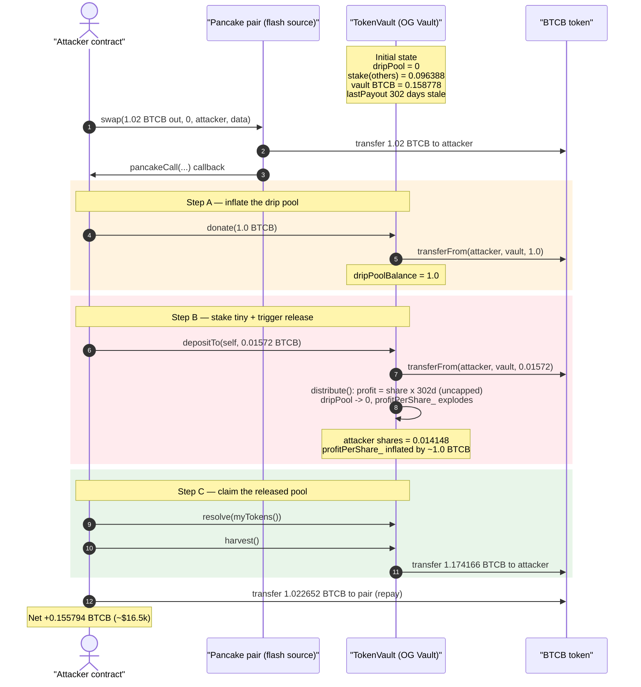
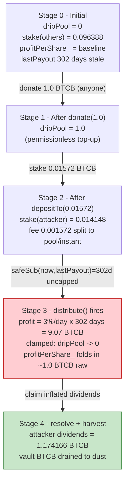
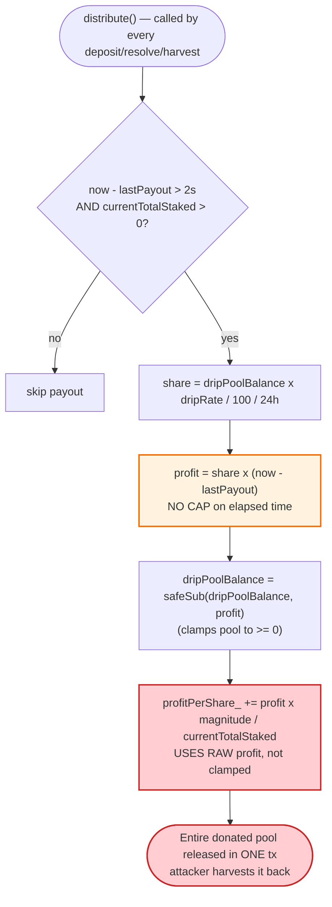

# Gangster Finance "OG Vault" Exploit — Stale `lastPayout` Drip-Pool Drain via Self-`donate()` + `harvest()`

> **Reproduction:** the PoC compiles & runs in an isolated Foundry project at
> [this project folder](.) (the umbrella DeFiHackLabs repo does not whole-compile,
> so this PoC was extracted standalone).
> Full verbose trace: [output.txt](output.txt).
> Verified vulnerable source: [TokenVault.sol](sources/TokenVault_e968D2/TokenVault.sol).

---

## Key info

| | |
|---|---|
| **Loss** | **~0.1558 BTCB ≈ $16.5k** drained from the vault's BTCB reserves |
| **Vulnerable contract** | `TokenVault` ("OG Vaults") — [`0xe968D2E4ADc89609773571301aBeC3399D163c3b`](https://bscscan.com/address/0xe968d2e4adc89609773571301abec3399d163c3b#code) |
| **Victim** | Honest BTCB stakers in the vault (the vault's BTCB balance) |
| **Flash-loan source** | PancakeSwap `BTCB/CAKE_LP`-style pair — `0x0b32Ea94DA1F6679b11686eAD47AA4C6bF38cd59` |
| **Attacker EOA** | [`0xc49f2938327aa2cdc3f2f89ed17b54b3671f05de`](https://bscscan.com/address/0xc49f2938327aa2cdc3f2f89ed17b54b3671f05de) |
| **Attacker contract** | [`0x982769c5e5dd77f8308e3cd6eec37da9d8237dc6`](https://bscscan.com/address/0x982769c5e5dd77f8308e3cd6eec37da9d8237dc6) |
| **Attack tx** | [`0xf34e59e4fe2c9b454d2b73a1a3f3aaf07d484a0c71ff8278b1c068cdedc4b64d`](https://bscscan.com/tx/0xf34e59e4fe2c9b454d2b73a1a3f3aaf07d484a0c71ff8278b1c068cdedc4b64d) |
| **Chain / block / date** | BSC / 51,782,713 / June 2025 |
| **Compiler** | Solidity v0.5.17, optimizer **off** (200 runs metadata) |
| **Bug class** | Broken reward accounting — unbounded time-elapsed drip release with a stale `lastPayout`, combined with a permissionless `donate()` that the donor can immediately reclaim via `harvest()` |

---

## TL;DR

Gangster Finance's `TokenVault` is a yield "vault" where users stake a base token (here **BTCB**) and
earn dividends from a **drip pool** (`dripPoolBalance`). The drip pool is paid out over time inside
`distribute()` using the formula `profit = share × (now − lastPayout)`
([TokenVault.sol:499-507](sources/TokenVault_e968D2/TokenVault.sol#L499-L507)).

The vault had been **idle for ~302 days** — `lastPayout = 1724317950` while the attack block was at
`1750418375`, a gap of **26,100,425 seconds**. There is **no cap** on `(now − lastPayout)`, so the very
next interaction releases an essentially unbounded amount of the drip pool in a single transaction,
clamped only by the size of `dripPoolBalance` itself.

The attacker turned this into a heist with the permissionless `donate()` entry point
([:250-261](sources/TokenVault_e968D2/TokenVault.sol#L250-L261)), which lets *anyone* drop tokens into
`dripPoolBalance` — and crucially, **the donor is not excluded from the distribution of their own
donation.** Inside a single flash-loaned transaction the attacker:

1. **Flash-borrows 1.02 BTCB** from the Pancake pair.
2. **`donate(1.0 BTCB)`** — inflates `dripPoolBalance` to 1.0 BTCB.
3. **`depositTo(self, 0.01572 BTCB)`** — stakes a tiny amount, and the `distribute()` call it triggers
   (with the 302-day stale `lastPayout`) dumps **the entire 1.0+ BTCB drip pool into `profitPerShare_`**.
4. **`resolve(...)` + `harvest()`** — claims the dividends, walking away with **1.174 BTCB** for the
   1.0157 BTCB they put in.
5. **Repays 1.022652 BTCB** to the flash-loan pair.

Net profit = **+0.15579 BTCB (~$16.5k)** — the difference came straight out of the honest stakers'
BTCB held by the vault.

---

## Background — what the OG Vault does

`TokenVault` ([source](sources/TokenVault_e968D2/TokenVault.sol)) is a "stake-and-drip" dividend vault,
a descendant of the classic *Easy/PoWH*-style share-accounting design. Its moving parts:

- **Shares** — depositing the base token (BTCB) mints internal *shares* (`balanceOf_`), minus a 10%
  fee (`divsFee`). Shares are tracked off a global `profitPerShare_` accumulator scaled by
  `magnitude = 2^64`.
- **Drip pool** — `dripPoolBalance` is a reservoir of tokens that is paid out slowly over time. Each
  `distribute()` call releases `dripRate%` (here **3%**) of the pool *per day*, prorated by the elapsed
  time since `lastPayout`, and folds it into `profitPerShare_`.
- **Fees feed the pool** — every deposit/unstake pays a 10% fee, split 1:4 between instant dividends and
  the drip pool (`allocateFees`, [:464-478](sources/TokenVault_e968D2/TokenVault.sol#L464-L478)).
- **`donate()`** — a *permissionless* way to dump tokens directly into `dripPoolBalance`
  ([:250-261](sources/TokenVault_e968D2/TokenVault.sol#L250-L261)).
- **`harvest()`** — pays a holder their accrued dividends and transfers the base token out
  ([:306-329](sources/TokenVault_e968D2/TokenVault.sol#L306-L329)).

On-chain state read at the fork block (`cast call ... --block 51782712`):

| Parameter | Value |
|---|---|
| `dripRate` | **3** (% of pool per day) |
| `currentTotalStaked` (`totalSupply()`) | **0.096387555310360346** shares (the honest stakers) |
| `dripPoolBalance` | **0** |
| `totalBalance()` (vault's BTCB) | **0.158778100854484792 BTCB** |
| `lastPayout` | **1724317950** (≈ Aug 2024) |
| block timestamp | **1750418375** (≈ Jun 2025) |
| **idle gap** | **26,100,425 s ≈ 302 days** |

The two facts that make this exploitable: the vault held real BTCB (0.1588) belonging to other stakers,
and it had not been "dripped" in ~302 days, so `(now − lastPayout)` was enormous and uncapped.

---

## The vulnerable code

### 1. `distribute()` — unbounded time-elapsed drip release

```solidity
function distribute() private {
    uint _currentTimestamp = (block.timestamp);

    // Log a rebase, if it's time to do so...
    if (_currentTimestamp.safeSub(lastRebaseTime) > rebaseFrequency) {
        emit onRebase(totalBalance(), _currentTimestamp);
        lastRebaseTime = _currentTimestamp;
    }

    // If there's any time difference...
    if (SafeMath.safeSub(_currentTimestamp, lastPayout) > payoutFrequency && currentTotalStaked > 0) {

        // Calculate shares and profits...
        uint256 share  = dripPoolBalance.mul(dripRate).div(100).div(24 hours);
        uint256 profit = share * _currentTimestamp.safeSub(lastPayout);   // ⚠️ no cap on elapsed time

        // Subtract from drip pool balance and add to all user earnings
        dripPoolBalance  = dripPoolBalance.safeSub(profit);               // clamps pool to ≥ 0...
        profitPerShare_  = SafeMath.add(profitPerShare_, (profit * magnitude) / currentTotalStaked); // ...but uses RAW profit
        lastPayout       = _currentTimestamp;
    }
}
```
([TokenVault.sol:481-509](sources/TokenVault_e968D2/TokenVault.sol#L481-L509))

`share = dripPoolBalance × 3% / day`. With `(now − lastPayout) ≈ 302 days`, `profit = share × 302d ≈
9.07 BTCB` — far more than the 1.0 BTCB actually in the pool. `dripPoolBalance` is then `safeSub`'d to
**0**, but the **raw (un-clamped) `profit`** is added to `profitPerShare_`. The net effect is that the
*entire* drip pool is released into `profitPerShare_` in one call. The intended slow drip is short-circuited:
a single transaction after a long idle period distributes the whole pool at once.

### 2. `donate()` — anyone can inflate the pool, and is not excluded from it

```solidity
function donate(uint _amount) checkBlock(startBlock) public returns (uint256) {
    // Move the tokens from the caller's wallet to this contract.
    require(token.transferFrom(msg.sender, address(this), _amount));
    // Add the tokens to the drip pool balance
    dripPoolBalance += _amount;             // ⚠️ permissionless reservoir top-up
    emit onDonate(msg.sender, _amount, block.timestamp);
    return dripPoolBalance;
}
```
([TokenVault.sol:250-261](sources/TokenVault_e968D2/TokenVault.sol#L250-L261))

`donate()` is permissionless and pays out to *all current shareholders* via the next `distribute()` —
**including the donor**. Combined with bug #1, a self-donation is immediately reclaimable by the same
actor, because that actor can deposit just before triggering the distribution and `harvest()` just after.

### 3. `harvest()` pays out and transfers the base token

```solidity
function harvest() checkBlock(startBlock) onlyEarners public {
    address _user = msg.sender;
    uint256 _dividends = myEarnings();
    payoutsTo_[_user] += (int256) (_dividends * magnitude);
    token.transfer(_user, _dividends);     // ⚠️ real BTCB leaves the vault
    ...
    distribute();
}
```
([TokenVault.sol:306-329](sources/TokenVault_e968D2/TokenVault.sol#L306-L329))

`myEarnings()` → `dividendsOf()` returns `(profitPerShare_ × balanceOf_[user] − payoutsTo_[user]) /
magnitude` ([:399-401](sources/TokenVault_e968D2/TokenVault.sol#L399-L401)). After the inflated
`profitPerShare_` from step #1, the attacker's tiny stake is worth ~1.16 BTCB of dividends.

---

## Root cause — why it was possible

The exploit composes **three** design decisions:

1. **Unbounded elapsed-time drip.** `distribute()` multiplies the per-second drip rate by the *full*
   `(now − lastPayout)` with no maximum. Any vault that sits idle accumulates an arbitrarily large
   "owed" drip, and the next caller releases all of it at once. The drip pool is meant to bleed out at
   3%/day, but 302 idle days mean the *first* interaction releases >900% of the pool — clamped only by
   `safeSub` to the pool's actual size. A keeper-driven or per-call-capped drip would have prevented this.
2. **Permissionless, self-claimable `donate()`.** Anyone can add to `dripPoolBalance`, and the donation
   is distributed to *current* shareholders — the donor included. There is no exclusion, vesting, or
   "donations only benefit pre-existing stakers" rule. So a donor can sandwich their own donation between
   a `deposit()` (to acquire shares) and a `harvest()` (to reclaim) within one transaction.
3. **The attacker controls the share denominator at distribution time.** Because the honest stake was
   small (0.0964 shares) and the attacker added 0.014148 shares, the released drip was split across
   `currentTotalStaked = 0.1105` shares. The attacker held ~12.8% of shares but, by **timing the
   distribution to fire immediately after their own donate + deposit**, captured the dividend increase
   on their freshly-minted shares — netting far more than they paid in.

In short: the drip release is uncapped, and the thing being released (`donate()`-inflated pool) is
controlled and reclaimable by the attacker. Flash loans make the working capital free, so the attack
is fully self-funded and atomic.

---

## Preconditions

- `currentTotalStaked > 0` — at least one prior staker (the honest victims) so the `profitPerShare_`
  update branch in `distribute()` executes and `safeSub(now, lastPayout) > payoutFrequency` (2 s).
- The vault holds real base-token reserves (`totalBalance() > 0`) — here 0.1588 BTCB — so `harvest()`'s
  `token.transfer()` can actually pay out.
- A large idle gap, so `(now − lastPayout)` makes `profit ≥ dripPoolBalance` (any gap that releases the
  whole donated pool works; 302 days is enormous overkill).
- Working capital in BTCB to `donate()` + `deposit()`; obtained via a **flash swap** from the Pancake
  pair and repaid in the same tx, so the attacker needed **zero** starting capital.

---

## Attack walkthrough (with on-chain numbers from the trace)

All figures are taken directly from the events/storage diffs in
[output.txt](output.txt). The PoC entry is a Pancake flash swap whose
`pancakeCall` callback performs the donate/deposit/resolve/harvest sequence
([test/Gangsterfinance_exp.sol:43-56](test/Gangsterfinance_exp.sol#L43-L56)).

| # | Step | Call | BTCB moved | Vault state after |
|---|------|------|-----------:|-------------------|
| 0 | **Initial** | — | — | dripPool = 0, stake(others) = 0.096388, vault BTCB = 0.158778, lastPayout 302 d stale |
| 1 | **Flash-borrow** | `pair.swap(1.02, 0, attacker, data)` | +1.02 → attacker | attacker now holds 1.02 BTCB |
| 2 | **`donate(1.0)`** | `TokenVault.donate(1e18)` | −1.0 → vault | **dripPoolBalance = 1.0** (slot 12: 0 → 1e18) |
| 3 | **`depositTo(self, 0.01572)`** | `TokenVault.depositTo(attacker, 1.572e16)` | −0.01572 → vault | stake(attacker) = 0.014148; fee 0.001572 → allocateFees; **`distribute()` fires** |
| 3a | ↳ `distribute()` releases the pool | `profit = share×302d ≈ 9.07 BTCB`, clamped: dripPool → **0** | — | **`profitPerShare_` jumps** (raw 9.07 BTCB worth folded in); lastPayout updated to 1750418375 |
| 4 | **`resolve(myTokens())`** | `TokenVault.resolve(0.014148)` | — | unstakes attacker's shares; second `allocateFees`/`distribute` |
| 5 | **`harvest()`** | `TokenVault.harvest()` | **+1.174166 → attacker** | vault BTCB drained from 0.1588+1.0157 down to dust |
| 6 | **Repay flash loan** | `BTCB.transfer(pair, 1.022652)` | −1.022652 → pair | flash swap settled (fee 0.002652) |

Decoded timestamps confirming the stale drip (storage slot 14 / `lastPayout`):
`0x66c700fe (1724317950)` → `0x685543c7 (1750418375)`, a **26,100,425 s ≈ 302-day** jump applied in a
single `distribute()`.

### Profit accounting (BTCB)

| Direction | Amount (BTCB) |
|---|---:|
| Flash-loan received from pair | +1.020000 |
| `donate()` into vault | −1.000000 |
| `depositTo()` into vault | −0.015720 |
| `harvest()` received from vault | +1.174166 |
| Repay to pair (incl. 0.002652 fee) | −1.022652 |
| **Net profit** | **+0.155794** |

The PoC's `balanceLog` confirms it to the wei:

```
Attacker Before exploit BTCB Balance: 0.000000000000000000
Attacker After  exploit BTCB Balance: 0.155793689603387541
```

`0.155794 BTCB × ~$106k/BTC ≈ $16.5k`, matching the PoC header's "Total Lost : 16.5k USD".

The attacker put **1.01572 BTCB** into the vault and pulled **1.174166 BTCB** out — a vault-level extraction
of **+0.158446 BTCB**, funded by the honest stakers' BTCB plus the attacker's own (immediately reclaimed)
donation. The "victim" loss equals the vault's pre-existing reserves the attacker walked off with.

---

## Diagrams

### Sequence of the attack



### Drip-pool / accounting state evolution



### Why the drip release is unbounded



---

## Remediation

1. **Cap the per-call drip release.** Bound `(now − lastPayout)` to one `payoutFrequency`/interval, or
   bound `profit` to a small fraction of `dripPoolBalance`, so a long idle period cannot release the
   whole pool in a single transaction. E.g. `elapsed = min(now - lastPayout, MAX_CATCHUP)`.
2. **Use the clamped profit consistently.** `dripPoolBalance.safeSub(profit)` clamps the pool to ≥ 0,
   but `profitPerShare_` is updated with the *raw* (un-clamped) `profit`. Always distribute exactly the
   amount actually removed from the pool: `released = min(profit, dripPoolBalance)` and use `released`
   for both the pool decrement and the `profitPerShare_` increase.
3. **Make donations benefit only pre-existing stakers / vest them.** A donor should not be able to
   reclaim their own donation. Either exclude the donor from the distribution of their donation, or
   stream donations over a vesting window so a same-block deposit+harvest cannot capture them.
4. **Gate or rate-limit `donate()`-then-`harvest()` cycles.** Require shares to be held for a minimum
   duration before they accrue drip dividends (deposit cooldown), defeating the atomic
   donate → deposit → distribute → harvest pattern.
5. **Drive the drip with a keeper, not "first interaction after idle".** Relying on `lastPayout` being
   recently touched is fragile; an explicit, regularly-called rebase/drip keeper keeps the catch-up term
   small and predictable.

---

## How to reproduce

The PoC was extracted into a standalone Foundry project (the umbrella DeFiHackLabs repo has many
unrelated PoCs that fail to compile under a single `forge test` build):

```bash
_shared/run_poc.sh 2025-06-Gangsterfinance_exp -vvvvv
```

- RPC: a **BSC archive** endpoint is required (fork block 51,782,712). `foundry.toml` uses
  `https://bsc-mainnet.public.blastapi.io`, which serves historical state at that block; the default
  public endpoint (`onfinality`) rate-limits (HTTP 429) and fails the fork.
- Result: `[PASS] testExploit()` with the attacker's BTCB balance going `0 → 0.155793689603387541`.

Expected tail:

```
Ran 1 test for test/Gangsterfinance_exp.sol:Gangsterfinance
[PASS] testExploit() (gas: 437806)
  Attacker Before exploit BTCB Balance: 0.000000000000000000
  Attacker After exploit BTCB Balance: 0.155793689603387541
Suite result: ok. 1 passed; 0 failed; 0 skipped; finished in 10.98s
```

---

*Reference: DeFiHackLabs PoC `src/test/2025-06/Gangsterfinance_exp.sol`. Loss ≈ $16.5k, BSC, June 2025.*
