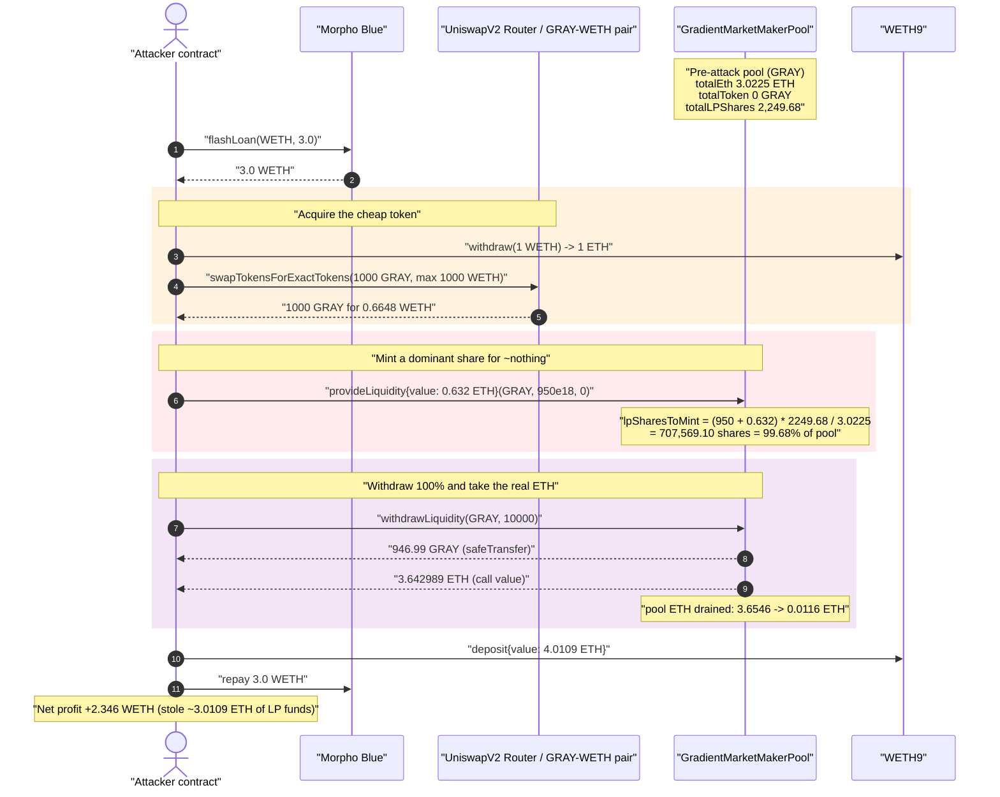
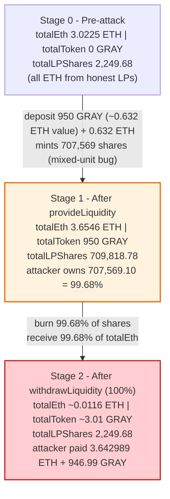
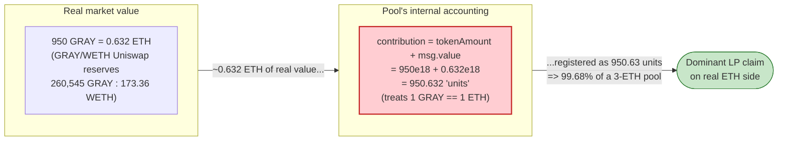

# Gradient Market Maker Pool Exploit — Mixed-Unit LP Share Accounting (ETH wei summed 1:1 with ERC-20 token units)

> **Reproduction:** the PoC compiles & runs in an isolated Foundry project at
> [this project folder](.) (the umbrella DeFiHackLabs repo contains many unrelated
> PoCs that do not whole-compile, so this one was extracted).
> Full verbose trace: [output.txt](output.txt).
> Verified vulnerable source: [contracts_GradientMarketMakerPool.sol](sources/GradientMarketMakerPool_37Ea5f/contracts_GradientMarketMakerPool.sol).

---

## Key info

| | |
|---|---|
| **Loss** | ~$5,000 — **3.0109 ETH** of honest LP liquidity drained from the GRAY pool (PoC nets **2.346 WETH** to the attacker after repaying the flash loan) |
| **Vulnerable contract** | `GradientMarketMakerPool` — [`0x37Ea5f691bCe8459C66fFceeb9cf34ffa32fdadC`](https://etherscan.io/address/0x37Ea5f691bCe8459C66fFceeb9cf34ffa32fdadC#code) |
| **Victim / pool** | Internal per-token liquidity pool for the **GRAY** token (`Gradient`, [`0xa776A95223C500E81Cb0937B291140fF550ac3E4`](https://etherscan.io/address/0xa776A95223C500E81Cb0937B291140fF550ac3E4)) |
| **Registry** | `GradientRegistry` — [`0x893D41635725d8EA6F528D3f3F3DF3E9e8076934`](https://etherscan.io/address/0x893D41635725d8EA6F528D3f3F3DF3E9e8076934) |
| **Attacker EOA** | [`0x1234567a98230550894bf93e2346a8bc5c3b36e3`](https://etherscan.io/address/0x1234567a98230550894bf93e2346a8bc5c3b36e3) |
| **Attacker contract** | [`0xcb4059bb021f4cf9d90267b7961125210cedb792`](https://etherscan.io/address/0xcb4059bb021f4cf9d90267b7961125210cedb792) |
| **Attack tx** | [`0xb5cfa3f86ce9506e2364475dc43c44de444b079d4752edbffcdad7d1654b1f67`](https://etherscan.io/tx/0xb5cfa3f86ce9506e2364475dc43c44de444b079d4752edbffcdad7d1654b1f67) |
| **Chain / block / date** | Ethereum mainnet / fork at **22,765,113** / June 2025 |
| **Compiler** | Solidity v0.8.26, optimizer **1 run** |
| **Bug class** | Broken share accounting — **ETH (wei) summed 1:1 with ERC-20 token base units**, letting a cheap token mint a dominant share of an ETH-funded pool |
| **Post-mortem** | https://t.me/defimon_alerts/1340 |

---

## TL;DR

`GradientMarketMakerPool` is a per-token "market maker" pool where users deposit **ETH + a token**
and receive LP shares. The pool computes everything — LP shares, total liquidity, and per-user
balances — by **adding the raw token amount to the raw `msg.value` (ETH in wei) as if 1 token unit ==
1 wei**:

```solidity
lpSharesToMint = (tokenAmount + msg.value) * pool.totalLPShares / pool.totalLiquidity; // mixed units!
```

GRAY is a low-value ERC-20. At the fork block the GRAY/WETH Uniswap pair priced **950 GRAY ≈ 0.632 ETH**.
But to the pool, depositing 950 GRAY (`950e18` base units) registers as **950.63 "units" of liquidity**,
while the entire honest pool only held **3.02 ETH ≈ 3.02 "units."**

So the attacker:

1. Flash-borrows **3 WETH** from Morpho Blue.
2. Buys **1000 GRAY** on Uniswap for ≈ 0.665 WETH (then uses 950 of it).
3. Calls `provideLiquidity{value: 0.632 ETH}(GRAY, 950e18, 0)` — minting **707,569 LP shares
   = 99.68% of the entire pool** ([:155-162](sources/GradientMarketMakerPool_37Ea5f/contracts_GradientMarketMakerPool.sol#L155-L162)).
4. Immediately calls `withdrawLiquidity(GRAY, 10000)` (100%) — receiving **99.68% of `pool.totalEth`
   = 3.643 ETH** plus 946.99 GRAY back ([:213-216](sources/GradientMarketMakerPool_37Ea5f/contracts_GradientMarketMakerPool.sol#L213-L216)).
5. Re-wraps ETH and repays the 3 WETH flash loan.

Net result: the attacker put in ≈ 0.632 ETH (plus 3.01 GRAY of swap rounding) and pulled out **3.643
ETH**, stealing the **3.0109 ETH** that prior honest LPs had deposited. The `tokenAmount + msg.value`
unit confusion is the entire bug.

---

## Background — what the Gradient pool does

`GradientMarketMakerPool` ([source](sources/GradientMarketMakerPool_37Ea5f/contracts_GradientMarketMakerPool.sol))
is a custom liquidity / market-making vault, one pool per token. Its design intent:

- A **market maker** provides liquidity for a token by sending **ETH + that token** in roughly the
  ratio implied by the token's Uniswap V2 reserves (`provideLiquidity`, [:107-184](sources/GradientMarketMakerPool_37Ea5f/contracts_GradientMarketMakerPool.sol#L107-L184)).
- They receive **LP shares** proportional to their contribution and can later withdraw a percentage
  of the pool (`withdrawLiquidity`, [:189-270](sources/GradientMarketMakerPool_37Ea5f/contracts_GradientMarketMakerPool.sol#L189-L270)).
- A separate `orderbook` contract (gated by the registry) pulls ETH/token out of the pool to fulfil
  orders, and an authorized reward distributor streams fee rewards via `receiveFeeDistribution`
  ([:274-283](sources/GradientMarketMakerPool_37Ea5f/contracts_GradientMarketMakerPool.sol#L274-L283))
  and the `accRewardPerShare` accumulator.

The per-pool and per-user accounting structs ([interface](sources/GradientMarketMakerPool_37Ea5f/contracts_interfaces_IGradientMarketMakerPool.sol)):

```solidity
struct PoolInfo  { uint256 totalEth; uint256 totalToken; uint256 totalLiquidity;
                   uint256 totalLPShares; uint256 accRewardPerShare; uint256 rewardBalance; address uniswapPair; }
struct MarketMaker { uint256 tokenAmount; uint256 ethAmount; uint256 lpShares; uint256 rewardDebt; uint256 pendingReward; }
```

**The on-chain GRAY pool state at the fork block** (recovered from the `PoolInfo` storage slots in the
attack trace, [output.txt:107-115](output.txt)):

| Pool field | Value (pre-attack) |
|---|---:|
| `totalEth` | **3.0225 ETH** ← genuine ETH deposited by prior LP(s) |
| `totalToken` | **0 GRAY** (the prior LP's tokens had been withdrawn/used) |
| `totalLiquidity` | 3.0225 (= 3.0225 ETH + 0 GRAY, mixed units) |
| `totalLPShares` | 2,249.68 |
| GRAY/WETH Uniswap reserves | 260,545 GRAY / **173.36 WETH** |

The key facts: the pool held **3.02 real ETH**, and its **`totalLPShares` (2,249.68) was tiny** —
because the original LP had deposited a small ETH amount plus a (since-removed) modest token amount.
A fresh deposit of 950 GRAY would mint shares against this tiny base.

---

## The vulnerable code

### 1. `provideLiquidity` — LP shares = token amount **plus** ETH, in mixed units

```solidity
// contracts_GradientMarketMakerPool.sol
uint256 expectedTokens = (msg.value * reserveToken) / reserveETH;   // ratio check vs. Uniswap
require(tokenAmount >= (expectedTokens * 99) / 100 &&
        tokenAmount <= (expectedTokens * 101) / 100, "Invalid liquidity ratio");

IERC20(token).safeTransferFrom(msg.sender, address(this), tokenAmount);
...
// Calculate LP shares to mint
uint256 lpSharesToMint;
if (pool.totalLPShares == 0) {
    lpSharesToMint = tokenAmount + msg.value;                       // ⚠️ wei + token base units
} else {
    uint256 totalContribution = tokenAmount + msg.value;           // ⚠️ wei + token base units
    lpSharesToMint = (totalContribution * pool.totalLPShares) / pool.totalLiquidity;
}
...
pool.totalLiquidity += tokenAmount + msg.value;                    // ⚠️ same mixed-unit sum
pool.totalEth       += msg.value;
pool.totalToken     += tokenAmount;
pool.totalLPShares  += lpSharesToMint;
```

Source: [:126-184](sources/GradientMarketMakerPool_37Ea5f/contracts_GradientMarketMakerPool.sol#L126-L184).

The "ratio check" (`tokenAmount` within ±1% of `expectedTokens`) only enforces that the *quantities*
match the Uniswap price ratio. It does **not** prevent the unit confusion: a deposit valued at 0.632
ETH on the open market is recorded as **950.63 units of pool liquidity** because `950e18` token base
units are added straight onto `msg.value` wei.

### 2. `withdrawLiquidity` — ETH paid out proportional to (mis-minted) shares

```solidity
// contracts_GradientMarketMakerPool.sol
uint256 lpSharesToBurn = (mm.lpShares * shares) / 10000;          // shares = 10000 => 100% of attacker LP

uint256 actualTokenWithdraw = (pool.totalToken * lpSharesToBurn) / pool.totalLPShares;
uint256 actualEthWithdraw   = (pool.totalEth   * lpSharesToBurn) / pool.totalLPShares; // ⚠️ pays real ETH
...
IERC20(token).safeTransfer(msg.sender, actualTokenWithdraw);
(bool success, ) = payable(msg.sender).call{value: actualEthWithdraw}("");
```

Source: [:209-262](sources/GradientMarketMakerPool_37Ea5f/contracts_GradientMarketMakerPool.sol#L209-L262).

Because the attacker's mis-minted shares are **99.68% of `totalLPShares`**, this line hands them
**99.68% of the pool's real ETH (`totalEth`)** — the ETH that honest LPs deposited — in exchange for
giving back essentially the same GRAY they put in.

---

## Root cause — why it was possible

The pool treats **ETH and an arbitrary ERC-20 as fungible at a 1:1 base-unit rate** for the purpose of
share accounting. Both ETH and GRAY are 18-decimal, so `tokenAmount + msg.value` doesn't even
overflow or look obviously wrong — but it silently asserts that **1 GRAY == 1 ETH**, which is off by
roughly **3 orders of magnitude** at the real GRAY price.

Concretely, three design decisions compose into a critical bug:

1. **Mixed-unit share minting.** `lpSharesToMint = (tokenAmount + msg.value) * totalLPShares /
   totalLiquidity` — `totalLiquidity` is itself a mixed-unit sum, so the only thing this preserves is
   "your mixed-unit contribution relative to the existing mixed-unit pool." Deposit a large amount of a
   cheap 18-decimal token and you mint a large share for almost no real value.

2. **ETH payout is proportional to shares, not to the value/ETH you contributed.** `withdrawLiquidity`
   pays `totalEth * lpSharesToBurn / totalLPShares`. The honest pool had 3.02 ETH and only 2,249 shares.
   The attacker minted 707,569 shares for 0.632 ETH, then withdrew the pool's ETH pro-rata to those
   inflated shares.

3. **The ratio check is unit-blind.** The `±1%` check ties `tokenAmount` to `msg.value * reserveToken /
   reserveETH`, i.e. to the *quantity ratio* the AMM uses. It never checks that the share-minting math
   and the ratio math use a consistent unit of account. A correct design would either (a) denominate
   shares purely in ETH value (`expectedTokens`-equivalent), or (b) value the token in ETH using the
   Uniswap reserves before summing.

Put differently: the pool's "liquidity" is denominated in a Frankenstein unit of `wei + token-base-units`.
Whoever can cheaply acquire a lot of token-base-units (any holder of a low-priced 18-decimal token) can
mint a dominant claim on the pool's genuinely valuable ETH side.

The flash loan is **not** essential to the vulnerability — it only supplies working capital to buy the
GRAY and provides a clean intra-tx wrapper. The bug is purely in the share/liquidity accounting.

---

## Preconditions

- The GRAY pool is **initialized and already holds real ETH** from prior liquidity providers
  (`pool.totalEth > 0`, `pool.totalLPShares > 0`). Here: 3.02 ETH / 2,249.68 shares.
- The attacker can acquire enough of the cheap token to pass the `±1%` ratio check for a deposit large
  enough to mint a dominant share — i.e., `tokenAmount` ≈ `msg.value * reserveToken / reserveETH`. Buying
  GRAY on Uniswap satisfies this trivially because the pool reads the *same* Uniswap reserves.
- Capital to fund the GRAY buy + the small ETH deposit. Fully recovered intra-transaction, hence
  flash-loanable (the PoC borrows 3 WETH from Morpho Blue at zero fee).

---

## Attack walkthrough (with on-chain numbers from the trace)

All figures are taken directly from the events / storage diffs in [output.txt](output.txt). The
attacker contract is shown in the trace as `GradientPool [0x7FA9385…]` (the Foundry test address);
the real vulnerable contract is `0x37Ea5f…`.

| # | Step | Concrete numbers (from trace) |
|---|------|-------------------------------|
| 0 | **Pre-attack pool state** ([:107-115](output.txt)) | `totalEth` = 3.0225 ETH, `totalToken` = 0 GRAY, `totalLPShares` = 2,249.68 |
| 1 | **Flash loan** 3 WETH from Morpho Blue ([:23-26](output.txt)) | borrow `3.0 WETH` (fee 0) |
| 2 | `weth.withdraw(1e18)` → unwrap 1 WETH to ETH ([:37-43](output.txt)) | hold 1 ETH for the swap + deposit |
| 3 | **Swap WETH → 1000 GRAY** on Uniswap (`swapTokensForExactTokens`) ([:49-79](output.txt)) | spent **0.6648 WETH**, received **1000 GRAY**; pair reserves read **260,545 GRAY / 173.36 WETH** |
| 4 | **`provideLiquidity{value: 0.63209 ETH}(GRAY, 950e18, 0)`** ([:85-116](output.txt)) | `expectedTokens` = 950 ✓ ratio check; **mints 707,569.10 LP shares** (mixed-unit `950+0.632` against tiny pool); pool now `totalEth` 3.6546, `totalToken` 950, `totalLPShares` **709,818.78** |
| 5 | **`withdrawLiquidity(GRAY, 10000)`** — burn 100% of attacker's shares ([:117-135](output.txt)) | burns 707,569.10 shares (**99.68%** of pool); pays **946.99 GRAY** back **and 3.642989 ETH** via `call{value:}` |
| 6 | `weth.deposit{value: 4.0109 ETH}()` to re-wrap, then repay 3 WETH ([:136-148](output.txt)) | flash loan repaid (`transferFrom 3 WETH` to Morpho) |
| 7 | **Final attacker WETH balance** ([:152-156](output.txt)) | **2.546098 WETH** (started 0.2 WETH) |

**The minting math, verified line-for-line against the trace** ([:155-162](sources/GradientMarketMakerPool_37Ea5f/contracts_GradientMarketMakerPool.sol#L155-L162)):

```
contribution      = tokenAmount + msg.value = 950e18 + 0.632090074270700494e18 = 950.632090…  (mixed units)
lpSharesToMint    = contribution * totalLPShares / totalLiquidity
                  = 950.632090… * 2249.676575 / 3.022481813096655
                  = 707,569.102721  LP shares                         ← matches trace lpSharesBurned exactly
attacker's share  = 707,569.10 / (2,249.68 + 707,569.10) = 99.6831%
```

**The withdraw math** ([:213-216](sources/GradientMarketMakerPool_37Ea5f/contracts_GradientMarketMakerPool.sol#L213-L216)):

```
actualEthWithdraw   = totalEth   * lpBurn / totalLPShares = 3.654572 * 707569.10 / 709818.78 = 3.642989 ETH ✓
actualTokenWithdraw = totalToken * lpBurn / totalLPShares = 950.0    * 707569.10 / 709818.78 = 946.989101 GRAY ✓
```

### Profit / loss accounting

| Item | Amount |
|---|---:|
| ETH **into** pool (`provideLiquidity` value) | −0.632090 ETH |
| ETH **out** of pool (`withdrawLiquidity`) | +3.642989 ETH |
| **Net ETH siphoned from the pool** | **+3.010899 ETH** |
| GRAY deposited | −950.000000 GRAY |
| GRAY returned by pool | +946.989101 GRAY |
| GRAY net cost (rounding only) | −3.010899 GRAY (≈ $0) |
| WETH spent buying 1000 GRAY on Uniswap | −0.664801 WETH |
| Attacker WETH balance before / after | 0.200000 → **2.546098 WETH** |
| **Realized attacker profit (WETH)** | **+2.346098 WETH** |

The pool was drained of essentially all of its **3.0109 ETH** of honest liquidity. The gap between the
3.0109 ETH stolen and the 2.346 WETH the attacker keeps is the ≈ 0.665 WETH paid to Uniswap to source
the GRAY (a portion of which it gets back as GRAY value) — i.e. the slippage cost of acquiring the cheap
token used to mint the shares.

---

## Diagrams

### Sequence of the attack



### Pool state evolution



### Why the share math is theft: unit-of-account confusion



---

## Remediation

1. **Never sum ETH (wei) with raw token amounts.** Pick a single unit of account. The cleanest fix is
   to denominate LP shares and `totalLiquidity` purely in **ETH value**: value the deposited token in
   ETH using the Uniswap reserves (the contract already reads them — that's what `expectedTokens` /
   `getReserves` compute) and mint shares against `msg.value + ethValueOfTokens`, never against
   `msg.value + tokenAmount`.

   ```solidity
   // value the token side in ETH before summing
   uint256 tokenEthValue = (tokenAmount * reserveETH) / reserveToken; // == msg.value within the ±1% band
   uint256 contributionEth = msg.value + tokenEthValue;               // single unit: wei
   lpSharesToMint = pool.totalLPShares == 0
       ? contributionEth
       : (contributionEth * pool.totalLPShares) / pool.totalLiquidity; // totalLiquidity also in ETH
   ```

2. **Make `totalLiquidity` and `totalLPShares` consistent with the payout basis.** Withdrawals pay out
   real `totalEth` (and real `totalToken`) pro-rata to shares, so shares must be earned in a unit that
   is consistent with that real-asset basis — otherwise the conversion ratio between "share" and "ETH"
   drifts with the token's price.

3. **Decouple the two asset sides.** A market-maker pool holding both ETH and a token should track and
   redeem each side independently (LP gets back the same *proportion* of ETH and of token they
   contributed), rather than collapsing both into one fungible "liquidity" scalar.

4. **Add an ETH-value invariant check on deposits.** Reject deposits where the share minted would imply
   an ETH claim wildly larger than the ETH actually provided (e.g. `actualEthWithdraw(shares) <=
   msg.value * (1 + ε)` at deposit time).

5. **Treat decimals/price assumptions explicitly.** Even tokens that happen to share 18 decimals with
   ETH are not 1:1 in value; any accounting that adds token units to ETH units is unsound regardless of
   decimals.

---

## How to reproduce

The PoC was extracted into a standalone Foundry project (the umbrella DeFiHackLabs repo has many
unrelated PoCs that fail to compile under `forge test`'s whole-project build). The PoC imports
`../basetest.sol` (+ its `tokenhelper.sol`) and `../interface.sol`, which were copied into the project
root so the relative imports resolve.

```bash
_shared/run_poc.sh 2025-06-GradientMakerPool_exp -vvvvv
```

- RPC: an **Ethereum mainnet archive** endpoint is required (fork block 22,765,113). `foundry.toml`
  uses an Infura archive endpoint; if a key returns 401/429, rotate to a different Infura key.
- Result: `[PASS] testExploit()` with the attacker's WETH balance rising from 0.2 → 2.546098 WETH.

Expected tail:

```
Ran 1 test for test/GradientMakerPool_exp.sol:GradientPool
[PASS] testExploit() (gas: 421388)
Logs:
  Attacker Before exploit WETH Balance: 0.200000000000000000
  Attacker After exploit WETH Balance: 2.546098333159028268

Suite result: ok. 1 passed; 0 failed; 0 skipped
```

---

*Reference: PoC header & DEFIMON post-mortem — https://t.me/defimon_alerts/1340 (GradientMarketMakerPool, Ethereum, ~$5K).*
