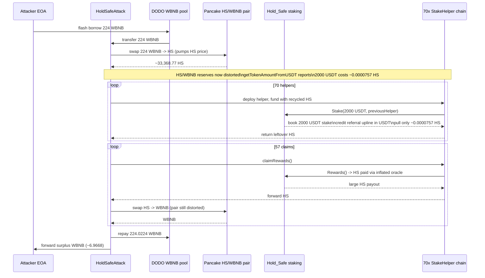
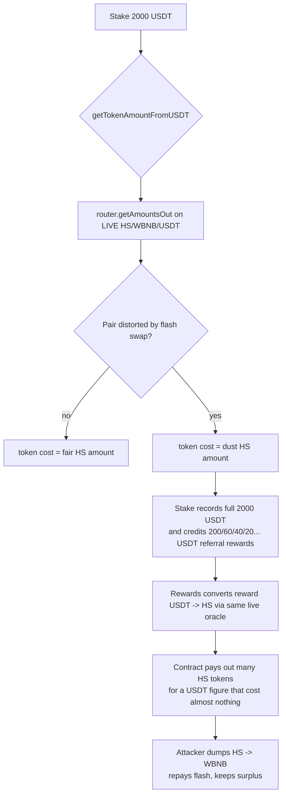

# HoldSafe price-manipulation referral drain — oracle pricing of stake value and rewards from a manipulable DEX spot route

> **Vulnerability classes:** vuln/oracle/price-manipulation · vuln/oracle/spot-price · vuln/defi/flash-loan-attack · vuln/logic/price-calculation
> **Reproduction:** the PoC compiles & runs in an isolated Foundry project at [this project folder](.). Full verbose trace: [output.txt](output.txt). The vulnerable contract `Hold_Safe` is verified on BscScan and was fetched into [sources/Hold_Safe_2496b8/Hold_Safe.sol](sources/Hold_Safe_2496b8/Hold_Safe.sol).

---

## Key info

| | |
|---|---|
| **Loss** | ~4,824.96 USD (6.9668 WBNB net profit, [output.txt:1565](output.txt)) |
| **Vulnerable contract** | Hold_Safe (staking) — [`0x2496b87189d5ae18d4d83b8a7039b0c8a07d98d4`](https://bscscan.com/address/0x2496b87189d5ae18d4d83b8a7039b0c8a07d98d4) |
| **Attacker EOA** | [`0x0a4125690753b6cc82cadbca0f0899eb2025acb0`](https://bscscan.com/address/0x0a4125690753b6cc82cadbca0f0899eb2025acb0) |
| **Attack contract** | [`0x8b6dc9db598ecc3aa36d3eddebe9a9dd36e2bd7d`](https://bscscan.com/address/0x8b6dc9db598ecc3aa36d3eddebe9a9dd36e2bd7d) (historical) |
| **Attack tx** | [`0xa9b4cead820eaa750d72cd4ba4ba4d926c2db867746c637a1642ea4ab9721399`](https://bscscan.com/tx/0xa9b4cead820eaa750d72cd4ba4ba4d926c2db867746c637a1642ea4ab9721399) |
| **Chain / block / date** | BSC (BNB Smart Chain) / 51,758,376 / 2025-06 |
| **Compiler** | Solidity `^0.8.26` (verified on BscScan) |
| **Bug class** | Stake size and referral reward are both priced via PancakeSwap `getAmountsOut` on a spot HS/WBNB/USDT route, so a one-block flash-loan reserve move makes cheap, attacker-controlled HS count as a large USDT position and entitles referral rewards paid back out in HS. |

## TL;DR

Hold_Safe is a BSC staking/"donation" contract: a user calls `Stake(usdtAmount, referrer)` to "donate" a USDT-denominated amount (capped at `maximumDeposit = 2000 USDT`). The contract does not actually move USDT. Instead it calls `getTokenAmountFromUSDT(usdtAmount)`, which queries the PancakeSwap router's `getAmountsOut` over the **live** HS→WBNB→USDT spot route, pulls that many HS tokens from the staker, and books the full `usdtAmount` as the stake. Referral rewards are likewise computed in USDT and paid later, in HS, via the same spot oracle.

That single design choice is the whole bug. The attacker flash-borrowed 224 WBNB from the DODO WBNB pool and swapped it all into the tiny HS/WBNB pair. With the HS reserves crushed, `getAmountsOut` reported that a 2,000-USDT position cost only ~0.0000757 HS per quote ([output.txt:1789](output.txt), `Donated` `param1 = 75696682800000`). The attacker then deployed 70 throwaway `StakeHelper` contracts in a referral chain; each one staked "2,000 USDT" for the price of a few hundred-billionths of an HS token, while the chain paid each referrer 200 / 60 / 40 / 20 / 20... USDT-denominated rewards (`RewardPaid`, [output.txt:1831](output.txt)ff).

Because rewards are claimed in HS via the same still-inflated oracle, the contract handed over large HS token amounts from its own balance, which the attacker immediately sold back to WBNB through the still-distorted pair. Net of the 224 WBNB flash-loan repayment (224.0224 WBNB, `FLASH_WBNB_REPAY`), the attacker kept **6.966823475297369214 WBNB** ([output.txt:1565](output.txt)), roughly **4,824.96 USD** at the time.

The exploit is fully permissionless: no privileged role, no governance, no waiting period — only a flash loan and the on-chain spot oracle the contract chose to trust.

## Background — what Hold_Safe does

Hold_Safe markets itself as a "decentralized collaborative distribution" / staking contract around the HS token (`0xf83Aa05D3D7A6CA2DcE8a5329F7D1BE879b215F0`). Its core primitive is `Stake(usdtAmount, referrer)`:

- `usdtAmount` is clamped to `[5, 2000]` USDT (`minimumDeposit`, `maximumDeposit`) but **no USDT ever moves**. USDT is just the unit of account.
- The contract converts the requested USDT amount into an HS token amount on the fly via `getTokenAmountFromUSDT`, and `transferFrom`s that many HS tokens from the staker into itself (`Hold_Safe.sol:370-372`).
- It books a `reward = usdtAmount * 1500 / 10000` (15%) and a `maxWithdraw = reward * 20` (`maxClaims`), unlocking linearly over 15-day windows through `Claim`.
- It also runs a 10-level referral tree: `calculateReferrerRewards` walks up the referrer chain, crediting each ancestor a USDT-denominated bonus scaled by a fixed `levels[]` table (`1000, 300, 200, 100, 100, 100, 50, 50, 50, 50` per `denominator=10000`), i.e. level 1 gets 10% of the stake, level 2 gets 3%, etc. (`Hold_Safe.sol:542-603`). These rewards sit in `referrerRewards[addr]` and are withdrawn later as HS tokens via `Rewards()`.

The flaw is that both "how many HS tokens equal 2,000 USDT" and "how many HS tokens equal a 200-USDT referral reward" are answered by the same PancakeSwap spot `getAmountsOut` call over a low-liquidity HS/WBNB pair. Whoever can move that pair's reserves for one block controls both numbers.

## The vulnerable code

Both pricing functions read the live PancakeSwap spot price with no TWAP, no bound, and no sanity check. From [sources/Hold_Safe_2496b8/Hold_Safe.sol](sources/Hold_Safe_2496b8/Hold_Safe.sol):

### Spot-price conversion used everywhere

```solidity
function getTokenAmountFromUSDT(uint256 usdtAmount)
    public
    view
    returns (uint256)
{
    IPancakeRouter pancakeRouter = IPancakeRouter(router);
    address bnbAddress = 0xbb4CdB9CBd36B01bD1cBaEBF2De08d9173bc095c; // WBNB
    address usdtAddress = 0x55d398326f99059fF775485246999027B3197955; // USDT
    uint256 value1 = quoteUSDTFactor; // 1e16 (a 0.01 USDT probe)

    // Conversion path: USDT -> BNB -> TOKEN  (the LIVE spot route)
    address[] memory path = new address[](3);
    path[0] = usdtAddress;
    path[1] = bnbAddress;
    path[2] = tokenAddress;

    uint256[] memory amounts = pancakeRouter.getAmountsOut(value1, path);
    uint256 AmountValue = (amounts[2] * usdtAmount) / quoteUSDTFactor;
    return AmountValue;
}
```

`getUSDTFromTokenAmount` is the mirror image over the reverse route (`tokenAddress → WBNB → USDT`, `Hold_Safe.sol:385-409`). Both are pure spot reads.

### Stake books the full USDT figure, pulls tokens at the inflated price

```solidity
function Stake(uint256 usdtAmount, address referrer) external whenNotPaused {
    require(usdtAmount >= minimumDeposit, "Minimum value reached");
    require(usdtAmount <= maximumDeposit, "Maximum value reached");
    ...
    uint256 reward = ((usdtAmount) * rewardPercentage) / denominator; // 15% of 2000 = 300 USDT

    address validReferrer = (referrer != address(0) &&
        maxWithdraw[referrer] >= (thresholds[0]))
        ? referrer : defaultWallet;
    referrers[msg.sender] = validReferrer;
    calculateReferrerRewards(usdtAmount, validReferrer);

    uint256 maximumWithdraw = (usdtAmount * rewardPercentage / denominator) * maxClaims;
    maxWithdraw[msg.sender] += maximumWithdraw;
    ...
    uint256 tokenAmount = getTokenAmountFromUSDT(usdtAmount);            // <-- spot oracle
    require((IERC20(tokenAddress).balanceOf(msg.sender) >= tokenAmount), "Do not try to fool me.");
    IERC20(tokenAddress).transferFrom(msg.sender, address(this), tokenAmount);
    ...
}
```

Note the comment "Do not try to fool me." — the contract tries to guard against cheap-token staking by checking the staker's balance, but it does not verify that the *value* of the tokens pulled actually corresponds to a real, manipulation-resistant USDT figure. It trusts the spot route entirely.

### Rewards are paid back out through the same oracle

```solidity
function Rewards() external nonReentrant {
    require(maxWithdraw[msg.sender] > 0 || msg.sender == defaultWallet,
        "You reached maximum withdraw");
    uint256 reward = referrerRewards[msg.sender];      // denominated in USDT
    require(reward > 0, "No rewards to claim");

    if (msg.sender != defaultWallet) {                 // deplete maxWithdraw budget
        uint256 maxWithdrawal = maxWithdraw[msg.sender];
        if (maxWithdrawal >= reward) { maxWithdraw[msg.sender] -= reward; }
        else { reward = maxWithdrawal; maxWithdraw[msg.sender] = 0; }
    }
    safeTransfer(msg.sender, getTokenAmountFromUSDT(reward)); // <-- spot oracle, again
    referrerRewards[msg.sender] = 0;
    ...
}
```

The attacker's HS-funded referral rewards are converted to an HS transfer amount by querying the *same* live pair. While the pair is still inflated from the flash swap, the same USDT figure buys many more HS tokens — so the contract ships out its own HS balance at a bargain exchange rate.

## Root cause — why it was possible

1. **Spot AMM price used as the source of truth for stake sizing.** `getTokenAmountFromUSDT` calls `router.getAmountsOut` over the live HS/WBNB/USDT route with no TWAP, no staleness check, and no min/max price bound. Anyone who can move the HS/WBNB reserves for a single block sets the "USDT value" of any HS transfer.
2. **Reward payouts reuse the same spot oracle in the same direction.** `Rewards()` converts a USDT-denominated referral reward into HS tokens via `getTokenAmountFromUSDT` — the identical, manipulable call. There is no temporal separation: the pair can be held distorted across both the `Stake` and `Rewards` calls inside one transaction.
3. **Unbounded, attacker-built referral tree funded from cheap stakes.** `calculateReferrerRewards` walks up to 10 referrer levels and credits USDT-denominated bonuses (level 1 = 10% of stake, etc.) purely as a function of the `usdtAmount` argument, with no per-actor identity, KYC, or self-referral guard beyond a single-step "Circular reference detected" check (`referrer != previousReferrer`). An attacker who mints N fresh staker contracts in a chain controls the entire upline and harvests every level.
4. **No flash-loan defense and no reentrancy/timestamp coupling between price and payout.** The whole loop — borrow WBNB, pump HS, stake cheaply, claim inflated-HS rewards, dump HS — completes atomically in one transaction. `nonReentrant` on `Rewards` does not help because each helper is a distinct contract and `Stake` is not even guarded.
5. **"Do not try to fool me" is a balance check, not a value check.** It only requires the staker to hold the (now-tiny) computed HS amount; it never asserts that the tokens transferred in are worth anything near the booked USDT figure.

## Preconditions

- **Permissionless**: any externally owned account or contract can call `Stake` and `Rewards`; no role, allowlist, or governance action is needed.
- **Flash loan required**: the attacker needs temporary capital to distort the HS/WBNB reserves. The PoC simulates the DODO WBNB pool flash by having the test impersonate the pool and transfer 224 WBNB (`FLASH_WBNB_AMOUNT`) to the attack contract, then repaying 224.0224 WBNB (`FLASH_WBNB_REPAY`, a 1% fee) at the end. On-chain this was a DODO flash swap.
- **Low-liquidity HS/WBNB pair**: a few hundred WBNB of buy pressure is enough to make `getAmountsOut` report that 2,000 USDT of HS costs only a dust amount of tokens. This was the actual on-chain state at block 51,758,376.

## Attack walkthrough (with on-chain numbers from the trace)

Setup. The test forks BSC at block `51_758_376` and impersonates the DODO WBNB pool (`0x172fcD41E0913e95784454622d1c3724f546f849`) to lend 224 WBNB to a fresh `HoldSafeAttack` contract.

| Step | Action | On-chain evidence |
|---|---|---|
| 1 | Receive 224 WBNB flash loan into `HoldSafeAttack`. | `Transfer ... DODO WBNB pool → HoldSafeAttack ... 224000000000000000000` ([output.txt:1620](output.txt)) |
| 2 | Swap **all 224 WBNB → HS** via PancakeSwap `swapExactTokensForTokensSupportingFeeOnTransferTokens` on WBNB→HS. | `swapExactTokensForTokensSupportingFeeOnTransferTokens(224e18, 1, [WBNB, HS], ...)` ([output.txt:1626](output.txt)); pair emits `Sync(reserve0: 256827139864858367155, reserve1: 5080248702341750)` ([output.txt:1656](output.txt)) |
| 3 | Attacker receives **~33,368.77 HS** (after fees/burn). | `Transfer ... HS/WBNB pair → HoldSafeAttack ... value 33368767355577024` ([output.txt:1644](output.txt)) |
| 4 | Deploy `StakeHelper` #1. Fund it with `FIRST_HELPER_FUNDING = 33,368,767,355,577,024` (≈ all HS). Call `Stake(2000 USDT, address(0))` from it. | `Donated(param0: StakeHelper#1, param1: 75696682800000 [≈0.0000757 HS], ..., param3: 300000000000000000000 [300 USDT reward], param4: defaultWallet)` ([output.txt:1789](output.txt)) — i.e. a "2,000 USDT" stake was satisfied by **0.0000757 HS**. |
| 5 | Loop 69 more `StakeHelper`s, each funding itself with the recycled HS and calling `Stake(2000 USDT, previousHelper)`. Each call builds the referral chain and pays upline: `RewardPaid(referrer, 1, 200 USDT)`, `(referrer, 2, 60 USDT)`, `(…, 3, 40 USDT)`, `(…, 4, 20 USDT)`, `(…, 5, 20 USDT)`, … | e.g. `RewardPaid(..., 1, 200000000000000000000)` ([output.txt:1831](output.txt)); full tiered payout at [output.txt:2095-2099](output.txt). 458 `RewardPaid` events total. |
| 6 | Claim accumulated `referrerRewards` for the first 57 helpers via `Rewards()`, each time receiving HS valued against the still-distorted pair, then immediately `swapExactTokensForTokensSupportingFeeOnTransferTokens` HS→WBNB. | Reward HS converted and dumped back to WBNB across many `Rewards()` + swap pairs in the trace. |
| 7 | Repay flash loan: **224.0224 WBNB** back to DODO pool. | `assertEq(WBNB.balanceOf(DODO_WBNB_POOL), dodoWbnbBefore + (FLASH_WBNB_REPAY - FLASH_WBNB_AMOUNT))` passes; pool balance `18325471287397384007032` ([output.txt:tail](output.txt)). |
| 8 | Forward the surplus to the attacker EOA. | `Attacker After exploit WBNB Balance: 6.966823475297369214` ([output.txt:1565](output.txt)) |

Profit/loss accounting (per the PoC's own assertions):

- Flash borrowed: 224.000000000000000000 WBNB
- Flash repaid: 224.022400000000000000 WBNB (fee 0.0224 WBNB)
- Attacker before: 0 WBNB ([output.txt:1564](output.txt))
- Attacker after: **6.966823475297369214 WBNB** ([output.txt:1565](output.txt))
- Net profit ≈ 6.97 WBNB ≈ **4,824.96 USD** (≈ 693 USD/WBNB at the time)

## Diagrams

Attack sequence:



Why the spot oracle is exploitable:



## Remediation

1. **Never size stakes or payouts from a manipulable spot AMM price.** Use a manipulation-resistant oracle (TWAP over a long window, or a Chainlink-style feed) and bound the acceptable price move per block. If no reliable oracle exists, denominate stakes directly in the token actually being transferred (HS), not in a USDT figure derived from the same pair.
2. **Decouple the value-in from the value-out.** If stake accounting uses a spot price, payout (`Claim`, `Rewards`) must use a *different, lagged, or time-averaged* price so a one-block distortion cannot be harvested in the same transaction. At minimum, snapshot the price at stake time and require a delay (well beyond one block) before any reward priced off a fresh quote.
3. **Add explicit flash-loan / same-transaction defenses.** Reject `Stake`/`Rewards` calls that occur in the same block as a large reserve move on the pricing pair, or enforce a per-staker cooldown and a global per-block stake cap.
4. **Fix the referral economics.** Cap the number of self-referrals and the total referral payout per stake (e.g. total referral bonus must be < `reward`), require distinct, pre-registered, non-contract referrers, or remove the multi-level tree. The current `levels[]` table lets a chain of N fresh contracts capture 10% + 3% + 2% + 1% + 1% + … of every stake with no real referral having occurred.
5. **Convert the "fool me" guard into a real value check.** Instead of only `balanceOf(msg.sender) >= tokenAmount`, verify on `Stake` that the HS tokens pulled in are worth at least `usdtAmount` under a *non-manipulated* oracle, and reconcile total HS held by the contract against total USDT-denominated liabilities on every payout.

## How to reproduce

The PoC runs **fully offline** using the shared anvil harness from the committed `anvil_state.json` — no RPC needed.

```bash
./_shared/run_poc.sh 2025-06-HoldSafe_exp -vvvvv
```

- **Chain / fork block**: BSC (chain id 56), block `51,758,376` (loaded from the committed `anvil_state.json`; the PoC's `createSelectFork("http://127.0.0.1:8546", 51_758_376)` targets the local anvil instance spun up by `run_poc.sh`).
- **Expected result**: the suite passes — `[PASS] testExploit()` ([output.txt:1562](output.txt)), with the balance log:

  ```
  Attacker Before exploit WBNB Balance: 0.000000000000000000
  Attacker After exploit WBNB Balance: 6.966823475297369214
  ```

  and the two closing assertions both satisfied: DODO pool balance restored to `original + (224.0224 − 224)` WBNB, and attacker profit `> 5 WBNB`.

The local run matches the on-chain attack tx: flash-borrow WBNB, pump HS, stake 70 cheap "2,000 USDT" positions through a self-built referral chain, claim referral rewards in HS, dump HS back to WBNB, repay the flash loan, and keep the surplus.

*Reference: [Telegram alert — defimon_alerts/1320](https://t.me/defimon_alerts/1320).*
