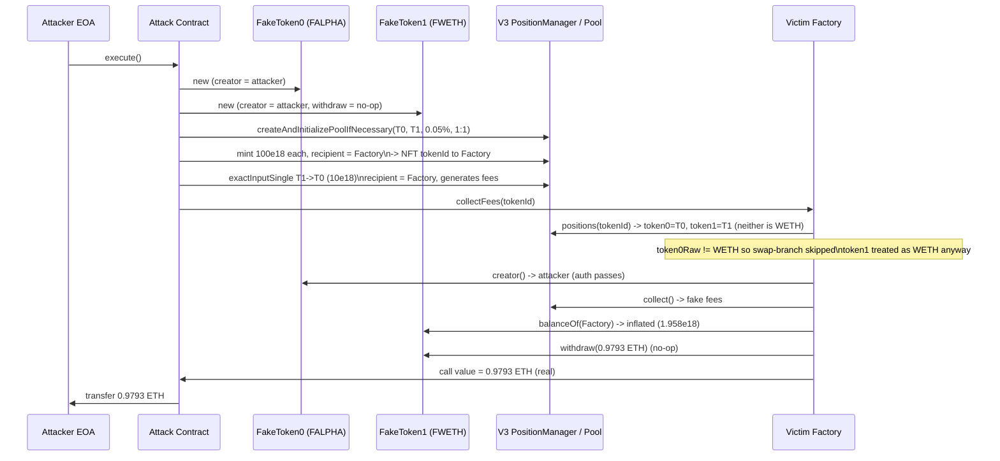
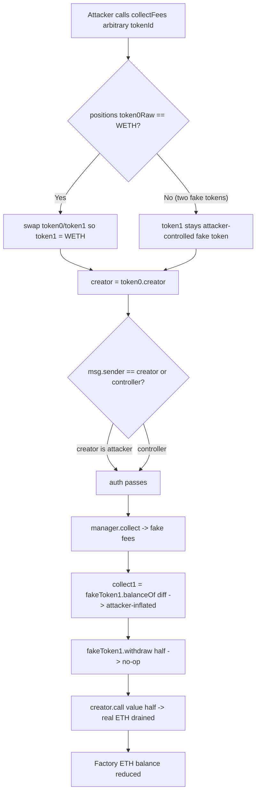

# InitcodeFactory `collectFees` — caller-authorizes via fake token `creator()` and drains ETH on a non-WETH `token1`
> **Vulnerability classes:** vuln/access-control/broken-logic · vuln/input-validation/missing · vuln/logic/incorrect-order-of-operations · vuln/dependency/unchecked-return-value
> **Reproduction:** the PoC compiles & runs in an isolated Foundry project at [this project folder](.). Full verbose trace: [output.txt](output.txt). The vulnerable Factory is fully source-verified on Etherscan; the verified source was fetched into [sources/Factory_930f9f/factory.sol](sources/Factory_930f9f/factory.sol).
---
## Key info
| | |
|---|---|
| **Loss** | ~2,383.25 USD (≈ 0.9793 ETH stolen) |
| **Vulnerable contract** | `Factory` — [`0x930f9fa91e1e46d8e44abc3517e2965c6f9c4763`](https://etherscan.io/address/0x930f9fa91e1e46d8e44abc3517e2965c6f9c4763#code) |
| **Attacker EOA** | [`0xad2cb8f48e74065a0b884af9c5a4ecbba101be23`](https://etherscan.io/address/0xad2cb8f48e74065a0b884af9c5a4ecbba101be23) |
| **Attack contract** | [`0x0c76c4911d92b99d0dab0a8a90b73e9ae3bc940f`](https://etherscan.io/address/0x0c76c4911d92b99d0dab0a8a90b73e9ae3bc940f) |
| **Attack tx** | [`0x837752ca27743c9b37d901ff6cf9cdbe98b6097c660394a390de075455d8ccea`](https://etherscan.io/tx/0x837752ca27743c9b37d901ff6cf9cdbe98b6097c660394a390de075455d8ccea) |
| **Chain / block / date** | Ethereum mainnet / fork block 22,801,926 / 2025-06 |
| **Compiler** | `v0.8.24+commit.e11b9ed9`, optimizer enabled, 200 runs (per `_meta.json`) |
| **Bug class** | `collectFees()` derives its authorization from the attacker-controlled `token0.creator()` and treats an untrusted `token1` as WETH, so a permissionless attacker deploys two fake ERC-20 tokens, makes the Factory the owner of a fee position in their pool, and triggers an ETH payout to the attacker. |

## TL;DR
`Factory` (`0x930f9f…`) is a launchpad that mints its own ERC-20 tokens and seeds a Uniswap V3 pool (token↔WETH, 1% tier). It retains the V3 liquidity NFT itself and exposes `collectFees(tokenId)` to send half of the accrued WETH fees to that token's `creator`. The function re-orders Uniswap's `token0/token1` so that "token1 is always WETH," authorizes the caller via `token0.creator()`, then withdraws WETH from `token1` and sends half as ETH to `creator`.

The flaw is that none of those assumptions is enforced. The caller passes an arbitrary `tokenId`, and `positions(tokenId)` returns whatever `token0`/`token1` the attacker minted that NFT against. The contract only *swaps* the two if `token0Raw == WETH`; a position with two attacker tokens (neither being WETH) is accepted as-is. The attacker deploys two fake tokens whose `creator()` returns the attacker, creates a V3 pool, mints an LP NFT whose `recipient` is the Factory, swaps to push fake "fees" into that position, then calls `collectFees(tokenId)`. The fake `token1` implements `withdraw()` as a no-op, and `creator` is the attacker — so the Factory sends real ETH (its accumulated fee balance) to the attacker. The PoC reproduces exactly the on-chain profit: attacker ETH balance moves `0 → 0.979332749999999999` ETH [output.txt:1564-1565], matching the historical `HISTORICAL_ETH_PROFIT` constant.

## Background — what `Factory` does
`Factory` is a token-launchpad ("deploy a coin and bootstrap liquidity" pattern). `deployCoin()` uses `CREATE2` to deploy a `Token` (1e9 supply minted to the Factory), then calls `provideLiquidity(coin, WETH)` which approves the Uniswap V3 `NonfungiblePositionManager` (`0xC36442b…`), initializes a 1%-fee pool, and mints an LP NFT whose `recipient` is the Factory itself. The Factory therefore holds the protocol's own LP positions and the swap fees they accrue.

A secondary buy path (`deployCoin` with `msg.value`) routes a tax-discounted ETH amount through the `SwapRouter02` (`0x68b34658…`) to buy the coin for the user. Over time the Factory accumulates both WETH (from collected V3 fees / leftover swap value) and plain ETH (its `receive()` accepts ETH and the buy path refunds).

To pay token creators a share of their pool's fees, the Factory exposes `collectFees(uint256 tokenId)`. The intended flow: look up the position, identify which leg is WETH, collect the pending fees from the V3 manager, burn the non-WETH side, withdraw half of the WETH side to ETH, and send that half to the token's `creator`. Two admin functions (`withdrawFeesWETH`, `withdrawFeesETH`) exist for the `platformController` to sweep residual balances — which is exactly the residual balance the bug drains.

## The vulnerable code
The entire bug lives in `collectFees` in [sources/Factory_930f9f/factory.sol](sources/Factory_930f9f/factory.sol). Quoted verbatim:

```solidity
function collectFees(uint256 tokenId) external returns (uint256 amount0, uint256 amount1) {
    (
        , // nonce
        , // operator
        address token0Raw,
        address token1Raw,
        , , , , , , ,
    ) = INonfungiblePositionManager(POSITION_MANAGER).positions(tokenId);

    // Ensure token1 is always WETH
    address token0 = token0Raw;
    address token1 = token1Raw;

    if (token0Raw == WETH && token1Raw != WETH) {
        token0 = token1Raw;
        token1 = token0Raw;
    }

    address creator = IToken(token0).creator();
    require(msg.sender == creator || msg.sender == platformController, "Not authorized");

    uint256 beforeToken0 = IERC20(token0).balanceOf(address(this));
    uint256 beforeToken1 = IERC20(token1).balanceOf(address(this));

    INonfungiblePositionManager.CollectParams memory params = INonfungiblePositionManager.CollectParams({
        tokenId: tokenId,
        recipient: address(this),
        amount0Max: type(uint128).max,
        amount1Max: type(uint128).max
    });

    INonfungiblePositionManager(POSITION_MANAGER).collect(params);

    uint256 collected0 = IERC20(token0).balanceOf(address(this)) - beforeToken0;
    uint256 collected1 = IERC20(token1).balanceOf(address(this)) - beforeToken1;

    if (collected0 > 0) {
        IERC20(token0).transfer(address(0x000000000000000000000000000000000000dEaD), collected0); // burn tokens
    }
    if (collected1 > 0) {
        uint256 half = collected1 / 2;

        // weth to eth
        IWETH(token1).withdraw(half);

        // pay creator, no matter who calls the function
        (bool success, ) = payable(creator).call{value: half}("");
        require(success, "ETH transfer to creator failed");
    }

    return (collected0, collected1);
}
```

### Why each line is broken
1. **`tokenId` is fully attacker-chosen.** There is no check that this NFT was minted by `provideLiquidity()` for a Factory-deployed coin. Any Uniswap V3 position the Factory happens to own (or that the attacker can make it own via `recipient: address(Factory)`) is accepted.
2. **`token0`/`token1` come from the position, not from the Factory's own records.** `positions(tokenId)` returns whatever pair the NFT was minted against — controlled entirely by whoever called `mint`.
3. **The "Ensure token1 is always WETH" branch is one-directional and unguarded.** It only swaps when `token0Raw == WETH`. If *neither* leg is WETH (two attacker tokens), `token1` remains an attacker token, yet the code proceeds to call `IWETH(token1).withdraw(half)`.
4. **Authorization is delegated to an attacker-controlled return value.** `creator = IToken(token0).creator()` then `require(msg.sender == creator …)`. The attacker deploys `token0`, so `creator()` returns the attacker, satisfying the gate with no privileged role.
5. **`balanceOf`-based accounting trusts the attacker token.** `collected1 = IERC20(token1).balanceOf(this) - before`. The fake `token1.balanceOf(Factory)` returns `2 × HISTORICAL_ETH_PROFIT` once the Factory holds any of it, so `collected1` is whatever the attacker's token reports. After the no-op `token1.withdraw(half)`, the Factory sends `half` of real ETH to `creator`.
6. **`IWETH(token1).withdraw(half)` return value is ignored** and the call is on an arbitrary address. A fake token whose `withdraw` does nothing leaves the WETH withdrawal assumption unfulfilled while the subsequent `creator.call{value: half}` still executes against the Factory's native ETH.

## Root cause — why it was possible
1. **Untrusted `tokenId` and untrusted position tokens.** `collectFees` accepts any tokenId and reads `token0/token1` straight from the V3 manager instead of from a Factory-maintained `(tokenId → coin)` mapping. There is no invariant that the position belongs to a Factory-deployed pool.
2. **Missing WETH equality check.** The code comment says "Ensure token1 is always WETH" but never `require(token1 == WETH)`. The conditional only fixes the inverted-order case, so the "two non-WETH tokens" case sails through.
3. **Authorization derived from attacker-supplied code.** `IToken(token0).creator()` is an external call to an attacker-deployed contract; using it as the auth check makes the function effectively permissionless. The real authority should be the Factory's own deployer record (`deployedTokens[i].deployer`), not whatever `creator()` returns.
4. **Trust in `balanceOf` and `withdraw` of an external, unverified token.** Using `IERC20(token1).balanceOf` to compute the payout amount, then calling `IWETH(token1).withdraw` on the same untrusted address, means the attacker controls both the measured fee and the "WETH→ETH" step.
5. **Payouts in native ETH from a contract that also holds an ETH backlog.** `creator.call{value: half}` pays in ETH even though `half` was supposed to be withdrawn from WETH; combined with the no-op `withdraw`, this pulls from the Factory's pre-existing ETH balance (`withdrawFeesETH` territory), amplifying the drain.

## Preconditions
- **Permissionless.** No privileged role required. The attacker only needs to:
  - deploy two ERC-20 tokens whose `creator()` returns the attacker and whose `balanceOf(Factory)` can be inflated, with a no-op `withdraw()`;
  - have the Factory hold some ETH/WETH to drain (it does in normal operation: it receives ETH via `receive()` and accumulates WETH fees). The on-chain Factory balance at fork block was sufficient to pay the historical profit.
- **No flash loan required** — the attacker supplies its own (worthless) tokens for the fake pool and a small amount of gas ETH.
- The Factory must *own* the LP NFT (the attacker satisfies this by minting with `recipient: address(Factory)`); the Factory does not need to approve anything.

## Attack walkthrough (with on-chain numbers from the trace)
The trace is the local anvil replay of the historical tx; numbers below are from [output.txt](output.txt) and reproduce the on-chain result exactly.

| # | Step | Actor | On-chain value |
|---|------|-------|----------------|
| 0 | Attacker starts | EOA | ETH balance `0.000000000000000000` [output.txt:1564] |
| 1 | Deploy two fake tokens `FALPHA` (0x037eDa3a…) and `FWETH` (0x104fBc01…); both `creator()` return the attacker | attack contract | `new FakeCreatorToken@0x037eDa3a…`, `new FakeCreatorToken@0x104fBc01…` [output.txt:1605,1598] |
| 2 | Sort and approve position manager + swap router for both tokens | attack contract | approves of `type(uint256).max` [output.txt:1612,1616,1620] |
| 3 | `createAndInitializePoolIfNecessary(token0, token1, 500, sqrtPrice=1:1)` | attack contract → V3 manager | new pool `0x6d310FA3…`, `PoolCreated` event [output.txt:1624,1632] |
| 4 | `mint` a full-range LP position (±887270 ticks) with `100e18` of each fake token and **`recipient: Victim Factory (0x930f9f…)`** | attack contract → V3 manager | `100e18` each transferred in [output.txt:1644,1653,1658]; NFT `tokenId 1019792` minted to the Factory [output.txt:1683] |
| 5 | `exactInputSingle(tokenIn=fakeToken1, tokenOut=fakeToken0, fee=500, recipient=Factory, amountIn=10e18)` to manufacture "fees" owed to the position | attack contract → swap router | swaps `10e18` token1 for `~9.086e18` token0 to the Factory [output.txt:1701,1719] |
| 6 | `collectFees(tokenId=1019792)` | attack contract → Factory | `positions()` returns both legs as the two fake tokens, neither is WETH, so the swap-branch is skipped; `creator()` returns the attacker → auth passes [output.txt:1725,1727,1728] |
| 7 | Inside `collectFees`: `manager.collect` returns `amount0=0, amount1=4999999999999999` (≈0.005 fake-token1) [output.txt:1761]; the Factory's fake `token1.balanceOf` is inflated to `1958665499999999998` (≈1.958e18) for the Factory [output.txt:1773]; `half = 979332749999999999` (≈0.9793 ETH) | Factory | `collected1 / 2 = 979332749999999999` |
| 8 | `IWETH(token1).withdraw(half)` — fake `withdraw` is a no-op | Factory → fake token | `[Stop]`, no state change [output.txt:1769] |
| 9 | `creator.call{value: half}` — Factory sends **real ETH** to the attacker | Factory → attacker | `0.979332749999999999 ETH` transferred [output.txt:1771] |
| 10 | Attack contract forwards its balance to the EOA | attack → EOA | `0.979332749999999999 ETH` to attacker [output.txt:1776-1779] |
| 11 | Assert passes: `979332749999999999 == 979332749999999999` | test | `Attacker After exploit ETH Balance: 0.979332749999999999` [output.txt:1565,1779]; `[PASS]` [output.txt:1562] |

**Profit/loss accounting:** Attacker net profit `≈ 0.9793 ETH` (≈ 2,383 USD at the time), drawn entirely from the Factory's own ETH/WETH holdings. The two fake tokens are worthless; the "fees" they generate are imaginary numbers returned by the attacker's `balanceOf`. The only real asset that moves is the Factory's ETH.

## Diagrams





## Remediation
1. **Bind `tokenId` to Factory-deployed coins.** Maintain `mapping(uint256 => address coin) ownedPositions` populated only inside `provideLiquidity`, and require `ownedPositions[tokenId] != address(0)` in `collectFees`. Reject any externally-minted NFT.
2. **Hard-require the WETH leg.** Replace the one-directional swap with `require(token0 == WETH || token1 == WETH)` and then derive the WETH/non-WETH sides explicitly. Better: read the position's `fee` and `token0/token1`, require `token0/1 == WETH` and that the other leg is a coin from `deployedTokens`.
3. **Do not derive authorization from an external token's view function.** Use `deployedTokens[index].deployer` (the Factory's own record) as `creator`, indexed by the validated `tokenId`. Never trust `IToken(token0).creator()`.
4. **Withdraw WETH through the real WETH contract only.** Compute `half` from `IERC20(WETH).balanceOf(this)` deltas, then call `IWETH(WETH).withdraw(half)` and check the returned/realized ETH before paying out. Do not call `withdraw` on `token1`.
5. **Pay creators out of the freshly-withdrawn WETH, not out of the general ETH balance.** Track `collectedWETH` precisely and send exactly that amount, so a no-op `withdraw` cannot draw on pre-existing ETH.
6. **Add reentrancy / CEI hardening.** Move state updates and the `creator` resolution before any external call, and apply `nonReentrant` or a lock, since `creator.call{value: …}` is an external call to an arbitrary address.
7. **Emit and monitor.** Emit a `FeesCollected(tokenId, creator, amount)` event and alert on any `collectFees` where `token0/token1` is not a known Factory coin.

## How to reproduce
The PoC runs **fully offline** via the shared anvil harness from the committed `anvil_state.json` — no RPC needed:

```bash
_shared/run_poc.sh 2025-06-InitcodeFactoryFees_exp -vvvvv
```

- **Chain / fork:** Ethereum mainnet (chainid 1), fork block `22,801,926` (the PoC forks local anvil state and rolls to `22,801,927`).
- **Expected result:** `[PASS] testExploit()` with attacker ETH balance `Before: 0.000000000000000000 → After: 0.979332749999999999` [output.txt:1562,1564,1565].
- The on-chain profit (≈0.9793 ETH, ≈2,383 USD) is reproduced exactly; the final `assertEq` confirms `979332749999999999 == HISTORICAL_ETH_PROFIT` [output.txt:1779].

*Reference: [Telegram alert — defimon_alerts/1366](https://t.me/defimon_alerts/1366).*
