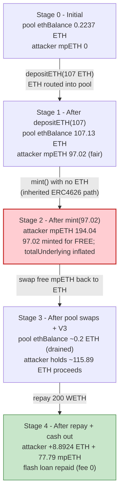
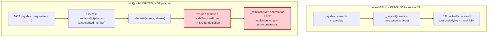

# Meta Pool (mpETH) Exploit — Free `mint()` on a Native-ETH ERC4626 Vault

> **Vulnerability classes:** vuln/logic/incorrect-state-transition · vuln/access-control/missing-check · vuln/data/uninitialized

> **Reproduction:** the PoC compiles & runs in an isolated Foundry project at
> [this project folder](.) (the umbrella DeFiHackLabs repo contains many unrelated
> PoCs that do not whole-compile, so this one was extracted).
> Full verbose trace: [output.txt](output.txt).
> Verified vulnerable sources: [contracts_Staking.sol](sources/Staking_374748/contracts_Staking.sol)
> (the mpETH token / staking vault) and
> [contracts_LiquidUnstakePool.sol](sources/LiquidUnstakePool_ea9fec/contracts_LiquidUnstakePool.sol)
> (the mpETH→ETH swap pool).

---

## Key info

| | |
|---|---|
| **Loss** | PoC measured profit: **8.892 ETH** in cash **+ 77.79 mpETH** (≈ 85.8 ETH @ 1.1029 ETH/mpETH) ≈ **~94.7 ETH per attack tx**. Header tag reads "25k USD"; the broader Meta Pool incident was reported at ~$27M across multiple drains (see post-mortem). |
| **Vulnerable contract** | `Staking` (mpETH) — proxy [`0x48AFbBd342F64EF8a9Ab1C143719b63C2AD81710`](https://etherscan.io/address/0x48AFbBd342F64EF8a9Ab1C143719b63C2AD81710#code), impl at exploit block `0x3747484567119592ff6841df399cf679955a111a` |
| **Victim swap pool** | `LiquidUnstakePool` (mpETH/ETH) — proxy [`0xdF261F967E87B2aa44e18a22f4aCE5d7f74f03Cc`](https://etherscan.io/address/0xdF261F967E87B2aa44e18a22f4aCE5d7f74f03Cc#code) |
| **Attacker EOA** | [`0x48f1d0f5831eb6e544f8cbde777b527b87a1be98`](https://etherscan.io/address/0x48f1d0f5831eb6e544f8cbde777b527b87a1be98) |
| **Attacker contract** | [`0xff13d5899aa7d84c10e4cd6fb030b80554424136`](https://etherscan.io/address/0xff13d5899aa7d84c10e4cd6fb030b80554424136) |
| **Attack tx** | [`0x57ee419a001d85085478d04dd2a73daa91175b1d7c11d8a8fb5622c56fd1fa69`](https://etherscan.io/tx/0x57ee419a001d85085478d04dd2a73daa91175b1d7c11d8a8fb5622c56fd1fa69) |
| **Chain / block / date** | Ethereum mainnet / fork at 22,722,910 / June 17, 2025 |
| **Compiler** | Solidity v0.8.4, optimizer 200 runs |
| **Bug class** | ERC4626 accounting: inherited `mint()` mints shares without collecting assets on a native-ETH (non-`transferFrom`) vault |

---

## TL;DR

`Staking` is Meta Pool's liquid-staking vault. mpETH is its ERC4626 share token, but the asset is
**native ETH**, not the ERC20 `_asset` (WETH) that OpenZeppelin's `ERC4626Upgradeable` assumes. To
support native ETH, Meta Pool **overrode `_deposit`** so it stops pulling assets via
`safeTransferFrom` and instead consumes the ETH that arrived as `msg.value`
([contracts_Staking.sol:355-380](sources/Staking_374748/contracts_Staking.sol#L355)).

The fatal omission: they left the inherited **`mint(uint256 shares, address receiver)`** entry point
untouched ([ERC4626Upgradeable.sol:143-150](sources/Staking_374748/openzeppelin_contracts-upgradeable_token_ERC20_extensions_ERC4626Upgradeable.sol#L143)).
The OZ `mint()` computes `assets = previewMint(shares)` and calls the overridden
`_deposit(caller, receiver, assets, shares)` — but `mint()` is **not payable**, so `msg.value == 0`,
and the override never transfers anything in. The result: anyone can call `mint(shares, self)` and
receive freshly-minted mpETH **for free**, while `totalUnderlying` is even bumped up by the phantom
`assets`, papering over the theft.

The attacker monetized this by:

1. Flash-borrowing 200 WETH from Balancer.
2. Doing one **legitimate** `depositETH{value: 107 ETH}` → 97.02 mpETH (fair, at 1.1029 ETH/mpETH).
3. Calling **`mint(97.02 mpETH, self)`** → another **97.02 mpETH minted for 0 ETH**.
4. Swapping the mpETH back to ETH through the `LiquidUnstakePool` (and a small leg through Uniswap V3),
   pulling out the very ETH its own deposit had just cycled into the pool, plus the free shares.
5. Repaying the 200 WETH flash loan and walking away with **8.892 ETH + 77.79 leftover mpETH**.

---

## Background — what Meta Pool / mpETH does

Meta Pool is an ETH liquid-staking protocol. Three contracts matter here:

- **`Staking`** ([source](sources/Staking_374748/contracts_Staking.sol)) — the mpETH ERC4626 vault.
  Users `depositETH` (or `deposit` WETH) and receive mpETH; the exchange rate is
  `convertToAssets(shares) = shares · totalAssets / totalSupply`, where `totalAssets()` tracks
  `totalUnderlying` plus an estimated accrual. At the fork block, 1 mpETH = **1.10287 ETH**.
- **`LiquidUnstakePool`** ([source](sources/LiquidUnstakePool_ea9fec/contracts_LiquidUnstakePool.sol)) —
  an instant-unstake pool that holds an inventory of mpETH and ETH and lets users
  `swapmpETHforETH` for a small fee (scaled `minFee`..`maxFee`).
- **`Withdrawal`** — the delayed-withdrawal queue (the `0xCf0e3aB3…` contract that also hosts the
  mpETH/WETH Uniswap V3 pool used as a secondary exit in the PoC).

On-chain parameters at the fork block (read via `cast`):

| Parameter | Value |
|---|---|
| mpETH `totalSupply` | 887.94 mpETH |
| `totalUnderlying` (Staking) | 979.26 ETH |
| `convertToAssets(1 mpETH)` | **1.10287 ETH** |
| Pool mpETH inventory | 96.94 mpETH |
| Pool `ethBalance` | **0.2237 ETH** (nearly empty — it fills from the depositor's own ETH) |
| Pool `minFee` / `maxFee` / `treasuryFee` | 25 / 1000 / 2500 bps |
| Pool `targetLiquidity` | 21 ETH |

---

## The vulnerable code

### 1. `Staking` overrides `_deposit` to use native ETH instead of `safeTransferFrom`

```solidity
// contracts_Staking.sol
function depositETH(address _receiver) public payable returns (uint256) {
    uint256 _shares = previewDeposit(msg.value);
    _deposit(msg.sender, _receiver, msg.value, _shares);   // assets == msg.value
    return _shares;
}

/// @dev Use ETH ... get mpETH from pool and/or mint new mpETH
function _deposit(
    address _caller,
    address _receiver,
    uint256 _assets,
    uint256 _shares
) internal override checkWhitelisting {
    if (_assets < MIN_DEPOSIT) revert DepositTooLow(MIN_DEPOSIT, _assets);
    (uint256 sharesFromPool, uint256 assetsToPool) = _getmpETHFromPool(_shares, address(this));
    uint256 sharesToMint = _shares - sharesFromPool;
    uint256 assetsToAdd = _assets - assetsToPool;

    if (sharesToMint > 0) _mint(address(this), sharesToMint);
    totalUnderlying += assetsToAdd;     // ⚠️ trusts _assets blindly — no funds are pulled here
    ...
    _transfer(address(this), _receiver, sharesToUser);
    emit Deposit(_caller, _receiver, _assets, _shares);
}
```

Crucially, this override **removed** the OZ `_deposit`'s
`SafeERC20Upgradeable.safeTransferFrom(_asset, caller, address(this), assets)`
([compare ERC4626Upgradeable.sol:230-247](sources/Staking_374748/openzeppelin_contracts-upgradeable_token_ERC20_extensions_ERC4626Upgradeable.sol#L230)).
The override implicitly assumes the asset already arrived as `msg.value`. That assumption holds for
`depositETH` (it forwards `msg.value`) — **but nothing enforces it.**

### 2. The inherited, non-payable `mint()` is the back door

`Staking` does **not** override `mint`. It inherits OZ's:

```solidity
// ERC4626Upgradeable.sol:143-150  (inherited unchanged)
function mint(uint256 shares, address receiver) public virtual override returns (uint256) {
    require(shares <= maxMint(receiver), "ERC4626: mint more than max");
    uint256 assets = previewMint(shares);            // = convertToAssets(shares), ~1.1029 ETH/mpETH
    _deposit(_msgSender(), receiver, assets, shares); // calls the OVERRIDDEN _deposit above
    return assets;
}
```

`mint()` is **not `payable`**. When the attacker calls `mint(97.02e18, self)`:

- `assets = previewMint(97.02e18) ≈ 107 ETH`.
- `_deposit(attacker, attacker, 107 ETH, 97.02 mpETH)` runs the override — which **does not pull any
  ETH or WETH** (and `msg.value == 0`), yet `_mint`s 97.02 mpETH to the attacker and does
  `totalUnderlying += 107`.

So 97.02 mpETH is created out of thin air, and the protocol's books are *inflated* by 107 ETH that
was never received. This is visible in the trace at
[output.txt:76-86](output.txt#L76-L86): `Staking::mint(97019504709819470381, attacker)` with **no
`{value: …}`** and **no inbound transfer**, emitting `Deposit(assets: 107e18, shares: 97.02e18)`.

### 3. The exit: `LiquidUnstakePool.swapmpETHforETH` happily buys the free mpETH

```solidity
// contracts_LiquidUnstakePool.sol:218
function swapmpETHforETH(uint256 _amount, uint256 _minOut) external nonReentrant returns (uint256) {
    (uint256 amountOut, uint256 feeAmount) = getAmountOut(_amount); // amountOut ≈ convertToAssets(_amount) − fee
    ...
    ethBalance -= amountOut;
    IERC20Upgradeable(staking).safeTransferFrom(msg.sender, address(this), _amount);
    payable(msg.sender).sendValue(amountOut);  // pays out ETH at the protocol exchange rate
}
```

The pool prices mpETH at the *protocol* exchange rate (`convertToAssets`), charging only a small fee.
Because the attacker's free mpETH is indistinguishable from honest mpETH, the pool redeems it at full
value. The pool's ETH to pay out was conveniently supplied by the attacker's own `depositETH` (which
routed 106.91 ETH into the pool via `swapETHFormpETH`, [output.txt:46-63](output.txt#L46-L63)),
so the free shares come straight back as profit.

---

## Root cause — why it was possible

OpenZeppelin's ERC4626 is built around a single invariant: **every share-minting path pulls the
corresponding assets via `safeTransferFrom(asset, caller, vault, assets)` inside `_deposit`.** Both
`deposit()` and `mint()` funnel through that one `_deposit`, so collecting funds in `_deposit` covers
both entry points.

Meta Pool needed a **native-ETH** vault, so it overrode `_deposit` to drop the `safeTransferFrom`
and rely on `msg.value`. That is a valid adaptation **only if every minting entry point is also
adapted to deliver the ETH**:

- `depositETH` was adapted (payable, forwards `msg.value`). ✔
- `deposit(WETH)` was adapted (pulls WETH then `withdraw`s to ETH before `_deposit`). ✔
- **`mint()` was forgotten.** It is inherited, non-payable, and forwards a *computed* `assets`
  value to a `_deposit` that no longer collects anything. ✘

The single missing override turns `mint()` into a free-mpETH faucet. Three design facts compound it:

1. **`_deposit` trusts its `_assets` argument as if it were already received.** With the
   `safeTransferFrom` removed, `_assets` is just a number the caller's path passes in; for `mint()`
   that number (`previewMint(shares)`) is fabricated, not funded.
2. **`mint()` is permissionless** (only gated by `maxMint == type(uint256).max` and the optional
   whitelist, which was disabled). Anyone can call it for any size.
3. **`totalUnderlying` is incremented by the phantom assets**, so the exchange rate barely moves and
   on-chain monitoring sees "a normal deposit" rather than a theft — the inflated supply is matched by
   inflated (fake) underlying.

A liquid swap venue (`LiquidUnstakePool`, and a Uniswap V3 pool) priced at the protocol rate provided
instant, deep liquidity to convert the free shares to ETH in the same transaction — making the bug
trivially flash-loanable.

---

## Preconditions

- mpETH vault is initialized and `totalSupply > 0` (so `previewMint`/`convertToAssets` use the
  share-price path, not the empty-vault path). ✔
- Whitelist disabled (`whitelistEnabled == false`), so `mint()` is open to anyone. ✔ (at the block)
- Some liquidity to convert mpETH → ETH in-tx: the `LiquidUnstakePool` inventory plus the mpETH/WETH
  Uniswap V3 pool. The attacker's own deposit pre-funds most of the pool ETH, so very little external
  liquidity is actually required.
- Working capital is fully recovered intra-transaction (Balancer flash loan, **fee 0**), so the attack
  has essentially zero capital cost.

---

## Attack walkthrough (with on-chain numbers from the trace)

All figures are taken directly from [output.txt](output.txt). The attacker contract is
`0x5615…b72f` in the fork.

| # | Step | Detail (from trace) | Effect |
|---|------|--------------------|--------|
| 0 | **Flash loan** | Balancer `Vault.flashLoan(200 WETH)`, fee 0 ([:25-31](output.txt#L25-L31)) | 200 WETH in hand. |
| 1 | **WETH → ETH** | `weth.withdraw(107 ETH)` ([:37-43](output.txt#L37-L43)) | 107 ETH ready to deposit. |
| 2 | **Legit deposit** | `Staking.depositETH{value: 107 ETH}` → routes 106.91 ETH into the pool via `swapETHFormpETH`, mints/returns **97.0195 mpETH** ([:45-74](output.txt#L45-L74)) | Pool `ethBalance` 0.2237 → 107.13 ETH (slot 253, [:61](output.txt#L61)); attacker holds 97.0195 mpETH. |
| 3 | **⚠️ FREE MINT** | `Staking.mint(97.0195 mpETH, self)` — **no ETH sent**, emits `Deposit(assets: 107e18)` ([:76-86](output.txt#L76-L86)) | Attacker now holds **194.039 mpETH**; `totalUnderlying` fake-bumped (slot 53). |
| 4 | **Swap #1 (pool)** | `swapmpETHforETH(97 mpETH, 0)` → **96.3555 ETH** out, fee 9.6321 mpETH ([:94-126](output.txt#L94-L126)) | Pool `ethBalance` drained 107.13 → 10.778 ETH (slot 253). |
| 5 | **Swap #2 (pool)** | `swapmpETHforETH(9.6 mpETH, 0)` → **9.5373 ETH** out ([:127-159](output.txt#L127-L159)) | Pool `ethBalance` → ~1.24 ETH. |
| 6 | **Swap #3 (V3)** | Uniswap V3 `exactInputSingle(10 mpETH → WETH)`, consumed 9.6513 mpETH → **9.9990 WETH** ([:167-205](output.txt#L167-L205)) | Secondary exit; uses the mpETH/WETH 0.01% pool in `0xCf0e…`. |
| 7 | **ETH → WETH** | `weth.deposit{value: 105.893 ETH}` (= 96.3555 + 9.5373) ([:206-210](output.txt#L206-L210)) | Consolidate proceeds into WETH. |
| 8 | **Repay** | `weth.transfer(Balancer, 200 WETH)` ([:211-216](output.txt#L211-L216)) | Flash loan settled, fee 0. |
| 9 | **Cash out** | leftover **8.8924 WETH** → ETH → attacker ([:217-227](output.txt#L217-L227)) | 8.8924 ETH realized. |
| 10 | **Keep shares** | transfer remaining **77.7877 mpETH** to attacker ([:228-239](output.txt#L228-L239)) | 77.79 mpETH kept (≈ 85.8 ETH of value). |

**mpETH balance check:** minted 97.0195 (deposit) + 97.0195 (free mint) = **194.039 mpETH**; consumed
97 + 9.6 + 9.6513 = 116.251 mpETH in swaps ⇒ **77.788 mpETH** left ([:230](output.txt#L230)) ✓.

### Profit accounting (per PoC tx)

WETH/ETH ledger across the flash-loan window:

| Direction | Amount (ETH/WETH) |
|---|---:|
| Borrowed (flash loan) | 200.000 |
| − withdrawn for deposit | −107.000 |
| + pool swap #1 proceeds | +96.3555 |
| + pool swap #2 proceeds | +9.5373 |
| + Uniswap V3 proceeds | +9.9990 |
| − flash-loan repayment | −200.000 |
| **= ETH cashed out** | **+8.8924** |
| **+ leftover mpETH kept** | **77.7877 mpETH** (≈ 85.8 ETH @ 1.1029) |
| **≈ Total value extracted** | **≈ 94.7 ETH** |

The 8.8924 ETH cash slice is exactly the WETH balance after repayment
([output.txt:217-218](output.txt#L217-L218)); the bulk of the value sits in the 77.79 free-minted
mpETH that the attacker pockets.

---

## Diagrams

### Sequence of the attack

```mermaid
sequenceDiagram
    autonumber
    actor A as "Attacker contract"
    participant BV as "Balancer Vault"
    participant W as "WETH"
    participant S as "Staking (mpETH)"
    participant P as "LiquidUnstakePool"
    participant V3 as "Uniswap V3 (mpETH/WETH)"

    A->>BV: flashLoan(200 WETH)  (fee 0)
    BV-->>A: 200 WETH

    rect rgb(232,245,233)
    Note over A,P: Step 2 - legitimate deposit
    A->>W: withdraw(107 WETH)  ->  107 ETH
    A->>S: depositETH{value: 107 ETH}
    S->>P: swapETHFormpETH{value: 106.91 ETH}
    Note over P: pool ethBalance 0.22 -> 107.13 ETH
    S-->>A: 97.0195 mpETH
    end

    rect rgb(255,235,238)
    Note over A,S: Step 3 - the bug: FREE MINT
    A->>S: mint(97.0195 mpETH, self)   %% NOT payable, 0 ETH in
    S->>S: _deposit(assets=107 ETH, shares=97.0195)  -- no funds pulled
    S-->>A: +97.0195 mpETH (free); totalUnderlying += 107
    end

    rect rgb(227,242,253)
    Note over A,V3: Steps 4-6 - drain the ETH back out
    A->>P: swapmpETHforETH(97 mpETH)  -> 96.3555 ETH
    A->>P: swapmpETHforETH(9.6 mpETH) -> 9.5373 ETH
    A->>V3: exactInputSingle(10 mpETH) -> 9.9990 WETH
    end

    rect rgb(243,229,245)
    Note over A,BV: Steps 7-10 - settle and profit
    A->>W: deposit{value: 105.893 ETH}
    A->>BV: transfer 200 WETH (repay)
    Note over A: keep 8.8924 ETH + 77.79 free mpETH
    end
```

### Pool / vault state evolution



### The flaw: two share-mint paths, only one collects funds



---

## Why each magic number

- **200 WETH flash loan:** working capital only. The deposit needs 107 ETH up front and the loan is
  repaid intra-tx (Balancer fee 0), so the exact size only needs to exceed the 107 ETH deposit leg.
- **107 ETH deposit:** sized so the resulting **97.0195 mpETH** can be cleanly minted a *second* time
  for free (the free `mint` simply mirrors the legit deposit's share count) and so the deposit pumps
  ~107 ETH of liquidity into the otherwise-near-empty pool to be drained back out.
- **97 / 9.6 / 10 mpETH swap legs:** split between the `LiquidUnstakePool` (which can only pay out as
  much ETH as its `ethBalance`, ~107 ETH after the deposit) and the Uniswap V3 mpETH/WETH pool as a
  secondary exit, keeping each swap's `amountOut` within available liquidity and the pool's `ethBalance`
  subtraction non-reverting.
- **`minOut = 0`:** the attack is risk-free in one transaction; no slippage protection needed.

---

## Remediation

1. **Override `mint()` (and `maxMint`) consistently with the native-ETH model.** Either make a payable
   `mint` that requires `msg.value == previewMint(shares)`, or **disable `mint()` entirely**
   (`revert`/`maxMint = 0`) and force all entry through `depositETH`/`deposit(WETH)`. The root fix is:
   *every share-minting path must verifiably receive the assets it credits.*
2. **Never let `_deposit` trust its `_assets` argument.** After removing `safeTransferFrom`, the
   override must *measure* funds actually received (e.g., assert `msg.value == _assets` for the ETH
   path, or measure the contract's ETH/WETH balance delta) before minting and before
   `totalUnderlying += assetsToAdd`.
3. **Audit the whole ERC4626 surface when changing the asset semantics.** Adapting one vault function
   (`_deposit`) silently changes the contract of `deposit`, `mint`, `withdraw`, and `redeem` because
   they share internals. All four (plus their `preview*`/`max*` mirrors) must be re-derived together.
4. **Decouple the swap pool's pricing from blind trust in mpETH.** `LiquidUnstakePool` prices mpETH
   purely at `convertToAssets` and provides instant deep liquidity, which turns any mpETH-minting bug
   into immediate cash. Rate-limit instant unstakes, or sanity-check that `totalUnderlying` reflects
   real custodied ETH, not a counter the mint path can inflate.
5. **Add an invariant check / monitoring:** `totalUnderlying` (and real custodied ETH) must increase by
   the exact value received on every mint/deposit. A mint that raises `totalUnderlying` without a
   matching ETH inflow should be impossible by construction and alarmed if observed.

---

## How to reproduce

The PoC was extracted into a standalone Foundry project (the umbrella DeFiHackLabs repo has many
unrelated PoCs that fail to compile under a single `forge build`):

```bash
_shared/run_poc.sh 2025-06-MetaPool_exp -vvvvv
```

- RPC: a **mainnet archive** endpoint is required (fork block 22,722,910). `foundry.toml` uses
  `https://eth-mainnet.public.blastapi.io`, which serves consistent historical state at that block.
  The pre-configured Infura keys returned intermittent `-32603 Internal error` on deep mapping
  reads of the `Withdrawal` contract, and load-balanced public endpoints returned
  `historical state … is not available`; blastapi's dedicated archive was the one that worked.
- Result: `[PASS] testExploit()`.

Expected tail:

```
Ran 1 test for test/MetaPool_exp.sol:MetaPool
[PASS] testExploit() (gas: 26841125)
Logs:
  Attacker Before exploit ETH Balance: 0.000000000000000000
  Attacker mpETH balance After exploit:  77787742211965048957
  Attacker After exploit ETH Balance: 8.892400913564805164

Suite result: ok. 1 passed; 0 failed; 0 skipped
```

---

*References: Meta Pool post-mortem — https://www.coindesk.com/business/2025/06/17/liquid-staking-protocol-meta-pool-suffers-usd27m-exploit ; PeckShield — https://x.com/peckshield/status/1934895187102454206*
