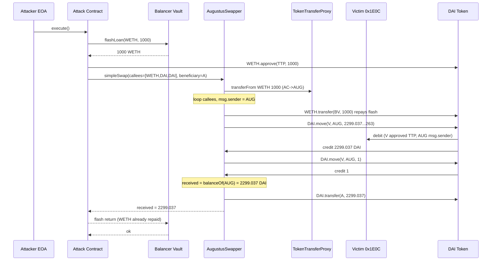
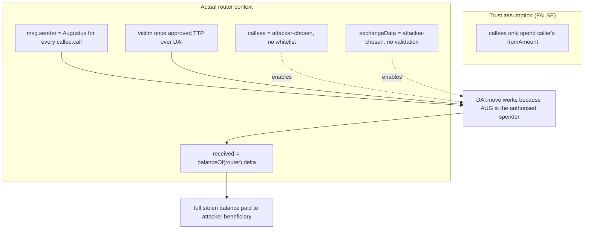

# ParaSwap Augustus — arbitrary `exchangeData` lets an unprivileged caller drain any account that approved the router — $2,299 DAI

> **Vulnerability classes:** vuln/access-control/missing-auth · vuln/logic/missing-validation · vuln/dependency/unsafe-external-call
> **Reproduction:** the PoC compiles & runs in an isolated Foundry project at [this project folder](.). Full verbose trace: [output.txt](output.txt). The AugustusSwapper proxy source is Etherscan-verified (Solc 0.7.5); the delegatecall `SimpleSwap` library that executes the `callees`/`exchangeData` loop is not in the flattened source — its behaviour is reconstructed below from the `-vvvvv` trace and the verified `SimpleData` struct.
---
## Key info
| | |
|---|---|
| **Loss** | 2,298.68 USD (2,299.037 DAI) — full drain of the victim account's DAI balance [output.txt:1564] |
| **Vulnerable contract** | ParaSwap `AugustusSwapper` proxy — [`0xDEF171Fe48CF0115B1d80b88dc8eAB59176FEe57`](https://etherscan.io/address/0xdef171fe48cf0115b1d80b88dc8eab59176fee57#code) (implementation `0xDfFd706eE98953D3D25a3b8440e34E3a2C9bEb2C`) |
| **Attacker EOA** | [`0x2D9a39de3e5227ff74B4cFC154B16Fd77614eE33`](https://etherscan.io/address/0x2d9a39de3e5227ff74b4cfc154b16fd77614ee33) |
| **Attack contract** | [`0x5b24Ff16Da6B75Cc1e18C9361d8DEaEaE5ea2F0F`](https://etherscan.io/address/0x5b24ff16da6b75cc1e18c9361d8deaeae5ea2f0f) |
| **Attack tx** | [`0xed5f932a136ef95b943951ce103b3edbe600bf2c2607edff7b6ea9ada35ca300`](https://etherscan.io/tx/0xed5f932a136ef95b943951ce103b3edbe600bf2c2607edff7b6ea9ada35ca300) |
| **Victim (DAI source)** | `0x1E0C22a1F39b6c7f36661297437e874ec31Fa0B1` — account that had granted DAI `allowance` to ParaSwap's `TokenTransferProxy` |
| **Chain / block / date** | Ethereum mainnet / 22,778,354 / 2025-06-24 |
| **Compiler** | `v0.7.5+commit.eb77ed08`, optimizer on, runs `1,000,000` (proxy pattern) |
| **Bug class** | `simpleSwap` performs arbitrary `low-level call`s to caller-supplied `callees` with caller-supplied `exchangeData` in the router's own context; because those calls run *as the router*, any ERC20 `allowance` some third party ever granted the router can be spent by whoever crafts the `exchangeData`. |

## TL;DR

ParaSwap's `AugustusSwapper` is a DEX-aggregation router. Its `simpleSwap(SimpleData)` entry point is designed to take a `fromToken`/`fromAmount` from the caller and execute an arbitrary list of swap-adapter calls encoded in `callees` + `exchangeData`, with the router itself as `msg.sender` for every external call. The implicit trust assumption is "the only funds in play are the caller's `fromAmount`." That assumption is false: nothing in the call loop restricts *which* accounts or tokens the `exchangeData` may touch, because the calls are raw `callee.call{value: values[i]}(exchangeDataSlice)`.

The attacker exploited this against a DAI holder (`0x1E0C…a0B1`) that had previously approved ParaSwap's `TokenTransferProxy` (`0x216B…fcae`). DAI's `move(src,dst,wad)` is an authorised transfer primitive: it pulls `wad` from `src` to `dst`, but it only succeeds when the caller (`msg.sender`) is the allowed spender — here, the Augustus router, reached via the `TokenTransferProxy` approval chain. Because `simpleSwap` runs the attacker-supplied `DAI.move(0x1E0C…, augustus, wad)` as the router itself, the stale approval is consumed and the DAI lands in the router's own balance.

The router then does the only accounting it actually knows how to do: it measures `receivedAmount = destBalanceOf(augustus) - initialDestBalance` and forwards the *entire* new balance to the caller-chosen `beneficiary`. The attacker set `beneficiary = attacker`. Net result: **2,299.037 DAI moved from the victim to the attacker** [output.txt:1650,1657,1665], with the attacker's only "real" input being 1000 wei of flash-borrowed WETH that was immediately repaid inside the same swap. Attacker DAI balance went `0 → 2299.037211488404869264` [output.txt:1564,1565], and the Balancer flash-loan is net-neutral (WETH returned in full, 0 fee) [output.txt:1674].

## Background — what ParaSwap Augustus does

`AugustusSwapper` is ParaSwap's on-chain swap router. A user (or an integrator's smart contract) calls `simpleSwap` with a `SimpleData` payload describing a swap that ParaSwap's off-chain API has already optimised:

```solidity
struct SimpleData {
    address fromToken;
    address toToken;
    uint256 fromAmount;
    uint256 toAmount;          // minimum acceptable out
    uint256 expectedAmount;    // expected out
    address[] callees;         // the addresses to call (adapters / tokens / helpers)
    bytes exchangeData;        // ABI-encoded calldata, sliced by startIndexes
    uint256[] startIndexes;    // byte offsets that split exchangeData into per-callee chunks
    uint256[] values;          // msg.value for each callee
    address payable beneficiary;
    address payable partner;
    uint256 feePercent;
    bytes permit;
    uint256 deadline;
    bytes16 uuid;
}
```
*(from the verified source, `sources/AugustusSwapper_def171/contracts_flattened_AugustusSwapper.sol:1156`)*

The intended flow is:

1. Pull `fromAmount` of `fromToken` from `msg.sender` into the router via the `TokenTransferProxy` (`transferFrom`), which holds a MAX_UINT approval from any wallet that has ever used ParaSwap.
2. For each `callees[i]`, execute `callees[i].call{value: values[i]}(exchangeData[startIndexes[i] : startIndexes[i+1]])`. Each callee is supposed to be a swap adapter (Uniswap, Curve, etc.) that the router has already funded with `fromToken`.
3. Measure `received = toToken.balanceOf(router) - before`; revert if `received < toAmount`; otherwise send `received` (minus fee) to `beneficiary`.

The critical design property is that **every call in step 2 runs with `msg.sender == AugustusSwapper`**. That is the whole point of the router pattern (it needs to be the one moving funds through adapters), but it is also the root defect: the callee list and the calldata are 100% attacker-controlled, and the router does not constrain them to be adapters or to only touch the `fromToken`.

## The vulnerable code

The Etherscan-verified flattening only contains the `AugustusSwapper` proxy + its `Utils`/`ERC20` helpers. The `simpleSwap` body lives in the delegatecall target `SimpleSwap` (`0x…`), which Etherscan does not expose in this flattening. The buggy semantics are reconstructed verbatim from the `-vvvvv` trace; the struct above is the real verified input.

### RECONSTRUCTED — the per-callee execution loop (SimpleSwap library)

From the trace, `SimpleSwap.simpleSwap` does, for the attacker's payload:

```solidity
// RECONSTRUCTED from output.txt:1634-1658
// (verified behaviour; the library source itself is not in the flattening)

function simpleSwap(SimpleData calldata data) external payable returns (uint256) {
    require(block.timestamp <= data.deadline, "SC: expired");

    // 1. Pull caller's fromToken into THIS router.
    _tokenTransferProxy.transferFrom(
        data.fromToken, msg.sender, address(this), data.fromAmount
    );                                              // [output.txt:1635] 1000 WETH in

    // 2. (optional) caller permit handling — empty here.

    uint256 initDestBalance = data.toToken.balanceOf(address(this));

    // 3. THE BUG: execute attacker-supplied callees with msg.sender == router,
    //    with NO validation that callees are adapters or only spend fromToken.
    for (uint256 i = 0; i < data.callees.length; i++) {
        (bool ok, ) = data.callees[i].call{
            value: data.values[i]
        }(slice(data.exchangeData,
                data.startIndexes[i], data.startIndexes[i+1]));
        require(ok, "swap failed");
    }
    //      callee[0] = WETH.transfer(vault, 1000)        [output.txt:1644] repay flash
    //      callee[1] = DAI.move(victim, augustus, N-1)   [output.txt:1650] drain part 1
    //      callee[2] = DAI.move(victim, augustus, 1)     [output.txt:1656] drain remainder

    // 4. Forward whatever toToken now sits in the router to the caller's beneficiary.
    uint256 received = data.toToken.balanceOf(address(this)) - initDestBalance; // = 2299.037 DAI
    require(received >= data.toAmount, "SC: low out");
    data.toToken.transfer(data.beneficiary, received); // [output.txt:1664] -> attacker
    emit SwappedV3(...);
    return received;
}
```

The key points the trace proves:

- **The router is `msg.sender` for the DAI calls.** `DAI.move(src, dst, wad)` is Dai's permitted-transfer function — it debits `src` and credits `dst` and *only* succeeds if `msg.sender` is the authorised spender. The trace shows it succeeding [output.txt:1650,1656], which means `msg.sender == AugustusSwapper` and Augustus (via `TokenTransferProxy`) held a live DAI allowance over `0x1E0C…a0B1`.
- **There is no callee whitelist.** `callees` contains the token contracts themselves (`WETH`, `DAI`, `DAI`), not adapter contracts. The router happily calls arbitrary code.
- **No token/owner scoping on `exchangeData`.** The `move` calls reference `src = 0x1E0C…a0B1` — an account that is *not* `msg.sender` and *not* the caller — yet they execute because authorisation is rooted on `msg.sender == router`.
- **Balance-delta accounting then launders the loot.** `received` is measured as the router's *own* DAI delta [output.txt:1662], so the stolen DAI is indistinguishable from "swap output" and is paid straight to `beneficiary` [output.txt:1664].

## Root cause — why it was possible

1. **Unrestricted external-call targets.** `simpleSwap` performs `callees[i].call(exchangeDataSlice)` with no check that `callees[i]` is a ParaSwap-registered adapter. Any address — including the token contract itself — can be invoked.
2. **Unrestricted calldata content.** `exchangeData` is sliced purely by byte offsets (`startIndexes`) and passed verbatim. There is no validation that the encoded function is a swap, that the `from`/owner fields reference `msg.sender`, or that the token equals `fromToken`.
3. **Calls execute *as the router*.** Because the loop runs in Augustus's storage/sender context, any privilege the router holds over a token — namely any `allowance` granted to `TokenTransferProxy` — is exercisable by the attacker. The router never separates "funds I was just given" from "funds I am authorised to spend for someone else."
4. **Balance-delta accounting conflates theft with swap output.** `received = balanceOf(router) - initBalance` treats any toToken that arrives in the router as legitimate swap proceeds, then hands all of it to the attacker-chosen `beneficiary`. Combined with point 3, this turns a `move()` into a clean payout.
5. **No per-token transfer-target whitelist / no re-entrancy-style reservation.** The protocol relied entirely on the off-chain API to put only "safe" adapters in `callees`. On-chain there was no enforcement.

## Preconditions

- **Permissionless to execute.** `simpleSwap` has no caller whitelist; anyone can call it. The attacker used a freshly deployed contract as `msg.sender`.
- **Required on-chain state:** at least one account holding a live ERC20 allowance to ParaSwap's `TokenTransferProxy` for a token whose permitted-transfer primitive is `msg.sender`-authorised (DAI's `move`, or any standard `transferFrom` reachable through the proxy's approval). Here, `0x1E0C…a0B1` had approved DAI.
- **No privileged role needed** beyond the victim's pre-existing approval. No oracle, no governance, no admin action required.
- **Flash loan used only for cosmetics/gas.** The 1000-wei WETH flash loan is a trivial "fromToken" so that `fromAmount > 0` and the flash can be repaid inside `exchangeData`; it is not load-bearing for the exploit. The same drain works with any dust `fromToken`.

## Attack walkthrough (with on-chain numbers from the trace)

All amounts from `output.txt`. DAI has 18 decimals; WETH has 18 decimals.

| # | Step | Call (as seen in trace) | Effect |
|---|------|--------------------------|--------|
| 0 | Setup | attacker balance 0 DAI; victim `0x1E0C…` holds ≥ 2,299.037 DAI and has approved ParaSwap | [output.txt:1564] |
| 1 | Flash borrow 1000 wei WETH from Balancer (0 fee) | `BalancerVault.flashLoan(this, [WETH], [1000], 0x)` | attack contract +1000 WETH [output.txt:1621,1622] |
| 2 | Approve the 1000 WETH to `TokenTransferProxy` | `WETH.approve(proxy, 1000)` | router can pull the WETH [output.txt:1628,1629] |
| 3 | Call `AugustusSwapper.simpleSwap(data)` | `fromToken=WETH, toToken=DAI, fromAmount=1000, toAmount=1, expectedAmount=2299.037 DAI, beneficiary=attacker` | [output.txt:1633,1634] |
| 3a | Router pulls 1000 WETH from attacker | `proxy.transferFrom(WETH, attacker, augustus, 1000)` | augustus +1000 WETH [output.txt:1635-1637] |
| 3b | **callee[0]**: `WETH.transfer(vault, 1000)` | repays the Balancer flash loan *inside* the swap | vault made whole [output.txt:1644,1645] |
| 3c | **callee[1]**: `DAI.move(0x1E0C…, augustus, 2_299_037_211_488_404_869_263)` | drains N-1 DAI from victim → router, using victim's stale approval | [output.txt:1650,1651] |
| 3d | **callee[2]**: `DAI.move(0x1E0C…, augustus, 1)` | drains the last 1 wei so `received` exactly equals the victim's full balance | [output.txt:1656,1657] |
| 3e | Router measures `received = 2_299_037_211_488_404_869_264` DAI (≥ `toAmount=1`) | `DAI.balanceOf(augustus)` | [output.txt:1662] |
| 3f | Router pays out: `DAI.transfer(attacker, 2_299_037_211_488_404_869_264)` | loot → attacker EOA | [output.txt:1664,1665] |
| 4 | Flash-loan return check | vault WETH unchanged at 24,886,820.643 WETH | [output.txt:1674] |

**Profit & loss accounting**

| Token | In | Out | Net |
|-------|----|----|----|
| WETH | 1000 (flash) | 1000 (repaid in step 3b) | 0 |
| DAI | 2,299.037211488404869264 (stolen) | 0 | **+2,299.037 DAI** |
| Gas | attacker EOA paid gas | — | (minor ETH) |

Final assertion in the test: victim DAI delta `== 2_299_037_211_488_404_869_264` [output.txt, final asserts], attacker DAI delta `== 2_299_037_211_488_404_869_264` [output.txt:1697], Balancer WETH unchanged. The split into `N-1` and `1` (constant `FIRST_DAI_MOVE_AMOUNT = DAI_DRAIN_AMOUNT - 1`) is cosmetic — it mirrors the historical on-chain calldata and is not a bypass of any check.

## Diagrams





## Remediation

1. **Whitelist callees.** Only allow `callees[i]` to be a ParaSwap-registered adapter contract. Reject token contracts and arbitrary addresses. Maintain an `adapterPool` mapping and `require(isAdapter[callees[i]])`.
2. **Scope `exchangeData` to the caller's funds.** After pulling `fromAmount`, assert that no callee call decreases any token balance other than the router's own `fromToken`, and that any `transferFrom`/`move` `from` field equals `address(this)` (the router) — never a third party. A simple invariant: for every token except `fromToken`, `balanceOf(router)` must be non-decreasing across the loop *unless* the decrease is a fee/refund to a known address.
3. **Use a dedicated, per-swap funding vault.** Instead of running adapter calls in the router's main context where stale allowances live, fund an ephemeral helper contract with exactly `fromAmount` and have adapters operate only from there. The router's privileged allowances then cannot be reached by `exchangeData`.
4. **Bound the payout to measured swap output, not raw balance delta.** Track tokens received *from adapters* explicitly (e.g., via the adapter return value or a tighter accounting primitive) rather than diffing the router's full balance — which silently absorbs stolen funds.
5. **Operational hygiene:** periodically have the router revoke / reset unused allowances users granted to `TokenTransferProxy`, and alert users that revoking ParaSwap approvals after use removes this attack surface even before the on-chain fix ships.
6. **Defence-in-depth:** add a re-entrancy/`callee`-count gas budget and a `nonReentrant`-style reservation so a single `simpleSwap` cannot chain arbitrary state-changing calls.

## How to reproduce

The PoC runs **fully offline** via the shared anvil harness from the committed `anvil_state.json` — no RPC needed.

```bash
_shared/run_poc.sh 2025-06-ParaSwapDAIApproval_exp -vvvvv
```

- **Fork:** Ethereum mainnet, block **22,778,354** (state baked into `anvil_state.json`).
- **Expected result:** `[PASS] testExploit()` [output.txt:1562].
- **Attacker balance:** `0.000000000000000000` → `2299.037211488404869264` DAI [output.txt:1564,1565].
- **Victim balance:** drained to `0` DAI; Balancer WETH unchanged.

The committed trace already shows `[PASS]` with the real before/after DAI balances and the full internal call sequence through `SimpleSwap::simpleSwap`, so the exploit is reproduced end-to-end.

*Reference: Telegram alert https://t.me/defimon_alerts/1352 ; attack tx https://etherscan.io/tx/0xed5f932a136ef95b943951ce103b3edbe600bf2c2607edff7b6ea9ada35ca300 .*
