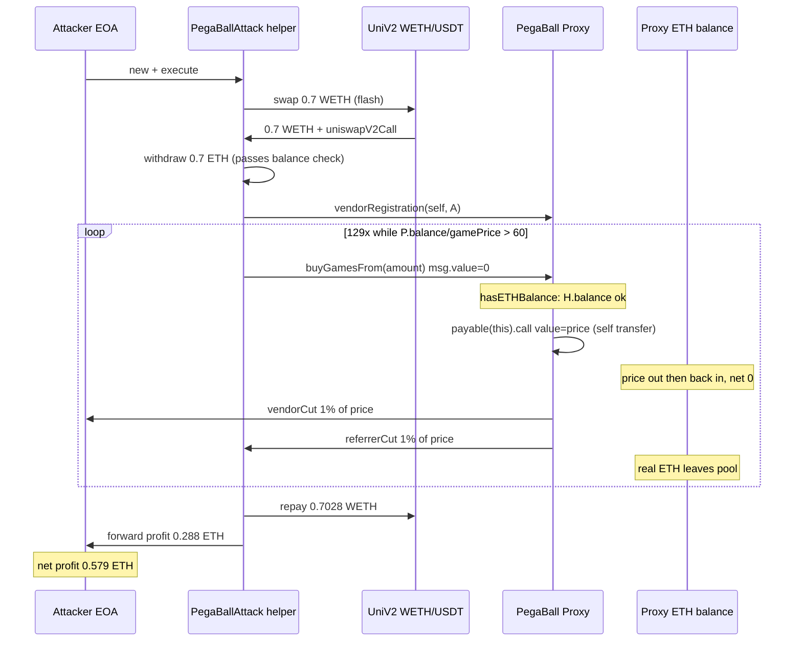
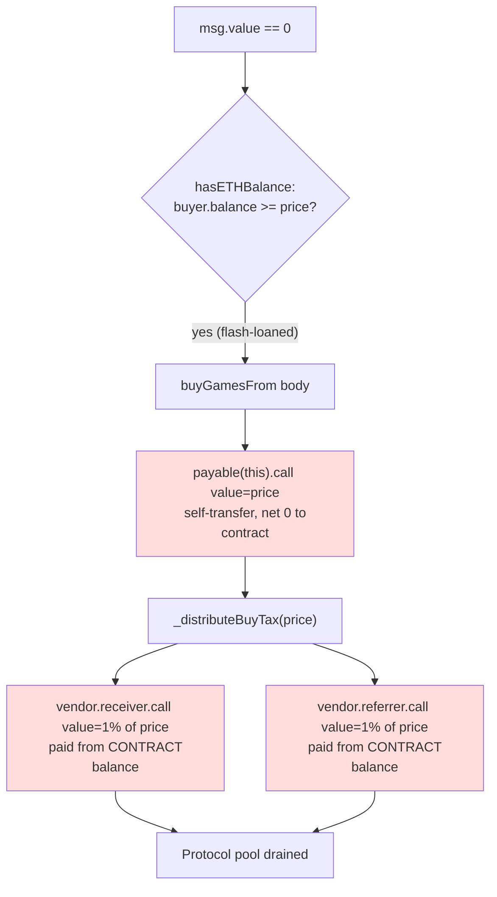

# PegaBall — `buyGamesFrom` self-funds ticket purchases from the contract balance instead of `msg.value` — free vendor/referrer cut drain

> **Vulnerability classes:** vuln/logic/incorrect-state-transition · vuln/access-control/broken-logic · vuln/dependency/unchecked-return-value
> **Reproduction:** the PoC compiles & runs in an isolated Foundry project at [this project folder](.). Full verbose trace: [output.txt](output.txt). Vulnerable implementation contract source is verified on Etherscan and was fetched into [sources/PegaBallV1Implementation_29003D/PegaBallV1Implementation.sol](sources/PegaBallV1Implementation_29003D/PegaBallV1Implementation.sol).

---

## Key info

| | |
|---|---|
| **Loss** | ~0.579 ETH (~1,512.85 USD) — 129 free ticket purchases draining vendor + referrer cuts [output.txt:4603] |
| **Vulnerable contract** | `PegaBallV1Implementation` (behind `PegaBall` proxy) — implementation [`0x29003DD6B9970AD658314fFFB61E42F352C41630`](https://etherscan.io/address/0x29003DD6B9970AD658314fFFB61E42F352C41630#code), proxy `0xB8fCABf7bd88A2489fAfBafA5f9A05a0e068cB5E` |
| **Attacker EOA** | [`0x28a8cB85d9d2C9ee536931De22Fe80e3EfEa3bD6`](https://etherscan.io/address/0x28a8cB85d9d2C9ee536931De22Fe80e3EfEa3bD6) |
| **Attack contract** | [`0x60cbAA2594B2494fce81444697F10701E7B78a31`](https://etherscan.io/address/0x60cbAA2594B2494fce81444697F10701E7B78a31) |
| **Attack tx** | [`0x3cecc3f347edff1d27a0c929f2e7a4c04522afb3a74e24db94684cb6b51b1d65`](https://etherscan.io/tx/0x3cecc3f347edff1d27a0c929f2e7a4c04522afb3a74e24db94684cb6b51b1d65) |
| **Chain / block / date** | Ethereum mainnet / fork block 22,626,977 / June 2025 |
| **Compiler** | Solc 0.8.x (PoC compiled with 0.8.34 against verified source) |
| **Bug class** | A `payable` purchase function trusts the buyer's wallet balance (`_buyer.balance`) instead of the attached `msg.value`, then pays itself with a self-transfer and distributes vendor/referrer cuts from its own holdings — letting anyone "buy" tickets for free and skim the commission stream. |

## TL;DR

PegaBall is an on-chain PowerBall-style lottery. Tickets are bought through `buyGames` / `buyGamesFrom`, both `payable`. The intended model is: a buyer sends `amount * gamePrice` of ETH as `msg.value`; the contract keeps the buy tax for the platform pool and forwards a 10%-of-tax vendor cut (plus, while a 60-day referral timer is active, a 10%-of-tax referrer cut) to the addresses the vendor registered.

The implementation never checks `msg.value`. The only payment guard is the `hasETHBalance(_gameAmount)` modifier, which reverts if `_msgSender().balance < gamePrice * _gameAmount`. After that check, `buyGamesFrom` does `payable(this).call{value: price}("")` — a self-transfer. When `msg.value == 0`, the `price` wei is taken from the contract's own balance and immediately returned to it, so the contract's net worth is unchanged by that line. The damage happens immediately after: `_distributeBuyTax` computes the vendor and referrer cuts as a percentage of the (never-paid) `price`, and `buyGamesFrom` pushes those cuts out to `vendor.receiver` and `vendor.referrer` from the contract balance. Every "free" purchase therefore leaks ~2% of the notional ticket value to attacker-controlled wallets.

The attacker flash-borrowed 0.7 WETH from the Uniswap V2 WETH/USDT pair (only to satisfy the `_buyer.balance >= price` check — the borrowed ETH is never actually spent on tickets), registered itself as a vendor with the attacker EOA as payout receiver and itself as referrer, then looped `buyGamesFrom(proxyBalance / gamePrice - 1)` 129 times. Each iteration minted up to ~800 "free" games and drained the 2% commission. Across the loop the attacker extracted **0.579 ETH** (asserted `attackerProfit == 578955021548053171 wei`) [output.txt:4603], while the proxy balance fell from **0.628696 ETH to 0.047518 ETH** [output.txt:4605]. The on-chain reported loss is **~1,512.85 USD**.

## Background — what PegaBall does

PegaBall is an upgradeable (UUPS-style) on-chain lottery inspired by PowerBall. Players buy numbered "games" grouped into tickets for a future draw date. Two buyer roles exist:

- **Type 1 (`buyGames`)** — direct player purchases. The buyer is the ticket owner and can later claim winnings against a VERIFIER_ROLE-signed message.
- **Type 2 (`buyGamesFrom`)** — third-party **vendor** purchases. The vendor front-runs ticket sales on behalf of end users (ownership is recorded off-chain on a cheaper chain). Type-2 tickets cannot be claimed by the vendor itself (`ClaimerCanNotBeVendor`).

A vendor is created via `vendorRegistration(referrer, receiverWallet)`. This stores a `VendorInfo{ referrer, receiver, isVendor, timer }`. The protocol then redistributes a **buy tax** on every purchase. For type-2 buys the distribution in `_distributeBuyTax` is:

- `buyTax = price * buyTaxFee / precision` (the verified deployment uses a 10% buy tax),
- `vendorCut = buyTax * 10%` — paid to `vendor.receiver` immediately,
- `referrerCut = buyTax * 10%` — paid to `vendor.referrer` immediately, but **only while `vendor.timer >= block.timestamp`** (a 60-day referral window).

The remainder of the buy tax is credited to `$.platformPool`. All ETH a buyer pays is meant to be attached as `msg.value`; the contract's own balance is the accumulated prize/platform/vendor pool that should never be spent on cuts for purchases the contract didn't actually get paid for.

The contract is behind a transparent proxy at `0xB8fCABf7…`; all calls in the trace go through `PegaBall Proxy::fallback → PegaBallV1Implementation::<fn> [delegatecall]`.

## The vulnerable code

All snippets are from the verified implementation at [sources/PegaBallV1Implementation_29003D/PegaBallV1Implementation.sol](sources/PegaBallV1Implementation_29003D/PegaBallV1Implementation.sol).

### The payment guard — checks the buyer's balance, not `msg.value`

```solidity
// PegaBallV1Implementation.sol:4767
modifier hasETHBalance(uint256 _gameAmount){
    InformationStorage storage $ = _getInformationStorage();

    address _buyer = _msgSender();
    uint256 balance = _buyer.balance;          // (A) wallet balance, NOT msg.value
    uint256 price = $.gamePrice * _gameAmount;

    if(balance < price) revert InsufficientBalance();  // (B) only gate

    _;
}
```

The only thing this proves is "the caller happens to own at least `price` wei somewhere." It says nothing about whether that ETH was actually sent into the contract. A flash-loaned balance, or even ETH held in a totally unrelated account, passes the check.

### The purchase — self-funds `price` from the contract's own balance

```solidity
// PegaBallV1Implementation.sol:4460
function buyGamesFrom(uint256 _amount) external payable nonReentrant hasETHBalance(_amount) isBuyNotLocked {

    TicketStorage storage $ = _getTicketStorage();
    WhitelistStorage storage $$ = _getWhitelistStorage();

    BuyGamesInfo memory info = BuyGamesInfo({
        buyer: _msgSender(),
        ticketType: 2, // vendor
        drawDate: nextDrawDate()
    });

    if($.vendor[info.buyer].isVendor != 1) revert NotAVendor();
    if($$.whitelistMode && !$$.isWhitelisted[info.buyer]) revert NotInTheWhitelist();

    uint256 price = _buyGames(info.buyer, info.ticketType, _amount, info.drawDate);

    (bool success,) = payable(this).call{ value: price}("");   // (C) self-transfer
    require(success, "Failed To Send ETH!");

    // distributes the buy tax to the platform pool and deducts the referrer and vendor cut for ticket type 2
    (uint256 referrerCut, uint256 vendorCut) = _distributeBuyTax(
        price, $.taxFees.buy, $.taxFees.precision, info.ticketType, $.vendor[info.buyer]);

    // (D) cuts paid out of the CONTRACT's balance
    (bool success1,) = payable($.vendor[info.buyer].receiver).call{ value: vendorCut}("");
    require(success1, "Failed To Send ETH!");

    if(referrerCut > 0 && $.vendor[info.buyer].referrer != address(0)){
        (bool success2,) = payable($.vendor[info.buyer].referrer).call{ value: referrerCut}("");
        require(success2, "Failed To Send ETH!");
    }
}
```

At (C), `payable(this).call{value: price}` is a **call to self**. When `msg.value == 0`, the EVM funds that transfer from the contract's existing balance — `price` leaves and re-enters the contract in the same call frame, netting zero. No buyer ETH is required. Then at (D) the vendor/referrer cuts — computed as a fraction of the never-paid `price` — are sent from the contract balance to the attacker.

The overloaded `buyGamesFrom(uint256, GameOwnership[])` at line 4516 and the direct-buy `buyGames` at line 4417 share the identical `payable(this).call{value: price}` + `_distributeBuyTax` pattern, so the same flaw reaches all three entry points.

### The commission math — why every free buy leaks ~2%

```solidity
// PegaBallV1Implementation.sol:4581
function _distributeBuyTax(uint256 price, uint256 buyTaxFee, uint256 precision, uint256 ticketType, VendorInfo memory $$)
    internal returns(uint256 referrerCut, uint256 vendorCut) {
    PoolStorage storage $ = _getPoolStorage();

    uint256 referrerCutPercentage = 0;
    uint256 vendorCutPercentage = 0;

    if(ticketType == 2){
        referrerCutPercentage = ($$.timer >= block.timestamp) ? 10 : 0;  // 10% of buy tax while referral active
        vendorCutPercentage = 10;                                        // 10% of buy tax always
    }
    uint256 buyTax   = calcFeeWithPrecision(price, buyTaxFee, precision); // = 10% of price
    referrerCut = calcFeeWithPrecision(buyTax, referrerCutPercentage, 0); // = 1% of price
    vendorCut   = calcFeeWithPrecision(buyTax, vendorCutPercentage, 0);   // = 1% of price

    buyTax = buyTax - vendorCut - referrerCut;
    $.platformPool += buyTax;
    return (referrerCut, vendorCut);
}
```

With the active referral timer the attacker set up, each free `buyGamesFrom(_amount)` call pays out `0.02 * (_amount * gamePrice)` wei to attacker-controlled addresses while the platform pool is credited with the remaining 8% of the notional price — a paper entry backed by nothing, since no ETH was ever received.

## Root cause — why it was possible

1. **Payment was modeled as a balance check instead of an attached value check.** `hasETHBalance` asserts `_msgSender().balance >= price` but never reads `msg.value`. A wallet merely *holding* the requisite ETH satisfies the gate; nothing forces that ETH to actually move into the contract.
2. **The contract pays itself for the buyer.** `payable(this).call{value: price}` is a self-transfer. With `msg.value == 0` the `price` is debited from and re-credited to the contract balance in one step, so a buyer who sent no ETH is treated as having paid in full. The correct pattern is `require(msg.value == price)` (or accepting and refunding the remainder) — never sending `price` to `this`.
3. **Commissions are paid out of the contract balance on the strength of a payment that never happened.** `_distributeBuyTax` is computed off the notional `price` and the vendor/referrer `call{value: …}` draws on the contract's accumulated pool ETH. Because step 2 did not actually add any buyer ETH, every commission payout is a direct drain of protocol funds.
4. **Permissionless vendor registration.** Anyone can call `vendorRegistration(self, attackerReceiver)`, so the attacker both controlled the buyer (`_msgSender`) and the two payout addresses (`receiver` and `referrer`), maximizing the leaked fraction to the full 2% per call.
5. **No accounting reconciliation.** The platform pool is incremented by the residual buy tax in `_distributeBuyTax`, but no invariant enforces "pool delta == ETH actually received this tx," so the underfunded purchases silently inflate the on-chain pool while real ETH leaves the contract.

## Preconditions

- **Permissionless.** No privileged role, whitelist (whitelist mode was off on the forked block), or off-chain signature is needed.
- Requires only enough ETH in the caller's wallet to pass `_buyer.balance >= gamePrice * _amount` for one iteration. The attacker satisfied this with a **0.7 WETH flash loan** from Uniswap V2 — that ETH was unwrapped to satisfy the balance check and repaid at the end; it was never spent on tickets.
- The proxy must hold a positive ETH balance (it held 0.6287 ETH of accumulated pool funds), which is the normal operating state for a live lottery.

## Attack walkthrough (with on-chain numbers from the trace)

`gamePrice = 780,000,000,000,000 wei` (0.00078 ETH) [output.txt:1607-1608]. Buy tax = 10%, vendor cut = 10% of tax = 1% of price, referrer cut = 1% of price (referral timer active) → **2% of each notional purchase leaks to the attacker**.

| # | Step | On-chain value |
|---|------|----------------|
| 1 | Flash-borrow 0.7 WETH from Uniswap V2 WETH/USDT pair via `uniswapV2Call` | `Transfer … 700000000000000000 [7e17]` [output.txt:1583] |
| 2 | Unwrap WETH → 0.7 ETH so `PegaBallAttack.balance` passes `hasETHBalance` | `Withdrawal … 7e17` [output.txt:1592] |
| 3 | `vendorRegistration(self, Attacker)` — attacker contract is vendor+referrer, attacker EOA is payout receiver, 60-day timer active | `VendorRegistered(…, timerEnd: 1754172119)` [output.txt:1598] |
| 4 | Loop `buyGamesFrom(proxyBalance / gamePrice - 1)` — **129 iterations** | 129 `buyGamesFrom(_amount)` delegatecalls in output.txt |
| 4a | First iteration `_amount = 805`: self-transfer of `price = 805 * 780000 = 627,900,000 wei`×1e12 = `627900000000000000` (0.6279 ETH) to self | `PegaBall Proxy::fallback{value: 627900000000000000}` [output.txt:1613] |
| 4b | Same iteration: vendor cut to attacker EOA | `Attacker::fallback{value: 6279000000000000}` (0.006279 ETH = 1%) [output.txt:1616] |
| 4c | Same iteration: referrer cut to attacker contract | `PegaBallAttack::receive{value: 6279000000000000}` [output.txt:1619] |
| 5 | Each later iteration shrinks `_amount` as the proxy balance drops (805 → 788 → 773 → 757 → …) | buyGamesFrom amounts in output.txt |
| 6 | Repay flash swap `0.7 * 1.004 + 1` wei → `702800000000000001` (0.7028 ETH) | `WETH::deposit{value: 702800000000000001}` then `transfer` to pair [output.txt tail] |
| 7 | Forward remaining profit to attacker EOA | `Attacker::fallback{value: 288366021548053171}` [output.txt tail] |

**Accounting:**

- Attacker EOA profit (asserted in the PoC): `578,955,021,548,053,171 wei` = **0.579 ETH** [output.txt:4603]
- Proxy balance: **0.628696 ETH → 0.047518 ETH** (asserted `assertLt(47518000000000000, 628696000000000000)`) [output.txt:4605]
- Reported loss: **~1,512.85 USD** at the ETH price on the attack date.

The difference between the 0.581 ETH drained (proxy delta) and the 0.579 ETH net profit is the 0.7 ETH flash-loan fee/repaid interest (0.0028 ETH) the attacker paid to Uniswap.

## Diagrams





## Remediation

1. **Require the exact payment as `msg.value` and drop the self-transfer.** Replace the `payable(this).call{value: price}` block with `require(msg.value == price, "Incorrect ETH value");` (or accept `msg.value >= price` and refund the excess). Remove `hasETHBalance` or change it to a `msg.value == price` assertion. The buyer, not the contract, must be the source of funds.
2. **Pay commissions only out of ETH actually received.** Since `msg.value` now equals `price`, the vendor/referrer cuts legitimately come out of the received ETH; explicitly account `receivedETH - vendorCut - referrerCut` into `platformPool` and assert the books balance per call.
3. **Add an invariant check** that the contract's ETH balance never decreases as a result of a purchase *except* by the sum of vendor + referrer cuts actually attributable to `msg.value`-funded buys.
4. **Audit the two sibling entry points.** `buyGamesFrom(uint256, GameOwnership[])` (line 4516) and `buyGames` (line 4417) repeat the exact `payable(this).call{value: price}` + `_distributeBuyTax` pattern and need the identical fix.
5. **Gate vendor registration** (KYC / operator allowlist) so a permissionless attacker cannot self-register as both vendor and referrer — defense in depth on top of the payment fix.

## How to reproduce

The PoC runs fully **offline** via the shared anvil harness, replaying the committed fork state in `anvil_state.json` (no RPC needed). The fork is Ethereum mainnet at block **22,626,977**.

```bash
_shared/run_poc.sh 2025-06-PegaBall_exp -vvvvv
```

Expected tail of the run (from [output.txt](output.txt)):

```
[PASS] testExploit() (gas: 20678685)
…
├─ [0] VM::assertGt(578955021548053171 [5.789e17], 500000000000000000 [5e17]) [staticcall]
│   └─ ← [Return]
├─ [0] VM::assertLt(47518000000000000 [4.751e16], 628696000000000000 [6.286e17]) [staticcall]
│   └─ ← [Return]
Suite result: ok. 1 passed; 0 failed; 0 skipped.
```

i.e. the attacker EOA ends **0.579 ETH** richer (assert `> 0.5 ETH`) and the PegaBall proxy balance drops from **0.628696 ETH** to **0.047518 ETH** — confirming the protocol-balance drain.

*Reference: [defimon_alerts (Telegram)](https://t.me/defimon_alerts/1229).*
