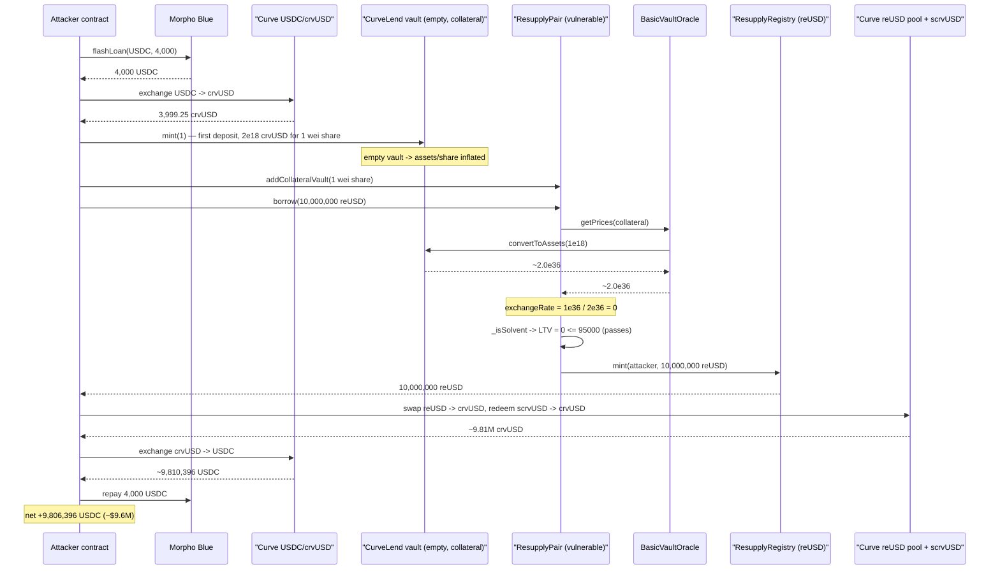
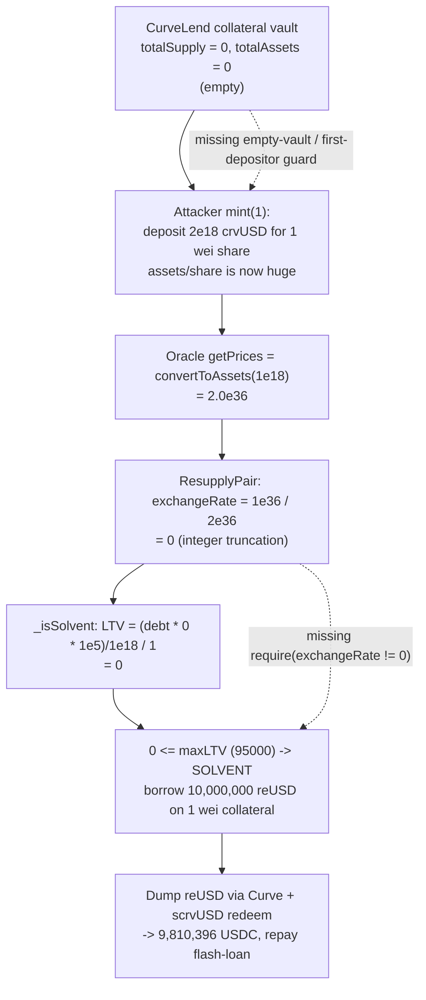

# Resupply Finance Exploit — Empty-Vault Share-Price Inflation → `exchangeRate = 0` → Uncollateralized Borrow

> **Reproduction:** the PoC compiles & runs in an isolated Foundry project at
> [this project folder](.) (the main DeFiHackLabs repo contains many unrelated PoCs that
> do not all compile together, so this one was extracted into its own project).
> Full verbose trace: [output.txt](output.txt).
> Verified vulnerable source: [ResupplyPairCore.sol](sources/ResupplyPair_6e90c8/src_protocol_pair_ResupplyPairCore.sol).

---

## Key info

| | |
|---|---|
| **Loss** | **~$9.6M** — attacker netted **9,806,396.36 USDC** from a 4,000 USDC flash-loan, zero starting capital |
| **Vulnerable contract** | `ResupplyPair` (logic in `ResupplyPairCore`) — [`0x6e90c85a495d54c6d7E1f3400FEF1f6e59f86bd6`](https://etherscan.io/address/0x6e90c85a495d54c6d7E1f3400FEF1f6e59f86bd6#code) |
| **Faulty price source** | `BasicVaultOracle` — [`0xcb7E25fbbd8aFE4ce73D7Dac647dbC3D847F3c82`](https://etherscan.io/address/0xcb7E25fbbd8aFE4ce73D7Dac647dbC3D847F3c82#code) |
| **Manipulated collateral** | CurveLend `crvUSD/wstUSR` vault (ERC-4626) — [`0x01144442fba7aDccB5C9DC9cF33dd009D50A9e1D`](https://etherscan.io/address/0x01144442fba7aDccB5C9DC9cF33dd009D50A9e1D) — **empty** (totalSupply = 0) at fork block |
| **Minted asset** | `reUSD` stablecoin (via `ResupplyRegistry`) — `0x57aB1E0003F623289CD798B1824Be09a793e4Bec` |
| **Attacker EOA** | [`0x6d9f6e900ac2ce6770fd9f04f98b7b0fc355e2ea`](https://etherscan.io/address/0x6d9f6e900ac2ce6770fd9f04f98b7b0fc355e2ea) |
| **Attacker contract** | [`0xf90da523a7c19a0a3d8d4606242c46f1ee459dc7`](https://etherscan.io/address/0xf90da523a7c19a0a3d8d4606242c46f1ee459dc7) |
| **Attack tx** | [`0xffbbd492e0605a8bb6d490c3cd879e87ff60862b0684160d08fd5711e7a872d3`](https://etherscan.io/tx/0xffbbd492e0605a8bb6d490c3cd879e87ff60862b0684160d08fd5711e7a872d3) |
| **Chain / block / date** | Ethereum mainnet / 22,785,460 / **2025-06-26 01:53:47 UTC** |
| **Compiler** | Solidity **v0.8.28**, optimizer enabled (200 runs) |
| **Bug class** | ERC-4626 first-depositor / empty-vault price inflation + unsafe inverse-price division truncating to **zero**, defeating the LTV solvency check |

---

## TL;DR

Resupply lets users borrow its `reUSD` stablecoin against ERC-4626 vault shares (here, a CurveLend
`crvUSD/wstUSR` lending vault). The collateral is priced by a one-line oracle that simply reads the
vault's `convertToAssets(1e18)` — its assets-per-share ratio
([BasicVaultOracle.sol:22-24](sources/BasicVaultOracle_cb7E25/src_protocol_BasicVaultOracle.sol#L22-L24)).

The chosen CurveLend market was **brand new and completely empty** (`totalSupply == 0` at the fork
block). The attacker became its **first depositor**, depositing ~2e18 crvUSD of assets for exactly
**1 wei of shares**. That drove the vault's assets-per-share to an astronomical
`convertToAssets(1e18) ≈ 2.0e36`.

`ResupplyPairCore` converts that price to its internal "exchange rate" by inverting it:

```solidity
_exchangeRate = 1e36 / IOracle(oracle).getPrices(collateral);   //  1e36 / 2e36  ==  0
```
([ResupplyPairCore.sol:572](sources/ResupplyPair_6e90c8/src_protocol_pair_ResupplyPairCore.sol#L572)).

Because `2e36 > 1e36`, the integer division **truncates to 0**. The trace shows it directly:
`UpdateExchangeRate(exchangeRate: 0)`. With `exchangeRate == 0`, the solvency check computes an LTV
of **zero** for *any* debt size:

```solidity
_ltv = ((_borrowerAmount * _exchangeRate * LTV_PRECISION) / EXCHANGE_PRECISION) / _collateralAmount;
//        any_debt        *      0        ...                                                 == 0
return _ltv <= _maxLTV;   // 0 <= 95000  ->  always true
```
([ResupplyPairCore.sol:282-283](sources/ResupplyPair_6e90c8/src_protocol_pair_ResupplyPairCore.sol#L282-L283)).

So the attacker borrowed **10,000,000 reUSD** against **1 wei** of collateral, dumped the reUSD into
Curve pools, redeemed/sold into USDC, repaid the 4,000 USDC flash-loan, and walked away with
**9,806,396 USDC (~$9.6M)**.

---

## Background — what Resupply does

Resupply is a CDP/lending protocol that mints the `reUSD` stablecoin. Each `ResupplyPair` is an
isolated lending market: a user supplies ERC-4626 collateral, and the pair lets them mint up to
`maxLTV` worth of `reUSD` against it. The market analyzed here is *"Resupply Pair (CurveLend:
crvUSD/wstUSR) - 1"* (the contract's own `name()`, visible in the trace), whose collateral token is
the CurveLend `crvUSD/wstUSR` ERC-4626 lending vault.

On-chain parameters of the pair at the fork block (read via `cast`):

| Parameter | Value | Meaning |
|---|---|---|
| `maxLTV` | `95000` (`LTV_PRECISION = 1e5`) | 95% max loan-to-value |
| `minimumBorrowAmount` | `1e21` | 1,000 reUSD minimum borrow |
| `LTV_PRECISION` | `1e5` | LTV scaling |
| `EXCHANGE_PRECISION` | `1e18` | exchange-rate scaling |
| `exchangeRateInfo.oracle` | `0xcb7E25…3c82` | the `BasicVaultOracle` |
| `collateral` | `0x011444…9e1D` | CurveLend crvUSD/wstUSR vault (**empty**) |

Collateral vault state at the fork block (the whole game):

| Read | Value |
|---|---|
| collateral vault `totalSupply()` | **0** |
| collateral vault `totalAssets()` | **0** |

An empty ERC-4626 vault is the precondition that makes the share price arbitrarily inflatable by the
first depositor.

---

## The vulnerable code

### 1. The oracle is a raw share-price passthrough

```solidity
// basic oracle that assumes the underlying value and returns erc4626 share to assets conversion
function getPrices(address _vault) external view returns (uint256 _price) {
    _price = IERC4626(_vault).convertToAssets(1e18);
}
```
[BasicVaultOracle.sol:22-24](sources/BasicVaultOracle_cb7E25/src_protocol_BasicVaultOracle.sol#L22-L24)

No bounds, no sanity check, no manipulation resistance. The price *is* whatever the (manipulable)
vault reports.

### 2. The pair inverts the price with no zero/overflow guard

```solidity
function _updateExchangeRate() internal returns (uint256 _exchangeRate) {
    ExchangeRateInfo memory _exchangeRateInfo = exchangeRateInfo;
    // convert price of collateral as debt is priced in terms of collateral amount (inverse)
    _exchangeRate = 1e36 / IOracle(_exchangeRateInfo.oracle).getPrices(address(collateral));
    ...
    emit UpdateExchangeRate(_exchangeRate);
}
```
[ResupplyPairCore.sol:564-583](sources/ResupplyPair_6e90c8/src_protocol_pair_ResupplyPairCore.sol#L564-L583)

When `getPrices()` returns anything `> 1e36`, the `1e36 / price` integer division returns **0**.
There is no check that `_exchangeRate != 0`.

### 3. The solvency check trusts a zero exchange rate

```solidity
function _isSolvent(address _borrower, uint256 _exchangeRate) internal view returns (bool) {
    uint256 _maxLTV = maxLTV;
    if (_maxLTV == 0) return true;
    uint256 _borrowerAmount = totalBorrow.toAmount(_userBorrowShares[_borrower], true);
    if (_borrowerAmount == 0) return true;
    uint256 _collateralAmount = _userCollateralBalance[_borrower];
    uint256 _ltv = ((_borrowerAmount * _exchangeRate * LTV_PRECISION) / EXCHANGE_PRECISION) / _collateralAmount;
    return _ltv <= _maxLTV;
}
```
[ResupplyPairCore.sol:270-284](sources/ResupplyPair_6e90c8/src_protocol_pair_ResupplyPairCore.sol#L270-L284)

With `_exchangeRate == 0`, the numerator is `_borrowerAmount * 0 * LTV_PRECISION == 0`, so
`_ltv == 0` regardless of how much was borrowed, and `0 <= 95000` is always true.

### 4. The solvency modifier checks *after* the borrow — which doesn't help

```solidity
/// @notice Checks for solvency AFTER executing contract code
modifier isSolvent(address _borrower) {
    _syncUserRedemptions(_borrower);
    _;                                                   // borrow happens here
    ExchangeRateInfo memory _exchangeRateInfo = exchangeRateInfo;
    if (!_isSolvent(_borrower, _exchangeRateInfo.exchangeRate)) {   // exchangeRate == 0 -> passes
        revert Insolvent(...);
    }
}
```
[ResupplyPairCore.sol:296-311](sources/ResupplyPair_6e90c8/src_protocol_pair_ResupplyPairCore.sol#L296-L311)

`borrow()` itself calls `_updateExchangeRate()` *inside* the body
([ResupplyPairCore.sol:688](sources/ResupplyPair_6e90c8/src_protocol_pair_ResupplyPairCore.sol#L688)),
so by the time the post-body solvency check runs, the stored `exchangeRate` is already `0`. Checking
after the borrow would normally be the *safe* design — but a zero rate defeats it completely.

---

## Root cause

Two independent defects compose into a catastrophe:

1. **No manipulation-resistant collateral price.** `BasicVaultOracle` returns the live
   `convertToAssets(1e18)` of an ERC-4626 vault. When the vault is **empty**, the very first
   depositor can set the share price to anything (classic 4626 first-depositor / inflation attack).
   The pair was activated for a market whose collateral vault had `totalSupply == 0`.

2. **Unsafe inverse-price math with no zero guard.** `_exchangeRate = 1e36 / price` silently
   truncates to `0` for any `price > 1e36`. A `0` exchange rate makes the LTV formula evaluate to
   `0`, so the solvency check (`_isSolvent`) approves **any** loan against **any** (even 1 wei)
   collateral. There is no `require(_exchangeRate != 0)` and no minimum-price floor.

The attacker only had to push the manipulated share price above `1e36`, which an empty vault makes
trivial: depositing ~2e18 crvUSD for 1 share yields `convertToAssets(1e18) ≈ 2e36`, and
`1e36 / 2e36 == 0`.

---

## Preconditions

1. A live `ResupplyPair` whose collateral is an ERC-4626 vault that is **empty** (or trivially
   manipulable) and priced by `BasicVaultOracle`.
2. `maxLTV > 0` (so the LTV branch is reachable) — here 95%.
3. Ability to become the first/marginal depositor of the collateral vault (permissionless).
4. A flash-loan source for the small bootstrapping capital (4,000 USDC from Morpho) and deep Curve
   liquidity to convert the borrowed reUSD back to USDC. All permissionless.

No privileged role, no admin key, no governance action is required.

---

## Step-by-step attack walkthrough

All numbers below are ground-truth, pulled from [output.txt](output.txt).

| # | Action | Concrete on-chain values | Trace |
|---|---|---|---|
| 1 | Flash-loan USDC from Morpho Blue | borrow **4,000 USDC** (`4e9`) | [output.txt:1569](output.txt) |
| 2 | Swap USDC → crvUSD (Curve USDC/crvUSD `0x4DEcE6…`) | 4,000 USDC → **3,999.25 crvUSD** (`3.999e21`) | [output.txt:1587-1611](output.txt) |
| 3 | Transfer 2,000 crvUSD to crvUSD Controller (`0x897077…`) — seeds the CurveLend vault's underlying | **2,000 crvUSD** (`2e21`) sent | [output.txt:1612-1617](output.txt) |
| 4 | `Vault.mint(1)` on the empty CurveLend collateral vault — first deposit | deposits **2.0e18 crvUSD assets** for **1 wei share**; `Deposit(assets: 2e18, shares: 1)` | [output.txt:1623-1665](output.txt) |
| 5 | `addCollateralVault(1)` — supply the 1 wei share as collateral | collateral balance = **1 wei** | [output.txt:1673-1866](output.txt) |
| 6 | `borrow(10,000,000 reUSD)` | oracle `getPrices` returns **2.0e36** → `1e36/2e36 = 0` → `UpdateExchangeRate(exchangeRate: 0)`; `Borrow(_borrowAmount: 1e25)` succeeds | [output.txt:1867-1943](output.txt) |
| 7 | Swap reUSD → crvUSD (Curve reUSD/scrvUSD pool `0xc522A6…`) | 10,000,000 reUSD → **9,339,517.62 crvUSD** (`9.339e24`) | [output.txt:1951-2024](output.txt) |
| 8 | `redeem(9,339,517.44 sCrvUsd)` (scrvUSD savings vault `0x065597…`) → crvUSD | redeems → **9,811,735.47 crvUSD** (`9.811e24`) | [output.txt:2025-2042](output.txt) |
| 9 | Swap crvUSD → USDC (Curve USDC/crvUSD `0x4DEcE6…`) | 9,813,732.72 crvUSD → **9,810,396.36 USDC** (`9.81e12`) | [output.txt:2048-2070](output.txt) |
| 10 | Repay Morpho flash-loan | **4,000 USDC** returned | [output.txt:2072-2079](output.txt) |
| 11 | Profit | **9,806,396.36 USDC** remains | [output.txt:2094](output.txt) |

The pivotal event is step 6: `emit UpdateExchangeRate(exchangeRate: 0)` immediately followed by a
successful `Borrow(... _borrowAmount: 10000000000000000000000000 ...)` — a 10M reUSD loan against
1 wei of collateral.

---

## Profit / loss accounting

| Leg | Token | Amount in | Amount out |
|---|---|---|---|
| Morpho flash-loan | USDC | — | +4,000.000000 |
| Curve swap USDC→crvUSD | — | −4,000 USDC | +3,999.25 crvUSD |
| Seed crvUSD controller | crvUSD | −2,000 crvUSD | (used by step 4) |
| **Borrow against 1 wei collateral** | reUSD | — | **+10,000,000 reUSD** |
| Curve swap reUSD→crvUSD | — | −10,000,000 reUSD | +9,339,517.62 crvUSD |
| Redeem scrvUSD→crvUSD | — | −9,339,517.44 scrvUSD | +9,811,735.47 crvUSD |
| Curve swap crvUSD→USDC | — | −9,813,732.72 crvUSD | +9,810,396.36 USDC |
| Repay flash-loan | USDC | −4,000.000000 | — |
| **Net** | **USDC** | | **+9,806,396.36 (~$9.6M)** |

Balance log (from the test): `Attacker Before exploit USDC Balance: 0.000000` →
`Attacker After exploit USDC Balance: 9,806,396.356376`.

The loss is borne by the Resupply protocol: 10,000,000 reUSD were minted with effectively no backing
collateral (1 wei of a manipulated vault share), depegging/draining value that the attacker realized
through Curve liquidity.

---

## Attack sequence (Mermaid)



## Price/state evolution (Mermaid)



---

## Remediation

1. **Guard against a zero exchange rate.** In `_updateExchangeRate`, reject a price of `0` and a
   resulting rate of `0`:
   ```solidity
   uint256 price = IOracle(oracle).getPrices(address(collateral));
   require(price != 0 && price <= 1e36, "bad price");      // or use mulDiv with rounding-up
   _exchangeRate = 1e36 / price;
   require(_exchangeRate != 0, "zero exchange rate");
   ```
   A zero (or absurd) rate must make borrowing revert, not pass.

2. **Do not use a raw `convertToAssets` as an oracle.** Replace `BasicVaultOracle` with a
   manipulation-resistant feed: a Chainlink/redstone price for the underlying combined with a
   sanity-bounded share ratio, or a TWAP of the share price, with min/max deviation caps. Never let
   a single, instantaneously-manipulable read define collateral value.

3. **Never list an empty / freshly-deployed ERC-4626 vault as collateral.** Require the collateral
   vault to have a meaningful, non-trivial `totalSupply`/`totalAssets` (and ideally a dead-shares /
   virtual-offset mitigation à la OZ ERC4626) before a pair can borrow against it. Resupply's actual
   post-incident fix included pausing affected pairs and adding minimum-collateral / oracle hardening.

4. **Add LTV sanity bounds independent of the rate.** Even if the rate path is wrong, require the
   posted collateral to be non-dust relative to the borrow (e.g., a minimum collateral value floor),
   so a 1-wei position cannot back a 10M loan.

---

## How to reproduce

```bash
_shared/run_poc.sh 2025-06-ResupplyFi_exp -vvvvv
```

Expected tail:

```
  Attacker Before exploit USDC Balance: 0.000000
  Attacker After exploit USDC Balance: 9806396.356376
...
Suite result: ok. 1 passed; 0 failed; 0 skipped
Ran 1 test suite: 1 tests passed, 0 failed, 0 skipped (1 total tests)
```

The test forks Ethereum mainnet at block **22,785,460** and replays the exploit end-to-end. Files:
the PoC is [test/ResupplyFi_exp.sol](test/ResupplyFi_exp.sol); verified sources are under
[sources/](sources/); the full trace is [output.txt](output.txt).
