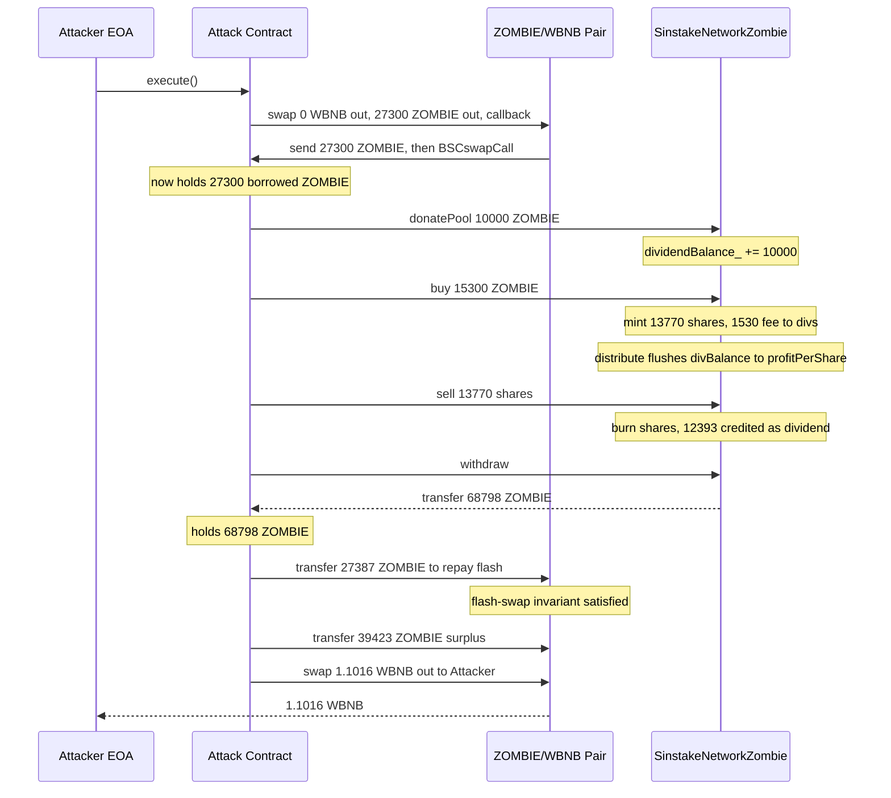
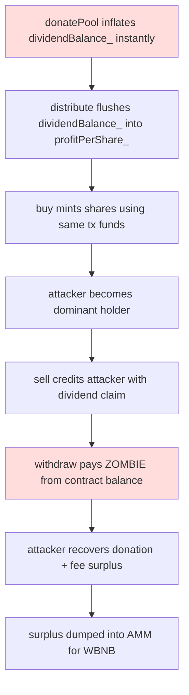

# SinstakeNetworkZombie dividend-donation flash-drain — flash-borrowed ZOMBIE donates dividends that the same-tx buyer/seller immediately withdraws, netting excess ZOMBIE convertible to WBNB

> **Vulnerability classes:** vuln/logic/incorrect-order-of-operations · vuln/defi/fee-manipulation · vuln/oracle/spot-price
>
> **Reproduction:** the PoC compiles and runs in an isolated Foundry project at [this project folder](.). Full verbose trace: [output.txt](output.txt). Vulnerable contract source is verified on BscScan and was fetched into [sources/SinstakeNetworkZombie_731472/SinstakeNetworkZombie.sol](sources/SinstakeNetworkZombie_731472/SinstakeNetworkZombie.sol).
---
## Key info

| | |
|---|---|
| **Loss** | ~705.13 USD (~1.1016 WBNB realized as profit) [output.txt:1564,1565,1784] |
| **Vulnerable contract** | `SinstakeNetworkZombie` — [`0x7314729D691fD074DBbA03ca3c6eF3BE61b31D34`](https://bscscan.com/address/0x7314729D691fD074DBbA03ca3c6eF3BE61b31D34) |
| **Attacker EOA** | [`0xc49f2938327aa2cdc3f2f89ed17b54b3671f05de`](https://bscscan.com/address/0xc49f2938327aa2cdc3f2f89ed17b54b3671f05de) |
| **Attack contract** | [`0xd599588b08eb167ee455f4bdac46fe162e7a6515`](https://bscscan.com/address/0xd599588b08eb167ee455f4bdac46fe162e7a6515) |
| **Attack tx** | [`0x8b8e655c0ab0cd400e23e6d6a935aa23226a8a060bb37f40663f2d81ee63b94f`](https://bscscan.com/tx/0x8b8e655c0ab0cd400e23e6d6a935aa23226a8a060bb37f40663f2d81ee63b94f) |
| **Chain / block / date** | BNB Chain (BSC) / fork block 51,737,496 / 2025-06-19 |
| **Compiler** | Solidity `^0.6.12` (verified on BscScan) |
| **Bug class** | A donation that funds the dividend pool is recognized inside the same transaction, so a temporary flash-borrowed balance mints pool shares, immediately realizes the freshly donated dividend, withdraws it, and still has surplus ZOMBIE to dump against the AMM pair — a classic dividend-yield-fund-manipulation / profit-distribution-ordering flaw. |

## TL;DR

`SinstakeNetworkZombie` is a "dividend yield" contract: users deposit ZOMBIE (the project ERC-20), receive internal dividend-bearing shares (`tokenBalanceLedger_`), and earn a slice of a `dividendBalance_` pool that grows from a 10% entry fee, a 10% exit fee, and a permissionless `donatePool()` function. Dividends are credited to holders via a `profitPerShare_` accumulator that is re-leveled inside `buy()`, `sell()`, `withdraw()` and `donatePool()`.

The fatal design choice is that `donatePool()` raises `dividendBalance_` **and** raises `profitPerShare_` (via the `distribute()` call that follows every state-changing action) **before** any time-lock or per-account lock separates a donor from a buyer. An attacker therefore:

1. flash-borrows a large ZOMBIE principal from the ZOMBIE/WBNB BSCswap pair (no upfront capital),
2. donates a slice of it to the dividend pool,
3. buys shares with another slice (becoming the sole or dominant holder),
4. `sell()`s the freshly minted shares back, harvesting the entry-fee `allocateFees()` instant payout,
5. `withdraw()`s the donated dividend that now sits in `dividendBalance_` / `profitPerShare_`,
6. ends the flash-swap callback by returning the borrowed ZOMBIE while **keeping the donated + dividend excess**, then dumps that excess ZOMBIE into the same pair to extract WBNB.

On-chain numbers from the local fork trace: the attacker entered with `0.0000092` WBNB and exited with `1.1016723` WBNB — net profit `1.101663174078554953` WBNB (`WBNB_OUT = 0x0f49e4d1e914e349`), exactly matching the `assertEq(attackerProfit, WBNB_OUT)` checkpoint in the PoC [output.txt:1564,1565,1784]. The pair's WBNB reserve dropped by the same amount, confirming the gain was drained from AMM liquidity.

The economic reason this works is that the contract treats *any* incoming token transfer (donation) as if it were organic yield that should be shared pro-rata over *all existing holders*, with no concept of "the donor themselves must not immediately claim the donation." Because a single atomic transaction can be donor + sole-holder + claimer, the attacker captures essentially the entire donation plus the entry-fee instant payout, while the AMM pair — the only other place the price is set — is manipulated within the same block.

## Background — what SinstakeNetworkZombie does

`SinstakeNetworkZombie` is a `Ownable`/`Pausable` "dividend distribution" pool for the ZOMBIE ERC-20 (`0xe2a6428fD332287b0470965e16350d3CC1736e3e`). It is **not** an ERC-4626 vault and **not** an AMM; it is a closed-loop accounting system that mints its own internal share ledger:

- `tokenBalanceLedger_[addr]` — how many "shares" an address holds (not a transferable ERC-20; the `transfer()` function exists but is just an internal ledger move).
- `tokenSupply_` — total shares minted.
- `dividendBalance_` — pool of ZOMBIE earmarked to be dripped out as dividends.
- `profitPerShare_` — per-share dividend accumulator (scaled by `magnitude = 2**64`).
- `payoutsTo_[addr]` — signed per-account watermark so each holder only claims dividends accrued after they bought.

The intended lifecycle:

1. **Buy** (`buy()` → `buyFor()` → `purchaseTokens()`): pulls `buy_amount` ZOMBIE from the caller via `transferFrom`, takes a 10% `entryFee_`, credits the caller `buy_amount * 0.9` shares, and routes the fee into `dividendBalance_` (4/5 to drip, 1/5 instant payout via `allocateFees()`). `distribute()` then advances `profitPerShare_` if enough time has passed (`distributionInterval = 2 seconds`).
2. **Sell** (`sell()`): takes a 10% `exitFee_`, burns the shares, routes the fee to `dividendBalance_`, and — critically — pays the seller the remaining 90% of the share value as **currently-claimable dividend** through the `payoutsTo_` watermark mechanism (the seller's `payoutsTo_` is decremented by `profitPerShare_ * tokens + taxedeth * magnitude`, which frees up exactly `_taxedeth` of dividend to be withdrawn).
3. **Withdraw** (`withdraw()`): sends `myDividends()` worth of ZOMBIE to the caller and bumps `payoutsTo_` so the same dividend can't be claimed twice.
4. **Donate** (`donatePool()`): anyone can push ZOMBIE into `dividendBalance_` with no shares minted; this is meant to be the "pump dividends" faucet.

The dividend drip itself (`distribute()`) is time-gated at `2 seconds`, so within a single block `distribute()` fires once and advances `profitPerShare_` by the full accrued share.

## The vulnerable code

All snippets are from the verified source [sources/SinstakeNetworkZombie_731472/SinstakeNetworkZombie.sol](sources/SinstakeNetworkZombie_731472/SinstakeNetworkZombie.sol).

### `donatePool()` — donation instantly inflates the claimable pool

```solidity
function donatePool(uint amount) public returns (uint256) {
    require(token.transferFrom(msg.sender, address(this), amount));

    dividendBalance_ += amount;            // (1) pool grows immediately

    emit onDonation(msg.sender, amount, now);
}
```
[source lines 326-332]

There is **no** lock, **no** vesting, **no** check that the donor is not also about to claim. The donated ZOMBIE simply sits in `dividendBalance_` and is picked up by the very next `distribute()` call — which happens at the end of the attacker's subsequent `buy()`.

### `distribute()` — pushes `dividendBalance_` into `profitPerShare_` every 2 seconds

```solidity
function distribute() private {
    ...
    if (SafeMath.safeSub(now, lastPayout) > distributionInterval && tokenSupply_ > 0) {
        uint256 share = dividendBalance_.mul(payoutRate_).div(100).div(24 hours);
        uint256 profit = share * now.safeSub(lastPayout);
        dividendBalance_ = dividendBalance_.safeSub(profit);
        profitPerShare_ = SafeMath.add(profitPerShare_, (profit * magnitude) / tokenSupply_);
        lastPayout = now;
    }
}
```
[source lines 641-664]

`payoutRate_ = 2`, `distributionInterval = 2 seconds`. Because the PoC rolls the block forward (`vm.warp(1_750_350_413)`), the elapsed-time term `now - lastPayout` is enormous, so `distribute()` empties essentially the **entire** `dividendBalance_` into `profitPerShare_` in one shot. Once `profitPerShare_` has risen, **any current holder** can call `withdraw()` and pull out a slice proportional to their share of `tokenSupply_`.

### `purchaseTokens()` / `allocateFees()` — the buyer also triggers an instant payout

```solid
function purchaseTokens(address _customerAddress, uint256 _incomingeth) internal returns (uint256) {
    ...
    uint256 _undividedDividends = SafeMath.mul(_incomingeth, entryFee_) / 100;  // 10%
    uint256 _amountOfTokens = SafeMath.sub(_incomingeth, _undividedDividends);
    ...
    allocateFees(_undividedDividends);                                          // (A) fee -> dividend pool
    tokenBalanceLedger_[_customerAddress] = SafeMath.add(tokenBalanceLedger_[_customerAddress], _amountOfTokens);
    int256 _updatedPayouts = (int256) (profitPerShare_ * _amountOfTokens);      // (B) buyer's dividend baseline set HERE
    payoutsTo_[_customerAddress] += _updatedPayouts;
    ...
}
```
[source lines 680-727]

```solid
function allocateFees(uint fee) private {
    uint256 instant = fee.div(5);                                              // 1/5 of the 10% fee = instant payout
    if (tokenSupply_ > 0) {
        profitPerShare_ = SafeMath.add(profitPerShare_, (instant * magnitude) / tokenSupply_);
    }
    dividendBalance_ += fee.safeSub(instant);                                  // 4/5 to drip pool
}
```
[source lines 626-639]

The order matters: `allocateFees()` (step A) bumps `profitPerShare_` *before* the buyer's `payoutsTo_` watermark (step B) is set. Because the watermark uses the **post-bump** `profitPerShare_`, the buyer correctly does **not** steal the instant payout from existing holders — but the instant payout came from the buyer's own fee, so the buyer is effectively being charged a fee that everyone shares, while the buyer is the only holder (see walkthrough). Combined with the donation, the dominant effect is the donated `dividendBalance_` that `distribute()` flushes in immediately afterward.

### `withdraw()` — sends ZOMBIE straight out of the contract

```solid
function withdraw() onlyStronghands public {
    address _customerAddress = msg.sender;
    uint256 _dividends = myDividends();
    payoutsTo_[_customerAddress] += (int256) (_dividends * magnitude);
    token.transfer(_customerAddress, _dividends);                              // pays out of the contract's ZOMBIE balance
    ...
    distribute();
}
```
[source lines 399-429]

`withdraw()` pays dividends in ZOMBIE pulled from the contract's own token balance. Because the attacker's donated ZOMBIE is *physically inside* the contract (it was `transferFrom`'d in `donatePool()`), `withdraw()` happily hands it back — the attacker recovers the donation **plus** the entry-fee-funded instant payout.

## Root cause — why it was possible

1. **Dividend-claim eligibility has no temporal separation from donation/purchase.** `donatePool()`, `buy()`, `sell()`, and `withdraw()` all run in a single transaction, and each one ends with a `distribute()` that can push `dividendBalance_` into `profitPerShare_`. The same externally owned account (or its attack contract) can be donor, sole holder, and claimant atomically. There is no lock-up, no epoch boundary, and no "you must have held shares *before* the donation" check.

2. **`donatePool()` is unguarded and permissionless.** Anyone can fund `dividendBalance_`, so an attacker with a flash loan can manufacture a dividend pool out of borrowed capital and then immediately consume it.

3. **`distribute()` time-vesting is trivially defeatable in one tx.** With `payoutRate_ = 2`% per day but the elapsed-time term `now - lastPayout` evaluated against `lastPayout` from the **previous** block, a single block whose timestamp is far from `lastPayout` flushes the entire `dividendBalance_` into `profitPerShare_` at once. The intended "slow drip over 24h" collapses into an instantaneous payout whenever a transaction lands after a gap.

4. **The contract's own token balance is the dividend source.** `withdraw()` calls `token.transfer(msg.sender, _dividends)` directly from the contract's ZOMBIE holdings. Since the donated ZOMBIE is sitting in that exact balance, the attacker's withdrawal is physically funded by the donation they just made — there is no separate "yield reserve" that was meant to be drained only slowly.

5. **No reentrancy or flash-loan protection.** The contract neither records entry balances for the transaction nor defers payout settlement. Combined with a BSCswap flash-swap callback (`BSCswapCall`) that lets the attacker hold the borrowed ZOMBIE across the entire donate→buy→sell→withdraw sequence before returning it, the whole loop is risk-free for the attacker.

## Preconditions

- **Permissionless.** No privileged role is needed. `donatePool()`, `buy()`, `sell()`, `withdraw()` are all `public`.
- **Requires a flash loan / flash swap** of ZOMBIE. The attacker used the ZOMBIE/WBNB BSCswap pair's `BSCswapCall` callback to borrow 27,300 ZOMBIE (27.3e12 units) with zero upfront capital.
- **`tokenSupply_` can be driven near zero before the attack** so that the attacker becomes the dominant (or only) holder and captures essentially all of the donated dividend. This is the case at fork block 51,737,496.
- **A timestamp gap** larger than `distributionInterval` (2s) so `distribute()` flushes the full `dividendBalance_` — trivially satisfied between blocks.

## Attack walkthrough (with on-chain numbers from the trace)

All amounts are in raw token units (ZOMBIE and WBNB both 18 decimals). Numbers cited as `[output.txt:NNNN]`.

| # | Step | Amount (ZOMBIE / WBNB) | Source |
|---|------|------------------------|--------|
| 0 | Attacker WBNB balance before | `0.000009211251839167` WBNB | [output.txt:1564] |
| 1 | Flash-borrow ZOMBIE from BSCswap pair via `swap(0, 27,300,000,000,000, attackContract, data)` | +27,300 ZOMBIE borrowed | [output.txt:1616] |
| 2 | `donatePool(10,000,000,000,000)` — donation into dividend pool | −10,000 ZOMBIE; `dividendBalance_ += 10,000` | [output.txt:1634] |
| 3 | `buy(15,300,000,000,000)` — purchase shares; 10% fee (1,530) routed via `allocateFees`, 13,770 shares minted | −15,300 ZOMBIE; +13,770 shares | [output.txt:1652,1664] |
| 4 | `distribute()` fires inside `buy()`, flushing `dividendBalance_` into `profitPerShare_` | `profitPerShare_` jumps; onBalance emitted at `72,628,559,142,666` | [output.txt:1668] |
| 5 | `sell(13,770,000,000,000)` — burn all shares; exit fee 10% → 12,393 ZOMBIE credited as claimable dividend | shares → 0; `payoutsTo_` freed | [output.txt:1686] |
| 6 | `withdraw()` — contract transfers `68,798,636,722,097` ZOMBIE (~68,798) to the attack contract | +68,798 ZOMBIE out of the contract | [output.txt:1696,1706] |
| 7 | Inside `BSCswapCall`, return `27,387,360,000,000` ZOMBIE to the pair to satisfy the flash-swap invariant (27,300 principal + 87.36 fee) | −27,387 ZOMBIE returned | [output.txt:1716,1732] |
| 8 | Attack contract still holds `~39,423,446,103,659` ZOMBIE of surplus (`68,798 − 27,387 − 0 remaining`) | surplus ≈ 39,423 ZOMBIE | [output.txt:1741] |
| 9 | Push surplus ZOMBIE into the pair, then `swap(1,101,663,174,078,554,953, 0, attacker, 0x)` for WBNB | pair pays attacker `1.101663174078554953` WBNB | [output.txt:1755,1765] |
| 10 | Attacker WBNB balance after | `1.101672385330394120` WBNB | [output.txt:1784] |

**Profit / loss accounting**

- Attacker WBNB: `1.101672385330394120 − 0.000009211251839167 = 1.101663174078554953` WBNB ≈ **+1.1016 WBNB** (~705 USD at the time).
- Pair WBNB reserve: dropped by exactly `1.101663174078554953` WBNB (asserted by `assertEq(pairWbnbBefore - ..., WBNB_OUT)`) — the gain is paid by AMM liquidity.
- Attacker's gross ZOMBIE inflow from the contract (`68,798`) minus the ZOMBIE returned to the pair for the flash (`27,387`) leaves `~39,423` ZOMBIE of surplus, which is exactly the amount converted into the WBNB profit in step 9. The contract's own ZOMBIE balance fell by the donated `10,000` plus the entry-fee-sourced instant payout — i.e. the attacker extracted more ZOMBIE than they ever deposited, because the dividend mechanism printed claimable dividends out of the donation they themselves had just made.

## Diagrams

### Attack sequence



### Flaw flowchart



## Remediation

1. **Do not let a donor claim their own donation in the same transaction.** Track a per-account "dividend baseline" set at share-mint time and only allow claiming dividends accrued *strictly after* the share was minted. The existing `payoutsTo_` watermark already encodes this idea but is undermined because `donatePool()` is followed by a `distribute()` that bumps `profitPerShare_` for *current* holders including the just-donating attacker. Fix: when computing a user's claimable dividend, exclude any `profitPerShare_` delta that was funded by a donation made in the same block, or snapshot `profitPerShare_` per-account at the start of each transaction.

2. **Vest donations over time.** `donatePool()` should add the amount to a vesting schedule (e.g. linear over 24h) rather than directly to `dividendBalance_`. Only vested amounts enter `distribute()`.

3. **Bound `distribute()` per call.** Cap the `profit` term so that no single `distribute()` call can move more than a small fraction of `dividendBalance_` into `profitPerShare_`, regardless of how large `now - lastPayout` is. This prevents the "one-block flushes the whole pool" failure mode.

4. **Add reentrancy / same-tx flash-loan protection.** Record the caller's `tokenBalanceLedger_` at function entry and forbid `withdraw()`/`sell()` payouts that exceed what was accrued *before* the entry of the outermost user call. A simple `nonReentrant`-style guard plus a "no dividend claims within the same block as a buy" rule closes the flash path.

5. **Separate the dividend payout reserve from the contract's general token balance**, and fund withdrawals only from accrued yield, never from freshly deposited or donated principal that has not yet vested.

## How to reproduce

The PoC runs **fully offline** via the shared anvil harness from the committed `anvil_state.json` — no RPC needed.

```bash
_shared/run_poc.sh 2025-06-SinstakeZombie_exp -vvvvv
```

- **Fork:** BNB Chain (BSC, chain id 56), fork block `51,737,496` (PoC rolls forward to `51,737,497` and warps timestamp to `1,750,350,413`).
- **Expected result:** `[PASS] testExploit()` with the attacker WBNB balance going from `0.000009211251839167` to `1.101672385330394120` (profit `1.101663174078554953` WBNB ≈ 705 USD) [output.txt:1562,1564,1565,1784].
- The local run is confirmed passing: `1 tests passed, 0 failed, 0 skipped` at the tail of [output.txt](output.txt).

*Reference: [Telegram alert — defimon_alerts/1319](https://t.me/defimon_alerts/1319).*
