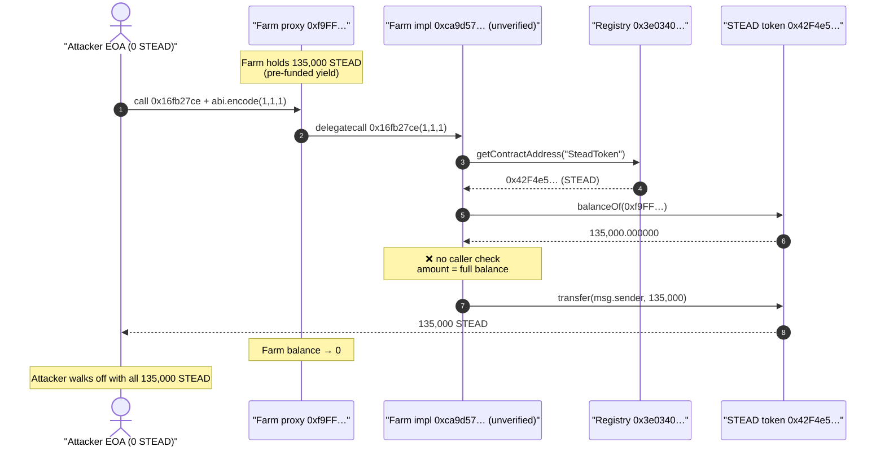
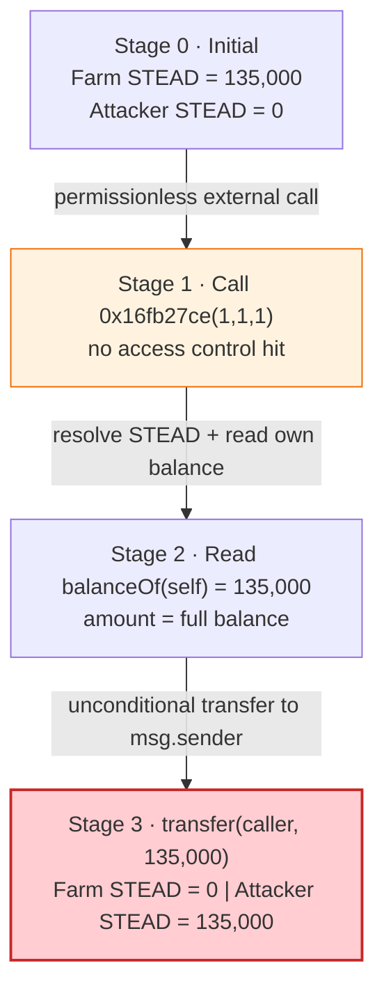
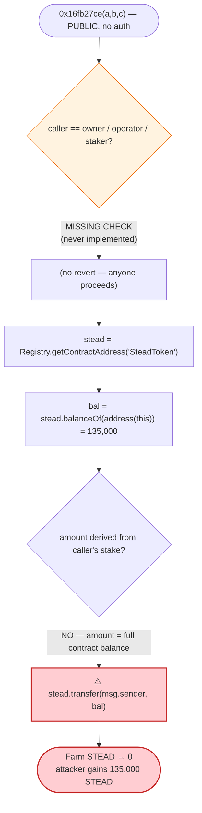

# Stead Farm Exploit — Permissionless STEAD Drain via Un-Access-Controlled Function

> **Vulnerability classes:** vuln/access-control/missing-auth · vuln/access-control/missing-modifier

> One-liner: an unverified STEAD "Farm/Staking" contract on Arbitrum exposed a public
> function (selector `0x16fb27ce`) that transferred the contract's **entire STEAD balance**
> to whoever called it — no access control, no caller-balance check. Anyone calling it
> with `(1, 1, 1)` walked away with the full 135,000 STEAD the contract held.

> **Reproduction:** the PoC compiles & runs in this isolated Foundry project
> ([this folder](.)). Full verbose trace: [output.txt](output.txt).
> The vulnerable implementation (`0xca9d57…`) is **unverified** on Arbiscan, so the snippets
> below come from the verified peripheral contracts (Registry, SteadToken) plus the
> decompiled selector table and the on-chain execution trace.

---

## Key info

| | |
|---|---|
| **Loss** | ~$14.5k — **135,000 STEAD** (6 decimals) drained from the Farm contract |
| **Vulnerable contract** | Stead Farm proxy — [`0xf9FF933f51bA180a474634440a406c95DfB27596`](https://arbiscan.io/address/0xf9FF933f51bA180a474634440a406c95DfB27596#code) (impl `0xca9d57Cd258731A07C56c01CA353e8B0e2798E25`, **unverified**) |
| **Drained asset / victim** | STEAD token [`0x42F4e5Fcd12D59e879dbcB908c76032a4fb0303b`](https://arbiscan.io/address/0x42F4e5Fcd12D59e879dbcB908c76032a4fb0303b#code) (proxy → impl `0x5beD8d4EC3efE8746E07ed790D32F4352159a106`) |
| **Attacker EOA** | [`0x5fb0b8584b34e56e386941a65dbe455ad43c5a23`](https://arbiscan.io/address/0x5fb0b8584b34e56e386941a65dbe455ad43c5a23) |
| **Attack contract** | N/A — called directly from the EOA |
| **Attack tx** | [`0x32dbfce2253002498cd41a2d79e249250f92673bc3de652f3919591ee26e8001`](https://arbiscan.io/tx/0x32dbfce2253002498cd41a2d79e249250f92673bc3de652f3919591ee26e8001) |
| **Chain / block / date** | Arbitrum One / 352,509,408 / **June 29, 2025** (fork at block − 1) |
| **Compiler** | impl `0xca9d57…` compiled with Solidity v0.8.20, optimizer 1 run, EVM `cancun` |
| **Bug class** | Missing access control on a token-transferring function (broken authorization) |
| **Reference** | [TenArmor alert](https://x.com/TenArmorAlert/status/1939508301596672036) |

---

## TL;DR

The Stead protocol deployed a **farming / staking** contract (proxy `0xf9FF…`, implementation
`0xca9d57…`) that was funded with STEAD tokens to pay out yield. Its decompiled dispatch table
exposes farm-style methods (`stake`, `unstake`, `farm`, `freezeFarm`, `unfreezeFarm`,
`calculatePerSecondReward`, `calculateUserLpValue`, …) — see the
[selector inventory](#decompiled-selector-inventory).

One of those entry points, selector **`0x16fb27ce`**, performs the following on every call,
**with no `onlyOwner` / `onlyOperator` / per-user check**:

1. Resolve the STEAD token address from the `Registry` (`getContractAddress("SteadToken")`).
2. Read the Farm contract's own STEAD balance via `balanceOf(address(this))`.
3. `transfer(msg.sender, <that entire balance>)`.

So the function pays out the contract's *whole* STEAD balance to whoever calls it. The
attacker simply called `0xf9FF…` with `0x16fb27ce` + `abi.encode(1, 1, 1)` from a fresh EOA
holding zero STEAD, and received the full **135,000.000000 STEAD** the Farm was holding.
There is no AMM, no oracle, no flash loan, and no complex setup — it is a one-call, one-tx
drain of a contract whose only defense should have been an access modifier that was never
applied.

---

## Background — what the protocol does

STEAD is a small ERC-20 (`"Stead Token" / STEAD`, **6 decimals**) on Arbitrum, with the token
logic behind a `TransparentUpgradeableProxy`
([SteadToken.sol](sources/SteadToken_5beD8d/contracts_v2_SteadToken.sol)). The on-chain
state at the fork block:

| Parameter | Value |
|---|---|
| STEAD `decimals()` | **6** |
| STEAD `totalSupply()` | 5,668,561.414604 STEAD (`5668561414604`) |
| STEAD held by the Farm contract `0xf9FF…` | **135,000.000000 STEAD** (`135000000000`) ← the prize |
| STEAD held by attacker before | **0** |

The token wiring is mediated by a `Registry` name→address map
([Registry.sol](sources/Registry_B8222A/contracts_v2_Registry.sol)):

```solidity
contract Registry is OwnableUpgradeable {
    mapping(string => address) public registry;
    function getContractAddress(string memory _name) external view returns (address) {
        require(registry[_name] != address(0), "Registry :: Address not found");
        return registry[_name];
    }
}
```
[Registry.sol:20-25](sources/Registry_B8222A/contracts_v2_Registry.sol#L20-L25)

`"SteadToken"` resolves to the STEAD token, as seen in the trace:

```
0x3e0340eA…::getContractAddress("SteadToken")
  └─ ← 0x…42f4e5fcd12d59e879dbcb908c76032a4fb0303b   // STEAD token
```
([output.txt:31-34](output.txt#L31-L34))

The STEAD token itself is a fairly standard `ERC20Upgradeable` with an operator-gated `mint`
and `burn`, an owner-gated `setOperator`, and a time-based price-escalation read function — all
correctly access-controlled with `onlyOwner` / `onlyOperator`
([SteadToken.sol:42-59](sources/SteadToken_5beD8d/contracts_v2_SteadToken.sol#L42-L59)). The
bug is **not** in the token; it is in the separate **Farm** contract that holds STEAD to
distribute it.

---

## The vulnerable code

The Farm implementation `0xca9d57…` is **not verified** on Arbiscan, so there is no Solidity
source to quote. What follows is reconstructed from (a) the contract's runtime bytecode
selector table and (b) the exact call trace.

### Decompiled selector inventory

Pulling `PUSH4` selectors from the impl runtime bytecode and decoding them against the 4byte
directory:

| Selector | Decoded signature | Role |
|---|---|---|
| `0x7b0472f0` | `stake(uint256,uint256)` | farm: open a stake |
| `0x2e17de78` | `unstake(uint256)` | farm: close a stake |
| `0x538a85a1` | `farm(uint256)` | farm: per-farm accessor |
| `0xaf509fef` | `freezeFarm(uint256)` | admin: pause a farm |
| `0x5c7a4f54` | `unfreezeFarm(uint256)` | admin: unpause a farm |
| `0x24a168c8` | `setFarm((uint256,uint256,uint256,uint256,bool),uint256)` | admin: configure farm |
| `0x1e93d71c` | `calculatePerSecondReward(uint256)` | reward math |
| `0x4f753cda` | `calculatePerSecondPerUserReward(address,uint256)` | reward math |
| `0x87ab95f5` | `calculateUserLpValue(address,uint256)` | reward math |
| `0x595bb90f` | `getCurrentTime(uint256)` | view |
| `0x37849b3c` | `user(uint256,address)` | view: per-user stake record |
| `0x04433bbc` | `getContractAddress(string)` | registry lookup |
| `0xa91ee0dc` | `setRegistry(address)` | admin |
| `0x8da5cb5b` | `owner()` | Ownable |
| `0x70a08231` | `balanceOf(address)` | (token-style accessor) |
| `0xa9059cbb` | `transfer(address,uint256)` | (token-style accessor) |
| **`0x16fb27ce`** | **(not in any signature DB — custom)** | **⚠️ the drained entry point** |

(There are also a handful of unknown selectors `0x21eed1cd`, `0x565b6101`, `0x0110ceef`,
`0x01e13380`, `0x43000814` that the 4byte DB cannot resolve.)

The picture is unambiguous: this is a **STEAD yield-farming contract** that is *funded with
STEAD* and pays it out. Selector `0x16fb27ce` is a custom payout/claim-style method whose name
was never published (unverified source), but whose effect the trace shows precisely.

### What `0x16fb27ce` actually does (from the trace)

```
0xf9FF…::16fb27ce(0x…0001 0x…0001 0x…0001)               // call(0x16fb27ce, abi.encode(1,1,1))
└─ delegatecall 0xca9d57…::16fb27ce(…)
   ├─ 0x3e0340…::getContractAddress("SteadToken")  → 0x42F4e5…  // resolve STEAD
   ├─ 0x42F4e5…::balanceOf(0xf9FF…)               → 135000000000 // read OWN balance
   └─ 0x42F4e5…::transfer(msg.sender, 135000000000)            // send it ALL to caller
        emit Transfer(from: 0xf9FF…, to: attacker, amount: 135000000000)
```
([output.txt:29-47](output.txt#L29-L47))

In pseudo-Solidity, the function reduces to:

```solidity
function f16fb27ce(uint256 /*a*/, uint256 /*b*/, uint256 /*c*/) external {
    // ❌ NO access control: no onlyOwner / onlyOperator / msg.sender check
    IERC20 stead = IERC20(registry.getContractAddress("SteadToken"));
    uint256 bal = stead.balanceOf(address(this));   // entire contract balance
    stead.transfer(msg.sender, bal);                // ❌ paid to arbitrary caller
}
```

The three `uint256` arguments (passed as `1, 1, 1`) are read by the function but have no
bearing on the amount transferred — the amount is the contract's full STEAD balance regardless.

---

## Root cause — why it was possible

A single missing authorization check.

> The function transfers the **entire STEAD balance the Farm holds to `msg.sender`**, but it
> never verifies that `msg.sender` is the owner, an operator, or a staker entitled to a
> reward. The amount is not derived from the caller's stake or accrued reward; it is the raw
> `balanceOf(address(this))`. Any externally-owned account can therefore drain the contract in
> one call.

Contributing factors:

1. **No access modifier.** Sibling admin functions in the same contract (`freezeFarm`,
   `setFarm`, `setRegistry`) and the underlying token (`mint`, `burn`, `setOperator`) are all
   correctly gated with `onlyOwner` / `onlyOperator`. This one payout function was deployed
   without any guard — a classic "one function forgot the modifier" omission.
2. **Amount = full contract balance, not a per-user entitlement.** Even a correctly-authorized
   claim should pay a *computed* reward, not `balanceOf(this)`. Paying the whole balance turns
   any authorization slip into a total drain.
3. **Unverified implementation.** Because `0xca9d57…` was never verified on Arbiscan, the flaw
   was invisible to ordinary source review, yet trivially discoverable by anyone who probed the
   selectors of the deployed bytecode — exactly what the attacker did.
4. **The Farm was pre-funded.** The contract was sitting on 135,000 STEAD intended for yield
   payouts, so the un-gated function had a substantial balance to give away.

---

## Preconditions

- The Farm contract holds STEAD (it held 135,000 STEAD at the fork block). The drained amount
  equals exactly that balance.
- The attacker knows the custom selector `0x16fb27ce`. This is recoverable from the deployed
  bytecode's dispatch table even though the source is unverified.
- **No** working capital, flash loan, oracle manipulation, AMM positioning, or special role is
  required. The caller's STEAD balance starts at 0.

---

## Step-by-step attack walkthrough (ground-truth numbers from the trace)

The whole attack is a single external call. All figures are STEAD with 6 decimals.

| # | Step | Caller STEAD | Farm STEAD | Note |
|---|------|-------------:|-----------:|------|
| 0 | **Initial** (block 352,509,407) | 0.000000 | 135,000.000000 | Farm pre-funded with yield STEAD. |
| 1 | Attacker calls `0xf9FF…` with `0x16fb27ce` + `abi.encode(1,1,1)` | 0.000000 | 135,000.000000 | Proxy `delegatecall`s impl `0xca9d57…`. |
| 2 | Impl resolves STEAD via `Registry.getContractAddress("SteadToken")` | 0.000000 | 135,000.000000 | Returns `0x42F4e5…`. |
| 3 | Impl reads `STEAD.balanceOf(0xf9FF…)` | 0.000000 | 135,000.000000 | Reads `135000000000`. |
| 4 | Impl calls `STEAD.transfer(msg.sender, 135000000000)` | **135,000.000000** | **0.000000** | `Transfer(0xf9FF… → attacker, 135,000)` emitted. |

Verbatim from the trace:

```
emit Transfer(from: 0xf9FF933f51bA180a474634440a406c95DfB27596,
              to:   Contractf9ff (attacker),
              amount: 135000000000 [1.35e11])
storage changes (STEAD):
  attacker balance:   0 → 0x…1f6ea08600   (135000000000)
  Farm     balance:   0x…1f6ea08600 → 0
```
([output.txt:41-44](output.txt#L41-L44))

PoC balance log:
```
Attacker Before exploit STEAD Balance: 0.000000
Attacker After  exploit STEAD Balance: 135000.000000
```
([output.txt:6-7](output.txt#L6-L7))

### Profit / loss accounting

| | STEAD |
|---|---:|
| Attacker balance before | 0.000000 |
| Attacker balance after | 135,000.000000 |
| **Net to attacker** | **+135,000.000000** |
| Farm balance before | 135,000.000000 |
| Farm balance after | 0.000000 |
| **Net loss to protocol** | **−135,000.000000 STEAD (≈ $14.5k)** |

The on-chain numbers reconcile to the wei: the attacker's gain equals the Farm's entire prior
balance. There is no slippage, fee, or residual.

---

## Diagrams

### Sequence of the attack



### Farm balance / authorization state evolution



### The flaw inside `0x16fb27ce`



---

## Remediation

1. **Add access control to the payout function.** The function that transfers STEAD must be
   gated — `onlyOwner`/`onlyOperator` for an admin sweep, or restricted to entitled stakers for
   a claim. The other functions in this very contract already use `onlyOwner`/`onlyOperator`
   correctly; this one simply omitted the modifier.
2. **Never transfer `balanceOf(address(this))` to an arbitrary caller.** A reward/claim must
   pay a *computed* per-user entitlement (the contract already has
   `calculatePerSecondPerUserReward(address,uint256)` for exactly this), not the entire
   contract balance. Paying the full balance turns any authorization mistake into a total loss.
3. **Verify all deployed implementations.** Leaving `0xca9d57…` unverified did not hide the bug
   from attackers (selectors are readable from bytecode) but did hide it from defenders and
   auditors. Publish and audit the source of every upgradeable implementation before funding it.
4. **Adopt withdraw-pattern + reentrancy/CEI hygiene and unit tests that assert "a random EOA
   cannot move funds."** A single negative test calling each external function from an
   unprivileged address would have caught this immediately.
5. **Pause/empty mechanism.** Keep an owner-only emergency path and avoid pre-funding payout
   contracts with more than the rewards owed over a short window, to bound the blast radius of
   any future authorization slip.

---

## How to reproduce

The PoC was extracted into a standalone Foundry project (the umbrella DeFiHackLabs repo has many
unrelated PoCs that fail to whole-compile under `forge test`):

```bash
_shared/run_poc.sh 2025-06-Stead_exp -vvvvv
```

- RPC: an **Arbitrum archive** endpoint is required (fork block 352,509,407). `foundry.toml`
  uses `https://arbitrum.drpc.org`; the originally
  configured Infura key lacked Arbitrum access (HTTP 401) and was swapped for this one.
- Local imports resolved: the PoC imports `../basetest.sol`, which imports `./tokenhelper.sol`;
  both were copied to the project root so the relative paths resolve.

Expected tail:

```
Ran 1 test for test/Stead_exp.sol:Contractf9ff
[PASS] testExploit() (gas: 89821)
  Attacker Before exploit STEAD Balance: 0.000000
  Attacker After exploit STEAD Balance: 135000.000000
Suite result: ok. 1 passed; 0 failed; 0 skipped
```

---

*Reference: TenArmor alert — https://x.com/TenArmorAlert/status/1939508301596672036 (Stead, Arbitrum, ~$14.5K). Vulnerable contract: https://arbiscan.io/address/0xf9FF933f51bA180a474634440a406c95DfB27596#code (implementation unverified).*
