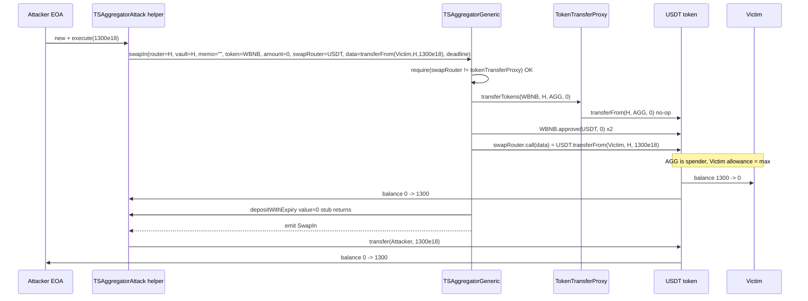
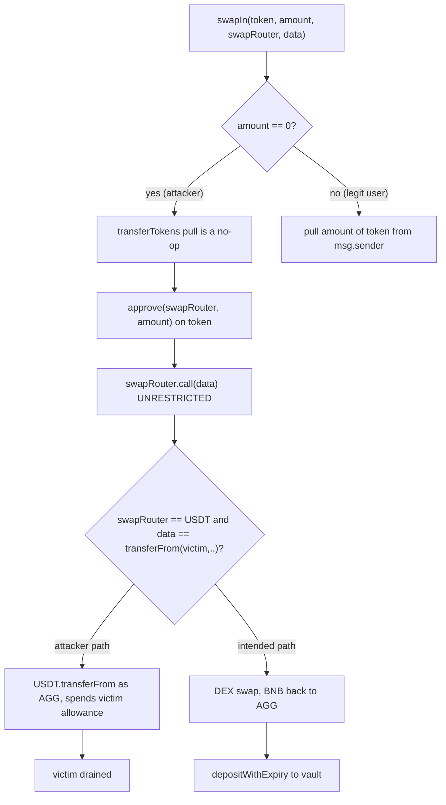

# TSAggregatorGeneric arbitrary swap-target calldata drains victim allowance — attacker-chosen `swapRouter`/`data` lets `swapIn()` call any function on any token the aggregator is allowed to spend

> **Vulnerability classes:** vuln/logic/incorrect-order-of-operations · vuln/access-control/missing-validation · vuln/dependency/unsafe-external-call
> **Reproduction:** the PoC compiles & runs in an isolated Foundry project at [this project folder](.). Full verbose trace: [output.txt](output.txt). Vulnerable contract source is verified on BSCScan and was fetched into [sources/TSAggregatorGeneric_b6FA6f/](sources/TSAggregatorGeneric_b6FA6f/) (`src_TSAggregatorGeneric.sol`, `src_TSAggregatorTokenTransferProxy.sol`).

---

## Key info

| | |
|---|---|
| **Loss** | 1,300.00 USDT (BEP-20) — `1,300 * 10**18` [output.txt:1621] |
| **Vulnerable contract** | `TSAggregatorGeneric` — [`0xb6FA6f1dCd686f4A573fD243a6fABb4Ba36ba98C`](https://bscscan.com/address/0xb6FA6f1dCd686f4A573fD243a6fABb4Ba36ba98C) (also `TSAggregatorTokenTransferProxy`) |
| **Attacker EOA** | [`0xd76Bfdbfe0F47D63C99Ea47f05262E0D43097E5a`](https://bscscan.com/address/0xd76Bfdbfe0F47D63C99Ea47f05262E0D43097E5a) |
| **Attack contract** | [`0x7e0BDfaE4ECC3d84A4107625b7B7C227F598ef56`](https://bscscan.com/address/0x7e0BDfaE4ECC3d84A4107625b7B7C227F598ef56) |
| **Attack tx** | [`0x077ea419bd5f0a20dc8f3da1281fbc96d6893201ebfd237742d01ae00a78e610`](https://bscscan.com/tx/0x077ea419bd5f0a20dc8f3da1281fbc96d6893201ebfd237742d01ae00a78e610) |
| **Chain / block / date** | BSC / `51,426,887` / 2025-06 |
| **Compiler** | Solidity `v0.8.10+commit.fc410830`, optimizer on, runs 10000 ([_meta.json](sources/TSAggregatorGeneric_b6FA6f/_meta.json)) |
| **Bug class** | `swapIn()` performs an arbitrary low-level `swapRouter.call(data)` with fully caller-controlled `swapRouter` and `data`, and the only guard (`swapRouter != tokenTransferProxy`) does not stop the caller from pointing `swapRouter` at any ERC-20 the aggregator is approved to spend — so the "swap" becomes an arbitrary `transferFrom` against any user who pre-approved the aggregator. |

## TL;DR

`TSAggregatorGeneric` is the THORChain Saver-style EVM swap aggregator: a user deposits an input token, the aggregator swaps it through some DEX and forwards native BNB to a THORChain vault. The contract is **non-custodial by design** — users must approve `TSAggregatorTokenTransferProxy` to pull their input token, and the proxy only pulls up to `amount` from `msg.sender`.

The flaw is that `swapIn()` accepts two completely unconstrained parameters — `swapRouter` (the call target) and `data` (the call payload) — and then executes `(bool ok,) = swapRouter.call(data)` with no check that `swapRouter` is an actual DEX or that `data` is a real swap. The sole guard (`require(swapRouter != address(tokenTransferProxy))`) is meaningless: it only forbids the proxy itself, not the dozens of tokens the aggregator is approved to spend.

An attacker set `swapRouter = USDT` and `data = transferFrom(Victim, AttackerHelper, 1_300e18)`. Because the victim had granted `TSAggregatorGeneric` an unlimited USDT allowance, that `call` executed a genuine `USDT.transferFrom(victim → helper)`, draining the victim's entire balance. The aggregator itself touched no funds (input `amount` was 0), so no accounting check tripped. Net profit: **1,300 USDT**, victim balance to **0** [output.txt:1621,1655].

The exploit needs no privileged role, no flash loan, no oracle manipulation — it is a single public transaction from any account, profitable against **every** user who ever approved the aggregator.

## Background — what TSAggregatorGeneric does

`TSAggregatorGeneric` ([src_TSAggregatorGeneric.sol](sources/TSAggregatorGeneric_b6FA6f/src_TSAggregatorGeneric.sol)) is one of THORChain's "Trade Station" aggregator contracts on EVM chains. Its intended flow is:

1. A user calls `swapIn(router, vault, memo, token, amount, swapRouter, data, deadline)`.
2. The aggregator's `TSAggregatorTokenTransferProxy` (`tokenTransferProxy`) pulls `amount` of `token` from `msg.sender` into the aggregator via `transferFrom`.
3. The aggregator approves `swapRouter` to spend `amount` of `token`.
4. The aggregator does `swapRouter.call(data)` — intended to be a 1inch / DEX swap that converts `token` into native BNB and sends the BNB back to the aggregator (`address(this).balance` is read as `out`).
5. A fee is skimmed, and the BNB is forwarded to a THORChain `vault` via `IThorchainRouter(router).depositWithExpiry(...)` with the user-supplied `memo`.

`TSAggregatorTokenTransferProxy.transferTokens` ([src_TSAggregatorTokenTransferProxy.sol](sources/TSAggregatorGeneric_b6FA6f/src_TSAggregatorTokenTransferProxy.sol)) is the only token-pull primitive, gated by `isOwner` (only the aggregator may call it) and it always pulls from `from` (the aggregator's `msg.sender`) — never from an arbitrary third party. So in the *intended* design, the contract cannot move anyone's tokens except those of the caller.

The breach is that step 4 — `swapRouter.call(data)` — breaks that invariant: an arbitrary external call with attacker-chosen target and payload, executed **in the aggregator's own context**, where the aggregator is the `msg.sender`/spender for any token a real user has approved.

## The vulnerable code

From the verified source ([src_TSAggregatorGeneric.sol](sources/TSAggregatorGeneric_b6FA6f/src_TSAggregatorGeneric.sol), lines 23–55):

```solidity
function swapIn(
    address router,
    address vault,
    string calldata memo,
    address token,
    uint amount,
    address swapRouter,
    bytes calldata data,
    uint deadline
) public nonReentrant {
    require(swapRouter != address(tokenTransferProxy), "no calling ttp");
    tokenTransferProxy.transferTokens(token, msg.sender, address(this), amount);
    token.safeApprove(address(swapRouter), 0); // USDT quirk
    token.safeApprove(address(swapRouter), amount);

    {
        (bool success,) = swapRouter.call(data);   // <-- arbitrary call, attacker-controlled target + calldata
        require(success, "failed to swap");
    }

    uint256 out = address(this).balance;
    {
        uint256 outMinusFee = skimFee(out);
        IThorchainRouter(router).depositWithExpiry{value: outMinusFee}(
            payable(vault),
            address(0),
            outMinusFee,
            memo,
            deadline
        );
    }
    emit SwapIn(msg.sender, token, amount, out+getFee(out), getFee(out), vault, memo);
}
```

### Why this is exploitable — the arbitrary `swapRouter.call(data)`

- `swapRouter` is a caller-supplied `address`. The only restriction is `swapRouter != tokenTransferProxy` (line 33). **Any other address is allowed** — including BEP-20 token contracts like USDT, or attacker contracts.
- `data` is a caller-supplied `bytes` blob. There is zero validation that it encodes a real swap, that it references `token`/`amount`, or that it has any relationship to the earlier `safeApprove`.
- `swapRouter.call(data)` runs **as the aggregator**, i.e. `msg.sender == TSAggregatorGeneric` from the token's perspective. For any token on which the aggregator holds an allowance from some user, the aggregator can move that user's funds.

The input-pull on line 34 (`transferTokens(token, msg.sender, address(this), amount)`) is irrelevant to the exploit because the attacker passes `amount = 0` (and `token = WBNB`), so the proxy pull is a no-op `transferFrom(..., 0)` — the trace confirms a zero-value `WBNB` Transfer at [output.txt:1611]. The damage is done entirely by the arbitrary call on line 39.

The token-transfer proxy that the guard *was supposed to* protect ([src_TSAggregatorTokenTransferProxy.sol](sources/TSAggregatorGeneric_b6FA6f/src_TSAggregatorTokenTransferProxy.sol)) is itself correctly scoped — it can only pull from the aggregator's own `msg.sender`:

```solidity
function transferTokens(address token, address from, address to, uint256 amount) external isOwner {
    require(from == tx.origin || _isContract(from), "Invalid from address");
    token.safeTransferFrom(from, to, amount);
}
```

But because `swapRouter.call(data)` is unconstrained, the attacker bypasses this proxy entirely and talks to USDT directly, where the aggregator holds the victim's allowance.

## Root cause — why it was possible

1. **Unrestricted external call target.** `swapRouter` is taken verbatim from the caller with only a single pointless exclusion (`!= tokenTransferProxy`). There is no allowlist of trusted DEX routers, so the caller can point it at any contract — in particular at the USDT token itself.
2. **Unrestricted external call payload.** `data` is taken verbatim from the caller. Nothing ties it to the swapped `token`/`amount`, nothing checks the function selector, nothing bounds the `from`/`to`/`amount` of any `transferFrom` it might encode. The "swap" primitive is therefore a generic "call anything as the aggregator" primitive.
3. **The two parameters are checked independently rather than as a pair.** Even the weak intent — "must be a DEX we just approved" — is not enforced: `token.safeApprove(swapRouter, amount)` approves `swapRouter` to spend `token`, but the subsequent `call(data)` is free to do something completely unrelated (call `transferFrom` on USDT, which never went through that approve because `token == WBNB`).
4. **The aggregator is thespender for every user who ever approved it.** Combined with (1)–(3), this turns an intended "swap my own deposit" primitive into a "spend anyone's pre-approved tokens" primitive. The victim in this incident had set an **unlimited** USDT allowance to `TSAggregatorGeneric` (`uint256.max`, confirmed at [output.txt:1591]), so the attacker chose the amount freely.
5. **No post-condition on the swap's effect.** The function only reads `address(this).balance` (native BNB) as `out` and forwards it; it never checks that the input token was consumed *by a swap* or that the output corresponds to the input. With `amount = 0` there is no input accounting to violate, so nothing reverts.
6. **Zero-amount short-circuit.** Passing `amount = 0` makes the legitimate `transferTokens` pull a no-op while leaving the malicious `swapRouter.call(data)` fully armed. The intended invariant "the aggregator only moves what it pulled from the caller" is silently voided.

## Preconditions

- **Permissionless.** `swapIn` is `public` with no role gating beyond `nonReentrant`. Any account can call it.
- **Victim pre-approval.** At least one user must have approved `TSAggregatorGeneric` (the aggregator, not just the proxy) to spend a token. The victim here granted unlimited USDT allowance (`uint256.max`) — a common state because the aggregator is meant to be re-used across many swaps.
- **No flash loan needed, no oracle, no governance action, no privileged role.** A single public transaction drains every approving user up to their allowance.

## Attack walkthrough (with on-chain numbers from the trace)

Fork: BSC at block `51,426,887`. Pre-state (read from the fork): victim USDT balance `1,300e18`; victim→aggregator USDT allowance `uint256.max` (`1.157e77`) [output.txt:1591]; attacker USDT balance `0` [output.txt:1564].

| # | Action | Effect (trace cite) |
|---|--------|---------------------|
| 1 | Attacker deploys `TSAggregatorAttack` helper ([output.txt:1601](output.txt)) | Helper holds the `transferFrom` receiver address |
| 2 | Helper builds `data = abi.encodeWithSelector(IERC20.transferFrom.selector, VICTIM, helper, 1_300e18)` — selector `0x23b872dd`, visible in the trace calldata [output.txt:1603](output.txt) | The payload that will become `USDT.transferFrom(victim → helper)` |
| 3 | Helper calls `TSAggregatorGeneric.swapIn(router=helper, vault=helper, memo="", token=WBNB, amount=0, swapRouter=USDT, data=<above>, deadline=…)` [output.txt:1603](output.txt) | `swapRouter` = USDT (≠ tokenTransferProxy), passes the only guard |
| 4 | Aggregator runs `transferTokens(WBNB, helper, aggregator, 0)` — a no-op 0-value WBNB pull [output.txt:1611](output.txt) | Input accounting satisfied with zero cost |
| 5 | Aggregator runs `WBNB.approve(USDT, 0)` twice [output.txt:1615,1618](output.txt) | Harmless; the attack never uses this approval |
| 6 | Aggregator runs `swapRouter.call(data)` = **`USDT.transferFrom(VICTIM, helper, 1_300e18)`** as itself [output.txt:1621–1622](output.txt) | `USDT` sees spender = `TSAggregatorGeneric`; victim's allowance is `max`, so 1,300 USDT moves victim → helper. Victim's remaining allowance is decremented from `max` toward `max - 1.3e21` |
| 7 | Aggregator runs `IThorchainRouter(helper).depositWithExpiry{value:0}(...)` [output.txt:1628](output.txt) | Helper implements a stub that just returns; no BNB moved |
| 8 | Aggregator emits `SwapIn(...)` and returns [output.txt:1630](output.txt) | No revert — `success == true` |
| 9 | Helper transfers its full 1,300 USDT to the attacker EOA via `USDT.transfer` [output.txt:1635](output.txt) | Attacker balance `0 → 1,300e18` |

**Profit & loss accounting:**

| Account | Before | After | Delta |
|---|---|---|---|
| Victim (USDT) | 1,300.00 | 0.00 | **−1,300.00** |
| Attacker EOA (USDT) | 0.00 | 1,300.00 | **+1,300.00** |
| Aggregator (USDT, WBNB, BNB) | 0 | 0 | 0 |

Cost to attacker: gas + the helper deployment. Asserts in the test confirm `attackerProfit == victimBalanceBefore` and `victimBalanceAfter == 0` [output.txt:1655].

## Diagrams





## Remediation

1. **Allowlist `swapRouter`.** Maintain a `mapping(address => bool) public allowedRouters` settable only by `isOwner`, and `require(allowedRouters[swapRouter])`. The caller must never be able to nominate the call target.
2. **Do not accept arbitrary `data` as a free-form call.** Either (a) integrate with a fixed router ABI (e.g. a known 1inch/Uni-router wrapper you control) whose swap function takes `token`/`amount`/`minOut` and returns the output amount, or (b) validate that `data`'s selector belongs to an allowlisted set on an allowlisted router.
3. **Re-check input/output accounting after the swap.** After `swapRouter.call(data)`, require that the input `token` balance held by the aggregator decreased by exactly `amount` (or that the swap consumed it) and that the native/token output increased as expected; revert otherwise. As written, `out = address(this).balance` happily reports `0` and the call still succeeds.
4. **Bound the victim exposure at the allowance layer.** Encourage (or enforce via a per-deposit permit) per-transaction allowances rather than `uint256.max`; this caps the blast radius of any future aggregator bug. (Defense-in-depth only — not a fix for the logic flaw.)
5. **Revoke and redeploy.** The deployed `TSAggregatorGeneric` should be paused/deprecated and all users instructed to revoke their allowances immediately; the proxy's `isOwner` gating does not help because the exploit never touches the proxy.

## How to reproduce

The PoC runs **fully offline** via the shared anvil harness from the committed `anvil_state.json` — no RPC needed:

```bash
_shared/run_poc.sh 2025-06-TSAggregatorGeneric_exp -vvvvv
```

- **Chain / fork block:** BSC (chain id 56) at block `51,426,887`.
- **Expected result:** `[PASS]` [output.txt:1562], with:
  - `Attacker Before exploit USDT Balance: 0.000000000000000000` [output.txt:1564]
  - `Attacker After exploit USDT Balance: 1300.000000000000000000` [output.txt:1565]
  - Internal trace shows `USDT::transferFrom(Victim, TSAggregatorAttack, 1300000000000000000000)` executed by the aggregator [output.txt:1621].

The local run passed (1 test, 0 failures [output.txt tail]); the attacker's profit and the victim's zero balance are asserted in-test.

*Reference: alert by defimon_alerts — https://t.me/defimon_alerts/1278 .*
