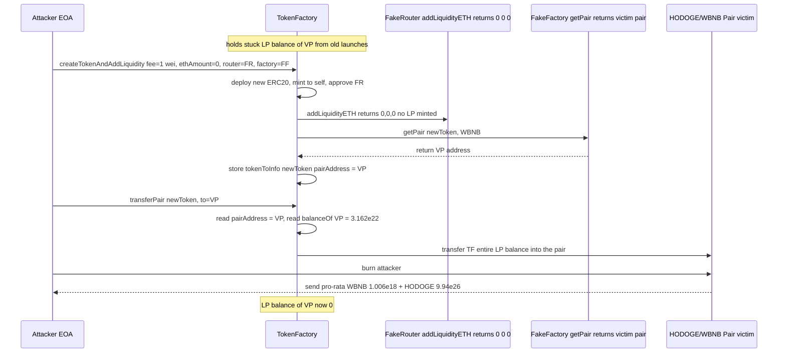
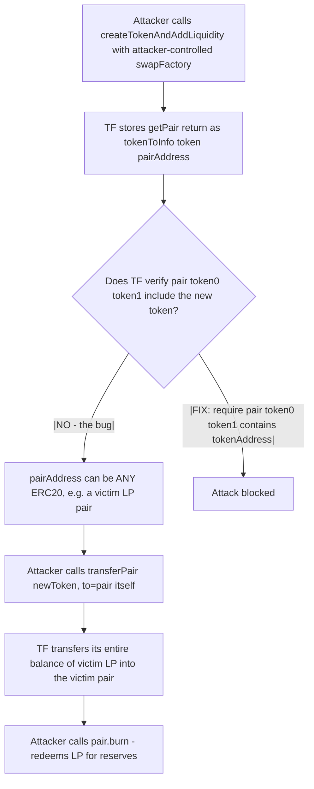

# TokenFactory fake-router LP drain — caller-supplied swap infrastructure is trusted without verifying the returned pair belongs to the new token
> **Vulnerability classes:** vuln/access-control/broken-logic · vuln/logic/missing-validation · vuln/dependency/unchecked-return-value
> **Reproduction:** the PoC compiles & runs in an isolated Foundry project at [this project folder](.). Full verbose trace: [output.txt](output.txt). Vulnerable TokenFactory contract is verified on BSCScan; the verified source was fetched into [sources/TokenFactory_e4997f/TokenFactory.sol](sources/TokenFactory_e4997f/TokenFactory.sol).
---
## Key info
| | |
|---|---|
| **Loss** | ~657.17 USD (~1.006 WBNB of pair reserves, plus the attacker also received ~9.94e26 HODOGE dust) |
| **Vulnerable contract** | TokenFactory — [`0xe4997f98E84C1891e7b57069e177fcCF5f4F6094`](https://bscscan.com/address/0xe4997f98E84C1891e7b57069e177fcCF5f4F6094#code) |
| **Attacker EOA** | [`0xc49F2938327aa2cDc3F2f89Ed17b54B3671F05DE`](https://bscscan.com/address/0xc49F2938327aa2cDc3F2f89Ed17b54B3671F05DE) |
| **Attack contract** | [`0xC427866DcFa3dEc145B97ba73D1073a186A59769`](https://bscscan.com/address/0xC427866DcFa3dEc145B97ba73D1073a186A59769) |
| **Attack tx** | [`0xf74bf7f41c8ca380d439dd94eab95d1bbb1f6fc934e69f2e42eb3325def8514a`](https://bscscan.com/tx/0xf74bf7f41c8ca380d439dd94eab95d1bbb1f6fc934e69f2e42eb3325def8514a) |
| **Chain / block / date** | BSC / 51101790 / 2025-06 |
| **Compiler** | Solidity `^0.8.0` (verified on BSCScan) |
| **Bug class** | TokenFactory let the caller pass arbitrary `swapRouter` / `swapFactory` addresses and recorded the address returned by `factory.getPair()` as the new token's LP pair without checking that pair actually held the freshly-created token; `transferPair` then moved the protocol's entire balance of that *recorded* LP token to an attacker-chosen destination. |

## TL;DR

TokenFactory is a BNB Chain "token-launchpad" contract: anyone pays a small `fee`, calls `createTokenAndAddLiquidity`, and the factory deploys a new ERC20, approves a Uniswap-V2-style router, calls `addLiquidityETH`, and registers the resulting LP pair against the token. The caller is allowed to specify the `swapRouter`, `swapFactory`, and `weth` addresses as function arguments.

The flaw is in `createTokenAndAddLiquidity` (verified source, lines 493-546). After calling `router.addLiquidityETH(...)`, it resolves the pair with `pairAddress = IUniswapV2Factory(swapFactory).getPair(tokenAddress, weth)` (line 529) and stores that value in `tokenToInfo[tokenAddress].pairAddress`. Nothing verifies that the returned address is a pair containing the new token — and because `swapFactory` is fully attacker-controlled, a fake factory can simply return a *pre-existing* victim pair.

The attacker pointed the factory at the live HODOGE/WBNB pair (`0xda4f…4F5d`), which TokenFactory had an unrelated stuck LP balance of (`31_622.78` LP units, worth the reserves of the pair). `createTokenAndAddLiquidity` recorded that pair as the new token's pair. The attacker then called `transferPair(fakeToken, HODOGE_WBNB_PAIR)` — `transferPair` reads `tokenToInfo[tokenAddress].pairAddress`, takes TokenFactory's *entire* balance of that LP token (line 562-564), and transfers it to `to`. Sending the LP tokens *into the pair itself* and then calling `pair.burn(attacker)` redeemed them for the underlying reserves.

In the reproduced trace the attacker's WBNB balance goes from `1.921686798824852706` (`1.921e18`) before to `2.927969211251839167` (`2.927e18`) after — a profit of `1.006282412426986461` WBNB (`1006282412426986461`, `assertGt(profit, 0.9 ether)` passes) plus ~`9.94e26` HODOGE. TokenFactory's HODOGE/WBNB LP balance drops to exactly `0` (`assertEq(... , 0)` passes). Cost of the attack: the `fee` of `1` wei.

## Background — what TokenFactory does

TokenFactory is a launchpad for ERC20 tokens with one-click liquidity provisioning. The full verified source lives at [sources/TokenFactory_e4997f/TokenFactory.sol](sources/TokenFactory_e4997f/TokenFactory.sol) (587 lines, single file).

A user calls `createTokenAndAddLiquidity(TokenInfo, ethAmount, swapRouter, swapFactory, weth)`:

1. `require(msg.value >= ethAmount + fee)` — pay the platform fee plus the ETH to seed liquidity.
2. The fee is sent to `feeAddress` via `payable(feeAddress).transfer(fee)` (line 502-504).
3. A fresh `ERC20Token` is deployed with `create2` using a salt of `keccak256(msg.sender, block.number, walletToTokenCount[msg.sender])` (line 507-511).
4. The token is initialized, minting `initialSupply` to TokenFactory itself (line 514).
5. TokenFactory approves the caller-supplied `swapRouter` for `type(uint256).max` (line 516) and calls `router.addLiquidityETH{value: ethAmount}(...)` with `to = address(this)` — i.e. LP tokens, if minted, would land in TokenFactory (line 520-527).
6. TokenFactory then resolves and stores a pair address (line 529-540) and emits `TokenCreated`.

After launch, the token creator can call `transferPair(tokenAddress, to)` to retrieve the LP tokens TokenFactory is holding, or `dropPair` to burn them to `0xdead`. Both functions authorize via `tokenToWallet[tokenAddress] == msg.sender` and then act on `tokenToInfo[tokenAddress].pairAddress`. The factory's design intent is that the recorded pair is the LP of the newly-launched token — but the contract never enforces that.

The `ERC20Token` itself is a vanilla ownable ERC20 with a blacklist and a "transacted addresses" list (lines 85-303); it is not the locus of the bug. The interesting state is on TokenFactory: `tokenToWallet[token] = creator`, `tokenToInfo[token] = TokenInfo{…, pairAddress}`, and TokenFactory's own ERC20 balances of various LP tokens accumulated from prior launches.

## The vulnerable code

From the verified source ([sources/TokenFactory_e4997f/TokenFactory.sol](sources/TokenFactory_e4997f/TokenFactory.sol)):

### Trusting caller-supplied swap infrastructure and recording an unverified pair

```solidity
function createTokenAndAddLiquidity(
    TokenInfo memory tokenInfo,
    uint256 ethAmount,
    address swapRouter,        // <-- attacker-controlled
    address swapFactory,       // <-- attacker-controlled
    address weth               // <-- attacker-controlled
) external payable returns (address tokenAddress, address pairAddress){
    require(msg.value >= ethAmount+fee, "Insufficient ETH sent");

    if(fee>0&&feeAddress!=address(0)){
        payable(feeAddress).transfer(fee);
    }
    // ... deploy + initialize ERC20Token, approve swapRouter ...

    IUniswapV2Router router = IUniswapV2Router(swapRouter);
    uint256 deadline = block.timestamp + 1 minutes;
    router.addLiquidityETH{value: ethAmount}(
        tokenAddress,
        tokenInfo.initialSupply,
        0, 0,
        address(this),
        deadline
    );

    pairAddress = IUniswapV2Factory(swapFactory).getPair(tokenAddress, weth);  // L529 — UNVERIFIED
    require(pairAddress != address(0), "Pair not created");

    tokenToWallet[tokenAddress] = msg.sender;
    walletToTokens[msg.sender].push(tokenAddress);
    tokenToInfo[tokenAddress] = TokenInfo({                          // L534
        name: tokenInfo.name,
        symbol: tokenInfo.symbol,
        decimal: tokenInfo.decimal,
        initialSupply: tokenInfo.initialSupply,
        pairAddress: pairAddress                                     // <-- stored attacker-chosen address
    });
    // ...
}
```

Two distinct defects converge here:

- The router, factory, and weth are user inputs. There is no allow-list, no EIP-20 check on the returned token, no `IUniswapV2Pair(pairAddress).token0()`/`token1()` check confirming the pair actually contains `tokenAddress`.
- The returned address is recorded verbatim as `pairAddress` for `tokenAddress`, and is later used by `transferPair` / `dropPair` to move TokenFactory's *balance of that ERC20* — whatever ERC20 it is.

### `transferPair` acts on the recorded pair without re-binding it to the token

```solidity
function transferPair(address tokenAddress,address to) external {
    require(msg.sender == tokenToWallet[tokenAddress], "Not authorized");
    address pairAddress = tokenToInfo[tokenAddress].pairAddress;     // L560 — attacker's victim pair
    require(pairAddress != address(0), "Pair address not set");
    uint256 pairBalance = IERC20(pairAddress).balanceOf(address(this));   // L562 — TF's stuck LP of VICTIM pair
    require(pairBalance > 0, "No funds to transfer");
    IERC20(pairAddress).transfer(to, pairBalance);                        // L564 — sends it to `to`
}
```

The authorization only checks that the caller is the recorded creator of `tokenAddress`; it does **not** check that `pairAddress` was actually produced by `tokenAddress`'s liquidity-add. Because TokenFactory holds LP balances of many unrelated pairs (left over from real launches that never called `transferPair`), an attacker who registers *any* such pair as the `pairAddress` of a throwaway token can then sweep TokenFactory's balance of that pair to a destination of their choice.

The same shape applies to `dropPair` (lines 568-575), which would send the LP to `0xdead`; `transferPair` is the profitable variant because `to` is free-form.

## Root cause — why it was possible

1. **Caller-supplied swap infrastructure.** `swapRouter`, `swapFactory`, and `weth` are function arguments with no allow-listing (verified source L493-499). The contract treats any address implementing the IUniswapV2 interface as trustworthy.
2. **Returned pair is stored without validation.** Line 529 stores whatever `swapFactory.getPair(tokenAddress, weth)` returns. There is no check that the returned pair's `token0()`/`token1()` include `tokenAddress`, and no check that the pair was created in this call.
3. **`tokenToInfo[token].pairAddress` is later used as a generic "LP token to sweep" pointer.** `transferPair`/`dropPair` authorize on `tokenToWallet[token]` (trivially set by the attacker via step 2) but then operate on `tokenToInfo[token].pairAddress`, which the attacker controls. The authorization model assumes a 1:1 binding between token and pair that the code never establishes.
4. **TokenFactory is a long-lived custodian of LP tokens.** Real launches mint LP to `address(this)` (line 525) and many creators never reclaim them, so TokenFactory accrues balances of third-party pairs. Any of those balances is reachable via the fake-pair trick.
5. **Unbounded `to` in `transferPair`.** Once the LP is movable, sending it directly into the pair itself and calling `pair.burn(attacker)` lets the attacker redeem the LP for the underlying reserves in a single transaction.

## Preconditions

- **Permissionless.** Anyone can call `createTokenAndAddLiquidity`; only the trivial `fee` (1 wei at the time of the exploit, per `TokenFactory::fee() → 1` in the trace) plus `ethAmount` (set to `0` by the attacker) must be paid.
- **TokenFactory must hold a non-zero balance of the victim LP token.** This was the case for the HODOGE/WBNB pair (`31622776601683793318988` LP units before the attack — see [output.txt:1580]).
- **No privileged role, no governance, no flash loan required.** The attack is a single-transaction, single-actor exploit. A flash loan is not needed because the only capital required is the 1-wei fee.

## Attack walkthrough (with on-chain numbers from the trace)

All figures from [output.txt](output.txt), reproduced on the committed anvil fork at block `51101790`.

| # | Action | On-chain evidence |
|---|--------|-------------------|
| 0 | Read pre-state. TokenFactory holds `31622776601683793318988` (`3.162e22`) LP units of the HODOGE/WBNB pair [output.txt:1580]. Attacker WBNB balance: `1921686798824852706` (`1.921e18`) [output.txt:1583]. `fee()` returns `1` [output.txt:1586]. |
| 1 | `deal(ATTACKER, fee())` — give the attacker the 1-wei fee [output.txt:1588]. Deploy `FakeRouter` (`addLiquidityETH` returns `(0,0,0)` and keeps the ETH) and `FakeFactory` (its `getPair` always returns the victim HODOGE/WBNB pair) [output.txt:1592-1597]. |
| 2 | `createTokenAndAddLiquidity{value: 1}(tokenInfo, 0, fakeRouter, fakeFactory, WBNB)`. TokenFactory pays the 1-wei fee to `feeAddress`, deploys a new ERC20 (`0x13Ca9Ec8bF9be4865f18cA8C62CeaE84d0B4BED0`) [output.txt:1611], initializes it minting `1e18` to TokenFactory [output.txt:1616], approves `fakeRouter` for max [output.txt:1624], calls `fakeRouter.addLiquidityETH` which returns `(0,0,0)` and mints no LP [output.txt:1631], then calls `fakeFactory.getPair(newToken, WBNB)` which returns the **victim** `HODOGE/WBNB Pair` [output.txt:1637]. TokenFactory emits `TokenCreated(newToken, HODOGE/WBNB Pair, "USDT", "USDT", 18)` [output.txt:1639] and stores that pair under `tokenToInfo[newToken].pairAddress`. |
| 3 | `transferPair(newToken, HODOGE_WBNB_PAIR)`. TokenFactory reads `pairAddress = HODOGE/WBNB Pair`, reads its own balance of that pair (`31622776601683793318988`) and transfers it **into the pair itself** [output.txt:1640 — `Transfer TokenFactory → HODOGE/WBNB Pair, 31622776601683793318988`]. |
| 4 | `HODOGE/WBNB Pair.burn(ATTACKER)`. The pair measures reserves (`HODOGE: 994349927372700704397190398` ≈ `9.943e26`, `WBNB: 1006396767089517205` ≈ `1.006e18`) [output.txt — balanceOf calls inside burn], mints protocol fee to `feeTo`, and transfers the attacker's pro-rata share: `994236941566207090908089397` HODOGE (`9.942e26`) and `1006282412426986461` WBNB (`1.006e18`) [output.txt:1656,1666]. |
| 5 | Post-state. Attacker WBNB balance: `2927969211251839167` (`2.927e18`) [output.txt:1688]. Profit = `2927969211251839167 − 1921686798824852706 = 1006282412426986461` WBNB (`1.006e18`). TokenFactory HODOGE/WBNB LP balance: `0` [output.txt:1693]. Both assertions pass (`assertGt(1006282412426986461, 9e17)`, `assertEq(0,0)`). |

**Profit / loss accounting**

| Item | Amount |
|------|--------|
| Attacker WBNB before | 1.921686798824852706 |
| Attacker WBNB after  | 2.927969211251839167 |
| WBNB profit          | **+1.006282412426986461** |
| HODOGE received (dust, low value) | +9.94236941566207090908089397e26 |
| Cost (fee)           | −1 wei |
| TokenFactory LP loss (HODOGE/WBNB) | −31_622.78 LP units (entire stuck balance) |

The on-chain `@KeyInfo` headline figure is **657.17 USD** — i.e. the WBNB-reserve portion at the time of the attack.

## Diagrams





## Remediation

1. **Allow-list the swap infrastructure.** Store trusted `swapRouter` / `swapFactory` / `weth` as owner-set immutable state instead of accepting them per-call. If per-call flexibility is required, validate them against an on-chain registry.
2. **Verify the returned pair actually contains the new token.** After resolving `pairAddress`, require:
   ```solidity
   address t0 = IUniswapV2Pair(pairAddress).token0();
   address t1 = IUniswapV2Pair(pairAddress).token1();
   require(t0 == tokenAddress || t1 == tokenAddress, "pair does not contain token");
   require(t0 == weth || t1 == weth, "pair does not contain weth");
   ```
3. **Bind the LP token to the token it represents.** `transferPair`/`dropPair` should derive the pair from the token (e.g. re-`getPair` against the *trusted* factory, or store the LP balance owned by this specific launch rather than sweeping `balanceOf(address(this))` of a stored address). The current "store an address, later sweep my balance of that address" pattern is the structural defect.
4. **Do not sweep `balanceOf(address(this))`.** `transferPair`/`dropPair` take TokenFactory's *entire* balance of `pairAddress`. If TokenFactory ever holds more LP than this launch produced (which it did), the surplus is stealable. Track per-launch LP mint amounts and transfer only that quantity.
5. **Validate the liquidity-add actually minted LP.** `addLiquidityETH` returned `(0,0,0)` here; checking `liquidity > 0` (or that the factory-pair balance of `address(this)` increased) would have caught the fake router.
6. **Recover the stuck balances.** Any pre-existing LP balances TokenFactory is custodian of should be swept to a known-safe owner/recipient before redeploying, since the same trick can target any pair TokenFactory holds.

## How to reproduce

The PoC runs fully **OFFLINE** via the shared anvil harness from the committed `anvil_state.json` — no RPC needed. From the registry root:

```bash
_shared/run_poc.sh 2025-06-TokenFactory_exp -vvvvv
```

where `2025-06-TokenFactory_exp` is this PoC's folder name. The harness loads the committed BSC fork state at **block `51101790`** (chain id `56`) and runs `forge test --match-test testExploit`.

Expected tail of the run (from [output.txt](output.txt)):

```
[PASS] testExploit() (gas: 2083401)
...
├─ [534] WBNB::balanceOf(Attacker) [staticcall]
│   └─ ← [Return] 2927969211251839167 [2.927e18]
├─ [0] VM::assertGt(1006282412426986461 [1.006e18], 900000000000000000 [9e17])
├─ [537] HODOGE/WBNB Pair::balanceOf(TokenFactory) [staticcall]
│   └─ ← [Return] 0
├─ [0] VM::assertEq(0, 0)
...
Ran 1 test suite ... : 1 tests passed, 0 failed, 0 skipped
```

Attacker WBNB before → after: `1.921686798824852706` → `2.927969211251839167` (profit `1.006282412426986461` WBNB ≈ 657.17 USD at the time). TokenFactory HODOGE/WBNB LP balance: `31_622.78` → `0`. The run passes on the committed state.

*Reference: [defimon_alerts (Telegram)](https://t.me/defimon_alerts/1242).*
