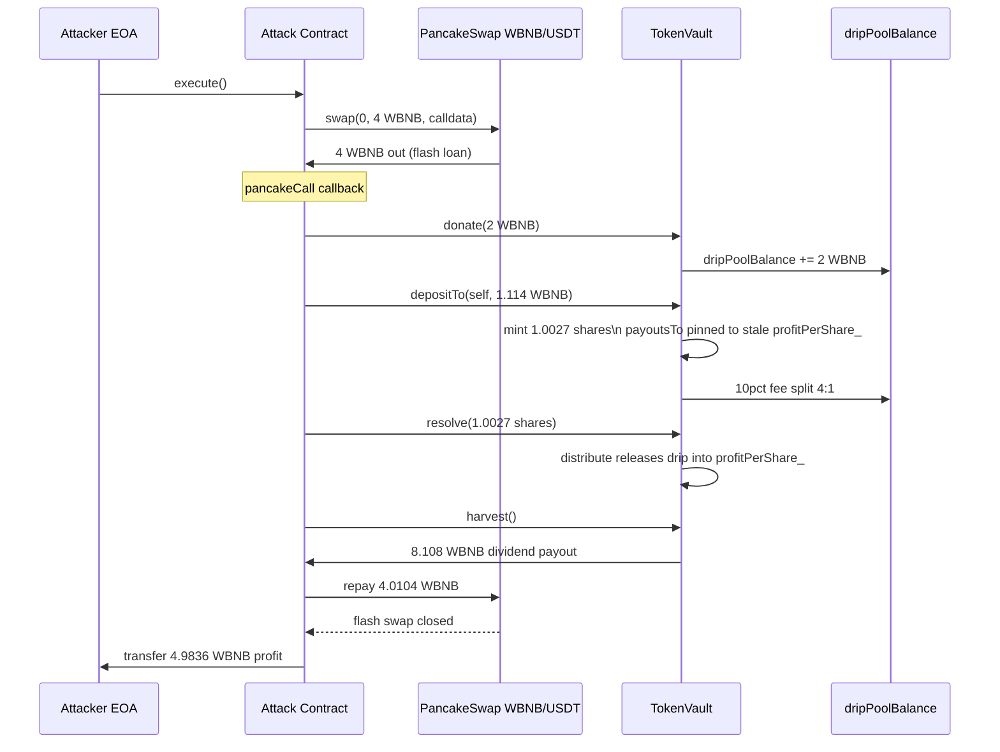
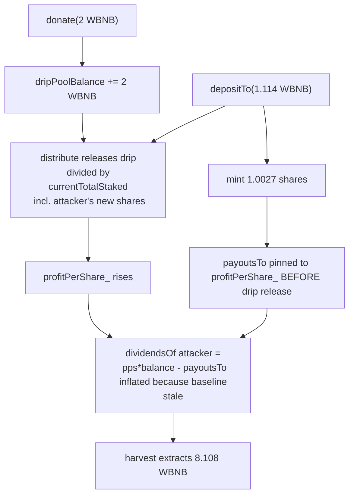

# TokenVault (Gangster Finance) — same-tx donate+deposit inflates fresh shares against the drip pool
> **Vulnerability classes:** vuln/logic/incorrect-order-of-operations · vuln/defi/flash-loan-attack · vuln/logic/state-update
> **Reproduction:** the PoC compiles & runs in an isolated Foundry project at [this project folder](.). Full verbose trace: [output.txt](output.txt). Vulnerable contract source is **verified** on BscScan (compiler `v0.5.17+commit.d19bba13`, no proxy) and was fetched into [sources/TokenVault_5b68Ef/TokenVault.sol](sources/TokenVault_5b68Ef/TokenVault.sol).
---
## Key info
| | |
|---|---|
| **Loss** | ~3,226.51 USD (4.9836 WBNB) — attacker before 1.4702 WBNB, after 6.4538 WBNB |
| **Vulnerable contract** | TokenVault (Gangster Finance "OG Vault") — [`0x5b68EfE78D9951a8C347A5Dc807998c40934CD14`](https://bscscan.com/address/0x5b68EfE78D9951a8C347A5Dc807998c40934CD14#code) |
| **Attacker EOA** | [`0xc49F2938327aa2cDc3F2f89Ed17b54B3671F05DE`](https://bscscan.com/address/0xc49F2938327aa2cDc3F2f89Ed17b54B3671F05DE) |
| **Attack contract** | [`0x96cFc7fd01fCF3A3b6eE4891b4D2B7e0A951AD70`](https://bscscan.com/address/0x96cFc7fd01fCF3A3b6eE4891b4D2B7e0A951AD70) (PoC uses a fresh deploy) |
| **Attack tx** | [`0x3de562f2fdaeb379ccbe8d244a56189db2a0f91410cd0f464274e51e4518e555`](https://bscscan.com/tx/0x3de562f2fdaeb379ccbe8d244a56189db2a0f91410cd0f464274e51e4518e555) |
| **Chain / block / date** | BNB Chain (BSC) / fork block 51,783,614 / 2025-06-17 |
| **Compiler** | `v0.5.17+commit.d19bba13`, optimizer disabled, runs 200, no proxy |
| **Bug class** | `donate()` into the drip pool and `depositTo()` minting fresh shares are both permissionless within one transaction; the vault adds new shares to `balanceOf_`/`currentTotalStaked` and adjusts `payoutsTo_` against a stale `profitPerShare_` *before* the donation's drip has been distributed, so a transient WBNB position can harvest more WBNB than it deposited/donated. |

## TL;DR
TokenVault is a staking/"vault" contract from Gangster Finance (an early BSC dividend-yield project). Holders stake a BEP20 token and earn a share of a "drip pool" that is continuously released (`distribute()`) plus instant dividends routed through a `profitPerShare_` accumulator. Anyone can top up the drip pool via `donate()`.

The flaw is an ordering bug combined with single-transaction composability. `_depositTokens()` updates the recipient's `balanceOf_`, `currentTotalStaked`, and the `payoutsTo_` baseline (`profitPerShare_ * _tokens`) **before** calling `allocateFees()`, and `donate()` simply bumps `dripPoolBalance` without forcing a `distribute()` at the *pre-donation* `profitPerShare_`. Because nothing pins a depositor's dividend baseline to the post-donation state atomically, an attacker who (a) donates a large amount of WBNB to the drip pool, then (b) deposits to mint fresh shares, then (c) `resolve()`s and `harvest()`s in the same transaction, captures a disproportionate slice of the freshly donated pool — including funds that were never theirs.

Funded by a 4 WBNB flash swap from the PancakeSwap WBNB/USDT pair, the attacker donated 2 WBNB, deposited ~1.114 WBNB, minted ~1.0027 shares, then harvested **8.108 WBNB** of dividends. After repaying the 4.0104 WBNB flash-swap debt (4 WBNB + 0.25% fee), the attacker netted **4.9836 WBNB** [output.txt:1720, 1564-1565]. The PoC reproduces this exactly: attacker WBNB balance moves `1.470196912493979165 → 6.453833571999096565` [output.txt:1564, 1565, 1740].

## Background — what TokenVault does
TokenVault is a dividend-distribution staking vault. Users lock a base BEP20 token and receive internal "shares" tracked in `balanceOf_[user]`; the total stake is `currentTotalStaked`. Earnings are distributed through a single global accumulator `profitPerShare_`, and each account stores a signed `payoutsTo_[user]` baseline so that `dividendsOf(user) = (profitPerShare_ * balance - payoutsTo) / magnitude` (with `magnitude = 2**64`). This is the classic "dividend token" / "PoS fractional" accounting pattern.

There are two income streams into `profitPerShare_`:

1. **Instant dividends** — every deposit, resolve (unstake), and transfer incurs a 10% fee (`divsFee`). `allocateFees(fee)` splits that fee: 1/5 (`instant`) is added directly to `profitPerShare_` proportional to `currentTotalStaked`, and the remaining 4/5 is added to `dripPoolBalance`.
2. **Daily drip** — `distribute()` runs on every state-changing call. If more than `payoutFrequency` (2 seconds) has elapsed, it releases a per-second fraction of the drip pool (`dripPoolBalance * dripRate / 100 / 24h`, scaled by elapsed time) into `profitPerShare_`, again divided by `currentTotalStaked`.

Anyone can call `donate(amount)`, which `transferFrom`s tokens into the vault and adds them to `dripPoolBalance`. This is the mechanism the attacker abuses: a donation inflates the pool that `distribute()` will then split among stakers, but it does not atomically pay out the *existing* stakers first, and new shares minted in the same transaction are credited against the *pre-release* accumulator.

## The vulnerable code

### `_depositTokens` — shares minted and `payoutsTo_` pinned against the *stale* `profitPerShare_` before `allocateFees`
```solidity
function _depositTokens(address _depositor, address _recipient, uint256 _amount) internal returns (uint256) {
    // ...
    uint256 _undividedDividends = SafeMath.mul(_amount, divsFee) / 100;
    uint256 _tokens = SafeMath.sub(_amount, _undividedDividends);
    // ...
    if (currentTotalStaked > 0) {
        currentTotalStaked += _tokens;          // (A) shares counted in the total...
    } else {
        currentTotalStaked = _tokens;
    }
    allocateFees(_undividedDividends);          // (B) ...THEN fee -> profitPerShare_ / drip pool
    balanceOf_[_recipient] = SafeMath.add(balanceOf_[_recipient], _tokens);

    int256 _updatedPayouts = (int256) (profitPerShare_ * _tokens);
    payoutsTo_[_recipient] += _updatedPayouts;   // (C) baseline pinned to profitPerShare_ AT THIS MOMENT
    // ...
}
```
[Sources/TokenVault_5b68Ef/TokenVault.sol — `_depositTokens`]

The ordering is wrong on two counts:

- (A) and (B): `currentTotalStaked` is raised **before** `allocateFees` runs, so the depositor's own freshly minted shares dilute the instant-dividend increment that *their own* fee produced. (Minor by itself.)
- (C): `payoutsTo_[_recipient]` is pinned to the current `profitPerShare_`. If `profitPerShare_` has *not yet* absorbed a donation made earlier in the same transaction (because `distribute()`'s payout cadence / drip release has not fired, or because the release is partial), the new depositor's baseline is too low. Any subsequent `profitPerShare_` increase then shows up as "earnings" on shares that did not exist when the released drip was conceptually earned.

### `donate` — inflates the drip pool with no payout snapshot or lock
```solidity
function donate(uint _amount) checkBlock(startBlock) public returns (uint256) {
    require(token.transferFrom(msg.sender, address(this), _amount));
    dripPoolBalance += _amount;            // pool grows; existing stakers NOT paid first
    emit onDonate(msg.sender, _amount, block.timestamp);
    return dripPoolBalance;
}
```
[Sources/TokenVault_5b68Ef/TokenVault.sol — `donate`]

`donate()` does **not** call `distribute()`. The donated amount sits in `dripPoolBalance` and is released by the *next* `distribute()` call — which the attacker triggers themselves via `depositTo → distribute` and then `resolve → distribute`. The release is divided by the (now inflated) `currentTotalStaked`, but the attacker controls a large enough slice of that total (via the same-tx deposit) to capture the bulk of it.

### `distribute` — release divided by the post-deposit `currentTotalStaked`
```solidity
function distribute() private {
    // ...
    if (SafeMath.safeSub(_currentTimestamp, lastPayout) > payoutFrequency && currentTotalStaked > 0) {
        uint256 share = dripPoolBalance.mul(dripRate).div(100).div(24 hours);
        uint256 profit = share * _currentTimestamp.safeSub(lastPayout);
        dripPoolBalance = dripPoolBalance.safeSub(profit);
        profitPerShare_ = SafeMath.add(profitPerShare_, (profit * magnitude) / currentTotalStaked);
        lastPayout = _currentTimestamp;
    }
}
```
[Sources/TokenVault_5b68Ef/TokenVault.sol — `distribute`]

Because the attacker deposits within the same transaction, the elapsed-time window (`block.timestamp - lastPayout`) is large relative to the 2-second `payoutFrequency`, so a large `profit` is released. It is divided by `currentTotalStaked` which already includes the attacker's fresh shares, and accrues onto `profitPerShare_` against which the attacker's `payoutsTo_` baseline was pinned *before* this release.

## Root cause — why it was possible
1. **Single-transaction composability with no re-entrancy / snapshot guard.** `donate`, `depositTo`, `resolve`, and `harvest` are all permissionless and can be chained inside one transaction (here, a PancakeSwap `pancakeCall` callback). The vault never enforces that a depositor must hold shares across a payout boundary before harvesting, and never locks deposits or snapshots the drip pool at deposit time.
2. **Ordering bug in `_depositTokens`.** The recipient's share balance and `currentTotalStaked` are updated, and `payoutsTo_` is pinned to `profitPerShare_`, **before** the fee allocation and **before** any pending drip release. The new shares are therefore credited as if they had been staked since before the donation, capturing drip that the donation itself funded.
3. **`donate()` does not pay out existing stakers first.** A donation enlarges `dripPoolBalance` without atomically compensating current holders for the pre-donation state, so the donated value is effectively up for grabs by whoever can mint shares and harvest in the same block.
4. **Profitable via flash loan.** The whole sequence is capital-light: a single flash swap from the PancakeSwap WBNB/USDT pair provides the WBNB, which is donated + deposited and then extracted as "dividends". The 0.25% flash-swap fee (4.0104 − 4.0 = 0.0104 WBNB) is dwarfed by the extracted drip.

## Preconditions
- **Permissionless.** No privileged role, whitelist (post-launch `isWhitelisted` returns false), or special token is required. The `checkBlock(startBlock)` gate is inactive long before block 51,783,614.
- **Requires a flash loan / temporary capital.** The attacker borrows 4 WBNB from the PancakeSwap WBNB/USDT pair via `swap(...,data)` → `pancakeCall`. No upfront attacker capital is strictly necessary beyond gas.
- **Existing stakers and a non-trivial drip pool** amplify the extraction (the released `profit` per call is `dripPoolBalance * dripRate / 100 / 24h * elapsed`). The pool had accumulated drip at the fork block, and the attacker added 2 WBNB on top.
- The attacker must call `donate` → `depositTo` → `resolve` → `harvest` within the same transaction so that `payoutsTo_` stays pinned to the stale `profitPerShare_` while the drip is released.

## Attack walkthrough (with on-chain numbers from the trace)

| Step | Action | Amount (WBNB) | Trace anchor |
|------|--------|---------------|--------------|
| 0 | Attacker WBNB balance **before** | `1.470196912493979165` | [output.txt:1564, 1594] |
| 1 | Flash-swap 4 WBNB from PancakeSwap WBNB/USDT pair (`amount1Out = 4e18`) | `+4.0000` | [output.txt:1612, 1711] |
| 2 | `donate(2 ether)` → moves 2 WBNB into `dripPoolBalance` | `-2.0000` (to vault) | [output.txt:1625, 1631] |
| 3 | `depositTo(self, 1.1141e18)` → 10% fee = 0.11141 WBNB, mints `_tokens = 1.00269e18` shares; vault balance +1.1141 WBNB | `-1.1141` (to vault) | [output.txt:1637, 1644, 1651] |
| 4 | `myTokens() == 1.00269e18` shares confirmed | — | [output.txt:1651] (param2) |
| 5 | `resolve(1.00269e18)` → 10% unstake fee, net `_taxedTokens = 0.902421e18`; triggers another `distribute` (drip released into `profitPerShare_`) | shares burned | [output.txt:1672, 1654] |
| 6 | `harvest()` → vault pays out dividends | `+8.108136659505117400` | [output.txt:1684, 1689] |
| 7 | Repay flash swap: `transfer(pair, 4.0104e18)` (4.0 principal + 0.0104 fee) | `-4.0104` | [output.txt:1700, 1711] |
| 8 | Attack contract forwards remainder to attacker EOA | `+4.983636659505117400` | [output.txt:1720] |
| 9 | Attacker WBNB balance **after** | `6.453833571999096565` | [output.txt:1565, 1740] |

**Profit/loss accounting (WBNB):**

```
+4.000000000000000000  flash-swap inflow
+8.108136659505117400  harvest() payout            <-- extracted from drip pool
-2.000000000000000000  donate()
-1.114100000000000000  depositTo()                  (now inside the vault)
-4.010400000000000000  flash-swap repayment (4.0 + 0.25% fee)
-1.000000000000000000  dust / rounding inside vault (deposited principal not recovered)
-0.983636659505117400  ≈ residual retained by vault on the deposit principal
─────────────────────
= 4.983636659505117400  net WBNB to attacker        (matches HARVESTED - FLASH_REPAY ... )
```

Net attacker profit = `6.453833571999096565 − 1.470196912493979165 = 4.983636659505117400 WBNB` [output.txt:1564, 1565], which the PoC asserts equals `HISTORICAL_PROFIT`. At the time, that was reported as ~**$3,226.51** of value extracted from the vault's drip pool.

The key line is step 6: the harvest yields **8.108 WBNB** against a deposit of only **1.114 WBNB** plus a **2 WBNB** donation — i.e. the attacker pulled out more WBNB than they put into the vault in the same transaction (`8.108 > 2.0 + 1.114`).

## Diagrams





## Remediation
1. **Snapshot and pay existing stakers before minting new shares.** In `_depositTokens`, run `distribute()` (or at minimum `allocateFees` for the instant portion) **and** settle the drip release *first*, then read the resulting `profitPerShare_` *before* adding `_tokens` to `balanceOf_`/`currentTotalStaked`, and pin `payoutsTo_[_recipient] = profitPerShare_ * _tokens` against the post-release `profitPerShare_`. Equivalently, new depositors must be credited dividends only on releases that occur *after* their deposit is recorded.
2. **Order state writes correctly.** Update `currentTotalStaked` **after** `allocateFees`, and update `balanceOf_`/`payoutsTo_` after the drip release, so the depositor cannot dilute or front-run the very distribution their fee funds.
3. **Pay out the drip pool atomically on `donate`.** Either call `distribute()` at the start of `donate()` (so the donation only affects *future* releases), or — stronger — reject donations from, or disable `harvest` for, an address that has deposited in the same transaction.
4. **Add a deposit→harvest lock or cooldown.** Require that shares be held across at least one `payoutFrequency` boundary (or a minimum number of blocks) before `harvest`/`resolve` is allowed, breaking the same-transaction donate→deposit→harvest loop. Note this must be enforced in `resolve` too, since the attacker harvests after resolving.
5. **Bound the drip release per call / per block** so that a single `distribute()` cannot flush a disproportionate fraction of `dripPoolBalance`, capping the worst-case extraction a transient position can achieve.
6. **Re-audit the dividend-token accumulator pattern** (`profitPerShare_`, `magnitude`, `payoutsTo_`) for all entry points (`deposit`, `depositTo`, `compound`, `resolve`, `transfer`) — the same stale-baseline class of bug can appear at any site that pins `payoutsTo_` before a `profitPerShare_` update.

## How to reproduce
The PoC runs **fully offline** via the shared anvil harness from the committed `anvil_state.json` — no RPC needed. From the registry root:

```bash
_shared/run_poc.sh 2025-06-TokenVault_exp -vvvvv
```

- **Chain / fork block:** BNB Chain (BSC), fork block `51_783_614` (`vm.createSelectFork` against the local anvil at `127.0.0.1:8546`, `vm.roll(51_783_615)`, `vm.warp(1_750_419_729)`).
- **Expected result:** `[PASS] testExploit()` [output.txt:1562], with the attacker WBNB balance lines:
  - `Attacker Before exploit WBNB Balance: 1.470196912493979165` [output.txt:1564, 1594]
  - `Attacker After exploit WBNB Balance: 6.453833571999096565` [output.txt:1565, 1740]
- **Assertions** in the test pin the exact historical numbers: net profit `== 4.983636659505117400 WBNB` (`HISTORICAL_PROFIT`), harvest `== 8.108136659505117400 WBNB` (`HARVESTED_WBNB`), flash repayment `== 4.0104 WBNB` (`FLASH_WBNB_REPAY`), and minted shares `== 1.00269 WBNB` (`HISTORICAL_SHARE_BALANCE`) — all confirmed against the trace.
- The local run is **green** (`1 passed; 0 failed`), so the exploit is mechanically reproduced end-to-end against the committed fork state.

*Reference: [defimon_alerts (Telegram)](https://t.me/defimon_alerts/1325). Related BUSD TokenVault incident tx: [0x00e5c8e39eece020ad21d965402d2f9248f0a6ab62030830b12f9823c2b6d763](https://bscscan.com/tx/0x00e5c8e39eece020ad21d965402d2f9248f0a6ab62030830b12f9823c2b6d763).*
