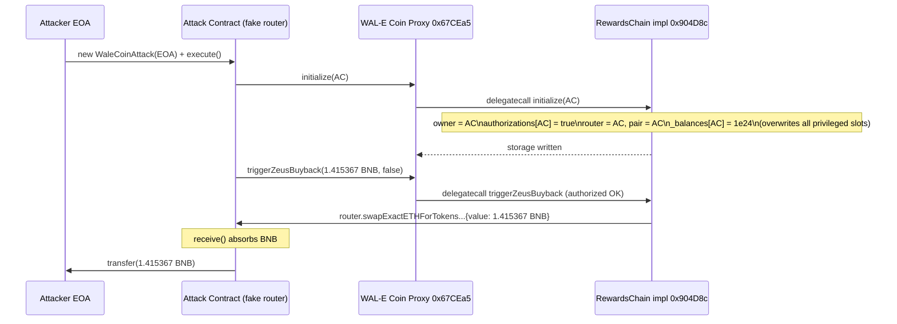
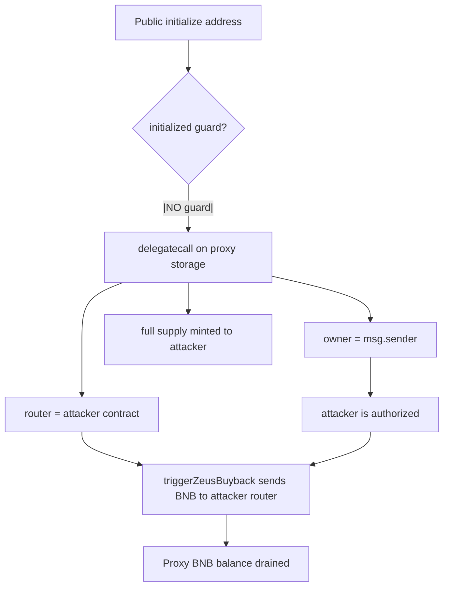

# WAL-E Coin proxy reinitialization → authorized buyback drain — public `initialize()` with no guard rewrites owner/router and unlocks `triggerZeusBuyback`

> **Vulnerability classes:** vuln/access-control/missing-auth · vuln/logic/incorrect-state-transition · vuln/dependency/upgradeable-contract
> **Reproduction:** the PoC compiles & runs in an isolated Foundry project at [this project folder](.). Full verbose trace: [output.txt](output.txt). Vulnerable source verified on BscScan — proxy ([TransparentUpgradeableProxy](sources/TransparentUpgradeableProxy_67CEa5/TransparentUpgradeableProxy.sol)) and implementation ([RewardsChain](sources/RewardsChain_904D8c/RewardsChain.sol)), both fetched and grounded below.
---
## Key info
| | |
|---|---|
| **Loss** | 1.415367204023272901 BNB (~$430 at the time) |
| **Vulnerable contract** | WAL-E Coin Proxy (TransparentUpgradeableProxy) — [`0x67CEa5e25903c3022eBAF99E67e1898f1De6a75E`](https://bscscan.com/address/0x67CEa5e25903c3022eBAF99E67e1898f1De6a75E) → impl RewardsChain [`0x904D8c8Ac825B70ce893cfdB133899d21e10e8b7`](https://bscscan.com/address/0x904d8c8Ac825B70ce893cfdB133899d21e10e8b7#code) |
| **Attacker EOA** | [`0xc49F2938327aa2Cdc3F2F89Ed17b54b3671f05dE`](https://bscscan.com/address/0xc49F2938327aa2Cdc3F2F89Ed17b54b3671f05dE) |
| **Attack contract** | [`0x07a86AB86C58B894C3722fA8C69065320fAE8883`](https://bscscan.com/address/0x07a86AB86C58B894C3722fA8C69065320fAE8883) |
| **Attack tx** | [`0xa3607a9db9ef422f19d341f728f5eaff3514358b7fe7d46aaf5de059ca67cd64`](https://bscscan.com/tx/0xa3607a9db9ef422f19d341f728f5eaff3514358b7fe7d46aaf5de059ca67cd64) |
| **Chain / block / date** | BNB Chain (BSC) / 51,488,106 / 2025-06 |
| **Compiler** | RewardsChain v0.8.0+commit.c7dfd78e (optimizer on, 200 runs); Proxy v0.8.2+commit.661d1103 |
| **Bug class** | An unguarded `initialize(address)` on an upgradeable-proxy implementation lets any caller re-take ownership and point the `router`/`pair` at attacker-controlled code, after which the `authorized`-only `triggerZeusBuyback` forwards the proxy's full BNB balance to that router. |

## TL;DR

WAL-E Coin (`$WAL-E`) is a BSC "dividend + buyback" token deployed behind an ERC-1967-style transparent upgradeable proxy. The implementation, `RewardsChain`, performs all of its setup inside a single public `initialize(address _dexRouter)` function — including `initializeOwner(msg.sender)`, assigning the DEX router, creating the pair, minting the full supply to the caller, and setting fee/role receivers. Critically, `initialize` has **no `initializer`/`!initialized` guard** (unlike the sibling `DividendDistributor` contract in the same file, which does carry such a guard). Because the token lives behind a proxy, `initialize` executes as a `delegatecall` against the proxy's own storage, so anyone can call `proxy.initialize(myContract)` at any time and overwrite every privileged slot.

The exploit deployed a fake "router" contract (`WaleCoinAttack`) and called `WALE_COIN.initialize(attackContract)`. That single transaction made the attack contract the new `owner`, the new `router`, and the recipient of a freshly minted 1e15-token supply (`1_000_000_000_000_000 * 1e9`), while the old owner/router/pair were overwritten in place. With `msg.sender == attackContract` now `authorized`, the attacker called `triggerZeusBuyback(WAL.proxyBalance, false)`. The buyback path in `buyTokens()` invokes `router.swapExactETHForTokensSupportingFeeOnTransferTokens{value: amount}(...)`, sending the proxy's entire BNB balance to the attacker's fake router — which simply absorbed the value and forwarded it to the attacker EOA.

The PoC reproduces this exactly against the offline fork state. The proxy held `1.415367204023272901 BNB` before the attack [output.txt:1569-1570]; after `initialize` + `triggerZeusBuyback` the attacker EOA balance went from `0` to exactly `1.415367204023272901 BNB` [output.txt:1683], the proxy balance went to `0`, and the new `getOwner()`/`router()` both resolved to the attack contract [output.txt:1567 PASS]. Zero flash loan, zero privileged role required — just a public, guard-less setter that re-runs on already-initialized proxy storage.

## Background — what WAL-E Coin does

`RewardsChain` is a classic "tax-and-redistribute" BEP-20 in the style of late-2021 BSC dividend tokens. On every transfer it optionally (a) swaps accumulated token fees for BNB via the configured PancakeSwap router (`swapBack`), (b) routes a portion of that BNB into a `DividendDistributor` which converts it to a reward token and pays holders pro-rata, and (c) runs an auto-buyback that spends the contract's own BNB buying the token from the pair to pump price (`triggerAutoBuyback` / `triggerZeusBuyback`).

Privilege is managed by the `Auth` base contract: a single `owner` plus a `mapping(address=>bool) authorizations`. Two modifiers gate the interesting functions — `onlyOwner` (used by `authorize`/`transferOwnership`) and `authorized` (used by `triggerZeusBuyback`, `launch`, fee setters, and most admin knobs). The `authorized` set is seeded by `initializeOwner`, which writes `owner = _owner; authorizations[owner] = true`. The whole authorization model therefore collapses to "whoever last ran `initializeOwner` owns the contract."

The token is exposed through a [TransparentUpgradeableProxy](sources/TransparentUpgradeableProxy_67CEa5/TransparentUpgradeableProxy.sol) (the verified `0x67CEa5…` address). The proxy's `_delegate()` forwards any unknown selector to the implementation via `delegatecall`, so all storage writes from `RewardsChain` functions land in the **proxy's** storage slots. The legitimate deploy path was: deploy proxy → delegatecall `initialize(realRouter)` to configure owner/router/supply. The bug is that the proxy exposes `initialize` permanently and `RewardsChain.initialize` never refuses to run a second time.

## The vulnerable code

### Unprotected `initialize()` on the upgradeable-proxy implementation

From the verified [RewardsChain.sol](sources/RewardsChain_904D8c/RewardsChain.sol):

```solidity
// RewardsChain.sol, Auth base — owner/authorizations live in implementation (hence proxy) storage
abstract contract Auth {
    address internal owner;
    mapping (address => bool) internal authorizations;

    function initializeOwner(address _owner) internal {
        owner = _owner;
        authorizations[owner] = true;   // <-- no deauthorization of the previous owner
    }
    ...
    modifier authorized() {
        require(isAuthorized(msg.sender), "!AUTHORIZED"); _;
    }
    ...
}
```

```solidity
// RewardsChain.sol — the public entry point. NO initializer modifier, NO !initialized check.
function initialize ( address _dexRouter ) public {
    initializeOwner(msg.sender);                                   // rewrites owner + authorizes caller
    ...
    _totalSupply = 1_000_000_000_000_000 * (10 ** _decimals);       // remints the entire supply
    ...
    router = IDEXRouter(_dexRouter);                               // attacker-controlled
    pair = IDEXFactory(router.factory()).createPair(WBNB, address(this));
    _allowances[address(this)][address(router)] = _totalSupply;
    WBNB = router.WETH();
    distributor = new DividendDistributor(_dexRouter);
    ...
    isFeeExempt[msg.sender] = true;
    isTxLimitExempt[msg.sender] = true;
    buyBacker[msg.sender] = true;
    autoLiquidityReceiver = msg.sender;
    marketingFeeReceiver = msg.sender;

    approve(_dexRouter, _totalSupply);
    approve(address(pair), _totalSupply);
    _balances[msg.sender] = _totalSupply;                          // full supply to caller
    emit Transfer(address(0), msg.sender, _totalSupply);
}
```

Contrast with the sibling contract in the **same source file**, which gets it right:

```solidity
// DividendDistributor (same file, lines 269-274) — correctly guarded
bool initialized;
modifier initialization() {
    require(!initialized);
    _;
    initialized = true;
}
```

The `RewardsChain` author copied that pattern into the distributor but never applied an analogous guard to `initialize`. So `initialize` is permanently callable on the proxy.

### The drain primitive — `triggerZeusBuyback`

```solidity
// RewardsChain.sol — guarded only by `authorized`, which initialize just granted the attacker
function triggerZeusBuyback(uint256 amount, bool triggerBuybackMultiplier) external authorized {
    buyTokens(amount, DEAD);
    ...
}

function buyTokens(uint256 amount, address to) internal swapping {
    address[] memory path = new address[](2);
    path[0] = WBNB;
    path[1] = address(this);
    router.swapExactETHForTokensSupportingFeeOnTransferTokens{value: amount}(   // <-- sends `amount` BNB to `router`
        0, path, to, block.timestamp
    );
}
```

When `router` is the attacker's fake router, this is simply an uncapped, authorization-gated `address(this).balance` transfer to the attacker. The attacker passes `amount = WALE_COIN.balance` and pockets the entire balance.

The fake router in the PoC implements the one selector the contract actually calls, plus `factory()`/`createPair()`/`WETH()` to satisfy `initialize`, and a `receive()` to absorb the BNB:

```solidity
// WaleCoin_exp.sol — attacker's fake "router"
function swapExactETHForTokensSupportingFeeOnTransferTokens(
    uint256, address[] calldata, address, uint256
) external payable {}        // does nothing; keeps the msg.value

receive() external payable {}
```

## Root cause — why it was possible

1. **`initialize()` has no initialization guard.** It is `public`, takes no precautions against being called twice, and performs every privileged setup action (owner, router, pair, supply mint, fee receivers, allowances). The matching guard exists in `DividendDistributor.initialization()` in the same file — it was simply never applied to `RewardsChain.initialize`.
2. **The token runs behind an upgradeable proxy with no storage-collision protection for `initialize`.** Because `initialize` runs as a `delegatecall`, every write hits the proxy's live state. Re-running it overwrites `owner`, `router`, `pair`, `_allowances`, `_balances`, `autoLiquidityReceiver`, and `marketingFeeReceiver` — i.e., a full storage hostile takeover, not just ownership.
3. **`triggerZeusBuyback` is gated by `authorized`, not `onlyOwner`, and forwards an arbitrary `amount` of BNB to whatever address `router` points at.** The intended invariant ("`router` is the real PancakeSwap router, so `buyTokens` actually buys token") is never enforced; the contract trusts the `router` storage slot blindly. Once `initialize` overwrote `router`, `triggerZeusBuyback(address(this).balance, …)` became a direct drain.
4. **`Auth.initializeOwner` never deauthorizes the previous owner, and `initialize` re-mints `_totalSupply` to the new caller** — compounding the takeover: the attacker not only became authorized, they also received a fresh full supply (trace shows `_balances[attackContract] = 1e24` after the call [output.txt:1678-1681]) and superseded the legitimate owner/router/pair with no on-chain protest.

## Preconditions

- **Permissionless.** Any externally owned account or contract can call `proxy.initialize(_dexRouter)` — no role, no token, no stake required. The function is `public` with no modifier.
- **No flash loan needed.** The BNB drained already belonged to the contract (accumulated buyback/fee BNB); the attacker only needs gas.
- **The proxy must hold a positive BNB balance.** On the forked block the proxy held `1.415367204023272901 BNB` [output.txt:1569-1570]. The profit equals `min(proxy.balance, …)` — there is no upper cap on `amount` in `triggerZeusBuyback`.
- **Attacker must deploy a fake router exposing `factory()`, `createPair`, `WETH()`, and `swapExactETHForTokensSupportingFeeOnTransferTokens`** (the PoC's `WaleCoinAttack`). This is a one-deploy, ~30-line contract.

## Attack walkthrough (with on-chain numbers from the trace)

Setup at fork block 51,488,106 [WaleCoin_exp.sol `forkBlock`]:

| Step | Call | Effect | Trace ref |
|---|---|---|---|
| 0 | read | `WALE_COIN.balance = 1.415367204023272901 BNB`, `getOwner() ≠ 0`, `router() ≠ 0` | [output.txt:1569] (before) |
| 1 | `WaleCoinAttack.execute()` | `initialize(attackContract)` via the proxy | [output.txt:1611] |
| 1a | └ `initializeOwner(msg.sender)` | `owner = attackContract`, `authorizations[attackContract] = true` | delegatecall to impl |
| 1b | └ re-mint + config | `router = attackContract`, `pair = attackContract`, `_allowances[this][router] = 1e24`, `_balances[attackContract] = 1e24`, `Transfer(0 → attackContract, 1e24)` | [output.txt:1629-1631] |
| 2 | `triggerZeusBuyback(1415367204023272901, false)` | `buyTokens(amount, DEAD)` on the attacker's `router` | [output.txt:1652-1654] |
| 2a | └ fake router call | `swapExactETHForTokensSupportingFeeOnTransferTokens{value: 1.415367204023272901 BNB}(...)` — body empty, BNB retained | [output.txt:1654] |
| 3 | `profitReceiver.transfer(this.balance)` | 1.415367204023272901 BNB forwarded to attacker EOA | [output.txt:1683] |
| 4 | assertions | `attackerProfit == contractBnbBefore` ✓, `WALE_COIN.balance == 0` ✓, `getOwner()==router()==attackContract` ✓ | [output.txt:1567 PASS] |

**Profit/loss accounting:**

| Account | Before | After | Δ |
|---|---|---|---|
| WAL-E Coin proxy (BNB) | 1.415367204023272901 | 0 | **−1.415367204023272901 BNB** |
| Attacker EOA (BNB) | 0 | 1.415367204023272901 | **+1.415367204023272901 BNB** |

Net attacker profit: **1.415367204023272901 BNB** (~$430), zero capital beyond gas. The [PASS] line confirms the reproduction [output.txt:1567].

## Diagrams





## Remediation

1. **Add an initializer guard to `RewardsChain.initialize`** mirroring the existing `DividendDistributor.initialization` modifier:
   ```solidity
   bool initialized;
   modifier initialization() { require(!initialized, "ALREADY_INITIALIZED"); _; initialized = true; }
   function initialize(address _dexRouter) public initialization { ... }
   ```
   This is the single fix that closes the exploit on a live deployment.
2. **Make `initialize` callable only by the proxy admin / deployer**, e.g. wrap with an `ifAdmin`-style check or move initialization into the proxy constructor's delegatecall so it can never be invoked again by an external caller.
3. **Do not trust the `router` storage slot for value movement.** `triggerZeusBuyback`/`buyTokens` should either (a) `require(address(router) == KNOWN_PANCAKE_ROUTER, "bad router")`, or (b) cap `amount` to a sane fraction of `address(this).balance` and emit an event. Authorizations alone are insufficient when the authorization surface itself is mutable by an unguarded setter.
4. **In `Auth.initializeOwner`, deauthorize the previous owner** (`authorizations[oldOwner] = false`) before reassigning — defense in depth, so a re-init cannot leave two authorized actors.
5. **For the proxy itself**, expose only intended function selectors and keep `initialize` out of the public ABI once configured; or use an immutable/non-upgradeable token if no genuine upgrade need exists.

## How to reproduce

The PoC runs fully **OFFLINE** via the shared anvil harness from the committed `anvil_state.json` — no RPC needed:

```bash
_shared/run_poc.sh 2025-06-WaleCoin_exp -vvvvv
```

- **Chain / fork block:** BNB Chain (BSC, chain id 56) / block 51,488,106.
- **Expected tail:** `Suite result: ok. 1 passed; 0 failed; 0 skipped.` with `[PASS] testExploit()` [output.txt:1567], followed by:
  - `Attacker Before exploit BNB Balance: 0.000000000000000000` [output.txt:1569]
  - `Attacker After exploit BNB Balance: 1.415367204023272901` [output.txt:1683]
- The assertions in `testExploit()` confirm `attackerProfit == contractBnbBefore`, `WALE_COIN.balance == 0`, and that `getOwner()`/`router()` were rewritten to the attack contract.

*Reference: [defimon_alerts (Telegram)](https://t.me/defimon_alerts/1279) — attack transaction [`0xa3607a9d…ca67cd64`](https://bscscan.com/tx/0xa3607a9db9ef422f19d341f728f5eaff3514358b7fe7d46aaf5de059ca67cd64).*
