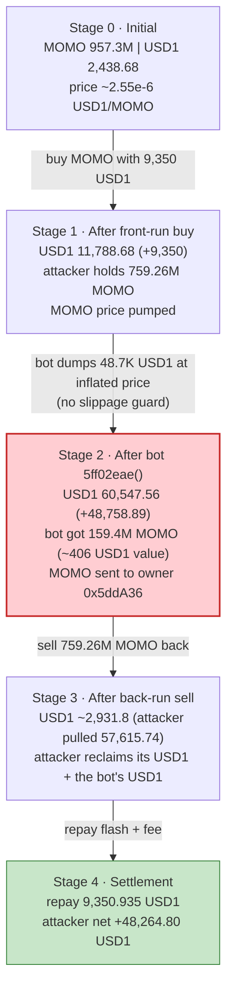
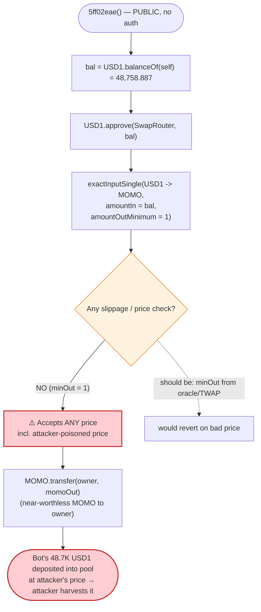

# MOMO Buyback-Bot Exploit — Permissionless, Slippage-Free `5ff02eae()` Sandwiched on a Thin USD1/MOMO Pool

> **Vulnerability classes:** vuln/access-control/missing-auth · vuln/defi/slippage · vuln/defi/sandwich-attack

> **Reproduction:** the PoC compiles & runs in an isolated Foundry project at
> [this project folder](.) (the umbrella DeFiHackLabs repo does not whole-compile,
> so this PoC was extracted).
> Full verbose trace: [output.txt](output.txt).
> The vulnerable contract `0x8490…` is **unverified** on BscScan (hence the
> `unverified_8490` PoC name) — its behaviour below is reconstructed from the
> on-chain execution trace and its decompiled function selectors. The token it
> trades, USD1, is verified: [StablecoinV2](sources/StablecoinV2_694aa5/contracts_StablecoinV2.sol).

---

## Key info

| | |
|---|---|
| **Loss** | ~$48.3K — **48,264.80 USD1** extracted from the MOMO buyback bot |
| **Vulnerable contract** | MOMO buyback/treasury bot (unverified) — [`0x8490AA884Adb08a485BC8793C17296c9E2c91294`](https://bscscan.com/address/0x8490AA884Adb08a485BC8793C17296c9E2c91294) |
| **Vulnerable entry point** | `5ff02eae()` — permissionless, no slippage protection (`amountOutMinimum = 1`) |
| **Victim pool** | PancakeSwap V3 MOMO/USD1 0.01% pool — `0x2C79bB8155aCbAA38D96BDB5C770D2372c509a32` |
| **Tokens** | `token0 = MOMO` (`0x0B9dDfCA…774444`), `token1 = USD1` (`0x8d0D000E…f08B0d`, World Liberty Financial USD) |
| **Flash-loan source** | PancakeSwap V3 pool `0xbaf9f711a39271701b837c5cC4F470d533bACf33` (USD1 side) |
| **Attacker EOA** | `0x7248939f65bdd23aab9eaab1bc4a4f909567486e` (tx.origin in PoC: `0xF514C020…2bdD18A`) |
| **Attack contract** | [`0xc59d50e26aee2ca34ae11f08924c0bc619728e7c`](https://etherscan.io/address/0xc59d50e26aee2ca34ae11f08924c0bc619728e7c) |
| **Attack tx** | [`0x9191153c8523d97f3441a08fef1da5e4169d9c2983db9398364071daa33f59d1`](https://bscscan.com/tx/0x9191153c8523d97f3441a08fef1da5e4169d9c2983db9398364071daa33f59d1) |
| **Chain / block / date** | BSC / 51,190,821 / June 2025 |
| **Compiler** | Bot: unverified bytecode; USD1 impl: Solidity v0.8.24, optimizer 200 runs |
| **Bug class** | Unprotected, permissionless market operation (no slippage, no caller gate) sandwiched on a low-liquidity AMM pool |
| **Post-mortem** | [TenArmorAlert](https://x.com/TenArmorAlert/status/1932309011564781774) |

---

## TL;DR

`0x8490…` is a **buyback/treasury bot** for the MOMO token. It holds a pile of USD1
(48,758.887 USD1 at the fork block) and exposes a public function — selector
`5ff02eae()` — that, when called, **swaps its *entire* USD1 balance into MOMO with
`amountOutMinimum = 1`** (i.e. zero slippage protection) and forwards the MOMO to the
bot's owner. The function has **no access control**: anyone can trigger it at any time.

That combination — *(a) a known, fixed pot of capital, (b) a market swap with no
minimum-output guard, (c) anyone can fire it on demand* — turns the bot into a victim
that anyone can **sandwich**. The MOMO/USD1 pool it trades against is extremely thin
(only **2,438.68 USD1** of liquidity on the USD1 side), so the price moves a lot for a
small trade.

The attacker, using a USD1 flash loan as working capital:

1. **Front-runs** the bot: buys MOMO with 9,350 USD1, pushing MOMO's price up and
   skewing the pool.
2. **Triggers the bot** via `5ff02eae()`: the bot blindly dumps all 48,758.887 USD1
   into the pool at the inflated MOMO price (getting back near-worthless MOMO), depositing
   that USD1 into the pool reserve.
3. **Back-runs**: sells the MOMO it bought in step 1 back into the pool, scooping out the
   USD1 the bot just deposited.
4. **Repays** the 9,350 USD1 flash loan + fee and walks away with **48,264.80 USD1**.

Net result: the bot's USD1 treasury is converted into worthless MOMO (forwarded to its
own owner), and the equivalent USD1 ends up in the attacker's pocket.

---

## Background — what the contracts do

- **USD1** (`0x8d0D000E…f08B0d`) is *World Liberty Financial USD*, a standard,
  upgradeable, OpenZeppelin-based stablecoin (proxy → `StablecoinV2` implementation at
  `0x694aa534…891f08`). It is a `TransparentUpgradeableProxy`; every `Stablecoin::…
  [delegatecall]` line in the trace is just USD1's normal ERC-20 logic. **USD1 is not the
  vulnerable contract** — it is merely the asset being moved around. Its source is
  included for completeness ([StablecoinV2.sol](sources/StablecoinV2_694aa5/contracts_StablecoinV2.sol)).

- **MOMO** (`0x0B9dDfCA…774444`, name/symbol `MOMO`) is the project token traded against
  USD1 in a PancakeSwap V3 pool.

- **The bot** (`0x8490AA88…91294`, **unverified**) is a MOMO buyback/treasury contract.
  Its decompiled dispatch table exposes:

  | Selector | Likely role | Evidence |
  |---|---|---|
  | `8da5cb5b` | `owner()` | returns `0x5ddA362775267D2C77D8A49583751174eFA47e1C` |
  | **`5ff02eae`** | **buyback: swap all USD1 → MOMO, send to owner** | the function the attacker called |
  | `80640eb9` | `bool` getter (some flag) | returns a `bool` |
  | `a6ff9e94`, `bf1bf3f3` | admin/config | not exercised |
  | `receive()` | accepts BNB | dispatch jump at offset `0x53` |

  From the trace, calling `5ff02eae()` makes the bot:
  1. read its own USD1 balance (`balanceOf(0x8490) = 48,758.887 USD1`,
     [output.txt:88-91](output.txt#L88-L91)),
  2. `approve` the PancakeSwap V3 `SwapRouter` (`0x1b81D678…13eB14`) for that exact amount
     ([output.txt:92-98](output.txt#L92-L98)),
  3. call `exactInputSingle(tokenIn = USD1, tokenOut = MOMO, fee = 100, amountIn =
     48,758.887 USD1, **amountOutMinimum = 1**)` ([output.txt:99](output.txt#L99)),
  4. transfer the MOMO it received to the owner `0x5ddA36…`
     ([output.txt:136-137](output.txt#L136-L137)).

The on-chain state at the fork block (read via `cast`):

| Parameter | Value |
|---|---|
| Bot's USD1 balance (the pot) | **48,758.887 USD1** |
| Pool MOMO reserve (`token0`) | 957,315,231.0 MOMO |
| Pool USD1 reserve (`token1`) | **2,438.68 USD1** ← thin side |
| Pool fee tier | 100 = **0.01%** |
| Bot owner / MOMO sink | `0x5ddA362775267D2C77D8A49583751174eFA47e1C` (EOA) |

The two facts that make this exploitable: the bot will trade a **fixed, large** amount
(48.7K USD1) **with no minimum-output check**, against a pool whose USD1 side is only
**2.4K USD1** deep — a ~20× ratio that the attacker can freely amplify before the bot fires.

---

## The vulnerable code

The bot is unverified, so the exact Solidity is unavailable. The reconstructed logic of
`5ff02eae()` — derived directly from the execution trace
([output.txt:83-142](output.txt#L83-L142)) — is:

```solidity
// 0x8490…  selector 0x5ff02eae  — PERMISSIONLESS, no onlyOwner, no slippage guard
function buyback() external {            // ⚠️ no access control
    uint256 usd1Bal = USD1.balanceOf(address(this));      // 48,758.887 USD1
    USD1.approve(SWAP_ROUTER, usd1Bal);
    uint256 momoOut = ISwapRouter(SWAP_ROUTER).exactInputSingle(
        ExactInputSingleParams({
            tokenIn:           address(USD1),
            tokenOut:          address(MOMO),
            fee:               100,
            recipient:         address(this),
            deadline:          block.timestamp,
            amountIn:          usd1Bal,
            amountOutMinimum:  1,           // ⚠️ ZERO slippage protection
            sqrtPriceLimitX96: 0            // ⚠️ no price limit
        })
    );
    MOMO.transfer(owner(), momoOut);       // hand MOMO to 0x5ddA36…
}
```

The attacker-side calldata is the literal driver of the bug — see the PoC
([test/unverified_8490_exp.sol:74-107](test/unverified_8490_exp.sol#L74-L107)):

```solidity
function pancakeV3FlashCallback(uint256, uint256, bytes calldata) external {
    // 1. FRONT-RUN: buy MOMO with the 9,350 USD1 flash-borrowed
    USD1.approve(SmartRouter, type(uint).max);
    SmartRouter.exactInputSingle( USD1 -> MOMO, amountIn = 9350e18, amountOutMin = 0 );

    // 2. TRIGGER THE BOT — permissionless call, no args
    (bool s,) = bot.call(abi.encodeWithSelector(bytes4(0x5ff02eae)));   // <-- the exploit
    require(s, "addr call fail");

    // 3. BACK-RUN: sell all the MOMO back for USD1
    MOMO.approve(SmartRouter, type(uint).max);
    SmartRouter.exactInputSingle( MOMO -> USD1, amountIn = bal, amountOutMin = 0 );

    // 4. repay flash loan (9,350 + 0.01% fee)
    USD1.transfer(PancakeV3Pool, 9350935 * 1e15);
}
```

---

## Root cause — why it was possible

The bot is a **price-taking market participant whose order is fully attacker-controllable
in timing, size context, and execution price.** Three independent design failures compose
into a one-transaction theft:

1. **Permissionless trigger.** `5ff02eae()` has no `onlyOwner`/keeper gate. The attacker —
   not the project — decides *when* the bot spends 48.7K USD1. They fire it at the exact
   moment the pool is maximally skewed in their favour.

2. **No slippage protection.** The swap passes `amountOutMinimum = 1` and
   `sqrtPriceLimitX96 = 0`. A market swap with no minimum-output guard will accept *any*
   price, including the deliberately-poisoned price the attacker set one step earlier. This
   is the single line that converts "the bot bought MOMO a bit high" into "the bot was
   forced to buy at a 100×-inflated price."

3. **Fixed, fully-known capital against a thin pool.** The bot always spends its *entire*
   USD1 balance (a known 48,758.887 USD1) into a pool that holds only 2,438.68 USD1 on the
   USD1 side. Because the trade size dwarfs the pool, the bot's own buy moves the price
   enormously — and the attacker has already pre-positioned to harvest that move.

The general pattern: **a protocol-owned swap with `amountOutMin = 0`, callable by anyone,
is a free sandwich target.** The deeper the pot and the thinner the pool, the larger the
extractable value. Here the entire 48.7K USD1 treasury was extractable in full because no
guard limited how badly the bot could be made to trade.

---

## Preconditions

- The bot holds a meaningful USD1 balance (48,758.887 USD1) — the prize is bounded by this pot.
- `5ff02eae()` is callable by `tx.origin == attacker` only in the PoC's `if` guard; on-chain
  the function itself has **no caller restriction**, so any address can fire it.
- The MOMO/USD1 pool is thin enough that 9,350 USD1 of front-run capital meaningfully skews
  the price — true here (USD1 reserve = 2,438.68).
- Working capital in USD1 to front-run. Peak outlay is 9,350 USD1 and it is fully recovered
  intra-transaction, hence **flash-loanable** — the PoC borrows it from PancakeSwap V3 pool
  `0xbaf9…` ([test/unverified_8490_exp.sol:70](test/unverified_8490_exp.sol#L70)).

---

## Attack walkthrough (with on-chain numbers from the trace)

The pool `0x2C79…` has `token0 = MOMO`, `token1 = USD1`. All figures below come directly
from the `Swap`/`Transfer` events and `balanceOf` reads in
[output.txt](output.txt). Pool reserves are tracked on the USD1 (token1) side, the scarce side.

| # | Step | Pool USD1 reserve | MOMO moved | Effect |
|---|------|------------------:|-----------:|--------|
| 0 | **Initial** (block 51190820) | 2,438.68 | — | Thin honest pool: 957.3M MOMO / 2,438.68 USD1. |
| 1 | **Flash-borrow** 9,350 USD1 from pool `0xbaf9` | — | — | Working capital acquired ([:20](output.txt#L20)). |
| 2 | **FRONT-RUN** — swap 9,350 USD1 → **759,262,671.378 MOMO** to attacker ([:46-82](output.txt#L46-L82)) | 2,438.68 → **11,788.68** | +759.26M out | MOMO price pumped; attacker now holds 759.26M MOMO. |
| 3 | **TRIGGER BOT** `5ff02eae()` — bot swaps **48,758.887 USD1 → 159,416,187.664 MOMO** (`amountOutMin = 1`), MOMO sent to owner `0x5ddA36` ([:83-142](output.txt#L83-L142)) | 11,788.68 → **60,547.56** | +159.4M to owner | Bot buys MOMO at the inflated price; deposits 48.7K USD1 into the pool. |
| 4 | **BACK-RUN** — swap **759,262,671.378 MOMO → 57,615.739 USD1** to attacker ([:150-184](output.txt#L150-L184)) | 60,547.56 → ~2,931.8 | −759.26M in | Attacker reclaims the USD1 the bot just deposited (plus the pump). |
| 5 | **Repay flash** 9,350.935 USD1 to pool `0xbaf9` (9,350 + 0.01% fee = 0.935) ([:185-192](output.txt#L185-L192), `Flash` event [:200](output.txt#L200)) | — | — | Loan + fee returned. |
| 6 | **Final** balance of attack contract ([:208-212](output.txt#L208-L212)) | — | — | **48,264.80 USD1** held by attacker. |

### Profit accounting (USD1)

| Direction | Amount (USD1) |
|---|---:|
| Borrowed (flash) | 9,350.000 |
| Received — back-run sell (MOMO → USD1) | 57,615.739 |
| Repaid — flash principal + fee | 9,350.935 |
| **Net profit** | **+48,264.804** |

Cross-check against the bot's loss: the bot spent **48,758.887 USD1** and received
159.4M MOMO worth only ≈ **406 USD1** at the pre-attack price
(2,438.68 USD1 / 957.3M MOMO ≈ 2.55e-6 USD1/MOMO). The bot's value loss ≈ **48,352 USD1**,
essentially all of which the attacker captured (48,264.80 USD1), the small difference being
pool fees and residual reserve drift. Loss figure of **~$48.3K** matches the PoC header
(USD1 ≈ $1).

---

## Diagrams

### Sequence of the attack (the sandwich)

```mermaid
sequenceDiagram
    autonumber
    actor A as "Attacker contract"
    participant FL as "Flash pool 0xbaf9 (USD1)"
    participant SR as "Pancake SmartRouter"
    participant P as "MOMO/USD1 pool 0x2C79"
    participant B as "Buyback bot 0x8490"
    participant O as "Bot owner 0x5ddA36"

    Note over P: Initial reserves<br/>957.3M MOMO / 2,438.68 USD1<br/>(thin USD1 side)

    A->>FL: flash(9,350 USD1)
    FL-->>A: 9,350 USD1

    rect rgb(255,243,224)
    Note over A,P: Step 1 — FRONT-RUN (pump MOMO)
    A->>SR: exactInputSingle(9,350 USD1 -> MOMO, minOut=0)
    SR->>P: swap()
    P-->>A: 759,262,671 MOMO
    Note over P: 11,788.68 USD1 in reserve; MOMO price inflated
    end

    rect rgb(255,235,238)
    Note over A,O: Step 2 — TRIGGER THE BOT (the bug)
    A->>B: call 0x5ff02eae() (permissionless)
    B->>B: read own USD1 balance = 48,758.887
    B->>SR: exactInputSingle(48,758.887 USD1 -> MOMO, minOut=1)
    SR->>P: swap()
    P-->>B: 159,416,187 MOMO (bought at pumped price)
    B->>O: transfer 159,416,187 MOMO to owner
    Note over P: 60,547.56 USD1 in reserve (bot deposited 48.7K)
    end

    rect rgb(232,245,233)
    Note over A,P: Step 3 — BACK-RUN (harvest the deposited USD1)
    A->>SR: exactInputSingle(759,262,671 MOMO -> USD1, minOut=0)
    SR->>P: swap()
    P-->>A: 57,615.739 USD1
    end

    A->>FL: repay 9,350.935 USD1 (principal + 0.01% fee)
    Note over A: Net +48,264.80 USD1
```

### Pool / capital state evolution



### The flaw inside `5ff02eae()`



---

## Why each number

- **Flash loan = 9,350 USD1.** Sized to skew the thin pool (2,438.68 USD1 deep) enough that
  the bot's subsequent 48.7K-USD1 buy executes at a badly inflated MOMO price, while still
  being trivially repayable. The 759.26M MOMO it buys is the inventory used to harvest the
  USD1 the bot deposits.
- **Bot spend = 48,758.887 USD1.** Not chosen by the attacker — it is the bot's *entire*
  USD1 balance, which `5ff02eae()` always spends in full. This is the ceiling on the theft.
- **`amountOutMinimum = 1`.** The defect. With any meaningful minimum-output the bot's swap
  would have reverted once the attacker poisoned the price, breaking the sandwich.
- **Repay = 9,350.935 USD1.** Principal + the PancakeSwap V3 0.01% flash fee
  (9,350 × 0.0001 = 0.935), seen in the `Flash` event `paid1 = 935000000000000000`
  ([output.txt:200](output.txt#L200)).

---

## Remediation

1. **Add slippage protection to the bot's swap.** Set `amountOutMinimum` from an on-chain
   TWAP/oracle (or a tight off-chain quote) so the swap reverts if the realised price
   deviates beyond a small tolerance. `amountOutMinimum = 1` must never be used for a
   protocol-owned trade.
2. **Gate the trigger.** Restrict `5ff02eae()` to the owner or a trusted keeper, or use a
   private/MEV-protected transaction (e.g. a relay/bundle) so the trade cannot be sandwiched.
   A permissionless market order that spends a fixed treasury is inherently a sandwich target.
3. **Set a `sqrtPriceLimitX96`.** Pass a non-zero price limit to `exactInputSingle` so the
   swap cannot push the pool past a sane bound in a single call.
4. **Size trades to pool depth.** Never market-swap a treasury that is many multiples of the
   pool's reserve in one shot; split into bounded slices, use a deeper pool, or route through
   an aggregator with built-in price checks.
5. **Prefer commit/keeper architecture over "anyone can fire the treasury."** If buybacks
   must be public, cap the per-call amount and enforce both a minimum output and a maximum
   price impact.

---

## How to reproduce

The PoC was extracted into a standalone Foundry project (the umbrella DeFiHackLabs repo has
several unrelated PoCs that fail to compile under a whole-project `forge test` build):

```bash
_shared/run_poc.sh 2025-06-unverified_8490_exp -vvvvv
```

- RPC: a **BSC archive** endpoint is required (fork block 51,190,821). `foundry.toml` uses
  `https://bsc-mainnet.public.blastapi.io`, which serves historical state at that block;
  the default `onfinality` public endpoint rate-limits (HTTP 429) and most public BSC RPCs
  prune that depth.
- Result: `[PASS] testPoC()` with the attack contract ending on **48,264.80 USD1**.

Expected tail:

```
Ran 1 test for test/unverified_8490_exp.sol:ContractTest
[PASS] testPoC() (gas: 4494429)
Logs:
  after attack: balance of address(attC): 48264.803792092412941512

Suite result: ok. 1 passed; 0 failed; 0 skipped
```

---

*Reference: TenArmorAlert post-mortem — https://x.com/TenArmorAlert/status/1932309011564781774 (MOMO buyback bot, BSC, ~$48.3K).*
