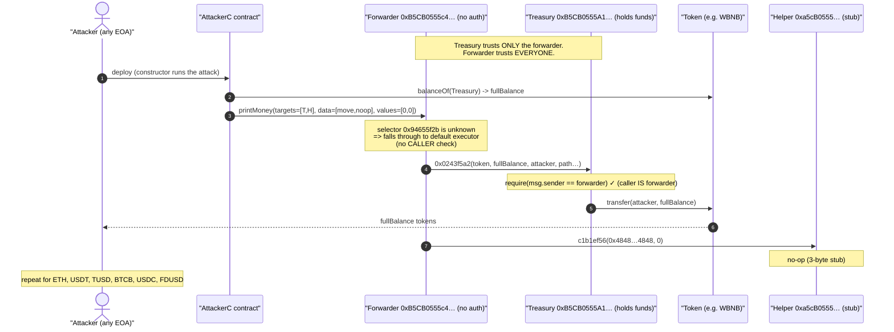
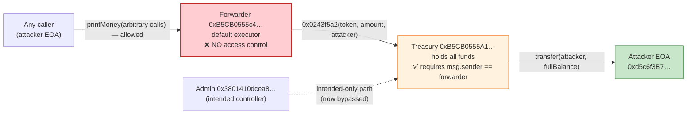
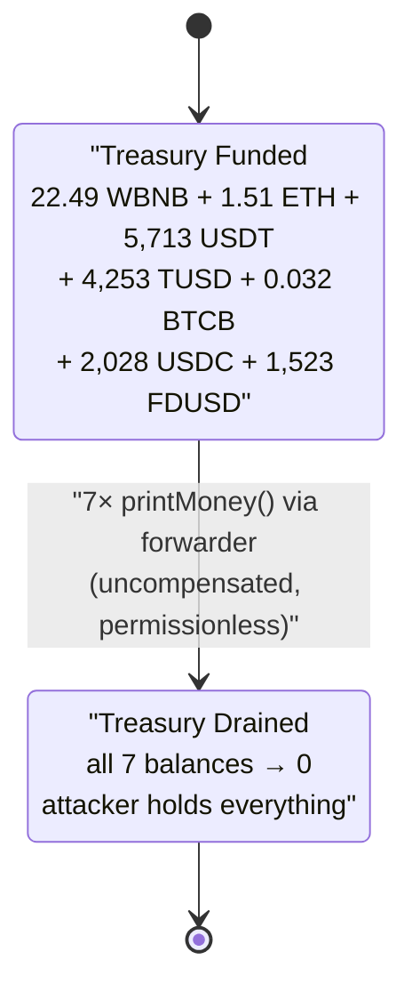

# "b5cb0555" Exploit — Permissionless `printMoney()` Forwarder Drains a Trusted Treasury (Confused Deputy)

> **Vulnerability classes:** vuln/access-control/missing-auth · vuln/access-control/broken-logic · vuln/dependency/unsafe-external-call

> **Reproduction:** the PoC compiles & runs in an isolated Foundry project at
> [this project folder](.) (the umbrella DeFiHackLabs repo contains many unrelated PoCs that do
> not compile together, so this one was extracted).
> Full verbose trace: [output.txt](output.txt).
> All three core contracts are **unverified** on BscScan — analysis below is reconstructed from the
> live execution trace and on-chain bytecode disassembly (see [How sources were reconstructed](#how-sources-were-reconstructed)).

---

## Key info

| | |
|---|---|
| **Loss (this tx)** | ~**$35.3K** drained from the treasury (22.49 WBNB + 1.51 ETH + 5,713.6 USDT + 4,253.6 TUSD + 0.032 BTCB + 2,028.1 USDC + 1,523.8 FDUSD) |
| **Loss (campaign, per header)** | ~**$2M** aggregate across the attacker's repeated runs / multiple cloned victim contracts |
| **Vulnerable contract (forwarder)** | `0xB5CB0555c4A333543DbE0b219923C7B3e9D84a87` — [BscScan](https://bscscan.com/address/0xB5CB0555c4A333543DbE0b219923C7B3e9D84a87) (unverified) |
| **Drained treasury (holds the funds)** | `0xB5CB0555A1D28C9DfdbC14017dae131d5c1cc19c` — [BscScan](https://bscscan.com/address/0xB5CB0555A1D28C9DfdbC14017dae131d5c1cc19c) (unverified) — note the address is named `owner` in the PoC |
| **Treasury admin (the only intended caller)** | `0x3801410dcea87efa2141ecc866ecad5e020028dc` |
| **Attacker EOA** | [`0xd5c6f3B71bCcEb2eF8332bd8225f5F39E56A122c`](https://bscscan.com/address/0xd5c6f3b71bcceb2ef8332bd8225f5f39e56a122c) |
| **Attacker contract** | [`0x7C2565b563E057D482be2Bf77796047E5340C57a`](https://bscscan.com/address/0x7c2565b563e057d482be2bf77796047e5340c57a) |
| **Attack tx** | [`0x8c026c3939f7e2d0376d13e30859fa918a5a567348ca1329836df88bef30c73e`](https://app.blocksec.com/explorer/tx/bsc/0x8c026c3939f7e2d0376d13e30859fa918a5a567348ca1329836df88bef30c73e) |
| **Other similar txs** | `0x7708aaedf3d408c47b04d62dac6edd2496637be9cb48852000662d22d2131f44`, `0xf9025e317ce71bc8c055a511fccf0eb4eafd0b8c613da4d5a8e05e139966d6ff` |
| **Chain / block / date** | BSC / 52,052,680 (forked at 52,052,679) / Wed 25 Jun 2025 03:48:58 UTC |
| **Compiler** | n/a — contracts unverified |
| **Bug class** | Missing access control / **confused-deputy** — an unguarded arbitrary-call forwarder is trusted by the fund-holding contract |

---

## TL;DR

The protocol is split into two contracts that share the `b5cb0555` vanity-address family:

- a **treasury** `0xB5CB0555A1…` that actually holds the protocol's tokens (WBNB, ETH, stables, BTCB) and
  guards its privileged token-moving function so it can **only be called by one address**, and
- a **forwarder** `0xB5CB0555c4…` that the treasury *trusts* as that one address.

The fatal flaw is that the **forwarder itself has no access control**. Its function selector dispatcher
falls through every unknown selector — including the attacker-chosen `printMoney()` (`0x94655f2b`) —
into a **generic, permissionless "execute these calls on these targets" routine** (a multicall over
`CALL`/`DELEGATECALL`). Anyone can therefore make the forwarder issue arbitrary calls, and because the
treasury trusts the forwarder, those calls can instruct the treasury to transfer out **all of its
funds to the attacker**.

The attacker simply called, for each token the treasury held, the equivalent of:

```
forwarder.execute(
    targets = [ treasury, helper ],
    data    = [ treasury.transferToken(token, fullBalance, attacker), helper.noop(...) ],
    values  = [ 0, 0 ]
)
```

Seven calls (one per token), each draining the treasury's full balance of that token to the attacker
EOA. No flash loan, no price manipulation, no capital required — just a free, permissionless drain.

---

## How sources were reconstructed

The PoC file is named `unverified_b5cb_exp.sol` for a reason: the forwarder, the treasury, and the
helper are **all unverified** on BscScan, so the PoC drives them with raw `call(hex"…")` calldata
([test/unverified_b5cb_exp.sol:69-94](test/unverified_b5cb_exp.sol#L69-L94)). The analysis here was
reconstructed three ways:

1. **The live trace** ([output.txt](output.txt)) labels the forwarder's entrypoint `printMoney()` and
   shows the exact internal calls, `Transfer` events, amounts, and storage changes.
2. **Bytecode disassembly** (`cast disassemble`) of the forwarder and treasury, to read the dispatcher
   and the access-control checks.
3. **Differential `cast call`** at the fork block, to prove who is and isn't allowed to call the
   treasury's privileged function (see [Root cause](#root-cause--why-it-was-possible)).

---

## Background — the two-contract design

| Contract | Role | Evidence |
|---|---|---|
| `0xB5CB0555c4A3…` (**forwarder / victim**) | A privileged relay. Has a handful of named selectors (`0x5c8f0489`, `0xb6a5d7de`, `0xfe9fbb80`, `0x0243f5a2`, `0x268a066f`, `0x33ae525a`) plus a **default execution path** that runs an arbitrary list of sub-calls. | Forwarder dispatcher disassembly |
| `0xB5CB0555A1…` (**treasury**) | Holds the protocol funds and exposes ~30 selectors that look like an AMM/vault clone (`getReserves 0x0902f1ac`, `swap 0x022c0d9f`, `mint 0xa0712d68`, `deposit 0xd0e30db0`, `withdraw 0x2e1a7d4d`, plus the privileged `0x0243f5a2`, `0x94655f2b`, `0xc1b1ef56`). Its sensitive functions require `msg.sender == 0x3801410dcea8…`. | Treasury disassembly + `cast call` |
| `0xa5cB0555c0…` (**helper**) | A near-empty stub (3 bytes of code). The attacker still passes it a `c1b1ef56(0x4848…4848, 0)` sub-call in every batch; it is a no-op (`0x4848…4848` is an EOA). | `cast code` returns `0x00…` |

At the fork block the treasury held, and the attacker drained, exactly these balances:

| Token | Address | Treasury balance (= amount drained) |
|---|---|---:|
| WBNB | `0xbb4C…095c` | 22.491703 |
| ETH (Binance-Peg) | `0x2170…33F8` | 1.507949 |
| USDT | `0x55d3…7955` | 5,713.628230 |
| TUSD | `0x40af…11c9` | 4,253.611959 |
| BTCB | `0x7130…ad9c` | 0.032018 |
| USDC | `0x8AC7…580d` | 2,028.106822 |
| FDUSD | `0xc5f0…6409` | 1,523.817416 |

All seven `balanceOf(treasury)` reads in the trace (e.g. [output.txt:1610-1611](output.txt#L1610))
equal the corresponding `Transfer` amounts to the attacker — i.e. the attacker drained **100% of each
balance**, leaving the treasury empty.

---

## The vulnerable code (reconstructed from bytecode)

### 1. The forwarder's dispatcher falls through to a permissionless executor

The forwarder's selector table only recognises six selectors; **anything else jumps to the default
execution path at `0x0070`**, which decodes the calldata into `(bytes[]/address[] targets, bytes[]
data, uint256[] values)` and runs a `CALL`/`DELEGATECALL` loop — with **no `CALLER` check before the
calls execute**:

```
; forwarder dispatcher (cast disassemble)
0x000d  CALLDATALOAD / 0xe0 SHR          ; selector = msg.sig
0x0014  PUSH4 0x5c8f0489 ... EQ JUMPI    ; six named selectors
0x002a  PUSH4 0xb6a5d7de ... EQ JUMPI
0x0035  PUSH4 0xfe9fbb80 ... EQ JUMPI
0x0045  PUSH4 0x0243f5a2 ... EQ JUMPI
0x0050  PUSH4 0x268a066f ... EQ JUMPI
0x005b  PUSH4 0x33ae525a ... EQ JUMPI
0x003f  PUSH2 0x0070  JUMP               ; <-- DEFAULT: every other selector lands here
...
0x0070  JUMPDEST                          ; decode (targets, data, values) and ...
0x0190  ... 0x022e CALL ... 0x02db DELEGATECALL   ; ... execute the batch. No CALLER guard here.
```

`printMoney()`'s selector `0x94655f2b` is **not** in the forwarder's table, so the attacker's
`printMoney(targets,data,values)` calldata simply flows into this executor. (The trace labels it
`printMoney()` because that selector resolves to that name in 4-byte databases, but functionally it is
just "the default execute path".)

### 2. The treasury's token-mover IS guarded — but only against direct callers

The treasury's privileged selector `0x0243f5a2` (the one the executor invokes to move tokens) contains
a `CALLER`/`EQ` guard against the admin/forwarder:

```
; treasury 0x0243f5a2 handler (cast disassemble)
0x01cb  CALLER
0x01cc  EQ                                ; require(msg.sender == trusted)
0x03f7  CALLER ... EQ                     ; further guards vs 0x3801410dcea8...
```

This is why the treasury cannot be drained directly. The exploit works **only because the call arrives
through the trusted forwarder** — which itself lets anybody in.

---

## Root cause — why it was possible

This is a textbook **confused-deputy** failure produced by splitting a privileged "deputy" (the
forwarder) from the resource owner (the treasury), guarding the *owner* but forgetting to guard the
*deputy*.

I proved the asymmetry with two differential calls at the fork block:

```bash
# Calling the treasury's token-mover DIRECTLY from a random EOA → REVERTS ("_!_")
cast call 0xB5CB0555A1…  0x0243f5a2<token=WBNB,amt=1,to=attacker,…> \
  --from 0x1111…1111 --block 52052679
#  → execution reverted: _!_

# The SAME function called from the forwarder address → SUCCEEDS
cast call 0xB5CB0555A1…  0x0243f5a2<…> \
  --from 0xB5CB0555c4… --block 52052679
#  → 0x  (would transfer)

# Calling the forwarder's printMoney(...) from a totally random EOA → SUCCEEDS
cast call 0xB5CB0555c4…  0x94655f2b<targets,data,values> \
  --from 0x2222…2222 --block 52052679
#  → 0x  (permissionless; runs the batch)
```

So:

1. **The treasury trusts the forwarder unconditionally** (`msg.sender == forwarder` ⇒ allowed to move
   any token, any amount, to any recipient).
2. **The forwarder trusts everyone** — its default execution path has no caller check.
3. Composition: *everyone* can move the treasury's funds, by laundering the call through the forwarder.

Two design decisions made this a one-shot, zero-cost theft rather than a niche bug:

- The treasury's token-mover takes **recipient and amount as caller-supplied parameters** (it is not a
  fixed-destination sweep), so the attacker pointed it straight at their own EOA.
- The forwarder's executor is a **fully general multicall** (arbitrary target + arbitrary calldata),
  the maximal possible authority to hand an unauthenticated caller.

---

## Preconditions

- The treasury holds a non-zero balance of the target tokens (it did — see the balance table). The
  attacker first reads `balanceOf(treasury)` for each token, then requests exactly that amount.
- The forwarder is registered as a trusted caller of the treasury (it is — proven by the differential
  `cast call`).
- **No capital, no flash loan, no specific timing.** Anyone can call `printMoney()` at any block.

---

## Step-by-step attack walkthrough (ground-truth numbers from the trace)

The attacker deploys `AttackerC` ([test/unverified_b5cb_exp.sol:62-96](test/unverified_b5cb_exp.sol#L62-L96));
its constructor fires seven `forwarder.printMoney(...)` batches, one per token. Each batch:
(a) reads `forwarder`-side `balanceOf(treasury, token)`, (b) calls the forwarder's default executor,
which (c) calls `treasury.0243f5a2(token, fullBalance, attacker, …)` → `token.transfer(attacker,
fullBalance)`, and (d) runs a no-op `helper.c1b1ef56(0x4848…4848, 0)`.

| # | Token | Treasury balance read | `Transfer(treasury → attacker)` | Trace |
|---|---|---:|---:|---|
| 1 | WBNB | 22.491703 | 22.491703 | [output.txt:1610-1620](output.txt#L1610) |
| 2 | ETH | 1.507949 | 1.507949 | [output.txt:1624-1634](output.txt#L1624) |
| 3 | USDT | 5,713.628230 | 5,713.628230 | [output.txt:1638-1648](output.txt#L1638) |
| 4 | TUSD | 4,253.611959 | 4,253.611959 | [output.txt:1656-1667](output.txt#L1656) |
| 5 | BTCB | 0.032018 | 0.032018 | [output.txt:1672-1681](output.txt#L1672) |
| 6 | USDC | 2,028.106822 | 2,028.106822 | [output.txt:1688-1699](output.txt#L1688) |
| 7 | FDUSD | 1,523.817416 | 1,523.817416 | [output.txt:1706-1717](output.txt#L1706) |

The first WBNB transfer's storage diff ([output.txt:1616-1618](output.txt#L1616)) shows the treasury's
WBNB balance slot going `0x…1382294b6a25c95b6 → 0` (full drain) and the attacker's slot filling by the
same amount — confirming the treasury was emptied, not partially skimmed.

### Profit / loss accounting

The attacker started this tx with ~0 of each token (only 0.00314 USDT of dust) and ended holding the
entire treasury:

| Token | Attacker before | Attacker after | Net gain | ≈ USD (25 Jun 2025) |
|---|---:|---:|---:|---:|
| WBNB | 0 | 22.491703 | +22.491703 | ~$14,700 |
| ETH | 0 | 1.507949 | +1.507949 | ~$3,650 |
| USDT | 0.003141 | 5,713.631371 | +5,713.628230 | ~$5,714 |
| TUSD | 0 | 4,253.611959 | +4,253.611959 | ~$4,254 |
| BTCB | 0 | 0.032018 | +0.032018 | ~$3,426 |
| USDC | 0 | 2,028.106822 | +2,028.106822 | ~$2,028 |
| FDUSD | 0 | 1,523.817416 | +1,523.817416 | ~$1,524 |
| **Total** | | | | **≈ $35,296** |

Before/after balances: [output.txt:1558-1571](output.txt#L1558). The ~$2M figure in the PoC header is
the **aggregate campaign loss** — the attacker reran the same exploit against several cloned
victim/treasury pairs (two more example txs are listed in the Key-info table); this single tx accounts
for ~$35K of it.

---

## Diagrams

### Sequence of one drain batch (repeated 7×)



### Trust topology — the confused deputy



### Treasury state evolution



---

## Remediation

1. **Add access control to the forwarder's executor.** The forwarder's default/`printMoney` execution
   path must require `msg.sender` to be an authorized operator (the admin / a keeper role). An
   unauthenticated, fully-general "call arbitrary target with arbitrary data" entrypoint is the maximal
   authority and should never be exposed.
2. **Don't make a contract a trusted deputy unless it is itself authenticated.** The treasury treats
   the forwarder as fully trusted (`msg.sender == forwarder` ⇒ move any funds). That trust is only safe
   if the forwarder *also* authenticates its own callers. Audit both sides of every trust edge: a guard
   on the resource owner is worthless if the trusted caller is open.
3. **Never let an externally-reachable path choose both recipient and amount of a treasury transfer.**
   The treasury's token-mover took `to`/`amount` from caller-supplied calldata. Privileged sweeps
   should hard-code the destination (e.g. a treasury/governance address) and ideally bound the amount.
4. **Make the dispatcher fail closed.** A selector dispatcher that *falls through unknown selectors
   into a privileged action* is dangerous. Unknown selectors should `revert`, and any "execute batch"
   capability should be an explicit, named, access-controlled function — not the default branch.
5. **Verify contracts.** Deploying privileged fund-custody contracts unverified provides no security
   (the bytecode is public) and only delays detection; it does not prevent the attack.

---

## How to reproduce

The PoC was extracted into a standalone Foundry project (the umbrella DeFiHackLabs repo has many
unrelated PoCs that fail to compile together under `forge test`):

```bash
_shared/run_poc.sh 2025-06-unverified_b5cb_exp -vvvvv
```

- RPC: a **BSC archive** endpoint is required (fork block 52,052,679).
  `foundry.toml` uses `https://bsc-mainnet.public.blastapi.io`, which serves historical state at that
  block; most public BSC RPCs prune it and fail with `header not found` / `missing trie node`.
- Result: `[PASS] testPoC()`. The "after attack" balances equal the full treasury balances drained to
  the attacker.

Expected tail:

```
  after attack: balance of attacker: 22.491703001170613686    (WBNB)
  after attack: balance of attacker: 1.507949072622558765     (ETH)
  after attack: balance of attacker: 5713.631371163521539333  (USDT)
  after attack: balance of attacker: 4253.611958524052045623  (TUSD)
  after attack: balance of attacker: 0.032017839076702731     (BTCB)
  after attack: balance of attacker: 2028.106822073140120333  (USDC)
  after attack: balance of attacker: 1523.817415577564055735  (FDUSD)

Suite result: ok. 1 passed; 0 failed; 0 skipped
```

---

*Reference: TenArmor post-mortem — https://x.com/TenArmorAlert/status/1937761064713941187 (b5cb0555, BSC, ~$2M aggregate).*
