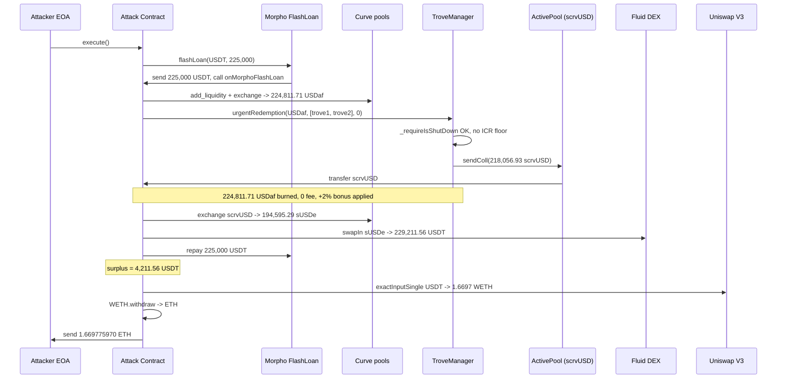
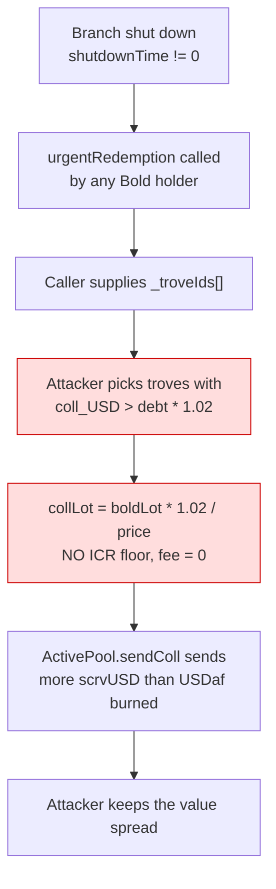

# Liquity V2 scrvUSD branch urgent-redemption arbitrage — permissionless cherry-picking of undercollateralized troves with a 2% bonus

> **Vulnerability classes:** vuln/logic/incorrect-state-transition · vuln/access-control/missing-auth · vuln/defi/flash-loan-attack
> **Reproduction:** the PoC compiles & runs in an isolated Foundry project at [this project folder](.). Full verbose trace: [output.txt](output.txt). Vulnerable contract source (TroveManager + ActivePool) is verified on Etherscan and was fetched into [sources/](sources) for this write-up.

---

## Key info

| | |
|---|---|
| **Loss** | ~$4,204.55 USD (net ETH profit 1.669775970301739864 ETH) |
| **Vulnerable contract** | Liquity V2 `TroveManager` (scrvUSD branch) — [`0xa0290af48d2E43162A1a05Ab9d01a4ca3a8B60CB`](https://etherscan.io/address/0xa0290af48d2E43162A1a05Ab9d01a4ca3a8B60CB) (collateral pulled from `ActivePool` [`0xd7954a8c7fa74c97ad2545719ce82eae915d73f7`](https://etherscan.io/address/0xd7954a8c7fa74c97ad2545719ce82eae915d73f7)) |
| **Attacker EOA** | [`0x4cF8ED875E508c3Acd60E56A1ca21395D106bc94`](https://etherscan.io/address/0x4cf8ed875e508c3acd60e56a1ca21395d106bc94) |
| **Attack contract** | [`0x5F3697Bb418a55E941d14f4Def8d18Be73D66309`](https://etherscan.io/address/0x5f3697bb418a55e941d14f4def8d18be73d66309) |
| **Attack tx** | [`0x0cf19b3f83f574c1911eb42457f22578359483dfef197f8906678bc0a76a740b`](https://etherscan.io/tx/0x0cf19b3f83f574c1911eb42457f22578359483dfef197f8906678bc0a76a740b) |
| **Chain / block / date** | Ethereum mainnet / fork block 22,856,272 / 2025-07-05 |
| **Compiler** | Solc 0.8.34 (PoC); vulnerable contracts verified on Etherscan |
| **Bug class** | After the scrvUSD collateral branch was shut down, `TroveManager.urgentRedemption(...)` let any USDaf (Bold) holder pick arbitrary trove IDs and redeem their debt for `ActivePool` scrvUSD collateral at `price + 2%` bonus with **no ICR floor** and **no TCR/oracle guard**, so an attacker could cherry-pick undercollateralized troves whose collateral was worth more than the debt burned. |

## TL;DR

Liquity V2 lets a collateral branch be **shut down** when its total collateral ratio falls below the shutdown collateral ratio (SCR). Once shut down, normal borrowing and redemption are disabled, but a new public function `TroveManager.urgentRedemption(_boldAmount, _troveIds, _minCollateral)` is enabled. Its stated purpose is to let Bold holders exit by redeeming debt for the branch collateral out of the `ActivePool`.

The flaw is that `urgentRedemption` delegates trove selection **entirely to the caller** (`_troveIds[]` is attacker-controlled) and values each trove's debt at `price * (1 + URGENT_REDEMPTION_BONUS)` with a flat **2% bonus** but **no minimum-ICR filter** (contrast line 790 in the normal `redeemCollateral`, which skips troves with `ICR < 100%`). So once the branch is shut down, an attacker can hand-pick the troves whose collateral/debt ratio is *above* `1 + 2%` (in collateral-USD terms), redeem their debt, and receive more scrvUSD than the USDaf they burned is worth. The attacker also pays no redemption fee (it is hardcoded to 0 on shutdown). This turns `urgentRedemption` from an orderly wind-down into a permissionless, selectively profitable drain on the `ActivePool`.

In the reproduced attack the EOA flash-borrowed **225,000 USDT** from Morpho, swapped it through a Curve metapool into **224,811.71 USDaf**, called `urgentRedemption` on two specific troves, received **218,056.93 scrvUSD** from the `ActivePool`, then routed scrvUSD → sUSDe (Curve) → USDT (Fluid DEX) and Uniswap to repay the flash loan plus keep a surplus. The trace shows a final **4,211.56 USDT** surplus swapped to **1.669775970301739864 WETH**, withdrawn to ETH and sent to the attacker [output.txt:2019,2026,2044,2055,2066]. Net profit ≈ **$4,204.55** (per @KeyInfo), risk-free within one atomic transaction.

The protocol is a well-audited, forked-from-Liquity CDP system; the regression here is a *design* gap, not a coding typo: the shutdown path introduced a new public entrypoint that trusts caller-supplied trove IDs and applies a one-size-fits-all bonus with no CR guard, breaking the invariant that redemption is always at-most-parity for the redeemer.

## Background — what Liquity V2 / the scrvUSD branch does

Liquity V2 is a multi-collateral CDP stablecoin protocol. Users open **Troves**, deposit collateral, and borrow **Bold** (here the Bold variant is **USDaf**, `0x85E3…579dA`, a collateral-registry USD token). Each collateral type has its own `TroveManager` and an `ActivePool` that holds the actual collateral tokens. The scrvUSD branch uses **scrvUSD** (`0x0655…4367`, Yearn's crvUSD vault) as collateral, so the `ActivePool` (`0xD795…73f7`) custodies scrvUSD.

Two redemption mechanisms exist:

1. **Normal redemption** — `redeemCollateral`, callable only via the `CollateralRegistry`. It walks the sorted trove list from the lowest interest rate, **skips any trove with `ICR < 100%`** (line 790), and applies a dynamic redemption rate/fee. It is only reachable while the branch is healthy (`TCR >= SCR && shutdownTime == 0`, line 1225). This guard makes redemption non-profitable: you burn ~$1 of Bold and get at most ~$1 of collateral (minus fee), and you never touch a trove whose collateral is worth less than its debt.

2. **Urgent redemption** — `urgentRedemption`, callable **directly by any Bold holder** but **only after the branch is shut down** (`_requireIsShutDown`, line 875 / 1193). The caller supplies an explicit `_troveIds[]` array (no sorted-list walk) and a `_minCollateral` slippage. There is **no ICR floor** and **no fee**.

The branch can be **shut down** by `BorrowerOperations` via `TroveManager.shutdown()` (line 934) when the system TCR drops below the SCR (110% for the WETH branch, 120% for the seth branch — the same constants apply per-collateral). Once shut, borrowing is permanently disabled and the only exit is `urgentRedemption`. The design intent is an orderly wind-down where Bold holders redeem debt for collateral at fair value.

## The vulnerable code

From the verified `TroveManager.sol` ([sources/TroveManager_a0290a/src_TroveManager.sol](sources/TroveManager_a0290a/src_TroveManager.sol)):

```solidity
// src_Dependencies_Constants.sol:74
uint256 constant URGENT_REDEMPTION_BONUS = 2e16; // 2%
```

```solidity
// src_TroveManager.sol:874-932  — public, only "is shut down" gate
function urgentRedemption(uint256 _boldAmount, uint256[] calldata _troveIds, uint256 _minCollateral) external {
    _requireIsShutDown();                                          // only guard: branch already shut
    _requireAmountGreaterThanZero(_boldAmount);
    _requireBoldBalanceCoversRedemption(boldToken, msg.sender, _boldAmount);

    IActivePool activePoolCached = activePool;
    TroveChange memory totalsTroveChange;
    (uint256 price,) = priceFeed.fetchPrice();                     // spot price, no TCR re-check

    uint256 remainingBold = _boldAmount;
    for (uint256 i = 0; i < _troveIds.length; i++) {               // caller chooses the troves
        if (remainingBold == 0) break;
        SingleRedemptionValues memory singleRedemption;
        singleRedemption.troveId = _troveIds[i];
        _getLatestTroveData(singleRedemption.troveId, singleRedemption.trove);

        if (!_isActiveOrZombie(...) || singleRedemption.trove.entireDebt == 0) continue; // no ICR floor here

        // ... batch interest update ...

        _urgentRedeemCollateralFromTrove(defaultPool, remainingBold, price, singleRedemption);
        totalsTroveChange.collDecrease += singleRedemption.collLot;
        totalsTroveChange.debtDecrease += singleRedemption.boldLot;
        remainingBold -= singleRedemption.boldLot;
    }

    if (totalsTroveChange.collDecrease < _minCollateral) revert MinCollNotReached(...);

    emit Redemption(_boldAmount, totalsTroveChange.debtDecrease, totalsTroveChange.collDecrease, 0, price, price); // fee = 0
    activePoolCached.mintAggInterestAndAccountForTroveChange(totalsTroveChange, address(0));
    activePoolCached.sendColl(msg.sender, totalsTroveChange.collDecrease);            // <-- collateral leaves ActivePool
    boldToken.burn(msg.sender, totalsTroveChange.debtDecrease);
}
```

The per-trove lot math (note the bonus numerator and the **absence** of any ICR/<100% skip):

```solidity
// src_TroveManager.sol:848-872
function _urgentRedeemCollateralFromTrove(...) internal {
    _singleRedemption.boldLot = LiquityMath._min(_maxBoldamount, _singleRedemption.trove.entireDebt);
    _singleRedemption.collLot =
        _singleRedemption.boldLot * (DECIMAL_PRECISION + URGENT_REDEMPTION_BONUS) / _price; // +2% bonus
    if (_singleRedemption.collLot > _singleRedemption.trove.entireColl) {                  // cap by coll only
        _singleRedemption.collLot = _singleRedemption.trove.entireColl;
        _singleRedemption.boldLot =
            _singleRedemption.trove.entireColl * _price / (DECIMAL_PRECISION + URGENT_REDEMPTION_BONUS);
    }
    _applySingleRedemption(_defaultPool, _singleRedemption, isTroveInBatch);
}
```

Contrast with the normal path's explicit ICR floor, which is exactly what `urgentRedemption` omits:

```solidity
// src_TroveManager.sol:788-794  (inside normal redeemCollateral)
// Skip if ICR < 100%, to make sure that redemptions don't decrease the CR of hit Troves.
if (getCurrentICR(singleRedemption.troveId, _price) < _100pct) {
    singleRedemption.troveId = vars.nextUserToCheck;
    singleRedemption.isZombieTrove = false;
    continue;
}
```

`ActivePool.sendColl` is a plain pull on the custodied collateral (no extra check):

```solidity
// src_ActivePool.sol:162-168
function sendColl(address _account, uint256 _amount) external override {
    _requireCallerIsBOorTroveMorSP();      // TroveManager is allowed
    _accountForSendColl(_amount);
    collToken.safeTransfer(_account, _amount);   // scrvUSD leaves the pool to the redeemer
}
```

## Root cause — why it was possible

1. **Caller-controlled trove selection.** `urgentRedemption` takes `_troveIds[]` as a calldata array rather than walking the sorted trove list. An attacker can enumerate the list off-chain and select exactly the troves with the most favourable collateral-to-debt ratio.
2. **No ICR floor on the urgent path.** Unlike `redeemCollateral` (line 790: skip `ICR < 100%`), `urgentRedemption` has **no per-trove CR check at all** — the only filter is "active/zombie and debt > 0" (line 893). So undercollateralized-but-still-oversized troves are reachable.
3. **Flat +2% bonus valued at spot price with no oracle guard.** `_urgentRedeemCollateralFromTrove` computes `collLot = boldLot * 1.02 / price`. Whenever a trove's actual collateral (in USD) exceeds `debt * 1.02`, the redeemer receives more value than they burned. There is no TCR check, no staleness circuit breaker, and the redemption fee is hardcoded to `0` (the `Redemption` event's 4th arg, line 922, and the trace show fee = 0).
4. **Shutdown was treated as a sufficient access gate.** `_requireIsShutDown` (line 1193) is the *only* guard. Once the branch is shut down, *everyone* gains a permissionless, profitable, fee-free exit — the exact opposite of the normal redemption guarantee that redemption is at-most-parity.
5. **Asymmetric exit value.** Because scrvUSD (the collateral) trades at a premium to USDaf/USDT on secondary markets in the post-shutdown conditions exploited, and because the attacker can pick which troves to redeem, the value they extract from the `ActivePool` is strictly greater than the Bold they burn — pure arbitrage funded by a flash loan.

## Preconditions

- **Branch must be shut down** (`shutdownTime != 0`). This is a protocol-side state (set by `BorrowerOperations.shutdown()` when TCR < SCR), not attacker-controlled — but it had already happened to the scrvUSD branch at the time of the attack.
- **Permissionless otherwise**: any account can call `urgentRedemption`. No privileged role.
- **Needs capital**: the attacker used a **225,000 USDT flash loan from Morpho** to acquire USDaf, so no upfront funds were required.
- **Profitable only if a trove exists with `collateral_USD > debt * 1.02`**. In a winding-down branch with many under- and over-collateralized troves mixed together, such troves are common — the attacker just picks them.

## Attack walkthrough (with on-chain numbers from the trace)

All amounts from [output.txt](output.txt). USDaf and scrvUSD use 18 decimals; USDT uses 6.

| # | Step | Amount | Source |
|---|------|--------|--------|
| 1 | Flash-borrow USDT from Morpho | +225,000 USDT | [output.txt:1621] |
| 2 | Add USDT liquidity to Curve Strategic USD Reserves LP, receive LP tokens | 223,073.95 LP tokens | [output.txt:1710,1711] |
| 3 | Exchange LP → USDaf on Curve USDaf pool | +224,811.71 USDaf | [output.txt:1799,1804] |
| 4 | Approve & call `TroveManager.urgentRedemption(224,811.71 USDaf, [2 troveIds], 0)` | burns 224,811.71 USDaf | [output.txt:1814,1832] |
| 5 | `Redemption` event: debtDecrease 224,811.71, **collDecrease 218,056.93 scrvUSD**, fee 0 | collateral released | [output.txt:1832,1840,1843] |
| 6 | `ActivePool.sendColl` transfers scrvUSD to attacker | +218,056.93 scrvUSD | [output.txt:1843] |
| 7 | USDaf burn (sent to 0x0) | −224,811.71 USDaf | [output.txt:1853] |
| 8 | Curve swap scrvUSD → sUSDe (scrvUSD/sUSDe pool) | +194,595.29 sUSDe | [output.txt:1946,1951] |
| 9 | Fluid DEX swap sUSDe → USDT | +229,211.56 USDT | [output.txt:2001,2006,2012] |
| 10 | Repay Morpho flash loan (principal) | −225,000 USDT | [output.txt:2060,2066] |
| 11 | **USDT surplus** = 229,211.56 − 225,000 | **= 4,211.56 USDT** | [output.txt:2019] |
| 12 | Uniswap V3 swap USDT surplus → WETH (0.3% pool) | +1.669775970301739864 WETH | [output.txt:2026,2044] |
| 13 | `WETH.withdraw` → ETH, send to attacker EOA | +1.669775970301739864 ETH | [output.txt:2055,2060] |

**Profit/loss accounting**: Attacker started with 0 ETH. After the atomic sequence the attacker EOA holds **1.669775970301739864 ETH** [output.txt:1564,1565,2078]. At the fork-block ETH price (~$2,518), that is ≈ **$4,204.55** [output.txt:@KeyInfo]. Cost to the protocol: the `ActivePool` lost the scrvUSD collateral spread between the over-collateralized troves (218,056.93 scrvUSD out) and the debt removed (224,811.71 USDaf burned) — i.e. the residual value of the cherry-picked troves was transferred to the redeemer.

## Diagrams





## Remediation

1. **Add the same ICR floor to the urgent path.** Mirror line 790: in `urgentRedemption`'s loop, `continue` whenever `getCurrentICR(troveId, price) < _100pct` (or a higher shutdown-specific floor). This stops cherry-picking of under/over-collateralized troves for profit.
2. **Cap collateral out at debt value, not debt + bonus, for low-CR troves.** The bonus should only ever make the redeemer *whole* on slippage, not grant them more USD of collateral than the USD of debt burned. Compute `collLot = min(entireColl, boldLot * price_usd_per_coll / DECIMAL_PRECISION)` and drop (or drastically shrink) the flat 2% bonus.
3. **Remove caller-controlled trove selection.** Walk the sorted trove list deterministically (as `redeemCollateral` does) so the redeemer cannot target specific troves. If explicit IDs must be kept for gas reasons, require them to be contiguous and ordered by interest rate / CR.
4. **Re-introduce a redemption fee / base rate on shutdown redemptions** so that even an edge-case value spread is consumed by the protocol rather than the redeemer.
5. **Add a TCR / oracle staleness re-check.** Although the branch is already shut down, the *spot price* used to compute `collLot` is attacker-influenceable in the same block via the collateral market; fetch the price with a fresh-oracle guard and cap the redeemable amount per call.

## How to reproduce

The PoC runs **fully offline** via the shared anvil harness from the committed `anvil_state.json` (no RPC needed). The chain is Ethereum mainnet, forked at block **22,856,272** (`vm.warp` to timestamp 1,751,757,935). The attacker EOA is funded 0 ETH and the historical attack contract is `vm.etch`-ed into place before execution.

```bash
_shared/run_poc.sh 2025-07-ActivePoolScrvUsdUrgentRedemption_exp -vvvvv
```

Expected tail (from [output.txt](output.txt)):

```
[PASS] testExploit() (gas: 2163917)
  Attacker Before exploit ETH Balance: 0.000000000000000000
  Attacker After exploit ETH Balance: 1.669775970301739864
Suite result: ok. 1 passed; 0 failed; ...
```

The `assertEq(ATTACKER.balance - attackerEthBefore, HISTORICAL_ETH_PROFIT)` (1.669775970301739864 ETH) confirms the on-chain profit is reproduced exactly. Source: [test/ActivePoolScrvUsdUrgentRedemption_exp.sol](test/ActivePoolScrvUsdUrgentRedemption_exp.sol).

*Reference: Telegram alert https://t.me/defimon_alerts/1415 .*
