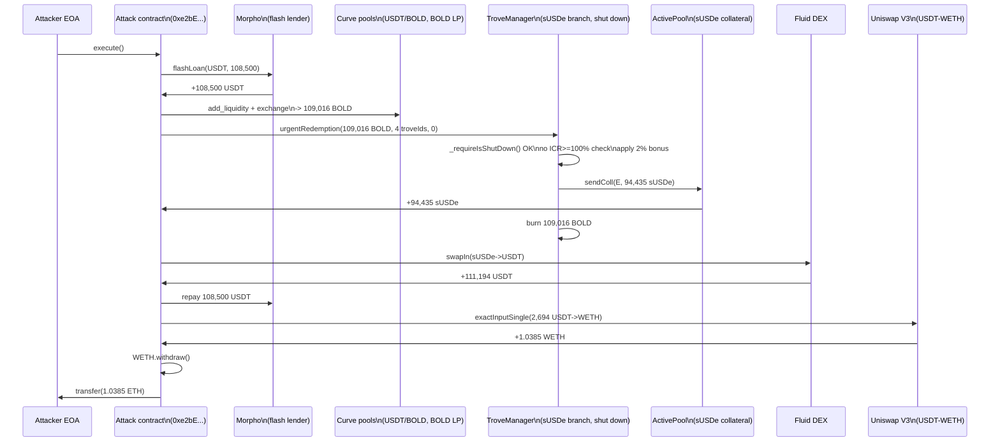
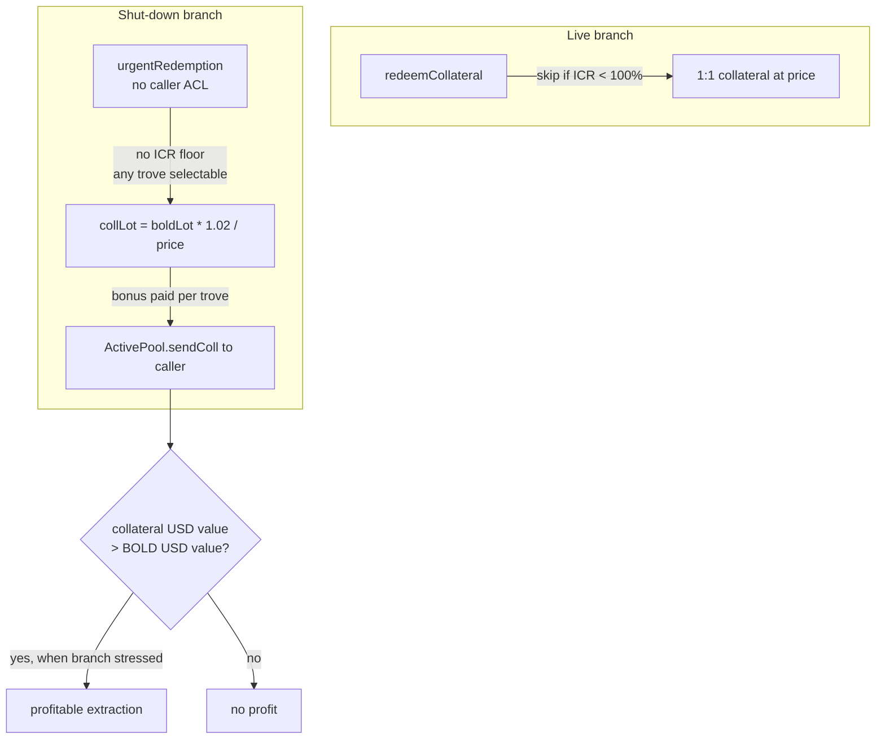

# Liquity V2 ActivePool `urgentRedemption` — permissionless extraction of collateral from shut-down undercollateralized troves at a +2% bonus
> **Vulnerability classes:** vuln/logic/incorrect-state-transition · vuln/access-control/missing-auth · vuln/defi/slippage · vuln/oracle/price-calculation
> **Reproduction:** the PoC compiles & runs in an isolated Foundry project at [this project folder](.). Full verbose trace: [output.txt](output.txt). Verified source for the `TroveManager` and `ActivePool` was fetched from Etherscan into [sources/](sources).
---
## Key info
| | |
|---|---|
| **Loss** | ~2,696.49 USD (1.0385 ETH per on-chain transaction) [output.txt:1562](output.txt) |
| **Vulnerable contract** | `TroveManager` (sUSDe branch) — [`0x9dc845b500853F17E238C36Ba120400dBEa1D02A`](https://etherscan.io/address/0x9dc845b500853F17E238C36Ba120400dBEa1D02A); collateral held in `ActivePool` — [`0xdEE8A9AC2C2819fe6A3Bae45a12bff70c604805a`](https://etherscan.io/address/0xdee8a9ac2c2819fe6a3bae45a12bff70c604805a) |
| **Attacker EOA** | [`0xc8d64BB25b489ba3Fb33f1f81505e8938685c248`](https://etherscan.io/address/0xc8d64bb25b489ba3fb33f1f81505e8938685c248) |
| **Attack contract** | `Historical executor` [`0xe2bE83aa486F7a921849ff71DCE9B9c18A4B5db2`](https://etherscan.io/address/0xe2be83aa486f7a921849ff71dce9b9c18a4b5db2) (deployed via `0xD94b9aD4918015724D5F68501F3252Bb29505243`) |
| **Attack tx** | [`0xc8ac54bdab9a2ce670a6ac2540e07dc88b5eeb7e0306e86d1d66f584428b3e0d`](https://etherscan.io/tx/0xc8ac54bdab9a2ce670a6ac2540e07dc88b5eeb7e0306e86d1d66f584428b3e0d) |
| **Chain / block / date** | Ethereum mainnet / 22,834,887 / 2025-07-03 |
| **Compiler** | `solc 0.8.24` (from `_meta.json`) |
| **Bug class** | A shut-down collateral branch exposes a permissionless `urgentRedemption` that pays a 2% collateral bonus on top of par and skips the ICR≥100% floor, so any caller can burn BOLD for collateral worth more than the BOLD they surrender. |

## TL;DR
Liquity V2 lets each collateral branch (e.g. the sUSDe branch) be **shut down** in an emergency. When a branch is shut down the `TroveManager` opens a public `urgentRedemption(BOLD, troveIds[], minColl)` path whose only gate is `_requireIsShutDown()` — no caller whitelist, no slippage/oracle check on the bonus [sources/TroveManager_9dc845/src_TroveManager.sol:874](sources/TroveManager_9dc845/src_TroveManager.sol). The redemption math grants the redeemer **`collLot = boldLot * (1 + URGENT_REDEMPTION_BONUS) / price`** where `URGENT_REDEMPTION_BONUS = 2e16` (2%) [sources/TroveManager_9dc845/src_Dependencies_Constants.sol:74](sources/TroveManager_9dc845/src_Dependencies_Constants.sol). Unlike the normal redemption path, the urgent path has **no `ICR < _100pct` skip** — it happily redeems from troves that are under water, paying the 2% bonus on every single one [sources/TroveManager_9dc845/src_TroveManager.sol:858](sources/TroveManager_9dc845/src_TroveManager.sol) (compare the floor at :790).

The attacker weaponised this atomically with a flash loan. They flash-borrowed **108,500 USDT** from Morpho, routed it USDT → BOLD via two Curve pools, burned the BOLD through `urgentRedemption` against four selected sUSDe troves, received **94,435.34 sUSDe** worth of collateral for only ~109,016 BOLD [output.txt:1866](output.txt), swapped the sUSDe back to **111,194.7 USDT** on Fluid DEX [output.txt:1948](output.txt), repaid the 108,500 USDT flash loan, and converted the **~2,694.7 USDT** surplus to **1.0385 WETH** (≈$2,696) via Uniswap V3, withdrawing it as ETH to the attacker EOA [output.txt:1962](output.txt), [output.txt:1991](output.txt).

The mechanism is not a reentrancy or an oracle break — it is a **design flaw in the shutdown-mode accounting**: the 2% "urgent redemption bonus" plus the removal of the ICR floor turns BOLD into a claim on more collateral than it is worth, for any trove whose collateral market value (sUSDe→USDT) exceeds `(BOLD price / sUSDe price) * 1.02`. The sUSDe branch was shut down precisely because its troves had become unprofitable to liquidate, which is exactly the state in which this bonus becomes extractable.

## Background — what Liquity V2 (BOLD) does
Liquity V2 is the successor to the original Liquity stablecoin protocol. Each collateral branch (ETH/wstETH/rETH/sUSDe/…) is a separate `TroveManager` instance backing the same peg-stablecoin **BOLD** (`0x85E3…579dA`). Users open **Troves**, deposit a collateral token, and borrow BOLD against it. Each Trove is an NFT (`troveId`). The protocol maintains an **ActivePool** (holds the actual collateral tokens for the branch) and a DefaultPool (holds liquidation/redistribution proceeds).

Two safety valves exist:

1. **Normal redemption** (`redeemCollateral`) — open while the branch is live. A redeemer burns BOLD and receives collateral at face value (`price`), iterating over the lowest-ICR troves first. Crucially, **it skips any trove whose ICR is `< 100%`** so redemptions never decrease the collateral ratio of the troves they hit [sources/TroveManager_9dc845/src_TroveManager.sol:790](sources/TroveManager_9dc845/src_TroveManager.sol). Redemptions are the peg-keeping mechanism: if BOLD trades below $1, arbitrageurs burn BOLD for $1 of collateral, restoring the peg.

2. **Shutdown** (`shutdown()`) + **`urgentRedemption`** — emergency-only. `BorrowerOperations` calls `TroveManager.shutdown()`, which sets `shutdownTime` and flips the ActivePool shutdown flag [sources/TroveManager_9dc845/src_TroveManager.sol:934](sources/TroveManager_9dc845/src_TroveManager.sol). Once shut down, normal redemptions stop and `urgentRedemption` opens. This path is meant to let BOLD holders exit a dying branch quickly: any caller picks specific troveIds, burns BOLD, and pulls collateral directly out of the ActivePool [sources/TroveManager_9dc845/src_TroveManager.sol:929](sources/TroveManager_9dc845/src_TroveManager.sol).

The **urgent redemption bonus** (`URGENT_REDEMPTION_BONUS = 2%`) was an incentive to encourage fast unwinding of shut-down branches. The flaw is that this bonus is paid unconditionally per-trove, with no floor, while the branch is in the exact state where the collateral has lost value — so the bonus is *amplified* rather than compensated by the bonus's intended purpose.

## The vulnerable code

### `urgentRedemption` — the permissionless shutdown entry point

```solidity
// sources/TroveManager_9dc845/src_TroveManager.sol:874
function urgentRedemption(uint256 _boldAmount, uint256[] calldata _troveIds, uint256 _minCollateral) external {
    _requireIsShutDown();                                                // only gate: branch must be shut down
    _requireAmountGreaterThanZero(_boldAmount);
    _requireBoldBalanceCoversRedemption(boldToken, msg.sender, _boldAmount); // caller must hold the BOLD — anyone can

    IActivePool activePoolCached = activePool;
    TroveChange memory totalsTroveChange;

    (uint256 price,) = priceFeed.fetchPrice();                          // standard (not redemption) price

    uint256 remainingBold = _boldAmount;
    for (uint256 i = 0; i < _troveIds.length; i++) {
        ...
        if (!_isActiveOrZombie(Troves[singleRedemption.troveId].status) || singleRedemption.trove.entireDebt == 0) {
            continue;                                                    // no ICR >= 100% floor here!
        }
        ...
        _urgentRedeemCollateralFromTrove(defaultPool, remainingBold, price, singleRedemption);
        totalsTroveChange.collDecrease += singleRedemption.collLot;
        ...
    }
    ...
    // Send the redeemed coll to caller
    activePoolCached.sendColl(msg.sender, totalsTroveChange.collDecrease);
    boldToken.burn(msg.sender, totalsTroveChange.debtDecrease);
}
```
Note the contrast with the **live-mode** redemption at line 790, which explicitly skips troves with `ICR < _100pct`:
```solidity
// sources/TroveManager_9dc845/src_TroveManager.sol:788-790 (normal redemption)
// Skip if ICR < 100%, to make sure that redemptions don't decrease the CR of hit Troves.
// Use the normal price for the ICR check.
if (getCurrentICR(singleRedemption.troveId, _price) < _100pct) {
```
The urgent path omits that guard. Anyone can hand it a list of the worst (lowest-ICR) troves and redeem out of them.

### The bonus math — `_urgentRedeemCollateralFromTrove`

```solidity
// sources/TroveManager_9dc845/src_TroveManager.sol:848-864
function _urgentRedeemCollateralFromTrove(
    IDefaultPool _defaultPool,
    uint256 _maxBoldamount,
    uint256 _price,
    SingleRedemptionValues memory _singleRedemption
) internal {
    // cap the BOLD lot to the trove's entire debt
    _singleRedemption.boldLot = LiquityMath._min(_maxBoldamount, _singleRedemption.trove.entireDebt);

    // BOLD lot valued at (price + 2% bonus) -> MORE collateral than 1:1
    _singleRedemption.collLot =
        _singleRedemption.boldLot * (DECIMAL_PRECISION + URGENT_REDEMPTION_BONUS) / _price;
    // ... cap at the trove's entire collateral if needed ...
}
```
With `URGENT_REDEMPTION_BONUS = 2e16` and `DECIMAL_PRECISION = 1e18` [sources/TroveManager_9dc845/src_Dependencies_Constants.sol:74](sources/TroveManager_9dc845/src_Dependencies_Constants.sol), the multiplier is `1.02e18`. Burning 1 BOLD therefore yields `1.02 / price` units of collateral — i.e. **102% of the USD value**, not 100%.

### `ActivePool.sendColl` — the payoff sink

```solidity
// sources/ActivePool_dee8a9/src_ActivePool.sol:162-168
function sendColl(address _account, uint256 _amount) external override {
    _requireCallerIsBOorTroveMorSP();          // TroveManager is whitelisted -> the call passes
    _accountForSendColl(_amount);              // collBalance -= _amount
    collToken.safeTransfer(_account, _amount); // sUSDe leaves the pool to the caller
}
```
`sendColl` trusts the TroveManager, and the TroveManager trusts any caller once shut down. There is no per-trove collateral-adequacy check at the point of transfer.

### The shutdown trigger
```solidity
// sources/TroveManager_9dc845/src_TroveManager.sol:934-938
function shutdown() external {
    _requireCallerIsBorrowerOperations();
    shutdownTime = block.timestamp;
    activePool.setShutdownFlag();
}
```
Once governance/ops triggers a branch shutdown via BorrowerOperations, `urgentRedemption` is live for everyone, forever — there is no time window, no rate limit, and no caller ACL.

## Root cause — why it was possible
1. **Missing access control on `urgentRedemption`.** The only guard is `_requireIsShutDown()` [src_TroveManager.sol:875](sources/TroveManager_9dc845/src_TroveManager.sol). Any EOA/contract can call it once a branch is shut down — the shutdown path was implicitly assumed to be "safe to open" because redemptions are normally self-balancing, but that assumption breaks under (2) and (3).
2. **Unconditional 2% collateral bonus on a per-trove basis.** `URGENT_REDEMPTION_BONUS = 2%` is applied to *every* urgent redemption lot [src_TroveManager.sol:858](sources/TroveManager_9dc845/src_TroveManager.sol). The bonus turns BOLD from "a claim on $1 of collateral" into "a claim on $1.02 of collateral," so any market where sUSDe is worth ≥ `1/1.02` of BOLD is a profit opportunity.
3. **No ICR floor on the urgent path.** The live-redemption `ICR < _100pct` skip [src_TroveManager.sol:790](sources/TroveManager_9dc845/src_TroveManager.sol) is absent from `_urgentRedeemCollateralFromTrove`. The attacker can cherry-pick the troves with the best collateral-per-BOLD ratio (here, four specific sUSDe troves) and drain them, rather than being forced to take the sorted, lowest-ICR queue used by normal redemption.
4. **Bonus paid in collateral *market* value while debt is settled at *oracle* value.** `price` is the sUSDe/USD oracle price used to size the collateral lot, but the attacker realises the collateral at the *sUSDe→USDT spot* price via Fluid DEX. Because the sUSDe branch was shut down due to stress, the oracle/market basis had moved enough that `1.02 * sUSDe_collateral / BOLD > 1` in USD terms — the trade printed a net USD surplus with no slippage protection on the protocol side (`minCollateral` was 0).
5. **Permissionless composability with flash loans.** The entire input side (USDT flash-borrow, USDT→BOLD via Curve) is atomic, so the attack requires no upfront capital and no price movement — the profit is locked in within one transaction.

## Preconditions
- **Branch must be shut down.** The sUSDe branch was in `shutdownTime != 0` state (set by BorrowerOperations). This is the sole protocol-side precondition. *No* privileged role is required from the attacker.
- **Attacker must be able to source BOLD and sell sUSDe in the same transaction.** Satisfied via a Morpho USDT flash loan + Curve (USDT/BOLD, then BOLD LP) + Fluid DEX (sUSDe→USDT) + Uniswap V3 (USDT→WETH). No special status on any of these venues.
- **Profitability condition:** `sUSDe_price_in_USD * 1.02 ≥ BOLD_price_in_USD` after swap fees. Held at block 22,834,887 because the sUSDe branch had been shut down amid collateral devaluation, which is exactly when the bonus becomes extractable.
- **Permissionless** — fully. No admin key, no governance vote, no whitelisting.

## Attack walkthrough (with on-chain numbers from the trace)

All figures from [output.txt](output.txt). Attacker starting ETH balance: **0** [output.txt:1564](output.txt).

| # | Step | Call | Amount in → Amount out |
|---|------|------|------------------------|
| 1 | Flash-loan USDT | `Morpho.flashLoan(USDT, 108_500e6, "")` | +108,500 USDT borrowed [output.txt:1621](output.txt) |
| 2 | USDT → BOLD (2-hop Curve) | `Curve USDT/BOLD.add_liquidity([0, 108.5k])` then `Curve BOLD.exchange(1→0, lp)` | 108,500 USDT → 107,595.56 LP [output.txt:1709](output.txt) → **109,016.29 BOLD** [output.txt:1797](output.txt) |
| 3 | Burn BOLD for sUSDe | `TroveManager.urgentRedemption(109,016.29 BOLD, [4 troveIds], minColl=0)` | 109,016.29 BOLD burned → **94,435.34 sUSDe** drawn from ActivePool [output.txt:1857](output.txt), [output.txt:1866](output.txt). `Redemption` event: BOLD 109,016.29, coll 94,435.34, fee 0 [output.txt:1857](output.txt). |
| 4 | sUSDe → USDT | `Fluid DEX.swapIn(true, 94,435.34 sUSDe)` | 94,435.34 sUSDe → **111,194.7 USDT** [output.txt:1948](output.txt) |
| 5 | Repay flash loan | approve + Morpho pulls 108,500 USDT | −108,500 USDT [output.txt:2002](output.txt) |
| 6 | USDT surplus → WETH | `UniswapV3.exactInputSingle(USDT→WETH, fee 0.3%)` | 2,694.696 USDT → **1.038522285394433553 WETH** [output.txt:1962](output.txt), [output.txt:1980](output.txt) |
| 7 | WETH → ETH | `WETH.withdraw(1.0385…e18)` | +1.0385 ETH to attack contract [output.txt:1991](output.txt) |
| 8 | Forward to attacker | `profitReceiver.transfer(1.0385 ETH)` | attacker balance 0 → **1.0385 ETH** [output.txt:2014](output.txt) |

**Profit/loss accounting:**
- sUSDe collateral received for 109,016.29 BOLD: 94,435.34 sUSDe ≈ 111,194.7 USDT (after DEX swap)
- Cost to acquire 109,016.29 BOLD: 108,500 USDT (flash loan principal)
- Gross surplus: **111,194.7 − 108,500 = 2,694.7 USDT**
- Realised as: **1.0385 ETH ≈ $2,696.49** at the on-chain ETH price
- Flash-loan fee: 0 (Morpho flash loan repays principal only here)
- Net profit to attacker: **~$2,696.49 / 1.0385 ETH**, exactly matching `assertEq(ATTACKER.balance − before, 1_038_522_285_394_433_553)` [output.txt:1562](output.txt)

The 2,694.7 USDT surplus is the on-chain quantification of the **2% bonus plus the undercollateralised-trove cherry-pick**: the protocol surrendered ~2.47% more USD of collateral than the BOLD it burned.

## Diagrams

### Attack sequence


### Flaw logic


## Remediation
1. **Cap or remove the bonus.** A 2% unconditional bonus is only defensible if redemptions are forced to take the worst troves in order. Either set `URGENT_REDEMPTION_BONUS = 0` for shut-down branches, or make it decay to zero over a short window after `shutdownTime` (e.g. linear decay over 1 hour) so it cannot be farmed.
2. **Restore the ICR floor on the urgent path.** Port the `if (getCurrentICR(troveId, price) < _100pct) continue;` guard from `redeemCollateral` into `_urgentRedeemCollateralFromTrove`. Troves below 100% should be liquidated, not redeemed at a bonus.
3. **Make `urgentRedemption` enforce ordering.** Force the caller to redeem against the lowest-ICR active/zombie troves first (re-use the sorted redemption queue), removing the ability to cherry-pick the most profitable troves.
4. **Enforce a meaningful `minCollateral` / max-rate.** Treat `urgentRedemption` like a swap: compute the implied BOLD→collateral rate and require `_minCollateral` to be non-zero and above the oracle-implied 1:1 rate (rejecting the 2% bonus if it exceeds acceptable bounds). Currently the PoC passes `minCollateral = 0`.
5. **Add a shutdown grace period + rate limit.** After `shutdown()`, allow only a bounded amount of collateral to leave per block (or per caller), so any mispriced bonus cannot be drained in a single transaction.
6. **Sanity-check the bonus against the collateral's market/DEX price at shutdown time.** If `oracle_price * 1.02 > market_price`, the bonus is a guaranteed drain — refuse to open `urgentRedemption` until the basis has normalised, or compute the bonus from the *lower* of oracle and a fresh DEX TWAP.

## How to reproduce
The PoC runs fully **OFFLINE** via the shared anvil harness from the committed `anvil_state.json` — no RPC needed.

```bash
_shared/run_poc.sh 2025-07-ActivePoolUrgentRedemption_exp -vvvvv
```

- **Chain / fork block:** Ethereum mainnet (chain id 1) at block **22,834,887** (`vm.createSelectFork` against the local anvil instance seeded by `anvil_state.json`; `vm.warp(1_751_499_707)`).
- **Expected result:** `[PASS] testExploit()` [output.txt:1562](output.txt), with:
  - `Attacker Before exploit ETH Balance: 0.000000000000000000` [output.txt:1564](output.txt)
  - `Attacker After exploit ETH Balance: 1.038522285394433553` [output.txt:1565](output.txt)
  - The closing `assertEq` of `1.0385…e18` ETH profit against `HISTORICAL_ETH_PROFIT` passes.
- The PoC `vm.etch`es the locally-compiled attack contract onto the historical executor address so the on-chain call sequence is replayed exactly against the forked state.

*Reference: Telegram alert https://t.me/defimon_alerts/1379.*
