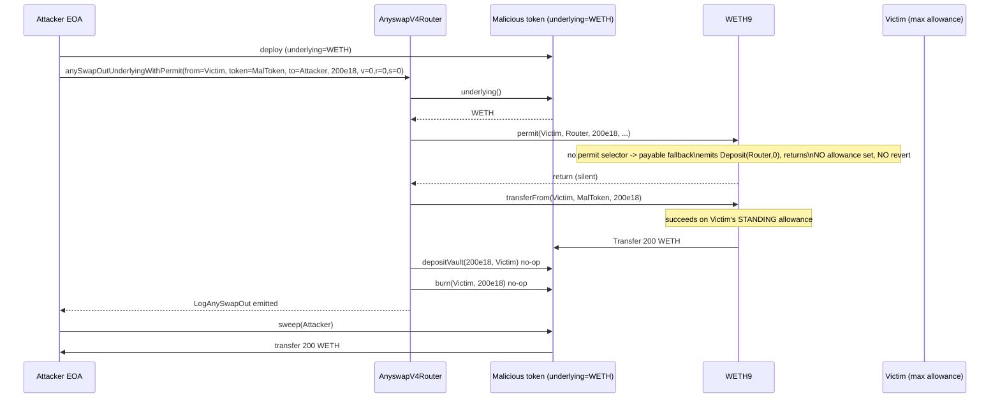

# AnyswapV4Router permit-fallback drain — trusting a non-reverting `permit()` on a token that does not enforce it

> **Vulnerability classes:** vuln/dependency/unchecked-return-value · vuln/logic/missing-validation · vuln/access-control/missing-auth
> **Reproduction:** the PoC compiles & runs in an isolated Foundry project at [this project folder](.). Full verbose trace: [output.txt](output.txt). Vulnerable router source is verified on Etherscan and fetched into `sources/AnyswapV4Router_6b7a87/`.
---
## Key info
| | |
|---|---|
| **Loss** | 200 WETH (amount modelled in the PoC; the on-chain attack tx drained a victim who had a standing max allowance to the router) |
| **Vulnerable contract** | AnyswapV4Router — [`0x6b7a87899490EcE95443e979cA9485CBE7E71522`](https://etherscan.io/address/0x6b7a87899490EcE95443e979cA9485CBE7E71522) |
| **Attacker EOA** | [`0xC0ffeEBABE5D496B2DDE509f9fa189C25cF29671`](https://etherscan.io/address/0xC0ffeEBABE5D496B2DDE509f9fa189C25cF29671) |
| **Attack contract** | [`0xE08D97e151473A848C3d9CA3f323Cb720472D015`](https://etherscan.io/address/0xE08D97e151473A848C3d9CA3f323Cb720472D015) |
| **Attack tx** | [`0xae79fdcfd7c36ed654d11b352b495340bd3cc47d0849c35ac6ffa1e4859098ec`](https://etherscan.io/tx/0xae79fdcfd7c36ed654d11b352b495340bd3cc47d0849c35ac6ffa1e4859098ec) |
| **Chain / block / date** | Ethereum mainnet / fork block 23,026,899 / 2025-07-29 |
| **Compiler** | v0.8.1+commit.df193b15, optimizer on, 200 runs (`sources/AnyswapV4Router_6b7a87/_meta.json`) |
| **Bug class** | The router calls `IERC20(_underlying).permit(...)` and treats the absence of a revert as proof that an allowance was set — but it neither checks the return value nor validates the underlying token, so any token whose fallback silently swallows the `permit` selector (WETH9 is the canonical case) lets the router proceed to `transferFrom` against an allowance the victim never signed. |
## TL;DR
AnyswapV4Router is a cross-chain bridge router. Its `anySwapOutUnderlyingWithPermit` entry point is meant to take an EIP-2612 `permit` signature from a user, apply it on the underlying token of an AnySwap-wrapped token, then pull that underlying from the signer and burn/mint the wrapped side across chains. The signature path is a convenience: instead of requiring the user to pre-approve and then call `anySwapOutUnderlying`, the router applies the permit itself.

The flaw is that the router derives `_underlying` from the `token` argument via `AnyswapV1ERC20(token).underlying()`, then unconditionally calls `IERC20(_underlying).permit(...)` and `transferFrom(_underlying, from, token, ...)`. There is no whitelist on `token`, no check that `_underlying` actually implements EIP-2612, and no check on the return value of `permit`. The contract author assumed "did not revert ⇒ allowance now exists." WETH9 has no `permit` function — its payable `fallback`/`receive` absorbs the call, emits a zero-value `Deposit`, and returns normally. So a `permit` call against WETH "succeeds" while setting no allowance at all.

An attacker deploys their own AnySwap-compatible token whose `underlying()` returns the WETH address and whose other hooks (`depositVault`, `burn`) are no-ops that just return success. They then call `anySwapOutUnderlyingWithPermit(from = victim, token = malicious, ...)` with dummy `v/r/s`. The `permit` call lands on WETH's fallback and is swallowed; the router then runs `transferFrom(WETH, victim, maliciousToken, 200)` which succeeds solely because the victim holds a standing `type(uint256).max` router allowance (a real on-chain precondition from prior router use). The 200 WETH lands in the attacker's token contract, which `sweep()`s it to the attacker. In the PoC the attacker's WETH balance moves from `0.003441132044998091` to `200.003441132044998091` [output.txt:1564-1565] — a clean 200 WETH gain.

## Background — what AnyswapV4Router does
Anyswap (now Multichain) is a cross-chain bridge. The on-chain piece is a router plus a family of ERC-20 "wrapped" tokens (`AnyswapV1ERC20`). A wrapped token on chain A is backed 1:1 by an `underlying` token held inside the wrapper contract; bridging to chain B is represented as a burn on A and a mint on B, signed off by the bridge's MPC oracle (`mpc()`, see `AnyswapV4Router.sol:219`).

Two router entry points matter here:

- `anySwapOutUnderlying(token, to, amount, toChainID)` — pulls `amount` of the wrapper's `underlying()` from `msg.sender` into the wrapper via `transferFrom`, calls `depositVault` to credit the wrapper, then burns the wrapped units from `msg.sender` (`AnyswapV4Router.sol:255-259`). This requires `msg.sender` to have pre-approved the router on the underlying.

- `anySwapOutUnderlyingWithPermit(from, token, to, amount, deadline, v, r, s, toChainID)` — same as above, but instead of relying on a pre-existing approval it takes an EIP-2612 `permit` signature from a third party (`from`) and applies it inline, so the *signer* is debited even though the *caller* is `msg.sender`. This is the audited function.

The intended happy path is: user signs a permit authorising the router to spend their underlying; the router submits that permit to the underlying token, then `transferFrom`s the underlying from the signer into the wrapper, then burns wrapped units on the signer's behalf. The signer's funds move to chain B; the caller just relays the signature.

## The vulnerable code
Quoted from the verified source at `sources/AnyswapV4Router_6b7a87/AnyswapV4Router.sol:261-277`:

### `anySwapOutUnderlyingWithPermit` — the entry point
```solidity
function anySwapOutUnderlyingWithPermit(
    address from,
    address token,
    address to,
    uint amount,
    uint deadline,
    uint8 v,
    bytes32 r,
    bytes32 s,
    uint toChainID
) external {
    address _underlying = AnyswapV1ERC20(token).underlying();
    IERC20(_underlying).permit(from, address(this), amount, deadline, v, r, s);
    TransferHelper.safeTransferFrom(_underlying, from, token, amount);
    AnyswapV1ERC20(token).depositVault(amount, from);
    _anySwapOut(from, token, to, amount, toChainID);
}
```

Three compounding defects in these seven lines:

1. **`token` is fully attacker-controlled.** It is passed straight into `AnyswapV1ERC20(token).underlying()` and `.depositVault(...)`. There is no whitelist mapping `token` to a known AnySwap deployment, so a freshly-deployed contract that merely *implements the interface* (the four methods `underlying`, `depositVault`, `burn`, and being ERC-20-ish) is accepted as a valid `token`.

2. **The `permit` call's outcome is never checked.** The ABI declares `permit(...)` as `external` returning nothing (`AnyswapV4Router.sol:172`), so a return-value check is structurally impossible — but more importantly the router does not even require that `_underlying` *has* a `permit` function. Any token whose fallback absorbs unknown selectors will swallow the call.

3. **`from` is decoupled from `msg.sender`.** The signer `from` is an arbitrary argument. After the (un-enforced) permit, the router pulls `_underlying` from `from`, not from the caller. So whoever can pass a non-reverting `permit` can spend any `from` whose allowance to the router already exists.

### WETH9's silence — why `permit` "succeeds"
WETH9 has `deposit()`, `withdraw`, `transfer`, `approve`, `transferFrom`, and a `payable fallback` that calls `deposit()` on the msg.value. It has no `permit` selector. When the router calls `IERC20(WETH).permit(victim, router, 200e18, deadline, 0, 0, 0)`, the EVM does not find a matching selector and falls through to the payable fallback. Because the call carries no ETH, the fallback emits `Deposit(dst = router, wad = 0)` and returns. The trace shows this verbatim [output.txt:1617-1619]:

```
WETH::fallback(Victim, AnyswapV4Router, 200000000000000000000, 1753817544, 0, 0x0, 0x0)
  ├─ emit Deposit(dst: AnyswapV4Router, wad: 0)
  └─ ← [Stop]
```

No revert, no allowance set. The router treats "did not revert" as "permit granted" and proceeds.

### The attacker's stand-in token (from the PoC)
```solidity
contract MaliciousAnyswapToken {
    function underlying() external view returns (address) { return address(weth); }
    function depositVault(uint256 amount, address) external pure returns (uint256) { return amount; }
    function burn(address, uint256) external pure returns (bool) { return true; }
    function sweep(address to) external {
        require(msg.sender == owner, "only owner");
        weth.transfer(to, weth.balanceOf(address(this)));
    }
}
```
`depositVault` and `burn` are no-ops that return success — they satisfy the router's calls without doing any accounting. `sweep` lets the attacker pull the WETH the router just deposited into this contract.

## Root cause — why it was possible
1. **Blind trust in a non-reverting `permit`.** The router models permit success as "the call returned" rather than "the underlying token is EIP-2612 and the signature is valid." No `try/catch`, no return-value check, no feature check on `_underlying`.
2. **No whitelist on the `token` argument.** `token` is taken as-is and used to resolve `_underlying` and to receive the `transferFrom`. A malicious token that returns a victim-held underlying (here WETH) and whose hooks are stubbed is treated identically to a genuine AnySwap wrapped token.
3. **Caller/signer decoupling without an authorisation link.** `from` is a free parameter; the only thing tying the call to `from`'s consent is the `permit` signature — which, per point 1, is not actually enforced. Once permit is a no-op, `from` is just "whose funds to move."
4. **Compounding precondition — victim's standing allowance.** The victim held `type(uint256).max` approval to the router (a normal state for any user who had previously routed through Anyswap). The `transferFrom` at line 274 draws on that *existing* allowance, not on the permit. The trace confirms the allowance is max before the call (`assertEq(weth.allowance(VICTIM, VULNERABLE_CONTRACT), type(uint256).max)` in the PoC), and the `transferFrom` succeeds with no new approval granted [output.txt:1620-1621].

## Preconditions
- **Permissionless to trigger.** Anyone can call `anySwapOutUnderlyingWithPermit`; no privileged role, no MPC signature, no on-chain registration of the malicious token.
- **Requires a victim with a standing token allowance to the router.** This is the real-world precondition that made the on-chain attack profitable: any address that had previously approved AnyswapV4Router for the underlying (WETH here) was a target. The PoC models the victim's funding (`vm.deal` + `weth.deposit`) and asserts the max allowance already exists.
- **No flash loan needed.** The attacker does not borrow anything; they only route someone else's pre-approved balance.
- **Attacker deploys one contract** (the stand-in AnySwap token) — negligible gas cost.

## Attack walkthrough (with on-chain numbers from the trace)
All amounts from `output.txt`. The PoC models the same-block victim funding and the pre-existing router allowance, then runs the verified router byte-for-byte.

| Step | Action | Effect | Number |
|------|--------|--------|--------|
| 0 | Setup | Fund victim with 200 WETH; assert victim→router allowance is `type(uint256).max` | 200 WETH at victim |
| 1 | Deploy | Attacker deploys `MaliciousAnyswapToken` with `underlying() = WETH` | new token `0x5615…b72f` [output.txt:1581] |
| 2 | Call router | `router.anySwapOutUnderlyingWithPermit(from=Victim, token=malicious, to=Attacker, amount=200e18, …, v=0,r=0,s=0, toChainID=1)` from the Attacker | [output.txt:1614] |
| 2a | `underlying()` | Router asks malicious token for its underlying → WETH | [output.txt:1615-1616] |
| 2b | `permit()` | Router calls `WETH.permit(Victim, Router, 200e18, …)`. WETH has no `permit`; falls into payable fallback, emits `Deposit(Router, 0)`, returns. **No allowance set, no revert.** | [output.txt:1617-1619] |
| 2c | `transferFrom` | Router calls `WETH.transferFrom(Victim, maliciousToken, 200e18)`. Succeeds on the victim's *standing* allowance, not on the (non-existent) permit. Emits `Transfer(Victim → maliciousToken, 200e18)`. | [output.txt:1620-1621] |
| 2d | `depositVault` | Malicious token's stub returns `amount` — no-op. | [output.txt:1626] |
| 2e | `burn` | Malicious token's stub returns `true` — no-op. | [output.txt:1628] |
| 2f | `LogAnySwapOut` | Router emits its bridge event as if a real cross-chain swap happened. | [output.txt:1630] |
| 3 | `sweep` | Attacker calls `maliciousToken.sweep(Attacker)`; the 200 WETH sitting in the token is sent to the attacker. Emits `Transfer(maliciousToken → Attacker, 200e18)`. | [output.txt:1632-1636] |

**Balance accounting (from `output.txt`):**
- Attacker WETH before: `0.003441132044998091` [output.txt:1564]
- Attacker WETH after:  `200.003441132044998091` [output.txt:1565]
- Victim WETH after: `0` (the PoC's `assertEq` at the end of `testExploit`) [output.txt:tail asserts]
- Net attacker profit: **200 WETH**.

The malicious token holds 0 WETH at the end (swept clean).

## Diagrams
### Attack sequence


### The flaw in one picture
```mermaid
flowchart TD
    A[Router calls IERC20 underlying.permit(...)] --> B{Does underlying have a permit selector?}
    B -- YES, real EIP-2612 --> C[Allowance set for router]
    C --> D[transferFrom from signer: legitimate]
    B -- NO, e.g. WETH9 --> E[Falls into payable fallback]
    E --> F[Deposit(0) emitted, call returns normally]
    F --> G[Router assumes permit succeeded]
    G --> H[transferFrom from victim on PRE-EXISTING allowance]
    H --> I[Victim funds drained]
    style E fill:#fdd
    style F fill:#fdd
    style I fill:#fdd
```

## Remediation
1. **Do not trust a non-reverting `permit`.** Wrap the permit call in `try IERC20Permit(_underlying).permit(...) {...} catch {... revert; }`, *and* verify that `_underlying` actually implements EIP-2612 (e.g. via `ERC165.supportsInterface(0xae1a26e4)` or by checking against a known list of compliant tokens).
2. **Whitelist `token`.** Maintain an on-chain registry of legitimate AnySwap wrapped tokens and require `isRegisteredToken(token)` before resolving `underlying()` from an untrusted argument. Without this, anyone can redirect the router's `transferFrom` onto an arbitrary underlying.
3. **Bind `from` to `msg.sender` (or to a verified signature).** In the permit path, the signer should be the one whose funds move *and* the signature must actually be checked. Do not let the caller name an arbitrary `from` that is only "authorised" by a call whose enforcement is unverified.
4. **Check return values / use `SafeERC20` semantics.** Even though EIP-2612 `permit` returns void, the router should at minimum require that `_underlying` is not a token known to silently absorb unknown selectors (WETH9 and many non-standard tokens). A defensive check: before calling `permit`, require `IERC20(_underlying).allowance(from, address(this))` to actually increase to `>= amount` afterwards — a round-trip proof that permit did something.
5. **Invalidate the silent-fallback class generally.** Audit every external call in the router that goes through `IERc20`/`TransferHelper` and confirm each target is a real ERC-20 whose unknown selectors revert (or that the call is wrapped in `try/catch`). The WETH-fallback footgun is systemic, not unique to `permit`.

## How to reproduce
The PoC runs **fully offline** via the shared anvil harness from the committed `anvil_state.json` — no RPC needed. The fork is Ethereum mainnet at block **23,026,899** (chain id 1).

```bash
_shared/run_poc.sh 2025-07-AnyswapWETHPermit_exp -vvvvv
```

Expected `[PASS]` tail with the attacker before/after WETH balance lines from `output.txt`:

```
[PASS] testExploit() (gas: 108088)
  Attacker Before exploit WETH Balance: 0.003441132044998091
  Attacker After exploit WETH Balance: 200.003441132044998091
Suite result: ok. 1 passed; 0 failed; 0 skipped;
```

The PoC sets up the same-block victim funding (`vm.deal` + `weth.deposit`) and asserts the victim's pre-existing `type(uint256).max` router allowance — this is what the on-chain victim already had at attack time. It then calls the verified router with dummy permit data and `sweep`s the result to the attacker, ending with three `assertEq`s (victim drained, attacker +200 WETH, malicious token emptied). All assertions pass on the committed fork state.

*Reference: [@defimon_alerts (Telegram)](https://t.me/defimon_alerts/1582).*
