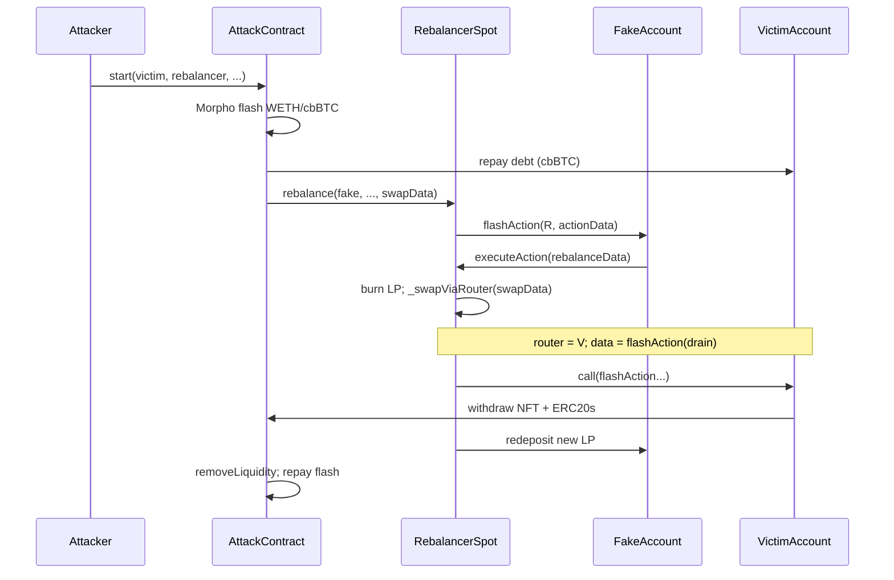

# Arcadia RebalancerSpot — Unvalidated `swapData` → Arbitrary `router.call`

<!-- non-defihacklabs -->

> **Vulnerability classes:** vuln/input-validation/missing · vuln/dependency/unsafe-external-call · vuln/access-control/broken-logic · vuln/logic/missing-validation

> **Reproduction:** isolated Foundry project at [this project folder](.) · full run log: [output.txt](output.txt).
> Verified source: [sources/RebalancerSpot_C72921/](sources/RebalancerSpot_C72921/)
> (critical line: [`src_rebalancers_libraries_SwapLogic.sol:140`](sources/RebalancerSpot_C72921/RebalancerSpot_C72921/src_rebalancers_libraries_SwapLogic.sol)).

---

## Key info

| | |
|---|---|
| **Loss** | **~$2.5–3.6M** total (multi-tx; ~1203 ETH bridged). This PoC primary victim ≈ **197.72 WETH** |
| **Vulnerable contract** | `RebalancerSpot` — [`0xC729213B9b72694F202FeB9cf40FE8ba5F5A4509`](https://basescan.org/address/0xC729213B9b72694F202FeB9cf40FE8ba5F5A4509#code) |
| **Victim Arcadia Account** | [`0x9529E5988ceD568898566782e88012cf11C3Ec99`](https://basescan.org/address/0x9529E5988ceD568898566782e88012cf11C3Ec99) |
| **Fake / dummy Account** | [`0xa6c64642b546026c768d3c20ab9d2bcbbad88712`](https://basescan.org/address/0xa6c64642b546026c768d3c20ab9d2bcbbad88712) |
| **AccountV1 impl** | [`0xbea2B6d45ACaF62385877D835970a0788719cAe1`](https://basescan.org/address/0xbea2B6d45ACaF62385877D835970a0788719cAe1) |
| **Attacker EOA** | [`0x0fa54E967a9CC5DF2af38BAbC376c91a29878615`](https://basescan.org/address/0x0fa54E967a9CC5DF2af38BAbC376c91a29878615) |
| **Attack contract** | [`0x6250DFD35ca9eee5Ea21b5837F6F21425BEe4553`](https://basescan.org/address/0x6250DFD35ca9eee5Ea21b5837F6F21425BEe4553) |
| **Attack tx** | [`0x06ce76eae6c12073df4aaf0b4231f951e4153a67f3abc1c1a547eb57d1218150`](https://basescan.org/tx/0x06ce76eae6c12073df4aaf0b4231f951e4153a67f3abc1c1a547eb57d1218150) @ Base **32881499** |
| **Chain / block / date** | Base / fork **32881498** / Jul 15 2025 |
| **Compiler** | Solidity **0.8.22** |
| **Bug class** | Unvalidated `swapData` → arbitrary low-level `router.call(data)` with `msg.sender == Rebalancer` (AssetManager of victims) |

> **Do not confuse** with registry `2023-07-ArcadiaFi_exp` (different year/class, Optimism).

---

## TL;DR

Arcadia’s `RebalancerSpot` is an Asset Manager for user Accounts. Initiators call `rebalance(account, …, swapData)`. When `swapData` is non-empty, `SwapLogic._swapViaRouter` **decodes an arbitrary `router` + `data` and does `router.call(data)`** with **no allowlist**. Because `msg.sender` is the Rebalancer — already authorized as AssetManager on victim Accounts — the attacker can nest a `flashAction` against the **victim** Account inside that call, withdraw LP NFTs + ERC20s, and repay Morpho flash + debt from the loot.

---

## Background

Arcadia Accounts are composable margin vaults. Users optionally grant Asset Managers (rebalancers, compounders) permission to call `flashAction`, which can withdraw assets, run external logic, and redeposit — ending with a health check.

`RebalancerSpot` rebalances Uniswap V3 / Slipstream CL positions owned by an Account:

1. Initiator must be registered via `setAccountInfo` by the Account owner.
2. `rebalance` stores `account`, builds `actionData` (including `swapData`), calls `IAccount(account).flashAction(address(this), actionData)`.
3. Account withdraws the LP NFT to the Rebalancer and calls `executeAction`.
4. Rebalancer burns liquidity, optionally swaps, mints a new range, returns deposit data.

---

## The vulnerable code

`SwapLogic._swapViaRouter` (verified multi-file source):

```solidity
// sources/.../src_rebalancers_libraries_SwapLogic.sol
function _swapViaRouter(...) internal returns (uint256 balance0, uint256 balance1) {
    (address router, uint256 amountIn, bytes memory data) = abi.decode(swapData, (address, uint256, bytes));
    address tokenToSwap = zeroToOne ? position.token0 : position.token1;
    ERC20(tokenToSwap).safeApproveWithRetry(router, amountIn);
    (bool success, bytes memory result) = router.call(data); // ← unvalidated
    require(success, string(result));
    // ... refresh sqrtPrice + balances
}
```

Call chain (CertiK):

```
RebalancerSpot.rebalance()
  → AccountV1.flashAction(actionTarget=Rebalancer)
    → Rebalancer.executeAction() → SwapLogic._swap()
      → _swapViaRouter() → router.call(data)   // router & data from swapData
```

Neither `router` nor `data` is checked against a DEX allowlist.

---

## Root cause

**Missing input validation on `swapData`** combined with **trusting `msg.sender == Rebalancer` as sufficient AssetManager auth** on victim Accounts. The protocol assumed `router` would always be a DEX; the attacker made `router` the **victim Account** and `data` a privileged `flashAction` that drains it.

---

## Preconditions

1. Victim Account has already set `RebalancerSpot` as AssetManager (normal UX for rebalancing).
2. Attacker owns dummy Arcadia Accounts and registers self as initiator via `setAccountInfo`.
3. Attacker can flash-borrow enough to (a) mint a small LP “pretense” position and (b) **repay victim debt** so the post-`flashAction` health check on the victim passes after collateral is removed.
4. Initiator info (tolerance / fee / minLiquidityRatio) is set so rebalance mint checks can be satisfied (attacker donates leftovers for remint).

---

## Attack walkthrough (primary tx / this PoC)

From CertiK + QuillAudits + live calldata (`start(...)` selector `0x60ba0ee3` on `0x6250…4553`):

1. **Morpho flashloan** — large WETH + cbBTC.
2. **Wire dummy account** — set Rebalancer as AssetManager; attacker as initiator; mint small Slipstream LP + deposit.
3. **Repay victim debt** — ~14.4 cbBTC on `darcV2cbBTC` for Account `0x9529…` so health checks pass after theft (`output.txt`: victim USDC/AERO/USDS go **0 → empty**).
4. **`rebalance(fakeAccount, …, swapData)`** — `swapData` decodes to `router = victim`, `data = flashAction(...)` withdrawing StakedSlipstream NFT + ERC20s to attacker.
5. Nested **`router.call`** runs as Rebalancer → victim `flashAction` succeeds (`onlyAssetManager`).
6. Attacker **removes LP liquidity**, swaps to WETH, repays flash; residual profit on attack contract.

### PoC numbers (`output.txt`)

| Metric | Value |
|--------|--------|
| Victim USDC before → after | `15777161780` → `0` |
| Victim AERO before → after | `~964.5e18` → `0` |
| Victim USDS before → after | `~821.8e18` → `0` |
| Attack-contract / PoC WETH | **197719502517350362221** (~**197.72 WETH**) |

---

## Diagrams



---

## Remediation

1. **Allowlist routers** in `_swapViaRouter` (Uniswap / Slipstream / 1inch only).
2. Reject `router` that is an Arcadia Account / AssetManager / self.
3. Do not grant AssetManager power that can be re-entered via untrusted external calls during rebalance.
4. Bound `swapData` length / selector allowlists for nested actions.

---

## How to reproduce

```bash
export PATH="$HOME/.foundry/bin:$PATH"
unset ETH_RPC_URL FOUNDRY_ETH_RPC_URL
cd 2025-07-ArcadiaRebalancer_exp
# Offline (anvil_state.json):
../../_shared/run_poc.sh 2025-07-ArcadiaRebalancer_exp -vv
# Or online archive:
# forge test --match-contract ArcadiaRebalancer -vv --gas-limit 50000000
```

Expected: `[PASS] testExploit` with ~**197.72 WETH** profit and victim ERC20s emptied.

---

*Reference: [CertiK Arcadia Incident Analysis](https://www.certik.com/blog/arcadia-incident-analysis-arbitrary-swapData) · [SolidityScan](https://blog.solidityscan.com/arcadia-finance-hack-analysis-a03a722e554d/) · [QuillAudits](https://www.quillaudits.com/blog/hack-analysis/arcadia-finance-hack-analysis) · [Cyvers](https://x.com/CyversAlerts/status/1945011492203421697)*
