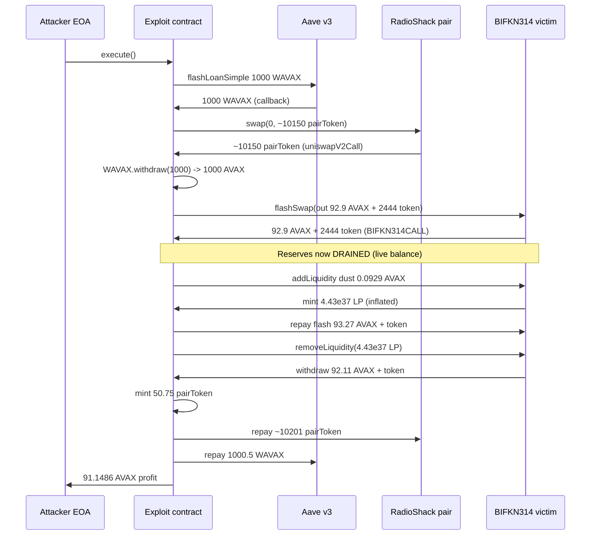
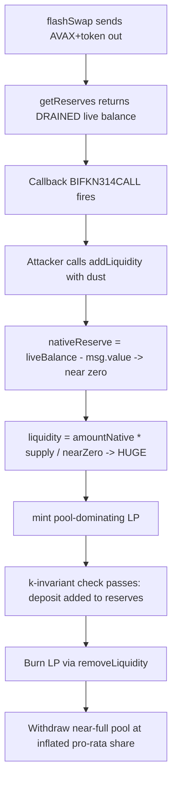

# BIFKN314 (ERC-314) flash-swap LP inflation — reserve snapshot taken after swap-out, before repayment, lets a dust `addLiquidity` mint pool-dominating LP shares

> **Vulnerability classes:** vuln/logic/incorrect-order-of-operations · vuln/oracle/price-manipulation · vuln/logic/state-update · vuln/reentrancy/cross-function
> **Reproduction:** the PoC compiles & runs in an isolated Foundry project at [this project folder](.). Full verbose trace: [output.txt](output.txt). Vulnerable contract source is verified and was fetched into [sources/BIFKN314Mintable_5b5913/](sources/BIFKN314Mintable_5b5913/); the secondary pair-token transfer gate (tx.origin allowlist) is an unverified external token.

---

## Key info

| | |
|---|---|
| **Loss** | ~2,422.73 USD (91.15 AVAX profit, on-chain trace [output.txt:1565](output.txt)) |
| **Vulnerable contract** | `BIFKN314Mintable` (ERC-314 pair) — [`0x5B5913EeC2031c9D8383e3afCfd269217E481ce1`](https://snowtrace.io/address/0x5b5913eec2031c9d8383e3afcfd269217e481ce1) |
| **Attacker EOA** | [`0x13459bC2Db6053524881415321667d5E16F5F15C`](https://snowtrace.io/address/0x13459bc2db6053524881415321667d5e16f5f15c) |
| **Attack contract** | [`0x346a89F7f5B42b67fc66eF4B3fb816a2a8BCe552`](https://snowtrace.io/address/0x346a89f7f5b42b67fc66ef4b3fb816a2a8bce552) |
| **Attack tx** | [`0xab813aeecd174d51a9f6d7d0eb9b323bccedba6c5cce0e965781a08f3473dbd5`](https://snowtrace.io/tx/0xab813aeecd174d51a9f6d7d0eb9b323bccedba6c5cce0e965781a08f3473dbd5) |
| **Chain / block / date** | Avalanche / 66,181,042 / 2025-07 |
| **Compiler** | solc v0.8.20+commit.a1b79de6, optimizer enabled, runs=500 (verified, [_meta.json](sources/BIFKN314Mintable_5b5913/_meta.json)) |
| **Bug class** | ERC-314 flash-swap executes the user callback after sending assets out but before any reserve/repayment validation, and `getReserves()` re-reads the live contract balance — so an `addLiquidity` call inside the callback prices LP shares against the post-outflow (depleted) reserves and mints a pool-dominating LP position for dust. |

## TL;DR

`BIFKN314Mintable` is an ERC-314-style native/token pair that bundles a Uniswap-V2-like constant-product pool with a built-in **flash swap**: `flashSwap()` sends AVAX and the pair token to the caller, then invokes a `BIFKN314CALL` callback, and only *after* the callback returns does it re-read the reserves and check that k did not decrease. Reserves are never stored — `getReserves()` always returns the **live** `address(this).balance` and live token balance (`contracts_BIFKN314.sol:796-814`).

That ordering is fatal. Inside the callback the attacker calls `addLiquidity` with a dust amount of AVAX (0.0929 AVAX) and a dust amount of the pair token. `addLiquidity` recomputes `nativeReserve` from the same live `getReserves()` and then subtracts `msg.value` (`L391`), so the reserve it divides by is the **post-flash-swap-outflow** reserve — already drained by the ~92.9 AVAX and ~2,444 pair-tokens just handed to the attacker. Dividing the dust `amountNative` by this tiny denominator mints an LP position vastly larger than the contribution: ~`4.43e37` LP units, dwarfing the existing supply (`output.txt:1646`). The attacker repays the flash swap (k is preserved because the inflated LP deposit counts as an "in" amount), then immediately burns the LP via `removeLiquidity` to withdraw the pool's remaining reserves at the inflated pro-rata share.

The net result in the reproduced trace: the attacker ends with **91.148601593744546787 AVAX** of profit (`output.txt:1565`) starting from **0 AVAX** (`output.txt:1564`), funded by a 1,000 WAVAX Aave flash loan plus a ~10,150 pair-token RadioShack flash swap that are both repaid inside the same transaction. A secondary precondition is that the attacker EOA was allowlisted (storage slot 6 of the unverified pair token) in the token's `tx.origin` transfer gate — without it the pair-token movements needed for the RadioShack repayment would revert.

## Background — what BIFKN314 does

`BIFKN314Mintable` is a self-contained Avalanche AMM pair implementing the **ERC-314** pattern (a Uniswap-V2-like constant-product pool that natively wraps its paired ERC-20 and accepts AVAX directly). It does not use Uniswap's stored `reserve0/reserve1` + `Sync` model. Instead, every price/liquidity computation reads the contract's *actual* native balance and token balance on the fly:

```solidity
function getReserves() public view returns (uint256 amountNative, uint256 amountToken) {
    uint256 totalNative = address(this).balance;
    uint256 totalNativeFees = accruedNativeTradingFees + accruedNativeFactoryFees;
    uint256 totalToken = getTokensInContract();
    uint256 totalTokenFees = accruedTokenTradingFees + accruedTokenFactoryFees;
    amountNative = totalNative >= totalNativeFees ? totalNative - totalNativeFees : 0;
    amountToken = totalToken >= totalTokenFees ? totalToken - totalTokenFees : 0;
}
```
([sources/BIFKN314Mintable_5b5913/contracts_BIFKN314.sol:796-814](sources/BIFKN314Mintable_5b5913/contracts_BIFKN314.sol#L796))

Liquidity providers call `addLiquidity(amountToken, recipient, deadline)` payable, which mints LP tokens from the [`BIFKN314LP`](sources/BIFKN314Mintable_5b5913/contracts_BIFKN314LP.sol) contract proportionally to the existing reserves. LPs withdraw through `removeLiquidity`, which redeems LP tokens for a pro-rata slice of the current reserves.

The distinguishing feature is **`flashSwap`** — a Uniswap-V2-`swap`-style call that delivers assets to the caller *first*, invokes a callback, and checks invariants only afterwards. This is the ERC-314 "flash" primitive: it is intended to let arbitrageurs borrow and repay within one transaction without posting collateral.

## The vulnerable code

### 1. `flashSwap` releases assets, then calls back, then validates

```solidity
function flashSwap(address recipient, uint256 amountNativeOut, uint256 amountTokenOut, bytes calldata data)
    external preventAutoSwap
{
    // ... checks ...
    (uint256 nativeReserve, uint256 tokenReserve) = getReserves();          // L616 - snapshot BEFORE outflow
    if (amountNativeOut > nativeReserve || amountTokenOut > tokenReserve) revert InsufficientLiquidity();

    if (amountNativeOut > 0) _transferNative(recipient, amountNativeOut);   // L625 - AVAX leaves the pool
    if (amountTokenOut > 0) {
        _checkMaxWallet(recipient, amountTokenOut);
        super._transfer(address(this), recipient, amountTokenOut);          // L630 - tokens leave the pool
    }

    IBIFKN314CALLEE(recipient).BIFKN314CALL(sender, amountNativeOut, amountTokenOut, data);  // L633 - CALLBACK

    (uint256 nativeReserveAfter, uint256 tokenReserveAfter) = getReserves(); // L640 - re-read AFTER callback
    uint amountNativeIn = nativeReserveAfter > nativeReserve ? nativeReserveAfter - nativeReserve : 0;
    uint amountTokenIn  = tokenReserveAfter  > tokenReserve  ? tokenReserveAfter  - tokenReserve  : 0;
    if (amountNativeIn == 0 && amountTokenIn == 0) revert TokenRepaymentFailed();
    // ... k-invariant check on adjusted reserves ...
}
```
([sources/BIFKN314Mintable_5b5913/contracts_BIFKN314.sol:601-698](sources/BIFKN314Mintable_5b5913/contracts_BIFKN314.sol#L601))

The callback (L633) executes **after** the assets have left the pool but **before** the repayment/k check. Any state-changing call the recipient makes inside the callback sees a pool whose live balances are temporarily drained.

### 2. `addLiquidity` mints LP against the drained reserve

```solidity
function addLiquidity(uint256 amountToken_, address recipient, uint256 deadline)
    public payable nonReentrant ensureDeadline(deadline) returns (uint256 liquidity)
{
    address sender = _msgSender();
    if (amountToken_ == 0 || msg.value == 0) revert AmountMustBeGreaterThanZero();

    (uint256 nativeReserve, uint256 tokenReserve) = getReserves();   // L389 - live, drained reserve
    nativeReserve = nativeReserve - msg.value;                       // L391 - subtract own deposit
    uint256 lpTotalSupply = liquidityToken.totalSupply();
    uint256 amountNative = msg.value;
    uint256 amountToken = amountToken_;
    // ... lpTotalSupply != 0 branch ...
    amountToken = (amountNative * tokenReserve) / nativeReserve;     // L410
    // ... k check passes because the deposit counts as new reserve ...
    liquidity = Math.min(
        (amountNative * lpTotalSupply) / nativeReserve,              // L430 - tiny denominator => huge LP
        (amountToken  * lpTotalSupply) / tokenReserve
    );
    // ...
    liquidityToken.mint(recipient, liquidity);                       // L452
    _internalTransfer(sender, address(this), amountToken);
    // ...
}
```
([sources/BIFKN314Mintable_5b5913/contracts_BIFKN314.sol:371-460](sources/BIFKN314Mintable_5b5913/contracts_BIFKN314.sol#L371))

Because `nativeReserve` is derived from the live `address(this).balance` (already reduced by the `amountNativeOut` sent in the flash swap) and is *then* reduced by `msg.value` again at L391, the denominator in `(amountNative * lpTotalSupply) / nativeReserve` collapses to a near-zero value. The numerator (`amountNative = msg.value`, a dust deposit) divided by that near-zero denominator yields an LP mint orders of magnitude larger than the deposit deserves. The k-invariant check at L441 (`newKValue >= currentKValue`) does **not** catch this — it is satisfied because the attacker's deposited tokens and AVAX are added to the reserves, so the post-deposit k is at least as large as the depleted pre-deposit k.

### 3. `removeLiquidity` redeems the inflated LP at full pro-rata value

`removeLiquidity` redeems LP tokens for their share of the *current* live reserves. Because the attacker now holds the overwhelming majority of LP supply, burning it withdraws almost the entire remaining pool — far more than the dust they deposited. Combined with the AVAX already obtained from the flash swap (and only partially repaid), this is the extractive step.

## Root cause — why it was possible

1. **Wrong order of operations in `flashSwap`.** Assets are transferred out and the user-controlled callback is invoked *before* the protocol has verified repayment or re-established its invariants. This is the textbook flash-swap reentrancy window — except here the "reentrancy" is into a *sibling public function* (`addLiquidity`) of the same contract, not an external dependency.
2. **Live-balance reserves instead of stored reserves.** `getReserves()` reads `address(this).balance` and the live token balance on every call. There is no cached snapshot that reflects the pool's "true" reserves across an in-flight swap. Any function that consults reserves during the flash-swap window sees the artificially drained balances.
3. **`addLiquidity` double-counts its own deposit against an already-drained reserve.** Line 391 subtracts `msg.value` from a reserve that has *already* been reduced by the flash-swap outflow. This is the multiplier: it divides the dust deposit by a near-zero post-outflow, post-deposit native reserve, minting a pool-dominating LP position.
4. **The k-invariant in `addLiquidity` is not a defense.** It only checks that the deposit does not *decrease* k — it does not bound *how much* LP is minted per unit of deposit. A deposit that is large relative to a temporarily tiny reserve mints enormous LP while still leaving k intact.
5. **No reentrancy guard shared between flash-swap and liquidity operations.** `flashSwap` uses `preventAutoSwap`; `addLiquidity`/`removeLiquidity` use `nonReentrant` — but these are independent guards, so entering `addLiquidity` from within the `flashSwap` callback is permitted. There is no "swap in progress" flag that would disable LP minting/burning mid-swap.
6. **Secondary enabler — pair-token `tx.origin` allowlist.** The unverified pair token gates transfers by an allowlist at storage slot 6. The attacker EOA happened to be allowlisted, which let the token move through the RadioShack pair repayment path. This is a per-attacker precondition, not the root cause of the LP inflation itself.

## Preconditions

- **Permissionless to initiate** `flashSwap` (only `tradingEnabled` and `isInitialized` must hold, which they do for an active pool). The callback target is attacker-controlled.
- **Requires flash-loan capital**: the attacker borrowed **1,000 WAVAX from Aave v3** (`output.txt:1614`) and **~10,150 pair tokens from the RadioShack Uniswap-V2 pair** (`output.txt:1624`) to seed and repay the nested swaps. No upfront capital of the attacker's own is required beyond gas.
- **Requires the attacker EOA to be allowlisted** in the unverified pair token's `tx.origin` transfer gate (storage slot 6 == 1). The PoC asserts this precondition directly against the fork state.
- **Pool must have an existing LP supply** so `addLiquidity` takes the proportional-mint branch (the bug lives in the `lpTotalSupply != 0` path).

## Attack walkthrough (with on-chain numbers from the trace)

All amounts from the reproduced Foundry trace. Attacker AVAX balance: **0 → 91.1486 AVAX** ([output.txt:1564](output.txt), [output.txt:1565](output.txt)).

| # | Step | Amount (from trace) |
|---|------|---------------------|
| 1 | Fork Avalanche at block 66,181,042 (pre-attack). Assert attacker is pair-token allowlisted (slot 6 == 1). | — |
| 2 | `Aave v3.flashLoanSimple(1000 WAVAX)` to the exploit contract. | 1,000 WAVAX borrowed ([output.txt:1614](output.txt)) |
| 3 | Inside Aave callback: `RadioShackPair.swap(0, 10150751249999999999996 pairToken)` — Uniswap-V2 flash swap of pair tokens. | ~10,150.75 pair tokens out ([output.txt:1624](output.txt)) |
| 4 | Inside `uniswapV2Call`: `WAVAX.withdraw(1000)` — unwrap to native AVAX. | 1,000 AVAX now in exploit contract ([output.txt:1633](output.txt)) |
| 5 | `BIFKN314.flashSwap(exploit, 92901517915106633387, 2444778402553574477179, "")` — victim sends out ~92.9 AVAX and ~2,444 pair tokens, then calls `BIFKN314CALL`. | flash out: 92.90 AVAX + 2,444.78 tokens ([output.txt:1637-1640](output.txt)) |
| 6 | Inside `BIFKN314CALL`: `addLiquidity{value: 92901517915106633}(92901517915106633, ...)` with **dust** (0.0929 AVAX). Reserves are drained by step 5; L391 shrinks the denominator further → minted **44263775251949957759085389766078584238 LP** (~4.43e37). | LP minted: 4.426e37 ([output.txt:1646](output.txt)) |
| 7 | Repay victim flash swap: send **93272659479177484387 AVAX** (~93.27 AVAX, slightly more than taken out — the excess is the "fee"/profit carrier) and **2444685501035659370546 pair tokens** back. | native repay 93.27 AVAX; token repay 2,444.69e ([output.txt:1651](output.txt), [output.txt:1664](output.txt)) |
| 8 | Back in `uniswapV2Call`: burn the inflated LP via `removeLiquidity(44263775251949957759085389766078584238)`. Pool returns **92112644675730504420 AVAX (92.11 AVAX)** + **2444778402553574450864 pair tokens**. | withdraw 92.11 AVAX + 2,444.78 tokens ([output.txt:1742](output.txt)) |
| 9 | `pairToken.mint(50753756249999999999)` (~50.75 pair tokens, the public mint allowed by the token) to top up, then repay RadioShack pair: transfer **10201505006249999999995 pair tokens** (borrowed + fee). | mint 50.75e; repay 10,201.5e ([output.txt:1749](output.txt), [output.txt:1755](output.txt)) |
| 10 | Back in Aave callback: wrap **1,000.5 AVAX** to WAVAX, approve, repay Aave (1,000 + 0.05% premium = 1000.5 WAVAX). | repay 1,000.5 WAVAX ([output.txt:1773](output.txt), [output.txt:1791](output.txt)) |
| 11 | Forward remaining **91.148601593744546787 AVAX** profit to the attacker EOA. `assertGt(91.1486 AVAX, 90 AVAX)` passes. | profit 91.1486 AVAX ([output.txt:1811-1813](output.txt)) |

### Profit / loss accounting (AVAX, exploit contract)

| Flow | AVAX |
|------|------|
| Aave borrow (step 2) | +1,000.0000 |
| Unwrap WAVAX (step 4) | +1,000.0000 (native), −1,000 WAVAX |
| Victim flash-swap out (step 5) | +92.9015 |
| `addLiquidity` dust deposit (step 6) | −0.0929 |
| Flash-swap native repay (step 7) | −93.2727 |
| `removeLiquidity` withdrawal (step 8) | +92.1126 |
| Wrap & repay Aave 1,000 + 0.05% (step 10) | −1,000.5000 |
| **Net AVAX profit** | **+91.1486** |

The pair-token leg nets to zero (borrowed from RadioShack, repaid with the LP-withdrawal tokens + a small mint). All AVAX profit originates from the victim pool: the `removeLiquidity` withdrawal (92.11 AVAX) exceeds the dust the attacker deposited (0.0929 AVAX) plus the net native flash-swap cost (~0.37 AVAX of "fee" paid on step 7).

## Diagrams





## Remediation

1. **Snapshot reserves before the callback and re-balance against the snapshot.** In `flashSwap`, capture `nativeReserve`/`tokenReserve` from a *pre-outflow* reading and, after the callback, validate repayment against that snapshot (as Uniswap V2 does with its `(uint112 reserve0, uint112 reserve1, uint32 blockTimestampLast)` cached reserves). Do not let any sibling function re-read the live balance mid-swap.
2. **Lock liquidity operations during an in-flight swap.** Add a contract-level `_inFlashSwap` flag (set on `flashSwap` entry, cleared on exit) and revert `addLiquidity` / `removeLiquidity` while it is set. The existing `nonReentrant`/`preventAutoSwap` modifiers are per-function and do not cover this cross-function window.
3. **Use stored reserves (accounting), not live balance, for all pricing/LP math.** Maintain `reserveNative` / `reserveToken` state variables updated on every transfer, the way Uniswap V2's `_update` does. `getReserves()` should return the accounting, with `balance0`/`balance1` used only for end-of-block reconciliation (and to detect donations/skim).
4. **In `addLiquidity`, do not subtract `msg.value` twice.** The `nativeReserve - msg.value` adjustment at L391 is only correct if `nativeReserve` was sampled *before* the deposit hit the balance. With live-balance reserves this line silently shrinks the denominator by the deposit a second time — remove it once stored reserves are adopted, or sample reserves via `getReserves() - msg.value` consistently.
5. **Bound LP minting by a deposit-to-supply ratio check.** As defense-in-depth, reject deposits that would mint more than e.g. `X%` of the existing LP supply in a single call, or require a minimum deposit proportional to current reserves.
6. **Decouple the pair token's transfer gate from `tx.origin`.** The allowlist-at-slot-6 / `tx.origin` gate on the unverified pair token is a separate centralization/permissioning hazard; use `msg.sender`-based allowances and remove hardcoded allowlists.

## How to reproduce

The PoC runs **fully offline** via the shared anvil harness from the committed `anvil_state.json` — no RPC needed.

```bash
_shared/run_poc.sh 2025-07-AvaxBIFKNPair_exp -vvvvv
```

- **Chain / fork block:** Avalanche, block 66,181,042 (pre-attack).
- **Expected result:** `[PASS] testExploit()` ([output.txt:1562](output.txt)).
- **Profit assertion:** attacker AVAX balance goes **0.000000000000000000 → 91.148601593744546787** ([output.txt:1564](output.txt), [output.txt:1565](output.txt)); the test asserts `> 90 AVAX`.

The fork uses a local anvil RPC (`http://127.0.0.1:8551`) loaded from `anvil_state.json`. The PoC also asserts the secondary precondition — that the attacker EOA is allowlisted in the pair token (storage slot 6) — directly against the fork state, so a non-allowlisted caller would fail at that `assertEq` rather than later in the swap.

*Reference: [defimon_alerts (Twitter/Telegram)](https://t.me/defimon_alerts/1559).*
