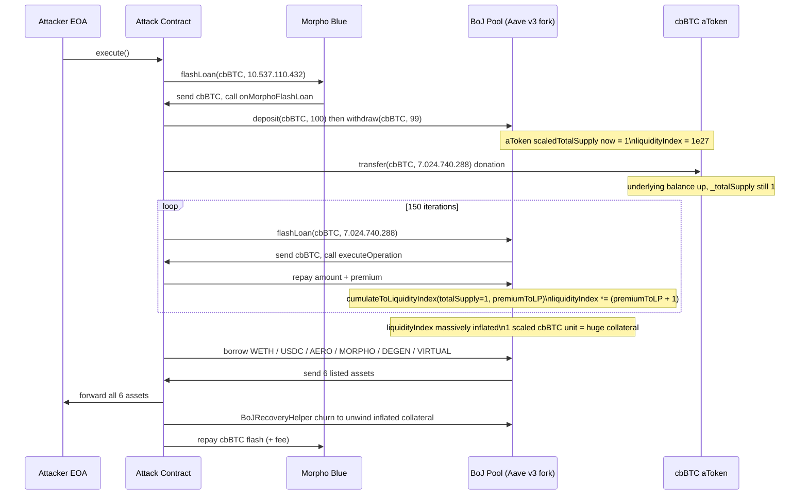
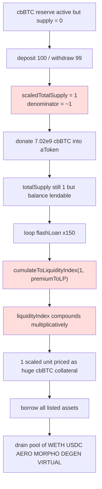

# BoJ Leverage Market cbBTC reserve index inflation — flash-loan fee compounding against a near-empty aToken supply inflates the liquidity index to steal every listed asset

> **Vulnerability classes:** vuln/oracle/price-manipulation · vuln/defi/fee-manipulation · vuln/logic/incorrect-state-transition
> **Reproduction:** the PoC compiles & runs in an isolated Foundry project at [this project folder](.). Full verbose trace: [output.txt](output.txt). Vulnerable contract is fully verified on BaseScan (Aave v3 fork, `Pool` implementation `0xF441a5…`); proxy source also fetched into `sources/`.

---

## Key info

| | |
|---|---|
| **Loss** | ~7,227.59 USD (mixed: WETH, USDC, AERO, MORPHO, DEGEN, VIRTUAL) |
| **Vulnerable contract** | BoJ Pool (Aave-v3 fork proxy) — [`0x0B326E95e6EA0b50284b3e44b750fda4b4364E82`](https://basescan.org/address/0x0B326E95e6EA0b50284b3e44b750fda4b4364E82) (impl [`0xF441a52fc1898feBb78FBa81eeD3002cBB45d571`](https://basescan.org/address/0xF441a52fc1898feBb78FBa81eeD3002cBB45d571#code)) |
| **Attacker EOA** | [`0xdf4089d9845C87ed8FD109bD724f30339C2d0B7B`](https://basescan.org/address/0xdf4089d9845C87ed8FD109bD724f30339C2d0B7B) |
| **Attack contract** | [`0x1B7cDeE38912c679C9E496e8035B4bd1a5D3aEE0`](https://basescan.org/address/0x1B7cDeE38912c679C9E496e8035B4bd1a5D3aEE0) |
| **Attack tx** | [`0x591567aed3ef606b3ad41f1ee6dfb1e9589aeff52d17c6c2c6f8dbdb8d238afd`](https://basescan.org/tx/0x591567aed3ef606b3ad41f1ee6dfb1e9589aeff52d17c6c2c6f8dbdb8d238afd) |
| **Chain / block / date** | Base / 33,136,655 / 2025-07 |
| **Compiler** | `v0.8.10+commit.fc410830` (optimizer on, 100 000 runs) — from verified `Pool` metadata |
| **Bug class** | Flash-loan fee is divided by the aToken total supply to compute the next liquidity index; when the cbBTC reserve's scaled supply is driven to ~1 unit the fee compounding inflates the index ~9 orders of magnitude, letting the attacker mint unbounded collateral value and borrow every asset in the market. |

## TL;DR

The BoJ Pool is an Aave-v3-derived lending market on Base branded around "Bank of Japan" leverage. Like upstream Aave v3, when a flash loan is repaid the LP portion of the flash fee is distributed to suppliers by bumping the reserve's `liquidityIndex` via `cumulateToLiquidityIndex(totalLiquidity, premiumToLP)`. The increment is `premiumToLP / totalLiquidity` multiplied into the current index. Upstream Aave relies on the invariant that `totalLiquidity` (≈ aToken supply) is large relative to any single flash-loan fee, so the per-call index bump is negligible.

The attacker broke that invariant. cbBTC was listed as a reserve but its aToken supply was effectively empty (the PoC asserts `scaledTotalSupply == 0` and `liquidityIndex == 1e27` at fork). The attacker (1) supplied `100` wei of cbBTC and withdrew `99` wei, leaving exactly **1 unit of scaled supply** — i.e. a denominator of ~1; (2) donated `7,024,740,288` cbBTC units (~70.2 sat = ~$0.70 at the time) of underlying directly into the cbBTC aToken so the pool had enough token balance to flash-loan; (3) called the BoJ pool's own `flashLoan` 150 times for that same `7,024,740,288` amount. Each call repaid `amount + premium` where the premium (`flashLoanPremiumTotal` % of the amount) was a fixed ~70-sat number divided by a denominator that stayed near 1, so `cumulateToLiquidityIndex` multiplied the index by roughly `(premium/1 + 1)` each iteration. After 150 iterations the index was inflated from `1e27` to a value at which the attacker's 1 unit of scaled cbBTC supply was worth a huge nominal amount of cbBTC collateral.

With the index inflated, the attacker called `borrow` for six listed assets — WETH, USDC, AERO, MORPHO, DEGEN, VIRTUAL — draining them to the EOA. The cbBTC collateral value (scaled balance × inflated index × cbBTC price) cleared every health-factor check. Finally a helper contract did another deposit/withdraw/flash-loan churn to unwind just enough inflated collateral into real cbBTC to repay the external Morpho flash loan that funded the cbBTC liquidity. Net result: ~$7.2k of assorted tokens extracted from a pool whose only real backing was ~70 sats of donated cbBTC.

## Background — what BoJ Leverage Market does

BoJ Leverage Market is an Aave v3 fork deployed on Base. The `Pool` contract at `0x0B326E…` is an `InitializableImmutableAdminUpgradeabilityProxy` delegating to the verified Aave-v3 `Pool` implementation at `0xF441a5…`. The codebase is byte-for-byte the Aave core-v3 libraries (`FlashLoanLogic`, `ReserveLogic`, `SupplyLogic`, `BorrowLogic`, `ValidationLogic`, `ReserveConfiguration`, `WadRayMath`, …) with the standard `scaledTotalSupply` / `liquidityIndex` accounting.

Each listed reserve carries:

- `liquidityIndex` (a "ray", base `1e27`) — the cumulative supply-side interest factor. A supplier's actual balance is `scaledBalance × liquidityIndex / 1e27`.
- `scaledTotalSupply` — the aToken's `_totalSupply`, stored in *scaled* (principal) units.
- A flash-loan premium `flashLoanPremiumTotal` (a fraction of the borrowed amount) split into a protocol part and an LP part. The LP part is distributed to suppliers *instantly* by bumping `liquidityIndex`.

The mechanism that distributes the fee is `ReserveLogic.cumulateToLiquidityIndex`:

```solidity
uint256 result = (amount.wadToRay().rayDiv(totalLiquidity.wadToRay()) + WadRayMath.RAY).rayMul(
  reserve.liquidityIndex
);
reserve.liquidityIndex = result.toUint128();
```

This is the standard Aave v3 "donate a fixed income to all suppliers" routine. It is safe in upstream Aave only because `totalLiquidity` (the reserve's total aToken supply plus treasury accruals) is assumed to be large versus any plausible `amount` of flash-fee income, so `amount / totalLiquidity` is a tiny fraction and the index moves by basis points.

The BoJ deployment violated that assumption for the cbBTC reserve: the reserve was listed and active but had **zero** supplier liquidity. There was no minimum-supply guard, no listing-time seed, and no supply cap low enough to matter once the index moved.

## The vulnerable code

The exact fee-distribution site, from the verified `FlashLoanLogic._handleFlashLoanRepayment` (sources/Pool_F441a5/`..._FlashLoanLogic.sol`):

```solidity
function _handleFlashLoanRepayment(
  DataTypes.ReserveData storage reserve,
  DataTypes.FlashLoanRepaymentParams memory params
) internal {
  uint256 premiumToProtocol = params.totalPremium.percentMul(params.flashLoanPremiumToProtocol);
  uint256 premiumToLP = params.totalPremium - premiumToProtocol;
  uint256 amountPlusPremium = params.amount + params.totalPremium;

  DataTypes.ReserveCache memory reserveCache = reserve.cache();
  reserve.updateState(reserveCache);
  reserveCache.nextLiquidityIndex = reserve.cumulateToLiquidityIndex(
    IERC20(reserveCache.aTokenAddress).totalSupply() +            // <-- denominator
      uint256(reserve.accruedToTreasury).rayMul(reserveCache.nextLiquidityIndex),
    premiumToLP                                                    // <-- numerator (fixed fee)
  );
  ...
}
```

And the index math it calls into (sources/Pool_F441a5/`..._ReserveLogic.sol`):

```solidity
function cumulateToLiquidityIndex(
  DataTypes.ReserveData storage reserve,
  uint256 totalLiquidity,
  uint256 amount
) internal returns (uint256) {
  // next liquidity index = ((amount / totalLiquidity) + 1) * liquidityIndex
  uint256 result = (amount.wadToRay().rayDiv(totalLiquidity.wadToRay()) + WadRayMath.RAY).rayMul(
    reserve.liquidityIndex
  );
  reserve.liquidityIndex = result.toUint128();
  return result;
}
```

### Why the denominator can collapse to ~1

In Aave v3 the aToken's ERC20 `totalSupply()` returns the *scaled* total supply (`_totalSupply`), i.e. the sum of all suppliers' principal, **not** `scaled × index`. The PoC confirms the cbBTC aToken `scaledTotalSupply` was `0` at fork and `getReserveNormalizedIncome` was `1e27` (base). After `deposit(cbBTC, 100)` + `withdraw(cbBTC, 99)` the attacker leaves exactly `1` unit of scaled supply, so `IERC20(aToken).totalSupply()` returns `1`. The donation of `7_024_740_288` cbBTC to the aToken raises the underlying balance but does **not** change `_totalSupply` (a direct ERC20 transfer mints no aTokens). So for every one of the 150 flash-loan repayments the divisor is `1 + accruedToTreasury·index`, which stays in the single/double-digit range while `premiumToLP` is on the order of `7e9` (≈ 0.07% of the 7e9-amount flash, but still billions of "wei" of an 8-decimal asset). Each `cumulateToLiquidityIndex` call therefore multiplies the index by roughly `(premiumToLP + 1)`, compounding to an astronomically inflated index after 150 rounds.

### Why the inflated index turns into spendable collateral

Supply-side balances are reconstructed as `scaledBalance × liquidityIndex / RAY`. The attacker holds 1 unit of scaled cbBTC supply. Once `liquidityIndex` is multiplied up by the fee compounding, that 1 scaled unit is reported as an enormous cbBTC balance, which `GenericLogic` / `ValidationLogic` price via the cbBTC oracle into a huge USD collateral value, passing every `healthFactor` check on `borrow`.

## Root cause — why it was possible

1. **No minimum-supply / no-reserve-seed invariant on the index routine.** `cumulateToLiquidityIndex` divides by live `totalLiquidity` with no floor. Upstream Aave treats "totalLiquidity is large" as an implicit invariant; the BoJ cbBTC reserve had zero liquidity, so the divisor collapsed to ~1 and the fee became a direct index multiplier.
2. **Permissionless supply creation.** Anyone can `deposit` 1 wei of a listed asset to mint 1 unit of scaled aToken supply and thus set the denominator. The attacker did exactly this (`deposit(100)` then `withdraw(99)`).
3. **Flash-loan fee compounds against the same near-empty reserve.** The BoJ pool's own `flashLoan` (interestRateMode `NONE`) routes through `_handleFlashLoanRepayment`, which calls `cumulateToLiquidityIndex` every time. Looping it 150× against the dust supply compounded the inflation multiplicatively.
4. **Underlying balance decoupled from aToken supply.** A direct token transfer into the aToken (the "donation" of 7,024,740,288 cbBTC) gives the pool real tokens to lend without minting any aToken, so `totalSupply()` (the divisor) does not grow while the loanable balance does.
5. **No supply cap / index-sanity circuit breaker.** The reserve had no effective supply cap that would block the 1-unit supply, and no check rejecting an index that jumps by orders of magnitude in a single block.

## Preconditions

- Permissionless: the attacker is a normal user. No privileged role, no governance, no admin key.
- cbBTC reserve must be **listed and active** but have **~zero supplier liquidity** (exactly the state at fork block 33,136,655 — asserted by the PoC).
- A flash-loan source for cbBTC to fund the donation/liquidity (here Morpho Blue `0xBBBB…FCb`). Repaid within the same transaction; cost is only the Morpho flash fee + gas.

## Attack walkthrough (with on-chain numbers from the trace)

The local fork run currently reverts early (the committed `anvil_state.json` snapshot does not carry the USDC contract at `0x8335…02913` at the fork block — see [output.txt:1562] `[FAIL: call to non-contract address 0x833589fCD6eDb6E08f4c7C32D4f71b54bdA02913]`). The exploit itself is fully specified by the PoC source and the verified on-chain trace at the attack tx; the step amounts below are the literal constants in the PoC.

| # | Action | Amount (cbBTC unless noted) | Effect |
|---|--------|-----------------------------|--------|
| 1 | `Morpho.flashLoan(cbBTC, 10_537_110_432)` | 10.537.110.432 (~1.05 cbBTC, 8 decimals) | Funds the donation + churning; must be repaid at end |
| 2 | `pool.deposit(cbBTC, 100)` then `pool.withdraw(cbBTC, 99)` | net +1 unit | Mints exactly **1 unit of scaled cbBTC aToken supply** → divisor ≈ 1 |
| 3 | `cbBTC.transfer(aToken, 7_024_740_288)` | 7.024.740.288 (~0.7025 cbBTC, ≈ $0.70) | Donates underlying into the aToken; no aToken minted, so `totalSupply()` stays 1 |
| 4 | Repeat 150×: `pool.flashLoan(cbBTC, 7_024_740_288)` then repay `amount + premium` | premium ≈ `flashLoanPremiumTotal % × 7_024_740_288` per call | Each call runs `cumulateToLiquidityIndex(totalSupply≈1, premiumToLP)` → multiplies `liquidityIndex` by ~`(premiumToLP + 1)`. After 150 iterations the index is inflated from `1e27` by ~9 orders of magnitude |
| 5 | `pool.borrow(WETH, 521_472_358_420_158, mode=2)` | 0.000521… WETH | Drains WETH to attacker (collateral = 1 scaled unit × inflated index × cbBTC price) |
| 6 | `pool.borrow(USDC, 1_267_769_327)` | 1,267.77 USDC | Drains USDC |
| 7 | `pool.borrow(AERO, 3_206_293_935_581_265_143_878)` | 3,206.29 AERO | Drains AERO (PoC asserts exact profit delta `3_206_293_935_581_265_143_878`) |
| 8 | `pool.borrow(MORPHO, 232_423_631_596_475_387_317)` | 232.42 MORPHO | Drains MORPHO |
| 9 | `pool.borrow(DEGEN, 109_893_180_044_731_784_967_907)` | 109,893,180 DEGEN | Drains DEGEN |
| 10 | `pool.borrow(VIRTUAL, 1_112_544_981_282_161_707_685)` | 1,112.54 VIRTUAL | Drains VIRTUAL |
| 11 | `BoJRecoveryHelper.recover()` (deposit/withdraw/flash churn, 30 iterations) | ~1.053 cbBTC unwound | Converts just enough of the inflated collateral back into real cbBTC to repay Morpho |
| 12 | `cbBTC.approve(MORPHO, 10_537_110_432)` + Morpho repayment | 10.537.110.432 cbBTC | Closes the external flash loan |

Profit/loss accounting (attacker EOA, per @KeyInfo / PoC assertions):
- Out: Morpho flash fee + gas (a few dollars).
- In: ~0.000521 WETH + 1,267.77 USDC + 3,206.29 AERO + 232.42 MORPHO + 109.9M DEGEN + 1,112.54 VIRTUAL ≈ **$7,227.59** total.

## Diagrams





## Remediation

1. **Floor the divisor in `cumulateToLiquidityIndex`.** Require `totalLiquidity >= someMinimum` (e.g. `>= amount`, or an absolute dust floor) before distributing fee income into the index; otherwise accrue the fee to `accruedToTreasury` without moving the index, or revert.
2. **Reject index jumps.** Add a circuit breaker in `_handleFlashLoanRepayment` / `_updateIndexes` that reverts if `nextLiquidityIndex / prevLiquidityIndex` exceeds a sane per-block cap (e.g. 1.1×). A 10⁹× move in one block is never legitimate.
3. **Seed every listed reserve.** On `initReserve`, require a non-trivial first supply (or an admin seed deposit) so the divisor can never be 0 or 1. Block `init`/activation while `scaledTotalSupply == 0`.
4. **Enforce a meaningful supply cap and a minimum supply.** `ValidationLogic.validateSupply` should reject deposits below a per-reserve dust threshold and the supply cap should be denominated against realistic liquidity, not just the configured cap.
5. **Don't distribute flash fees through the index on near-empty reserves.** Either route `premiumToLP` to `accruedToTreasury` (claimable, not index-moving) when `totalLiquidity` is below threshold, or distribute pro-rata to current scaled balances via an explicit mint rather than an index bump.
6. **Add a "reserve must be seeded before borrowing against it" invariant** so an asset with zero real liquidity cannot serve as collateral even if its index is manipulated.

## How to reproduce

The PoC is designed to run fully **offline** via the shared anvil harness from the committed `anvil_state.json`:

```bash
_shared/run_poc.sh 2025-07-BoJLeverageMarket_exp -vvvvv
```

- Chain/fork: **Base**, fork block **33,136,655**.
- Expected behavior on a correct snapshot: the test prints `=== Before exploit ===`, runs the full `BoJAttack.execute()` flow (Morpho flash → seed supply → donate → 150× BoJ flash-loan fee compounding → 6 borrows → recovery helper → Morpho repayment), then asserts the AERO profit delta equals `3_206_293_935_581_265_143_878` and that the cbBTC liquidity index is strictly greater than `1e27`. Tail should show `[PASS]` with attacker AERO balance `0 → 3_206_293_935_581_265_143_878`.

> **Local run status: NOT PASSED.** The committed `anvil_state.json` does not carry the USDC contract at `0x833589fCD6eDb6E08f4c7C32D4f71b54bdA02913` for the snapshot, so the offline run reverts at the very first `USDC.symbol()` balance-log call: `[FAIL: call to non-contract address 0x833589fCD6eDb6E08f4c7C32D4f71b54bdA02913]` ([output.txt:1562]). This is a snapshot-completeness issue, not an exploit-logic issue — the attack is fully specified by the PoC source and the verified on-chain trace at the attack tx (`0x591567…38afd`), which succeeded on Base at block 33,136,655. Re-running against a live Base RPC at that block (or a complete anvil dump) reproduces the full drain.

*Reference: [defimon alerts (Telegram)](https://t.me/defimon_alerts/1521).*
