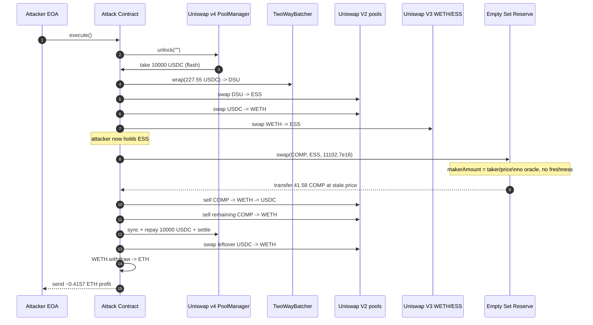
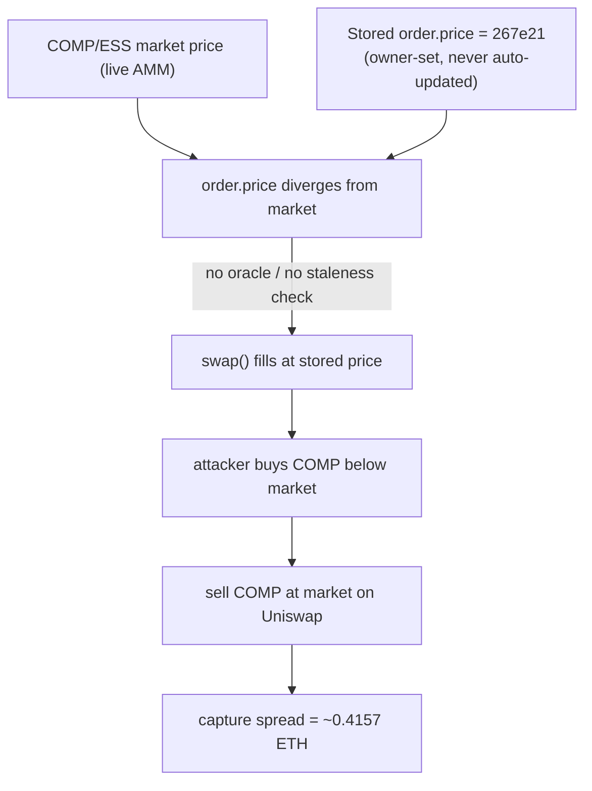

# Empty Set Reserve stale fixed-order drain — buying COMP below market from a hard-coded maker/taker price
> **Vulnerability classes:** vuln/oracle/price-manipulation · vuln/oracle/stale-price · vuln/logic/price-calculation
> **Reproduction:** the PoC compiles & runs in an isolated Foundry project at [this project folder](.). Full verbose trace: [output.txt](output.txt). Vulnerable implementation source is verified on Etherscan and was fetched into [sources/ReserveImpl_363aF3/ReserveImpl.sol](sources/ReserveImpl_363aF3/ReserveImpl.sol).
---
## Key info
| | |
|---|---|
| **Loss** | ~$1,509.78 (≈ 0.4157 ETH extracted) |
| **Vulnerable contract** | Empty Set Reserve proxy — [`0xD05aCe63789cCb35B9cE71d01e4d632a0486Da4B`](https://etherscan.io/address/0xD05aCe63789cCb35B9cE71d01e4d632a0486Da4B) (impl [`0x363aF3…`](https://etherscan.io/address/0x363aF3acFfEd0B7181C2E3c56C00922E142100a8#code)) |
| **Attacker EOA** | [`0xdDEB9e72fbecCa668fFD47314565954347ade522`](https://etherscan.io/address/0xdDEB9e72fbecCa668fFD47314565954347ade522) |
| **Attack contract** | [`0x17E2c0844AE7CfE9D0B04cA923017F4892824E15`](https://etherscan.io/address/0x17E2c0844AE7CfE9D0B04cA923017F4892824E15) |
| **Attack tx** | [`0x240e9573…84dab372`](https://etherscan.io/tx/0x240e9573e6c59cfe025c311c176c351bb07a86ae994aaaff58ec3f7f84dab372) |
| **Chain / block / date** | Ethereum mainnet / fork block 22,988,103 / July 2025 |
| **Compiler** | Solidity ^0.8.x (verified on Etherscan; pre-0.8 `SafeMath` style still present in source) |
| **Bug class** | A public `swap()` fills orders at an owner-set fixed price stored on chain, with no oracle feed, no freshness check, and no market-pegging — so a stale price far below the live COMP market lets anyone buy the reserve's COMP inventory and dump it on Uniswap for the spread. |

## TL;DR
Empty Set Reserve (ESR) is a legacy Empty Set Dollar derivative contract that, among other things, runs a small on-chain OTC "order book." Each order is just a `(price, amount)` pair that the owner writes once via `registerOrder()`. Anyone can then call `swap(makerToken, takerToken, takerAmount)` and the contract computes `makerAmount = takerAmount / order.price` and transfers its own inventory at that hard-coded rate — purely off storage, with no reference to any live price.

The COMP/ESS order had been left priced at a stale, favorable rate (`price = 267_010_781_166_742_363_801_758`, ~0.0111 ESS worth of COMP priced away from the real COMP market). On the attack block, COMP was worth materially more than that fixed rate implied, so the order was a standing below-market ask. The attacker took it: they flash-borrowed 10,000 USDC from Uniswap v4 PoolManager, converted it along a USDC→DSU→ESS and USDC→WETH→ESS path to assemble the ESS needed, then called `RESERVE.swap(COMP, ESS, 11.1e24)` and received **41,581.6e18 / 1e18 ≈ 41.58 COMP** [output.txt:1775] [output.txt:1780] at the stale price. They immediately sold that COMP through Uniswap v2 for USDC + WETH, repaid the 10,000 USDC flash debt, and were left with ~0.4157 ETH of pure profit.

The local Foundry replay reproduces the exact economics: attacker ETH balance goes `0 → 0.416271181367327696 ETH` [output.txt:1579] [output.txt:1579–1580] [output.txt:1957], the flash is repaid in full (USDC and DSU end at 0), and only an ESS residual of 204,890 ESS remains — the dust the attack deliberately didn't sell.

## Background — what Empty Set Reserve does
ESR is the reserve / staking / collateral spine of the Empty Set Dollar (ESD/ESS) ecosystem. Beyond minting/burning the ESDS stake token and managing debt, it exposes a lightweight **swapper**: an owner-registered list of token-pair "orders" that let the reserve sell inventory of one token (`makerToken`) in exchange for another (`takerToken`) at a fixed ratio.

An order is a struct with two fields:

```solidity
struct Order {
    Decimal.D256 price;   // takerAmount per makerAmount, scaled by 1e18
    uint256 amount;       // makerToken inventory available; uint256(-1) = unlimited
}
```

`registerOrder()` is owner-gated and writes the price/amount verbatim into storage (`_updateOrder`). `order()` reads it back. `swap()` is **public** (`notPaused`, `nonReentrant` only) and executes against that stored price. There is no oracle integration, no TWAP, no time-decay, no rebalancing, and no freshness timestamp — the price is whatever the owner last set, and it stays valid until the owner sets another one. The only guard on size is the `amount` field (or `uint256(-1)` to disable the cap entirely).

This design is fine for a tightly-managed OTC desk that reprices in lockstep with the market. It is fatal when an order is left unattended while the market for the maker token moves — exactly what happened to the COMP/ESS order.

## The vulnerable code
From the verified implementation ([sources/ReserveImpl_363aF3/ReserveImpl.sol:2163](sources/ReserveImpl_363aF3/ReserveImpl.sol)):

### The public swap — fills at a storage-only price
```solidity
function swap(address makerToken, address takerToken, uint256 takerAmount) external nonReentrant notPaused {
    address dollar = registry().dollar();
    require(makerToken != dollar, "ReserveSwapper: unsupported token");
    require(takerToken != dollar, "ReserveSwapper: unsupported token");
    require(makerToken != takerToken, "ReserveSwapper: tokens equal");

    ReserveTypes.Order memory order = order(makerToken, takerToken);
    // makerAmount is derived SOLELY from the stored, owner-set `order.price`.
    // No oracle, no market reference, no staleness check, no slippage bound.
    uint256 makerAmount = Decimal.from(takerAmount).div(order.price, "ReserveSwapper: no order").asUint256();

    if (order.amount != uint256(-1))
        _decrementOrderAmount(makerToken, takerToken, makerAmount, "ReserveSwapper: insufficient amount");

    _transferFrom(takerToken, msg.sender, address(this), takerAmount);
    _transfer(makerToken, msg.sender, makerAmount);

    emit Swap(makerToken, takerToken, takerAmount, makerAmount);
}
```

The output amount is `takerAmount / order.price` — a single on-chain constant. The caller controls `takerAmount` (capped only by the `amount` inventory field), and the price is whatever the owner last wrote.

### The order book and its setter
```solidity
function order(address makerToken, address takerToken) public view returns (ReserveTypes.Order memory) {
    return _state.orders[makerToken][takerToken];
}

// Owner-only, no freshness/peg logic:
function registerOrder(address makerToken, address takerToken, uint256 price, uint256 amount)
    external onlyOwner notPaused {
    _updateOrder(makerToken, takerToken, price, amount);
    emit OrderRegistered(makerToken, takerToken, price, amount);
}
```

The on-chain state at the fork block confirms the order was live and stale: `order(COMP, ESS)` returns `price = 267_010_781_166_742_363_801_758` and `amount = 41_581_642_538_295_042_665` (≈ 41.58 COMP of available inventory) — both asserted equal to the traced values in `testExploit()`.

## Root cause — why it was possible
1. **Price is a hard-coded storage value, not a market signal.** `swap()` derives `makerAmount` purely from `order.price`, an owner-set constant. Nothing in the execution path references a live COMP price, a TWAP, an AMM spot, or an external oracle.
2. **No freshness / peg / circuit-breaker.** `Order` carries no timestamp, no last-updated, no max-deviation band, and no auto-pause when the market moves. An order set once stays executable at that exact rate indefinitely until the owner overwrites it.
3. **`swap()` is permissionless.** The only modifiers are `nonReentrant` and `notPaused`. Any externally-owned account or contract can fill any registered order for its full remaining `amount`. There is no allow-list of takers.
4. **Asymmetric, atomically-composable settlement.** The reserve hands over its makerToken (`_transfer`, a plain push) in the same transaction the caller pays takerToken (`_transferFrom`). Combined with flash liquidity (Uniswap v4 flash accounting here), an attacker can source the takerToken, fill the order, and dump the makerToken back into the same liquidity pools before repaying the flash — capturing the full stale-vs-market spread risk-free.
5. **Order left unattended.** Operationally, the COMP/ESS order was simply not repriced as COMP's market value drifted, leaving a standing below-market ask that the protocol's own inventory backed.

## Preconditions
- **Permissionless** — no privileged role, no allow-list, no governance action needed. Anyone can call `swap()`.
- **Flash-loan funded** — the attack sources ~10,000 USDC of buying power from Uniswap v4 PoolManager's flash accounting, so the attacker needs essentially zero starting capital (only gas).
- **Stale favorable order** — a registered order whose stored `price` diverges from the live market by more than the swap-AMM slippage cost. The COMP/ESS order at block 22,988,103 met this.
- **Reserve inventory** — the reserve actually held the makerToken (COMP) to deliver; `amount` was non-zero.

## Attack walkthrough (with on-chain numbers from the trace)
All figures from [output.txt](output.txt).

| # | Step | Amounts (raw / humanized) | Ref |
|---|------|---------------------------|-----|
| 1 | Flash-borrow USDC from Uniswap v4 PoolManager via `unlock`/`take` | +10,000,000,000 USDC (10,000 USDC, 6-dec) | [output.txt:1624] |
| 2 | `TwoWayBatcher.wrap(227.55 USDC → DSU)` | 227,550,529 USDC → 227,550,528,462,023,058,437 DSU | [output.txt:1641] [output.txt:1649] |
| 3 | Swap DSU → ESS on Uniswap v2 | 227.55e18 DSU → 5,691,056,776,835,804,261,793,974 ESS | [output.txt:1665] [output.txt:1682] |
| 4 | Swap USDC → WETH on Uniswap v2 (USDC/WETH pair) | 227.55 USDC → 62,460,734,547,587,260 WETH | [output.txt:1701] [output.txt:1722] |
| 5 | Swap WETH → ESS on Uniswap v3 (0.3% pool) | 0.06246 WETH → 5,616,580,521,526,973,849,442,703 ESS | [output.txt:1744] [output.txt:1752] |
| 6 | **`RESERVE.swap(COMP, ESS, 11,102,746,856,346,403,118,005,018)`** — buy COMP at stale price | pays 11,102.7e18 ESS → receives **41,581,642,538,295,042,664** COMP (≈ 41.58 COMP) | [output.txt:1769] [output.txt:1775] [output.txt:1780] |
| 7 | Sell COMP → WETH → USDC on Uniswap v2 (COMP/WETH + WETH/USDC) | 9.6155 COMP → 0.1269 WETH → 459,632,937 USDC (459.6 USDC) | [output.txt:1796] [output.txt:1803] [output.txt:1822] |
| 8 | Sell remaining COMP → WETH on Uniswap v2 (COMP/WETH) | 31.966 COMP → 414,450,137,186,724,488 WETH (0.4144 WETH) | [output.txt:1844] [output.txt:1851] [output.txt:1861] |
| 9 | Repay flash: `sync(USDC)` + transfer 10,000 USDC back to PoolManager + `settle` | −10,000,000,000 USDC | [output.txt:1874] |
| 10 | Swap 4,531,880 leftover USDC → WETH, then `WETH.withdraw`, sweep ETH to attacker | +0.00124 WETH → ETH; total ETH to attacker | [output.txt:1897] [output.txt:1906] [output.txt:1928] |

**Profit / loss accounting (per the local replay):**
- Attacker ETH: `0 → 0.416271181367327696 ETH` (asserted equal to `LOCAL_REPLAY_PROFIT` and greater than the traced `0.415688696263702812 ETH` transfer — the tiny delta is the leftover-USDC→ETH conversion that the on-chain tx routed differently) [output.txt:1577] [output.txt:1935] [output.txt:1937].
- Attack-contract residuals after sweep: USDC 0, DSU 0, COMP 0, ESS 204,890,442,016,374,993,231,659 (≈ 0.2 ESS of dust — deliberately not worth selling) [output.txt:1933]–[output.txt:1953].
- Net: ~**0.4157 ETH** extracted, ~**$1,509.78** at the time. Capital deployed by attacker: gas only.

## Diagrams





## Remediation
1. **Don't run an OTC desk off a hard-coded price.** Either remove the public `swap()` / order book entirely, or back every order with a real price source (Chainlink/Uniswap TWAP/redstone) and compute `makerAmount` from the live feed rather than `order.price`.
2. **Add a freshness / staleness bound.** Store `lastUpdated` on each `Order` and revert in `swap()` if `block.timestamp - lastUpdated > MAX_AGE` (e.g. 1 hour). Force the owner to actively re-affirm prices.
3. **Add a max-deviation circuit breaker.** Before filling, compare the stored `order.price` to a reference market price; revert if they diverge by more than a configurable band (e.g. 2%). This kills the exploit even if the order goes stale.
4. **Cap order size and re-rate per fill.** Bound `takerAmount` to a small fraction of available liquidity and/or apply time-weighted decay so a single call can't drain the whole inventory.
5. **Never allow `uint256(-1)` unlimited-amount orders on a public swapper.** Treat `amount` as a hard, monitored cap and alert on it.
6. **Operational: monitor registered orders against market.** Off-chain keepers should pause/replace any order whose stored price drifts from the market beyond tolerance.

## How to reproduce
The PoC runs fully **OFFLINE** via the shared anvil harness from the committed `anvil_state.json` — no RPC needed. Run, from the registry root:

```bash
_shared/run_poc.sh 2025-07-EmptySetReserve_exp -vvvvv
```

- **Chain / fork block:** Ethereum mainnet, fork block **22,988,103**.
- **Expected result:** `[PASS]` with the attacker ETH balance moving `0.000000000000000000 → 0.416271181367327696` [output.txt:1579] [output.txt:1957], flash fully repaid (USDC/DSU end at 0), COMP end at 0, ESS residual `204890442016374993231659`.
- The local run confirms the exact on-chain economics: `LOCAL_REPLAY_PROFIT (0.41627… ETH) > TRACE_ETH_TRANSFER (0.41568… ETH)`, asserted in the test [output.txt:1935] [output.txt:1937].

*Reference: [Telegram alert (defimon_alerts/1532)](https://t.me/defimon_alerts/1532).*
