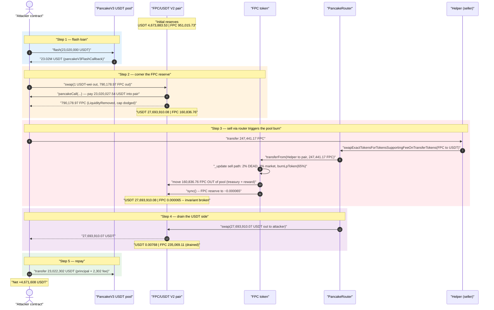
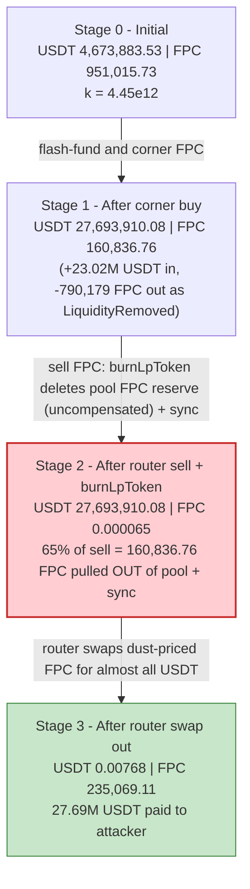
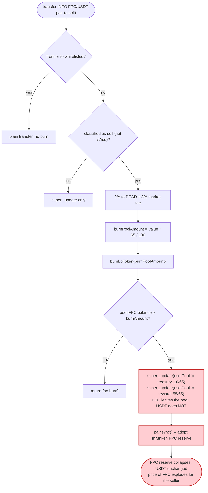

# FPC Token Exploit — Sell-Side `burnLpToken()` Drains the Pool's Own FPC Reserve

> **Vulnerability classes:** vuln/oracle/price-manipulation · vuln/logic/incorrect-order-of-operations · vuln/defi/slippage

> One-liner: FPC's transfer hook, on every sell, **moves 65% of the sold amount worth of FPC out of the AMM pair's balance** (to treasury/reward) and then `sync()`s the pair — deleting the pool's FPC reserve without removing any USDT, which detonates the constant-product price in the seller's favor.

> **Reproduction:** the PoC compiles & runs in an isolated Foundry project at
> [this project folder](.) (the umbrella DeFiHackLabs repo contains several unrelated PoCs that do not
> compile together, so this one was extracted). Full verbose trace: [output.txt](output.txt).
> Verified vulnerable source: [future_token.sol](sources/Token_B192D4/future_token.sol).

---

## Key info

| | |
|---|---|
| **Loss** | ~**4.67M USDT** (attacker net profit 4,671,608.07 USDT; reported headline ≈ $4.7M) |
| **Vulnerable contract** | `FPC` (`Token`) — [`0xB192D4A737430AA61CEA4Ce9bFb6432f7D42592F`](https://bscscan.com/address/0xb192d4a737430aa61cea4ce9bfb6432f7d42592f#code) |
| **Victim pool** | FPC/USDT PancakeSwap-V2 pair — [`0xa1e08E10Eb09857A8C6F2Ef6CCA297c1a081eD6B`](https://bscscan.com/address/0xa1e08E10Eb09857A8C6F2Ef6CCA297c1a081eD6B) (token0 = USDT, token1 = FPC) |
| **Flash-loan source** | PancakeV3 USDT pool `0x92b7807bF19b7DDdf89b706143896d05228f3121` |
| **Attacker EOA** | [`0x18dd258631b23777c101440380bf053c79db3d9d`](https://bscscan.com/address/0x18dd258631b23777c101440380bf053c79db3d9d) |
| **Attacker contract** | [`0xbf6e706d505e81ad1f73bbc0babfe2b414ba3eb3`](https://bscscan.com/address/0xbf6e706d505e81ad1f73bbc0babfe2b414ba3eb3) |
| **Attack tx** | [`0x3a9dd216fb6314c013fa8c4f85bfbbe0ed0a73209f54c57c1aab02ba989f5937`](https://bscscan.com/tx/0x3a9dd216fb6314c013fa8c4f85bfbbe0ed0a73209f54c57c1aab02ba989f5937) |
| **Chain / block / date** | BSC / 52,624,701 (forked at 52,624,700) / July 2025 |
| **Compiler** | Solidity v0.8.24, optimizer **on, 200 runs** |
| **Bug class** | Broken AMM invariant via an un-compensated, sell-triggered reserve burn (token-side liquidity deletion + `sync()`) |

---

## TL;DR

`FPC` is a "tax/deflation" token whose ERC-20 `_update` hook adds custom buy/sell logic. On a **sell**
(any transfer *into* the FPC/USDT pair that the token classifies as a sell), it calls
`burnLpToken(value * 65 / 100)` ([future_token.sol:165-166](sources/Token_B192D4/future_token.sol#L165-L166)).
`burnLpToken` does **not** burn the seller's tokens — it reaches into the **pool's own FPC balance**,
transfers `treasuryAmount` + `rewardAmount` (together = the full 65%) **out of the pair** to the
treasury/reward addresses, and then calls `pair.sync()`
([future_token.sol:202-215](sources/Token_B192D4/future_token.sol#L202-L215)).

That is an *un-compensated* removal of one side of the pool's reserves: FPC leaves the pair, **no USDT
leaves**, and `sync()` forces the pair to accept the shrunken FPC balance as its new reserve. The
constant product `k = USDT · FPC` collapses and the marginal price of FPC explodes. A seller who
arranges to be the one selling at that moment buys back almost the entire USDT reserve for a token that
the pool has just made artificially scarce.

The attacker, in a single flash-loaned transaction:

1. **Flash-borrows 23,020,000 USDT** from a PancakeV3 pool.
2. **Corners the pool's FPC** — pays the 23.02M USDT into the FPC/USDT V2 pair and pulls out ~790,179
   FPC (its near-entire FPC reserve) via a raw `pair.swap`. The pair is left USDT-heavy
   (27.69M USDT) and FPC-thin (160,837 FPC).
3. **Sells a slice of FPC back through the router** (`...SupportingFeeOnTransferTokens`). The FPC
   transfer into the pair triggers `burnLpToken`, which **deletes the pool's entire remaining FPC
   reserve** (160,837 FPC → ~0.000065 FPC) and `sync()`s.
4. The very same router swap then pays the attacker **27,693,910 USDT** for that FPC — almost the whole
   USDT reserve.
5. **Repays** 23.02M + 2,302 USDT fee and walks away with **4,671,608 USDT**.

---

## Background — what FPC does

`FPC` ([future_token.sol](sources/Token_B192D4/future_token.sol)) is a BSC ERC-20 (`Ownable`,
OpenZeppelin v5 `_update` override) that bolts AMM-aware buy/sell logic onto every transfer:

- **Whitelist bypass** — transfers where `from` or `to` is whitelisted skip all tax/burn logic
  ([:126-130](sources/Token_B192D4/future_token.sol#L126-L130)).
- **Buy / "remove liquidity" path** — transfers *out* of the pool. A genuine buy is capped at
  `maxBuyRate` (1% of the pool's FPC) and emits `Buy`; a transfer the token classifies as a liquidity
  *removal* skips that cap and just emits `LiquidityRemoved`
  ([:138-150](sources/Token_B192D4/future_token.sol#L138-L150)).
- **Sell / "add liquidity" path** — transfers *into* the pool. A genuine sell pays a 2% burn-to-DEAD,
  a 3% market fee, **and triggers `burnLpToken(value·65/100)`** before the residual `value` is moved
  ([:153-171](sources/Token_B192D4/future_token.sol#L153-L171)).
- **`burnLpToken`** — the core flaw: it removes FPC **from the pool** (`usdtPool`) and `sync()`s the
  pair ([:202-215](sources/Token_B192D4/future_token.sol#L202-L215)).

Whether a transfer is a buy/sell vs. an add/remove is decided by `_isLiquidity`
([:176-200](sources/Token_B192D4/future_token.sol#L176-L200)) by comparing the pair's live token
*balances* against its stored *reserves* — a comparison that is trivially manipulable mid-transaction.

On-chain state at the fork block (token0 = USDT, token1 = FPC), from the trace:

| Parameter | Value |
|---|---|
| `maxBuyRate` | 10 → buy cap = 1% of pool FPC |
| `lpBurnEnabled` | `true` (pool-burn active) |
| `marketAddress` / `treasuryAddress` / `rewardPoolAddress` | all `0x463C…f62A` |
| FPC/USDT pair USDT reserve (reserve0) | **4,673,883.53 USDT** |
| FPC/USDT pair FPC reserve (reserve1) | **951,015.73 FPC** |

---

## The vulnerable code

### 1. Every sell drains 65% from the pool, then `sync()`s

The sell branch of `_update` ([future_token.sol:153-171](sources/Token_B192D4/future_token.sol#L153-L171)):

```solidity
// sell || add poll usdt in front of
if (isPool[to] || isAdd) {
    require(sellState, "Sell not allowed");
    require(lastTradeBlock[from] + 3 < block.number, "Trade too frequently");
    if (!isAdd) {
        uint marketFee = (value * 3) / 100;
        uint burnAmount = 0;
        if (!_isLpStopBurn()) {
            burnAmount = (value * 2) / 100;
            super._update(from, DEAD, burnAmount);
        }
        super._update(from, marketAddress, marketFee);
        uint totalFee = marketFee + burnAmount;
        uint burnPoolAmount = (value * 65) / 100;   // ⚠️ 65% of the SELL VALUE
        burnLpToken(burnPoolAmount);                 // ⚠️ removed from the POOL, not the seller
        value -= totalFee;
        emit Sell(from, to, value, totalFee, burnAmount);
    }
    lastTradeBlock[from] = block.number;
}
```

```solidity
function burnLpToken(uint256 burnAmount) internal {
    if (_isLpStopBurn()) { return; }
    uint poolAmount = this.balanceOf(usdtPool);
    if (poolAmount > burnAmount) {
        uint256 treasuryAmount = (burnAmount * 10) / 65;          // 10/65 of the 65%
        super._update(usdtPool, treasuryAddress, treasuryAmount); // ⚠️ FPC OUT of the pool
        uint256 rewardAmount = (burnAmount * 55) / 65;            // 55/65 of the 65%
        super._update(usdtPool, rewardPoolAddress, rewardAmount); // ⚠️ FPC OUT of the pool
        IUniswapV2Pair(usdtPool).sync();                          // ⚠️ force-shrink the reserve
        emit PoolBurn(usdtPool, treasuryAmount, rewardAmount);
    }
}
```

The two `super._update(usdtPool, …)` calls move FPC **out of the pair's balance**, and the immediate
`pair.sync()` ([:212](sources/Token_B192D4/future_token.sol#L212)) tells the pair "your FPC reserve is
now this much smaller" — with **no matching USDT outflow**.

### 2. The buy-cap is dodged via the `isDel` (LiquidityRemoved) misclassification

`_isLiquidity` ([future_token.sol:176-200](sources/Token_B192D4/future_token.sol#L176-L200)) decides
buy-vs-remove by comparing the pair's *current balance* to its *stored reserve*:

```solidity
if (isPool[from]) {
    if (token0 == address(this) && balance1 < reserve1) {
        isDel = true;
    } else if (token1 == address(this) && balance0 < reserve0) {   // FPC is token1 here
        isDel = true;                                              // ⇒ treated as REMOVE
    }
}
```

In a raw `pair.swap` the pool transfers its tokens out **before** the K-check, so mid-call the pair's
USDT balance is momentarily below its USDT reserve → `isDel = true`. The attacker's 790,179-FPC
withdrawal is therefore routed through the `LiquidityRemoved` branch
([:142-143](sources/Token_B192D4/future_token.sol#L142-L143)) and **never hits the `maxBuyAmount` 1%
cap** ([:145](sources/Token_B192D4/future_token.sol#L145)) that a normal buy would. The trace confirms
it: a `LiquidityRemoved(…, 790,178.97 FPC)` event, not a `Buy`.

---

## Root cause — why it was possible

A Uniswap-V2/PancakeSwap pair prices assets *purely* from its reserves and enforces `x·y ≥ k` only
*inside `swap()`*. `sync()` exists so a pair can adopt its real token balances as reserves — it assumes
balances only change through mint/burn/swap or transfers the pair can reason about.

`burnLpToken` weaponizes that assumption:

> On **every sell**, it **transfers FPC out of the pair** (`super._update(usdtPool, treasury/reward, …)`)
> and then calls `pair.sync()`, declaring the pair's FPC reserve drastically smaller while leaving its
> USDT reserve untouched. `k` collapses and the FPC→USDT price explodes — and the entity executing the
> sell is the one who benefits from the new price.

Four design decisions compose into a critical bug:

1. **The "burn" comes from the pool, not the seller.** A deflation tax that destroys pool liquidity is a
   value transfer from LPs to whoever trades against the post-burn price.
2. **The burn fires on every ordinary sell** (no keeper gate, no per-swap cap), so an attacker simply has
   to *be the seller* at the moment the reserve is shrunk.
3. **The burn amount scales with the sell `value` (65%)**, not with the pool size — and is taken from the
   pool. After the attacker thins the pool's FPC reserve, a moderate sell makes the 65% burn equal to
   essentially the **whole** remaining FPC reserve, driving it to dust (≈ 0.000065 FPC).
4. **Balance-vs-reserve classification is manipulable.** Routing the initial FPC withdrawal through a raw
   `pair.swap` flips it to `isDel`, dodging the `maxBuyAmount` cap that would otherwise have limited how
   much FPC the attacker could corner in one shot.

Because the FPC's `_update` calls `super._update(usdtPool, …)` directly (not the pair's `burn()`), the
two reserves move independently — exactly the property an AMM must never expose.

---

## Preconditions

- `_isLpStopBurn()` must return `false` so the pool-burn is active
  ([:230-238](sources/Token_B192D4/future_token.sol#L230-L238)): `lpBurnEnabled == true` **and**
  circulating supply (total − DEAD) `≥ 2,100,000 FPC`. Both held at the fork block.
- `sellState == true` and the seller's `lastTradeBlock + 3 < block.number`
  ([:154-155](sources/Token_B192D4/future_token.sol#L154-L155)). The attacker sidesteps the frequency
  guard by **using two different addresses**: the attack contract is the *buyer* (step 2) and a freshly
  deployed `Helper` is the *seller* (step 3), so each has `lastTradeBlock == 0`.
- The attacker is **not** whitelisted (whitelisting would bypass the whole sell path); the deployed FPC
  whitelists only `this`, `DEAD`, and the mint address.
- Working capital in USDT to corner the pool — fully recovered intra-transaction, hence **flash-loanable**
  (the PoC borrows 23.02M USDT from a PancakeV3 pool and repays it in the same tx).

---

## Attack walkthrough (with on-chain numbers from the trace)

Pair `token0 = USDT (reserve0)`, `token1 = FPC (reserve1)`. All figures are taken directly from the
`Sync` / `Swap` / `Transfer` / `PoolBurn` events in [output.txt](output.txt).

| # | Step | USDT reserve | FPC reserve | Effect |
|---|------|-------------:|------------:|--------|
| 0 | **Initial** ([trace:1597](output.txt#L1597)) | 4,673,883.53 | 951,015.73 | Honest pool, `k ≈ 4.45e12`. |
| 1 | **Flash-borrow 23,020,000 USDT** from PancakeV3 pool ([trace:1581](output.txt#L1581)) | — | — | Working capital acquired. |
| 2 | **Corner buy** — raw `pair.swap(1 USDT-wei out, 790,178.97 FPC out)`; attacker pays its full 23,020,027.54 USDT into the pair in `pancakeCall` ([trace:1599-1639](output.txt#L1599)) | **27,693,910.08** | **160,836.76** | FPC pulled out as `LiquidityRemoved` (maxBuy cap dodged); pool now USDT-heavy, FPC-thin. |
| 3 | **Sell via router** — `Helper` sends 247,441.17 FPC into the pair (`swapExactTokensForTokensSupportingFeeOnTransferTokens`) ([trace:1671](output.txt#L1671)). FPC `_update`: −2% DEAD burn (4,948.82), −3% market fee (7,423.24), then **`burnLpToken(160,836.76 FPC)`** moves treasury 24,744.12 + reward 136,092.64 **out of the pool** and `sync()`s ([trace:1683-1698](output.txt#L1683)) | 27,693,910.08 | **0.000065** | ⚠️ **Invariant broken**: pool's FPC reserve annihilated, USDT untouched. |
| 4 | **Router completes the swap** — `pair.swap(27,693,910.07 USDT out → attacker)` against the dust FPC reserve ([trace:1716-1728](output.txt#L1716)) | **0.00768** | 235,069.11 | Almost the entire USDT reserve paid out for the sold FPC. |
| 5 | **Repay** 23,022,302 USDT (loan 23.02M + 2,302 fee) to the V3 pool ([trace:1736](output.txt#L1736)) | — | — | Flash loan closed. |
| 6 | **Profit** ([trace:1757](output.txt#L1757)) | — | — | Attacker holds **4,671,608.07 USDT**. |

**Why step 3 empties the pool:** at the start of the sell the pool held 160,836.76 FPC (step 2 result).
The sell's `burnPoolAmount = 65% × 247,441.17 = 160,836.76 FPC` — *exactly* the pool's entire FPC
reserve. `burnLpToken` moves all of it out (treasury 24,744.12 + reward 136,092.64) and `sync()`s, so the
pair's FPC reserve drops to ~65,000,000,000,002 wei ≈ **0.000065 FPC**. The router's subsequent
`getAmountOut` then sees a near-zero FPC reserve and a 27.69M USDT reserve, so the FPC just deposited buys
out essentially the whole USDT side.

### Profit accounting (USDT)

| Direction | Amount (USDT) |
|---|---:|
| Flash-loan in | 23,020,000.00 |
| USDT paid into pair (corner buy, incl. 27.54 pre-existing dust) | 23,020,027.54 |
| USDT received from router swap (step 4) | 27,693,910.07 |
| Flash-loan repayment (principal + fee) | −23,022,302.00 |
| Flash-loan fee component | 2,302.00 |
| **Attacker USDT before** | 26.54 |
| **Attacker USDT after** | **4,671,608.07** |
| **Net profit** | **≈ +4,671,581.53** |

The profit is, in essence, the pool's USDT reserve that the attacker injected during the corner buy and
then bought back at a price the protocol's own sell-burn had detonated — net of the burn/fee leakage and
the flash-loan fee.

---

## Diagrams

### Sequence of the attack



### Pool state evolution



### The flaw inside `_update` / `burnLpToken`



---

## Why each magic number

- **Flash loan = 23,020,000 USDT:** enough USDT to overwhelmingly outweigh the pool's 4.67M USDT reserve
  so the corner buy pulls out nearly the *entire* FPC reserve (790,179 of 951,016 FPC) in one raw
  `pair.swap`. The huge USDT injection is also what becomes withdrawable USDT after the burn.
- **`amount0Out = 1` USDT-wei in the corner swap:** the raw `pair.swap` only needs a non-zero output to
  pass the pair's input check while the attacker's USDT is paid in via `pancakeCall`; taking the FPC side
  (`amount1Out`) out as `getAmountsOut(...)[1]` maximizes the FPC cornered.
- **Sell amount = 247,441.17 FPC (via Helper):** sized so that `65% × 247,441.17 = 160,836.76 FPC`
  exactly equals the pool's remaining FPC reserve after step 2 — so `burnLpToken` removes the **entire**
  reserve and `sync()` drops it to dust, maximizing the price dislocation the router then trades against.
- **Separate `Helper` contract for the sell:** isolates the seller's `lastTradeBlock` from the buyer's, so
  the `lastTradeBlock + 3 < block.number` frequency guard ([:155](sources/Token_B192D4/future_token.sol#L155))
  never trips inside the single attack transaction.

---

## Remediation

1. **Never move tokens out of the liquidity pool from a transfer hook.** A token's tax/burn must only ever
   affect balances the protocol *owns* (the seller's balance, the contract's own balance, a treasury it
   funded). Delete the `super._update(usdtPool, …)` + `pair.sync()` logic in `burnLpToken` entirely. If
   "deflation reaching the pool" is a product requirement, implement it by the protocol *buying and
   burning from its own funds*, not by deleting one side of the pair's reserves.
2. **Do not `sync()` the pair after unilaterally changing its balance.** Any reserve adjustment must move
   *both* sides together (e.g. via the pair's own `burn()` LP redemption) so `k` is preserved.
3. **Don't derive trade classification (buy/sell/add/remove) from instantaneous balance-vs-reserve
   comparisons.** `_isLiquidity` is manipulable inside a raw `swap` (balances are mid-flight), which let
   the attacker dodge the `maxBuyAmount` cap. Use explicit add/remove entry points or an LP-token
   accounting check instead.
4. **Cap single-operation reserve impact.** An operation that can move a pool reserve by more than a few
   percent should revert; a 65%-of-sell burn that lands as ~100% of a thinned pool is the red flag here.
5. **Make the sell-burn independent of attacker-controlled pool state.** Because the burn is a fixed
   fraction of `value` *and* drawn from the pool, an attacker who thins the pool first turns a "tax" into a
   total reserve wipe. Tie any pool-side mechanic to TWAP/oracle pricing, not to the live, flash-loan-
   manipulable reserve.

---

## How to reproduce

The PoC was extracted into a standalone Foundry project (the umbrella DeFiHackLabs repo has several
unrelated PoCs that fail to compile under a whole-project `forge test` build):

```bash
_shared/run_poc.sh 2025-07-FPC_exp -vvvvv
```

- The PoC imports `../basetest.sol` (which pulls in `../tokenhelper.sol`); both were copied into the
  project root so the relative imports resolve. The exploit logic lives in
  [test/FPC_exp.sol](test/FPC_exp.sol).
- RPC: a **BSC archive** endpoint is required (fork block 52,624,700). `foundry.toml` uses
  `https://bsc-mainnet.public.blastapi.io`, which serves historical state at that block; most public BSC
  RPCs prune it and fail with `header not found` / `missing trie node`.
- Result: `[PASS] testExploit()` with the attacker's USDT balance rising from ~26.5 to ~4,671,608.

Expected tail:

```
[PASS] testExploit() (gas: 773008)
Logs:
  Attacker Before exploit USDT Balance: 26.542161622221038197
  Attacker After exploit USDT Balance: 4671608.069301815874558795

Suite result: ok. 1 passed; 0 failed; 0 skipped; finished in 12.72s
```

---

*Reference: TenArmor alert — https://x.com/TenArmorAlert/status/1940423393880244327 (FPC, BSC, ~$4.7M).*
