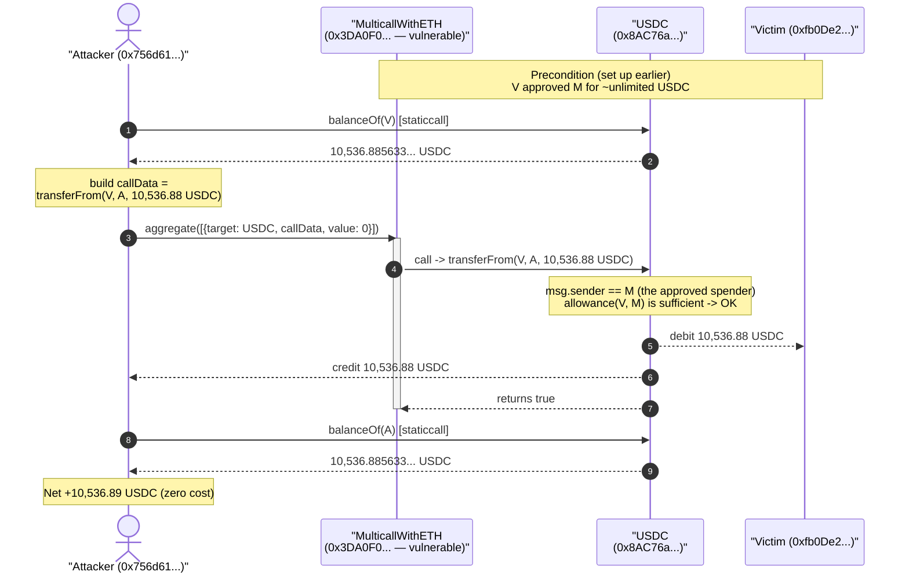
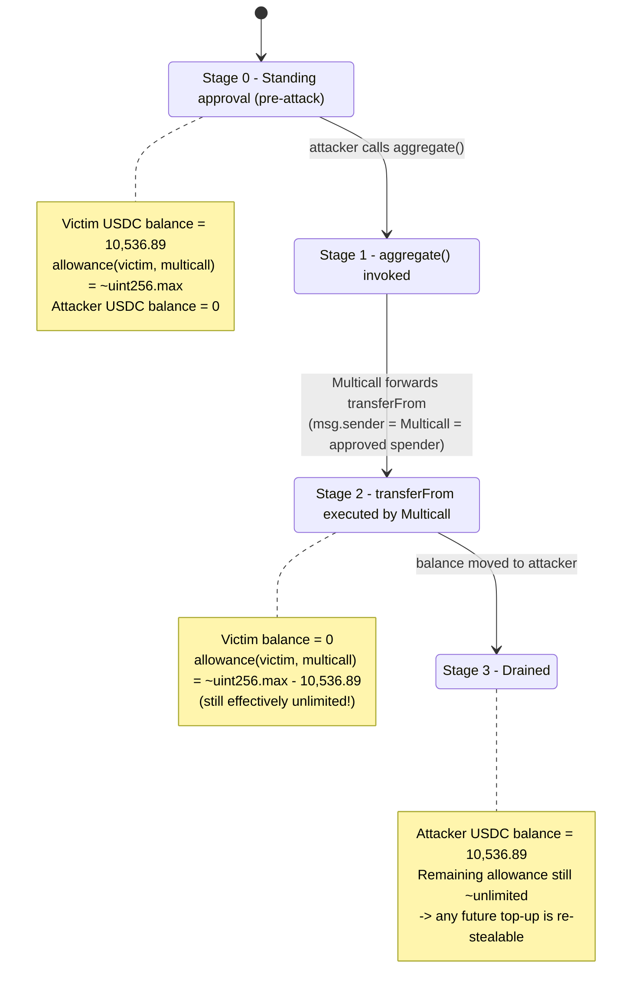
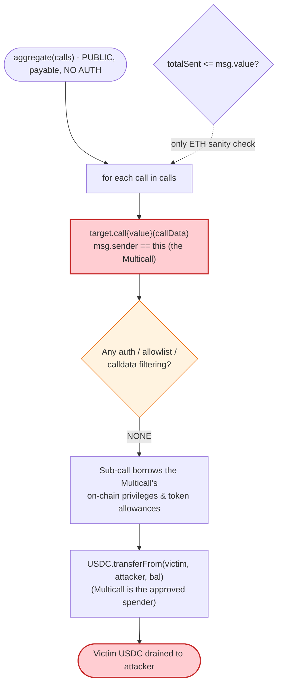

# MulticallWithETH Exploit — Arbitrary-Call `aggregate()` Drains an Unlimited USDC Approval

> **Vulnerability classes:** vuln/access-control/missing-auth · vuln/dependency/unsafe-external-call · vuln/logic/missing-allowance

> One-liner: a public, unauthenticated `aggregate()` multicall lets anyone make the contract
> execute `USDC.transferFrom(victim, attacker, balance)` against a victim who had granted the
> Multicall an unlimited USDC allowance — ~10,536 USDC stolen.

> **Reproduction:** the PoC compiles & runs in an isolated Foundry project at
> [this project folder](.) (the umbrella DeFiHackLabs repo contains many unrelated PoCs that do
> not whole-compile, so this one was extracted).
> Full verbose trace: [output.txt](output.txt).
> Verified vulnerable source: [contracts_MulticallWithETH.sol](sources/MulticallWithETH_3DA0F0/contracts_MulticallWithETH.sol).

---

## Key info

| | |
|---|---|
| **Loss** | ~10,536.89 USDC (`10,536,885,633,853,077,370,507` wei, 18-dec USDC on BSC) |
| **Vulnerable contract** | `MulticallWithETH` — [`0x3DA0F00d5c4E544924bC7282E18497C4A4c92046`](https://bscscan.com/address/0x3DA0F00d5c4E544924bC7282E18497C4A4c92046#code) |
| **Victim** | Approver / token holder — [`0xfb0De204791110Caa5535aeDf4E71dF5bA68A581`](https://bscscan.com/address/0xfb0De204791110Caa5535aeDf4E71dF5bA68A581) (had given the Multicall an ~unlimited USDC allowance) |
| **Drained asset** | USDC (BSC) — [`0x8AC76a51cc950d9822D68b83fE1Ad97B32Cd580d`](https://bscscan.com/address/0x8AC76a51cc950d9822D68b83fE1Ad97B32Cd580d) (proxy → impl `0xBA5Fe23f...`) |
| **Attacker EOA** | [`0x726fb298168c89d5dce9a578668ab156c7e7be67`](https://bscscan.com/address/0x726fb298168c89d5dce9a578668ab156c7e7be67) |
| **Attacker contract** | [`0x756d614e3d277baea260f64cc2ab9a3ac89877d3`](https://bscscan.com/address/0x756d614e3d277baea260f64cc2ab9a3ac89877d3) |
| **Attack tx** | [`0x6da7be6edf3176c7c4b15064937ee7148031f92a4b72043ae80a2b3403ab6302`](https://bscscan.com/tx/0x6da7be6edf3176c7c4b15064937ee7148031f92a4b72043ae80a2b3403ab6302) |
| **Chain / block / date** | BSC / 55,371,342 / July 2025 |
| **Compiler** | Solidity v0.8.20, optimizer **200 runs** |
| **Bug class** | Arbitrary external call / unauthenticated proxy-call (CWE-749 / "phantom approval drain") |

---

## TL;DR

`MulticallWithETH` is a generic, Multicall3-style batch executor. Its core function `aggregate()`
loops over a caller-supplied list of `(target, callData, value, allowFailure)` and **executes each
call verbatim from the contract's own address** ([contracts_MulticallWithETH.sol:17-35](sources/MulticallWithETH_3DA0F0/contracts_MulticallWithETH.sol#L17-L35)):

```solidity
(bool success, bytes memory ret) = calls[i].target.call{value: calls[i].value}(calls[i].callData);
```

There is **no access control, no allowlist of targets, and no restriction on the calldata.** This
means `msg.sender == MulticallWithETH` for every sub-call — so any privilege, allowance, or role that
anyone has ever granted *to the Multicall contract* is freely usable by **any** caller.

The victim `0xfb0De204...` had at some point approved the Multicall contract for an
(effectively) unlimited amount of USDC. The attacker simply asked the Multicall to call
`USDC.transferFrom(victim, attacker, victimBalance)` on its behalf. Because the Multicall *is* the
approved spender, the transfer succeeds and the victim's entire USDC balance (~10,536.89 USDC) lands
in the attacker's pocket. The whole exploit is a single `aggregate()` call with one sub-call.

---

## Background — what `MulticallWithETH` does

`MulticallWithETH` ([source](sources/MulticallWithETH_3DA0F0/contracts_MulticallWithETH.sol)) is a
small utility contract in the family of Multicall / Multicall3 batch routers. It exposes:

- **`aggregate(Call[] calls)`** ([:17-35](sources/MulticallWithETH_3DA0F0/contracts_MulticallWithETH.sol#L17-L35)) — `payable`; executes a batch of arbitrary calls,
  forwarding `value` to each, and reverts the whole batch if any non-`allowFailure` call fails.
  Selector `0xc9586258`.
- **`viewAggregate(Call[] calls)`** ([:37-46](sources/MulticallWithETH_3DA0F0/contracts_MulticallWithETH.sol#L37-L46)) — same idea but `staticcall` (read-only).
- **`getBalances(address[])`** ([:70-77](sources/MulticallWithETH_3DA0F0/contracts_MulticallWithETH.sol#L70-L77)) — a convenience native-balance reader.

The intended use of a multicall is to **batch the caller's own actions** in one transaction. The
fatal design assumption — never stated, never enforced — is that "the caller will only ask the
Multicall to do things the caller is allowed to do." But the EVM doesn't work that way: the sub-calls
execute as the **Multicall**, not as the caller. The contract is therefore a universal proxy for
*its own* on-chain privileges, handed to the public.

Why does the Multicall have any privileges at all? Because users (like the victim) gave it some.
Multicall-style routers frequently ask users to `approve(multicall, amount)` so the router can pull
tokens during a batch. Once that approval exists, an unauthenticated `aggregate()` turns it into a
free-for-all.

The on-chain facts at fork block 55,371,342:

| Fact | Value |
|---|---|
| Victim USDC balance | `10,536,885,633,853,077,370,507` wei = **10,536.885633853077370507 USDC** |
| Victim → Multicall USDC allowance (pre-attack) | ~unlimited (post-transfer remaining allowance ≈ `1.157e77`, i.e. `type(uint256).max − balance`) |
| `aggregate()` access control | **none** (any address) |
| Target/calldata restrictions | **none** |

That last block is the whole game: an unlimited allowance to a contract whose `aggregate()` is open
to everyone is equivalent to giving every address on the chain a blank `transferFrom` over your USDC.

---

## The vulnerable code

### The arbitrary-call loop

```solidity
function aggregate(Call[] calldata calls) external payable returns (Result[] memory returnData) {
    uint256 length = calls.length;
    returnData = new Result[](length);
    uint256 totalSent;

    for (uint256 i = 0; i < length; i++) {
        totalSent += calls[i].value;

        // ⚠️ Fully attacker-controlled target + calldata, executed as `msg.sender = this`.
        (bool success, bytes memory ret) = calls[i].target.call{value: calls[i].value}(calls[i].callData);

        if (!success && !calls[i].allowFailure) {
            revert(string(abi.encodePacked("Call failed at index ", uint2str(i))));
        }

        returnData[i] = Result(success, ret);
    }

    require(totalSent <= msg.value, "Insufficient msg.value"); // only sanity check — on ETH, not on auth
}
```
[contracts_MulticallWithETH.sol:17-35](sources/MulticallWithETH_3DA0F0/contracts_MulticallWithETH.sol#L17-L35)

The only validation anywhere in `aggregate()` is `require(totalSent <= msg.value)` — a check that the
batch doesn't try to spend more native ETH than the caller funded. There is:

- **No `onlyOwner` / role check** on the function.
- **No allowlist** for `calls[i].target`.
- **No filtering** of `calls[i].callData` (e.g. forbidding `transferFrom`/`approve`/`permit`
  selectors).
- **No notion of "on behalf of the caller"** — the sub-call carries the *Multicall's* identity, not
  the caller's, so the caller borrows the Multicall's allowances and roles.

That is the entire bug. Everything else in the contract (`uint2str`, `getBalances`,
`viewAggregate`) is irrelevant.

---

## Root cause — why it was possible

Two facts must both hold for the loss to occur:

1. **The Multicall executes arbitrary, caller-chosen calls with its own identity, with no
   authorization.** `msg.sender` inside the sub-call is the Multicall contract. So any allowance,
   role, ownership, or permission the Multicall has been granted is usable by anyone who calls
   `aggregate()`.
2. **A victim granted the Multicall a standing, unlimited USDC allowance.** ERC-20 `approve` is a
   blanket grant: it does not constrain *what* the spender does with the allowance, only the cap.
   Combined with (1), the cap is the only limit, and here it was effectively infinite.

The composition is the classic "phantom approval drain": a generic forwarder/multicall that holds
live token allowances becomes a public faucet. Concrete failures:

> - **Identity confusion.** The contract was written as if the caller's intent equals the caller's
>   authority. In the EVM, the *executing contract* supplies authority to its sub-calls. A multicall
>   that holds allowances must therefore treat itself as a privileged actor and gate `aggregate()`
>   accordingly — it didn't.
> - **Unlimited, non-expiring approval.** The victim approved `type(uint256).max` (the trace shows
>   the remaining allowance after the theft is `type(uint256).max − amount`). Even a correct
>   per-batch pull pattern is dangerous if the allowance survives between transactions; here it
>   survived indefinitely and was siphoned by a stranger.
> - **No reason for the Multicall to ever hold allowances.** A pure read/batch utility shouldn't
>   need users to approve it at all; the moment it does, every open `aggregate()` is a drain vector
>   for every approver.

---

## Preconditions

- A victim has an **outstanding ERC-20 allowance to the Multicall contract** (`USDC.allowance(victim,
  multicall) > 0`). In this incident the allowance was ~unlimited and the victim held ~10,536.89
  USDC.
- The victim still holds a non-zero balance of the approved token at attack time.
- `aggregate()` is publicly callable (it is — no auth).

No flash loan, no price manipulation, no special timing. The attack is a single transaction with a
single sub-call and can be executed by anyone, repeatedly, against *every* address that ever approved
the Multicall, for the full min(balance, allowance) each time.

---

## Step-by-step attack walkthrough (with on-chain numbers from the trace)

All figures are taken directly from [output.txt](output.txt).

| # | Step | Call | Value moved |
|---|------|------|------------:|
| 0 | **Read victim balance** | `USDC.balanceOf(0xfb0De204...)` (static) | reads `10,536.885633853077370507 USDC` |
| 1 | **Build one sub-call** | `data = transferFrom(victim=0xfb0De204..., to=attacker, amount=victimBalance)` (selector `0x23b872dd`) | — |
| 2 | **Invoke the multicall** | `MulticallWithETH.aggregate([{target: USDC, callData: data, value: 0, allowFailure: false}])` (selector `0xc9586258`) | — |
| 3 | **Multicall forwards the call** | `USDC.transferFrom(victim, attacker, 10,536.885…)` executes with `msg.sender == MulticallWithETH` (the approved spender) | **10,536.885633853077370507 USDC → attacker** |
| 4 | **Confirm** | `USDC.balanceOf(attacker)` (static) | `10,536.885633853077370507 USDC` |

In the trace, step 3 emits:

```
emit Transfer(from: 0xfb0De204..., to: attacker, value: 10536.885633853077370507e18)
emit Approval(owner: 0xfb0De204..., spender: 0x3DA0F00d..., value: 1.157e77)   // remaining allowance, ~unlimited
```

The `Approval` event's residual value (`≈ type(uint256).max − amount`) is the on-chain proof that the
victim's allowance to the Multicall was unlimited — the spender (`0x3DA0F00d...`) is exactly the
vulnerable Multicall, and after pulling the balance the remaining cap is still astronomically large.

### Profit / loss accounting (USDC)

| Party | Δ balance |
|---|---:|
| Victim `0xfb0De204...` | **−10,536.885633853077370507 USDC** |
| Attacker | **+10,536.885633853077370507 USDC** |

The attacker spent nothing (sub-call `value = 0`, only gas). The loss equals the victim's entire USDC
balance to the wei — a clean, complete drain of the approved position.

---

## Diagrams

### Sequence of the attack



### State evolution of the approval & balances



### The flaw inside `aggregate()`



---

## Remediation

1. **A multicall must never hold standing token allowances.** The safest fix is architectural:
   design batch flows so the Multicall never needs `approve(multicall, …)` from users (e.g. use
   `permit`-style single-tx approvals scoped to the exact pull, or have users transfer-in within the
   same batch they initiate). If the contract holds no allowances and owns no roles, an open
   `aggregate()` can steal nothing.
2. **If `aggregate()` must execute privileged sub-calls, authenticate it.** Restrict the function (or
   at least any path that can move funds) to the contract owner / a trusted relayer, or require the
   batch to be signed by the address whose assets are touched.
3. **Bind authority to the caller, not the contract.** Patterns like ERC-2771 meta-transactions or
   passing/verifying `msg.sender` through to the sub-call prevent the "borrow the forwarder's
   privileges" class of bug. A generic forwarder should only ever act with authority the *originating
   caller* possesses.
4. **Constrain targets and selectors.** If a fixed-purpose multicall is needed, allowlist the
   permitted `target` contracts and reject dangerous selectors (`transferFrom`, `approve`, `permit`,
   `setApprovalForAll`, `transferOwnership`, …) on caller-supplied calldata.
5. **Users: revoke unlimited approvals to utility contracts.** Set `allowance(multicall) = 0` for any
   contract you no longer actively batch through, and prefer exact-amount, short-lived approvals over
   `type(uint256).max`. Note that even after this drain the residual allowance was still unlimited —
   any later USDC deposited by the victim would be stealable again until the approval is revoked.

---

## How to reproduce

The PoC was extracted into a standalone Foundry project (the umbrella DeFiHackLabs repo has many
unrelated PoCs that fail to compile under a whole-project `forge build`):

```bash
_shared/run_poc.sh 2025-07-MulticallWithETH_exp -vvvvv
```

- RPC: a **BSC archive** endpoint is required (fork block 55,371,342). `foundry.toml` uses
  `https://bsc-mainnet.public.blastapi.io`, which serves historical state at that block; most public
  BSC RPCs prune it and fail with `header not found` / `missing trie node`.
- Result: `[PASS] testExploit()` with the post-attack balance log showing the drained USDC.

Expected tail:

```
Ran 1 test for test/MulticallWithETH_exp.sol:MulticallWithETH
[PASS] testExploit() (gas: 62713)
Logs:
  Balance after the attack: 10536.885633853077370507
```

---

*Reference: DeFiHackLabs 2025-07 — MulticallWithETH, BSC, ~10K USDC. SlowMist Hacked DB:
https://hacked.slowmist.io/*
