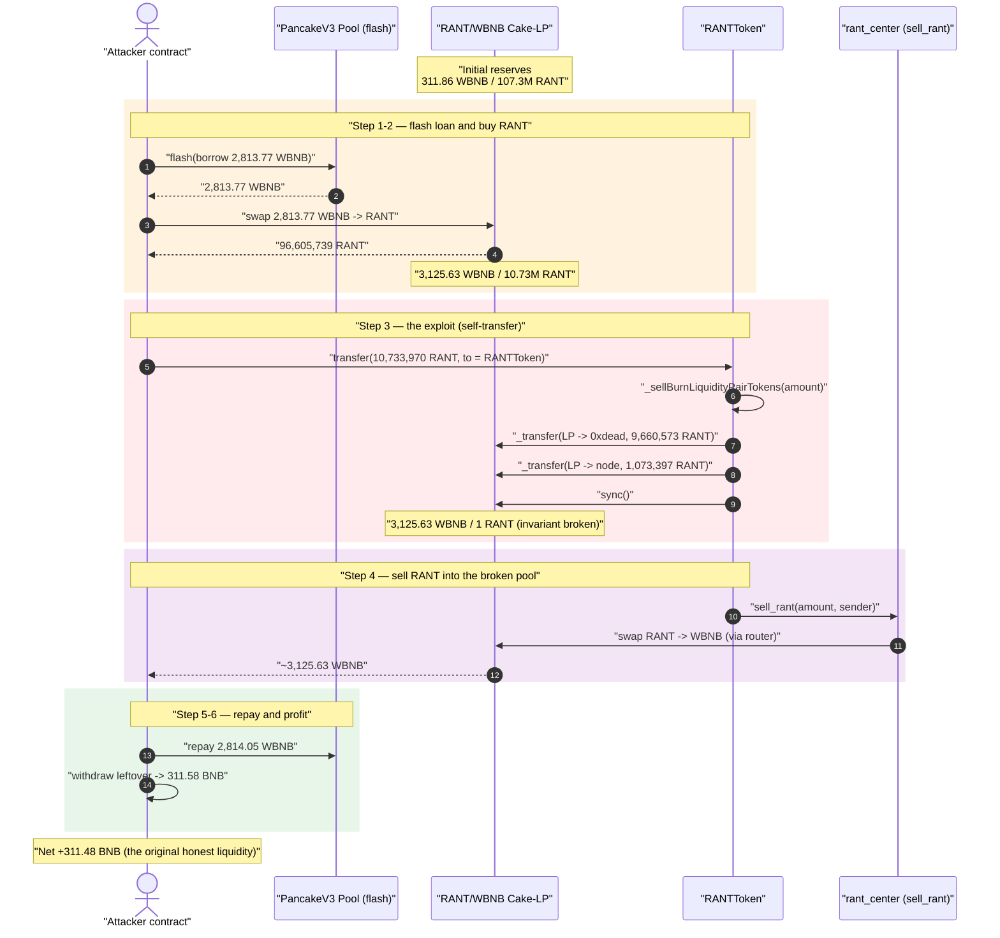
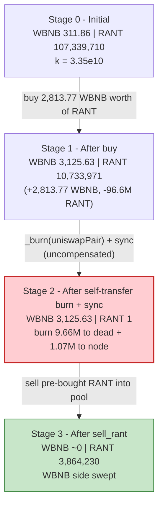
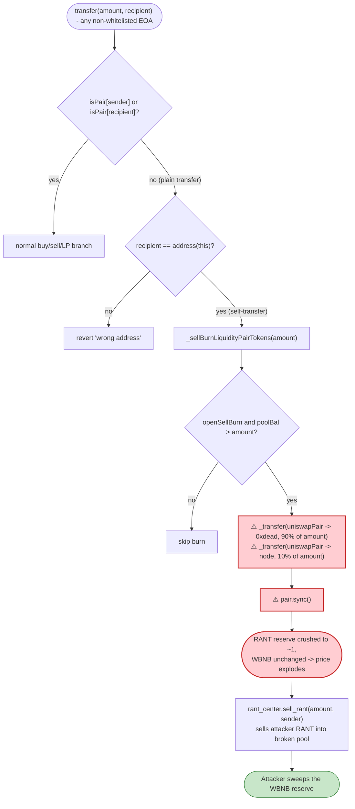
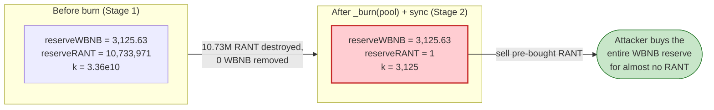

# RANT Token Exploit — Self-Transfer Triggers Un-compensated LP Reserve Burn

> **Reproduction:** the PoC compiles & runs in an isolated Foundry project at
> [this project folder](.) (the umbrella DeFiHackLabs repo contains many
> unrelated PoCs that do not whole-compile, so this one was extracted).
> Full verbose trace: [output.txt](output.txt).
> Verified vulnerable source: [contracts_TEST_RANT.sol](sources/RANTToken_c321AC/contracts_TEST_RANT.sol).

---

## Key info

| | |
|---|---|
| **Loss** | **~311.48 BNB** (~$190K at the time) drained from the RANT/WBNB PancakeSwap pair |
| **Vulnerable contract** | `RANTToken` — [`0xc321AC21A07B3d593B269AcdaCE69C3762CA2dd0`](https://bscscan.com/address/0xc321AC21A07B3d593B269AcdaCE69C3762CA2dd0#code) |
| **Victim pool** | RANT/WBNB Cake-LP pair — `0x42A93C3aF7Cb1BBc757dd2eC4977fd6D7916Ba1D` |
| **Attacker EOA** | [`0xad2cb8f48e74065a0b884af9c5a4ecbba101be23`](https://bscscan.com/address/0xad2cb8f48e74065a0b884af9c5a4ecbba101be23) |
| **Attacker contract** | [`0x1e2d48e640243b04a9fa76eb49080e9ab110b4ac`](https://bscscan.com/address/0x1e2d48e640243b04a9fa76eb49080e9ab110b4ac) |
| **Attack tx** | [`0x2d9c1a00cf3d2fda268d0d11794ad2956774b156355e16441d6edb9a448e5a99`](https://bscscan.com/tx/0x2d9c1a00cf3d2fda268d0d11794ad2956774b156355e16441d6edb9a448e5a99) |
| **Chain / block / date** | BSC / 52,974,381 / July 5, 2025 |
| **Compiler** | Solidity v0.8.20, optimizer **1 run** (source pragma `^0.8.10`) |
| **Bug class** | Broken AMM invariant via an un-compensated, self-transfer-triggered pool reserve burn (`_burn(uniswapPair, …)` + `pair.sync()`) |

---

## TL;DR

`RANTToken` is a "deflationary + auto-burn" meme token. Its `_transfer` override has a special
branch: when a **non-pair, non-whitelisted** address sends RANT *to the token contract itself*
(`recipient == address(this)`), the token runs `_sellBurnLiquidityPairTokens(amount)`
([contracts_TEST_RANT.sol:2045-2070](sources/RANTToken_c321AC/contracts_TEST_RANT.sol#L2045-L2070)).
That routine **destroys RANT directly out of the AMM pair's balance** —
90% to `0xdead` and 10% to a "node" contract — and then calls `pair.sync()`. No WBNB ever leaves
the pair. This is an *un-compensated* one-sided reserve deletion that **breaks the constant-product
invariant `x·y = k`** and re-prices RANT in the attacker's favor.

The attacker monetizes it in a single flash-loan transaction:

1. **Flash-borrow** 2,813.77 WBNB from a PancakeV3 BSC-USD/WBNB pool.
2. **Buy** the RANT pool down with that WBNB: swap 2,813.77 WBNB → 96,605,739 RANT. This already
   pulls most RANT out of the pool (reserves go `311.86 WBNB / 107.3M RANT` → `3,125.63 WBNB / 10.73M RANT`).
3. **Self-transfer** 10,733,970 RANT to the RANT contract. This fires `_sellBurnLiquidityPairTokens`,
   which burns ~9.66M RANT out of the pool to dead + 1.07M to the node, then `sync()`s — collapsing the
   pool's RANT reserve from **10.73M → 1 RANT** while the WBNB reserve stays at 3,125.63 WBNB.
4. The same call's `rant_center.sell_rant(...)` path then sells the attacker's remaining RANT through
   the router into the now-degenerate pool, pulling **3,125.63 WBNB** back out.
5. **Repay** the flash loan (2,814.05 WBNB) and keep the rest.

Net result: the attacker walks off with **311.48 BNB** of the pool's genuine WBNB liquidity (after a
courtesy `0.1 BNB` sent to a validator). Profit ≈ the pool's original WBNB depth.

---

## Background — what RANTToken does

`RANTToken` ([source](sources/RANTToken_c321AC/contracts_TEST_RANT.sol)) is an ERC20 (`_mint`s
`3.3e26` = 330,000,000 RANT in the constructor) with three bolted-on "tokenomics" features that all
manipulate the AMM pair's balances directly:

- **Auto-burn on every transfer** — `_autoBurnLiquidityPairTokens()`
  ([:2072-2102](sources/RANTToken_c321AC/contracts_TEST_RANT.sol#L2072-L2102)) deflates the pool by
  `burnRate` (17 bps) once per `timeLength` (1 hour) interval, using `super._transferSub(uniswapPair, …)`
  to subtract RANT straight from the pair.
- **Sell-burn on self-transfer** — `_sellBurnLiquidityPairTokens(amount)`
  ([:2045-2070](sources/RANTToken_c321AC/contracts_TEST_RANT.sol#L2045-L2070)) burns
  `burnToSellDeadRate` (90%) of the transferred amount out of the pair to `0xdead` and
  `burnToNoteRate` (10%) to `rant_node`, then `sync()`s.
- **A "center" router (`rant_center`)** — an upgradeable proxy
  ([`0x9AdB8c52…`](https://bscscan.com/address/0x9AdB8c52f0d845739Fd3e035Ed230F0D4cBa785a)) that
  actually executes buys/sells through PancakeRouter (`sell_rant`, `buyRant`, `takeToken`,
  `earnedToken`). RANT's own `balanceOf` is overloaded to add `rant_center.earnedToken(account)`
  ([:2024-2029](sources/RANTToken_c321AC/contracts_TEST_RANT.sol#L2024-L2029)).

Constructor parameters at deployment
([:1829-1858](sources/RANTToken_c321AC/contracts_TEST_RANT.sol#L1829-L1858)):

| Parameter | Value | Meaning |
|---|---|---|
| `totalSupply` | 330,000,000 RANT | minted to deployer |
| `burnRate` | 17 | auto-burn rate (bps) per interval |
| `burnToNoteRate` | 1000 | 10% of self-transfer amount → `rant_node` |
| `burnToSellDeadRate` | 9000 | **90% of self-transfer amount → `0xdead`, taken from the pool** |
| `minBurnAmount` | 3,300,000 ether | threshold above which the dead-burn applies |
| `timeLength` | 1 hour | burn interval |
| `openSellBurn` / `openBurn` | `true` / `true` | both burn paths enabled |

On-chain RANT/WBNB pool state at the fork block (from the trace's first `getReserves`,
[output.txt:1625](output.txt)):

| Reserve | Value |
|---|---|
| `reserve0` (WBNB) | **311.86 WBNB** ← the prize |
| `reserve1` (RANT) | 107,339,710 RANT |

---

## The vulnerable code

### 1. Sending RANT to the token itself triggers a pool burn

```solidity
function _transfer(address sender, address recipient, uint256 amount) internal virtual override {
    ...
    if (isPair[sender] || isPair[recipient]) {
        ... // normal buy / sell / add / remove-liquidity branches
    } else {
        // plain transfer
        if (!lockburn) { _autoBurnLiquidityPairTokens(); }

        if (!isWhiteList(sender) && !isWhiteList(recipient)) {
            require(recipient == address(this), "wrong address");   // ← only self-transfers allowed
            if (!lockburn) { _sellBurnLiquidityPairTokens(amount); }   // ⚠️ burns from the POOL
            if (!center_sell) {
                center_sell = true;
                super._transfer(sender, address(rant_center), amount);
                rant_center.sell_rant(amount, sender);                 // ← then sells the RANT out
                center_sell = false;
            }
        } else { ... }
    }
}
```
[contracts_TEST_RANT.sol:1866-1941](sources/RANTToken_c321AC/contracts_TEST_RANT.sol#L1866-L1941)

For an ordinary (non-pair) holder the *only* allowed destination is the token contract itself
(`require(recipient == address(this))`). That single self-transfer is enough to fire both the pool
burn and the router sell.

### 2. The sell-burn deletes RANT from the pair and `sync()`s

```solidity
function _sellBurnLiquidityPairTokens(uint256 _amount) internal isLock() returns (bool) {
    if (!openSellBurn) { return false; }
    uint256 liquidityPairBalance = this.balanceOf(uniswapPair);

    if (liquidityPairBalance > _amount) {
        (uint256 noteAmount, uint256 deadAmount) = caculateSellBurnToAmount(_amount); // 10% / 90%
        if (liquidityPairBalance > minBurnAmount) {
            super._transfer(uniswapPair, address(0xdead), deadAmount);  // ⚠️ pull 90% out of the pool
        }
        super._transfer(uniswapPair, address(rant_node), noteAmount);   // ⚠️ pull 10% out of the pool
        rant_node.depositBonusToken(noteAmount);
    } else {
        return false;
    }
    IUniswapV2Pair pair = IUniswapV2Pair(uniswapPair);
    pair.sync();                                                        // ⚠️ force reduced balance as reserve
    emit AutoSellNukeLP();
    return true;
}

function caculateSellBurnToAmount(uint256 _amount)
    public view returns (uint256 noteAmount, uint256 deadAmount)
{
    noteAmount = _amount.mul(burnToNoteRate).div(10000);      // 10%
    deadAmount = _amount.mul(burnToSellDeadRate).div(10000);  // 90%
}
```
[contracts_TEST_RANT.sol:2045-2070](sources/RANTToken_c321AC/contracts_TEST_RANT.sol#L2045-L2070),
[:2125-2130](sources/RANTToken_c321AC/contracts_TEST_RANT.sol#L2125-L2130)

`deadAmount` is **90% of the amount the user self-transferred**, and it is removed *from the pair's
balance* — not from the sender's. After the two `super._transfer`s, `pair.sync()` overwrites the
pair's reserves with the depleted balances, so the pool now believes it holds almost no RANT.

---

## Root cause — why it was possible

A Uniswap-V2 / PancakeSwap pair prices assets purely from its reserves and only enforces `x·y ≥ k`
*inside* `swap()`. `sync()` exists to let the pair reconcile its reserves with whatever its token
balances actually are — it trusts that balances change only through `mint`/`burn`/`swap`/legitimate
transfers it can reason about.

`_sellBurnLiquidityPairTokens` violates that trust directly:

> It **destroys RANT held by the pair** (`super._transfer(uniswapPair, 0xdead, deadAmount)` +
> `super._transfer(uniswapPair, rant_node, noteAmount)`) and then calls `pair.sync()`, telling the
> pair "your RANT reserve is now this much smaller." No WBNB leaves the pair. `k` collapses and the
> marginal price of RANT explodes — and the whole thing is **triggered by a permissionless
> self-transfer of attacker-supplied RANT.**

The composing design flaws:

1. **The burn amount scales with attacker input.** `deadAmount = 90% × _amount`, where `_amount` is a
   value the attacker chooses for their self-transfer. By sizing the self-transfer to ≈ the pool's
   current RANT reserve, the attacker forces the burn to wipe essentially the *entire* RANT side of
   the pool.
2. **Burning from the pool is a value transfer to the remaining RANT holder.** Removing RANT from the
   pair without removing WBNB shifts the WBNB side toward whoever can still sell RANT into it. The
   attacker, who just bought a large RANT position, is exactly that party.
3. **No swap-context guard on the pool burn.** The token has `lockburn`/`isLock()` reentrancy flags,
   but they do not prevent a *plain self-transfer* from invoking the pool burn — the self-transfer
   branch is reached precisely when `isPair[sender]` and `isPair[recipient]` are both false.
4. **The router sell happens in the same call, after the price has been manipulated.**
   `rant_center.sell_rant(amount, sender)` runs immediately after `sync()`, so the attacker's RANT is
   sold into the already-degenerate pool at the inflated WBNB price.

---

## Preconditions

- `openSellBurn == true` (set in constructor) so the dead-burn path executes.
- The pool's current RANT balance (`liquidityPairBalance`) must exceed both `_amount` and
  `minBurnAmount` (3.3M RANT) for the 90% dead-burn to fire — both hold after the attacker's initial
  buy leaves ~10.73M RANT in the pool.
- A non-whitelisted EOA/contract (the attacker) self-transferring RANT — fully permissionless.
- Working capital in WBNB to buy down the RANT pool. The peak outlay is the 2,813.77 WBNB flash loan,
  fully repaid intra-transaction — hence **flash-loanable**; the PoC sources it from a PancakeV3
  flash on the BSC-USD/WBNB pool.

---

## Attack walkthrough (with on-chain numbers from the trace)

The Cake-LP pair has `token0 = WBNB`, `token1 = RANT`, so `reserve0 = WBNB`, `reserve1 = RANT`.
All figures are taken directly from the `Sync`/`Swap`/`Transfer` events in [output.txt](output.txt).

| # | Step | WBNB reserve | RANT reserve | Effect |
|---|------|-------------:|-------------:|--------|
| 0 | **Initial pool** ([:1625](output.txt)) | 311.86 | 107,339,710 | Honest pool, ~$190K depth. |
| 1 | **Flash-borrow** 2,813.77 WBNB from PancakeV3 BSC-USD/WBNB pool ([:1597](output.txt)) | — | — | Attacker funded. |
| 2 | **Buy RANT** — swap 2,813.77 WBNB → 96,605,739 RANT on Cake-LP ([:1652](output.txt)) | 3,125.63 | 10,733,971 | RANT made scarce; attacker holds ~96.6M RANT. |
| 3 | **Self-transfer** 10,733,970 RANT → RANT contract ⇒ `_sellBurnLiquidityPairTokens` | | | Burn 9,660,573 RANT (90%) → `0xdead` ([:1687](output.txt)); 1,073,397 RANT (10%) → node ([:1688](output.txt)). |
| 3b | **`pair.sync()`** after the burn ([:1706](output.txt)) | 3,125.63 | **1** | ⚠️ **Invariant broken**: RANT reserve crushed to 1 wei-token, WBNB untouched. |
| 4 | **`sell_rant`** routes attacker RANT through PancakeRouter into the degenerate pool ([:1758](output.txt)) | ~0.0008 | 3,864,230 | Pool gives out 3,125.63 WBNB for the sell; WBNB reserve drained. |
| 5 | Attacker wraps proceeds, **repays flash loan** 2,814.05 WBNB ([:2353](output.txt)) | — | — | Loan + fee returned. |
| 6 | `withdraw` leftover WBNB → 311.58 BNB; send 0.1 BNB to validator; keep rest ([:2361-2370](output.txt)) | — | — | **Net +311.48 BNB.** |

**Why the burn is the whole game:** at Stage 2 the pool holds `3,125.63 WBNB / 10.73M RANT`
(price ≈ 0.00029 WBNB/RANT, `k ≈ 3.36e10`). The attacker's self-transfer of 10,733,970 RANT triggers
a 90% dead-burn of `9,660,573 RANT` plus a 10% node-burn of `1,073,397 RANT` **out of the pair**,
together removing essentially all 10.73M RANT. After `sync()` the pool reports `3,125.63 WBNB / 1
RANT` — the constant product collapses from `3.36e10` to ~`3,125`, and one RANT is now "worth" the
entire 3,125 WBNB reserve. The attacker's pre-bought RANT is then sold back through the router,
sweeping the WBNB.

### Profit / loss accounting (WBNB / BNB)

| Direction | Amount |
|---|---:|
| Borrowed — PancakeV3 flash loan | 2,813.77 WBNB |
| Repaid — flash loan + 0.01% fee ([:2377](output.txt) `paid1 = 0.2814 WBNB`) | 2,814.05 WBNB |
| WBNB recovered from the drained pool (attacker contract balance pre-repay) | ~3,125.63 WBNB |
| WBNB left after repay → withdrawn to BNB ([:2360](output.txt)) | 311.58 BNB |
| Sent to validator `BNBEve` ([:2368](output.txt)) | −0.10 BNB |
| **Net profit to attacker** ([:1565](output.txt) / [:2383](output.txt)) | **+311.48 BNB** |

The PoC's `balanceLog` confirms: `Attacker Before exploit BNB Balance: 0` →
`Attacker After exploit BNB Balance: 311.477265691407652863`.

---

## Diagrams

### Sequence of the attack



### Pool state evolution



### The flaw inside `_transfer` / `_sellBurnLiquidityPairTokens`



### Why the burn is theft: constant-product before vs. after



---

## Why each magic number

- **`borrowAmount = 2,813,769,505,544,453,342,436` (2,813.77 WBNB):** sized so the initial buy pulls
  the RANT pool from 107.3M RANT down to ~10.73M RANT, leaving the pool's RANT balance just above
  `minBurnAmount` (3.3M) and just below the planned self-transfer amount — so the 90% dead-burn fires
  and removes essentially the whole RANT reserve.
- **`swap(0, 96,605,739,642,631,517,916,080,650, …)` (96.6M RANT out):** the full RANT obtained for
  the borrowed WBNB; this is the attacker's ammunition for the later `sell_rant`.
- **`transfer(RANT, 10,733,970,071,403,501,990,675,973)` (10,733,970 RANT):** chosen ≈ the pool's RANT
  reserve after the buy, so `deadAmount = 90% = 9,660,573 RANT` + `noteAmount = 10% = 1,073,397 RANT`
  together consume nearly all of the pool's RANT, crushing `reserve1` to `1`.
- **`0.1 ether` to `BNBEve`:** a small tip to a validator (`0xD3b0d838…`), likely to encourage
  inclusion / private-mempool relay; cosmetic to the exploit.

---

## Remediation

1. **Never burn from the liquidity pool.** A burn must only destroy tokens the protocol *owns* (its
   own balance / a treasury). Removing the `super._transfer(uniswapPair, 0xdead, …)` /
   `super._transfer(uniswapPair, rant_node, …)` + `pair.sync()` from `_sellBurnLiquidityPairTokens`
   (and the analogous `super._transferSub(uniswapPair, …)` in `_autoBurnLiquidityPairTokens`)
   eliminates the bug entirely.
2. **Do not let user-supplied amounts size a pool burn.** `deadAmount = 90% × _amount` lets the
   attacker dictate how much of the pool to destroy. If a deflation mechanic is required, cap any
   single-operation pool impact to a tiny fraction of reserves and derive it from protocol state, not
   from a transferred amount.
3. **Make `sync()`-after-balance-mutation impossible to weaponize.** If a token must adjust pool
   balances, route it through the pair's own `burn()` (LP redemption) so *both* reserves move together
   and `k` is preserved — never one-sided.
4. **Remove the self-transfer side-channel.** Triggering pool-affecting logic from
   `recipient == address(this)` turns an ordinary transfer into a price-manipulation primitive. Such
   maintenance actions should be explicit, access-controlled functions, not implicit transfer
   side-effects.
5. **Block atomic manipulate-then-sell.** The exploit buys, burns the pool, and sells in one
   transaction. Guarding price-sensitive operations against same-block reserve swings (TWAP, per-block
   rate limits) removes the atomic profit path.

---

## How to reproduce

The PoC was extracted into a standalone Foundry project (the umbrella DeFiHackLabs repo has many
unrelated PoCs that fail to whole-compile under `forge test`):

```bash
_shared/run_poc.sh 2025-07-RANTToken_exp -vvvvv
```

- RPC: a **BSC archive** endpoint is required (the fork block 52,974,381 is historical).
  `foundry.toml` uses `https://bsc-mainnet.public.blastapi.io`, which serves historical state at that
  block; most public BSC RPCs prune it and fail with `header not found` / `missing trie node`.
- Result: `[PASS] testExploit()` with `Attacker After exploit BNB Balance: 311.477…`.

Expected tail:

```
Ran 1 test for test/RANTToken_exp.sol:RANTToken_exp
[PASS] testExploit() (gas: 1872172)
  Attacker Before exploit BNB Balance: 0.000000000000000000
  Attacker After exploit BNB Balance: 311.477265691407652863

Suite result: ok. 1 passed; 0 failed; 0 skipped
```

---

*References: Phalcon — https://x.com/Phalcon_xyz/status/1941788315549946225 ; AgentLISA —
https://x.com/AgentLISA_ai/status/1942162643437203531 . Verified RANTToken source:
[contracts_TEST_RANT.sol](sources/RANTToken_c321AC/contracts_TEST_RANT.sol).*
