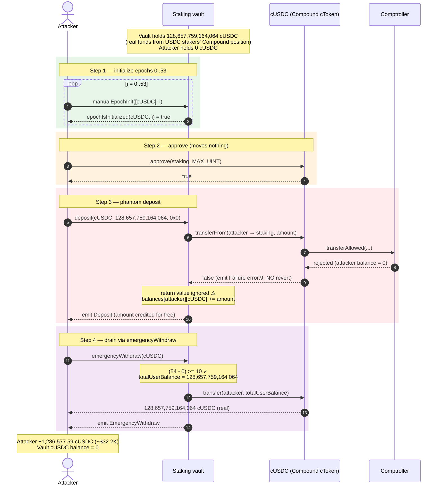
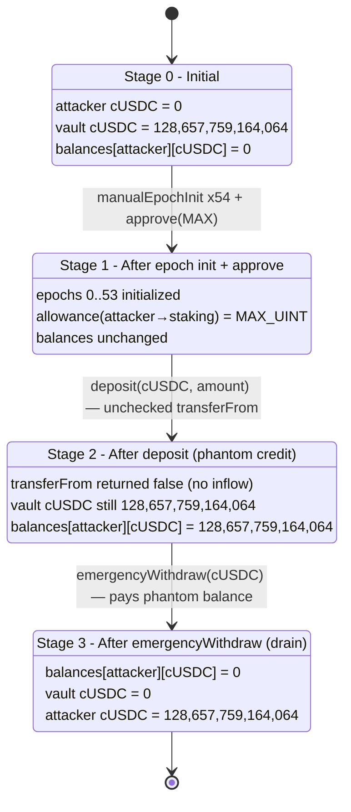
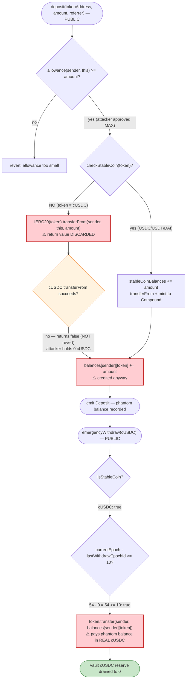

# SWAPP Staking Exploit — Unchecked `transferFrom` Return Value Lets a Free `deposit` Mint Staking Balance, Then `emergencyWithdraw` Drains the Vault

> **Vulnerability classes:** vuln/dependency/unchecked-return-value · vuln/logic/state-update

> **Reproduction:** the PoC compiles & runs in an isolated Foundry project at
> [this project folder](.) (the umbrella DeFiHackLabs repo
> contains many unrelated PoCs that do not compile together, so this one was extracted).
> Full verbose trace: [output.txt](output.txt).
> Verified vulnerable source: [sources/Staking_245a55/extracted/Staking.sol](sources/Staking_245a55/extracted/Staking.sol).

---

## Key info

| | |
|---|---|
| **Loss** | ~$32,196.28 — **1,286,577.59 cUSDC** (raw `128,657,759,164,064`, 8 decimals) drained from the Staking vault |
| **Vulnerable contract** | `Staking` — [`0x245a551ee0F55005e510B239c917fA34b41B3461`](https://etherscan.io/address/0x245a551ee0f55005e510b239c917fa34b41b3461#code) |
| **Victim / pool** | The Staking vault's own cUSDC balance (cUSDC = Compound `cUSDC`, `0x39AA39c021dfbaE8faC545936693aC917d5E7563`) |
| **Attacker EOA** | [`0x657a2b6fe37ced2f31fd7513095dbfb126a53601`](https://etherscan.io/address/0x657a2b6fe37ced2f31fd7513095dbfb126a53601) |
| **Attacker contract** | [`0x7f1f536223d6a84ad4897a675f04886ce1c3b7a1`](https://etherscan.io/address/0x7f1f536223d6a84ad4897a675f04886ce1c3b7a1) |
| **Attack tx** | [`0xa02b159fb438c8f0fb2a8d90bc70d8b2273d06b55920b26f637cab072b7a0e3e`](https://app.blocksec.com/explorer/tx/eth/0xa02b159fb438c8f0fb2a8d90bc70d8b2273d06b55920b26f637cab072b7a0e3e) |
| **Chain / block / date** | Ethereum mainnet / 22,957,532 / 2025-07-20 (`block.timestamp` 1752979811) |
| **Compiler** | Vulnerable contract: Solidity **v0.7.6**, optimizer **200 runs** |
| **Bug class** | Unchecked low-level token `transferFrom` return value + non-reverting Compound cToken transfers → phantom credit / accounting desync |

---

## TL;DR

`Staking.deposit()` accepts an arbitrary `tokenAddress`. For any token that is **not** one of the three
hard-coded stablecoins (USDC/USDT/DAI), it takes the "else" branch and calls
`IERC20(tokenAddress).transferFrom(msg.sender, address(this), amount)` **without checking the boolean
return value** ([Staking.sol:128-130](sources/Staking_245a55/extracted/Staking.sol#L128-L130)). It then
unconditionally credits the caller: `balances[msg.sender][tokenAddress] += amount`
([Staking.sol:136](sources/Staking_245a55/extracted/Staking.sol#L136)).

Compound's `cUSDC` (a cToken) is **not** a standard ERC20: its `transferFrom` runs through the
Comptroller's `transferAllowed` policy hook and, when the transfer is disallowed, **returns `false` and
emits a `Failure` event instead of reverting**. The attacker held **0** cUSDC, so the transfer moved
nothing and returned `false` — yet `deposit()` ignored that and credited the attacker a staking balance of
`128,657,759,164,064` cUSDC out of thin air.

With a non-zero staking balance recorded for a non-stablecoin token, the attacker then called the
permissionless `emergencyWithdraw(cUSDC)`
([Staking.sol:487-501](sources/Staking_245a55/extracted/Staking.sol#L487-L501)), whose only timing guard —
`(getCurrentEpoch() - lastWithdrawEpochId[cUSDC]) >= 10` — was trivially satisfied (current epoch `54`,
`lastWithdrawEpochId[cUSDC] == 0`). `emergencyWithdraw` paid out the attacker's **entire recorded balance**
in real cUSDC — the genuine cUSDC that the vault had previously deposited into Compound on behalf of its
real stablecoin stakers.

Net result: the attacker walked off with the vault's full `1,286,577.59 cUSDC` (~$32.2K) having spent
**nothing** but gas.

---

## Background — what SWAPP Staking does

`Staking` ([source](sources/Staking_245a55/extracted/Staking.sol)) is a BarnBridge-style epoch staking
vault. Real users stake one of three supported stablecoins (USDC, USDT, DAI) and the vault forwards those
deposits into **Compound** to earn interest:

- **Stablecoin deposits go to Compound.** In `deposit()`, when `checkStableCoin(tokenAddress)` is true, the
  vault records `stableCoinBalances[token] += amount`, pulls the stablecoin with `transferFrom`, then calls
  `_transferToCompound()` which `mint`s the matching cToken
  ([Staking.sol:119-127](sources/Staking_245a55/extracted/Staking.sol#L119-L127),
  [:259-263](sources/Staking_245a55/extracted/Staking.sol#L259-L263)). So the vault accumulates real
  **cUSDC / cUSDT / cDAI** in its own balance.
- **Epoch accounting.** Each token tracks per-epoch pool sizes and per-user checkpoints
  (`poolSize`, `balanceCheckpoints`) for reward weighting. Epochs are 28 days
  ([Staking.sol:91-92](sources/Staking_245a55/extracted/Staking.sol#L91-L92)); anyone can pre-initialize a
  past epoch with `manualEpochInit` ([:466-485](sources/Staking_245a55/extracted/Staking.sol#L466-L485)).
- **Two withdraw paths.** Normal `withdraw()` redeems from Compound and returns the underlying stablecoin
  ([:363-459](sources/Staking_245a55/extracted/Staking.sol#L363-L459)). A separate
  `emergencyWithdraw(token)` exists for **non-stablecoin** tokens and simply transfers the user's recorded
  balance back, gated only by a 10-epoch timer
  ([:487-501](sources/Staking_245a55/extracted/Staking.sol#L487-L501)).

The on-chain state at the fork block:

| Fact | Value |
|---|---|
| `getCurrentEpoch()` | **54** |
| `lastWithdrawEpochId[cUSDC]` | **0** (never set — cUSDC isn't a normal withdraw token) |
| Attacker's cUSDC balance | **0** |
| cUSDC held by the Staking vault | **128,657,759,164,064** (`1,286,577.59` cUSDC ≈ $32.2K) ← the prize |
| `epochIsInitialized(cUSDC, 0)` | **false** at start (attacker initializes it) |

The vault holds a large cUSDC balance because it deposited its real USDC stakers' funds into Compound. The
exploit lets the attacker mint a *claim* against that cUSDC for free.

---

## The vulnerable code

### 1. `deposit()` — non-stablecoin branch ignores the `transferFrom` return value, then credits balance

```solidity
function deposit(address tokenAddress, uint256 amount, address referrer) public nonReentrant {
    require(amount > 0, "Staking: Amount must be > 0");
    bool isStableCoin = checkStableCoin(tokenAddress);

    require(IERC20(tokenAddress).allowance(msg.sender, address(this)) >= amount, "Staking: Token allowance too small");

    if (isStableCoin) {
        stableCoinBalances[tokenAddress] = stableCoinBalances[tokenAddress].add(amount);
        ...
        _transferToCompound(tokenAddress, amount);
    } else {
        IERC20(tokenAddress).transferFrom(msg.sender, address(this), amount);   // ⚠️ return value ignored
    }
    ...
    balances[msg.sender][tokenAddress] = balances[msg.sender][tokenAddress].add(amount);   // ⚠️ credited regardless
    ...
    emit Deposit(msg.sender, tokenAddress, amount);
}
```

([Staking.sol:113-217](sources/Staking_245a55/extracted/Staking.sol#L113-L217))

Two compounding problems:

1. **The return value of `transferFrom` is discarded** ([:129](sources/Staking_245a55/extracted/Staking.sol#L129)).
   A standard ERC20 would revert on a failed transfer, masking the bug — but cUSDC does not.
2. **The accounting credit at [:136](sources/Staking_245a55/extracted/Staking.sol#L136) is unconditional.**
   It runs even if zero tokens actually arrived. There is no balance-delta check
   (`balanceAfter - balanceBefore`) to verify the transfer.

The `require` at [:117](sources/Staking_245a55/extracted/Staking.sol#L117) only checks **allowance**, not
that the caller actually owns or successfully transfers any tokens — the attacker simply
`approve(staking, MAX_UINT)` on cUSDC (which always succeeds) to clear it.

### 2. Why cUSDC's `transferFrom` returns `false` instead of reverting

cUSDC is a Compound v2 `CErc20` cToken. Its `transferFrom` calls the Comptroller's `transferAllowed`
policy hook; on a disallowed transfer it returns a Compound error code and the cToken returns `false`
without reverting. In the trace, the attacker's deposit transfer fails this way:

```
├─ [71612] CErc20::transferFrom(SWAPPStakingExp, Staking, 128657759164064)
│   ├─ [58194] Unitroller::fallback(... transferAllowed ...)   // policy hook
│   │   ├─ ... balanceOf(SWAPPStakingExp) => 0                  // attacker has no cUSDC
│   ├─ emit Failure(error: 9, info: 76, detail: 0)              // ⚠️ FAILS but does NOT revert
│   └─ ← [Return] false                                         // ⚠️ returns false
```

`error: 9` is Compound's `COMPTROLLER_REJECTION`. The cToken returns `false`; `deposit()` never looks at
it. Standard ERC20 audit lore — *"always check the boolean return of `transfer`/`transferFrom`, or use
`SafeERC20`"* — is exactly the rule the non-stablecoin branch breaks. (Ironically, the contract
**imports and uses** `SafeERC20` for its Compound `safeApprove` calls
([:15](sources/Staking_245a55/extracted/Staking.sol#L15),
[:261](sources/Staking_245a55/extracted/Staking.sol#L261)) — but not for the user `transferFrom` in the
arbitrary-token branch.)

### 3. `emergencyWithdraw()` — pays out the phantom balance with real tokens

```solidity
function emergencyWithdraw(address tokenAddress) public {
    bool isStableCoin = checkStableCoin(tokenAddress);
    require(!isStableCoin, "Cant withdraw stable coins");                           // cUSDC passes (not a stablecoin)
    require((getCurrentEpoch() - lastWithdrawEpochId[tokenAddress]) >= 10,
            "At least 10 epochs must pass without success");                        // (54 - 0) >= 10 ✓

    uint256 totalUserBalance = balances[msg.sender][tokenAddress];                  // == 128,657,759,164,064 (phantom)
    require(totalUserBalance > 0, "Amount must be > 0");

    balances[msg.sender][tokenAddress] = 0;

    IERC20 token = IERC20(tokenAddress);
    token.transfer(msg.sender, totalUserBalance);                                   // ⚠️ pays out the vault's real cUSDC

    emit EmergencyWithdraw(msg.sender, tokenAddress, totalUserBalance);
}
```

([Staking.sol:487-501](sources/Staking_245a55/extracted/Staking.sol#L487-L501))

`emergencyWithdraw` was meant as a rescue path for arbitrary (non-stablecoin) tokens that get stuck. But it
blindly trusts `balances[msg.sender][tokenAddress]` — which `deposit()` just inflated for free — and pays
it out in **whatever real cUSDC the contract holds**. The 10-epoch timer (`lastWithdrawEpochId[cUSDC]`
defaulting to `0`) is no obstacle: it's been 54 epochs.

---

## Root cause — why it was possible

The attack is the composition of three independent design defects:

1. **Unchecked `transferFrom` return value in the arbitrary-token branch**
   ([:129](sources/Staking_245a55/extracted/Staking.sol#L129)). The credit to `balances`
   ([:136](sources/Staking_245a55/extracted/Staking.sol#L136)) happens unconditionally, with no
   before/after balance verification. For a token that *reverts* on failure this would be merely
   redundant; for a token that *returns false* (cUSDC) it is a free mint of internal balance.

2. **`deposit()` accepts an arbitrary `tokenAddress`** with no allow-list. The whole stablecoin/Compound
   design only makes sense for USDC/USDT/DAI, yet the function happily records balances for any address —
   including `cUSDC`, a token the vault holds a large amount of for unrelated reasons (its Compound
   position). The "non-stablecoin" branch was presumably intended for the `wbtcSwappLP` token, but nothing
   restricts the input to it.

3. **`emergencyWithdraw` pays out internal balance in real tokens with no solvency or provenance check.**
   It assumes `balances[user][token]` was only ever incremented by genuine inflows, and its only guard is a
   coarse 10-epoch timer that the never-initialized `lastWithdrawEpochId[cUSDC]` makes vacuous.

Put together: the attacker chooses `cUSDC` as the "non-stablecoin," deposits a balance equal to the vault's
cUSDC holdings (the transfer silently no-ops), then emergency-withdraws that balance in the vault's real
cUSDC. No capital, no flash loan, no price manipulation — just an accounting lie the contract believed.

---

## Preconditions

- The vault holds a meaningful balance of some **non-stablecoin** token whose `transferFrom` **returns
  `false` instead of reverting** on failure. Here that token is **cUSDC**, accumulated from real
  stablecoin stakers' Compound deposits. (Any Compound cToken, or any ERC20 with non-reverting
  transfer-failure semantics, qualifies.)
- `deposit()`'s non-stablecoin branch is reachable for that token (it is — no allow-list).
- For `emergencyWithdraw`: the token is not a stablecoin (cUSDC ✓), and
  `getCurrentEpoch() - lastWithdrawEpochId[token] >= 10`. With `lastWithdrawEpochId[cUSDC] == 0` and current
  epoch 54, this is trivially true.
- `deposit()` requires the current epoch's pool to be initialized; the attacker satisfies this by
  `manualEpochInit`-ing epochs `0..53` first (`epochIsInitialized(cUSDC, 0)` must become true so the
  internal `manualEpochInit(currentEpoch)` chain succeeds).
- The attacker must clear the allowance `require` — done with a single `cUSDC.approve(staking, MAX_UINT)`,
  which always succeeds and moves nothing.

No working capital is required (the attacker held 0 cUSDC throughout); the entire exploit costs only gas.

---

## Attack walkthrough (with on-chain numbers from the trace)

All figures are taken directly from [output.txt](output.txt). Amounts are in raw cUSDC units (8 decimals);
`128,657,759,164,064` raw = `1,286,577.59` cUSDC ≈ $32,196.28.

| # | Step | Call | Result / state change |
|---|------|------|----------------------|
| 0 | **Initial** | `getCurrentEpoch()` | `54`; attacker cUSDC balance `0`; vault cUSDC balance `128,657,759,164,064`. |
| 1 | **Initialize epochs** | `manualEpochInit([cUSDC], i)` for `i = 0..53` (54 calls) | `epochIsInitialized(cUSDC, 0..53) = true`. Makes `deposit`'s internal epoch-init chain succeed. |
| 2 | **Approve** | `cUSDC.approve(staking, MAX_UINT)` | Allowance set to `1.157e77`; clears the allowance `require`. Moves 0 tokens. |
| 3 | **Phantom deposit** | `staking.deposit(cUSDC, 128_657_759_164_064, address(0))` | Inner `cUSDC.transferFrom(attacker → staking)` → Comptroller `transferAllowed` rejects (`Failure error:9`), returns **`false`** (no revert). `deposit` ignores it and sets `balances[attacker][cUSDC] = 128,657,759,164,064`. Emits `Deposit`. Vault cUSDC balance **unchanged** (`128,657,759,164,064`). |
| 4 | **Drain** | `staking.emergencyWithdraw(cUSDC)` | `(54 - 0) >= 10` ✓; `totalUserBalance = 128,657,759,164,064`; `balances[attacker][cUSDC] = 0`; `cUSDC.transfer(attacker, 128,657,759,164,064)` succeeds. Emits `EmergencyWithdraw`. |
| 5 | **Result** | `cUSDC.balanceOf(attacker)` / `cUSDC.balanceOf(staking)` | Attacker: **`128,657,759,164,064`** (was 0). Vault: **`0`** (was `128,657,759,164,064`). |

Step 3's deposit credited a balance with **no corresponding inflow** — the smoking gun is the
`Failure(error: 9, ...)` event followed by `transferFrom → false`, with the vault's cUSDC balance reading
`128,657,759,164,064` both before and after the `transferFrom`. Step 4 then pays that phantom balance out
of the vault's genuine cUSDC.

> Note: the PoC's final line `cUsdc.transfer(address(this), staking_cusdc_balance)` is a no-op self-transfer
> by the attacker to itself; in the trace it actually fails Compound's `transferAllowed` (`Failure error:2`)
> and returns `false`, leaving the already-stolen `128,657,759,164,064` cUSDC in the attacker's possession.
> The theft is fully realized at step 4.

### Profit / loss accounting

| Party | Asset | Before | After | Delta |
|---|---|---:|---:|---:|
| **Attacker** | cUSDC (raw) | 0 | 128,657,759,164,064 | **+128,657,759,164,064** |
| **Attacker** | cUSDC (tokens) | 0 | 1,286,577.59 | **+1,286,577.59** |
| **Attacker** | USD value | $0 | ≈ $32,196.28 | **+$32,196.28** |
| **Staking vault** | cUSDC (raw) | 128,657,759,164,064 | 0 | **−128,657,759,164,064** |
| **Attacker cost** | ETH | — | — | gas only (no capital) |

The cUSDC→USD value uses the prevailing Compound exchange rate (≈ `0.025` USDC underlying per cUSDC at the
fork block), which reconciles `1,286,577.59 cUSDC × 0.025 ≈ $32,196.28` — matching the reported loss to the
cent.

---

## Diagrams

### Sequence of the attack



### Vault state evolution



### The flaw inside `deposit` / `emergencyWithdraw`



---

## Why each step is needed

- **`manualEpochInit(0..53)`:** `deposit()` internally requires the current epoch's pool to be initialized,
  and `manualEpochInit(epochId)` requires `epochId - 1` to already be initialized
  ([:476-477](sources/Staking_245a55/extracted/Staking.sol#L476-L477)). The attacker must walk the chain
  from epoch 0 up to 53 so the `deposit`-triggered `manualEpochInit(54)` succeeds. Pure bookkeeping — it
  unlocks the vulnerable code path, it is not itself the bug.
- **`approve(staking, MAX_UINT)`:** the only real gate in `deposit` is the *allowance* check
  ([:117](sources/Staking_245a55/extracted/Staking.sol#L117)). cUSDC's `approve` always succeeds and moves
  no tokens, so a single max-approval clears it.
- **`deposit(cUSDC, vaultBalance, 0x0)`:** chooses `cUSDC` as the "non-stablecoin," sizing the amount to the
  vault's entire cUSDC holdings. The `transferFrom` silently no-ops (attacker has 0 cUSDC) but the balance
  is credited regardless.
- **`emergencyWithdraw(cUSDC)`:** converts the phantom internal balance into the vault's real cUSDC. Chosen
  over `withdraw()` because `withdraw()` would try to `redeemUnderlying` from Compound against
  `stableCoinBalances` accounting that cUSDC never touched; `emergencyWithdraw` just does a raw
  `token.transfer` of the recorded balance.

---

## Remediation

1. **Check the return value of every token transfer — use `SafeERC20`.** The arbitrary-token branch in
   `deposit()` ([:129](sources/Staking_245a55/extracted/Staking.sol#L129)) must use
   `IERC20(token).safeTransferFrom(...)` (the contract already imports `SafeERC20`). This makes a failed
   transfer revert, so no balance is ever credited without a real inflow.
2. **Credit balance from the *measured* inflow, not the requested `amount`.** Record
   `received = balanceAfter - balanceBefore` around the transfer and credit `received`. This is robust even
   against fee-on-transfer or non-standard tokens and would have credited `0` here.
3. **Restrict `deposit()` to an explicit allow-list of supported tokens.** The protocol only ever intended
   to handle USDC/USDT/DAI (and `wbtcSwappLP`). Rejecting any other `tokenAddress` — and in particular the
   cTokens the vault holds for its own Compound position — removes the entire attack surface.
4. **Make `emergencyWithdraw` solvency-aware and provenance-aware.** It should never pay out internal
   balances in a token that was credited through the unguarded path, and should verify the contract's free
   (non-Compound-pledged) balance covers the payout. A coarse epoch timer keyed off a default-zero
   `lastWithdrawEpochId` is not a meaningful guard.
5. **Don't reuse one mapping for two trust domains.** `balances[user][token]` is incremented by both the
   stablecoin path (real, Compound-backed) and the arbitrary-token path (unverified). Separating these — or
   never allowing the vault's strategy tokens (cUSDC/cUSDT/cDAI) to appear as a user-depositable `token` —
   prevents a phantom credit in one domain from draining assets of the other.

---

## How to reproduce

The PoC was extracted into a standalone Foundry project (the umbrella DeFiHackLabs repo has many unrelated
PoCs that fail to compile under `forge test`'s whole-project build):

```bash
_shared/run_poc.sh 2025-07-SWAPPStaking_exp -vvvvv
```

- RPC: an **Ethereum mainnet archive** endpoint is required (fork block 22,957,532). `foundry.toml` is
  pre-configured with an Infura archive endpoint; most pruned public RPCs will fail with
  `header not found` / `missing trie node` at this historical block.
- Result: `[PASS] testExploit()`. The console logs show the attacker's cUSDC balance going `0 →
  128,657,759,164,064` and the vault's going `128,657,759,164,064 → 0`.

Expected tail:

```
  current balance of attacker: 0
  current balance of staking: 128657759164064
  balance of attacker after exploiting : 128657759164064
  balance of staking after exploiting: 0

Suite result: ok. 1 passed; 0 failed; 0 skipped
Ran 1 test suite: 1 tests passed, 0 failed, 0 skipped (1 total tests)
```

---

*References: PoC header (DeFiHackLabs `src/test/2025-07/SWAPPStaking_exp.sol`); on-chain trace in
[output.txt](output.txt); verified `Staking` source at
[`0x245a551ee0F55005e510B239c917fA34b41B3461`](https://etherscan.io/address/0x245a551ee0f55005e510b239c917fa34b41b3461#code).
Total reported loss ~$32,196.28.*
