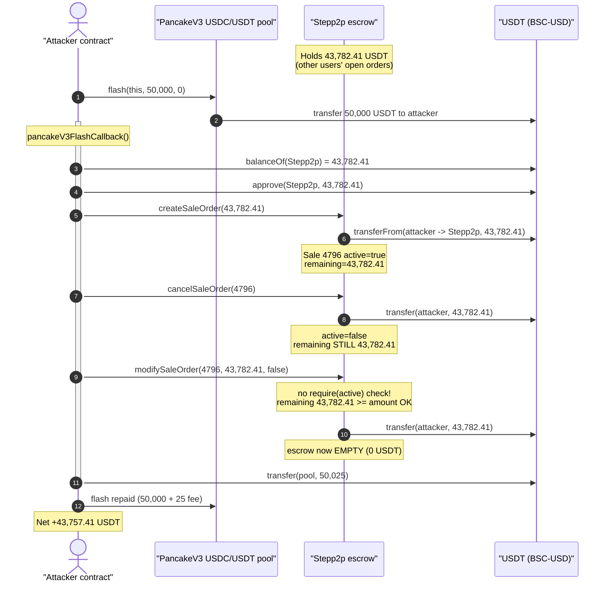
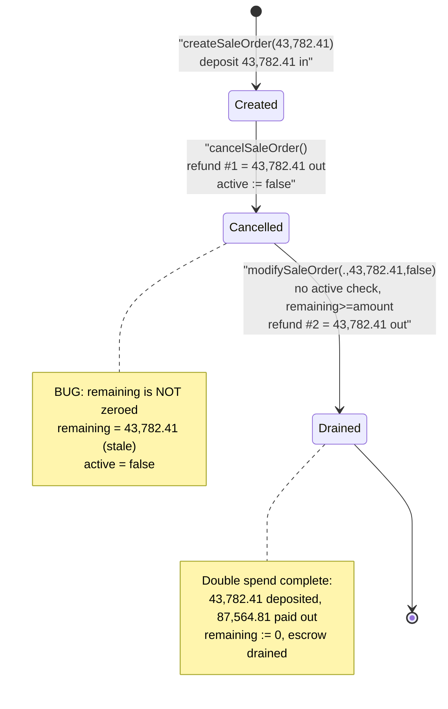
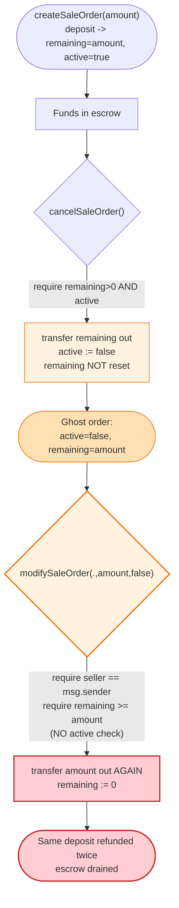

# Stepp2p Exploit — Double-Refund via `modifySaleOrder` on an Already-Cancelled Order

> **Reproduction:** the PoC compiles & runs in an isolated Foundry project at
> [this project folder](.) (the umbrella DeFiHackLabs repo contains several
> unrelated PoCs that do not whole-compile, so this one was extracted).
> Full verbose trace: [output.txt](output.txt).
> Verified vulnerable source: [contracts_Stepp2p.sol](sources/Stepp2p_998553/contracts_Stepp2p.sol).

---

## Key info

| | |
|---|---|
| **Loss** | ~$43.8K — **43,782.41 USDT (BSC-USD)** drained from the Stepp2p escrow contract |
| **Vulnerable contract** | `Stepp2p` — [`0x99855380E5f48Db0a6BABeAe312B80885a816DCe`](https://bscscan.com/address/0x99855380E5f48Db0a6BABeAe312B80885a816DCe#code) |
| **Victim** | The Stepp2p escrow itself (all USDT it was custodying for open sale orders) |
| **Funding source** | PancakeSwap V3 USDC/USDT pool `0x4f31Fa980a675570939B737Ebdde0471a4Be40Eb` (flash loan, fully repaid) |
| **Attacker EOA** | [`0xd7235d08a48cbd3f63b9faa16130f2fdb50b2341`](https://bscscan.com/address/0xd7235d08a48cbd3f63b9faa16130f2fdb50b2341) |
| **Attacker contract** | [`0x399eff46b7d458575ebbbb572098e62e38f3c993`](https://bscscan.com/address/0x399eff46b7d458575ebbbb572098e62e38f3c993) |
| **Attack tx** | [`0xe94752783519da14315d47cde34da55496c39546813ef4624c94825e2d69c6a8`](https://bscscan.com/tx/0xe94752783519da14315d47cde34da55496c39546813ef4624c94825e2d69c6a8) |
| **Chain / block / date** | BSC / 54,653,987 / July 20, 2025 |
| **Compiler** | Solidity v0.8.28, optimizer **disabled** |
| **Bug class** | Broken state invariant — missing `active` guard lets a cancelled order be "modified" and refunded a second time (double-spend) |

---

## TL;DR

`Stepp2p` is a simple P2P USDT escrow: a seller deposits USDT into a *sale order*
and the contract holds it until a buyer purchases or the seller cancels. The accounting
record for each order is a `Sale` struct carrying `totalAmount`, `remaining`, and an
`active` flag.

The flaw is a **state-desync between `cancelSaleOrder` and `modifySaleOrder`**:

- `cancelSaleOrder` ([contracts_Stepp2p.sol:146-165](sources/Stepp2p_998553/contracts_Stepp2p.sol#L146-L165))
  refunds `sale.remaining` USDT to the seller and sets `sale.active = false`, but it
  **never zeroes `sale.remaining` or `sale.totalAmount`**.
- `modifySaleOrder` ([contracts_Stepp2p.sol:101-144](sources/Stepp2p_998553/contracts_Stepp2p.sol#L101-L144))
  in its subtract branch (`isPositive = false`) checks only that the caller is the seller
  and that `sale.remaining >= _modifyAmount` — **it has no `require(sale.active)` check** —
  then refunds `_modifyAmount` USDT.

Because cancel left `remaining` untouched, the seller can call `modifySaleOrder(saleId, remaining, false)`
on the *already-cancelled* order and walk away with a **second full refund** of the same deposit.
The deposit was made once; the contract paid it out twice. The extra refund comes out of the
USDT belonging to **everyone else's** open sale orders.

The attacker funded a single oversized deposit with a flash loan so the double-refund equalled
essentially the contract's entire USDT balance:

1. **Flash loan** 50,000 USDT from the PancakeSwap V3 USDC/USDT pool.
2. **`createSaleOrder(43,782.41)`** — deposit (almost) the whole contract balance, so `remaining = 43,782.41`.
3. **`cancelSaleOrder(4796)`** — refund #1: 43,782.41 USDT back, `active → false`, but `remaining` stays 43,782.41.
4. **`modifySaleOrder(4796, 43,782.41, false)`** — refund #2 on the dead order: another 43,782.41 USDT.
5. **Repay** the flash loan (50,000 + 25 fee) and keep the difference.

Net profit = one extra refund minus the 25 USDT flash fee = **43,757.41 USDT**.

---

## Background — what Stepp2p does

`Stepp2p` ([source](sources/Stepp2p_998553/contracts_Stepp2p.sol)) is an `Ownable`,
`ReentrancyGuard` USDT escrow for off-chain P2P trades. Its lifecycle:

- **`createSaleOrder(amount)`** — seller `transferFrom`s `amount` USDT into the contract,
  an optional `sellFee` is skimmed to `feeAccount`, and a `Sale{ seller, totalAmount, remaining, receivedFee, sellFee, active:true }`
  record is stored at the next `saleId`.
- **`purchase(...)`** (owner-only) — moves USDT from escrow to the buyer/seller and decrements `remaining`.
- **`cancelSaleOrder(saleId)`** — seller (or owner) reclaims the un-purchased `remaining` and the order is deactivated.
- **`modifySaleOrder(saleId, amount, isPositive)`** — seller grows (`isPositive = true`,
  pulls more USDT in) or shrinks (`isPositive = false`, refunds USDT out) an existing order.

On-chain parameters at the fork block (read via `cast`):

| Parameter | Value |
|---|---|
| `sellFee` | **0** |
| `buyFee` | **0** |
| `lastSaleId` | **4795** (attacker's order became **4796**) |
| USDT held by the Stepp2p contract | **43,782.405928285700 USDT** ← the prize |
| `USDT` token | BSC-USD `0x55d398326f99059fF775485246999027B3197955` (18 decimals) |

The whole game lives in two facts: (1) `sellFee = 0`, so every fee branch is skipped and a refund
returns the *full* amount; (2) the contract was custodying ~43.8K USDT of other users' open orders,
which is exactly what the second refund pays out from.

---

## The vulnerable code

### 1. `cancelSaleOrder` deactivates but never zeroes `remaining`

```solidity
function cancelSaleOrder(uint256 _saleId) external nonReentrant {
    Sale storage sale = sales[_saleId];
    require(
        sale.seller == msg.sender || msg.sender == owner(),
        "Not authorized"
    );
    require(sale.remaining > 0 && sale.active, "Invalid sale");

    uint256 refundAmount = sale.remaining;                 // 43,782.41
    uint256 refundFeeAmount = sale.sellFee > 0
        ? (refundAmount * sale.sellFee) / 1000
        : 0;                                               // 0 (sellFee == 0)
    sale.active = false;                                   // ⚠️ only the flag is cleared

    if (refundFeeAmount > 0 && sale.receivedFee > 0) {
        USDT.safeTransferFrom(feeAccount, sale.seller, refundFeeAmount);
    }
    USDT.safeTransfer(sale.seller, refundAmount);          // refund #1
    emit SaleCanceled(_saleId);
    // ⚠️ sale.remaining and sale.totalAmount are LEFT at 43,782.41
}
```

[contracts_Stepp2p.sol:146-165](sources/Stepp2p_998553/contracts_Stepp2p.sol#L146-L165)

### 2. `modifySaleOrder` (subtract path) has no `active` check

```solidity
function modifySaleOrder(
    uint256 _saleId,
    uint256 _modifyAmount,
    bool isPositive // true: add, false: sub
) external nonReentrant {
    require(_modifyAmount > 0, "Amount must be greater than 0");
    require(sales[_saleId].seller == msg.sender);          // ⚠️ only seller check — NO require(sale.active)
    ...
    } else {                                               // isPositive == false → subtract/refund branch
        require(
            sales[_saleId].remaining >= _modifyAmount,     // ⚠️ passes: remaining still == 43,782.41
            "Insufficient balance"
        );
        sales[_saleId].totalAmount -= _modifyAmount;       // 43,782.41 → 0
        sales[_saleId].remaining   -= _modifyAmount;       // 43,782.41 → 0
        if (feeAmount > 0 && sales[_saleId].receivedFee > 0) { ... }  // skipped (sellFee == 0)
        USDT.safeTransfer(msg.sender, _modifyAmount);      // refund #2 — DOUBLE SPEND
    }
    emit SaleModifyed(...);
}
```

[contracts_Stepp2p.sol:101-144](sources/Stepp2p_998553/contracts_Stepp2p.sol#L101-L144)

The `require(sale.remaining > 0 && sale.active)` guard that `cancelSaleOrder` uses is the *correct*
pattern — but `modifySaleOrder` omits the `&& sale.active` half of it. The two functions disagree on
what makes an order spendable.

---

## Root cause — why it was possible

A sale order's escrowed value should be redeemable **exactly once**. The contract tracks two pieces
of state that must stay in agreement for that invariant to hold:

- `sale.active` — the boolean "this order is live and its funds are still in escrow."
- `sale.remaining` — the USDT amount that is still claimable for this order.

`cancelSaleOrder` pays out `remaining`, so after a cancel the *truth* is "remaining funds = 0." But the
function only updates **one** of the two state variables (`active = false`) and leaves the other
(`remaining = 43,782.41`) stale. As long as **every** redemption path checks `active`, the stale
`remaining` is harmless.

`modifySaleOrder`'s subtract branch is the one redemption path that **forgets to check `active`**. It
trusts `remaining` alone. So a cancelled order — whose funds have already left the building — still
*looks* fundable to `modifySaleOrder`, and it happily transfers the money a second time.

Concretely, the design defects that compose into the bug:

1. **Partial state reset on cancel.** `cancelSaleOrder` should zero `remaining`/`totalAmount` (or
   delete the struct) when it refunds. Leaving `remaining` non-zero creates a ghost order whose
   accounting still claims funds that are gone.
2. **Inconsistent guard across functions.** `cancelSaleOrder` requires `active`; `modifySaleOrder`,
   `purchase`, and the bulk-cancel helpers require it; the subtract branch of `modifySaleOrder` does
   **not**. A single un-guarded path is enough to break the once-only invariant.
3. **Refund driven by stale storage, not by money actually held.** The refund amount is read straight
   from `sale.remaining` with no cross-check against the order's true settled status.
4. **`sellFee = 0` removes the only friction.** With non-zero fees the refund would have been slightly
   smaller than the deposit, but the double-spend would still net a profit; at `sellFee = 0` the
   attacker recovers 100% of a second full deposit, so the only cost is the flash-loan fee.

The contract is `nonReentrant`, but reentrancy is irrelevant here — the two refunds happen in two
separate top-level calls (`cancelSaleOrder` then `modifySaleOrder`), each of which acquires and
releases the guard cleanly. The guard does nothing to stop a *sequential* double-claim.

---

## Preconditions

- Attacker is the `seller` of the order being abused — trivially satisfied, because anyone can
  `createSaleOrder` and become a seller (line [69-99](sources/Stepp2p_998553/contracts_Stepp2p.sol#L69-L99)).
- The order has been cancelled (so `active == false`) while `remaining` is still non-zero — guaranteed
  by `cancelSaleOrder`'s incomplete state reset.
- The contract holds enough USDT (from *other* users' open orders) to honour the second refund. At the
  fork block it held 43,782.41 USDT.
- Working capital to size the deposit at ~the whole contract balance. Fully recovered within the same
  transaction, hence **flash-loanable** (the PoC borrows 50,000 USDT from a PancakeSwap V3 pool and
  repays 50,025 USDT).

---

## Attack walkthrough (with on-chain numbers from the trace)

All figures are taken directly from the call/`Transfer` traces in [output.txt](output.txt). The token
is BSC-USD (18 decimals); amounts shown in whole USDT. The attack contract is the `Stepp2p`
PoC test contract acting as both flash-loan receiver and "seller."

| # | Step | Call | USDT moved | Stepp2p contract balance | `Sale[4796]` state |
|---|------|------|-----------:|-------------------------:|--------------------|
| 0 | **Initial** | — | — | 43,782.41 | none |
| 1 | **Flash loan** | `PancakeV3Pool.flash(this, 50,000, 0)` | +50,000 → attacker | 43,782.41 | none |
| 2 | **Read prize** | `USDT.balanceOf(Stepp2p)` | — | 43,782.41 | none |
| 3 | **Approve + deposit** | `createSaleOrder(43,782.41)` → `transferFrom` | 43,782.41 → escrow | **87,564.81** | `active=true, totalAmount=remaining=43,782.41`, id **4796** |
| 4 | **Refund #1** | `cancelSaleOrder(4796)` → `transfer` | 43,782.41 → attacker | 43,782.41 | `active=false`, **`remaining` still 43,782.41** ⚠️ |
| 5 | **Refund #2 (double-spend)** | `modifySaleOrder(4796, 43,782.41, false)` → `transfer` | 43,782.41 → attacker | **0.00** | `active=false, totalAmount=remaining=0` |
| 6 | **Repay loan** | `transfer(PancakeV3Pool, 50,025)` | 50,025 → pool | — | — |

After step 5 the Stepp2p contract is fully drained — every other user's escrowed USDT is gone. The
attacker received `43,782.41 (cancel) + 43,782.41 (modify) = 87,564.81` against a single `43,782.41`
deposit, a clean `+43,782.41` USDT before costs.

### Profit accounting (USDT)

| Direction | Amount |
|---|---:|
| Flash loan in | +50,000.000000 |
| Deposit into escrow (`createSaleOrder`) | −43,782.405928 |
| Refund #1 (`cancelSaleOrder`) | +43,782.405928 |
| Refund #2 (`modifySaleOrder`, the double-spend) | +43,782.405928 |
| Flash loan repayment (principal + 25 fee) | −50,025.000000 |
| **Net to attacker** | **+43,757.405928** |
| Attacker USDT before | 26.542162 |
| Attacker USDT after | **43,783.948090** |

The +43,757.41 net matches `balanceOf` before/after to the wei (`43,783.948090 − 26.542162 =
43,757.405928`), and equals the contract's prize 43,782.41 minus the 25 USDT flash fee — confirming
the attacker walked off with effectively the entire escrow.

---

## Diagrams

### Sequence of the attack



### Order-state evolution (`Sale[4796]`)



### The flaw: divergent guards on the redemption paths



---

## Remediation

1. **Fully reset order state on cancel.** In `cancelSaleOrder` (and the bulk-cancel helpers), zero
   `sale.remaining` and `sale.totalAmount` — or `delete sales[_saleId]` — after refunding. A cancelled
   order must carry no claimable balance:
   ```solidity
   sale.active = false;
   uint256 refundAmount = sale.remaining;
   sale.remaining = 0;
   sale.totalAmount = 0;
   USDT.safeTransfer(sale.seller, refundAmount);
   ```
2. **Add the `active` guard to every fund-moving path.** `modifySaleOrder` must
   `require(sales[_saleId].active, "Inactive sale")` before touching balances — matching the guard
   already present in `cancelSaleOrder` and `purchase`.
3. **Drive refunds from a single source of truth.** Make `remaining` the authoritative "claimable"
   amount and ensure *every* exit decrements it before transferring, so once it reaches 0 no path can
   pay out.
4. **Use checks-effects-interactions consistently.** Update `remaining`/`active` to their terminal
   values *before* the external `safeTransfer`, so partial-reset bugs cannot leave spendable ghost state.
5. **Add invariant tests / asserts.** A test that cancels an order and then attempts any further
   `modifySaleOrder`/`purchase` on it should revert; an invariant that "sum of `remaining` over active
   orders ≤ contract USDT balance" would have caught this class of bug.

---

## How to reproduce

The PoC was extracted into a standalone Foundry project (the umbrella DeFiHackLabs repo has several
unrelated PoCs that fail to compile under a single `forge test` build):

```bash
_shared/run_poc.sh 2025-07-Stepp2p_exp -vvvvv
```

- RPC: a **BSC archive** endpoint is required (fork block 54,653,986). `foundry.toml` uses
  `https://bsc-mainnet.public.blastapi.io`, which serves historical state at that block; many public
  BSC RPCs prune it and fail with `header not found` / `missing trie node`.
- Result: `[PASS] testExploit()` with the attacker's USDT balance rising from ~26.5 to ~43,783.9.

Expected tail:

```
  Attacker Before exploit USDT Balance: 26.542161622221038197
  Attacker After exploit USDT Balance: 43783.948089907921038197

Suite result: ok. 1 passed; 0 failed; 0 skipped
Ran 1 test suite: 1 tests passed, 0 failed, 0 skipped (1 total tests)
```

---

*References: PoC header in [test/Stepp2p_exp.sol](test/Stepp2p_exp.sol); TenArmor alert —
https://x.com/TenArmorAlert/status/1946887946877149520 (Stepp2p, BSC, ~$43K).*
