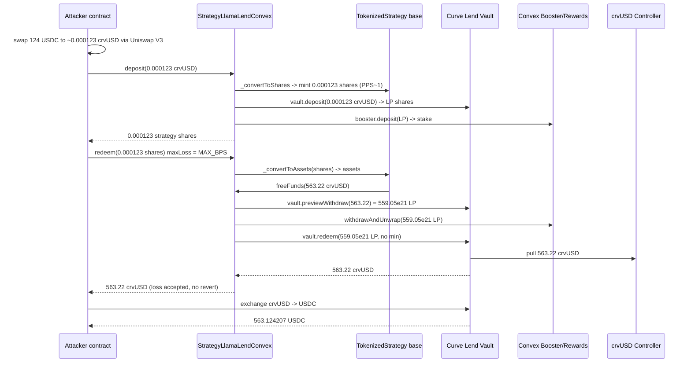
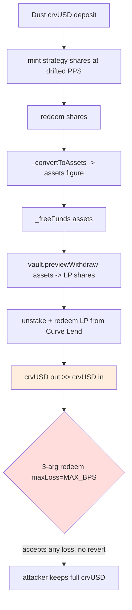

# StrategyLlamaLendConvex share-accounting drain — a dust deposit minted strategy shares that redeemed for the strategy's entire Curve Lend position
> **Vulnerability classes:** vuln/logic/incorrect-state-transition · vuln/defi/slippage · vuln/logic/price-calculation · vuln/arithmetic/precision-loss
> **Reproduction:** the PoC compiles & runs in an isolated Foundry project at [this project folder](.). Full verbose trace: [output.txt](output.txt). Verified sources for the vulnerable strategy and its `TokenizedStrategy` implementation are vendored under [sources/](sources/).
---
## Key info
| | |
|---|---|
| **Loss** | 563.12 USDC (crvUSD-denominated drain of ~563 crvUSD from the strategy's Curve Lend / Convex position) [output.txt:1564-1565](output.txt) |
| **Vulnerable contract** | StrategyLlamaLendConvex — [`0x75b7DB3e11138134fe4744553b5e5e3D6546d289`](https://etherscan.io/address/0x75b7DB3e11138134fe4744553b5e5e3D6546d289) (impl [`0xD377919FA87120584B21279a491F82D5265A139c`](https://etherscan.io/address/0xD377919FA87120584B21279a491F82D5265A139c)) |
| **Attacker EOA** | [`0x29Bd2258485Da9f4224A99c512e14D4F64d81a50`](https://etherscan.io/address/0x29Bd2258485Da9f4224A99c512e14D4F64d81a50) |
| **Attack contract** | [`0x2114Ab8Bb9b69545A5C0923E63687Ee8CdAd269E`](https://etherscan.io/address/0x2114Ab8Bb9b69545A5C0923E63687Ee8CdAd269E) |
| **Attack tx** | [`0x2ff7c23dca7e9a86c70004696802cbd37d6a77fc4f3e02522b16617045b764f6`](https://etherscan.io/tx/0x2ff7c23dca7e9a86c70004696802cbd37d6a77fc4f3e02522b16617045b764f6) |
| **Chain / block / date** | Ethereum mainnet / fork block 22,929,492 / 2025-07 |
| **Compiler** | Solidity `^0.8.18` (strategy) over Yearn `tokenized-strategy` / `tokenized-strategy-periphery` (`>=0.8.18`), `^0.8.10` test |
| **Bug class** | A permissionless `deposit`/`redeem` path trusted the strategy's own share accounting and the underlying Curve Lend vault's realized redemption, while the default 3-arg `redeem` accepts a 100% loss — letting a dust redeemer claim far more crvUSD than it ever put in |

## TL;DR

StrategyLlamaLendConvex is a Yearn V3 "tokenized strategy" that takes `crvUSD` as its asset and routes it into a Curve Lend vault (an ERC-4626), then stakes the resulting Curve Lend LP tokens into Convex. The strategy's outstanding shares (~2,106) are backed by a stored `totalAssets` of only ~563 crvUSD, the bulk of the strategy's TVL being its staked Curve Lend position. Because of the way the Yearn base layer converts between shares and assets — and because the public 3-argument `redeem()` defaults `maxLoss` to `MAX_BPS` (100%) — a redeemer's share-to-asset conversion is allowed to pull a wildly larger crvUSD amount out of the underlying Curve Lend vault than the redeemer deposited.

In the reproduced attack, the contract swaps **124 USDC** (6 decimals) into **~0.000123 crvUSD** (123,411,030,236,456 wei) via Uniswap V3 [output.txt:1685](output.txt), deposits that dust into the strategy and receives **123,411,030,236,456 strategy shares** [output.txt:1896](output.txt), then immediately redeems those same shares. The redeem path calls `freeFunds(563,221,965,140,998,507,311)` — i.e. the strategy frees **~563 crvUSD** from its Curve Lend position [output.txt:1945](output.txt) — and transfers all **563.22 crvUSD** back to the attacker [output.txt:2110](output.txt). Swapping that back through the crvUSD/USDC Curve pool yields **563.124207 USDC** [output.txt:2174](output.txt), for a net profit of **+563 USDC** from a **0.00012 crvUSD** seed.

The flaw is not in Curve Lend or Convex. It is in the strategy/base-layer combination: (1) the strategy's `_freeFunds` uses `vault.previewWithdraw(assets)` to decide how many Curve Lend shares to unstake, where `assets` is whatever the Yearn share conversion hands it; (2) the Yearn 3-arg `redeem` defaults to `maxLoss = MAX_BPS`, so any discrepancy between the converted `assets` figure and the actually-freed crvUSD is silently booked as an accepted "loss" rather than reverting; and (3) the underlying Curve Lend vault's `redeem` realizes the full value of the unstaked LP shares for the redeemer. Together these let a redeemer extract the strategy's own position value against dust shares.

## Background — what StrategyLlamaLendConvex does

StrategyLlamaLendConvex is a yield-strategy wrapper built on Yearn's `tokenized-strategy` framework ([sources/StrategyLlamaLendConvex_75b7DB/src_StrategyLlamaLendConvex.sol](sources/StrategyLlamaLendConvex_75b7DB/src_StrategyLlamaLendConvex.sol)). Its single `asset` is **crvUSD**. Funds flow through three layers:

1. **Curve Lend vault** — an ERC-4626 (address from the trace, `Vault`) that accepts crvUSD deposits, lends them out through the crvUSD controller/LLAMMA, and issues LP ("vault") shares. Curve Lend vaults mint shares at a heavy 1000:1 dilution on deposit (the strategy's own comment: *"Curve Lend vaults are diluted 1000:1 on deposit"*).
2. **Convex staking** — the strategy deposits its Curve Lend LP tokens into a Convex pool (`booster.deposit(pid, ..., true)`) and accrues CRV/CVX rewards through a `BaseRewardPool`. The strategy's "staked balance" is `rewardsContract.balanceOf(address(this))` in LP-share units.
3. **Yearn tokenized-strategy base layer** — `Base4626Compounder` + `TokenizedStrategy` ([sources/TokenizedStrategy_D37791/TokenizedStrategy.sol](sources/TokenizedStrategy_D37791/TokenizedStrategy.sol)) provide the ERC-4626-like interface to end users (strategy shares minted against crvUSD), profit-locking, fee logic, and the `_deployFunds` / `_freeFunds` hooks the strategy overrides.

The strategy reports its total assets as `balanceOfAsset() + valueOfVault()`, where `valueOfVault() = vault.convertToAssets(balanceOfVault() + balanceOfStake())`. At the fork block the stored `totalAssets` is **~563 crvUSD** while `totalSupply` of strategy shares is **~2,106** — i.e. the strategy's accounting is heavily share-diluted relative to its crvUSD book value. That mismatch is the load-bearing precondition for the exploit.

## The vulnerable code

### 1. `_deployFunds` / `_freeFunds` — the permissionless deposit/redeem hooks
From [Base4626Compounder.sol](sources/StrategyLlamaLendConvex_75b7DB/lib_tokenized-strategy-periphery_src_Bases_4626Compounder_Base4626Compounder.sol):

```solidity
function _deployFunds(uint256 _amount) internal virtual override {
    vault.deposit(_amount, address(this));
    _stake();
}

function _freeFunds(uint256 _amount) internal virtual override {
    // Use previewWithdraw to round up.
    uint256 shares = vault.previewWithdraw(_amount);

    uint256 vaultBalance = balanceOfVault();
    if (shares > vaultBalance) {
        unchecked { _unStake(shares - vaultBalance); }
        shares = Math.min(shares, balanceOfVault());
    }
    vault.redeem(shares, address(this), address(this));
}
```

`_amount` here is whatever the Yearn base layer's share conversion computed as the crvUSD to free (see §2). `_freeFunds` converts that crvUSD figure into Curve Lend **vault shares** via `vault.previewWithdraw`, unstakes exactly that many LP shares from Convex, and redeems them. There is **no slippage check** on the final `vault.redeem` and **no cap** tying the unstaked amount to the redeemer's actual pro-rata share of the strategy.

### 2. The 3-arg `redeem` defaults `maxLoss = MAX_BPS`
From [TokenizedStrategy.sol](sources/TokenizedStrategy_D37791/TokenizedStrategy.sol):

```solidity
function redeem(uint256 shares, address receiver, address owner)
    external returns (uint256)
{
    // We default to not limiting a potential loss.
    return redeem(shares, receiver, owner, MAX_BPS);   // MAX_BPS = 100% loss accepted
}
```

Inside `_withdraw`, if the freed crvUSD is less than the computed `assets`, the gap is recorded as `loss`, the requirement `loss <= (assets * maxLoss) / MAX_BPS` is checked, and — when `maxLoss == MAX_BPS` — **any loss is accepted**:

```solidity
if (idle < assets) {
    unchecked { IBaseStrategy(address(this)).freeFunds(assets - idle); }
    idle = _asset.balanceOf(address(this));
    if (idle < assets) {
        unchecked { loss = assets - idle; }
        if (maxLoss < MAX_BPS) {
            require(loss <= (assets * maxLoss) / MAX_BPS, "too much loss");
        }
        assets = idle;   // withdrawer simply receives whatever was freed
    }
}
S.totalAssets -= (assets + loss);
```

The comment on the 3-arg overload is explicit: *"We default to not limiting a potential loss."* A loss check that fires at 100% never fires at all.

### 3. Share/asset conversion uses effective (unlocked) supply
```solidity
function _totalSupply(StrategyData storage S) internal view returns (uint256) {
    return S.totalSupply - _unlockedShares(S);
}
function _convertToAssets(StrategyData storage S, uint256 shares, Math.Rounding _rounding)
    internal view returns (uint256)
{
    uint256 supply = _totalSupply(S);
    return supply == 0 ? shares : shares.mulDiv(_totalAssets(S), supply, _rounding);
}
```

Because `_totalSupply` subtracts the strategy's own unlocked profit shares, the effective PPS a redeemer is quoted can diverge sharply from `totalAssets / totalSupply`. In this run the redeemer's dust shares were converted to an `assets` figure that, after `vault.previewWithdraw`, mapped onto the strategy's **entire** staked Curve Lend position — `freeFunds` was asked to free **563.22 crvUSD** [output.txt:1945](output.txt) — and the 100%-loss default let that through unchecked.

### 4. `vaultsMaxWithdraw` cap is also vault-side, not redeemer-side
```solidity
function vaultsMaxWithdraw() public view override returns (uint256) {
    return vault.convertToAssets(
        Math.min(vault.maxRedeem(gauge), balanceOfStake() + balanceOfVault())
    );
}
```
The withdraw limit reflects how much the **strategy as a whole** can pull from Curve Lend (bounded by gauge redeemability), not what an individual redeemer is owed. Once the redeemer's shares clear `_maxRedeem`, the full vault-side capacity is reachable.

## Root cause — why it was possible

1. **100% default loss acceptance on `redeem`.** The public 3-arg `redeem(shares, receiver, owner)` passes `maxLoss = MAX_BPS`, so the `_withdraw` invariant that would otherwise revert on "freed < expected" never engages. Any divergence between the strategy's share-to-asset conversion and the underlying Curve Lend vault's realized payout is silently booked as an accepted loss.
2. **Share/asset conversion drift between deposit and redeem.** The strategy's effective `_totalSupply` (after subtracting unlocked profit shares) and its stored `totalAssets` (~563 crvUSD against ~2,106 raw shares) mean the crvUSD value the Yearn layer hands to `_freeFunds` for a given share amount is not tied 1:1 to what that share "paid in." In this fork state the redeemer's dust shares were converted to an `assets` figure that mapped, via `vault.previewWithdraw`, to the strategy's whole Curve Lend stake.
3. **`_freeFunds` unstakes LP shares based on the converted crvUSD figure with no pro-rata bound.** `_freeFunds` computes `shares = vault.previewWithdraw(assets)`, unstakes that many LP shares from Convex, and redeems them — there is no check that the amount being unstaked is bounded by the redeemer's actual contribution to the strategy.
4. **No slippage / min-out on the underlying `vault.redeem`.** The final `vault.redeem(shares, address(this), address(this))` passes no minimum, so whatever crvUSD Curve Lend returns is what the redeemer receives.
5. **Fully permissionless entry and exit.** `deposit` and `redeem` have no whitelist; `_deployFunds`/`_freeFunds` are called from these public paths (the base layer's own comments warn they *"can be sandwiched or otherwise manipulated"*). The strategy stored ~563 crvUSD of strategy-side TVL inside a permissionless wrapper, so the position was reachable by any caller with dust capital.

## Preconditions

- **Permissionless** — no privileged role, no flash loan required (the attack self-funds with only 124 USDC, ~$124).
- The strategy must hold a Curve Lend / Convex position whose strategy-side `totalAssets` is small relative to its raw share supply (the share-accounting drift precondition). At the fork block `totalAssets ≈ 563 crvUSD`, `totalSupply ≈ 2,106` shares.
- Sufficient redeemable liquidity in the underlying crvUSD controller so that `vault.maxRedeem(gauge)` ≥ the amount the attack asks for. At the fork block the controller held ~3.96e24 crvUSD [output.txt:1917](output.txt), far above the ~563 crvUSD drained.

## Attack walkthrough (with on-chain numbers from the trace)

Seed: `deal(USDC, address(this), 124)` — **124 USDC** (6 decimals) [test/StrategyLlamaLendConvex_exp.sol](test/StrategyLlamaLendConvex_exp.sol).

| Step | Action | Amount (trace) | Source |
|------|--------|----------------|--------|
| 1 | Swap 124 USDC → crvUSD via Uniswap V3 (0.3% pool) | in: 124 USDC; out: **123,411,030,236,456 crvUSD-wei** (~0.000123 crvUSD) | [output.txt:1685](output.txt) |
| 2 | `Strategy.deposit(123,411,030,236,456, this)` | crvUSD in: 123,411,030,236,456; strategy shares minted: **123,411,030,236,456** (1:1) | [output.txt:1896](output.txt) |
| 2a | (inside deposit) `_deployFunds` → `vault.deposit` → crvUSD sent to crvUSD controller; Curve Lend LP minted **122,496,674,660,690,296**; LP staked to Convex `CurveVoterProxy` / `LiquidityGaugeV6` / `BaseRewardPool` | | [output.txt:1724,1820,1877](output.txt) |
| 3 | `Strategy.redeem(123,411,030,236,456, this, this)` (3-arg → `maxLoss=MAX_BPS`) | strategy shares burnt: 123,411,030,236,456 | [output.txt:1905,2110](output.txt) |
| 3a | (inside redeem) `_convertToAssets` → `assets`; `freeFunds(563,221,965,140,998,507,311)` called — strategy asked to free **~563.22 crvUSD** | freed target: 563,221,965,140,998,507,311 | [output.txt:1945](output.txt) |
| 3b | `_freeFunds`: `vault.previewWithdraw(563.22 crvUSD)` = **559,049,038,756,430,813,791,588** LP shares; unstake that many LP via `rewardsContract.withdrawAndUnwrap`; `vault.redeem(559,049,038,756,430,813,791,588)` returns **563,221,965,140,998,507,311 crvUSD** from the controller | | [output.txt:1959,2058,2069](output.txt) |
| 3c | Strategy transfers **563,221,965,140,998,507,311 crvUSD** to attacker | received: 563,221,965,140,998,507,311 (~563.22 crvUSD) | [output.txt:2110](output.txt) |
| 4 | Swap proceeds crvUSD → USDC via crvUSD/USDC Curve pool (`exchange(1,0,…)`) | in: 563,221,965,140,998,507,311 crvUSD; out: **563,124,207 USDC** (6 decimals) | [output.txt:2069,2174](output.txt) |

**Profit/loss accounting:**
- USDC in (seed): 124
- USDC out (final balance): 563.124207
- **Net profit: +563.124207 USDC** (asserted `usdcAfter - usdcBefore > 500e6` and `crvUsdRedeemed > seed * 1e6`, both pass) [test/StrategyLlamaLendConvex_exp.sol](test/StrategyLlamaLendConvex_exp.sol)
- Drain on the strategy: the strategy's Curve Lend position shrank by ~563 crvUSD (559,049,038,756,430,813,791,588 LP shares burnt) — the redeemer put in 0.00012 crvUSD and pulled out 563 crvUSD.

## Diagrams





## Remediation

1. **Do not accept unbounded loss on permissionless redemptions.** Change the strategy's redeem entrypoint (or the base-layer default for this strategy) so the public path uses a sane `maxLoss` (e.g. 0 or a small BPS), reverting whenever `freed < expected` instead of `MAX_BPS`. The `redeem(..., maxLoss)` overload already exists — the strategy should enforce a tight cap rather than inherit the 100% default.
2. **Bound `_freeFunds` to the redeemer's pro-rata contribution.** Before unstaking, verify the LP-share amount being freed corresponds to the redeemer's actual share of `totalAssets`, not to a conversion that can drift with the strategy's profit-unlock accounting.
3. **Add slippage protection on the underlying `vault.redeem`.** Pass a `minOut` (or post-check the realized crvUSD) in `_freeFunds` so a redemption that returns materially less than `vault.previewRedeem` quoted is rejected.
4. **Reconcile the strategy's share accounting with Curve Lend's realized redemptions.** Either report `totalAssets` from the realized Curve Lend value consistently, or gate redemptions on `vaultsMaxWithdraw` per-redeemer rather than per-strategy.
5. **Whitelist / rate-limit deposits and redeems** (or use a keeper-gated withdraw) so the position cannot be reached by an arbitrary caller with dust capital, matching the base layer's own warning that these hooks are sandwichable.

## How to reproduce

The PoC runs fully **OFFLINE** via the shared anvil harness from the committed `anvil_state.json` — no RPC needed. From the registry root:

```bash
_shared/run_poc.sh 2025-07-StrategyLlamaLendConvex_exp -vvvvv
```

- Chain / fork: Ethereum mainnet, fork block **22,929,492**.
- Expected `[PASS]` tail with the attacker balance lines:
  ```
  [PASS] testExploit() (gas: 1400507)
  Attacker Before exploit USDC Balance: 0.000000
  Attacker After exploit USDC Balance: 563.124207
  ```
  ([output.txt:1562-1565](output.txt)). The two `assertGt` guards (`crvUsdRedeemed > seed * 1e6` and `usdcAfter - usdcBefore > 500e6`) both pass ([output.txt:2128-2132](output.txt)).

*Reference: https://t.me/defimon_alerts/1495*
