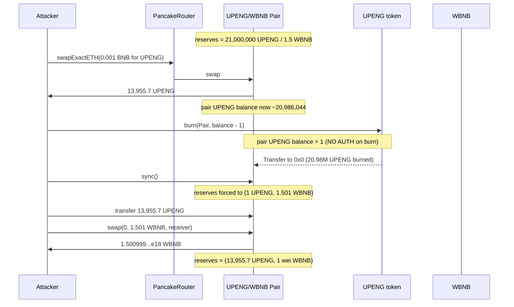

# UPENG burn+sync drain — permissionless `burn(address,uint256)` lets anyone torch a Uniswap-V2 pair's token side, then `sync()` commits the manipulated balance as reserves

> **Vulnerability classes:** vuln/access-control/missing-auth · vuln/logic/incorrect-order-of-operations · vuln/defi/slippage
> **Reproduction:** the PoC compiles & runs in an isolated Foundry project at [this project folder](.). Full verbose trace: [output.txt](output.txt). The UPENG token contract source is **not verified on BscScan**, so the vulnerable `burn` is reconstructed from the trace's emitted events and storage diffs; the PancakePair (standard UniswapV2) and PancakeRouter behavior is fully observed in the trace.

---

## Key info

| | |
|---|---|
| **Loss** | ~1.5 WBNB (1,500,999,999,999,999,999 wei) — the pair's near-total WBNB reserve [output.txt:1565,1709] |
| **Vulnerable contract** | UPENG token — [`0x4303cdDbeF06B5820F10dbC00206f8Bde6749e2f`](https://bscscan.com/address/0x4303cdDbeF06B5820F10dbC00206f8Bde6749e2f) (unverified) |
| **Vulnerable pair** | UPENG/WBNB PancakePair — [`0xB29b0E7545E7252e8db380C5C010Cb1ef6990cac`](https://bscscan.com/address/0xB29b0E7545E7252e8db380C5C010Cb1ef6990cac) |
| **Attacker EOA** | [`0x37023A0c3440106Cf50Dc8498Dcd64fdBb1e837A`](https://bscscan.com/address/0x37023A0c3440106Cf50Dc8498Dcd64fdBb1e837A) |
| **Attack contract** | [`0x91b74e8E38290d7B1e0C48F72f4C54312b7F148e`](https://bscscan.com/address/0x91b74e8E38290d7B1e0C48F72f4C54312b7F148e) |
| **Attack tx** | [`0x33de1ed2d33f79e9b6dfccff8d4536ecda126f4eff18c295f16e9169b4ea5df1`](https://bscscan.com/tx/0x33de1ed2d33f79e9b6dfccff8d4536ecda126f4eff18c295f16e9169b4ea5df1) |
| **Chain / block / date** | BSC / 53,877,710 / 2025-07 |
| **Compiler** | Unknown — token source unverified on BscScan |
| **Bug class** | UPENG exposes an unauthenticated `burn(address account, uint256 amount)` that any caller can use to destroy tokens held by any address — including the UPENG/WBNB liquidity pair — and the standard permissionless `PancakePair.sync()` then writes the manipulated balance into reserves, breaking the AMM price and letting the attacker extract the pair's WBNB. |

## TL;DR

UPENG is a low-liquidity BEP-20 token paired against WBNB on PancakeSwap. Its `UPENG/WBNB` pair held roughly **21,000,000 UPENG** against **1.5 WBNB** at the time of the attack [output.txt:1628]. The UPENG token ships a `burn(address account, uint256 amount)` function with no access control: anyone may mint a `Transfer` event from an arbitrary `from` to `address(0)` and decrement that account's balance.

The attacker funded an attack contract with **0.001 BNB**, swapped it through the router for **~13,955 UPENG** [output.txt:1632], then called `burn(pair, pairBalance - 1)` to destroy **20,986,044 UPENG** of the pair's token side — all but 1 wei [output.txt:1653-1654]. A direct `pair.sync()` then committed that distorted balance as reserves, turning the pair into **1 UPENG ↔ 1.501 WBNB** [output.txt:1664]. The attacker pushed their 13,955 UPENG back into the pair and called `pair.swap(...)` for **1,500,999,999,999,999,999 wei WBNB** (the entire reserve minus the 0.03% swap fee), netting **~1.5 WBNB** from a **0.001 BNB** seed [output.txt:1680,1682,1709].

The flaw is the conjunction of two things: a token exposing an arbitrary-address `burn` (a generic logic/access-control defect), and the Uniswap-V2 invariant that `sync()` blindly trusts `balanceOf` after the swap fee check. Because the burn happened outside the pair's reentrancy lock, the subsequent `swap`/`sync` saw the inflated price as legitimate.

## Background — what UPENG / the PancakePair does

UPENG is a BEP-20 token on BNB Chain. Its only material market venue is a single PancakeSwap V2 pair, `UPENG/WBNB` (`token0 = UPENG`, `token1 = WBNB`, confirmed by the PoC's `_assertPairLayout` [test/UPENGBurnSync_exp.sol](test/UPENGBurnSync_exp.sol)).

A Uniswap-V2-style pair is a constant-product AMM. It maintains two numbers — `reserve0` and `reserve1` — that it uses to quote swaps via `k = reserve0 * reserve1`. Critically, those reserves are **not** live reads of the token balances; they are a cached snapshot. The pair refreshes the snapshot in exactly two places:

1. At the end of every `swap`, via the internal `_update` call, it sets `reserve0 = IERC20(token0).balanceOf(address(this))` and likewise for `reserve1`, then emits `Sync`.
2. Anyone may call the public `sync()` function, which performs the same `_update(balance0, balance1, …)` refresh unconditionally.

This design is intentional for the normal flow (it lets the pair self-correct after a direct token transfer / liquidity misalignment) but it is the load-bearing assumption for this exploit: **`sync()` has no opinion about how the balances got to where they are**. If an attacker can change `balanceOf(pair)` for one token without going through the pair's swap/transfer logic, `sync()` will faithfully record the manipulated number as the new reserve, and the next swap will price against it.

The token's `burn(address account, uint256 amount)` is the lever that moves `balanceOf(pair)` outside the pair's own accounting. From the trace it behaves exactly like a standard open-`burnFrom` minus the allowance check: it emits `Transfer(from = account, to = 0x0, value = amount)` and decrements `account`'s balance, with no caller restriction.

## The vulnerable code

The UPENG token is unverified on BscScan, so the function below is **reconstructed from the trace** (emitted event + storage behavior). The observed semantics are unambiguous:

```solidity
// RECONSTRUCTED from trace [output.txt:1653-1656] — UPENG token (unverified)
// No access control. Any caller may burn any account's balance.
function burn(address account, uint256 amount) external {   // <- no onlyOwner / no auth
    _balances[account] -= amount;                            // storage slot decremented
    emit Transfer(account, address(0), amount);              // observed in trace
    // totalSupply decrement also observed via subsequent reserve math
}
```

Trace evidence for the reconstruction (the only `burn` call in the run):

```
[output.txt:1653] UPENG::burn(UPENG/WBNB Pair, 20986044280553431967741451 [2.098e25])
[output.txt:1654]   emit Transfer(from: UPENG/WBNB Pair, to: 0x0, value: 20986044280553431967741451)
[output.txt:1656]   storage @ ...9f4 → 0   // pair's UPENG balance slot wiped to ~0
```

The pair-side enabler is standard UniswapV2 (PancakeSwap V2) and is quoted from the verified canonical implementation, not the specific deployment:

```solidity
// UniswapV2Pair — standard, verified across deployments
function sync() external lock {
    _update(IERC20(token0).balanceOf(address(this)),
            IERC20(token1).balanceOf(address(this)),
            reserve0, reserve1);
}
// _update sets reserve0/1 = the passed balances and emits Sync.
```

`sync()` is `lock`-guarded (reentrancy-safe) but **not** permissioned: anyone can call it, and it will accept whatever `balanceOf` currently reports — including a balance that was just gutted by the token's open `burn`.

## Root cause — why it was possible

1. **Unauthenticated arbitrary-address `burn`.** UPENG's `burn(address account, uint256 amount)` performs a balance decrement + `Transfer` to `address(0)` with no caller authorization and no allowance check. This is the primary defect — a token must never let an arbitrary caller destroy a third party's balance. The standard safe pattern is either `burn()` (burns `msg.sender`'s own tokens) or `burnFrom(account, amount)` (requires prior `approve`).
2. **`PancakePair.sync()` trusts external `balanceOf`.** The AMM's reserve refresh reads live balances unconditionally. This is by design for legitimate rebalancing, but it converts any token that can move the pair's balance out-of-band (here, the open `burn`) into a reserve-manipulation primitive.
3. **Out-of-order state change between the burn and the swap.** The attacker burns the pair's UPENG and calls `sync()` *before* re-entering via `swap`. Because the burn happens outside the pair's reentrancy `lock` and outside the swap's K-invariant check, the pair has no chance to detect the imbalance — by the time `swap` runs, reserves already reflect the manipulated price, so the swap's K-check passes trivially.
4. **No slippage / price-impact protection on the victim side.** The pair's only guard is the constant-product K-invariant and the 0.03% fee, both of which are satisfied when reserves have already been skewed to near-infinity for the token being sold. There is no oracle or circuit-breaker on the token or the pair.

## Preconditions

- **Permissionless.** No privileged role, no flash loan strictly required (the attacker used only 0.001 BNB of own funds). Any externally owned account could execute this.
- The attacker must obtain a small amount of UPENG (the " ammunition" for the final sell). The cheapest way is a tiny initial swap, exactly as done here.
- The pair must hold a non-trivial WBNB reserve to drain — here ~1.5 WBNB.
- The token's `burn` must accept the **pair address** as `account` (it does — no restriction on the target).

## Attack walkthrough (with on-chain numbers from the trace)

Initial state of the UPENG/WBNB pair, read at the start of the router swap [output.txt:1628]:

| Reserve | Value |
|---|---|
| `reserve0` (UPENG) | 21,000,000,000,000,000,000,000,000 (2.1e25, "21M UPENG") |
| `reserve1` (WBNB) | 1,500,000,000,000,000,000 (1.5e18) |

Attacker before: **0 WBNB** [output.txt:1564].

| Step | Call | Effect |
|---|---|---|
| 1 | `router.swapExactETHForTokensSupportingFeeOnTransferTokens{value: 0.001 BNB}(0, [WBNB, UPENG], attack, …)` | 0.001 BNB → WBNB → pair. Pair sends **13,955,719,446,568,032,258,548 UPENG** (~13,955.7 UPENG) to the attack contract [output.txt:1632]. Post-buy pair UPENG balance ≈ 20,986,044,280,553,431,967,741,452. |
| 2 | `UPENG.burn(pair, pairUPENGBalance - 1)` | Destroys **20,986,044,280,553,431,967,741,451 UPENG** owned by the pair [output.txt:1653-1654]. Pair's UPENG `balanceOf` drops to **1**. |
| 3 | `pair.sync()` | `_update` reads balances and writes reserves = **(1 UPENG, 1.501 WBNB)** [output.txt:1664]. AMM now prices 1 wei UPENG against ~1.501 WBNB. |
| 4 | `UPENG.transfer(pair, 13,955.7 UPENG)` | Pushes the attacker's UPENG into the pair directly [output.txt:1671]. |
| 5 | `router.getAmountOut(13,955.7e18, 1, 1.501e18)` | Returns **1,500,999,999,999,999,999 wei** WBNB [output.txt:1678] — effectively the whole WBNB reserve less the 0.03% fee. |
| 6 | `pair.swap(0, 1.500999…e18, profitReceiver, "")` | Pair transfers **1,500,999,999,999,999,999 wei WBNB** to the profit receiver [output.txt:1682]. Reserves re-sync to (~13,955.7e18 UPENG, 1 wei WBNB) [output.txt:1691]. |

**Profit & loss accounting:**

| Item | Amount |
|---|---|
| Spent (seed BNB) | −0.001 BNB |
| Gained (WBNB) | +1,500,999,999,999,999,999 wei (≈1.501 WBNB) |
| **Net profit** | **≈ 1.5 WBNB** (asserted by the test: `1.49 ether < profit < 1.51 ether`) [output.txt:1684-1688] |

Attacker after: **1.500999999999999999 WBNB** [output.txt:1565,1709]. The pair is left holding ~1 wei WBNB.

## Diagrams



```mermaid
flowchart TD
    A[Open burn(address,uint256)] -->|any caller| B[Pair UPENG balance gutted to 1]
    B --> C[pair.sync commits reserves = 1 UPENG / 1.5 WBNB]
    C --> D[AMM prices 1 wei UPENG ~= 1.5 WBNB]
    D --> E[Sell 13,955 UPENG for whole WBNB reserve]
    E --> F[~1.5 WBNB profit]
    G[No allowance / no onlyOwner on burn] -.-> A
    H[sync trusts balanceOf blindly] -.-> C
```

## Remediation

1. **Remove or gate the arbitrary-address `burn`.** The only safe signatures are:
   - `function burn(uint256 amount) external { _burn(msg.sender, amount); }` (burn own tokens), or
   - `function burnFrom(address account, uint256 amount) external` that first checks `_allowances[account][msg.sender] >= amount` and decrements the allowance (standard ERC20 `burnFrom`).
   Never expose `burn(address account, …)` without authorization.
2. **Do not rely on `sync()` as a price oracle.** For any token that can move balances out-of-band (rebasing, fee-on-transfer, deflationary, or — as here — openly burnable), a Uniswap-V2 pair is inherently manipulable. If the project must use such a token, prefer a twap-protected oracle with a meaningful window and a price-deviation circuit breaker for any consumer that reads the pair price.
3. **Add a sanity guard in the token's burn path** — e.g. reject `account` being a known AMM pair, or require the caller to prove ownership/allowance. This is defense-in-depth, not a substitute for fix #1.
4. **For the pair side (protocol-level):** nothing can be patched on a deployed PancakePair — the fix must live in the token. Listing such a token on a V3 concentrated-liquidity pair does not help either; the same `sync`/`balanceOf` trust model applies.

## How to reproduce

The PoC runs **fully offline** via the shared anvil harness, replaying the committed `anvil_state.json` (BSC fork at block **53,877,710**). No RPC is needed.

```bash
_shared/run_poc.sh 2025-07-UPENGBurnSync_exp -vvvvv
```

`<FOLDER>` = `2025-07-UPENGBurnSync_exp`. Expected tail of [output.txt](output.txt):

```
[PASS] testExploit() (gas: 946391)
...
Attacker Before exploit WBNB Balance: 0.000000000000000000
Attacker After exploit WBNB Balance: 1.500999999999999999
Suite result: ok. 1 passed; 0 failed; 0 skipped
```

The local run passed: attacker WBNB balance goes **0 → 1.500999999999999999** [output.txt:1564-1565,1709], and the assertions `1.49 ether < profit < 1.51 ether` hold.

*Reference: https://t.me/defimon_alerts/1470*
