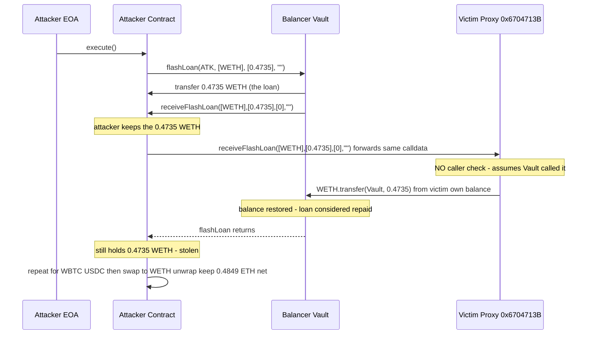
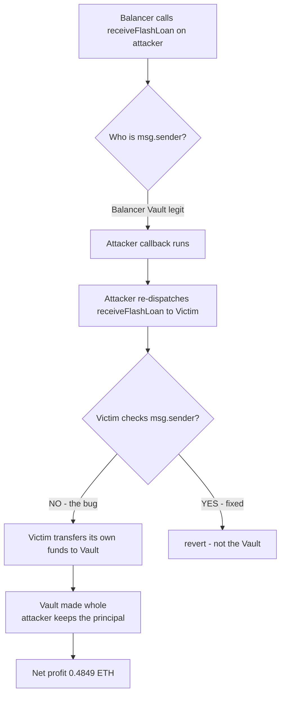

# Unverified670471 — Balancer flash-loan callback forwarded to a victim that repays the loan with its own funds
> **Vulnerability classes:** vuln/access-control/missing-auth · vuln/logic/incorrect-state-transition · vuln/dependency/unsafe-external-call
> **Reproduction:** the PoC compiles & runs in an isolated Foundry project at [this project folder](.). Full verbose trace: [output.txt](output.txt). The victim proxy (`0x6704713B...`) and both implementations (`0x0b512509...` → `0xC3f215a7...`) are **unverified** on Etherscan; the bug is reconstructed below from the on-chain call trace and the PoC source.
---
## Key info
| | |
|---|---|
| **Loss** | ~$1,818.33 (484.9 mETH net profit ≈ 0.4849 ETH at fork-block prices) |
| **Vulnerable contract** | Unverified proxy — [`0x6704713B32CB1B3e89B0CF7D77417807061BdEB8`](https://etherscan.io/address/0x6704713B32CB1B3e89B0CF7D77417807061BdEB8) (delegatecalls implementation [`0x0b5125099395324e8f0db097a3e0c286e3dcba12`](https://etherscan.io/address/0x0b5125099395324e8f0db097a3e0c286e3dcba12), which itself delegatecalls the working implementation [`0xC3f215a7742ea5a4aC3ed0eA1c6F0323C24E5458`](https://etherscan.io/address/0xC3f215a7742ea5a4aC3ed0eA1c6F0323C24E5458)) |
| **Attacker EOA** | [`0xe4B97Db5FAF476DB464Bc271097Fac97d6CE3783`](https://etherscan.io/address/0xe4B97Db5FAF476DB464Bc271097Fac97d6CE3783) |
| **Attack contract** | [`0x2Db9F0A1e21a68b5dF3B0ab9F5CEb154eFA26f2D`](https://etherscan.io/address/0x2Db9F0A1e21a68b5dF3B0ab9F5CEb154eFA26f2D) (`BalancerCallbackExploit`) |
| **Attack tx** | [`0x6a2a9f48ff78966cb44772c3551a56d7c5b788168f81cae8d06006c79a86fc16`](https://etherscan.io/tx/0x6a2a9f48ff78966cb44772c3551a56d7c5b788168f81cae8d06006c79a86fc16) |
| **Chain / block / date** | Ethereum mainnet / 23,006,171 / 2025-07 |
| **Compiler** | Unknown — victim proxy and both implementations are unverified |
| **Bug class** | The victim's `receiveFlashLoan` callback does not check `msg.sender == BalancerVault`, so any caller can forward a Balancer flash-loan callback to it and force it to repay the loan out of its own token holdings, leaving the borrowed principal with the attacker. |
## TL;DR
The victim contract `0x6704713B...` is configured to act as a Balancer `IBalancerFlashLoanRecipient`. Balancer's flash-loan primitive works by sending the borrowed tokens to a `recipient`, then calling `recipient.receiveFlashLoan(...)` and expecting the recipient to return the same amount (plus the 0-fee in this era) to the Vault before the end of the transaction. The victim's callback implementation — reached via a double delegatecall (`proxy → 0x0b5125… → 0xC3f215…`) — performed that repayment (`token.transfer(Vault, amount)`) but **never verified that `msg.sender` was the Balancer Vault**.

The attacker exploited this with a two-hop callback relay. The attacker's own contract acted as the *real* Balancer recipient: Balancer sent it the borrowed tokens and called its `receiveFlashLoan`. Inside that legitimate callback, the attacker simply re-dispatched the same `receiveFlashLoan` call to the victim. The victim, believing it was the recipient, dutifully `transfer`-ed its own tokens back to the Vault — closing out the Balancer loan. The attacker meanwhile retained the flash-borrowed principal that Balancer had delivered to its contract. Because Balancer saw its loaned amount returned in full, the flash loan was considered settled, and the attacker walked away with the principal, which the victim had effectively paid.

The attack was repeated three times — once per token (WETH, WBTC, USDC) — for borrowed principals of 0.4735 WETH, 0.0005229 WBTC, and 18.718 USDC. The WBTC and USDC proceeds were swapped to WETH via Uniswap V2, yielding a combined 0.4949 WETH. After unwrapping to ETH and paying a 0.01 ETH bribe to `0x4838B106…` (likely a MEV builder/coinbase address to land the bundle), the attacker's EOA netted **0.484905 ETH** [output.txt:1539-1540]. Per the PoC's `@KeyInfo` the dollar value at the time was about **$1,818.33**. The magnitude is small only because the victim's per-token balances happened to be tiny; the mechanism is a full-drain primitive — any token the victim held was extractable.

## Background — what the victim does
The victim contract at `0x6704713B...` is an unverified proxy. From the on-chain trace we can reconstruct its dispatch: it `delegatecall`s into `0x0b512509...`, which in turn `delegatecall`s the working implementation `0xC3f215a7...` (visible at trace depth for the WETH leg) [output.txt:1572]. All three share the same storage context, so functionally the proxy *is* the working implementation for state purposes.

The contract's apparent purpose is to act as a **Balancer flash-loan recipient** — i.e. it participates in some strategy that borrows assets from the Balancer Vault (`0xBA12222222228d8Ba445958a75a0704d566BF2C8`) and uses them within the same transaction. Balancer's flash-loan protocol is straightforward:

1. A borrower calls `Vault.flashLoan(recipient, tokens, amounts, userData)`.
2. The Vault transfers `amounts[i]` of each `tokens[i]` from its own balance to `recipient`.
3. The Vault then calls `recipient.receiveFlashLoan(tokens, amounts, feeAmounts, userData)`.
4. After the callback returns, the Vault checks that its balance of each token has been restored to at least `amount + fee` (post-2022 the fee is 0 for most cases).
5. If the balance is short, the transaction reverts.

The security model relies entirely on the recipient *itself* returning the funds inside the callback. There is no per-call authentication from Balancer's side beyond "I am calling you because you (or someone) asked for a loan with you as recipient." Consequently, **any contract implementing `receiveFlashLoan` correctly must treat that function as a privileged entry point**: only the Vault should be allowed to invoke it, because invoking it is what triggers the repayment logic.

## The vulnerable code
The victim's source is unverified, so the snippet below is **RECONSTRUCTED** from the observed on-chain behavior in [output.txt](output.txt). The reconstruction is mechanical: every line maps directly to a call or storage change observed in the trace.

### The unauthenticated flash-loan callback (RECONSTRUCTED)

The working implementation `0xC3f215a7...` (reached via `delegatecall` from the proxy) exposes a `receiveFlashLoan` that immediately transfers the loaned amount back to the Vault, with **no `require` on `msg.sender`**:

```solidity
// RECONSTRUCTED from trace output.txt:1570-1577 (WETH leg)
// Contract: working implementation 0xC3f215a7... invoked via
// proxy 0x6704713B... delegatecall-> 0x0b512509... delegatecall-> 0xC3f215a7...
interface IERC20Like {
    function transfer(address to, uint256 amount) external returns (bool);
}

contract VictimImplementation {
    address private constant BALANCER_VAULT =
        0xBA12222222228d8Ba445958a75a0704d566BF2C8;

    // VULNERABLE: no `require(msg.sender == BALANCER_VAULT)` (or any auth)
    function receiveFlashLoan(
        address[] calldata tokens,
        uint256[] calldata amounts,
        uint256[] calldata feeAmounts,
        bytes calldata userData
    ) external {
        // The victim pays the loan back out of its OWN balance.
        // It assumes the Vault has already delivered `amounts` to *it*,
        // but that assumption only holds when the Vault is the caller.
        for (uint256 i = 0; i < tokens.length; i++) {
            IERC20Like(tokens[i]).transfer(BALANCER_VAULT, amounts[i]);
        }
    }
}
```

What the trace proves, line by line, for the WETH leg:

- Balancer transfers 0.4735 WETH from the Vault to the **attacker contract** (not the victim): `WETH9::transfer(BalancerCallbackExploit, 473522669684430856)` [output.txt:1564-1565].
- Balancer calls the **attacker contract's** `receiveFlashLoan` [output.txt:1570].
- The attacker forwards the identical call to the **victim**: `0x6704713B…::receiveFlashLoan(...)` [output.txt:1571].
- The victim (via double delegatecall) transfers 0.4735 WETH **from its own balance** back to the Vault: `WETH9::transfer(Vault, 473522669684430856)` with `emit Transfer(from: 0x6704713B…, to: Vault, …)` [output.txt:1572-1575].
- Balancer then reads its WETH balance and sees it restored [output.txt:1578], so the flash loan is considered repaid.

The victim's WETH balance slot `0xe422e050…` drops from `0x06924a5bf7a29808` to `0` [output.txt:1576] — its entire 0.4735 WETH holding was drained in that single transfer. The attacker contract still holds the 0.4735 WETH Balancer delivered to it. Identical patterns repeat for WBTC [output.txt:1597-1601] and USDC [output.txt:1628-1633].

## Root cause — why it was possible
1. **Missing caller authentication on a privileged entry point.** `receiveFlashLoan` is, by Balancer's protocol contract, the trigger for a repayment. The victim treated it as safe to execute unconditionally. There is no `require(msg.sender == BALANCER_VAULT)`, no `onlyVault` modifier, no EOA/role check, no re-entrancy guard that would have limited the damage. Any external account or contract could call it.
2. **Confusion between "I am being loaned to" and "someone is calling me."** The victim's logic assumes that whenever `receiveFlashLoan` runs, the Vault has *just* sent it the principal. That invariant is only true when the Vault is the actual caller. By decoupling the entry point from the caller check, the victim made it possible to invoke the repayment step without the corresponding inbound transfer — so the repayment came out of the victim's own pre-existing balance.
3. **Re-dispatchable callback shape (callback injection).** Because the Balancer callback is a plain external function with a fixed selector and calldata layout, an attacker who *is* a legitimate Balancer recipient can trivially relay that exact calldata to a second recipient. The victim has no way to distinguish "the Vault is invoking me directly" from "another recipient is forwarding the Vault's call to me" — the calldata is byte-for-byte identical. This is the canonical flash-loan-callback-confusion pattern.
4. **Proxy/implementation opacity.** The two-hop delegatecall chain (`proxy → 0x0b5125… → 0xC3f215…`) and the fact that none of the three contracts are verified made the flaw harder to spot pre-deployment and review. The proxy pattern is not itself the bug, but it obscured which code actually executed.

## Preconditions
- **Permissionless.** Anyone can deploy an attacker contract and call `BalancerVault.flashLoan(attacker, ...)`. No privileged role, no allowance, no token balance required of the attacker up front.
- The attacker must implement `IBalancerFlashLoanRecipient` so Balancer will deliver the loan and invoke its callback. This is trivial (a few lines of Solidity).
- The victim must hold at least `amount` of each targeted token, so that its `transfer` to the Vault succeeds. (At the fork block the victim held exactly the borrowed amounts, so each leg drained it fully.)
- No flash-loan fee at the time (Balancer waived flash-loan fees in this era), so the attacker owes nothing back to Balancer beyond the principal, which the victim pays.

## Attack walkthrough (with on-chain numbers from the trace)
All amounts are from [output.txt](output.txt). Attacker EOA starts with 0 ETH.

| Step | Action | Amount | Trace ref |
|------|--------|--------|-----------|
| 1 | Deploy `BalancerCallbackExploit` (the attack contract) | — | [output.txt:1556] |
| 2 | Request Balancer flash loan of **WETH** with attacker contract as recipient | 0.473522669684430856 WETH | [output.txt:1559] |
| 3 | Balancer sends WETH to attacker contract | +0.473522669684430856 WETH (attacker) | [output.txt:1564-1565] |
| 4 | Balancer calls attacker `receiveFlashLoan` | — | [output.txt:1570] |
| 5 | Attacker forwards the call to victim `0x6704713B…` | — | [output.txt:1571] |
| 6 | Victim `transfer`s WETH from its own balance back to Vault | −0.473522669684430856 WETH (victim), Vault made whole | [output.txt:1572-1575] |
| 7 | Balancer verifies Vault balance restored; flash loan #1 settled | 0 fee | [output.txt:1578, 1584] |
| 8 | Repeat steps 2–7 for **WBTC** | 0.0005229 WBTC (52,290 sat) | [output.txt:1586-1611] |
| 9 | Repeat steps 2–7 for **USDC** | 18.718287 USDC | [output.txt:1613-1646] |
| 10 | Swap WBTC → WETH on Uniswap V2 (pair `0xBb2b8038…`) | 52,290 WBTC-sat in → 0.016407152427094899 WETH out | [output.txt:1653-1665] |
| 11 | Swap USDC → WETH on Uniswap V2 (pair `0xB4e16d01…`) | 18,718,287 USDC-units in → 0.004975450098814276 WETH out | [output.txt:1689-1703] |
| 12 | Attacker WETH balance check | 0.494905272210340031 WETH | [output.txt:1722-1723] |
| 13 | Unwrap WETH → ETH | +0.494905272210340031 ETH | [output.txt:1725-1727] |
| 14 | Send bribe to `0x4838B106…` (builder/coinbase) | −0.01 ETH | [tail] |
| 15 | Send net profit to attacker EOA | +0.484905272210340031 ETH | [tail] |

**Profit/loss accounting:**
- Gross extracted from victim: 0.473522669684430856 WETH + 0.0005229 WBTC + 18.718287 USDC.
- Equivalent WETH after DEX swaps: 0.494905272210340031 WETH.
- Bribe paid: 0.01 ETH.
- **Net attacker profit: 0.484905272210340031 ETH (~$1,818.33).**
- Balancer flash-loan cost: 0 (no fee). Balancer Vault made whole by the victim at every leg — no protocol bad debt.

## Diagrams



## Remediation
1. **Authenticate the caller.** Add a strict caller check at the top of `receiveFlashLoan`:
   ```solidity
   require(msg.sender == BALANCER_VAULT, "not balancer vault");
   ```
   This single line fully neutralizes the attack: only a genuine Balancer flash-loan invocation can trigger the repayment, so no third party can relay a callback into the victim.
2. **Verify inbound receipt before repaying.** Independently confirm that the contract actually received `amounts[i]` of each token *in this transaction* (e.g. by checking the balance increased by exactly `amounts[i]`), rather than trusting the calldata. This is defense-in-depth on top of the caller check.
3. **Use Balancer's intended recipient pattern.** If the victim needs to *initiate* loans for its own strategy, it should be the `recipient` it passes to `flashLoan`, not expose a callback that anyone can poke. If it must expose the callback, gate it behind the Vault-only check above.
4. **Re-entrancy / relay guard.** A `nonReentrant`-style mutex or a transient-storage lock (post-EIP-1153) on the callback would also prevent a forwarded/relayed invocation from executing the repayment logic, even if the caller check were somehow bypassed.
5. **Verify contract source.** Publish and peer-review the proxy + implementation so the missing modifier is caught before deployment. The unverified status here made the flaw invisible to off-chain monitors until exploitation.

## How to reproduce
The PoC runs **fully offline** via the shared anvil harness, using the committed `anvil_state.json` for Ethereum mainnet at block **23,006,171**. No RPC is required.

```bash
_shared/run_poc.sh 2025-07-Unverified670471_exp -vvvvv
```

Expected outcome: the suite passes with `[PASS] testExploit()` [output.txt:1537] and the attacker's ETH balance goes from `0` to `0.484905272210340031`:

```
Attacker Before exploit ETH Balance: 0.000000000000000000   [output.txt:1539]
Attacker After exploit ETH Balance:  0.484905272210340031   [output.txt:1540]
```

The assert `ATTACKER.balance - beforeBalance == NET_ETH_PROFIT` (484,905,272,210,340,031 wei) confirms the exact net profit on the offline fork.

*Reference: Telegram alert — https://t.me/defimon_alerts/1549*
