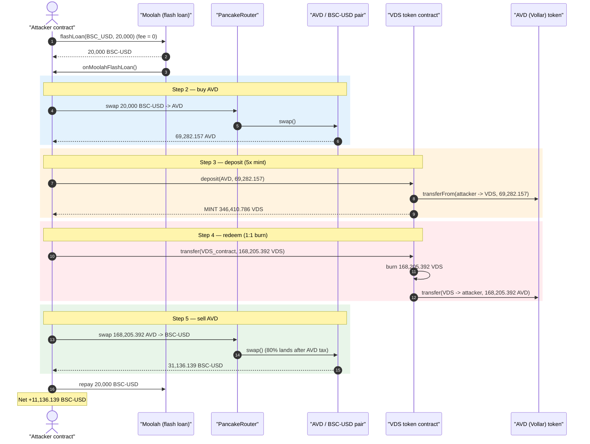
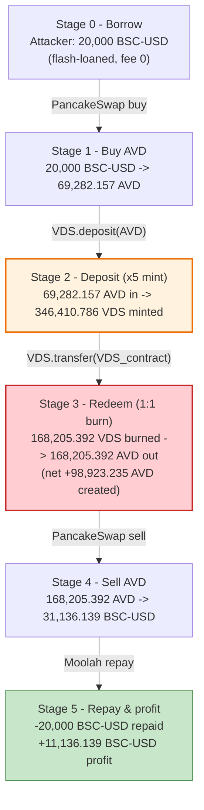
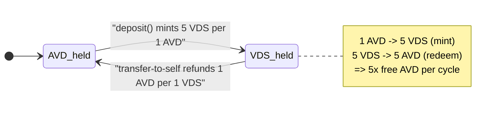

# VDS Exploit — `deposit()` Mints 5× VDS for AVD, Redemption Refunds AVD 1:1

> One-liner: VDS's `deposit(AVD)` mints **5 VDS for every 1 AVD** deposited, while sending VDS back to the
> VDS contract address burns it and returns AVD **1:1** — so the deposit-then-redeem round-trip turns
> 69.3k AVD into ~5× that much AVD for free, netting the attacker **~11,136 USDT** on a zero-fee flash loan.

> **Reproduction:** the PoC compiles & runs in an isolated Foundry project at
> [this project folder](.) (the umbrella DeFiHackLabs repo does not whole-compile, so this PoC was extracted).
> Full verbose trace: [output.txt](output.txt).
> The vulnerable VDS contract and its `deposit` logic-extension are **unverified on BSCScan** — the
> mint/redeem mechanics below are reconstructed from the live execution trace.
> Verified peripheral sources downloaded: the [AVD/Vollar token](sources/Vollar_4Ec93e/AVD_main.sol) and the
> [Moolah flash-loan pool](sources/Moolah_75C42E/src_moolah_Moolah.sol).

---

## Key info

| | |
|---|---|
| **Loss** | ~$11,136 (≈ **11,136.14 BSC-USD**) profit to the attacker, drained from the AVD/BSC-USD PancakeSwap pair |
| **Vulnerable contract** | `VDS` — [`0x6ce69d7146dbaae18c11c36d8D94428623B29D5A`](https://bscscan.com/address/0x6ce69d7146dbaae18c11c36d8d94428623b29d5a#code) (source **unverified**) |
| **Vuln logic extension** | `0x1f428ffB964dE7d906278382bA8902E3290f83a1` (delegatecalled by `deposit`, selector `b70c79f4`, unverified) |
| **Tokens involved** | `AVD` ("AV-Dimension"/Vollar, 6 decimals, fee-on-transfer) `0x4Ec93ee81f25dA3C8e49F01533cfB734545190A8`; `BSC-USD` (USDT) `0x55d398326f99059fF775485246999027B3197955` |
| **Victim pool** | AVD / BSC-USD PancakeSwap pair — `0x7b63B359A9B614fa8A40ED40C7766366e89f6845` |
| **Flash-loan source** | Moolah (Morpho-style, **zero fee**) — proxy `0x8F73b65B4caAf64FBA2aF91cC5D4a2A1318E5D8C`, impl `0x75C42E94dcF40e57AC267FfD4DABF63F97059686` |
| **Attacker EOA** | [`0xa3e18e6028b1ca09433157cd6a5e807ffe705350`](https://bscscan.com/address/0xa3e18e6028b1ca09433157cd6a5e807ffe705350) |
| **Attacker contract** | [`0x383794a0c68e5c8c050f8f361b26a22b3f60eccf`](https://bscscan.com/address/0x383794a0c68e5c8c050f8f361b26a22b3f60eccf) |
| **Attack tx** | [`0x0e01fd8798f970fd689014cb215e622aca8b7c8c243176c5b504e0043402e31f`](https://bscscan.com/tx/0x0e01fd8798f970fd689014cb215e622aca8b7c8c243176c5b504e0043402e31f) |
| **Chain / block / date** | BSC / 54,252,253 (fork block) / **2025-07-16** (block ts `0x6877e1d9` = 17:31:05 UTC) |
| **Compiler (PoC)** | Solidity `^0.8.0` (test built under `evm_version = cancun`) |
| **Bug class** | Broken token economic invariant — asymmetric mint/redeem exchange rate (5:1 mint vs 1:1 redeem) |

---

## TL;DR

`VDS` is a token whose `deposit(token, amount)` lets a user deposit AVD and receive freshly-minted VDS.
From the live trace, the mint rate is **5 VDS per 1 AVD** (depositing `69,282,157,129` AVD minted
`346,410,785,645` VDS — exactly ×5). Separately, **sending VDS to the VDS contract address itself**
(`vds.transfer(VDS_TOKEN, amount)`) acts as a redeem/burn that returns AVD to the sender at a flat
**1:1** rate (sending `168,205,391,822` VDS back returned `168,205,391,822` AVD).

These two rates are inconsistent. A round trip of *deposit AVD → receive 5× VDS → redeem VDS for 1× AVD*
multiplies the attacker's AVD by up to 5× at no cost. The attacker monetizes the surplus AVD by selling
it for BSC-USD on PancakeSwap. The whole sequence is wrapped in a **zero-fee Moolah flash loan** of
20,000 BSC-USD, so the attacker needs essentially no capital.

The attacker:

1. **Flash-borrows** 20,000 BSC-USD from Moolah (no fee).
2. **Buys AVD** on PancakeSwap: 20,000 BSC-USD → 69,282.16 AVD.
3. **Deposits** all 69,282.16 AVD into VDS → mints **346,410.79 VDS** (the 5× mint).
4. **Redeems** 168,205.39 VDS by transferring it to the VDS contract → receives **168,205.39 AVD** back
   (1:1) — already ≈ 2.43× the AVD it bought, using only a fraction of the minted VDS.
5. **Sells** the recovered AVD for BSC-USD: 168,205.39 AVD (80% reaches the pool after AVD's fee-on-transfer
   tax) → 31,136.14 BSC-USD.
6. **Repays** the 20,000 BSC-USD flash loan, keeping **~11,136 BSC-USD** profit.

---

## Background — what the protocol does

**VDS** (`0x6ce6…9D5A`, unverified) is a token paired with **AVD** ("AV-Dimension", symbol `AVD`,
also called *Vollar*). It exposes a `deposit(address token, uint256 amount)` entry point that pulls AVD
from the caller via `transferFrom`, runs internal bookkeeping through a delegatecalled logic extension
(`0x1f428…83a1`, selector `b70c79f4`), and **mints VDS to the caller**. The trace shows the mint amount
is exactly **five times** the AVD pulled in.

VDS also overloads the meaning of "transfer to the contract's own address": when VDS is sent *to the VDS
contract address*, the contract **burns** the incoming VDS (the `Transfer(from, to: 0x0, …)` event at
[output.txt:126](output.txt)) and **sends AVD back** to the sender at a **1:1** ratio (the matching
AVD `transfer` at [output.txt:129-130](output.txt)). This is the intended redeem path, but its exchange
rate (1 AVD per VDS) is the inverse-inconsistent counterpart of the 5-VDS-per-AVD deposit rate.

**AVD / Vollar** ([sources/Vollar_4Ec93e/AVD_main.sol](sources/Vollar_4Ec93e/AVD_main.sol)) is a standard
OpenZeppelin ERC20 with **6 decimals** ([AVD_main.sol → ERC20.sol `decimals()` returns `6`]) and a
**fee-on-transfer** tax. On the live block the tax split on a non-whitelisted `transferFrom` was
≈ 20% total (5% to `contractAres`, 15% to `communityAdres`, 80% delivered) — visible in the three-way
`Transfer` split at [output.txt:148-150](output.txt). The AVD/BSC-USD pair `0x7b63…6845` is where the
attacker converts to and from stablecoins.

**Moolah** ([sources/Moolah_75C42E/src_moolah_Moolah.sol:571-581](sources/Moolah_75C42E/src_moolah_Moolah.sol#L571-L581))
is a Morpho-Blue-style lending market whose `flashLoan` charges **no fee** — it transfers `assets` out,
invokes `onMoolahFlashLoan` on the caller, then pulls back exactly `assets`.

---

## The vulnerable code

The VDS mint/redeem logic is **not verified on BSCScan**, so no Solidity source exists to quote. The
asymmetric exchange rate is, however, unambiguous from the execution trace. The two halves of the bug:

### 1. `deposit` mints 5× VDS for AVD (the 5:1 mint)

From [output.txt:86-124](output.txt) — `deposit(VDS, 69282157129 AVD)`:

```text
[480177] 0x6ce6…9D5A::deposit(0x6ce6…9D5A, 69282157129 [6.928e10])   // 69,282.157 AVD (6dp)
  ├─ AVD.transferFrom(VDS_attacker → VDS_contract, 69282157129)       // pull AVD in
  ├─ 0x1f428…83a1::b70c79f4(...) [delegatecall]                        // logic extension bookkeeping
  └─ emit Transfer(from: 0x0, to: attacker, value: 346410785645)       // ⚠️ MINT 346,410.785 VDS
```

`346,410,785,645 / 69,282,157,129 = 5.000` → **5 VDS minted per AVD deposited.**

### 2. Sending VDS to the VDS contract redeems AVD 1:1 (the 1:1 redeem)

From [output.txt:125-138](output.txt) — `vds.transfer(VDS_TOKEN, 168205391822)`:

```text
[41540] 0x6ce6…9D5A::transfer(0x6ce6…9D5A, 168205391822 [1.682e11])    // send 168,205.39 VDS back
  ├─ emit Transfer(from: attacker, to: 0x0, value: 168205391822)       // ⚠️ BURN the VDS
  └─ AVD.transfer(VDS_contract → attacker, 168205391822)               // ⚠️ REFUND 168,205.39 AVD 1:1
```

`168,205,391,822 AVD returned / 168,205,391,822 VDS burned = 1.000` → **1 AVD refunded per VDS burned.**

The PoC names this exactly ([test/VDS_exp.sol:62-65](test/VDS_exp.sol#L62-L65)):

```solidity
// Step 4: Burn VDS to get AVD back
// Root cause: Sending VDS to its contract address returns AVD at a 1:1 ratio
uint256 amount = 168205391822;
vds.transfer(VDS_TOKEN, amount);
```

### 3. The flash loan that makes it free (verified source)

[sources/Moolah_75C42E/src_moolah_Moolah.sol:571-581](sources/Moolah_75C42E/src_moolah_Moolah.sol#L571-L581):

```solidity
function flashLoan(address token, uint256 assets, bytes calldata data) external whenNotPaused {
    require(assets != 0, ErrorsLib.ZERO_ASSETS);
    emit EventsLib.FlashLoan(msg.sender, token, assets);
    IERC20(token).safeTransfer(msg.sender, assets);          // give 20,000 USDT
    IMoolahFlashLoanCallback(msg.sender).onMoolahFlashLoan(assets, data);  // attacker callback
    IERC20(token).safeTransferFrom(msg.sender, address(this), assets);     // pull back EXACTLY 20,000 — no fee
}
```

---

## Root cause — why it was possible

The protocol uses **two different, hard-coded exchange rates for the same AVD⇄VDS pair**:

- **Mint side** (`deposit`): 1 AVD → **5 VDS**.
- **Redeem side** (transfer-to-self burn): 1 VDS → **1 AVD**.

For any closed-loop pricing this is a contradiction. Composing the two operations gives a strictly
profitable cycle:

> Deposit `A` AVD → receive `5A` VDS → redeem those `5A` VDS → receive `5A` AVD.

The redeem rate (1 AVD/VDS) values each VDS at far more AVD than the mint cost (1 VDS = 0.2 AVD). A user
who only deposits and redeems multiplies their AVD by 5× per cycle, limited only by the AVD the VDS
contract actually holds to honor redemptions (and by AVD's transfer tax eroding the take). The attacker
did not even need a full cycle — redeeming **168,205 VDS** out of the **346,410 VDS** minted (under half)
already returned **168,205 AVD**, ≈ 2.43× the **69,282 AVD** they had purchased.

Contributing design decisions that turn the rate mismatch into a one-shot drain:

1. **Permissionless, capital-free entry.** `deposit` and the transfer-to-self redeem are open to anyone,
   and the only capital needed (20,000 BSC-USD) comes from a **zero-fee** Moolah flash loan — there is no
   collateral, lockup, or rate-limit guarding the round trip.
2. **The redeem is paid out of the VDS contract's own AVD reserve.** Each cycle siphons real AVD held by
   the protocol; that AVD is then dumped on the AVD/BSC-USD pool for stablecoins, so the loss ultimately
   lands on the pool's liquidity and the VDS treasury.
3. **No invariant check** ties the deposit and redeem rates together (e.g., a single `priceOfVDS`), so the
   contradiction is never caught.

---

## Preconditions

- The VDS contract holds enough **AVD** to honor the redemption (it transferred out 168,205.39 AVD, and at
  [output.txt:127-128](output.txt) it still held 190,441.81 AVD after the mint — comfortably enough).
- An AVD/BSC-USD PancakeSwap pair with liquidity to (a) buy AVD with the borrowed USDT and (b) sell the
  recovered AVD back to USDT. Pair `0x7b63…6845` held ≈ 57,274 USDT / 268,183 AVD initially.
- A zero/low-fee flash-loan source for working capital — Moolah's `flashLoan` here charges **0 fee**, so the
  attack is fully self-funding within one transaction.
- AVD's transfer tax (≈ 20% on the final sell-in) only *reduces* the take; it is not a blocker.

---

## Attack walkthrough (with on-chain numbers from the trace)

All figures are taken directly from the events/returns in [output.txt](output.txt). AVD has 6 decimals;
BSC-USD/VDS amounts are shown in human units. The attacker contract is the address labeled `VDS`
(`0x7FA9385bE102ac3EAc297483Dd6233D62b3e1496`) in the trace (the test contract).

| # | Step | Concrete amounts | Source |
|---|------|------------------|--------|
| 0 | Start: attacker holds ~26.54 BSC-USD | before balance 26.542161… USDT | [output.txt:22](output.txt) |
| 1 | **Flash loan** 20,000 BSC-USD from Moolah (fee = 0) | `flashLoan(BSC_USD, 20,000e18)` | [output.txt:28-37](output.txt) |
| 2 | **Buy AVD**: 20,000 BSC-USD → AVD on Pancake | out = **69,282.157 AVD** (pool 268,183→198,901 AVD / 57,274→77,274 USDT) | [output.txt:43-70](output.txt) |
| 3 | **Deposit** 69,282.157 AVD into VDS | mints **346,410.786 VDS** (×5 the AVD) | [output.txt:86-124](output.txt) |
| 4 | **Redeem** 168,205.392 VDS → VDS contract | burns VDS, refunds **168,205.392 AVD** (1:1) | [output.txt:125-138](output.txt) |
| 5 | **Sell AVD**: 168,205.392 AVD → BSC-USD on Pancake | 80% (134,564.313 AVD) reaches pool after AVD tax → **31,136.139 BSC-USD** out (pool 198,901→333,465 AVD / 77,274→46,138 USDT) | [output.txt:146-180](output.txt) |
| 6 | **Repay** 20,000 BSC-USD to Moolah | `transferFrom(attacker → Moolah, 20,000e18)` | [output.txt:185-192](output.txt) |
| 7 | End: attacker holds ~11,162.68 BSC-USD | after balance 11,162.681… USDT | [output.txt:198-201](output.txt) |

**The core arithmetic of the bug (step 3 vs step 4):**

```
deposit:  69,282.157 AVD  ──×5──►  346,410.786 VDS
redeem:  168,205.392 VDS  ──×1──►  168,205.392 AVD     (only 48.6% of minted VDS used)
net AVD: 168,205.392 − 69,282.157 = +98,923.235 AVD created from nothing
```

### Profit / loss accounting (BSC-USD)

| Direction | Amount (BSC-USD) |
|---|---:|
| Borrowed (flash loan, repaid) | 20,000.000 |
| Received — sell recovered AVD | 31,136.139 |
| Repaid — flash loan principal | −20,000.000 |
| **Gross profit** | **+11,136.139** |
| Attacker balance before | 26.542 |
| Attacker balance after | 11,162.681 |
| **Net attacker delta** | **+11,136.139** |

The net wallet delta (11,162.681 − 26.542 = **11,136.139**) equals the gross profit to the wei,
confirming the flash loan netted out perfectly.

---

## Diagrams

### Sequence of the attack



### AVD balance evolution across the round trip



### The rate contradiction at the heart of the bug



---

## Why each magic number

- **`20,000 ether` flash loan** — enough BSC-USD to buy a meaningful chunk of AVD without moving the
  AVD/BSC-USD pool so much that slippage erases the edge. Since Moolah charges no fee, the size is bounded
  only by what the attacker can profitably round-trip.
- **`168205391822` VDS redeemed (Step 4)** — the attacker minted 346,410.786 VDS but only redeems
  168,205.392 of them. This is chosen so the recovered AVD, *after AVD's ≈20% transfer tax on the sell*,
  clears the most BSC-USD the pool can give without over-slipping; it is well under the AVD the VDS
  contract holds (190,441.81 AVD post-mint), so the 1:1 refund is fully honored.
- **`block.timestamp` deadlines** — the PancakeSwap calls pass `block.timestamp` directly as the deadline,
  which always passes in-block.

---

## Remediation

1. **Use one consistent exchange rate.** The deposit-mint rate and the redeem-burn rate must be inverses of
   each other (if `deposit` mints `r` VDS per AVD, redeem must return `1/r` AVD per VDS). Hard-coding 5:1 on
   mint and 1:1 on redeem is the entire bug. Derive both directions from a single stored price/ratio.
2. **Do not overload transfer-to-self as a redeem.** Implementing redemption as "send the token to its own
   address" is fragile and easy to mis-rate. Use an explicit `redeem(amount)` function with an auditable
   price and slippage/limit checks.
3. **Rate-limit or bound mint/redeem.** Cap the AVD redeemable per transaction/block and require that
   `deposit`→`redeem` round trips cannot net positive value, so flash-loan-funded cycles cannot extract
   the contract's AVD reserve.
4. **Account against backing.** Track the AVD backing each VDS so that VDS can never be minted for less
   AVD than it can later be redeemed for; reject any operation that would let total redeemable AVD exceed
   total deposited AVD.
5. **Verify and audit the contract.** The VDS contract and its `b70c79f4` logic extension are unverified;
   shipping unaudited, unverified mint/redeem math is what allowed a trivially inconsistent rate to reach
   production.

---

## How to reproduce

The PoC was extracted into a standalone Foundry project (the umbrella DeFiHackLabs repo has many unrelated
PoCs that fail to compile under a whole-project `forge test`):

```bash
_shared/run_poc.sh 2025-07-VDS_exp -vvvvv
```

- RPC: a **BSC archive** endpoint is required (fork block 54,252,253). `foundry.toml` uses
  `https://bsc-mainnet.public.blastapi.io`, which serves historical state at that block; the default
  public RPC (`onfinality`) pruned it and failed with
  `historical state … is not available`.
- Result: `[PASS] testExploit()` with the attacker's BSC-USD balance rising from ~26.54 to ~11,162.68
  (profit ≈ **11,136 BSC-USD**).

Expected tail:

```
Ran 1 test for test/VDS_exp.sol:VDS
[PASS] testExploit() (gas: 751867)
  Attacker Before exploit USDT Balance: 26.542161622221038197
  Attacker After exploit USDT Balance: 11162.681107917725001605
Suite result: ok. 1 passed; 0 failed; 0 skipped
```

---

*Reference: SlowMist — https://x.com/SlowMist_Team/status/1945672192471302645 (VDS, BSC, ~$13K reported / ~$11.1K realized in-tx).*
