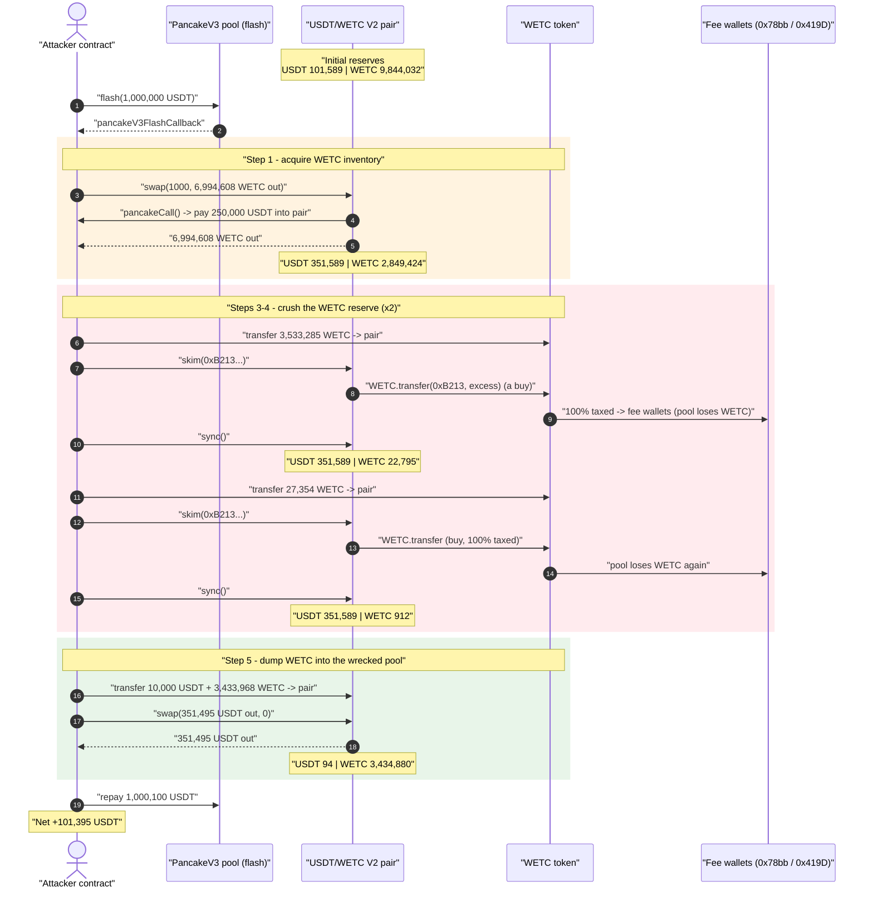
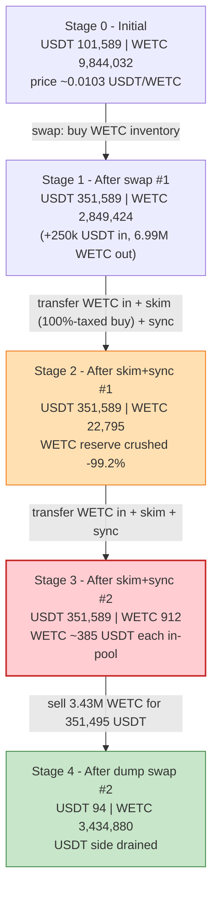
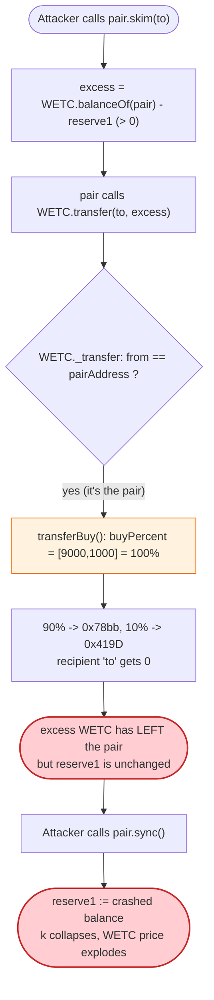

# WETC Token Exploit — Fee-on-Transfer + `skim`/`sync` Reserve Drain

> One-liner: WETC's transfer-tax routes **100% of any "buy" (transfer *from* the pair) away to fee wallets**, so calling PancakeSwap's `skim()` repeatedly silently deletes WETC from the pool's balance; a following `sync()` writes the collapsed balance into the reserves, detonating the price so the attacker can dump WETC for ~101k USDT.

> **Reproduction:** the PoC compiles & runs in an isolated Foundry project at
> [this project folder](.) (the umbrella DeFiHackLabs repo does not whole-compile, so this PoC was extracted).
> Full verbose trace: [output.txt](output.txt).
> Verified vulnerable source: [contracts_WETC.sol](sources/WETC_E7f12B/contracts_WETC.sol).

---

## Key info

| | |
|---|---|
| **Loss** | ~$101k — attacker walked off with **101,421.95 USDT** (net **+101,395.4 USDT**) drained from the BUSD/WETC (USDT-paired) PancakeSwap V2 pool |
| **Vulnerable contract** | `WETC` — [`0xE7f12B72bfD6E83c237318b89512B418e7f6d7A7`](https://bscscan.com/address/0xE7f12B72bfD6E83c237318b89512B418e7f6d7A7#code) |
| **Victim pool** | USDT/WETC PancakeSwap V2 pair — `0x8e2cc521b12dEBA9A20EdeA829c6493410dAD0E3` (named `busd_wetc_cakeLP` in the PoC, but `token0 = USDT 0x55d3…7955`) |
| **Flash-loan source** | PancakeSwap V3 pool `0x92b7807bF19b7DDdf89b706143896d05228f3121` (1,000,000 USDT, 0.01% fee) |
| **Attacker EOA / contract** | `0x7e7c1f0d567c0483f85e1d016718e44414cdbafe` |
| **Fee-sink wallets** | `0x78bb09F285fa0b4005E131124175F50627347a5a` (90% buy / 18% sell), `0x419D7E35CAA34487a575dEc6C7aB74699b6BDe49` (10% buy / 2% sell) |
| **Attack tx** | [`0x2b6b411adf6c452825e48b97857375ff82b9487064b2f3d5bc2ca7a5ed08d615`](https://bscscan.com/tx/0x2b6b411adf6c452825e48b97857375ff82b9487064b2f3d5bc2ca7a5ed08d615) |
| **Chain / block / date** | BSC / 54,333,337 / 2025-07-17 |
| **Compiler** | Solidity v0.8.17, optimizer **200 runs** |
| **Bug class** | Broken AMM invariant via fee-on-transfer token + permissionless `skim`/`sync` reserve desync |

---

## TL;DR

`WETC` is a tax token. Its `_transfer` override taxes any transfer **out of the pair** as a "buy"
(`transferBuy`, [contracts_WETC.sol:104-117](sources/WETC_E7f12B/contracts_WETC.sol#L104-L117)) and
any transfer **into the pair** as a "sell" (`transferSell`, [:119-138](sources/WETC_E7f12B/contracts_WETC.sol#L119-L138)).
At the attacked block the buy tax was configured as `buyPercent = [9000, 1000]` — i.e. **90% + 10% = 100%**
of the bought amount is siphoned to two fee wallets, leaving the buyer **0**.

PancakeSwap's `skim(to)` ([PancakePair.sol:483-488](sources/PancakePair_8e2cc5/PancakePair.sol#L483-L488))
sends the pair's *excess* WETC (balance − reserve) to `to` via `WETC.transfer(to, excess)`. Because the
sender is the pair, WETC treats this as a **"buy" and taxes it 100%** — the entire excess leaves the pair
to the fee wallets, the recipient gets ~0, and the pair's *real* WETC balance drops far below its recorded
`reserve1`. A subsequent `sync()` ([:491-493](sources/PancakePair_8e2cc5/PancakePair.sol#L491-L493)) then
overwrites `reserve1` with the now-tiny balance.

The attacker repeats *transfer-WETC-in → skim → sync* to crush the pool's WETC reserve from **2,849,424 → 22,795 → 912**
while holding the USDT reserve at **351,588** — i.e. it makes WETC astronomically expensive inside the pool
— then sells WETC back into the wrecked pool for **351,495 USDT** out, repays the 1,000,100 USDT flash loan,
and keeps the difference. Net profit ≈ **101,395 USDT**.

---

## Background — what WETC does

`WETC` ([source](sources/WETC_E7f12B/contracts_WETC.sol)) is an OpenZeppelin `ERC20` + `AccessControlEnumerable`
with a hand-rolled transfer-tax bolted onto `_transfer`:

- **Buy tax** (`from == pairAddress`): `transferBuy` splits the amount by `buyPercent[]` to `buyAddress[]`
  and forwards only the remainder to the buyer.
- **Sell tax** (`to == pairAddress`): `transferSell` splits by `sellPercent[]` to `sellAddress[]`, with an
  extra "price-decline" surcharge path (`checkDayDf`) when the day's price has fallen.
- **Liquidity detection** (`_isLiquidity`, [:191-204](sources/WETC_E7f12B/contracts_WETC.sol#L191-L204)):
  compares the pair's recorded `reserve0` against its live `balanceOf` to guess add/remove-liquidity and
  skip taxing those.

The on-chain tax configuration at the fork block (read via `cast`):

| Parameter | Value | Meaning |
|---|---|---|
| `buyPercent` | `[9000, 1000]` | **90% + 10% = 100%** tax on every buy |
| `buyAddress` | `[0x78bb…7a5a, 0x419D…De49]` | both fee wallets, **neither is the buyer** |
| `sellPercent` | `[1800, 200]` | 18% + 2% = 20% tax on every sell |
| `sellAddress` | `[0x78bb…7a5a, 0x419D…De49]` | same two fee wallets |
| `pairAddress` | `0x8e2cc5…d0E3` | the USDT/WETC pair |
| `delinePercent` / `hdPercent` | `1000` / `2000` | price-decline surcharge knobs |

The single fatal fact: **a "buy" is taxed 100% and the proceeds go to wallets other than the recipient.**
Any code path that makes the *pair itself* the `from` of a WETC transfer — exactly what `skim()` does — will
have 100% of that transfer evaporate out of the pool.

---

## The vulnerable code

### 1. `transferBuy` taxes 100% and routes it away from the recipient

```solidity
// from == pairAddress  ⇒  this branch (a "buy")
function transferBuy(address from,address to,uint256 amount) internal{
    checkDayDf();
    uint256 price1 = amount * buyPercent[0] / 10000;   // 90%
    if(price1>0){ super._transfer(from, buyAddress[0], price1); }   // → 0x78bb…
    uint256 price2 = amount * buyPercent[1] / 10000;   // 10%
    if(price2>0){
        super._transfer(from, buyAddress[1], price2);  // → 0x419D…
        emit NodeInfo(from,1,price2);
    }
    amount = amount - price1 - price2;                 // 100% taxed ⇒ amount = 0
    super._transfer(from, to, amount);                 // recipient gets 0
}
```

[contracts_WETC.sol:104-117](sources/WETC_E7f12B/contracts_WETC.sol#L104-L117)

When `from` is the pair, every wei of the transfer leaves the pair (90% + 10% to the fee wallets) and the
nominal recipient receives nothing.

### 2. The router into that branch — `_transfer`

```solidity
function _transfer(address from, address to, uint256 amount) internal override {
    ...
    if(from == pairAddress){          //买入 = buy
        transferBuy(from,to,amount);
    }else if(to == pairAddress){      //卖出 = sell
        transferSell(from,to,amount);
    }else{
        super._transfer(from,to,amount);
    }
    ...
}
```

[contracts_WETC.sol:53-88](sources/WETC_E7f12B/contracts_WETC.sol#L53-L88)

### 3. The AMM hooks the attacker abuses — `skim` and `sync`

```solidity
// force balances to match reserves
function skim(address to) external lock {
    _safeTransfer(_token0, to, IERC20(_token0).balanceOf(address(this)).sub(reserve0));
    _safeTransfer(_token1, to, IERC20(_token1).balanceOf(address(this)).sub(reserve1)); // WETC.transfer ⇒ taxed 100%
}
// force reserves to match balances
function sync() external lock {
    _update(IERC20(token0).balanceOf(address(this)), IERC20(token1).balanceOf(address(this)), reserve0, reserve1);
}
```

[PancakePair.sol:483-493](sources/PancakePair_8e2cc5/PancakePair.sol#L483-L493)

`skim`'s second `_safeTransfer` is a `WETC.transfer(to, excess)` *from the pair*. Inside WETC that is a "buy",
so the `excess` is taxed 100% away to the fee wallets — it never reaches `to`, **but it does leave the pair**.
The pair's WETC balance silently drops below `reserve1`, and `sync()` then commits that lower balance as the
new reserve. No USDT moves, so the constant product `k` collapses in the attacker's favor.

---

## Root cause — why it was possible

Two designs that are individually plausible compose into a critical bug:

1. **A fee-on-transfer token whose tax can be 100% and is routed to third parties.** PancakeSwap V2 pairs
   assume `token.transfer(to, x)` moves `x` from the pair to `to`. WETC violates this for any transfer where
   `from == pair`: with `buyPercent` summing to 10000 bps, `transfer(to, x)` moves `x` *out of the pair* but
   delivers 0 to `to` and `x` to unrelated wallets. The pair's invariant "balance only changes by amounts I
   can account for" is broken.

2. **Permissionless `skim()` + `sync()` that trust the token's `balanceOf`.** `skim` is meant to rake off
   *donated* excess; `sync` is meant to true-up reserves to balances. Both are unprotected and both call into
   the malicious token. By calling `skim(arbitrary)` the attacker forces the pair to "buy-tax-burn" its own
   WETC out of existence (from the pool's perspective), then `sync()` ratifies the loss into the reserves.

Concretely, every *transfer-WETC-in → skim → sync* cycle does this:

> Attacker sends WETC into the pair (pushing `balance > reserve1`). `skim(x)` then transfers the excess out of
> the pair as a "buy" — 100% taxed, so it lands in the fee wallets, not the pool and not the recipient. The
> pair's WETC balance is now *below* its recorded `reserve1`. `sync()` overwrites `reserve1` with the smaller
> balance. The pool now thinks it has far less WETC than it did, while its USDT is untouched — WETC's pool
> price moons. Repeat to amplify, then sell WETC into the broken pool to extract USDT.

Note also a latent second bug: the whitelist branch ([:61-63](sources/WETC_E7f12B/contracts_WETC.sol#L61-L63))
does `super._transfer` **without `return`**, so a whitelisted transfer would fall through and transfer again.
It is not on the exploited path (neither the pair nor the attacker is whitelisted, `whiteAddress = 0` for both)
but it underscores how unreviewed the transfer logic was.

---

## Preconditions

- WETC's `buyPercent` configured to total 100% (or close), with `buyAddress` ≠ recipient — true at the block:
  `buyPercent = [9000, 1000]`.
- Permissionless `skim` / `sync` on the pair — true (standard PancakeSwap V2).
- Enough WETC on hand to seed the pair before each `skim`, plus USDT working capital to cover the initial swap.
  All of it is **flash-loanable**: the PoC borrows 1,000,000 USDT from a PancakeSwap V3 pool
  ([WETC_Token_exp.sol:40](test/WETC_Token_exp.sol#L40)) and repays it in the same transaction.
- The attacker obtains its initial WETC inventory by buying 6,994,608 WETC out of the pool in the first swap
  (paid for with 250,000 USDT of the flash loan inside `pancakeCall`).

---

## Attack walkthrough (with on-chain numbers from the trace)

The pair's `token0 = USDT`, `token1 = WETC`, so `reserve0 = USDT`, `reserve1 = WETC`. All figures are taken
directly from the `Sync` / `getReserves` / `Swap` events in [output.txt](output.txt).

| # | Step (trace line) | USDT reserve | WETC reserve | Effect |
|---|---|---:|---:|--------|
| 0 | **Initial** (getReserves L1606) | 101,588.97 | 9,844,031.52 | Honest pool. |
| 1 | **Flash loan** 1,000,000 USDT from V3 pool (L1581) | — | — | Working capital acquired. |
| 2 | **Swap #1**: `swap(1000, 6,994,608 WETC out)`; inside `pancakeCall` the attacker pays 250,000 USDT into the pair (L1595-1632) | 351,588.97 | 2,849,423.60 | Attacker now holds ~6.99M WETC; pool re-priced by the swap. |
| 3 | **Transfer 3,533,285 WETC → pair** (sell, 20%-taxed) then **`skim(0xB213…)`** then **`sync()`** (L1633-1697) | 351,588.97 | **22,795.39** | `skim` "buys" the excess 100%-taxed out of the pair; `sync` commits the crashed balance. WETC reserve −99.2%. |
| 4 | **Transfer 27,354 WETC → pair** then **`skim`** then **`sync()`** (L1698-1762) | 351,588.97 | **911.82** | Second amplification cycle. WETC reserve −96%. |
| 5 | **Transfer 10,000 USDT + 3,433,968 WETC → pair**, then **Swap #2**: `swap(351,495 USDT out, 0)` paying 3,433,968 WETC in (L1763-1796) | 93.57 | 3,434,880.00 | With WETC reserve crushed to ~912, dumping WETC buys out almost the entire 351,588 USDT reserve. Attacker receives **351,495 USDT**. |
| 6 | **Repay flash loan**: transfer 1,000,100 USDT to V3 pool (L1797-1814) | — | — | 1,000,000 principal + 100 USDT (0.01%) fee. |

The WETC reserve collapse in steps 3-4 is the whole attack: USDT stays pinned at 351,588 while WETC drops
9,844,031 → 2,849,424 (swap) → 22,795 → 912. At a 912-WETC / 351,588-USDT pool, WETC is priced ~385 USDT each
inside the pool, so the attacker's 3.43M WETC dump immediately empties the USDT side.

### Profit accounting (USDT)

| Item | Amount (USDT) |
|---|---:|
| Flash-loan principal borrowed | 1,000,000.00 |
| Paid into pair during swap #1 (`pancakeCall`) | 250,000.00 |
| Received from swap #2 (USDT out) | 351,495.40 |
| Flash-loan repayment (principal + 0.01% fee) | 1,000,100.00 |
| Attacker USDT before | 26.54 |
| **Attacker USDT after** | **101,421.95** |
| **Net profit** | **≈ +101,395.40** |

(`Attacker Before exploit USDT Balance: 26.54` / `Attacker After exploit USDT Balance: 101,421.95` —
[output.txt:1564-1565](output.txt).)

---

## Diagrams

### Sequence of the attack



### Pool reserve evolution



### Why `skim` drains the pool — the 100% buy-tax trap



---

## Remediation

1. **Never set a transfer tax to 100%, and never route a "buy" tax away from the buyer.** A tax that consumes
   the entire transferred amount turns every `token.transfer` from a holder (including an AMM pair) into a net
   outflow to third parties — which is exactly what breaks the pair accounting. Cap total tax well below 100%
   and validate `buyPercent.sum() < 10000` in `setConfig`.
2. **Exempt the pair (and the token's own privileged transfers) from tax**, or — better — do not implement
   fee-on-transfer at all for a token that is LP'd on a standard V2 AMM. PancakeSwap/Uniswap V2 pairs are not
   designed for tokens whose `transfer` can deliver less (or zero) than requested out of the pair.
3. **Treat `skim`/`sync` as adversarial.** Because they are permissionless and call back into the token, a
   malicious or buggy token can desync reserves at will. A fee-on-transfer token should make the pair's own
   transfers tax-free so `skim`'s `transfer(to, excess)` actually delivers `excess` to `to` and leaves reserves
   consistent.
4. **Fix the whitelist fall-through.** The `whiteAddress` branch in `_transfer`
   ([:61-63](sources/WETC_E7f12B/contracts_WETC.sol#L61-L63)) lacks a `return`, double-processing whitelisted
   transfers; add `return;` after the `super._transfer`.
5. **Use a manipulation-resistant price source.** Any logic that reads the pair's instantaneous reserves
   (`getLinePrice`, `checkDayDf`) is trivially manipulable inside one transaction; use a TWAP/oracle.

---

## How to reproduce

The PoC was extracted into a standalone Foundry project (the umbrella DeFiHackLabs repo has several unrelated
PoCs that fail to compile under a whole-project `forge build`):

```bash
_shared/run_poc.sh 2025-07-WETC_Token_exp -vvvvv
```

- RPC: a **BSC archive** endpoint is required (fork block 54,333,337). `foundry.toml` uses
  `https://bsc-mainnet.public.blastapi.io`, which serves historical state at that block; most pruned public BSC
  RPCs fail with `header not found` / `missing trie node`.
- Result: `[PASS] testExploit()` with attacker USDT rising from 26.54 → 101,421.95.

Expected tail:

```
[PASS] testExploit() (gas: 376695)
  Attacker Before exploit USDT Balance: 26.542161622221038197
  Attacker After exploit USDT Balance: 101421.945731742335963396

Suite result: ok. 1 passed; 0 failed; 0 skipped
```

---

*Reference: post-mortem — https://t.me/evmhacks/78?single (WETC, BSC, ~$101K).*
