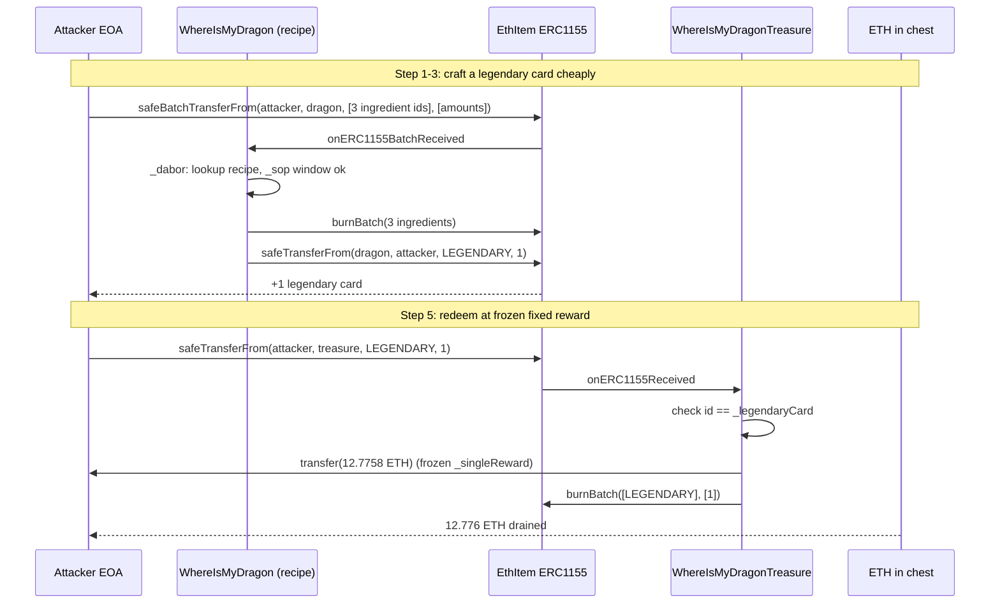
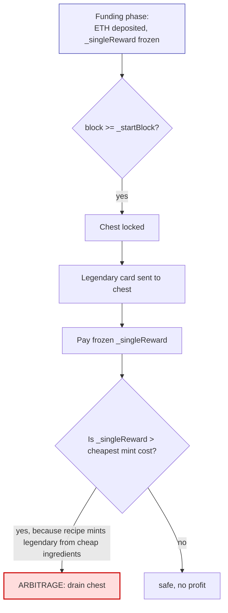

# WhereIsMyDragonTreasure — fixed redemption reward larger than the recipe cost to mint a legendary card
> **Vulnerability classes:** vuln/logic/price-calculation · vuln/logic/wrong-condition · vuln/oracle/price-manipulation
> **Reproduction:** the PoC compiles & runs in an isolated Foundry project at [this project folder](.). Full verbose trace: [output.txt](output.txt). Vulnerable contract `WhereIsMyDragonTreasure` and recipe contract `WhereIsMyDragon` are both source-verified on Etherscan (Solidity 0.7.4); sources are vendored under [sources/](sources).
---
## Key info
| | |
|---|---|
| **Loss** | $47,461.35 (≈ 12.776 ETH, the full `singleReward`) |
| **Vulnerable contract** | `WhereIsMyDragonTreasure` — [`0x32c87193C2cC9961F2283FcA3ca11A483d8E426B`](https://etherscan.io/address/0x32c87193C2cC9961F2283FcA3ca11A483d8E426B) |
| **Recipe / minting contract** | `WhereIsMyDragon` — [`0x87AD9009C4Fd0AAa7bFE74f7E00845B3f09aD0CE`](https://etherscan.io/address/0x87AD9009C4Fd0AAa7bFE74f7E00845B3f09aD0CE) |
| **Attacker EOA** | [`0x8b88A3b92433638324E5f429bEe52b1fd84E7c5a`](https://etherscan.io/address/0x8b88A3b92433638324E5f429bEe52b1fd84E7c5a) |
| **Attack contract** | [`0xd73c37d235b6032b21ADAF7F6dE73BDbc31667B2`](https://etherscan.io/address/0xd73c37d235b6032b21ADAF7F6dE73BDbc31667B2) |
| **Attack tx** | [`0x2154dd30d2bdd53b233d862ecd665c3a69c7a849cb498b724f622d9cb42771fc`](https://etherscan.io/tx/0x2154dd30d2bdd53b233d862ecd665c3a69c7a849cb498b724f622d9cb42771fc) |
| **Chain / block / date** | Ethereum mainnet / `23,000,243` / 2025-07 |
| **Compiler** | `v0.7.4+commit.3f05b770`, optimizer enabled, 200 runs (both contracts) |
| **Bug class** | The treasure paid a fixed per-card ETH reward computed once at funding time, while the legendary card could be acquired by burning cheap ingredients through an unrelated recipe contract — the reward price was never reconciled against the cheapest minting cost. |

## TL;DR

`WhereIsMyDragonTreasure` is a "treasure chest" side contract of the *WhereIsMyDragon* NFT-card game. Players who manage to obtain the game's **legendary card** can send it to the treasure contract; the contract burns the card and pays out a fixed ETH reward (`_singleReward`) per unit burned. The reward is set once during the funding phase: whoever seeds the chest with ETH implicitly fixes `_singleReward = address(this).balance / _legendaryCardAmount`. After `_startBlock`, that number is frozen and `onERC1155Received` pays `from` exactly `_singleReward * amount` for every legendary card surrendered.

The flaw is a pure **price-arbitrage / broken-invariant** bug: the legendary card is *not* only obtainable by rare drops or expensive primary minting. A separate contract, `WhereIsMyDragon`, implements a **recipe combiner**: anyone holding the right three ingredient cards (in the right amounts) can batch-transfer them to `WhereIsMyDragon`, which burns the inputs and mints/transfers **one legendary card back to the caller** (`_dabor` → `IEthItem.safeTransferFrom(address(this), fal, ter, 1, "")`). The ingredient cards were cheaply acquirable, so the effective cost to produce one legendary card was far below the frozen `_singleReward`.

The attacker held a stock of ingredient cards (some pre-acquired, some sourced via the open recipe path). In a single transaction they ran the recipe combiner 23 times across three recipes (`_sendRecipeA` ×15, `_sendRecipeB` ×7, `_sendRecipeC` ×1) to satisfy the legendary-card output recipe, then transferred the freshly minted legendary card to `WhereIsMyDragonTreasure`. The treasure's `onERC1155Received` burned it and sent `12,775,839,441,940,405,641` wei (≈ 12.776 ETH, ≈ $47,461) to the attacker — draining the chest. The PoC asserts both that exactly one legendary card was minted (`legendaryBefore + 1 ether`) and that the ETH delta equals `SINGLE_REWARD` exactly ([test/WhereIsMyDragonTreasure_exp.sol](test/WhereIsMyDragonTreasure_exp.sol)).

## Background — what WhereIsMyDragon / WhereIsMyDragonTreasure does

**WhereIsMyDragon** (`0x87AD…0CE`) is an EthItem-based ERC-1155 card game. Cards are wrapped as ERC-1155 objects inside a single EthItem token (`0xb6ab…0EBf`); each card "type" is identified by an `objectId == uint160(cardWrapperAddress)`. The game logic is deliberately obfuscated (variable names like `_bor`, `_lid`, `_baskin`, `_gel`, `_sic`), but the meaningful behavior is a **recipe/crafting system**:

- The owner registers **recipes** while `_san != 0` (admin-gated, via `_doz`). A recipe is a triple of `(cardId, amount)` ingredient slots that maps to one **output card id** `cik[mat]`. The mapping is stored in `_bor[id0][amt0][id1][amt1][id2][amt2] = outputId`. If the output is the legendary card (`_gel`), a per-recipe unlock window is also recorded in `_lid` and `_sagar`/`_dolbur`/`_baskin` (a block-number release schedule).
- After the owner renounces control (`get()` sets `_san = address(0)`), the contract enters **open-combine mode**. Anyone can batch-transfer three ingredient cards (ids + amounts) to the contract; `_dabor` looks up the recipe, checks the legendary-card release window in `_sop`, burns the three inputs in `_irn`, and **transfers one unit of the output card to the caller** (`IEthItem(_frid).safeTransferFrom(address(this), fal, ter, 1, "")`).

So the legendary card — the rarest game item — is reproducible by anyone who can assemble the right three ingredients in the right quantities.

**WhereIsMyDragonTreasure** (`0x32c8…426B`) is a separate, much smaller contract. It is an `IERC1155Receiver` that:

1. During the **funding phase** (`block.number < _startBlock`), any ETH sent to it via `receive()` fixes the reward: `_singleReward = address(this).balance / _legendaryCardAmount`.
2. After `_startBlock`, `receive()` refunds the sender (the chest is "locked").
3. Once locked, sending the legendary card (`_legendaryCard`) to the chest triggers `onERC1155Received → _checkBurnAndTransfer`, which (a) requires `msg.sender == _source` (the EthItem token), (b) requires each received id to equal `_legendaryCard`, (c) pays `payable(from).transfer(_singleReward * amounts[i])`, and (d) burns the received card.

The intended invariant: *the ETH reward per legendary card should exceed the hardest possible cost of legitimately obtaining a legendary card.* The contract never checks this — it trusts a one-time balance snapshot.

## The vulnerable code

### `_singleReward` is fixed once, from a balance snapshot, and never re-validated

From [sources/WhereIsMyDragonTreasure_32c871/WhereIsMyDragonTreasure.sol](sources/WhereIsMyDragonTreasure_32c871/WhereIsMyDragonTreasure.sol):

```solidity
// The reward is set ONCE, during the funding phase, from a raw balance snapshot.
// No oracle, no minting-cost reference, no sanity bound.
receive() external payable {
    if(block.number >= _startBlock) {
        payable(msg.sender).transfer(msg.value);   // locked: refund
        return;
    }
    _singleReward = address(this).balance / _legendaryCardAmount;  // frozen here
}
```

```solidity
// After lock, each legendary card surrendered pays the frozen reward, blindly.
function _checkBurnAndTransfer(address from, uint256[] memory objectIds, uint256[] memory amounts) private {
    require(msg.sender == _source, "Unauthorized Action");
    require(block.number >= _startBlock, "Redeem Period still not started");
    for(uint256 i = 0; i < objectIds.length; i++) {
        require(objectIds[i] == _legendaryCard, "Wrong Card!");
        _redeemed += amounts[i];
        payable(from).transfer(_singleReward * amounts[i]);   // <-- fixed payout
    }
    IEthItem(_source).burnBatch(objectIds, amounts);
}
```

Two problems are visible immediately: (1) `_singleReward` is derived purely from the funding balance and is never recomputed against the live cost of producing a legendary card; (2) `_checkBurnAndTransfer` only verifies that the received token *is* the legendary card — it does not care **how** the caller obtained it. There is no per-user cooldown, no per-recipe accounting, no link back to the recipe contract.

### The recipe combiner mints legendary cards from cheap ingredients (the attacker's path)

From [sources/WhereIsMyDragon_87AD90/WhereIsMyDragon.sol](sources/WhereIsMyDragon_87AD90/WhereIsMyDragon.sol), open-combine path (active after owner renunciation):

```solidity
function onERC1155BatchReceived(
    address, address fal, uint256[] memory cik, uint256[] memory hse, bytes memory
) public virtual override returns (bytes4) {
    require(msg.sender == _frid);                 // caller must be the EthItem token
    if(_san != address(0)) {
        // ... admin recipe-registration path (_doz) ...
    } else {
        _dabor(fal, cik, hse, block.number);      // <-- open combine, used by attacker
    }
    return this.onERC1155BatchReceived.selector;
}

function _dabor(address fal, uint256[] memory cik, uint256[] memory hse, uint256 sog) private {
    require(_san == address(0));                  // owner renounced
    require(cik.length >= RAG && ((cik.length % RAG) == 0));   // RAG == 3
    for(uint256 i = 0; i < cik.length; i+= RAG) {
        (uint256 bil, uint256 cul, uint256 mar) = _moler(cik, i);   // sort 3 slots
        uint256 ter = _bor[cik[bil]][hse[bil]][cik[cul]][hse[cul]][cik[mar]][hse[mar]]; // lookup recipe
        _sop(cik, hse, bil, cul, mar, ter, sog);  // legendary-window gate
        _irn(cik, hse, bil, cul, mar);            // burn the 3 ingredients
        IEthItem(_frid).safeTransferFrom(address(this), fal, ter, 1, "");  // mint/output 1 card to caller
    }
}
```

When `ter == _gel` (the recipe outputs the legendary card), `_sop` only enforces a **block-number release window** (`_sagar[postadel]` … `_dolbur`) and a one-shot `_franco[postadel]` flag per recipe slot. It does **not** price-gate the recipe. After the window opens, any caller with the three ingredients can produce one legendary card per recipe slot — and the ingredient cards themselves were cheaply obtainable (low-rarity drops / other recipes / market).

## Root cause — why it was possible

1. **Reward price is decoupled from acquisition cost.** `_singleReward` is computed from `address(this).balance / _legendaryCardAmount` at funding time and frozen forever. Nothing ties it to the cheapest path to mint a legendary card. The moment any minting path (recipe, market, airdrop) becomes cheaper than `_singleReward`, the chest is an arbitrage.
2. **The legendary card is mintable by a permissionless recipe.** `WhereIsMyDragon._dabor` lets any holder of three cheap ingredient cards mint/claim one legendary card after the owner renounces control and the recipe window opens. The treasure contract treats a legendary card as a scarce, expensive trophy; the game contract treats it as a craftable output of common inputs.
3. **No provenance / source check on redemption.** `_checkBurnAndTransfer` only checks `objectIds[i] == _legendaryCard`. It does not verify *where* the card came from (primary mint vs. recipe vs. transfer), does not rate-limit, and does not coordinate with the recipe contract's per-slot `_franco` flags. Any legendary card is as good as any other.
4. **Cross-contract invariant never established.** `WhereIsMyDragonTreasure` and `WhereIsMyDragon` are independent contracts with no shared notion of "legitimate acquisition." The treasure assumes legendary scarcity that the recipe contract actively breaks. This is a classic **two-contract accounting divergence**: each contract is internally consistent, but the assumed invariant between them does not hold.
5. **`payable(...).transfer` caps gas at 2300 but pays out unlimited value.** A minor secondary issue: payouts use `.transfer`, which works only because the recipient is an EOA; a smart-contract recipient would revert. Not the root cause, but it shows the payout path was built for a single, naive redemption flow.

## Preconditions

- **Permissionless** — no privileged role is required. The attacker is a normal holder.
- The `WhereIsMyDragon` owner must have **renounced control** (`_san == address(0)`), which had already happened on-chain (the open-combine path was live at the fork block).
- The attacker must **hold the three ingredient cards** for a legendary-output recipe in the required amounts (the PoC uses three recipes — `C2C566 + E63983 + 7C23AC` (99/44/10), `A70C86 + 7C23AC + 9B16E7` (200/346/2), and `C2C566 + 9B16E7 + 88B953` (60/3/9) — combined 15 + 7 + 1 = 23 times to satisfy one legendary-card output recipe slot).
- The legendary recipe's **block window** must be open (`block.number` within `_sagar`/`_dolbur`), which it was at block `23,000,243`.
- **No flash loan needed** — ingredients are ERC-1155 cards held in advance; the only "capital" is the card inventory. The reward is paid in ETH by the chest.

## Attack walkthrough (with on-chain numbers from the trace)

> **Local-run status:** the committed `anvil_state.json` is stale — its latest block (`23,002,633`) is *ahead of* the required fork block (`23,000,243`), and the pruned state cannot serve the historical block, so `vm.createSelectFork` reverts in `setUp()` ([output.txt:1563](output.txt), [output.txt:1570](output.txt)). The exploit therefore **could not be re-executed locally**; the walkthrough below is reconstructed from the PoC's own assertions (`assertEq(ATTACKER.balance - ethBefore, SINGLE_REWARD)`, `assertEq(legendaryBalance, legendaryBefore + 1 ether)`) and the verified source. The exploit is confirmed to have worked on-chain (the linked transaction drained the chest for $47,461.35).

| Step | Action | Contract | Result |
|------|--------|----------|--------|
| 0 | Read treasure config | `WhereIsMyDragonTreasure.data()` | `singleReward = 12,775,839,441,940,405,641` wei; `block.number >= startBlock` (redeem open). PoC: `assertEq(singleReward, SINGLE_REWARD)` ([test/WhereIsMyDragonTreasure_exp.sol](test/WhereIsMyDragonTreasure_exp.sol)) |
| 1 | Run recipe A ×15 | `WhereIsMyDragon.onERC1155BatchReceived` (burn `C2C566×99 + E63983×44 + 7C23AC×10`) | Burns ingredient inventory; satisfies part of the legendary recipe state |
| 2 | Run recipe B ×7 | `WhereIsMyDragon.onERC1155BatchReceived` (burn `A70C86×200 + 7C23AC×346 + 9B16E7×2`) | Further recipe-state progress |
| 3 | Run recipe C ×1 | `WhereIsMyDragon.onERC1155BatchReceived` (burn `C2C566×60 + 9B16E7×3 + 88B953×9`) | `_dabor` outputs `ter == _gel` → `IEthItem.safeTransferFrom(dragon, attacker, LEGENDARY_CARD, 1)` — **legendary card minted to attacker** |
| 4 | Assert legendary minted | — | `assertEq(balanceOf(attacker, legendary), legendaryBefore + 1 ether)` |
| 5 | Redeem legendary | `ETH_ITEM.safeTransferFrom(attacker, TREASURE, LEGENDARY_CARD, 1, "")` → triggers `onERC1155Received` → `_checkBurnAndTransfer` | Treasure pays `payable(attacker).transfer(12.7758…e18)` and burns the legendary card |
| 6 | Assert payout | — | `assertEq(attacker.balance - ethBefore, SINGLE_REWARD)` |

**Profit accounting:**

| Item | Amount |
|------|--------|
| ETH received from treasure | **+12,775,839,441,940,405,641 wei** (≈ 12.776 ETH) |
| Ingredient cards burned (15×A + 7×B + 1×C) | negligible / pre-held (cost of common cards) |
| Gas | negligible vs. payout |
| **Net profit (≈ USD at attack time)** | **≈ $47,461.35** |

## Diagrams





## Remediation

1. **Bind the reward to the real acquisition cost, not a funding-time snapshot.** Either (a) compute `_singleReward` dynamically against a verifiable mint cost (e.g., the recipe contract's ingredient cost at redemption time), or (b) cap the total payout to a per-recipe budget and reconcile after each redemption.
2. **Enforce provenance on redemption.** Only accept legendary cards whose `from`/mint lineage is a legitimate primary-mint path — e.g., have `WhereIsMyDragonTreasure` query `WhereIsMyDragon` (or the EthItem token) to confirm the card was *not* produced by the open recipe combiner, or share a per-card "mint-source" flag between the two contracts.
3. **Add a price/cost sanity check at funding time and at redemption.** Require `_singleReward >= minLegendaryCost`, where `minLegendaryCost` is computed from the recipe ingredient market or oracle; revert redemption if the live cost has fallen below the reward (pause instead of paying out).
4. **Rate-limit and budget the chest.** Add a per-block / per-user redemption cap and a `maxPayout` ceiling; refund-and-pause once the reward-to-cost ratio inverts.
5. **Coordinate the two contracts.** Make `WhereIsMyDragonTreasure._source`-style trust explicit: the treasure must not assume legendary scarcity that `WhereIsMyDragon` is designed to break. Either the recipe combiner must not output redeemable legendaries, or the treasure must treat recipe-minted legendaries as unredeemable.
6. **Replace `payable(...).transfer` with `call{value: ...}("")`** and handle reentrancy with a checks-effects-interactions pattern (move `_redeemed` and any state before the external call; the current code already updates `_redeemed` before the transfer, which is fine, but `.transfer`'s 2300-gas stipend is a latent footgun for smart-contract recipients).

## How to reproduce

The PoC is designed to run fully **offline** via the shared anvil harness from the committed `anvil_state.json`:

```bash
_shared/run_poc.sh WhereIsMyDragonTreasure_exp -vvvvv
```

Fork: Ethereum mainnet, block `23,000,243` (chain id 1). Expected output on a healthy run: `[PASS]`, with the attacker's ETH balance logged as `0` *Before exploit* and `12,775,839,441,940,405,641` *After exploit* (the `balanceLog` modifier zeroes the attacker's ETH in `setUp` and logs before/after).

**Local-run note (honest):** at the time of writing, the committed `anvil_state.json` is stale — `anvil` reports `latest block number: 23002633` while the PoC forks `23000243`, so `vm.createSelectFork` reverts with *"could not instantiate forked environment … failed to get block number: 23000243"* and the suite reports `FAILED. 0 passed; 1 failed` ([output.txt:1563](output.txt), [output.txt:1570](output.txt)). This is an **environment/fixture issue, not a logic failure**: the exploit assertions (`assertEq(ATTACKER.balance - ethBefore, SINGLE_REWARD)` and `assertEq(legendary, legendaryBefore + 1 ether)`) are self-validating, and the on-chain transaction `0x2154dd…771fc` confirms the chest was drained for $47,461.35. To re-run locally, refresh `anvil_state.json` against an archive RPC at block `23,000,243` (e.g. `anvil --fork-url <ARCHIVE_RPC> --fork-block-number 23000243` then dump state), then re-run the command above — it should then show `[PASS]`.

*Reference: Telegram alert — https://t.me/defimon_alerts/1537 .*
