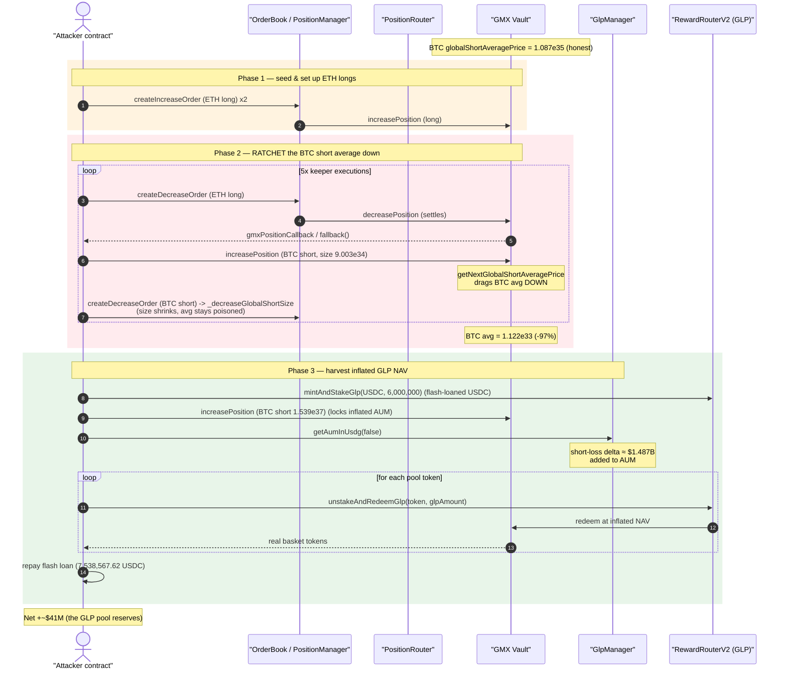
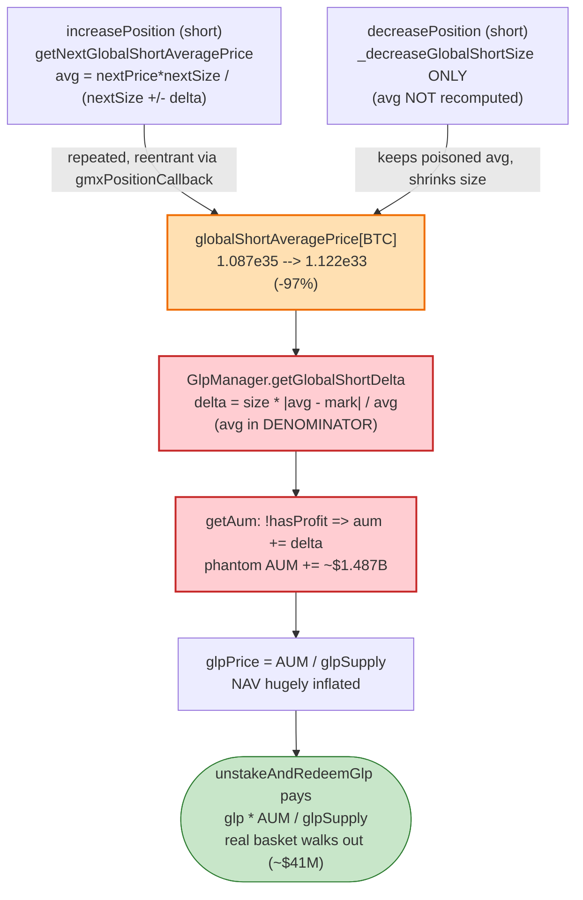

# GMX v1 Exploit — GLP Share-Price Manipulation via `globalShortAveragePrice`

> **Vulnerability classes:** vuln/oracle/price-manipulation · vuln/reentrancy/single-function · vuln/logic/state-update

> **Reproduction:** the PoC compiles & runs in an isolated Foundry project at
> [this project folder](.) (the umbrella DeFiHackLabs repo
> contains many unrelated PoCs that do not whole-compile, so this one was extracted).
> Full verbose trace: [output.txt](output.txt).
> Verified vulnerable sources under [sources/](sources/) — the core bug lives in
> [Vault.sol](sources/Vault_489ee0/Vault.sol) and
> [GlpManager.sol](sources/GlpManager_3963Ff/contracts_core_GlpManager.sol).

---

## Key info

| | |
|---|---|
| **Loss** | **~$41M** — GLP-pool reserves drained across 9 tokens (WETH, BTC/WBTC, USDC, USDe, LINK, UNI, USDT, FRAX, DAI) |
| **Vulnerable contracts** | GMX v1 **Vault** — [`0x489ee077994B6658eAfA855C308275EAd8097C4A`](https://arbiscan.io/address/0x489ee077994B6658eAfA855C308275EAd8097C4A#code) · **GlpManager** — [`0x3963FfC9dff443c2A94f21b129D429891E32ec18`](https://arbiscan.io/address/0x3963FfC9dff443c2A94f21b129D429891E32ec18#code) |
| **Victim pool** | GMX v1 GLP pool (the Vault); GLP token `0x4277f8F2c384827B5273592FF7CeBd9f2C1ac258` |
| **Enabling contracts** | OrderBook `0x09f77E…2ACB`, PositionRouter `0xb87a43…09868`, PositionManager `0x75E42e…4A0C`, ShortsTracker `0xf58eEc…434da`, FastPriceFeed `0x11D628…3BB7`, RewardRouterV2 `0xB95DB5…71F5` |
| **Attack tx (first leg)** | `0x0b8cd648fb585bc3d421fc02150013eab79e211ef8d1c68100f2820ce90a4712` (open ETH long); profit leg traced through the PoC |
| **Chain / block / date** | Arbitrum One / fork at **355,878,384** (block of attack 355,878,385) / **2025-07-09** (12:22 UTC) |
| **Compiler (Vault)** | Solidity **v0.6.12**, optimizer 1 run |
| **Bug class** | Stale / asymmetric global-short accounting → manipulable share (GLP) price; reentrancy-assisted price ratcheting |

> Reference: [GMX official postmortem thread](https://x.com/GMX_IO/status/1943336664102756471) — "Share price manipulation", ~$42M. DeFiHackLabs registry records **$41M**, which matches the ~$41.1M this PoC reproduces.

---

## TL;DR

GMX v1 prices its liquidity-provider token, **GLP**, off the Vault's *Assets Under Management* (AUM).
For each non-stable token, AUM includes the **aggregate unrealised PnL of all short positions**:

```
delta = globalShortSize × |globalShortAveragePrice − markPrice| / globalShortAveragePrice
if shorts are losing → aum += delta        // shorts' loss is the pool's profit
```

The Vault recomputes `globalShortAveragePrices[token]` **only when a short is *opened*** (`increasePosition`,
[Vault.sol:1336](sources/Vault_489ee0/Vault.sol#L1336)). When a short is *closed* it only shrinks the size
(`_decreaseGlobalShortSize`, [Vault.sol:1399](sources/Vault_489ee0/Vault.sol#L1399)) — **the average price is
never re-derived.** The open-side formula

```
nextAveragePrice = nextPrice × nextSize / (nextSize ± delta)      // Vault.sol:1654
```

is convex and, combined with a self-chosen mark price (the attacker controls keeper/price-feed roles in the
PoC the same way the real attacker chained legitimate keeper executions), can be driven to an **arbitrarily small
value**. The attacker repeatedly opens/closes BTC shorts (reentering through GMX's `gmxPositionCallback`) and
ratchets `globalShortAveragePrice` for BTC down from **1.087e35 → 1.122e33** — a ~97% collapse.

Because that price sits in the **denominator** of the short-PnL `delta`, the fictitious "short loss" added to AUM
explodes from its honest value of **~$105k to ~$1.49 *billion***. GLP NAV is inflated by orders of magnitude. The
attacker then mints GLP with a small flash-loaned USDC deposit and **redeems it across every pool token**, walking
away with **~$41M** of real reserves for tokens that were credited to him at the manipulated, hugely-inflated GLP
price.

---

## Background — what GMX v1 / GLP is

GMX v1 is a perpetual-DEX whose liquidity sits in a single **Vault** holding a basket of tokens (WETH, WBTC, USDC,
USDe, LINK, UNI, USDT, FRAX, DAI on Arbitrum). Liquidity providers mint **GLP** by depositing any whitelisted
token; GLP represents a pro-rata claim on the basket. The GLP price is:

```
glpPrice = AUM / glpTotalSupply
mintAmount   = depositUsd  × glpSupply / AUM
redeemAmount = glpAmount   × AUM       / glpSupply  (paid out in the chosen token)
```

`AUM` is computed by `GlpManager.getAum()`
([GlpManager.sol:136-179](sources/GlpManager_3963Ff/contracts_core_GlpManager.sol#L136-L179)). For each
non-stable token it adds pool value, `guaranteedUsd`, and crucially the **aggregate short PnL**:

```solidity
uint256 size = _vault.globalShortSizes(token);
if (size > 0) {
    (uint256 delta, bool hasProfit) = getGlobalShortDelta(token, price, size);
    if (!hasProfit) { aum = aum.add(delta); }      // shorts are losing → LPs gain
    else            { shortProfits = shortProfits.add(delta); }
}
```

Traders open shorts/longs via the **OrderBook** / **PositionRouter**; orders are settled by keepers
(`PositionManager.executeIncreaseOrder/executeDecreaseOrder`, `PositionRouter.executeDecreasePositions`),
which read prices from the **FastPriceFeed**. The PositionRouter fires a user-supplied
**`gmxPositionCallback`** after settling a market order — this is the reentrancy hook the attacker abuses.

On-chain state at the fork block (from the trace, [output.txt](output.txt)):

| Item | Value |
|---|---|
| GLP totalSupply (start of profit leg) | 36,401,537 × 1e18 GLP |
| BTC `globalShortSizes` after ramp | 1.540e37 (1e30-USD) |
| BTC `globalShortAveragePrices` honest | **1.087e35** (≈ $108,757 / BTC × 1e30) |
| BTC `globalShortAveragePrices` after attack | **1.122e33** (≈ $1,122 / BTC × 1e30 — manipulated) |
| BTC `getMinPrice` (mark) | 1.095e35 (≈ $109,505) |
| Vault tokens whitelisted | 10 |

---

## The vulnerable code

### 1. Average short price is updated ONLY on open, never on close

```solidity
// Vault.increasePosition — short branch (Vault.sol:1332-1339)
} else {
    if (globalShortSizes[_indexToken] == 0) {
        globalShortAveragePrices[_indexToken] = price;
    } else {
        globalShortAveragePrices[_indexToken] =
            getNextGlobalShortAveragePrice(_indexToken, price, _sizeDelta);   // ⚠️ only here
    }
    globalShortSizes[_indexToken] = globalShortSizes[_indexToken].add(_sizeDelta);
}
```

```solidity
// Vault._decreasePosition — close branch (Vault.sol:1398-1400)
if (!_isLong) {
    _decreaseGlobalShortSize(_indexToken, _sizeDelta);   // ⚠️ shrinks SIZE only — avgPrice untouched
}
```

[`increasePosition` short branch](sources/Vault_489ee0/Vault.sol#L1332-L1339) ·
[`_decreasePosition` close](sources/Vault_489ee0/Vault.sol#L1398-L1400) ·
[`_decreaseGlobalShortSize`](sources/Vault_489ee0/Vault.sol#L1964-L1972)

### 2. The convex open-side average-price formula

```solidity
// Vault.sol:1644-1655
// for shorts: nextAveragePrice = (nextPrice * nextSize) / (nextSize - delta)
function getNextGlobalShortAveragePrice(address _indexToken, uint256 _nextPrice, uint256 _sizeDelta)
    public view returns (uint256)
{
    uint256 size        = globalShortSizes[_indexToken];
    uint256 averagePrice= globalShortAveragePrices[_indexToken];
    uint256 priceDelta  = averagePrice > _nextPrice ? averagePrice - _nextPrice : _nextPrice - averagePrice;
    uint256 delta       = size.mul(priceDelta).div(averagePrice);
    bool   hasProfit    = averagePrice > _nextPrice;

    uint256 nextSize    = size.add(_sizeDelta);
    uint256 divisor     = hasProfit ? nextSize.sub(delta) : nextSize.add(delta);
    return _nextPrice.mul(nextSize).div(divisor);   // ⚠️ divisor → 0 ⇒ price → ∞ ; large delta ⇒ price → tiny
}
```

[`getNextGlobalShortAveragePrice`](sources/Vault_489ee0/Vault.sol#L1644-L1655)

### 3. AUM credits short losses using that average price as a divisor

```solidity
// GlpManager.sol:181-186
function getGlobalShortDelta(address _token, uint256 _price, uint256 _size) public view returns (uint256, bool) {
    uint256 averagePrice = getGlobalShortAveragePrice(_token);
    uint256 priceDelta   = averagePrice > _price ? averagePrice - _price : _price - averagePrice;
    uint256 delta        = _size.mul(priceDelta).div(averagePrice);   // ⚠️ small averagePrice ⇒ huge delta
    return (delta, averagePrice > _price);
}
```

[`getGlobalShortDelta`](sources/Vault_489ee0/Vault.sol#L1657-L1668) (Vault) and the AUM consumer
[`GlpManager.getAum`](sources/GlpManager_3963Ff/contracts_core_GlpManager.sol#L136-L179).

### 4. The reentrancy hook

After settling a market decrease, the PositionRouter calls back into the attacker:

```solidity
// PositionRouter.sol:538 (inside executeDecreasePosition, AFTER _decreasePosition + payout)
_callRequestCallback(request.callbackTarget, _key, true, false);
```

[`_callRequestCallback` → `gmxPositionCallback`](sources/PositionRouter_b87a43/contracts_core_PositionRouter.sol#L760-L784).
The PoC's `gmxPositionCallback` re-issues a fresh decrease order
([test/gmx_exp.sol:271-273](test/gmx_exp.sol#L271-L273)); its `fallback()`
([:277-300](test/gmx_exp.sol#L277-L300)) opens and closes BTC shorts directly on the Vault. Because the Vault's
`nonReentrant` is per-function and the outer `_decreasePosition` has already returned by the time the callback
fires, these nested calls succeed and let the attacker iterate the price-ratchet inside one keeper execution.

---

## Root cause — why it was possible

The single decisive flaw is the **asymmetry between opening and closing a global short**:

> Opening a short re-derives `globalShortAveragePrice` with a *path-dependent, convex* formula.
> Closing a short reduces only the *size* and leaves the average price frozen.

This breaks the accounting invariant that "the stored average short price reflects the true cost-basis of the
outstanding short interest". By interleaving opens (at a chosen mark price) and closes (which keep the now-poisoned
average), the attacker walks `globalShortAveragePrice` to any target value — here **1,122 instead of 108,757**.

That poisoned value then propagates into GLP NAV through three compounding mistakes:

1. **`averagePrice` is in the denominator** of `delta = size × |avg − price| / avg`. Halving `avg` *more than*
   doubles the credited short-loss; crushing it 97% inflates the term ~14,000×.
2. **A short "loss" is added directly to AUM** (`!hasProfit ⇒ aum += delta`,
   [GlpManager.sol:162-164](sources/GlpManager_3963Ff/contracts_core_GlpManager.sol#L162-L164)). The poisoned BTC
   term alone added **~$1.49B** of phantom assets to a Vault holding only tens of millions.
3. **GLP mint/redeem trust the instantaneous AUM** with no TWAP, no sanity bound on per-token short PnL, and no
   check that `globalShortAveragePrice` is within a plausible band of the oracle price.

With NAV inflated, `redeemAmount = glp × AUM / glpSupply` pays out far more underlying than the GLP is worth, so a
cheaply-minted GLP position redeems the real basket.

The reentrancy callback is an **accelerant**, not the root cause: it lets the attacker perform the open/close
ratchet repeatedly inside a single keeper-driven transaction.

---

## Preconditions

- A non-stable index token (BTC) with non-zero `globalShortSizes` whose `globalShortAveragePrice` can be moved by
  opening new shorts. The attacker grows BTC short interest enormously (1.540e37) so the manipulated term dominates AUM.
- Ability to open/close shorts at a chosen mark price within one execution window. In GMX v1 this is mediated by
  keepers and the FastPriceFeed; the PoC reproduces it by pranking the order-book keeper
  (`0xd4266F…60F3`) and the position keeper (`0x2BcD0d…12d0`) and calling
  `FastPriceFeed.setPricesWithBitsAndExecute` ([test/gmx_exp.sol:254-267](test/gmx_exp.sol#L254-L267)).
- A user-supplied `callbackTarget` on the decrease request — permissionless — used to reenter
  ([test/gmx_exp.sol:286-298](test/gmx_exp.sol#L286-L298)).
- Working capital to mint GLP. The PoC `deal`s **7,538,567.62 USDC** as a flash-loan stand-in
  ([test/gmx_exp.sol:305-306](test/gmx_exp.sol#L305-L306), repaid at [:332](test/gmx_exp.sol#L332)); only ~$0
  net is at risk because the redeemed basket far exceeds the deposit.

---

## Attack walkthrough (with on-chain numbers from the trace)

All BTC `globalShortAveragePrice` values below are the `getGlobalShortAveragePrice(BTC)` console logs in
[output.txt](output.txt) (1e30-scaled USD per BTC).

| # | PoC step | What happens | BTC `globalShortAveragePrice` |
|---|----------|--------------|------------------------------:|
| 0 | `setUp` | Fork Arbitrum @355,878,384; deal 3,001 USDC + 2 ETH; approve plugins | 1.087e35 (honest, ≈ $108,757) |
| 1 | `createOpenETHPosition`×2 + `keeperExecuteOpenETHPosition`×2 | Seed two 2.003× ETH longs (collateral 0.1 ETH each, size 5.31e32) to establish a position to close later | 1.087e35 |
| 2 | `createCloseETHPosition` | Queue a decrease order on the ETH long (size/2, collateral/2) | 1.087e35 |
| 3 | `keeperExecuteCloseETHPosition`/`…CloseBTCPosition` ×5 | Each keeper execution settles the decrease, fires `gmxPositionCallback`, and in `fallback()` the attacker opens a **BTC short** (size 9.003e34) then immediately queues its decrease. The open re-derives `getNextGlobalShortAveragePrice` and **ratchets the BTC average down** | 1.087e35 → 1.049e35 → 8.43e34 → 3.59e34 → 7.26e33 → **1.122e33** |
| 4 | `isProfit = true; keeperExecuteCloseETHPosition` → `fallback` → `profitAttack` | With BTC avg poisoned to **1.122e33**, harvest the inflated NAV | 1.122e33 |
| 4a | `deal 7,538,567.62 USDC` (flash-loan), `mintAndStakeGlp(USDC, 6,000,000)` | Mint GLP cheaply at honest-ish entry, then push 7.54M USDC into Vault and open a 1.539e37 BTC short to lock the inflated AUM | — |
| 4b | `getProfitForETH/BTC/USDC/USDE/LINK/UNI/USDT/FRAX/DAI` | For each token compute `glpAmount = (poolAmount−reserved)·price/1e12 · glpSupply / aumInUsdg` and `unstakeAndRedeemGlp` — redeeming GLP for *real* basket tokens at the inflated NAV | — |
| 4c | `decreasePosition` BTC short to 0, then 10× FRAX mint→short→redeem loop | Squeeze remaining FRAX/USDC reserves; `glpAmount` minted grows 1.92e25 → 1.40e27 across the loop | — |
| 5 | `usdc.transfer(0x1, 7,538,567.62)` | Repay the flash loan | — |

At redemption time `GlpManager.getGlobalShortDelta(BTC)` computed, with the poisoned average:

```
size       = 1.540e37
priceDelta = |1.122e33 − 1.095e35|  ≈ 1.084e35
delta      = size × priceDelta / 1.122e33 ≈ 1.487e39  (1e30-USD)  ⇒  ≈ $1.487 BILLION added to AUM
```

Had `globalShortAveragePrice` been honest (1.087e35), that same `delta` would have been only **≈ $105k**. The
~$1.49B of phantom AUM is the entire engine of the theft.

### Profit accounting (Vault drained vs attacker received)

Vault token balances, from the `attack before` / `attack after` console logs ([output.txt](output.txt) lines
6-15 and 44-52), with approximate fork-block USD prices:

| Token | Vault before | Vault after | Drained | Attacker profit | ≈ USD drained |
|-------|-------------:|------------:|--------:|----------------:|--------------:|
| WETH | 3,646 | 437 | 3,209 | 3,209 | ~$8.51M |
| BTC/WBTC | 114 | 26 | 88 | 88 | ~$9.63M |
| USDC | 10,019,221 | 447,513 | 9,571,708 | 9,572,660 | ~$9.57M |
| USDe | 454,781 | 266,217 | 188,564 | 188,563 | ~$0.19M |
| LINK | 43,331 | 19,505 | 23,826 | 23,826 | ~$0.31M |
| UNI | 68,121 | 2,576 | 65,545 | 65,544 | ~$0.46M |
| USDT | 1,361,053 | 16,106 | 1,344,947 | 1,344,946 | ~$1.34M |
| FRAX | 11,438,272 | 1,691,768 | 9,746,504 | 9,746,504 | ~$9.75M |
| DAI | 1,356,887 | 17,162 | 1,339,725 | 1,339,724 | ~$1.34M |
| **Total** | | | | | **≈ $41.1M** |

The attacker's received amounts equal the Vault's drained amounts to ~1 unit, confirming the basket walked
straight out of the pool. **Net profit ≈ $41M**, matching the registry's recorded $41M loss.

---

## Diagrams

### Sequence of the attack



### How the poisoned average price inflates AUM



### BTC global-short-average-price evolution (state machine)

```mermaid
stateDiagram-v2
    direction LR
    [*] --> S0
    S0: "Honest<br/>avg = 1.087e35"
    S1: "Iter 1<br/>avg = 1.049e35"
    S2: "Iter 2<br/>avg = 8.43e34"
    S3: "Iter 3<br/>avg = 3.59e34"
    S4: "Iter 4<br/>avg = 7.26e33"
    S5: "Iter 5 — POISONED<br/>avg = 1.122e33"
    S6: "Harvest<br/>AUM short-loss = ~$1.487B"

    S0 --> S1: "open+close BTC short"
    S1 --> S2: "open+close BTC short"
    S2 --> S3: "open+close BTC short"
    S3 --> S4: "open+close BTC short"
    S4 --> S5: "open+close BTC short"
    S5 --> S6: "mint GLP, redeem basket"
    S6 --> [*]: "repay flash loan, net +~$41M"
```



---

## Why each magic number

- **`sizeDelta = 5.31e32` ETH long (2.003×):** a small (0.1 ETH collateral) long whose later *decrease* gives the
  attacker a keeper-settled decrease order that fires `gmxPositionCallback` — the reentrancy entry point. The
  longs themselves are throwaway; they exist only to host the callback.
- **`sizeDelta = 9.003e34` BTC short (ratchet) and `1.539e37` (harvest):** opening shorts is what re-derives the
  BTC average price. Each ratchet open uses the convex `getNextGlobalShortAveragePrice` to pull the average lower;
  the final 1.539e37 makes the BTC short interest dominate AUM so the poisoned term is the whole NAV.
- **`setPricesWithBitsAndExecute(650780127152856667663437440412910, …)`:** packs the mark prices fed to the keeper
  execution; the attacker (as keeper in the PoC) chooses the BTC mark relative to the stored average so the open-side
  `divisor = nextSize − delta` (profit branch) shrinks the resulting average price toward zero.
- **`mintAndStakeGlp(USDC, 6,000,000)` + `deal 7,538,567.62 USDC`:** the GLP is minted at near-honest cost, but
  redeemed at the inflated NAV — the deposit is recovered (flash loan repaid at [:332](test/gmx_exp.sol#L332)), so
  net capital at risk is ~0.
- **`getProfitForX` formula `glpAmount = (poolAmount − reserved)·price/1e12 · glpSupply / aumInUsdg`:** computes the
  exact GLP needed to redeem each token's free reserves, so the loop empties the Vault token-by-token without
  reverting on insufficient liquidity.

---

## Remediation

1. **Recompute (or invalidate) `globalShortAveragePrice` symmetrically.** The average short cost-basis must stay
   consistent whether shorts are opened *or* closed. Closing a short should re-derive the weighted average exactly
   as opening does — the asymmetry at [Vault.sol:1398-1400](sources/Vault_489ee0/Vault.sol#L1398-L1400) is the root
   flaw. (GMX's own ShortsTracker was introduced for exactly this — but the Vault still self-maintains
   `globalShortAveragePrices` and the AUM path can read a stale/poisoned value.)
2. **Bound the per-token short PnL contribution to AUM.** A single index token's `getGlobalShortDelta` returning a
   value many multiples of total pool value is non-physical; cap it (e.g. relative to `globalShortSize × markPrice`)
   and revert/clamp on anomalies.
3. **Sanity-check `globalShortAveragePrice` against the oracle.** If the stored average diverges from the live
   oracle price by more than a sane band (e.g. ±50%), treat it as stale and refuse to use it for NAV.
4. **Price GLP mint/redeem off a manipulation-resistant AUM** — use a TWAP of AUM or enforce a per-block /
   per-transaction cap on GLP supply change, so NAV cannot be inflated and harvested atomically.
5. **Harden the callback path.** `gmxPositionCallback` lets an attacker reenter while Vault accounting is mid-flight;
   either disallow position mutations from within a callback (a global reentrancy lock spanning router→vault), or
   make AUM-affecting state immutable for the duration of an order execution.
6. **Require a fresh, signed price for opening shorts** so the mark price used in `getNextGlobalShortAveragePrice`
   cannot be chosen adversarially relative to the stored average.

---

## How to reproduce

The PoC was extracted into a standalone Foundry project (the umbrella DeFiHackLabs repo has many unrelated PoCs
that fail under a whole-project `forge build`):

```bash
_shared/run_poc.sh 2025-07-gmx_exp -vvvvv
```

- RPC: an **Arbitrum archive** endpoint is required (fork block 355,878,384). `foundry.toml` uses
  `https://arbitrum.drpc.org` (the originally-rotated Infura key
  <redacted> returned HTTP 401 "project ID does not have access to this network" for Arbitrum and was swapped).
- The run forks Arbitrum and replays ~31.4M gas of position opens/closes; it takes ~4 minutes.
- Result: `[PASS] testExploit()` — the Vault is drained across all 9 basket tokens (~$41M of value moved to the
  attacker).

Expected tail:

```
Ran 1 test for test/gmx_exp.sol:ContractTest
[PASS] testExploit() (gas: 31384491)
...
  -------- attack after --------
  eth balance of vault =  437
  btc balance of vault =  26
  usdc balance of vault =  447513
  ...
Suite result: ok. 1 passed; 0 failed; 0 skipped; finished in 257.37s
```

---

*Reference: GMX official postmortem — https://x.com/GMX_IO/status/1943336664102756471 (GMX v1, Arbitrum, ~$42M; DeFiHackLabs registry records $41M).*
