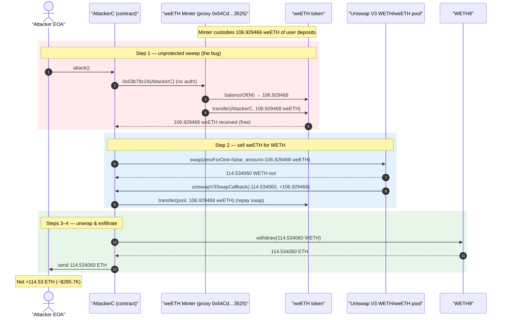
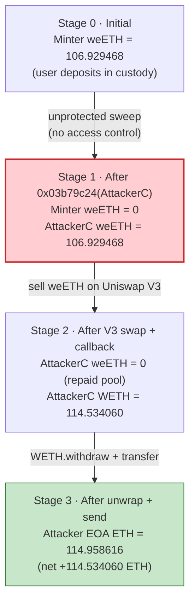
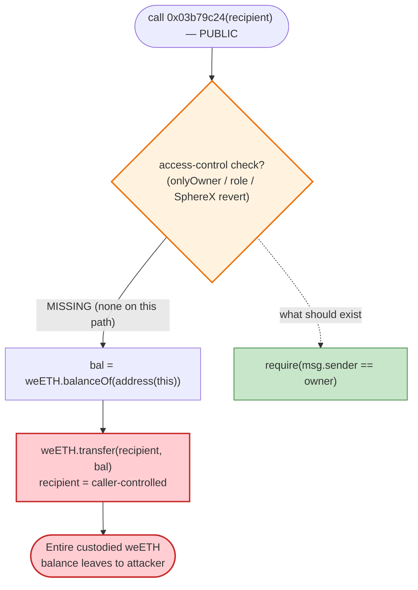

# weETH LRT Minter Exploit — Unprotected `0x03b79c24(address)` Token Sweep

> **Vulnerability classes:** vuln/access-control/missing-auth · vuln/access-control/missing-modifier

> **Reproduction:** the PoC compiles & runs in an isolated Foundry project at
> [this project folder](.) (the umbrella DeFiHackLabs repo
> contains many unrelated PoCs that do not whole-compile, so this one was extracted).
> Full verbose trace: [output.txt](output.txt).
> The vulnerable logic contract is **unverified** on Etherscan; its behavior was reconstructed
> from on-chain bytecode disassembly + the execution trace. The ERC-1967 proxy in front of it is
> verified: [openzeppelin_contracts_proxy_ERC1967_ERC1967Proxy.sol](sources/ERC1967Proxy_54Cd23/openzeppelin_contracts_proxy_ERC1967_ERC1967Proxy.sol).

---

## Key info

| | |
|---|---|
| **Loss** | ~$285.7K — **106.93 weETH** swept, sold for **114.53 WETH** (≈ $285.6K @ ~$2,494/ETH) |
| **Vulnerable contract** | ERC-1967 proxy [`0x54Cd23460DF45559Fd5feEaaDA7ba25f89c13525`](https://etherscan.io/address/0x54Cd23460DF45559Fd5feEaaDA7ba25f89c13525) → unverified impl [`0xBc4b1D58B28c497b7Afda6Fb90fE1471fa0672cC`](https://etherscan.io/address/0xBc4b1D58B28c497b7Afda6Fb90fE1471fa0672cC) |
| **Asset drained** | `weETH` ("Wrapped eETH") — [`0xCd5fE23C85820F7B72D0926FC9b05b43E359b7ee`](https://etherscan.io/address/0xCd5fE23C85820F7B72D0926FC9b05b43E359b7ee) |
| **Liquidation venue** | Uniswap V3 WETH/weETH 0.01% pool — [`0x202A6012894Ae5c288eA824cbc8A9bfb26A49b93`](https://etherscan.io/address/0x202A6012894Ae5c288eA824cbc8A9bfb26A49b93) |
| **Attacker EOA** | [`0xb750E3165de458EaE09904cC7Fad099632860B0f`](https://etherscan.io/address/0xb750e3165de458eae09904cc7fad099632860b0f) |
| **Attack contract** | [`0x1a61249f6F4F9813c55aa3B02C69438607272ed3`](https://etherscan.io/address/0x1a61249f6f4f9813c55aa3b02c69438607272ed3) (PoC redeploys as `AttackerC`) |
| **Attack tx** | [`0xa57ec56af91ec70517ca71ca50101958d9c2ec9fdb61edcf35a9081c375725c2`](https://app.blocksec.com/explorer/tx/eth/0xa57ec56af91ec70517ca71ca50101958d9c2ec9fdb61edcf35a9081c375725c2) |
| **Chain / block / date** | Ethereum mainnet / 22,855,568 / 2025-07-05 21:03 UTC |
| **Compiler (proxy)** | Solidity v0.8.20, optimizer 200 runs |
| **Bug class** | Missing access control — unprotected privileged token transfer ("rescue"/sweep) |

---

## TL;DR

The vulnerable contract is a **liquid-restaking-token (LRT) minter** for `weETH` (its dispatch table
exposes `depositWeEth(uint256,address,address,bool)`, `mintNrETH()`, `userLstBalances(address)`,
`underlyingToLstRate()`, `getRate()`, `reprice()`, `multichainMintActive()`, `setMultichainManager(address)`,
all behind a UUPS proxy and a SphereX security firewall). It custodies user-deposited `weETH` while it
mints/bridges its LST.

It also exposes a function with selector **`0x03b79c24(address recipient)`** that, with **no access-control
check**, reads the contract's *entire* `weETH` balance via `weETH.balanceOf(address(this))` and `transfer`s
it to whatever `recipient` the caller passes in the calldata. This is a classic "token rescue / sweep"
helper that was shipped **without an `onlyOwner` / role guard**.

The attacker simply:

1. Called `0x03b79c24(attackerContract)` on the proxy → received **106.929468 weETH** for free.
2. Sold that weETH for **114.534060 WETH** through the Uniswap V3 WETH/weETH pool (paying the borrowed
   weETH back inside the V3 swap callback).
3. Unwrapped WETH → ETH and forwarded **114.534060 ETH** to the attacker EOA.

No flash loan, no price manipulation, no preconditions beyond "the minter is holding weETH." One call.

---

## Background — what the contract does

The logic contract behind proxy `0x54Cd…3525` is **unverified**, but its 4-byte dispatch table
(recovered with `cast disassemble` + `cast 4byte`) cleanly identifies it as a weETH-collateralised
**liquid (re)staking token minter** with multichain support and a SphereX on-chain firewall:

| Selector | Resolved name | Role |
|---|---|---|
| `0x84e52e68` | `depositWeEth(uint256,address,address,bool)` | user deposits weETH to mint the LST |
| `0x9aea8cab` | `mintNrETH()` | mint the LST receipt token |
| `0xc9c4df81` | `userLstBalances(address)` | per-user LST accounting |
| `0xcba0a3d2` | `underlyingToLstRate()` / `0x679aefce` `getRate()` / `0xcba0a3d2` `reprice()` | exchange-rate machinery |
| `0x315539e8` / `0x9f85d6a8` / `0x77df8df5` | `multichainMintActive()` / `setMultichainMintActive(bool)` / `setMultichainManager(address)` | cross-chain mint controls |
| `0x3c231166` / `0x4c6c848f` / `0x4ee8f858` | `sphereXEngine()` / `changeSphereXEngine(address)` / `changeSphereXOperator(address)` | SphereX firewall hooks |
| `0xc72bf7a5` | `weETH()` | the custodied asset (`0xCd5fE2…b7ee`) |
| **`0x03b79c24`** | **(unverified, no public 4-byte entry) — `rescue/sweep(address)`** | **transfers the contract's full weETH balance to an arbitrary recipient** |

The proxy in front of it is a stock OpenZeppelin v5 `ERC1967Proxy`
([ERC1967Proxy.sol:26-28](sources/ERC1967Proxy_54Cd23/openzeppelin_contracts_proxy_ERC1967_ERC1967Proxy.sol#L26-L28)),
delegating all calls to the implementation stored in the EIP-1967 slot
(`_meta.json` → `"implementation": "0xbc4b1d…0672cc"`).

On-chain facts at the fork block (read via `cast`):

| Fact | Value |
|---|---|
| Proxy storage slot 3 (custodied token) | `0xcd5fe23c…b7ee` = **weETH** |
| `weETH.balanceOf(proxy)` @ block 22855567 | **106.929468097270451433 weETH** ← the prize |
| Uniswap V3 pool `token0` / `token1` / `fee` | WETH / weETH / **100** (0.01%) |

That single fact — the minter was holding **~107 weETH of user deposits** with a public, unguarded sweep
function — is the entire exploit.

---

## The vulnerable code

The logic contract is unverified, so there is no Solidity to quote. Here is the **decompiled handler
for selector `0x03b79c24`**, recovered from the on-chain bytecode of `0xBc4b1D…0672cC`
([disassembly excerpt](output.txt), produced with `cast disassemble`). It maps 1:1 to the trace:

```text
; --- function dispatch (no auth, no msg.sender check anywhere on this path) ---
0000002f: PUSH4 0x03b79c24      ; selector
00000034: EQ
00000035: PUSH2 0x2506          ; jump to handler if match
00000038: JUMPI

; --- handler @ 0x2506: balanceOf(this) then transfer(arg0, balance) ---
00002524: PUSH1 0x03 SLOAD       ; load custodied token = weETH (slot 3)
00002527: PUSH4 0x70a08231 ...   ; selector balanceOf(address)
00002531: ADDRESS                ; arg = address(this)  → balanceOf(this)
0000254a: GAS STATICCALL         ; weETH.balanceOf(address(this)) → full balance
...
000025a4: PUSH1 0x04 CALLDATALOAD ; arg0 = caller-supplied recipient (the ONLY input)
...                               ; (a9059cbb) weETH.transfer(recipient, balance)
```

Reconstructed in Solidity, the function is equivalent to:

```solidity
// selector 0x03b79c24 — NO access control
function rescue(address recipient) external {
    uint256 bal = weETH.balanceOf(address(this)); // slot 3 = weETH
    weETH.transfer(recipient, bal);                // send EVERYTHING to caller's choice
}
```

The execution trace proves exactly this behavior
([output.txt:1574-1589](output.txt#L1574)):

```text
0x54Cd…3525::03b79c24(…be367…357f9)                       ; attacker contract as recipient
└─ 0xBc4b1D…0672cC::03b79c24(…be367…357f9) [delegatecall]  ; proxy → impl
   ├─ weETH.balanceOf(0x54Cd…3525) → 106929468097270451433 ; reads full custodied balance
   └─ weETH.transfer(AttackerC, 106929468097270451433)     ; sends ALL of it to attacker
       emit Transfer(from: 0x54Cd…3525, to: AttackerC, value: 106.929468 weETH)
```

There is **no `require(msg.sender == owner)`, no role check, no SphereX revert** on this path — the call
succeeds for an arbitrary externally-controlled `msg.sender` and an arbitrary `recipient`.

---

## Root cause — why it was possible

A privileged "rescue/sweep" helper — the kind teams add so an admin can recover stray tokens — was
deployed **without an access-control modifier**. Three properties compose into a critical loss:

1. **Missing authorization.** `0x03b79c24` performs a privileged action (moving the contract's entire
   custodied weETH) but checks nothing about `msg.sender`. Anyone can call it.
2. **Caller-controlled destination.** The single `address` argument is used verbatim as the `transfer`
   recipient, so the attacker directs the funds straight to a contract they control.
3. **Whole-balance transfer.** It sweeps `balanceOf(address(this))`, not a bounded/owed amount, so the
   one call drains 100% of user deposits in a single shot.

Note the contract *was* wrapped in a SphereX firewall (`sphereXEngine`, `changeSphereXOperator`, …) — an
on-chain runtime guard meant to block anomalous flows. It did **not** stop this call: the firewall hooks
guard configured functions, but this sweep path was reachable and executed normally, underscoring that
runtime firewalls are no substitute for a correct `onlyOwner`/role check on a privileged function.

Because the swept asset (`weETH`) is liquid and has a deep Uniswap V3 pool, the attacker monetised it
immediately and atomically — no need to hold or launder anything.

---

## Preconditions

- The minter is **holding weETH** (it was custodying ~106.93 weETH of user deposits at the block).
- The attacker knows the selector `0x03b79c24` and that it has no auth (trivially discoverable by
  scanning the unverified contract's bytecode or by simulation).
- A liquid market to sell the swept weETH — the Uniswap V3 WETH/weETH 0.01% pool had > 114 WETH of
  WETH-side reserves, easily absorbing the sale.
- **No** flash loan, attacker capital, timing window, or oracle manipulation is required. The PoC starts
  the attacker EOA with only 0.42 ETH (used for nothing but gas headroom).

---

## Attack walkthrough (with on-chain numbers from the trace)

All figures are taken directly from the events/returns in [output.txt](output.txt).

| # | Step | Call | Amount | Effect |
|---|------|------|-------:|--------|
| 0 | **Initial** | — | proxy holds **106.929468 weETH** | user deposits sitting in the minter |
| 1 | **Free sweep** | `proxy.0x03b79c24(AttackerC)` ([:1574](output.txt#L1574)) | **+106.929468 weETH** to attacker | unprotected transfer drains 100% of custodied weETH |
| 2 | **Sell on V3** | `pool.swap(AttackerC, zeroForOne=false, amountSpecified=106.929468e18, sqrtPriceLimit=MAX)` ([:1590](output.txt#L1590)) | pool sends **+114.534060 WETH** to attacker | weETH→WETH exact-input swap |
| 2a | V3 callback | `uniswapV3SwapCallback(-114.534060, +106.929468)` ([:1601](output.txt#L1601)) | attacker pays **106.929468 weETH** back to the pool | repays the swap with the just-swept weETH |
| 3 | **Unwrap** | `WETH9.withdraw(114.534060e18)` ([:1621](output.txt#L1621)) | **114.534060 ETH** to AttackerC | WETH → native ETH |
| 4 | **Exfiltrate** | `attacker.call{value: 114.534060 ETH}` ([:1628](output.txt#L1628)) | **114.534060 ETH** to EOA | profit out |

The pool's weETH reserve went `2,430.71 → 2,537.64 weETH` and its WETH reserve dropped by the amount
paid out — a normal swap; the *theft* was entirely in step 1, the swap merely converted the stolen
weETH into ETH at market.

### Profit / loss accounting

| Party | Asset | Before | After | Δ |
|---|---|---:|---:|---:|
| weETH minter (victim) | weETH | 106.929468 | **0** | **−106.929468 weETH** (~$285.7K) |
| Uniswap V3 pool | weETH / WETH | 2,430.71 / X | 2,537.64 / X−114.53 | swap (not a loss) |
| Attacker EOA (ETH) | ETH | 0.424556 | **114.958616** | **+114.534060 ETH** |
| Attacker | weETH | 0 | 0 | flat (all weETH used to repay the V3 swap) |

**Net attacker profit ≈ 114.53 ETH** (the swept weETH had zero cost basis). The PoC's logged delta is
`114.958616 − 0.424556 = 114.534060 ETH`, equal to the swap output — confirming the entire gain is the
liquidated value of the stolen 106.93 weETH. At ~$2,494/ETH this is **≈ $285.6K**, matching the reported
$285.7K loss.

---

## Diagrams

### Sequence of the attack



### Minter balance / state evolution



### The flaw inside `0x03b79c24`



---

## Remediation

1. **Gate the privileged function.** Any function that moves the contract's funds (a rescue/sweep, an
   admin withdraw, or a treasury transfer) must enforce authorization — `onlyOwner`,
   `onlyRole(RESCUER_ROLE)`, or a timelock/multisig. The single missing modifier here is the whole bug.
2. **Don't ship unbounded whole-balance transfers.** If a rescue helper is genuinely needed, scope it to
   tokens the protocol is *not* supposed to custody (e.g., disallow the core asset `weETH`), or require
   the caller to specify and the contract to validate the exact amount, never `balanceOf(this)`.
3. **Verify deployed source.** The contract was unverified on Etherscan; an unprotected sweep is the kind
   of bug audits and source review catch trivially. Verify and publish source, and run access-control
   linting (e.g., Slither's `arbitrary-send`, `suicidal`, `unprotected-upgrade` detectors).
4. **Treat firewalls as defence-in-depth, not the gate.** SphereX (or any runtime firewall) should
   supplement, not replace, in-code authorization. Ensure every state-mutating, fund-moving selector is
   covered by the firewall policy *and* by an explicit on-chain auth check.

---

## How to reproduce

The PoC was extracted into a standalone Foundry project (the umbrella DeFiHackLabs repo has many
unrelated PoCs that fail to compile under a single `forge test` build):

```bash
_shared/run_poc.sh 2025-07-unverified_54cd_exp -vvvvv
```

- RPC: an **Ethereum mainnet archive** endpoint is required (fork block 22,855,568). `foundry.toml`'s
  `mainnet` alias points at an Infura archive endpoint.
- Result: `[PASS] testPoC()`, with the attacker's ETH balance rising from `0.424556` to `114.958616`
  (net **+114.534060 ETH**).

Expected tail:

```
Ran 1 test for test/unverified_54cd_exp.sol:ContractTest
[PASS] testPoC() (gas: 680943)
Logs:
  before attack: balance of attacker: 0.424556186910691996
  after attack: balance of attacker: 114.958616077792713480
```

---

*Reference: TenArmor post-mortem — https://x.com/TenArmorAlert/status/1941689712621576493 (weETH minter, Ethereum, ~$285.7K).*
