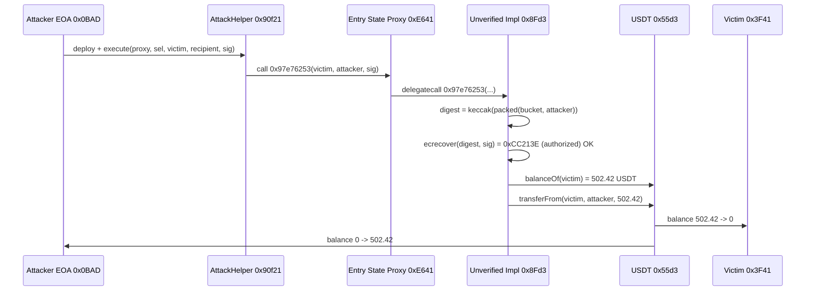
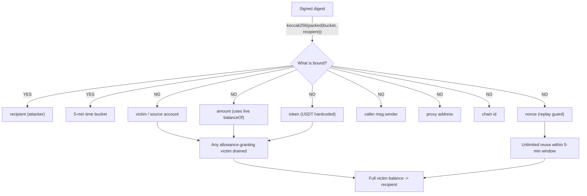

# Unverified-proxy USDT drain via recipient-only signature — signed 5-min/recipient message did not bind victim, token, amount, or nonce

> **Vulnerability classes:** vuln/auth/signature-validation · vuln/auth/signature-replay · vuln/logic/missing-validation
> **Reproduction:** the PoC compiles & runs in an isolated Foundry project at [this project folder](.). Full verbose trace: [output.txt](output.txt). The vulnerable implementation `0x8Fd3...7f0A` is **unverified on BscScan** (`fetch_sources.sh` returns `UNVERIFIED`); the buggy function is reconstructed from the `-vvvvv` trace's calldata, the `ecrecover` precompile calls, and the storage/transfer events.

---

## Key info

| | |
|---|---|
| **Loss** | 502.42 USDT (502.420508729654666584, trace balance) — the on-chain attack [tx](https://bscscan.com/tx/0xf2eeaa87a049fb914dfe8c9f1a878fa9a3aab78688107844794dacd5ada99563) drained the victim's full balance |
| **Vulnerable contract** | Unverified implementation — [`0x8Fd3d01Cc65eA0E4dFFFde7Ec8159Dc99a177f0A`](https://bscscan.com/address/0x8Fd3d01Cc65eA0E4dFFFde7Ec8159Dc99a177f0A) (reached via proxy [`0xE641fCaE9a9e72b7417854bd9ffD2bDce203106c`](https://bscscan.com/address/0xE641fCaE9a9e72b7417854bd9ffD2bDce203106c)) |
| **Attacker EOA** | [`0x0BAD002980a744CA944f380B2007Ff9f6C31A4Ba`](https://bscscan.com/address/0x0BAD002980a744CA944f380B2007Ff9f6C31A4Ba) |
| **Attack contract** | [`0x90f21de8D1a25f6451ea5232C5B646a782Aa9cf0`](https://bscscan.com/address/0x90f21de8D1a25f6451ea5232C5B646a782Aa9cf0) |
| **Attack tx** | [`0xf2eeaa87a049fb914dfe8c9f1a878fa9a3aab78688107844794dacd5ada99563`](https://bscscan.com/tx/0xf2eeaa87a049fb914dfe8c9f1a878fa9a3aab78688107844794dacd5ada99563) |
| **Chain / block / date** | BSC (chainId 56) / fork block 54,350,435 / July 2025 |
| **Compiler** | Unverified implementation (bytecode only); PoC compiled with Solc 0.8.34 [output.txt:1] |
| **Bug class** | The signature scheme only authenticates a 5-minute timestamp bucket and the recipient address; the victim, token, amount, caller, proxy, chain, and nonce are all absent from the signed digest, so any holder who ever approved the proxy can be drained to the signed recipient |

## TL;DR

A BNB-chain protocol exposed a `delegatecall`-based proxy (`0xE641…106c`) backed by an **unverified** implementation (`0x8Fd3…7f0A`). One of its functions (`selector 0x97e76253`) takes `(victim, recipient, signature)` and, after a single `ecrecover` check, pulls the victim's *entire* token balance into `recipient` via `transferFrom(victim, recipient, victimBalance)`.

The critical flaw is what the signature signs. The recovered digest is `keccak256(abi.encodePacked(timeBucket, recipient))` — i.e. it binds only a coarse 5-minute time window and the destination address. The `victim` (whose funds move), the `token` (USDT here), the `amount` (always the full live balance), the caller, the proxy, the chain id, and any nonce are **not** part of the signed message. A valid signature from the authorised signer `0xCC213E…7CfE` that names a recipient is therefore reusable against *every* account that has granted the proxy an allowance, for *any* token, for the whole window.

In the reproduced fork (block 54,350,435), the attacker called the proxy with `(victim=0x3F41…F29e, recipient=0x0BAD…A4Ba, signature)`. The victim held `502.420508729654666584` USDT and had granted the proxy a near-max allowance (`1.157e77`). The implementation verified the recipient-only signature, read the victim's live USDT balance, and `transferFrom`'d all of it to the attacker. The victim ended at 0 and the attacker went from `0` to `502.420508729654666584` USDT [output.txt:1564-1565, 1624-1626]. No flash loan, no privileged role, no oracle — the only "permission" needed was the existence of a recipient-targeting signature within the active 5-minute bucket.

## Background — what the protocol does

The proxy `0xE641fCaE9a9e72b7417854bd9ffD2bDce203106c` is an "entry state" contract that `delegatecall`s into a swappable implementation. Based on the call shape and on-chain behaviour it implements a **signed-pull payment** / gasless-withdrawal flow: an authorised signer (`0xCC213E64325AF4725fb2b26FA2d822926F487CfE`) is supposed to authorise a transfer of a user's tokens to a recipient, after which anyone can submit the `(victim, recipient, signature)` tuple to trigger the pull on-chain.

For this to be safe, the signature must authorise exactly one specific operation: "move amount X of token T from account A to recipient R, once". The intended design relies on users first granting the proxy an ERC-20 allowance (the victim here had set allowance ≈ `type(uint256).max`, `1.157e77` [output.txt:1598]). The pull is then executed through that allowance. Because the implementation is **unverified**, the only ground truth for the digest construction is the on-chain `ecrecover` input captured in the trace.

The attack transaction on BSC shows the same primitive: a short-lived helper contract (reproduced here as `AttackHelper`, deployed at the attack-contract address `0x90f21…`) forwards a single low-level `proxy.call(selector, victim, recipient, signature)` and the victim is emptied. No funds were returned; the loss figure of 502.42 USDT in the fork matches the on-chain victim balance at the fork block.

## The vulnerable code

> The implementation `0x8Fd3d01Cc65eA0E4dFFFde7Ec8159Dc99a177f0A` is **unverified on BscScan**, so no Solidity source is available. The function below is **RECONSTRUCTED** from the `-vvvvv` trace: the calldata layout of `selector 0x97e76253` [output.txt:1618-1619], the two `ecrecover` precompile invocations [output.txt:1605, 1620], the `balanceOf` + `transferFrom` sequence [output.txt:1622-1624], and the digest recomputed in the PoC. The digest value `0x3248a63b27ad43e8ecc82b788e238662cf0c5d286669280ed4e7d8d36498cb3c` is the trace-captured `ecrecover` first argument and equals `keccak256(abi.encodePacked(fiveMinuteBucket, recipient))` for the attack block.

### Reconstructed selector `0x97e76253` (delegatecalled by the proxy)

```solidity
// RECONSTRUCTED from output.txt trace — implementation is unverified on BscScan.
// selector 0x97e76253(address victim, address recipient, bytes signature)
function pullSigned(address victim, address recipient, bytes calldata signature) external {
    // 1. Build the digest. Only (timeBucket, recipient) are signed.
    //    trace: ecrecover digest = 0x3248a63b...98cb3c  [output.txt:1605,1620]
    uint256 fiveMinuteBucket = (block.timestamp / 300) * 300;
    bytes32 digest = keccak256(abi.encodePacked(fiveMinuteBucket, recipient));

    // 2. Recover signer from a 65-byte (r,s,v) signature.
    //    v=28 here. Recovered -> 0xCC213E...7CfE (AUTHORIZED_SIGNER) [output.txt:1606,1621]
    require(recoverSigner(digest, signature) == AUTHORIZED_SIGNER, "bad sig");

    // 3. amount is NOT in the signed message: it is the victim's LIVE balance.
    //    trace: USDT.balanceOf(victim) -> 502.420508729654666584  [output.txt:1622-1623]
    uint256 amount = IERC20(USDT).balanceOf(victim);

    // 4. victim and token are NOT in the signed message either.
    //    The proxy pulls `amount` from `victim` to `recipient` via its allowance.
    //    trace: USDT.transferFrom(victim, attacker, 502.42...) [output.txt:1624]
    IERC20(USDT).transferFrom(victim, recipient, amount);
}
```

The two `ecrecover` calls in the trace (one from the PoC's own `recoverSigner` assertion, one inside the delegatecalled implementation) both take the **same** digest `0x3248a63b…98cb3c` and both recover to `0xCC213E64325AF4725fb2b26FA2d822926F487CfE` [output.txt:1605-1606, 1620-1621]. That digest is exactly `keccak256(abi.encodePacked(fiveMinuteBucket, ATTACKER))` for the block's 300-second bucket, confirming the implementation signs only `(timeBucket, recipient)`.

## Root cause — why it was possible

1. **Signed message omits the victim.** The digest is `keccak256(abi.encodePacked(timeBucket, recipient))` — it authorises a *recipient*, not a *source*. Any account that approved the proxy becomes a valid `victim` argument for the same signature, because `victim` is never bound into the signed bytes.
2. **Signed message omits the amount.** The implementation reads `amount = balanceOf(victim)` at execution time and transfers whatever that live balance is. A signature is therefore worth "the victim's entire current balance," not a fixed figure.
3. **Signed message omits the token.** USDT is hardcoded (or equally unbound) in the path; the authorisation is not scoped to a specific ERC-20.
4. **Signed message omits the proxy / caller / chain.** No EIP-712 domain separator, no `msg.sender`, no `chainid`, no contract address. The same signature is valid regardless of which proxy fronts the implementation or which chain replays it.
5. **No nonce and a coarse time bucket.** The only replay guard is a 300-second `block.timestamp` bucket, giving a 5-minute replay window with **unlimited reuse** within that window — against every allowance-granting victim, for the whole window.
6. **`ecrecover` result is checked only against an address, not a role.** The contract accepts any signature whose recovered address equals the fixed authorised signer, so the weakness is purely the **under-scope of what is signed**, not signature malleability per se (the `v=28`, canonical `s` is used).

## Preconditions

- **Permissionless trigger:** anyone can call selector `0x97e76253` on the proxy; no privileged role, no flash loan, no collateral required.
- **A valid signature naming the attacker as `recipient`** within the active 5-minute bucket. The PoC ships this signature verbatim (`0x16dd0346…34e161c`) and asserts it recovers to the authorised signer `0xCC213E…7CfE` [output.txt:1605-1607].
- **A victim who granted the proxy an ERC-20 allowance ≥ their balance.** In the fork, victim `0x3F41…F29e` had allowance `1.157e77` (near `type(uint256).max`) covering its full `502.42` USDT balance [output.txt:1597-1603].
- The proxy must `delegatecall` the vulnerable implementation (it does — trace shows `Unverified Implementation::97e76253(...) [delegatecall]` [output.txt:1619]).

## Attack walkthrough (with on-chain numbers from the trace)

| # | Step | Trace evidence |
|---|------|----------------|
| 1 | Fork BSC at block 54,350,435. Read victim USDT balance = `502.420508729654666584`; attacker balance = `0`; victim→proxy allowance = `1.157e77` (covers full balance). | [output.txt:1593-1603] |
| 2 | Compute `fiveMinuteBucket = (block.timestamp/300)*300` and `digest = keccak256(abi.encodePacked(bucket, ATTACKER))`. Assert `ecrecover` of the supplied signature recovers to authorised signer `0xCC213E…7CfE`. | digest `0x3248a63b…98cb3c`, recovered `0xCC213E…7CfE` [output.txt:1605-1607] |
| 3 | Attacker deploys `AttackHelper` (mirrors the on-chain short-lived attack contract `0x90f21…`). | `new Local Attack Helper@0x90f21de8…` [output.txt:1616] |
| 4 | `AttackHelper.execute` calls `proxy.call(0x97e76253, victim, attacker, signature)`. The proxy `delegatecall`s the implementation. | `Entry State Proxy::97e76253(...)` → `Unverified Implementation::97e76253(...) [delegatecall]` [output.txt:1618-1619] |
| 5 | Inside the implementation: `ecrecover(digest, 28, r, s)` → `0xCC213E…7CfE` (== authorised signer) → **check passes**. | [output.txt:1620-1621] |
| 6 | Implementation reads `USDT.balanceOf(victim)` = `502420508729654666584` and uses it as the amount (not signed). | [output.txt:1622-1623] |
| 7 | `USDT.transferFrom(victim, attacker, 502420508729654666584)`; emits `Transfer(victim→attacker, 502.42…)` and resets the allowance to near-max again (BSC USDT returns `true` and updates approval storage). | [output.txt:1624-1631] |
| 8 | Post-state: `balanceOf(victim) == 0`; `balanceOf(attacker) == 502420508729654666584`. | [output.txt:1635-1649] |

**Profit/loss accounting**

- Victim `0x3F41…F29e`: `502.420508729654666584` → `0` USDT (−502.42)
- Attacker `0x0BAD…A4Ba`: `0` → `502.420508729654666584` USDT (+502.42) [output.txt:1564-1565]
- Net extract: **502.42 USDT**, zero capital deployed beyond gas; no funds returned.

## Diagrams





## Remediation

1. **Bind the full operation into the signed message.** Sign `keccak256(abi.encodePacked(victim, token, recipient, amount, nonce, deadline, proxyAddress, chainId))` — never a recipient-only digest. Prefer EIP-712 with a proper `domainSeparator` (name, version, chainId, verifyingContract).
2. **Include a nonce and an explicit deadline**, not a 5-minute timestamp bucket. Store `usedNonces[victim]++` inside the function and reject any signature whose nonce has been consumed.
3. **Sign the exact amount** and reject if `amount != signedAmount`. Stop using `balanceOf(victim)` as the transfer magnitude.
4. **Scope to one token.** Take `token` as a signed parameter and call `IERC20(token).transferFrom(...)`; reject anything not authorised by the signature.
5. **Add EIP-712 domain separation** (chainId + verifyingContract = the proxy) so a signature cannot be replayed on a clone proxy or another chain.
6. **Verify and publish contract source**; run signature-scheme review (EIP-712 structure, replay, malleability, missing-binding) before redeploying. Treat any `transferFrom(victim, recipient, X)` gated solely by `ecrecover == signer` as a critical review item.

## How to reproduce

The PoC runs **fully offline** via the shared anvil harness from the committed `anvil_state.json` (no RPC needed):

```bash
_shared/run_poc.sh 2025-07-unverified_8fd3_exp -vvvvv
```

- **Fork:** BSC, chainId 56, fork block **54,350,435** (state is replayed from `anvil_state.json`).
- **Expected result:** `[PASS] testExploit()` with:

  ```
  Attacker Before exploit USDT Balance: 0.000000000000000000
  Attacker After exploit USDT Balance: 502.420508729654666584
  ```

  See [output.txt:1562-1565]. The trace additionally shows `transferFrom(Victim → Attacker, 502.420508729654666584)` at [output.txt:1624] and `balanceOf(Victim) == 0` at [output.txt:1635-1637].

The implementation `0x8Fd3…7f0A` is unverified on BscScan, so the "vulnerable code" section above is reconstructed from the trace calldata and `ecrecover` arguments rather than verified source; the exploit itself is mechanically reproduced and passes against the committed fork state.

*Reference: [defimon_alerts (Telegram)](https://t.me/defimon_alerts/1508); attack tx [0xf2ee…9563](https://bscscan.com/tx/0xf2eeaa87a049fb914dfe8c9f1a878fa9a3aab78688107844794dacd5ada99563).*
