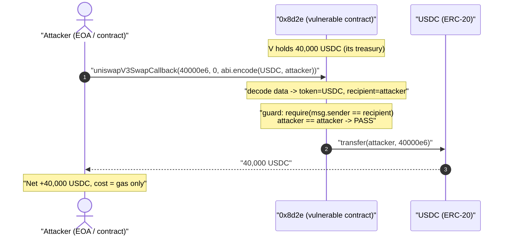
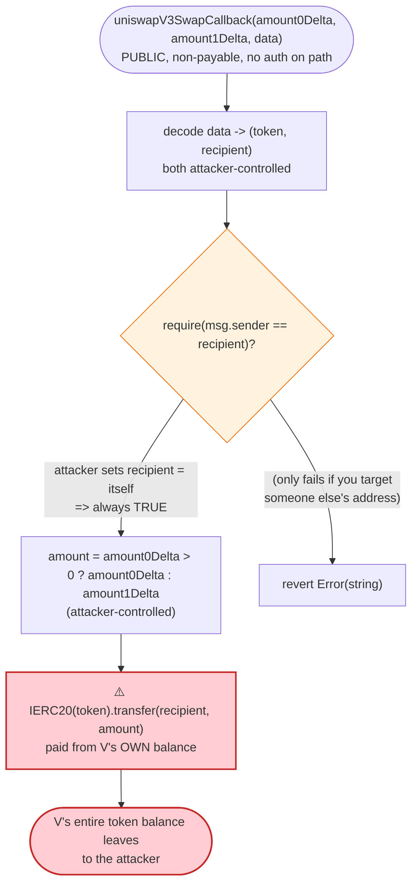
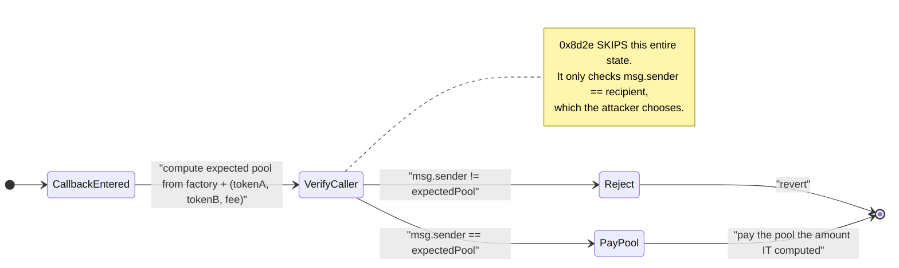

# 0x8d2e Exploit — Permissionless `uniswapV3SwapCallback` Drains the Contract's USDC

> One-liner: the victim's `uniswapV3SwapCallback` can be called by anyone with attacker-chosen
> token/recipient/amount, and its only "guard" (`require(msg.sender == recipient)`) is trivially
> satisfied by setting the recipient to yourself — so a single external call transfers the whole
> 40,000 USDC balance out of the contract.

> **Reproduction:** the PoC compiles & runs in an isolated Foundry project at
> [this project folder](.). Full verbose trace: [output.txt](output.txt).
> The vulnerable contract is **UNVERIFIED** on Basescan, so the analysis of its
> internals below is reconstructed from the on-chain bytecode disassembly + the live
> execution trace. The PoC itself is [test/0x8d2e_exp.sol](test/0x8d2e_exp.sol).

---

## Key info

| | |
|---|---|
| **Loss** | **40,000 USDC** (≈ $40k) — the entire USDC balance of the victim contract |
| **Vulnerable contract** | `0x8d2e` — [`0x8d2Ef0d39A438C3601112AE21701819E13c41288`](https://basescan.org/address/0x8d2Ef0d39A438C3601112AE21701819E13c41288#code) (unverified) |
| **Victim / drained funds** | The vulnerable contract itself held the USDC; it was its own treasury that got drained |
| **Token drained** | USDC on Base — [`0x833589fCD6eDb6E08f4c7C32D4f71b54bdA02913`](https://basescan.org/address/0x833589fCD6eDb6E08f4c7C32D4f71b54bdA02913) |
| **Attacker EOA** | [`0x4efd5f0749b1b91afdcd2ecf464210db733150e0`](https://basescan.org/address/0x4efd5f0749b1b91afdcd2ecf464210db733150e0) |
| **Attacker contract** | [`0x2a59ac31c58327efcbf83cc5a52fae1b24a81440`](https://basescan.org/address/0x2a59ac31c58327efcbf83cc5a52fae1b24a81440) |
| **Attack tx** | [`0x6be0c4b5414883a933639c136971026977df4737b061f864a4a04e4bd7f07106`](https://basescan.org/tx/0x6be0c4b5414883a933639c136971026977df4737b061f864a4a04e4bd7f07106) |
| **Chain / block / date** | Base / 34,459,414 (forked at 34,459,413) / 2025-08-20 |
| **Compiler** | Unverified; bytecode uses `PUSH0` ⇒ Solidity ≥ 0.8.20 (Shanghai). PoC compiled with Solc 0.8.34 |
| **Bug class** | Missing access control on an external callback / arbitrary external `transfer` of contract funds |

---

## TL;DR

`0x8d2e` is some kind of trading/router contract that exposes a Uniswap-V3-style
`uniswapV3SwapCallback(int256 amount0Delta, int256 amount1Delta, bytes data)`. In a real Uniswap V3
swap, the pool calls this callback on the swapper so the swapper can pay the pool what it owes — and
the callback **must** verify that `msg.sender` is the legitimate pool it expects, otherwise anyone can
invoke it directly.

`0x8d2e`'s callback does **not** verify that the caller is a real Uniswap V3 pool. Its only check is
`require(msg.sender == recipient)`, where `recipient` is decoded straight out of the attacker-supplied
`data`. The attacker simply sets `recipient = themselves`, so the check passes. The callback then does:

```
IERC20(token).transfer(recipient, amount)
```

with `token` and `recipient` both taken from `data`, and `amount` taken from `amount0Delta` — all
fully attacker-controlled. The funds come out of `0x8d2e`'s own balance.

The attacker called it once with `data = abi.encode(USDC, attacker)` and `amount0Delta = 40,000e6`,
and the contract dutifully sent its entire **40,000 USDC** to the attacker. No flash loan, no price
manipulation, no setup — a single unprivileged call.

---

## Background — what the contract does

The contract is unverified, but its function dispatch table (decoded from the deployed bytecode)
reveals its shape. Notable selectors present in the runtime:

| Selector | Signature | Note |
|---|---|---|
| `0xfa461e33` | `uniswapV3SwapCallback(int256,int256,bytes)` | **the vulnerable entry point** |
| `0x095ea7b3` (used internally) | `approve(address,uint256)` | it approves a router with `type(uint256).max` on init |
| `0xa9059cbb` (used internally) | `transfer(address,uint256)` | the call the callback performs |
| `0x8da5cb5b` / `0xf2fde38b` / `0x715018a6` | `owner()` / `transferOwnership` / `renounceOwnership` | it's `Ownable` |
| `0x1de1e4a1` (and others) | gated by a `mapping(address => bool)` allowlist (slot 6) | other functions revert with custom error `0x584a7938` if `!allowed[msg.sender]` |

So the contract clearly *has* an access-control primitive (the slot-6 allowlist mapping is checked at
the top of several other functions), and it *is* `Ownable`. The vulnerability is precisely that the
**callback path skips both** — neither the owner check nor the allowlist mapping nor a
"is the caller a real pool?" check is applied on `uniswapV3SwapCallback`.

The contract held **40,000 USDC** at the fork block — confirmed on-chain:

```
cast call USDC "balanceOf(address)" 0x8d2Ef0...41288 --block 34459413
=> 40000000000   (40,000 * 1e6)
```

That balance was its treasury / working capital for whatever swapping it does, and it is exactly what
the attacker walked off with.

---

## The vulnerable code

The contract is unverified, so here is the **reconstructed logic of the callback** from the bytecode
disassembly (`uniswapV3SwapCallback`, dispatch target `0x651` → body `0x29f4`). In Solidity terms it
is equivalent to:

```solidity
// selector 0xfa461e33
function uniswapV3SwapCallback(
    int256 amount0Delta,
    int256 amount1Delta,
    bytes calldata data
) external {
    // decode the attacker-controlled payload
    (address token, address recipient) = abi.decode(data, (address, address));

    // ⚠️ the ONLY guard — and it checks the WRONG thing.
    // It requires msg.sender to equal the recipient that the CALLER chose,
    // NOT that msg.sender is a legitimate Uniswap V3 pool.
    require(msg.sender == recipient, "..."); // Error(string), revert at body offset 0x2a3d

    // pick the positive side of the delta as the amount owed
    uint256 amount = amount0Delta > 0 ? uint256(amount0Delta) : uint256(amount1Delta);

    // ⚠️ pay out of THIS contract's own balance, to an attacker-chosen address,
    //    in an attacker-chosen token, for an attacker-chosen amount.
    IERC20(token).transfer(recipient, amount); // a9059cbb CALL at body offset 0x36cf
}
```

Disassembly evidence (see [output.txt](output.txt) and the live trace below):

- **Dispatch, no auth on the path** — `[selector 0xfa461e33] EQ → PUSH2 0x0651 → JUMPI`
  (bytecode `0x55`). The handler at `0x651` only does a `CALLVALUE` (non-payable) check, decodes the
  args, jumps to the body `0x29f4`, then `STOP`. There is **no `CALLER` check, no `SLOAD` of the
  owner, no allowlist lookup** anywhere on this path.
- **The wrong guard** — at body offset `0x2a21`: `CALLER ... EQ → JUMPI 0x2a77`, with the
  `false` branch reverting via `Error(string)` (`0x08c379a0`) at `0x2a3d`. The address compared
  against `CALLER` is one of the two addresses decoded from `data` (the recipient), so the attacker
  satisfies it by setting that address to itself.
- **The payout** — at body offset `0x3644`: it assembles `transfer(address,uint256)` calldata
  (`PUSH4 0xa9059cbb` at `0x365e`) and does a `CALL` (`0x36cf`) to the decoded `token` with the
  decoded `recipient` and the delta-derived `amount`.

Contrast this with the contract's *other* functions, which **do** gate on the allowlist
(`mapping(address=>bool)` at storage slot 6, checked e.g. at offset `0x679`: `PUSH1 0x06 ... CALLER ...
KECCAK256 ... SLOAD ... JUMPI`, reverting with custom error `0x584a7938` when the caller isn't
allowed). The author knew how to add access control — they just never added it to the callback.

---

## Root cause — why it was possible

A Uniswap V3 `swap()` flow works like this: the swapper calls `pool.swap(...)`, the pool optimistically
sends the output tokens, then calls `swapper.uniswapV3SwapCallback(amount0Delta, amount1Delta, data)`
to demand payment of the input side, then checks its `k` invariant. **The entire security of the
callback rests on the callback verifying `msg.sender == the_expected_pool`** — because the callback
*pays tokens out*. The canonical Uniswap periphery does exactly this with
`CallbackValidation.verifyCallback(...)`, which recomputes the pool address from the factory + the
token/fee triple and reverts if `msg.sender` isn't that pool.

`0x8d2e` skips this verification entirely. Its callback:

1. **Trusts `msg.sender` implicitly** — it never establishes that the caller is a real pool that has
   just sent it output tokens. Anyone can call it directly.
2. **Reads the payout token and destination from `data`** — both attacker-controlled. In a correct
   implementation, `data` is opaque to the *attacker* (the contract itself encodes it when it starts
   the swap); here the contract accepts whatever the external caller passes.
3. **Reads the payout amount from `amount0Delta`** — attacker-controlled. Normally this is the amount
   the *pool computed* the swapper owes; here it's just a number the caller picks.
4. **Has a guard that protects nothing** — `require(msg.sender == recipient)`. This only forces the
   caller and the recipient to be the same address; it does not constrain *who* may call or *where*
   the contract's own funds may go. The attacker is happy to receive the funds at the address it's
   calling from.

The net effect: `uniswapV3SwapCallback` is a public "send my balance to whoever asks" function. The
contract's own USDC treasury is the loss.

---

## Preconditions

- The vulnerable contract holds a non-zero balance of some ERC-20 (here, 40,000 USDC). Whatever token
  the contract holds can be specified as `token` in `data` and drained.
- That's it. **No** trading state, **no** price manipulation, **no** flash loan, **no** elapsed time,
  **no** special role. The attacker EOA / contract is a completely unprivileged caller. The exploit
  is a single external call.

---

## Attack walkthrough (with on-chain numbers from the trace)

The PoC reduces the live attack to its essence: read the victim's USDC balance, then call the callback
once to pull all of it.

| # | Step | Call | Result |
|---|------|------|--------|
| 0 | **Read balance** | `USDC.balanceOf(0x8d2e)` | `40,000,000,000` = **40,000 USDC** |
| 1 | **Build payload** | `data = abi.encode(USDC, address(this))` | token = USDC, recipient = attacker |
| 2 | **Invoke callback** | `0x8d2e.uniswapV3SwapCallback(40000e6, 0, data)` | guard `msg.sender == recipient` ✓ (both = attacker) |
| 3 | **Payout** | victim runs `USDC.transfer(attacker, 40000e6)` | **40,000 USDC** moved out of victim |
| 4 | **Final balance** | attacker USDC: 0.02 → **40,000.02** | profit = **40,000 USDC** |

From the trace ([output.txt](output.txt)):

```
├─ USDC::balanceOf(0x8d2Ef0...41288) => 40000000000        # victim holds 40k USDC
├─ 0x8d2Ef0...41288::uniswapV3SwapCallback(40000000000, 0, 0x...833589fc...7fa9385b...)
│   ├─ USDC::transfer(Contract0x8d2e [0x7FA9...1496], 40000000000)
│   │   ├─ emit Transfer(from: 0x8d2Ef0...41288, to: 0x7FA9...1496, value: 40000000000)
│   │   └─ ← true
│   └─ ← [Stop]
...
Attacker Before exploit USDC Balance: 0.020000
Attacker After  exploit USDC Balance: 40000.020000
```

(The `0.02 USDC` the attacker "started" with is just the tiny seed the test harness deals; the real
delta is the 40,000 USDC drained from the victim.)

### Profit accounting (USDC)

| | Amount |
|---|---:|
| Attacker USDC before | 0.02 |
| Drained from victim `0x8d2e` | +40,000.00 |
| Attacker USDC after | 40,000.02 |
| **Net profit** | **+40,000.00 USDC** |

The attacker spent nothing but gas. The loss equals the victim contract's entire USDC balance.

---

## Diagrams

### Sequence of the attack



### Why the guard protects nothing



### What a correct callback would do (state of the missing check)



---

## Remediation

1. **Verify the caller is the real pool.** The callback must compute the expected Uniswap V3 pool
   address from the canonical factory and the `(token0, token1, fee)` triple (Uniswap's
   `PoolAddress.computeAddress` / `CallbackValidation.verifyCallback`) and `require(msg.sender ==
   expectedPool)`. A callback that pays tokens out **must** authenticate its caller; this is the entire
   point of the callback pattern.
2. **Never derive the payout token / recipient / amount from untrusted input.** The contract should
   only ever pay the *pool* (i.e., `msg.sender` after it is verified), only the token *it* is swapping,
   and only the amount the *pool* computed (`amount0Delta` / `amount1Delta` as owed to that specific
   pool). Decoding the destination from `data` provided by an arbitrary caller is the core mistake.
3. **Apply the existing access-control primitive to the callback too.** The contract already has an
   owner and an allowlist mapping it uses elsewhere; even a transient "swap in progress" reentrancy
   latch (set before calling `pool.swap`, checked + cleared in the callback) would have blocked a
   cold external call.
4. **Don't let the contract custody funds it doesn't need to.** If 40,000 USDC sat in the contract as
   working capital, the blast radius of any callback bug is that whole balance — pull funds in
   just-in-time and sweep them out after each operation.

---

## How to reproduce

```bash
_shared/run_poc.sh 2025-08-0x8d2e_exp -vvvvv
```

- RPC: a **Base archive** endpoint is required (the fork is at block 34,459,413). `foundry.toml`
  uses `https://base-mainnet.public.blastapi.io`, which serves historical state at that block.
- Result: `[PASS] testExploit()`.

Expected tail:

```
  Attacker Before exploit USDC Balance: 0.020000
  Attacker After exploit USDC Balance: 40000.020000

Suite result: ok. 1 passed; 0 failed; 0 skipped
Ran 1 test suite ... : 1 tests passed, 0 failed, 0 skipped (1 total tests)
```

---

*Source note: the vulnerable contract `0x8d2Ef0d39A438C3601112AE21701819E13c41288` is UNVERIFIED on
Basescan; the internal logic above was reconstructed from the deployed bytecode disassembly and the
live Foundry fork trace in [output.txt](output.txt). The only verified source available for related
addresses was the standard Circle USDC implementation, downloaded to
[sources/FiatTokenV2_2_2Ce631/](sources/FiatTokenV2_2_2Ce631/) (the token itself is not the bug).*
*Reference: TenArmor alert — https://x.com/TenArmorAlert/status/1958354933247590450*
