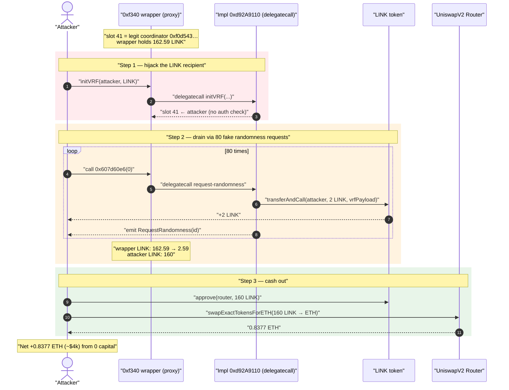
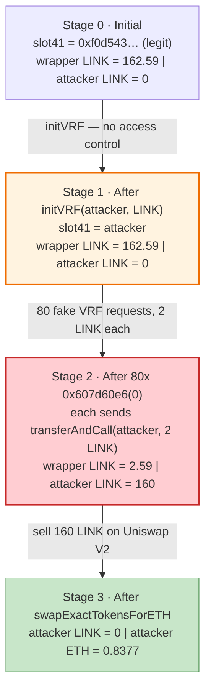
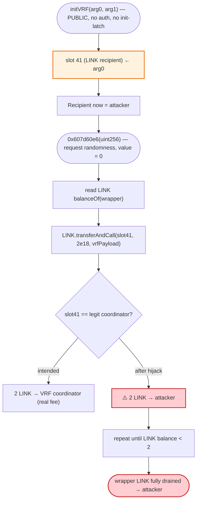

# 0xf340 VRF-Wrapper Exploit — Permissionless `initVRF()` Hijacks the LINK Payment Recipient

> **Vulnerability classes:** vuln/access-control/missing-auth · vuln/access-control/uninitialized-owner

> **Reproduction:** the PoC compiles & runs in an isolated Foundry project at
> [this project folder](.) (the umbrella DeFiHackLabs repo
> contains many unrelated PoCs that do not whole-compile, so this one was extracted).
> Full verbose trace: [output.txt](output.txt).
> The vulnerable contract is a **TransparentUpgradeableProxy** whose implementation is
> **unverified on Etherscan**, so the analysis below is reconstructed from the on-chain
> execution trace, raw bytecode, and storage reads (no Solidity source is available).

---

## Key info

| | |
|---|---|
| **Loss** | ~$4,000 — **160 LINK** drained, swapped to **0.837736523415338256 ETH** |
| **Vulnerable contract** | `0xf340` VRF wrapper (proxy) — [`0xF340bd3eB3E82994CfF5B8C3493245EDbcE63436`](https://etherscan.io/address/0xf340bd3eb3e82994cff5b8c3493245edbce63436) (impl `0xd92A9110Beaf09115bc9628D8a296c2778041FE0`, unverified) |
| **Stolen asset** | Chainlink `LINK` — `0x514910771AF9Ca656af840dff83E8264EcF986CA` |
| **Attacker EOA** | [`0xda97a086fc74b20c88bd71e12e365027e9ec2d24`](https://etherscan.io/address/0xda97a086fc74b20c88bd71e12e365027e9ec2d24) |
| **Attacker contract** | [`0xd76c5305d0672ce5a2cdd1e8419b900410ea1d36`](https://etherscan.io/address/0xd76c5305d0672ce5a2cdd1e8419b900410ea1d36) |
| **Attack tx** | [`0x103b4550a1a2bdb73e3cb5ea484880cd8bed7e4842ecdd18ed81bf67ed19e03c`](https://etherscan.io/tx/0x103b4550a1a2bdb73e3cb5ea484880cd8bed7e4842ecdd18ed81bf67ed19e03c) |
| **Chain / block / date** | Ethereum mainnet / 23,232,613 / 2025-08-27 (fork at block −1 = 23,232,612) |
| **Compiler** | PoC: Solidity `^0.8.15` (Foundry, `evm_version = cancun`) |
| **Bug class** | Missing access control / re-initialization on `initVRF()` → attacker controls the LINK transfer recipient |

---

## TL;DR

`0xf340` is a thin **Chainlink VRF wrapper** (a TransparentUpgradeableProxy delegating to
implementation `0xd92A9110…`). It holds a balance of `LINK` and, when randomness is requested,
pays the Chainlink VRF coordinator by calling `LINK.transferAndCall(<recipient>, 2e18, vrfRequestPayload)`.
The `<recipient>` address lives in **storage slot 41**, and at the fork block it correctly pointed at
the legitimate VRF coordinator/keyhash holder `0xf0d54349addcf704f77ae15b96510dea15cb7952`.

The fatal flaw: the wrapper exposes an **un-guarded `initVRF(address arg0, address arg1)`** function
(selector `0xd73f349b`) that anyone can call at any time. It simply overwrites slot 41 with `arg0`.
There is no `initializer` modifier, no `onlyOwner`, no "already initialized" latch.

The attacker:

1. Calls `victim.initVRF(attacker, LINK)` — overwriting slot 41 so the VRF "coordinator" is now the
   **attacker's own contract**.
2. Calls the request-randomness function `0x607d60e6(uint256)` **80 times**. Each call fires
   `LINK.transferAndCall(attacker, 2 LINK, …)`, so each invocation siphons exactly **2 LINK** out of
   the wrapper into the attacker.
3. After 80 calls the wrapper's LINK is exhausted (162.59 LINK → 2.59 LINK leftover); the attacker
   holds **160 LINK**, which they swap on Uniswap V2 for **0.8377 ETH**.

Net result: the attacker walks off with 160 LINK (~$4k). Every randomness "request" still emits a
valid `RequestRandomness` event, so the contract believes it is paying for VRF normally — it is just
paying the attacker.

---

## Background — what the `0xf340` wrapper does

There is no verified source, but the structure is unambiguous from bytecode + trace:

- **It is an OpenZeppelin `TransparentUpgradeableProxy`.** The proxy bytecode contains the standard
  admin/upgrade selectors (`5c60da1b` = `implementation()`, `f851a440` = `admin()`,
  `8f283970` = `changeAdmin()`, `3659cfe6` = `upgradeTo()`, `4f1ef286` = `upgradeToAndCall()`), and the
  EIP-1967 implementation slot
  `0x360894a13ba1a3210667c828492db98dca3e2076cc3735a920a3ca505d382bbc` reads
  `0x…d92a9110beaf09115bc9628d8a296c2778041fe0`. So every call to `0xf340` is `delegatecall`ed into
  implementation `0xd92A9110…` and operates on the proxy's storage.
- **It is a Chainlink VRF consumer.** It holds `LINK` and, on each randomness request, pays the VRF
  coordinator via `LINK.transferAndCall(coordinator, fee, abi.encode(keyHash, requestSlot))`. The
  trace shows the payload begins with keyHash
  `0xaa77729d3466ca35ae8d28b3bbac7cc36a5031efdc430821c02bc31a238af445` and a fee of `2e18` LINK, and
  ends by emitting `RequestRandomness(requestId)`.

On-chain facts at the fork block (read via `cast`):

| Parameter | Value |
|---|---|
| Implementation (EIP-1967 slot) | `0xd92A9110Beaf09115bc9628D8a296c2778041FE0` (22,755 bytes, unverified) |
| Proxy code size | 2,163 bytes (Transparent proxy) |
| **Storage slot 41 (LINK recipient)** | `0x…f0d54349addcf704f77ae15b96510dea15cb7952` (legit coordinator, 7,620-byte contract) |
| **LINK held by the wrapper** | **162.593046738967252304 LINK** ← the prize |
| VRF fee per request (`transferAndCall` value) | 2.0 LINK |

That `LINK` balance and the controllable recipient address are the whole game: the attacker only has
to (a) repoint the recipient at themselves and (b) pull the trigger enough times to drain the balance.

---

## The vulnerable behavior (reconstructed from trace + bytecode)

> The implementation `0xd92A9110…` is **unverified**, so no Solidity is reproduced here. The two
> selectors below were confirmed present in the implementation bytecode and their effects are taken
> verbatim from the execution trace in [output.txt](output.txt).

### 1. `initVRF(address arg0, address arg1)` — selector `0xd73f349b`, no access control

The very first call in the exploit rewrites the LINK recipient in storage slot 41 with no guard:

```text
[15111] 0xF340…::initVRF(Contract0xf340 [attacker], LinkToken)
  └─ [7814] 0xd92A9110…::initVRF(attacker, LinkToken) [delegatecall]
       storage changes:
         @ 41:  0x…f0d54349addcf704f77ae15b96510dea15cb7952   ← legit coordinator
            →   0x…7fa9385be102ac3eac297483dd6233d62b3e1496   ← attacker
```

(see [output.txt:19-24](output.txt#L19)). `arg0` (the attacker) lands directly in slot 41; `arg1`
(the LINK token address) is used elsewhere in initialization. The function name `initVRF` strongly
implies it was meant to be a **one-time initializer**, but there is **no `initializer`/`reinitializer`
modifier and no owner check** — it is callable by anyone, repeatedly, after deployment.

### 2. `0x607d60e6(uint256)` — request randomness, pays slot-41 with `transferAndCall`

Each request reads the LINK balance, then calls `LINK.transferAndCall(<slot 41>, 2e18, vrfPayload)`:

```text
[74749] 0xF340…::607d60e6(0x000…000)
  └─ [73955] 0xd92A9110…::607d60e6(0x000…000) [delegatecall]
       ├─ LinkToken::balanceOf(0xF340…) → 162.593… LINK
       ├─ LinkToken::transferAndCall(attacker, 2000000000000000000, 0xaa77729d…)   ← 2 LINK to attacker
       │    emit Transfer(0xF340… → attacker, 2e18)
       └─ emit RequestRandomness(0x32aa6dc8…)
```

(see [output.txt:25-43](output.txt#L25)). Because slot 41 now holds the attacker, the LINK that was
supposed to pay the VRF coordinator is sent to the attacker instead, while the contract still emits a
normal-looking `RequestRandomness` event.

---

## Root cause — why it was possible

A Chainlink VRF consumer pays for randomness by transferring `LINK` to the coordinator. This wrapper
made the recipient of that payment a **mutable storage variable** (slot 41) and exposed a
**permissionless setter** (`initVRF`) for it. The combination is a textbook
**unprotected-initializer / missing-access-control** vulnerability:

1. **`initVRF` has no access control and no one-shot guard.** It can be called by any address at any
   time, overwriting the LINK recipient. The legitimate coordinator value `0xf0d543…` was simply
   replaced with the attacker.
2. **The payment recipient is fully attacker-controlled.** Once slot 41 points at the attacker, every
   "VRF fee" is a direct LINK transfer to the attacker — no swap, no slippage, no economic cost.
3. **The trigger (`0x607d60e6`) is itself callable with zero ether and no preconditions.** The PoC
   passes `slot = 0` and the call succeeds 80 times in a row; the only natural limit is the contract's
   LINK balance (each call moves a fixed 2 LINK).
4. **The proxy was upgradeable, so the impl could have fixed this — but didn't.** The admin path
   (`upgradeTo`) was never exercised by the attacker; the bug was reachable directly through the
   normal implementation logic.

There is no economic flash-loan trick here and no AMM manipulation — the loss is the contract's
entire spendable LINK balance, transferred out 2 LINK at a time to an attacker-chosen address.

---

## Preconditions

- The wrapper holds a `LINK` balance to pay VRF fees (162.59 LINK at the fork block).
- `initVRF(address,address)` is reachable and unguarded (it is — confirmed by the trace overwriting
  slot 41 with no revert).
- The request function `0x607d60e6` can be invoked freely with `value = 0` (it can — 80 successful
  calls in the PoC).
- No working capital is required. The attacker spends only gas; the 160 LINK is pure profit, later
  converted to ETH on Uniswap.

---

## Attack walkthrough (with on-chain numbers from the trace)

All figures are taken directly from [output.txt](output.txt).

| # | Step | Wrapper LINK balance | Attacker LINK | Effect |
|---|------|---------------------:|--------------:|--------|
| 0 | **Initial** (fork block 23,232,612) | 162.593046… | 0 | slot 41 = legit coordinator `0xf0d543…` |
| 1 | `victim.initVRF(attacker, LINK)` | 162.593046… | 0 | **slot 41 ← attacker** (recipient hijacked) |
| 2 | `0x607d60e6(0)` — request #1 | 162.59 → 160.59 | 2 | `transferAndCall(attacker, 2 LINK)` + `RequestRandomness` |
| 3 | `0x607d60e6(0)` — request #2 | 160.59 → 158.59 | 4 | another 2 LINK to attacker |
| … | … (requests #3 … #79) | … | … | each pulls 2 LINK |
| 4 | `0x607d60e6(0)` — request #80 | 4.59 → 2.59 | **160** | last drain; wrapper left with 2.59 LINK |
| 5 | `LINK.approve(router, 160)` + `swapExactTokensForETH` | — | 0 | 160 LINK → **0.837736523415338256 ETH** |

Per the trace, the request-randomness function (`0xF340…::607d60e6`) is called **exactly 80 times**,
each moving a fixed **2 LINK**, so `80 × 2 = 160 LINK` are siphoned. The wrapper's balance falls from
**162.593046738967252304** to **2.593046738967252304 LINK** (residual = 162.59 − 160).

### Final swap (Uniswap V2 LINK/WETH)

```text
UniswapV2Pair::getReserves() → reserve0 = 58,953.479… LINK, reserve1 = 310.438… WETH
swapExactTokensForETH(160 LINK, 1, [LINK, WETH], attacker, deadline)
  → out = 0.837736523415338256 ETH
emit Sync(reserve0 = 59,113.479… LINK, reserve1 = 309.600… WETH)
```

(see [output.txt](output.txt) swap section). 160 LINK swapped against a deep ~58.9k-LINK / 310-WETH
pool yields **0.837736523415338256 ETH** with negligible slippage.

### Profit accounting

| Item | Amount |
|---|---:|
| LINK drained from wrapper (80 × 2 LINK) | 160.000000 LINK |
| Wrapper LINK before / after | 162.593047 → 2.593047 LINK |
| LINK swapped → ETH | 160 LINK → **0.837736523415338256 ETH** |
| Attacker ETH before / after exploit | 0 → **0.837736523415338256 ETH** |
| Working capital required | 0 (gas only) |
| **Net profit** | **160 LINK ≈ 0.8377 ETH ≈ ~$4,000** |

The attacker's measured ETH gain (`Attacker After exploit ETH Balance: 0.837736523415338256`,
[output.txt:7](output.txt#L7)) equals the full value of the drained 160 LINK to the wei.

---

## Diagrams

### Sequence of the attack



### Storage / balance state evolution



### The flaw inside `initVRF` / `0x607d60e6`



---

## Remediation

1. **Make `initVRF` a true one-time initializer with access control.** Use OpenZeppelin's
   `initializer`/`reinitializer` modifier (so it can run only once) **and** restrict the post-deploy
   setter path to `onlyOwner`/`DEFAULT_ADMIN_ROLE`. Anyone being able to set the LINK payment recipient
   is the entire bug.
2. **Do not store the VRF coordinator/recipient as a mutable, externally-settable address.** Pin it as
   an `immutable` set in the constructor (or behind a timelocked admin function), so the address LINK
   is paid to cannot be swapped to an arbitrary EOA.
3. **Separate "initialize" from "request".** A request function that pays out a fixed LINK amount per
   call to a stored address must verify that address is the canonical Chainlink coordinator (e.g.,
   compare against a hard-coded/immutable coordinator), not whatever was last written by `initVRF`.
4. **Rate-limit / cap fee outflow.** A request endpoint that is permissionless and value-free should
   not be able to be called in an unbounded loop to drain the contract's whole LINK balance; gate it
   on a subscription, a per-caller allowance, or a paid request flow.
5. **Audit unverified upgradeable implementations.** This contract was deployed behind a Transparent
   proxy with an **unverified** implementation; the missing guard would have been caught by a basic
   access-control review of the initializer.

---

## How to reproduce

The PoC was extracted into a standalone Foundry project (the umbrella DeFiHackLabs repo has many
unrelated PoCs that fail under a whole-project `forge build`):

```bash
_shared/run_poc.sh 2025-08-0xf340_exp -vvvvv
```

- RPC: an **Ethereum mainnet archive** endpoint is required (fork block 23,232,612). The default
  Infura key shipped in the template returned `HTTP 401 invalid project id`; `foundry.toml` was
  switched to `https://eth.drpc.org`, which serves historical state at that block.
- Local imports beyond `forge-std/Test.sol` and `../interface.sol`: the PoC also imports
  `../basetest.sol`, which in turn imports `./tokenhelper.sol`; both were copied into the project root
  ([basetest.sol](basetest.sol), [tokenhelper.sol](tokenhelper.sol)) so the relative paths from
  [test/0xf340_exp.sol](test/0xf340_exp.sol) resolve.
- Result: `[PASS] testExploit()` with `Attacker After exploit ETH Balance: 0.837736523415338256`.

Expected tail:

```
Ran 1 test for test/0xf340_exp.sol:Contract0xf340
[PASS] testExploit() (gas: …)
Logs:
  Attacker Before exploit ETH Balance: 0.000000000000000000
  Attacker After exploit ETH Balance: 0.837736523415338256

Suite result: ok. 1 passed; 0 failed; 0 skipped
```

---

*Vulnerable contract source is unverified on Etherscan; mechanics above are reconstructed from the
on-chain trace, raw bytecode (proxy + implementation selectors), and `cast storage` reads at the fork
block. Post-mortem reference (from PoC header): https://t.me/defimon_alerts/1733.*
