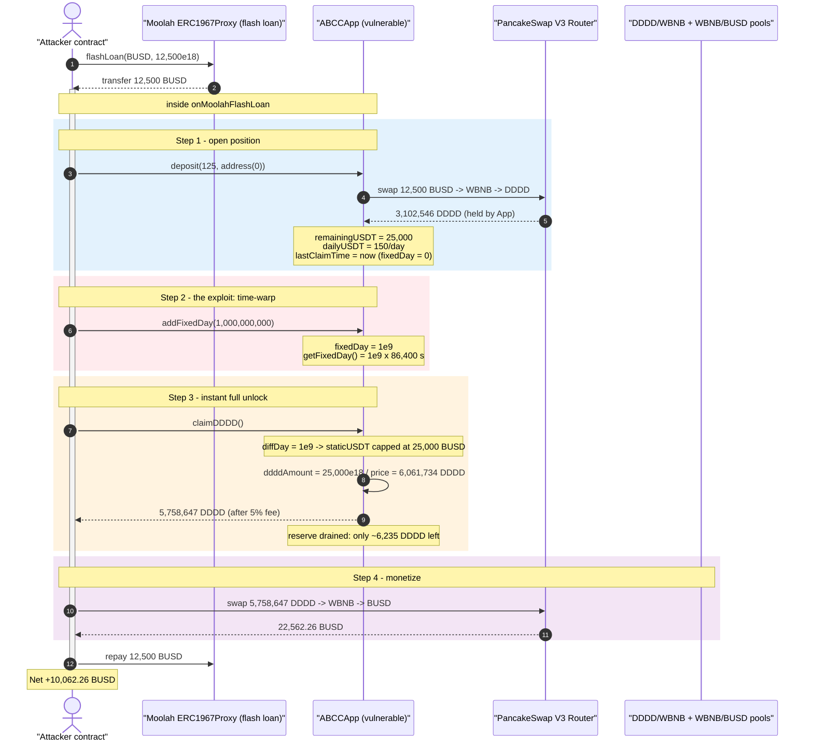
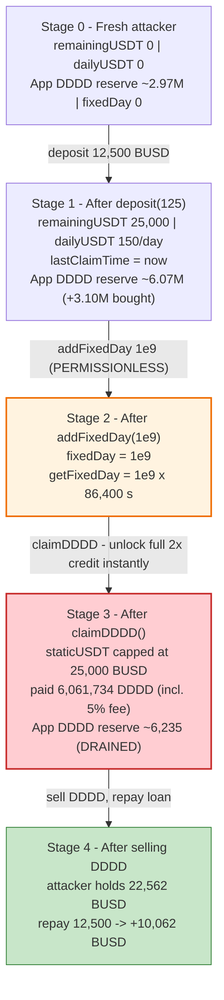
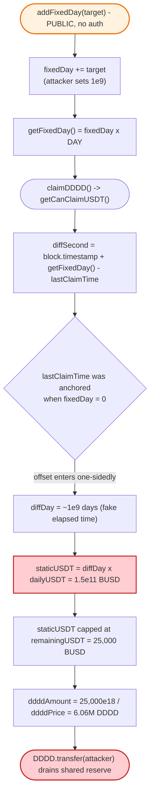

# ABCCApp Exploit — Permissionless `addFixedDay()` Vesting Time-Warp Drains the DDDD Reward Reserve

> **One-liner:** ABCCApp's daily-vesting reward unlock is gated by a timestamp offset (`fixedDay`) that **anyone can set to an arbitrary value** through the public, unauthenticated `addFixedDay()`. By fast-forwarding `getFixedDay()` by a billion days, an attacker instantly unlocks the full `2×` "remaining" credit of a fresh deposit and claims it out in DDDD tokens drawn from the **shared protocol reserve** funded by previous depositors — netting ~10,062 BUSD per flash-loan-sized cycle.

> **Reproduction:** the PoC compiles & runs in an isolated Foundry project at
> [this project folder](.) (the umbrella DeFiHackLabs repo
> does not whole-compile, so this PoC was extracted).
> Full verbose trace: [output.txt](output.txt).
> Verified vulnerable source: [contract_abcc_ABCCApp.sol](sources/ABCCApp_1bC016/contract_abcc_ABCCApp.sol).

---

## Key info

| | |
|---|---|
| **Loss** | **~10,062 BUSD** profit per cycle (≈ the protocol's DDDD reserve, sourced from prior depositors) |
| **Vulnerable contract** | `ABCCApp` — [`0x1bC016C00F8d603c41A582d5Da745905B9D034e5`](https://bscscan.com/address/0x1bC016C00F8d603c41A582d5Da745905B9D034e5#code) |
| **Victim / drained reserve** | ABCCApp's own DDDD balance (built from earlier user deposits) + the DDDD/BNB and BNB/USDT PancakeSwap V3 pools used to monetize |
| **Attacker EOA** | [`0x53feee33527819bb793b72bd67dbf0f8466f7d2c`](https://bscscan.com/address/0x53feee33527819bb793b72bd67dbf0f8466f7d2c) |
| **Attacker contract** | [`0x90e076ef0fed49a0b63938987f2cad6b4cd97a24`](https://bscscan.com/address/0x90e076ef0fed49a0b63938987f2cad6b4cd97a24) |
| **Attack tx** | [`0xee4eae6f70a6894c09fda645fb24ab841e9847a788b1b2e8cb9cc50c1866fb12`](https://bscscan.com/tx/0xee4eae6f70a6894c09fda645fb24ab841e9847a788b1b2e8cb9cc50c1866fb12) |
| **Chain / block / date** | BSC / 58,615,054 (fork block) / **2025-08-23** |
| **Compiler** | Solidity v0.8.24, optimizer **200 runs** |
| **Flash-loan source** | Moolah `ERC1967Proxy` — [`0x8F73b65B4caAf64FBA2aF91cC5D4a2A1318E5D8C`](https://bscscan.com/address/0x8F73b65B4caAf64FBA2aF91cC5D4a2A1318E5D8C) (`onMoolahFlashLoan` callback) |
| **Bug class** | Broken access control on time-sensitive state → reward vesting bypass / reserve drain |

---

## TL;DR

ABCCApp is a "deposit-and-earn" / referral scheme. A user deposits BUSD; the contract:

- swaps the BUSD into DDDD tokens (held by the contract),
- credits the user a `remainingUSDT` balance equal to **2× the deposit**, and
- vests that credit at a fixed daily rate (`dailyUSDT`), redeemable later as DDDD via `claimDDDD()`.

The amount currently claimable is computed in [`getCanClaimUSDT()`](sources/ABCCApp_1bC016/contract_abcc_ABCCApp.sol#L158-L171) as
`diffDay × dailyUSDT`, where `diffDay` is derived from
`block.timestamp + getFixedDay() − lastClaimTime`. The `getFixedDay()` term is meant to be an admin "settlement day" offset — but it is driven by the state variable `fixedDay`, and **`fixedDay` is writable by anyone** through the public, access-control-free function:

```solidity
function addFixedDay(uint target) public {        // ⚠️ NO onlyOwner / onlyOperator
    if(target == 0) { fixedDay = 0; }
    else            { fixedDay += target; }
}
```
[contract_abcc_ABCCApp.sol:393-399](sources/ABCCApp_1bC016/contract_abcc_ABCCApp.sol#L393-L399)

The attacker:

1. **Flash-loans 12,500 BUSD** from Moolah.
2. **`deposit(125, address(0))`** — `125 × partUSDT(100e18) = 12,500 BUSD`. The contract buys ~3.10M DDDD and credits `remainingUSDT = 25,000 BUSD`, `dailyUSDT = 150 BUSD/day`, with `lastClaimTime = now` (because `fixedDay` is still 0 at this instant).
3. **`addFixedDay(1_000_000_000)`** — sets `fixedDay = 1e9`, so `getFixedDay() = 1e9 × 86,400 s`.
4. **`claimDDDD()`** — now `diffDay = 1e9 days`, so `staticUSDT = 1e9 × 150 = 150 billion BUSD`, **capped to the full `remainingUSDT` = 25,000 BUSD**. The entire 2× credit is unlocked in one shot, with **zero waiting time**, and paid out as **6,061,734 DDDD** — almost twice the 3.10M the deposit actually bought. The excess **2.96M DDDD comes from the contract's reserve** accumulated from earlier depositors.
5. **Sell the DDDD** back through PancakeSwap (DDDD→WBNB→BUSD) for 22,562 BUSD, repay the 12,500 BUSD loan, and walk off with **10,062 BUSD**.

The daily vesting schedule — the only mechanism that should have made this a slow, capital-bounded trickle — is **completely nullified** because the time anchor it depends on is attacker-controlled.

---

## Background — what ABCCApp does

`ABCCApp` ([source](sources/ABCCApp_1bC016/contract_abcc_ABCCApp.sol)) is an `Ownable` BSC contract implementing a multi-level-referral "investment" product priced in BUSD (labelled `USDT` on-chain) and paid out in a project token, **DDDD**.

Per-user accounting lives in the `User` struct ([:86-100](sources/ABCCApp_1bC016/contract_abcc_ABCCApp.sol#L86-L100)). The economically relevant fields are:

| Field | Meaning |
|---|---|
| `remainingUSDT` | Outstanding credit the user may still claim. Set to **2× the deposit** on `deposit()`. |
| `dailyUSDT` | How much of `remainingUSDT` vests per day (0.5% or 0.6% of `remainingUSDT`). |
| `lastClaimTime` | Anchor timestamp from which elapsed-days are measured. |

Key parameters at the fork block:

| Parameter | Value |
|---|---|
| `partUSDT` | `100 ether` (deposit unit; `payUSDT = number × partUSDT`) |
| `claimFee` | `5` (5% of claimed DDDD goes to `vaultAddr`) |
| `DAY` | `86400` |
| `fixedDay` (initial) | `0` |
| Deposit-credit multiplier | **2×** (`remainingUSDT += payUSDT * 2`) |
| `dailyUSDT` rate | 0.6% of remaining for deposits > 1000 BUSD, else 0.5% |

The contract pre-holds a pool of DDDD (bought from prior users' deposits, ~2.97M DDDD at the fork block) which is what `claimDDDD()` pays out from. **That reserve is the prize.**

---

## The vulnerable code

### 1. The vesting math keys off `getFixedDay()`

```solidity
function getCanClaimUSDT(address target) public view returns(uint totalUSDT, uint staticUSDT, uint dynamicUSDT) {
    User memory user = users[target];
    if(user.remainingUSDT == 0) {
        return (user.dynamicUSDT, 0, user.dynamicUSDT);
    }

    uint diffSecond = block.timestamp + getFixedDay() - user.lastClaimTime;   // ⚠️ getFixedDay() is attacker-inflatable
    uint diffDay = diffSecond / DAY;
    staticUSDT = diffDay * user.dailyUSDT;

    staticUSDT = staticUSDT > user.remainingUSDT ? user.remainingUSDT : staticUSDT;  // capped at the full 2× credit
    dynamicUSDT = user.dynamicUSDT;
    totalUSDT = staticUSDT + dynamicUSDT;
}
```
[contract_abcc_ABCCApp.sol:158-171](sources/ABCCApp_1bC016/contract_abcc_ABCCApp.sol#L158-L171)

### 2. `getFixedDay()` is just `fixedDay × DAY`

```solidity
function getFixedDay() public view returns(uint) {
    return fixedDay * DAY;
}
```
[contract_abcc_ABCCApp.sol:389-391](sources/ABCCApp_1bC016/contract_abcc_ABCCApp.sol#L389-L391)

### 3. `addFixedDay()` lets anyone set `fixedDay` — no access control

```solidity
function addFixedDay(uint target) public {   // ⚠️ public, no onlyOwner / onlyOperator / isOperator
    if(target == 0) {
        fixedDay = 0;
    } else {
        fixedDay += target;
    }
}
```
[contract_abcc_ABCCApp.sol:393-399](sources/ABCCApp_1bC016/contract_abcc_ABCCApp.sol#L393-L399)

Compare with every other state-mutating function on the contract — `setPartUSDT`, `setVaultAddr`, `setClaimFee`, `setUserRemainingUSDT`, `setSettlePrice`, `setLevelRate` — all of which carry `onlyOwner` ([:143-156](sources/ABCCApp_1bC016/contract_abcc_ABCCApp.sol#L143-L156), [:351-387](sources/ABCCApp_1bC016/contract_abcc_ABCCApp.sol#L351-L387)). `addFixedDay()` is the lone, clearly-administrative function that was left **unguarded**.

### 4. `deposit()` credits 2× and anchors `lastClaimTime = now`

```solidity
user.buyedDDDD   += fullDDDD;
user.investUSDT  += payUSDT;
user.remainingUSDT += payUSDT * 2;                    // ⚠️ 2× the deposit becomes claimable credit
user.lastClaimTime = block.timestamp + getFixedDay(); // anchored with the CURRENT fixedDay (= 0 at this point)
...
user.dailyUSDT = user.remainingUSDT * 6 / 1000;       // 0.6% (payUSDT > 1000 ether)
```
[contract_abcc_ABCCApp.sol:213-230](sources/ABCCApp_1bC016/contract_abcc_ABCCApp.sol#L213-L230)

### 5. `claimDDDD()` pays out the unlocked credit in DDDD from the contract's reserve

```solidity
uint ddddPrice  = getDDDDValueInUSDT(1 * 10 ** 18);
uint ddddAmount = totalUSDT * 1e18 / ddddPrice;       // 25,000 BUSD ÷ price → 6.06M DDDD
...
DDDD.transfer(msg.sender, ddddAmount);                // ⚠️ paid from the shared contract reserve
```
[contract_abcc_ABCCApp.sol:249-258](sources/ABCCApp_1bC016/contract_abcc_ABCCApp.sol#L249-L258)

---

## Root cause — why it was possible

The vesting model is sound *only if* `lastClaimTime` and `getFixedDay()` are a trustworthy clock. The fatal composition is:

1. **`addFixedDay()` has no access control.** It is plainly an admin/operator settlement knob (it mirrors `setSettlePrice`, which uses the same `getFixedDay()` offset), yet it is declared `public` with no `onlyOwner`/`isOperator` modifier. Anyone can inflate the global `fixedDay` to any value.

2. **The claim clock is `block.timestamp + getFixedDay()`, not a true elapsed time.** Because the offset is added to *both* `lastClaimTime` (at deposit) and to the claim-time expression, the design assumes `fixedDay` only ever moves forward under admin control. When the attacker raises `fixedDay` **after** depositing (so it was 0 when `lastClaimTime` was anchored), the offset enters the `diffSecond` expression **one-sidedly**, manufacturing `1e9` days of fake elapsed time.

3. **The unlock is capped at the full 2× credit and pays out instantly.** `staticUSDT` saturates at `remainingUSDT`, so a single inflated claim withdraws the entire promised 2× return with no vesting delay and no per-block/per-tx rate limit.

4. **The payout DDDD is drawn from a commingled reserve.** `claimDDDD()` `transfer`s DDDD that the contract bought from *all* depositors. Because the attacker's deposit bought only ~3.10M DDDD but the unlocked credit redeems ~6.06M DDDD, the surplus ~2.96M DDDD is simply other users' principal. The deposit→credit ratio (`2×`) combined with the spot price means each cycle nets the attacker a profit roughly equal to their deposit.

In short: **a privileged time-control function was shipped without a modifier**, turning a slow yield product into an instant, repeatable reserve drain.

---

## Preconditions

- A fresh user position: `getCanClaimUSDT(msg.sender) == 0` is required to call `deposit()` ([:177-178](sources/ABCCApp_1bC016/contract_abcc_ABCCApp.sol#L177-L178)) — trivially true for a brand-new attacker contract.
- `isEnable == true` (it was).
- `fixedDay` must be 0 (or low) at deposit time so `lastClaimTime` is anchored *without* the inflation, then raised before claiming. The PoC simply calls `addFixedDay(1_000_000_000)` between `deposit` and `claimDDDD`. (`fixedDay` is global and could be reset by anyone via `addFixedDay(0)`, but within a single atomic tx the attacker controls ordering.)
- The contract must hold enough DDDD reserve to satisfy the inflated claim — it did (~6.07M DDDD after the deposit swap).
- Working BUSD capital to seed the deposit — **flash-loanable**, fully recovered intra-transaction. The PoC borrows **12,500 BUSD** from Moolah's `ERC1967Proxy.flashLoan` and repays it in the same call.

---

## Attack walkthrough (with on-chain numbers from the trace)

All figures are taken directly from [output.txt](output.txt). Labels: `BUSD` = `0x55d3…7955` (shown as "USDT" by its on-chain `symbol()`), `DDDD` = `0x422c…2878`.

| # | Step | Concrete numbers (from trace) | Effect |
|---|------|-------------------------------|--------|
| 0 | **Flash loan** `ERC1967Proxy.flashLoan(BUSD, 12,500e18)` → `onMoolahFlashLoan` | borrow **12,500 BUSD** | Attacker funded; must repay 12,500 BUSD by end of call. |
| 1 | **`deposit(125, address(0))`** — `payUSDT = 125 × 100e18 = 12,500 BUSD`; contract swaps BUSD→WBNB→DDDD | spends 12,500 BUSD; buys **3,102,546 DDDD** (held by ABCCApp); sets `remainingUSDT = 25,000`, `dailyUSDT = 150/day`, `lastClaimTime = now` (fixedDay = 0) | Position opened with a 2× = 25,000 BUSD credit; vest clock anchored at *now*. |
| 2 | **`addFixedDay(1_000_000_000)`** | storage slot 5: `0 → 0x3b9aca00` (= 1e9) → `getFixedDay() = 1e9 × 86,400 s` | Global vesting clock fast-forwarded ~1 billion days. |
| 3 | **`claimDDDD()`** — `getCanClaimUSDT` returns `staticUSDT = min(1e9·150, 25,000) = 25,000 BUSD` | `ddddPrice ≈ 0.004124 BUSD/DDDD`; `ddddAmount = 25,000e18 / price = 6,061,734 DDDD`; 5% fee (303,086 DDDD) → vault; **5,758,647 DDDD** → attacker | Entire 2× credit unlocked instantly; **2.96M DDDD beyond what was bought drained from the reserve**. |
| 4 | **Sell** 5,758,647 DDDD via Pancake V3 (DDDD→WBNB→BUSD) | receives **22,562.26 BUSD** | DDDD monetized back to BUSD. |
| 5 | **Repay** 12,500 BUSD to Moolah | `transferFrom(attacker → proxy, 12,500e18)` | Loan closed. |
| 6 | **Profit** | `22,562.26 − 12,500 = 10,062.26 BUSD` | Net theft, equal to ~1× the deposit per cycle. |

### Profit accounting (BUSD)

| Direction | Amount (BUSD) |
|---|---:|
| Borrowed (flash loan) | 12,500.00 |
| Spent — deposit (`payUSDT`) | 12,500.00 |
| Received — selling 5,758,647 DDDD | 22,562.26 |
| Repaid — flash loan | 12,500.00 |
| **Net profit** | **+10,062.26** |

Reserve view (DDDD): the contract held ~2.97M DDDD before the deposit, +3.10M from the deposit swap = ~6.07M; the attacker's claim removed ~6.06M (fee + payout), leaving the contract with only **~6,235 DDDD**. The exploit effectively emptied the DDDD reserve.

The attacker's measured BUSD balance went from **26.54 → 10,088.80** ([output.txt:1564-1565](output.txt)), confirming the +10,062 BUSD gain (the extra ~26 was pre-existing dust).

---

## Diagrams

### Sequence of the attack



### Per-user / reserve state evolution



### The flaw inside the vesting clock



---

## Why each magic number

- **`deposit(125, address(0))`** → `payUSDT = 125 × partUSDT(100e18) = 12,500 BUSD`. Sized to the flash-loan amount; `referer = address(0)` makes the contract its own referrer so no real upline is needed. `12,500 > 1000` BUSD selects the 0.6% daily rate (irrelevant once the clock is warped, but it determines `dailyUSDT`).
- **`addFixedDay(1_000_000_000)`** → `getFixedDay() = 1e9 × 86,400 = 8.64e13 s` ≈ 1 billion days. Any value large enough to make `diffDay × dailyUSDT ≥ remainingUSDT` works; 1e9 vastly oversaturates the cap, guaranteeing the full `25,000 BUSD` credit unlocks regardless of `dailyUSDT`.
- **The 2× credit (`remainingUSDT += payUSDT * 2`)** is the protocol's promised return; the attacker monetizes it in full instantly. The DDDD payout (`25,000e18 / price`) at the spot price (~0.00412 BUSD/DDDD) is ~6.06M DDDD, ~2× the 3.10M actually bought — the excess being other depositors' DDDD.

---

## Remediation

1. **Add access control to `addFixedDay()`.** It is an administrative settlement knob and must carry `onlyOwner` (or `isOperator`), exactly like `setSettlePrice`, `setPartUSDT`, and the other setters. This single fix removes the attacker's ability to manipulate the clock:
   ```solidity
   function addFixedDay(uint target) public onlyOwner { ... }
   ```
2. **Do not let a global, mutable offset drive per-user elapsed-time math.** `getCanClaimUSDT` should measure true elapsed time, e.g. `elapsed = block.timestamp - user.lastClaimTime` with `lastClaimTime` set to the actual block timestamp (no `+ getFixedDay()` term), so a settlement offset cannot manufacture vesting.
3. **Anchor `lastClaimTime` and the claim expression consistently.** If a settlement-day offset is genuinely required, store the offset *in the user record at deposit time* and use the *same* snapshot on claim, so changing the global `fixedDay` cannot retroactively unlock existing positions.
4. **Rate-limit / cap per-transaction unlocks.** Even with a correct clock, a single claim should not be able to redeem the entire `remainingUSDT` at once; enforce that at most one `BURN_INTERVAL`/`DAY` of vesting can be claimed per call, or block claims in the same transaction/block as the deposit (defeats flash-loan amplification).
5. **Segregate user-owed DDDD from the shared reserve / mint on demand.** Paying claims out of a commingled reserve means one user can drain funds owed to others. Track and bound each user's claimable DDDD against what their own deposit funded.
6. **Sanity-check the reward price source.** `getDDDDValueInUSDT` reads PancakeSwap V3 `slot0()` spot prices, which are flash-manipulable; use a TWAP to harden the payout sizing as defense-in-depth.

---

## How to reproduce

The PoC was extracted into a standalone Foundry project (the umbrella DeFiHackLabs repo has several unrelated PoCs that fail to compile under a whole-project `forge build`):

```bash
_shared/run_poc.sh 2025-08-ABCCApp_exp -vvvvv
```

- RPC: a **BSC archive** endpoint is required (fork block `58,615,054`). `foundry.toml` uses `https://bsc-mainnet.public.blastapi.io`, which serves historical state at that block.
- Result: `[PASS] testExploit()`, attacker BUSD balance rises ~26.5 → ~10,088.8 (net +10,062 BUSD).

Expected tail:

```
Ran 1 test for test/ABCCApp_exp.sol:ABCCApp_exp
[PASS] testExploit() (gas: 1528263)
  Attacker Before exploit USDT Balance: 26.542161622221038197
  Attacker After exploit USDT Balance: 10088.800536695135320993

Suite result: ok. 1 passed; 0 failed; 0 skipped
```

---

*References: PoC header — Attacker `0x53feee…7d2c`, tx `0xee4eae…fb12`. Twitter: [@TenArmorAlert](https://x.com/TenArmorAlert/status/1959457212914352530). Vulnerable source: BscScan [`0x1bC016…34e5#code`](https://bscscan.com/address/0x1bC016C00F8d603c41A582d5Da745905B9D034e5#code).*
