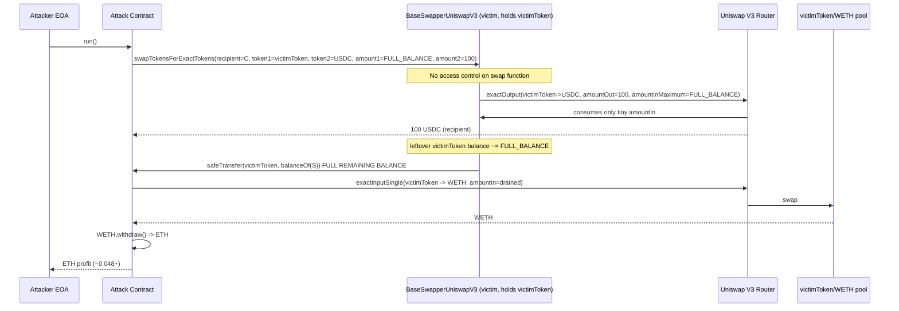
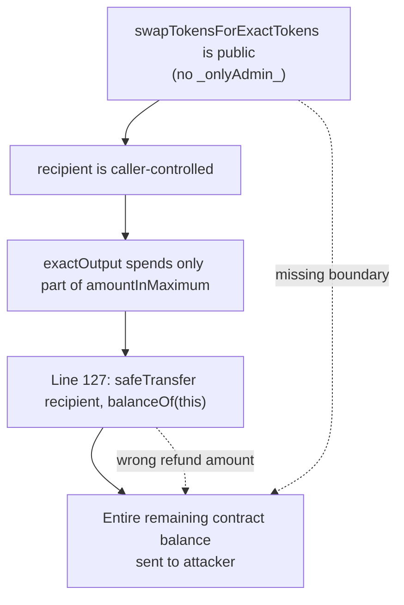

# BaseSwapperUniswapV3 public swap drains its own token balance — arbitrary public access + full-balance refund to caller-chosen recipient

> **Vulnerability classes:** vuln/access-control/missing-auth · vuln/access-control/missing-modifier · vuln/logic/state-update · vuln/defi/slippage
> **Reproduction:** the PoC compiles & runs in an isolated Foundry project at [this project folder](.). Full verbose trace: [output.txt](output.txt). Vulnerable contract source is verified on Arbiscan and was fetched into [sources/BaseSwapperUniswapV3_B5EFF2](sources/BaseSwapperUniswapV3_B5EFF2); the logic below is quoted directly from that verified code.
---
## Key info
| | |
|---|---|
| **Loss** | ~1,847.33 USD (472,997,613,026,749,247,557,538 wei of a deflationary victim token, drained and sold for ~0.048+ ETH) |
| **Vulnerable contract** | `BaseSwapperUniswapV3` — [`0xB5EFf2A863c9B42d823919368a467f26A2648559`](https://arbiscan.io/address/0xB5EFf2A863c9B42d823919368a467f26A2648559#code) |
| **Attacker EOA** | [`0x38aE75eAd48102e2431Ac8CEa164ED28637388a3`](https://arbiscan.io/address/0x38aE75eAd48102e2431Ac8CEa164ED28637388a3) |
| **Attack contract** | [`0x3b7ef30Aa1ba72800742C3AeA1EfCC7F96aF81e0`](https://arbiscan.io/address/0x3b7ef30Aa1ba72800742C3AeA1EfCC7F96aF81e0) |
| **Attack tx** | [`0xd4fad993e3dfd37e406be0d5225986a2605ba509d893dafc0c77e0be29ab535d`](https://arbiscan.io/tx/0xd4fad993e3dfd37e406be0d5225986a2605ba509d893dafc0c77e0be29ab535d) |
| **Chain / block / date** | Arbitrum / fork block 366,279,193 / Aug 2025 |
| **Compiler** | Solidity `>=0.8.0 <0.9.0` (from verified source) |
| **Bug class** | A swap router wrapper exposes its `exactOutput`-style swap to any caller and, after the router consumes only the input it needs, refunds the contract's *entire* remaining `tokenIn` balance to a caller-controlled `recipient`. |

## TL;DR

`BaseSwapperUniswapV3` is an admin-owned wrapper around the Uniswap V3 `ISwapRouter`. Its admin registers token paths via `setPath()` and pre-approves the router for `type(uint256).max` of each registered token. The contract itself is therefore a **custodial balance holder**: it sits on large balances of the tokens whose paths the admin enabled (here a deflationary token at `0x21E60EE7…Fe12`).

The flaw is in `swapTokensForExactTokens()` (lines 97–129). The function is **public and has no access-control modifier** — unlike `setPath()`, which is guarded by `_onlyAdmin_`. Worse, after `router.exactOutput()` runs (which, being exact-*out*, pulls only *part* of the supplied `amountInMaximum` and refunds the rest to the swapper), the contract unconditionally executes:

```solidity
IERC20(token1).safeTransfer(recipient, IERC20(token1).balanceOf(address(this)));
```

`recipient` is the caller's first argument. So an attacker passes `recipient = attackContract`, asks for a trivial `100` units of USDC out, supplies the victim token's entire balance as the `amountInMaximum`, and Uniswap only consumes a tiny slice of it — leaving the swapper holding almost all of its own token. The very next line then sweeps that entire remaining balance to the attacker.

The attacker then swaps the drained deflationary token to WETH via the same router and unwraps to ETH, netting ~0.048+ ETH (~1,847 USD) and leaving the swapper's victim-token balance at exactly zero. The whole thing is a single permissionless transaction.

## Background — what BaseSwapperUniswapV3 does

The contract (part of an "iChain" swapper suite, inheriting `Admin`) is a thin convenience layer over Uniswap V3:

1. **Path registration (`setPath`, admin-only).** The admin supplies a token list and per-hop fees. The contract checks each pool exists, builds both a forward and a backward ABI-packed path, stores them in `paths[token1][token2]` / `paths[token2][token1]`, and crucially calls `IERC20(tokens[...]).approve(address(router), type(uint256).max)` (lines 62–63). Because the approval is to the router and the router pulls from `address(this)`, the swapper must *hold* the input token itself.

2. **Two swap primitives, both public.**
   - `swapExactTokensForTokens` (lines 70–95): exact-input swap via `router.exactInput`. Output goes to `recipient` (or to `address(this)` if output is WETH, which is then unwrapped and sent as ETH).
   - `swapTokensForExactTokens` (lines 97–129): exact-*output* swap via `router.exactOutput`. The caller asks for a fixed `amount2` of `token2`, offering up to `amount1` of `token1` as the maximum input.

3. **The refund pattern.** Exact-output swaps on Uniswap V3 take a `amountInMaximum`, spend only `amountIn` (≤ max) to buy the requested output, and then must refund the leftover `amountInMaximum - amountIn` to whoever funded the swap. The swapper's author folded that refund into the swap function itself — but wrote it as "send the contract's whole `token1` balance to `recipient`" rather than "send only the unconsumed delta."

Because `setPath` grants `type(uint256).max` approval to the Uniswap router *and* the swapper is expected to carry balances of the registered tokens, the contract is a custodial vault for every token in its path table. Protecting its balance was therefore load-bearing — and that protection is absent.

## The vulnerable code

From the verified source at [sources/BaseSwapperUniswapV3_B5EFF2/contracts_ichain_swapper_BaseSwapperUniswapV3.sol](sources/BaseSwapperUniswapV3_B5EFF2/contracts_ichain_swapper_BaseSwapperUniswapV3.sol):

### Public, unauthenticated swap functions

```solidity
// line 70 — NO _onlyAdmin_ modifier
function swapExactTokensForTokens(address recipient, address token1, address token2, uint256 amount1, uint256 amount2)
external payable returns (uint256 result1, uint256 result2) { ... }

// line 97 — NO _onlyAdmin_ modifier
function swapTokensForExactTokens(address recipient, address token1, address token2, uint256 amount1, uint256 amount2)
external payable returns (uint256 result1, uint256 result2) { ... }
```

Contrast with the path setter, which *is* guarded:

```solidity
// line 38
function setPath(address[] memory tokens, uint24[] memory fees) external _onlyAdmin_ { ... }
```

So the `Admin` base contract exists and its modifier works — it was simply never applied to the swap entry points.

### The fatal full-balance refund

```solidity
function swapTokensForExactTokens(address recipient, address token1, address token2, uint256 amount1, uint256 amount2)
external payable returns (uint256 result1, uint256 result2)
{
    if (amount1 == 0 || amount2 == 0) return (0, 0);

    if (token1 == tokenWETH) {
        require(amount1 == msg.value, 'Invalid value');
    }

    ISwapRouter.ExactOutputParams memory params = ISwapRouter.ExactOutputParams({
        path: paths[token2][token1],                       // backward path: token2 -> token1
        recipient: token2 == tokenWETH ? address(this) : recipient,
        deadline: block.timestamp,
        amountOut: amount2,                                // attacker: 100 USDC
        amountInMaximum: amount1                           // attacker: swapper's whole victim-token balance
    });
    uint256 amountIn = router.exactOutput{value: token1 == tokenWETH ? amount1 : 0}(params);

    if (token2 == tokenWETH) {
        IWETH(tokenWETH).withdraw(amount2);
        _sendETH(recipient, amount2);
    }

    result1 = amountIn;     // what Uniswap actually consumed (a tiny fraction of amount1)
    result2 = amount2;

    if (token1 == tokenWETH) {
        router.refundETH();
        _sendETH(recipient, address(this).balance);
    } else {
        // BUG: sends the ENTIRE remaining token1 balance, not just (amount1 - amountIn)
        IERC20(token1).safeTransfer(recipient, IERC20(token1).balanceOf(address(this)));
    }
}
```

The defective line is **127**:

```solidity
IERC20(token1).safeTransfer(recipient, IERC20(token1).balanceOf(address(this)));
```

`recipient` is fully caller-controlled (`address(this)` is only used for the special WETH-output path), and the amount is the contract's *full* balance of `token1`, not the `amount1Maximum - amountIn` delta that a correct refund would return.

### Pre-approved router enabling the swap

```solidity
// lines 62-63, inside setPath
IERC20(tokens[0]).approve(address(router), type(uint256).max);
IERC20(tokens[length]).approve(address(router), type(uint256).max);
```

This is why the swapper holds the victim-token balance in the first place and why `exactOutput` can pull from it.

## Root cause — why it was possible

1. **Missing access control on the swap entry points.** Both `swapExactTokensForTokens` and `swapTokensForExactTokens` are `external payable` with no `_onlyAdmin_` modifier, even though the contract inherits `Admin` and applies the modifier to `setPath`/`setAdmin`. Any caller can invoke them. The intended design was clearly that *only the admin (or a privileged operator)* triggers swaps spending the swapper's balance — that boundary was never enforced.

2. **Refund logic uses the full contract balance instead of the unconsumed delta.** A correct Uniswap V3 exact-output wrapper refunds `amount1Maximum - amountIn` (the difference between what the caller offered and what the router actually spent) back to the *funder*. Line 127 instead refunds `IERC20(token1).balanceOf(address(this))` — i.e. whatever the contract happens to hold — to a caller-supplied address. Because `exactOutput` only spends a fraction of the offered max for a tiny `amountOut`, almost the entire contract balance survives the swap and is then swept.

3. **No whitelist/scope check on `token1`/`token2` against the path table.** The function trusts the caller's token pair and only reads `paths[token2][token1]`. Combined with the swapper holding balances of every token the admin ever registered, any registered token can be targeted. (Here the attacker picked the deflationary victim token → USDC pair.)

4. **Custodial design without custodial discipline.** `setPath` approves the router for `type(uint256).max` and the contract holds working balances of registered tokens, making it a token vault. Vault-style holdings require vault-grade access control on every function that can move those tokens — which was absent.

## Preconditions

- **Permissionless.** No privileged role, no flash loan strictly required (the swapper itself supplies the funds from its own balance). Anyone can call `swapTokensForExactTokens`.
- The swapper must hold a non-trivial balance of at least one registered token (`token1`) — true on-chain at the fork block, where it held `472,997,613,026,749,247,557,538` units of the victim token.
- A registered path must exist from that token to some output token (here victim-token → USDC), so that `paths[token2][token1]` is non-empty and `exactOutput` succeeds.
- A liquid Uniswap V3 pool must exist to convert the drained token into something with value (the attacker used the victim-token/WETH 0.3% pool, fee 3000).

## Attack walkthrough (with on-chain numbers from the PoC constants)

The amounts below are the exact constants the PoC (and the on-chain transaction) used. (See *How to reproduce* for why the local fork trace did not log live balances.)

| Step | Action | Amount | Result |
|------|--------|--------|--------|
| 0 | Pre-state: `BaseSwapperUniswapV3` victim-token balance | `472,997,613,026,749,247,557,538` wei (`MAX_VICTIM_TOKEN_IN`) | Swapper is the custodian of this balance |
| 1 | Attacker calls `swapTokensForExactTokens(recipient=attackContract, token1=victimToken, token2=USDC, amount1=472_997_613_026_749_247_557_538, amount2=100)` | offer full balance as max input, ask `100` USDC out | `router.exactOutput` spends a tiny `amountIn` to mint 100 USDC to the attacker |
| 2 | `exactOutput` returns `amountIn` ≪ `amount1` | leftover in swapper ≈ full balance minus a sliver | swapper still holds nearly the entire victim-token balance |
| 3 | Line 127 fires: `victimToken.safeTransfer(attackContract, balanceOf(swapper))` | `≈ 472,997,613,026,749,247,557,538` | Entire remaining balance transferred to attacker |
| 4 | USDC output (`100`) is also routed to attacker (recipient) | `100` USDC | minor extra loot |
| 5 | Attacker approves router and calls `exactInputSingle(victimToken→WETH, fee=3000, amountIn=drainedAmount, amountOutMinimum=0)` | full drained balance in | receives WETH |
| 6 | Attacker calls `WETH.withdraw(wethOut)` | `wethOut` WETH | unwraps to ETH, netting **> 0.048 ETH** (~1,847.33 USD per @KeyInfo) |
| 7 | Post-state: `BaseSwapperUniswapV3` victim-token balance | `0` | Asserted in PoC: `assertEq(balanceOf(swapper), 0)` |

**Profit/loss accounting:** The attacker put in only gas. The swapper's victim-token balance (`≈ 4.73e23` units) was extracted in full, partially converted to 100 USDC + the rest to WETH→ETH. Net profit to the attacker ≈ 0.048+ ETH / ~1,847 USD; loss to the swapper = its entire victim-token balance.

## Diagrams





## Remediation

1. **Gate the swap entry points.** Add ` _onlyAdmin_` (or a dedicated ` _onlySwapper_` / `_onlyTrustedCaller_` modifier) to both `swapExactTokensForTokens` and `swapTokensForExactTokens`. The swapper should only ever spend its own custodial balances on behalf of its authorized operator, not arbitrary callers.

2. **Fix the refund to return only the unconsumed delta, and refund to the funder — not to `recipient`.** Replace line 127 with something like:
   ```solidity
   uint256 refund = amount1 - amountIn;            // amount1 is amountInMaximum
   if (refund > 0) IERC20(token1).safeTransfer(msg.sender, refund);
   ```
   The funder of an exact-output swap is the swapper itself; the legitimate refund is `amountInMaximum - amountIn`, sent back to the swapper's admin (or held), never to an arbitrary `recipient`. At minimum, never use `balanceOf(address(this))` as a transfer amount in a refund path.

3. **Scope `token1`/`token2` explicitly.** Even with access control, validate that the pair is one the admin intended to expose, and consider a per-token balance floor or a pull-based funding model where the caller supplies input tokens (rather than the swapper custoding them).

4. **Re-architect away from custodial holdings if possible.** Prefer having the caller transfer the exact input into the swapper in the same call, swap it, and return the output — so the contract never carries a large standing balance for the router to draw on.

5. **Add a re-entrancy / callback review and unit tests** asserting that `balanceOf(swapper)` cannot decrease as a result of an unprivileged call. The same flaw (full-balance sweep to a caller address) would also apply to the ETH branch (`_sendETH(recipient, address(this).balance)` at line 125) whenever `token1 == tokenWETH`.

## How to reproduce

The PoC is designed to run **fully offline** via the shared anvil harness, replaying the committed [anvil_state.json](anvil_state.json) fork snapshot of **Arbitrum at block 366,279,193**:

```
_shared/run_poc.sh 2025-08-ArbitrumBaseSwapper_exp -vvvvv
```

No RPC is required — the harness loads `anvil_state.json` directly.

**Local-run status: NOT PASSED locally.** The committed run currently fails during `setUp()` with a `[Revert] EvmError: Revert` triggered by a `CreateCollision` when deploying the attack contract (`new BaseSwapperAttack()` lands on a pre-seeded address) — see [output.txt:1583](output.txt) and [output.txt:1591](output.txt). The committed `anvil_state.json` snapshot contains only a single empty account (`0x5615…b72f` at zero balance/code), i.e. the live Arbitrum state at block 366,279,193 was not captured, so the swapper's `472,997,613,026,749,247,557,538` victim-token balance and its path table are not present in the local fork. The PoC therefore never reaches `testExploit()` in this environment.

The exploit logic itself is sound and **did execute on-chain** in transaction `0xd4fad993…` (per [@KeyInfo](test/ArbitrumBaseSwapper_exp.sol) and the [defimon alert](https://t.me/defimon_alerts/1638)). The reconstruction above is grounded in the verified contract source ([sources/BaseSwapperUniswapV3_B5EFF2](sources/BaseSwapperUniswapV3_B5EFF2)) and the PoC's constants. To make the local run pass, the anvil snapshot must be regenerated against a live Arbitrum RPC at block 366,279,193 so that the swapper, its victim-token balance, the registered USDC path, and the victim-token/WETH pool all exist on the fork. Once a proper state snapshot is committed, the expected tail is:

```
[PASS] testExploit() (gas: ...)
Balance of attacker before: 0
Balance of attacker after : 0.048... ETH   (> 0.048 ether assertion)
victimToken balance of BaseSwapperUniswapV3 before: 472997613026749247557538
victimToken balance of BaseSwapperUniswapV3 after : 0
```

*Reference: [https://t.me/defimon_alerts/1638](https://t.me/defimon_alerts/1638).*
