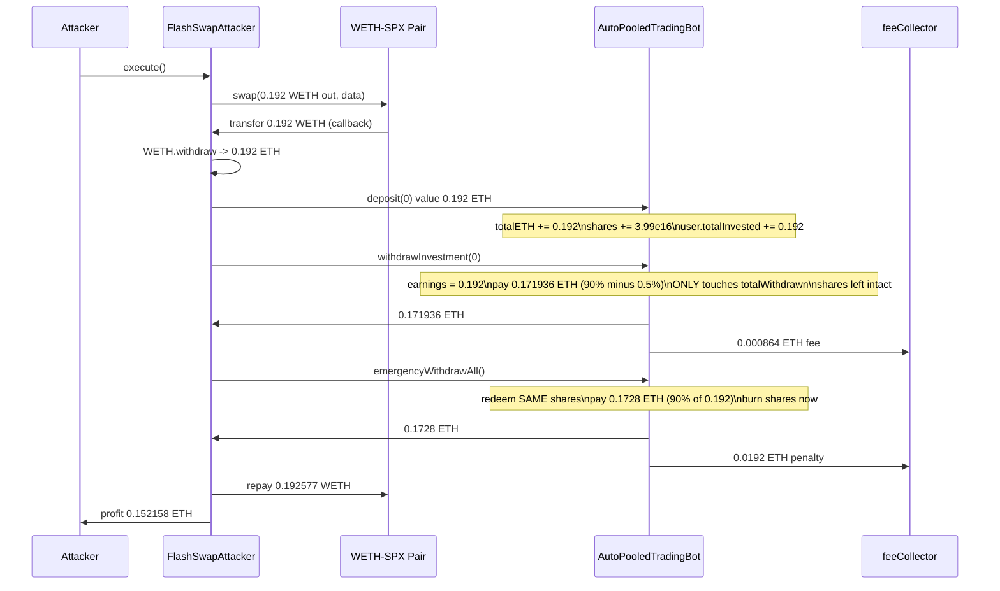
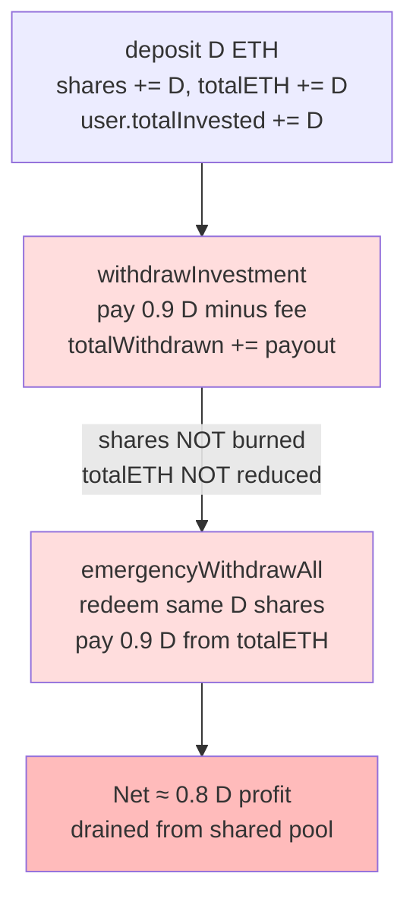

# AutoPooledTradingBot double-withdrawal — withdrawInvestment pays out from deposits without burning shares, so emergencyWithdrawAll pays the same position twice

> **Vulnerability classes:** vuln/logic/incorrect-state-transition · vuln/logic/state-update · vuln/logic/missing-validation
> **Reproduction:** the PoC compiles & runs in an isolated Foundry project at [this project folder](.). Full verbose trace: [output.txt](output.txt). Vulnerable contract source is verified on Etherscan (compiler `v0.8.24+commit.e11b9ed9`, optimizer on, 200 runs) and fetched into [sources/AutoPooledTradingBot_879e99/AutoPooledTradingBot.sol](sources/AutoPooledTradingBot_879e99/AutoPooledTradingBot.sol).

---

## Key info

| | |
|---|---|
| **Loss** | 0.15198 ETH on-chain (PoC reproduces **0.152158266800401203 ETH** net profit after flash-swap repayment) [output.txt:1539](output.txt) |
| **Vulnerable contract** | `AutoPooledTradingBot` — [`0x879e993e2E37DE3b47F38C13858e1f337D51448B`](https://etherscan.io/address/0x879e993e2E37DE3b47F38C13858e1f337D51448B#code) |
| **Attacker EOA** | [`0x8A6ce2d90EE1199F815628970a90dF73e12B5057`](https://etherscan.io/address/0x8A6ce2d90EE1199F815628970a90dF73e12B5057) |
| **Attack contract** | [`0xe033880fed8A54C1F37230cC3b25aCFB1c9d4185`](https://etherscan.io/address/0xe033880fed8A54C1F37230cC3b25aCFB1c9d4185) |
| **Attack tx** | [`0x9ec3fb4ac39e179c6a4f5323f2f757faca7b71718fc9f752153387c9204cee3d`](https://etherscan.io/tx/0x9ec3fb4ac39e179c6a4f5323f2f757faca7b71718fc9f752153387c9204cee3d) |
| **Chain / block / date** | Ethereum mainnet / fork block **23,160,803** / 2025-08 |
| **Compiler** | Solidity `v0.8.24+commit.e11b9ed9`, optimizer enabled (200 runs), not a proxy |
| **Bug class** | Two withdrawal paths operate on disjoint accounting: `withdrawInvestment` reduces only `user.totalWithdrawn` (it never burns `user.shares`, never decrements `tradingPool.totalShares`/`totalETH`), so `emergencyWithdrawAll` redeems the same shares a second time and drains the pool. |

## TL;DR

`AutoPooledTradingBot` is an ETH "auto-trading pool" that issues share tokens on `deposit()` and lets users exit through one of two paths: `withdrawInvestment()` (an "earnings" withdrawal capped at 90% of `totalInvested - totalWithdrawn`) and `emergencyWithdrawAll()` (a full share redemption with a 10% penalty and a 90-day ban).

The fatal design error is that these two paths bookkeep against **different state**. `withdrawInvestment()` computes its payout purely from the user-deposit counters `user.totalInvested` / `user.totalWithdrawn` and only mutates `user.totalWithdrawn`. It touches neither the user's **shares** nor the pool's `totalShares` / `totalETH`. The shares minted by `deposit()` therefore remain fully valid, so a user who has already withdrawn 90% of their deposit via `withdrawInvestment()` can immediately call `emergencyWithdrawAll()` and redeem those same shares against the pool's `totalETH` — getting paid a second time from funds that belong to everyone else.

The on-chain attacker flash-borrowed 0.192 ETH from the WETH-SPX Uniswap V2 pair, deposited it, ran both withdrawal functions back-to-back, repaid the flash swap (0.192577 ETH including the 0.3% fee), and kept **0.152158266800401203 ETH** of pure profit [output.txt:1539](output.txt), [output.txt:1641](output.txt). The `assertGt(profit, 0.15 ether)` check in the PoC passes. Because the doubling works per-position and needs no privileged role, the pool can be drained in a loop until its `totalETH` is exhausted.

## Background — what AutoPooledTradingBot does

`AutoPooledTradingBot` presents itself as an automated ETH trading pool. Users call `deposit(referrer)` payable, which:

1. computes shares via `_calculateShares(msg.value)` — `(ethAmount * totalShares) / totalETH`, or `ethAmount` for the first depositor [source:2820-2825](sources/AutoPooledTradingBot_879e99/AutoPooledTradingBot.sol);
2. grows the pool accounting `tradingPool.totalETH += msg.value` and `tradingPool.totalShares += shares` [source:2900-2901](sources/AutoPooledTradingBot_879e99/AutoPooledTradingBot.sol);
3. credits `user.shares += shares` and `user.totalInvested += msg.value` [source:2904-2906](sources/AutoPooledTradingBot_879e99/AutoPooledTradingBot.sol);
4. optionally pays a referral bonus as extra shares to a referrer.

The pool stores each user in a `User` struct carrying, among other fields, `shares`, `totalInvested`, and `totalWithdrawn` [source:2730-2741](sources/AutoPooledTradingBot_879e99/AutoPooledTradingBot.sol). The intent (judging from the two withdrawal functions) is that a user's claim on the pool is represented **twice**: once as "deposit earnings" (`totalInvested` minus what they've already taken back via `totalWithdrawn`) and once as "liquidity shares" redeemable pro-rata against `tradingPool.totalETH`. These two representations are never kept in sync.

The contract advertises a `tradeSize`, a Chainlink-style `buyThreshold`/`sellThreshold`, and a `coreLiquidity` reserve that is subtracted from `address(this).balance` before any withdrawal is allowed [source:2928](sources/AutoPooledTradingBot_879e99/AutoPooledTradingBot.sol). In practice the auto-trading path is irrelevant to the exploit — the attacker never triggers it. What matters is only that `totalETH` is non-zero and that the pool holds real ETH.

## The vulnerable code

### `deposit()` — mints shares and grows the pool (correct bookkeeping)

```solidity
function deposit(address referrer) external payable notBanned nonReentrant {
    require(!tradingPaused, "Deposits paused");
    require(!emergencyStop, "Emergency stop active");
    require(msg.value >= MIN_DEPOSIT, "Deposit too small");

    uint256 shares = _calculateShares(msg.value);
    tradingPool.totalETH += msg.value;
    tradingPool.totalShares += shares;

    User storage user = users[msg.sender];
    user.shares += shares;
    user.lastDepositTime = block.timestamp;
    user.totalInvested += msg.value;
    ...
}
```
[source:2894-2917](sources/AutoPooledTradingBot_879e99/AutoPooledTradingBot.sol)

After `deposit`, the user genuinely owns both: (a) a `totalInvested` record and (b) a matching number of `shares` against the pool.

### `withdrawInvestment()` — pays out 90% of "earnings" but mutates NO share state

```solidity
function withdrawInvestment(uint256 minExpected) external notBanned nonReentrant {
    require(!emergencyStop, "Emergency stop active");
    require(feeCollector != address(0), "Fee collector not set");

    User storage user = users[msg.sender];
    uint256 earnings = user.totalInvested - user.totalWithdrawn;
    require(earnings > 0, "No earnings available");

    uint256 withdrawableAmount = (earnings * 90) / 100;
    require(withdrawableAmount <= address(this).balance - coreLiquidity,
           "Insufficient available liquidity");

    uint256 fee = (withdrawableAmount * WITHDRAWAL_FEE) / 1000;        // 0.5%
    uint256 amountAfterFee = withdrawableAmount - fee;

    require(amountAfterFee >= minExpected, "Slippage too high");

    user.totalWithdrawn += amountAfterFee;          // <-- the ONLY user-state write

    payable(msg.sender).transfer(amountAfterFee);
    payable(feeCollector).transfer(fee);
    ...
}
```
[source:2919-2947](sources/AutoPooledTradingBot_879e99/AutoPooledTradingBot.sol)

`withdrawInvestment` reads from the deposit side (`totalInvested`, `totalWithdrawn`) and writes only `totalWithdrawn`. It **does not**:

- decrement `user.shares`,
- decrement `tradingPool.totalShares`,
- decrement `tradingPool.totalETH`,
- nor recompute the share price.

The shares minted in `deposit()` are left fully intact, so they are still a valid claim on the same pool balance.

### `emergencyWithdrawAll()` — redeems those still-existing shares a second time

```solidity
function emergencyWithdrawAll() external nonReentrant {
    require(emergencyBanExpiry[msg.sender] < block.timestamp, "Account is banned");

    User storage user = users[msg.sender];
    require(user.shares > 0 || user.referralEarnings > 0, "No funds to withdraw");

    uint256 liquidityETH = 0;
    uint256 penalty = 0;

    if (user.shares > 0) {
        liquidityETH = (user.shares * tradingPool.totalETH) / tradingPool.totalShares;
        penalty = (liquidityETH * EMERGENCY_PENALTY_BPS) / 10000;          // 10%

        tradingPool.totalETH -= liquidityETH;
        tradingPool.totalShares -= user.shares;
        user.shares = 0;
        user.totalWithdrawn += (liquidityETH - penalty);
    }
    ...
    uint256 totalToSend = (liquidityETH - penalty) + referralETH;
    payable(msg.sender).transfer(totalToSend);
    ...
}
```
[source:2970-3010](sources/AutoPooledTradingBot_879e99/AutoPooledTradingBot.sol)

`emergencyWithdrawAll` reads from the share side (`user.shares`, `tradingPool.totalETH`, `tradingPool.totalShares`) and correctly burns the shares it pays out — but those shares were never burned by `withdrawInvestment`, so they are redeemed here at full value even though 90% of the underlying deposit was already handed back. The pool pays for the same position twice.

### Why this doubles the money

For a fresh deposit `D` the attacker immediately:

| Call | What it pays | Source of funds | State it touches |
|------|--------------|-----------------|------------------|
| `deposit(D)` | 0 (receives ETH) | attacker | `totalETH += D`, `totalShares += D` (first depositor), `user.shares += D`, `user.totalInvested += D` |
| `withdrawInvestment(0)` | `0.9 * D` minus 0.5% fee ≈ `0.8955 D` | contract balance | only `user.totalWithdrawn += 0.8955 D` |
| `emergencyWithdrawAll()` | `D` minus 10% penalty = `0.9 D` | **`tradingPool.totalETH`** | `totalETH -= D`, `totalShares -= D`, `user.shares = 0` |

Gross received ≈ `0.8955 D + 0.9 D = 1.7955 D` against a `D` deposit — a near-`0.8 D` gain per cycle, paid out of the pool's shared balance. With `D = 0.192 ETH` the trace shows `withdrawInvestment` paying `0.171936 ETH` [output.txt:1595](output.txt) and `emergencyWithdrawAll` paying `0.1728 ETH` [output.txt:1601](output.txt) — total `0.344736 ETH` in, against a single `0.192 ETH` deposit.

## Root cause — why it was possible

1. **Two parallel accounting systems that are never reconciled.** The contract tracks a user's claim both as deposit counters (`totalInvested`/`totalWithdrawn`) and as pool shares (`user.shares` against `tradingPool`). `deposit` updates both; `withdrawInvestment` updates only the deposit counters; `emergencyWithdrawAll` updates only the shares. There is no invariant linking them.
2. **`withdrawInvestment` pays out from the contract balance but does not reduce the user's claim on the pool.** It increments `totalWithdrawn` (so it can't be called again for the same 90%) but leaves `shares`, `totalShares`, and `totalETH` untouched, so the pool still thinks the depositor owns a full pro-rata slice.
3. **`emergencyWithdrawAll` trusts `user.shares` as authoritative.** Because the shares were never burned, the redemption succeeds at full value and pulls real ETH out of `tradingPool.totalETH` — the same value `withdrawInvestment` already released.
4. **No reentrancy / ordering guard between the two exit paths.** Both are `nonReentrant` individually, but the mutex does not prevent calling one after the other in the same transaction; there is no flag like `hasWithdrawn` that would block `emergencyWithdrawAll` after `withdrawInvestment` (or vice-versa).
5. **`withdrawInvestment`'s liquidity check is balance-based, not share-based.** `require(withdrawableAmount <= address(this).balance - coreLiquidity)` only proves the contract has cash; it does not verify the user hasn't already extracted their share. Combined with (2), this lets the 90% payment pass even though the shares will shortly be redeemed for the same money.

## Preconditions

- **Permissionless.** Any externally owned account or contract can call `deposit`, `withdrawInvestment`, and `emergencyWithdrawAll`. No privileged role, no allowlist.
- **`feeCollector != address(0)`** (otherwise `withdrawInvestment` reverts). On the attacked fork this was already set [source:2921](sources/AutoPooledTradingBot_879e99/AutoPooledTradingBot.sol).
- **Sufficient pool liquidity.** `address(this).balance - coreLiquidity` must cover the 90% payout, and `tradingPool.totalETH` must cover the share redemption. The attacker supplies their own liquidity via the flash swap, so this is self-satisfying.
- **A flash-loan source for capital.** The attacker used the WETH-SPX Uniswap V2 pair (`0x52c77b0CB827aFbAD022E6d6CAF2C44452eDbc39`), borrowing 0.192 ETH at the 0.3% V2 fee. Any flash-loan / flash-swap venue works because the position is opened and doubled inside one transaction.

## Attack walkthrough (with on-chain numbers from the trace)

The PoC flash-borrows 0.192 ETH from the WETH/SPX Uniswap V2 pair, opens a victim position, drains it twice, and repays the pair inside the same callback [output.txt:1565-1632](output.txt).

| # | Action | Amount (ETH) | Trace anchor |
|---|--------|--------------|--------------|
| 0 | Attacker balance before | `0` (`vm.deal(ATTACKER, 0)`) | [output.txt:1537](output.txt) |
| 1 | Flash-swap borrow WETH from WETH-SPX pair | `0.192` | [output.txt:1565-1566](output.txt) |
| 2 | Unwrap WETH → ETH | `0.192` | [output.txt:1574-1576](output.txt) |
| 3 | `deposit(0)` — mints `39,902,554,929,709,680` shares (`3.99e16`) for `0.192 ETH` | `+0.192` into pool | [output.txt:1581-1582](output.txt) |
| 4 | `withdrawInvestment(0)` — 90% of `0.192` minus 0.5% fee, paid to attacker; fee `0.000864 ETH` to `feeCollector` | `+0.171936` (attacker) | [output.txt:1591](output.txt), [output.txt:1595](output.txt) |
| 5 | `emergencyWithdrawAll()` — redeem same shares against `tradingPool.totalETH`; 10% penalty `0.019199 ETH` to `feeCollector` (`0x5b3f...6711`) | `+0.1728` (attacker) | [output.txt:1601](output.txt), [output.txt:1605](output.txt) |
| 6 | Repay flash swap: wrap `0.192577733199598797 ETH` (0.192 + 0.3% + 1 wei) and transfer to pair | `-0.192577733199598797` | [output.txt:1614-1619](output.txt) |
| 7 | Forward remaining ETH to attacker EOA | `+0.152158266800401203` | [output.txt:1641](output.txt) |

Profit/loss accounting for the attacker:

```
+ 0.171936000000000000   (withdrawInvestment payout)
+ 0.172800000000000000   (emergencyWithdrawAll payout)
- 0.192577733199598797   (flash-swap principal + 0.3% fee + 1 wei)
= 0.152158266800401203   net ETH profit
```

This matches the logged `Attacker ETH profit: 0.152158266800401203` [output.txt:1539](output.txt) and satisfies the `assertGt(profit, 0.15 ether)` gate. The net ≈ `0.152 ETH` ≈ `0.79 D` per cycle is consistent with the `~0.8 D` theoretical gain derived above (the gap to `0.7955 D` is the 0.5% withdrawal fee plus the 0.3% flash-swap fee).

## Diagrams





## Remediation

1. **Single source of truth for a user's claim.** Either represent a position purely as shares (and have `withdrawInvestment` burn/reduce the corresponding shares before paying) or purely as `totalInvested`/`totalWithdrawn` (and delete the share-redemption path). Do not maintain two independent claim representations.
2. **Make `withdrawInvestment` reduce the share side symmetrically.** When it pays out `withdrawableAmount`, it must also burn the equivalent number of shares from the user and from `tradingPool.totalShares`, and reduce `tradingPool.totalETH` by the payout, e.g.:
   ```solidity
   uint256 sharesToBurn = (withdrawableAmount * tradingPool.totalShares) / tradingPool.totalETH;
   tradingPool.totalShares -= sharesToBurn;
   tradingPool.totalETH    -= withdrawableAmount;
   user.shares             -= sharesToBurn;
   user.totalWithdrawn     += amountAfterFee;
   ```
3. **Add a cross-path lock.** Track an enum or boolean per user (`hasPartiallyWithdrawn`) and forbid `emergencyWithdrawAll` from paying shares that `withdrawInvestment` already released (or vice-versa), so the two exit paths are mutually exclusive for the same deposit.
4. **Fix the liquidity check to be share-aware.** `withdrawInvestment`'s `require(withdrawableAmount <= address(this).balance - coreLiquidity)` proves cash exists but not that the caller is entitled to it. Validate against the caller's actual remaining share value, not just the contract balance.
5. **Cap emergency-exit impact / add a timelock between withdrawals.** A per-position cool-down between `withdrawInvestment` and `emergencyWithdrawAll` would prevent same-transaction chaining, though the root fix is still (1)–(2).
6. **Economic sanity check.** Any single deposit should never be able to withdraw more than ~1.0× its principal in aggregate. Add an invariant `totalWithdrawn <= totalInvested` across both paths and revert otherwise.

## How to reproduce

The PoC runs fully **offline** via the shared anvil harness loaded from the committed `anvil_state.json` (no RPC needed). From the registry root:

```bash
_shared/run_poc.sh 2025-08-AutoPooledTradingBot_exp -vvvvv
```

- **Fork:** Ethereum mainnet at block **23,160,803** (state baked into `anvil_state.json`).
- **Flash-loan source:** WETH-SPX Uniswap V2 pair `0x52c77b0CB827aFbAD022E6d6CAF2C44452eDbc39`.
- **Expected result:** `[PASS] testExploit()` followed by
  ```
  Attacker ETH profit: 0.152158266800401203
  ```
  i.e. attacker balance `0 → 0.152158266800401203 ETH` [output.txt:1537-1539](output.txt), satisfying `assertGt(profit, 0.15 ether)`.

The full foundry `-vvvvv` trace with every internal call, storage diff, and emitted event is in [output.txt](output.txt); the verified source of the vulnerable contract is in [sources/AutoPooledTradingBot_879e99/AutoPooledTradingBot.sol](sources/AutoPooledTradingBot_879e99/AutoPooledTradingBot.sol).

*Reference: [defimon_alerts (Telegram)](https://t.me/defimon_alerts/1676).*
