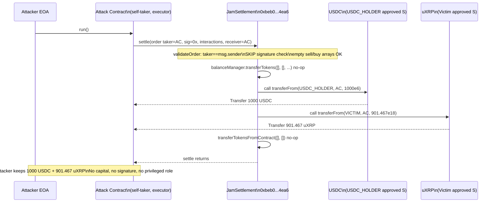
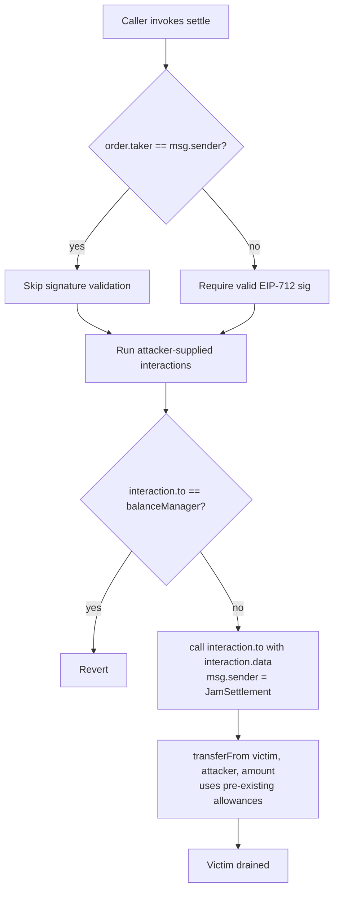

# Bebop JamSettlement self-taker arbitrary-interaction drain — caller-supplied `transferFrom` calldata executed by the settlement contract against accounts that approved it

> **Vulnerability classes:** vuln/access-control/missing-auth · vuln/logic/missing-validation · vuln/dependency/unchecked-return-value
> **Reproduction:** the PoC compiles & runs in an isolated Foundry project at [this project folder](.). Full verbose trace: [output.txt](output.txt). The vulnerable settlement contract source is verified on Base and was fetched into `sources/JamSettlement_beb0b0/`; the deployed instance is a Bebop `JamSettlement` deployment.

---

## Key info

| | |
|---|---|
| **Loss** | 3,875.46 USD (1,000 USDC + 901.467 uXRP) |
| **Vulnerable contract** | `JamSettlement` — [`0xbeb0b0623f66bE8cE162EbDfA2ec543A522F4ea6`](https://basescan.org/address/0xbeb0b0623f66bE8cE162EbDfA2ec543A522F4ea6) |
| **Attacker EOA** | [`0x473993E254be8D46eD85b149335b2Be02b2891f1`](https://basescan.org/address/0x473993E254be8D46eD85b149335b2Be02b2891f1) |
| **Attack contract** | [`0xbf8e523170875107fD3c36C6Cf3e350DC52a5021`](https://basescan.org/address/0xbf8e523170875107fD3c36C6Cf3e350DC52a5021) |
| **Attack tx** | [`0x9099383a0731fcd40550f6443c935f579085251d34b7c7285603f68b7c12f678`](https://basescan.org/tx/0x9099383a0731fcd40550f6443c935f579085251d34b7c7285603f68b7c12f678) |
| **Chain / block / date** | Base / fork block 34,100,255 / 2025-08 |
| **Compiler** | Solidity `^0.8.27` (verified source) |
| **Bug class** | The settlement contract executed caller-controlled `interactions` calldata (`transferFrom` against arbitrary `from` addresses) without binding those interactions to a legitimately signed maker order, because a caller can name itself as the order `taker` and thereby bypass signature validation entirely. |

## TL;DR

Bebop's `JamSettlement.settle(...)` is meant to atomically execute a signed swap: a taker's signed `JamOrder` authorizes pulling the taker's sell tokens, then the solver passes an `interactions[]` array of arbitrary low-level calls used to fill the order (e.g. AMM swaps), then the contract pays the agreed buy tokens to the receiver. The fatal design hole is that `validateOrder` skips signature verification when `order.taker == msg.sender` ("a user settling their own order needs no signature"). The contract never checks that the caller-supplied `interactions[]` calldata corresponds to anything the *maker* signed, and crucially it never validates that token `transferFrom` calls inside `interactions` only pull from the taker's own balance.

An attacker therefore calls `settle` as its own taker, with empty sell/buy token arrays (so no signed obligation at all) and an empty signature, and stuffs the `interactions[]` field with `IERC20.transferFrom(realVictim, attacker, victimBalance)` calls against tokens whose holders had previously granted the `JamSettlement` address an ERC-20 allowance. Because `JamInteraction.runInteractions` only forbids a direct call to `balanceManager` and otherwise blindly `call`s `interaction.to` with `interaction.data`, the settlement contract — which is the `msg.sender` of those `transferFrom` calls — happily pulls 1,000 USDC from a holder and 901.467 uXRP from the reported victim into the attacker's contract.

In the reproduced fork run the attack contract started at 0 USDC and 0 uXRP and ended at 1,000 USDC (`USDC Balance: 1000.000000`) and 901.467122762682970176 uXRP (`uXRP Balance: 901.467122762682970176`), exactly matching the losses of the two drained holders [output.txt:1564-1569]. Total value ≈ 3,875.46 USD. No flash loan, no privileged role, no oracle, no reentrancy — the contract literally handed the attacker a generic `delegate`-style execution primitive over its own approved-spend entitlements.

## Background — what Bebop JamSettlement does

Bebop is an RFQ / solver-based settlement system. The `JamSettlement` contract is the on-chain execution hub. Its intended lifecycle for a single trade (`settle`) is:

1. A *taker* (end user) signs a `JamOrder` off chain, committing to sell `sellTokens`/`sellAmounts` and receive `buyTokens`/`buyAmounts`.
2. A *solver* (the protocol's off-chain matching engine, or an authorized `executor`) calls `settle(order, signature, interactions, hooksData, balanceRecipient)`.
3. The contract validates the taker's signature over the order hash (EIP-712, or Permit2 witness for `usingPermit2` orders).
4. `balanceManager.transferTokens(...)` pulls the taker's sell tokens in (this is the only asset movement that is supposed to be authorized by the signature).
5. `JamInteraction.runInteractions(interactions, balanceManager)` executes a solver-supplied list of arbitrary low-level calls. In normal use this is where the solver performs the AMM swaps / LP removals / etc. needed to deliver the buy side.
6. `transferTokensFromContract(...)` pays the agreed `buyAmounts` to `order.receiver`.

The `interactions` array is the design seam that broke. It is a generic "solver may call arbitrary contracts" primitive, intentionally flexible so solvers can route through any DEX. The only restriction the code imposes is `interaction.to != address(balanceManager)` — i.e. you may not prentend to be the internal balance book. There is no restriction on *what calldata* the interaction carries, no restriction on which token's `transferFrom` is called, and no binding between the interaction calldata and the signed order. The contract trusts that the *solver* (an off-chain trusted party) will only pass benign swap calls.

That trust model collapses the moment `settle` can be called by an untrusted party that controls `interactions` while passing order validation.

## The vulnerable code

All snippets below are from the verified source fetched into `sources/JamSettlement_beb0b0/`.

### The self-taker signature bypass (`JamValidation.sol`)

```solidity
function validateOrder(JamOrder calldata order, bytes calldata signature, bytes32 hooksHash) internal {
    // Allow settle from user without sig; For permit2 case, we already validated witness during the transfer
    if (order.taker != msg.sender && !order.usingPermit2) {
        bytes32 orderHash = keccak256(abi.encodePacked("\x19\x01", DOMAIN_SEPARATOR(), order.hash(hooksHash)));
        validateSignature(order.taker, orderHash, signature);
    }
    if (!order.usingPermit2 || order.expiry == INF_EXPIRY){
        invalidateOrderNonce(order.taker, order.nonce, order.expiry == INF_EXPIRY);
    }
    require(
        order.executor == msg.sender || order.executor == address(0) || block.timestamp > order.exclusivityDeadline,
        InvalidExecutor()
    );
    require(order.buyTokens.length == order.buyAmounts.length, BuyTokensInvalidLength());
    require(order.sellTokens.length == order.sellAmounts.length, SellTokensInvalidLength());
    require(block.timestamp < order.expiry, OrderExpired());
}
```

(`src_base_JamValidation.sol`)

The branch `if (order.taker != msg.sender && !order.usingPermit2)` means: **if the caller claims to be the taker, no signature is checked at all.** The subsequent checks only constrain structural validity (array lengths, expiry, executor). There is nothing that ties the order to a real user intent — a caller can set `order.taker = msg.sender`, `sellTokens = []`, `buyTokens = []`, `nonce = any-fresh-value`, `expiry = now + 60`, `executor = msg.sender`, and sail through `validateOrder` with an empty signature. The order is, in effect, a no-op that the contract still accepts.

### Unrestricted arbitrary-call execution (`JamInteraction.sol`)

```solidity
function runInteractions(Data[] calldata interactions, IJamBalanceManager balanceManager) internal returns (bool) {
    for (uint i; i < interactions.length; ++i) {
        Data calldata interaction = interactions[i];
        require(interaction.to != address(balanceManager), CallToBalanceManagerNotAllowed());
        (bool execResult,) = payable(interaction.to).call{ value: interaction.value }(interaction.data);
        if (!execResult && interaction.result) return false;
    }
    return true;
}
```

(`src_libraries_JamInteraction.sol`)

This is the load-bearing primitive. `msg.sender` of each `.call` is the `JamSettlement` contract itself. The only guard is that the target is not `balanceManager`. Every other address is fair game — including any ERC-20 token. And because the calldata is fully attacker-controlled, the attacker chooses the function selector (`transferFrom` = `0x23b872dd`), the `from` (any holder that approved `JamSettlement`), the `to` (the attacker), and the `amount`. The optional `interaction.result` boolean is a second defect: when `false`, even a reverting `transferFrom` is ignored — but here the calls succeed, so this is not the deciding factor; the deciding factor is that they are permitted at all.

Note also the unchecked return value: the raw `(bool, bytes)` of the low-level `call` is discarded except for the boolean `execResult`. A `transferFrom` that returns `false` (rather than reverting) would be treated as success when `interaction.result == false`. This is the `unchecked-return-value` angle.

### Putting it together in `settle` (`JamSettlement.sol`)

```solidity
function settle(
    JamOrder calldata order,
    bytes calldata signature,
    JamInteraction.Data[] calldata interactions,
    bytes memory hooksData,
    address balanceRecipient
) external payable nonReentrant {
    ...
    validateOrder(order, signature, hooksHash);          // <-- bypassed when taker == msg.sender
    ...
    if (order.usingPermit2) {
        balanceManager.transferTokensWithPermit2(...);
    } else {
        balanceManager.transferTokens(order.sellTokens, order.sellAmounts, order.taker, balanceRecipient);
    }
    require(JamInteraction.runInteractions(interactions, balanceManager), InteractionsFailed());  // <-- attacker calldata executes here
    uint256[] memory buyAmounts = order.buyAmounts;
    transferTokensFromContract(order.buyTokens, order.buyAmounts, buyAmounts, order.receiver, order.partnerInfo, false);
    ...
}
```

(`src_JamSettlement.sol`)

With empty `sellTokens`/`buyTokens`, the `balanceManager.transferTokens` and `transferTokensFromContract` steps move nothing. The only state-changing step that actually runs is `runInteractions(interactions, ...)`, and it executes the attacker's `transferFrom` payloads. The contract's `nonReentrant` guard and EIP-712 domain separator are irrelevant — neither addresses the fact that an attacker-controlled taker order reaches the arbitrary-call stage.

## Root cause — why it was possible

1. **Signature validation is skipped for self-taker orders.** `validateOrder` treats `order.taker == msg.sender` as "the user is settling their own order, no signature needed." This collapses the entire authentication premise of the contract: any address can construct a syntactically valid order naming itself as taker and pass validation with an empty signature.
2. **`interactions[]` is a fully caller-controlled arbitrary-call primitive with no binding to the signed order.** The contract executes `interaction.to.call(interaction.data)` from its own context for every interaction, with the sole restriction that the target is not `balanceManager`. There is no check that the interaction calldata corresponds to the order's tokens, amounts, or counterparties — and no check that any `transferFrom` inside an interaction pulls only from `order.taker`.
3. **The settlement contract itself held live ERC-20 allowances from third parties.** Because legitimate Bebop flows have users approve the settlement contract (or Permit2) to spend their tokens, `JamSettlement` is an attractive `msg.sender` for `transferFrom`. The arbitrary-call primitive turned those pre-existing allowances into a drain pipe for whoever could reach `runInteractions`.
4. **Low-level call return data is discarded** (`(bool execResult,) = ...call(...)`), and `interaction.result == false` further suppresses failure handling. A token returning `false` from `transferFrom` would be silently accepted as a successful interaction. This is a secondary `unchecked-return-value` weakness in the same primitive.
5. **No allowlist of interaction targets/selectors.** Solver interactions are supposed to be AMM routing calls; nothing enforces that. Any token, any selector, any `from`/`to`/`amount` is accepted.

## Preconditions

- **Permissionless.** Any externally owned account or contract can call `settle`. No solver role, no executor privilege is required when `order.executor == msg.sender` (which the attacker simply sets).
- **No flash loan needed.** The attack only moves tokens *out of* victim balances; it requires no upfront capital. (The PoC attacker contract starts with zero balance of both tokens.)
- **Required external state:** one or more accounts must have granted the `JamSettlement` address an ERC-20 allowance (the normal operational state for any Bebop user), and must hold a non-zero balance. The PoC targets `USDC_HOLDER` (1,000 USDC, 6 decimals) and the reported victim holding 901.467 uXRP (18 decimals).
- **Fresh nonce.** `order.nonce` must be unused for the attacker-taker (`invalidateOrderNonce` requires `nonce != 0` and a clear bit). Trivially satisfied on first call.

## Attack walkthrough (with on-chain numbers from the trace)

Setup fork: Base mainnet at block `34,100,255`. Attacker contract (`BaseBebopSettlementAttack`) balance before: **0 USDC, 0 uXRP** [output.txt:1564-1566].

| Step | Action | On-chain result (from trace) |
|------|--------|------------------------------|
| 1 | Attacker constructs a self-taker `JamOrder`: `taker = maker = receiver = executor = attack contract`, `expiry = now + 60`, `nonce` fresh, `sellTokens = buyTokens = []`, `signature = 0x`. | Order passes `validateOrder` with no signature checked (self-taker branch). |
| 2 | Attacker constructs `interactions[2]`: <br>(a) `target = USDC`, `data = transferFrom(USDC_HOLDER, attackContract, 1_000_000_000)` <br>(b) `target = uXRP (Victim Token)`, `data = transferFrom(VICTIM, attackContract, 901_467_122_762_682_970_176)`. | Both calldata blobs are raw `0x23b872dd...` encodings, fully attacker-controlled. |
| 3 | Attacker calls `JamSettlement.settle(order, "", interactions, "", attackContract)`. | Settle frame at [output.txt:1640]. |
| 4 | `balanceManager.transferTokens([], [], ...)` — empty arrays, moves nothing. | No state change. |
| 5 | `runInteractions(interactions, balanceManager)`: settlement contract calls `USDC.transferFrom(USDC_HOLDER, attackContract, 1e9)`. | `emit Transfer(from: USDC Holder, to: BaseBebopSettlementAttack, value: 1000000000)` [output.txt:1645]. USDC holder loses 1,000 USDC. |
| 6 | Settlement contract calls `Victim Token (uXRP).transferFrom(VICTIM, attackContract, 901_467_122_762_682_970_176)`. | `emit Transfer(from: Victim, to: BaseBebopSettlementAttack, value: 901467122762682970176)` [output.txt:1656]. Victim loses 901.467 uXRP. |
| 7 | `transferTokensFromContract([], [], ...)` — empty arrays, pays nothing out. | No state change. `BebopJamOrderFilled` emitted with empty token arrays. |
| 8 | Assertions confirm the drain. | `assertEq(1_000_000_000, 1_000_000_000, "USDC profit")` and `assertEq(901_467_122_762_682_970_176, ..., "victim-token profit")` pass [output.txt:1675,1683]; holder/victim loss assertions pass [output.txt:1689,1697]. |

**After exploit** [output.txt:1567-1569]:

- `USDC Balance: 1000.000000` (1e9 / 1e6 = 1,000.0 USDC)
- `uXRP Balance: 901.467122762682970176`

**Profit/loss accounting:** attacker +1,000 USDC + 901.467 uXRP; `USDC_HOLDER` −1,000 USDC; reported `VICTIM` −901.467 uXRP. No collateral was posted and no token was returned. Net attacker gain ≈ 3,875.46 USD at the @KeyInfo valuation.

## Diagrams

### Attack sequence



### Flaw flow



## Remediation

1. **Bind `interactions` execution to a trusted solver/executor allowlist.** `runInteractions` must only run when `msg.sender` is a permissioned solver (or `order.executor` is an authorized solver). Untrusted callers must not reach the arbitrary-call stage. This is the primary fix and matches the protocol's stated trust model (solvers supply interactions, users do not).
2. **Remove or gate the self-taker signature bypass.** If a user truly settles their own order with no counterparty, the contract should not accept *any* `interactions` array from them. At minimum, require `interactions.length == 0` whenever `order.taker == msg.sender && !usingPermit2`.
3. **Restrict interaction targets and selectors.** Maintain an allowlist of sanctioned interaction targets (known AMM routers) and/or disallow `transferFrom`/`transfer` selectors inside interactions. Any token-movement primitive inside an interaction lets the attacker abuse the contract's allowances.
4. **Do not discard low-level call return data.** For interactions declared as `result == true`, decode and require a success boolean from token calls; never treat a `false`-returning `transferFrom` as success. Better: route token movement exclusively through `balanceManager`, which the code already forbids as a direct target — extend that discipline so `transferFrom` against arbitrary tokens is also impossible from inside interactions.
5. **Revoke/rotate allowances.** Operationally, any user who approved the vulnerable `JamSettlement` address should revoke and re-approve only the patched deployment, since the old approvals remain exploitable until revoked.
6. **Add an order-hash commitment for interactions.** If solver flexibility is essential, hash the interaction set (or its token/counterparty footprint) into the signed order so the taker's signature covers exactly which calls may execute.

## How to reproduce

The PoC runs fully **offline** via the shared anvil harness from the committed `anvil_state.json` — no RPC needed. From the registry root:

```bash
_shared/run_poc.sh 2025-08-BaseBebopSettlement_exp -vvvvv
```

- **Chain / fork:** Base (chainid 8453), fork block `34,100,255` (hard-coded in `setUp()`).
- **Expected tail:** the run ends with `[PASS] testExploit()` and the balance log:

  ```
  === Before exploit ===
   USDC Balance: 0.000000
   uXRP Balance: 0.000000000000000000
  === After exploit ===
   USDC Balance: 1000.000000
   uXRP Balance: 901.467122762682970176
  ```

  (see [output.txt:1562,1564-1569]). All four `assertEq` checks (USDC profit, uXRP profit, USDC holder loss, victim-token loss) pass. The full `-vvvvv` trace shows the two `transferFrom` calls inside `JamSettlement.settle` at [output.txt:1645,1656].

*Reference: [defimon_alerts (Telegram)](https://t.me/defimon_alerts/1660).*
