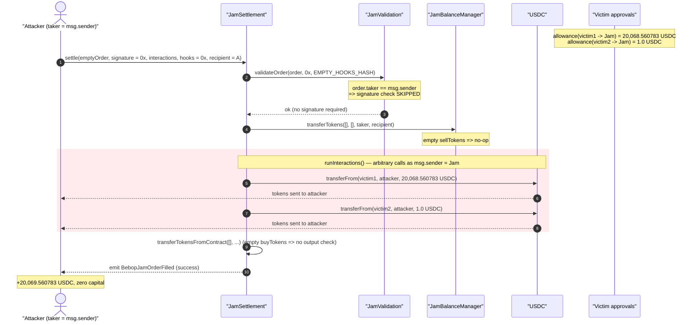
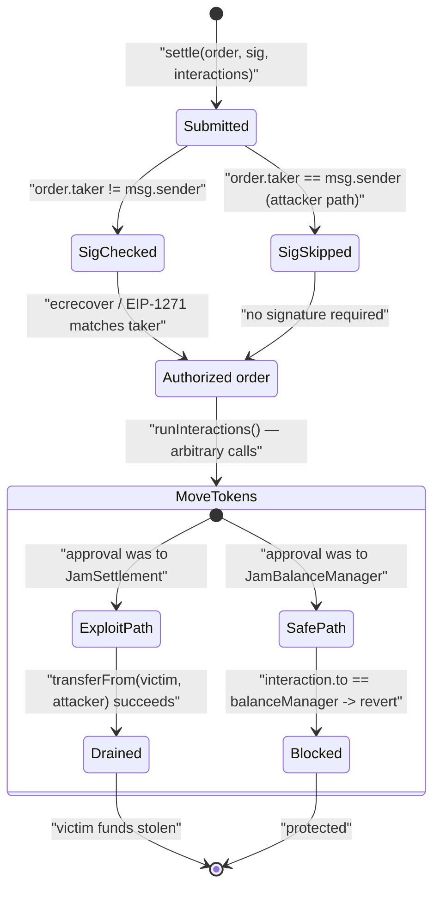
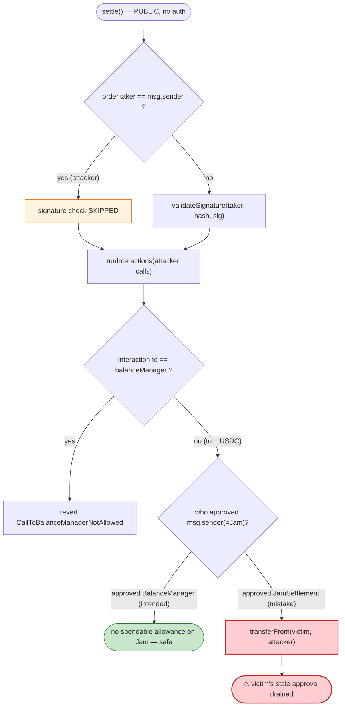

# Bebop JAM Settlement Exploit — Signature-Bypass + Unconstrained Interactions Drain Stale Approvals

> **Vulnerability classes:** vuln/auth/signature-validation · vuln/dependency/unsafe-external-call

> One-line summary: Bebop's `JamSettlement.settle()` skips signature verification whenever
> `order.taker == msg.sender`, then executes a fully attacker-controlled `interactions[]` array of
> arbitrary calls — letting anyone make the settlement contract spend USDC allowances that victims
> had mistakenly granted directly to the settlement contract.

> **Reproduction:** the PoC compiles & runs in an isolated Foundry project at
> [this project folder](.) (the umbrella DeFiHackLabs repo contains many unrelated PoCs that do not
> compile together, so this one was extracted). Full verbose trace:
> [output.txt](output.txt). Verified vulnerable source:
> [src_JamSettlement.sol](sources/JamSettlement_beb0b0/src_JamSettlement.sol),
> [src_base_JamValidation.sol](sources/JamSettlement_beb0b0/src_base_JamValidation.sol).

---

## Key info

| | |
|---|---|
| **Loss (this tx)** | **20,069.560783 USDC** (~$20.1K) drained from two pre-approving users; campaign total ≈ $21K |
| **Vulnerable contract** | `JamSettlement` — [`0xbeb0b0623f66bE8cE162EbDfA2ec543A522F4ea6`](https://arbiscan.io/address/0xbeb0b0623f66bE8cE162EbDfA2ec543A522F4ea6#code) |
| **Victims (approvers)** | `0x0c06E0737e81666023bA2a4A10693e93277Cbbf1` (20,068.560783 USDC) · `0xe7Ee27D53578704825Cddd578cd1f15ea93eb6Fd` (1.0 USDC) |
| **Stolen asset** | Arbitrum native USDC — `0xaf88d065e77c8cC2239327C5EDb3A432268e5831` |
| **Attacker EOA** | `0x59537353248d0b12c7fcca56a4e420ffec4abc91` |
| **Attacker contract** | `0x091101b0f31833c03dddd5b6411e62a212d05875` |
| **Attack tx** | [`0xe5f8fe69b38613a855dbcb499a2c4ecffe318c620a4c4117bd0e298213b7619d`](https://arbiscan.io/tx/0xe5f8fe69b38613a855dbcb499a2c4ecffe318c620a4c4117bd0e298213b7619d) |
| **Chain / block / date** | Arbitrum One / 367,586,045 / 2025-08-12 08:34:59 UTC |
| **Compiler** | Solidity v0.8.27, optimizer 1239 runs |
| **Bug class** | Missing signature/authorization check + unconstrained arbitrary external call → theft of stale ERC20 allowances |

---

## TL;DR

`JamSettlement` is the on-chain settlement engine for Bebop's "JAM" RFQ trading. A solver calls
`settle(order, signature, interactions, hooksData, balanceRecipient)`; the contract validates the
taker's signed order, pulls the taker's sell tokens, runs a list of solver `interactions` (the
swap calls), and then forwards the bought tokens to the taker.

Two design facts combine into a critical flaw:

1. **Signature is only checked when `order.taker != msg.sender`.**
   ([src_base_JamValidation.sol:130-133](sources/JamSettlement_beb0b0/src_base_JamValidation.sol#L130-L133))
   The comment says *"Allow settle from user without sig"* — the intent is that a taker submitting
   their own order does not need to sign it. So an attacker simply sets `order.taker = msg.sender`
   and passes an **empty signature**; validation is entirely skipped.

2. **`interactions[]` is a list of arbitrary low-level calls with no binding to the order.**
   ([src_libraries_JamInteraction.sol:17-25](sources/JamSettlement_beb0b0/src_libraries_JamInteraction.sol#L17-L25))
   Each entry is `(bool result, address to, uint256 value, bytes data)` and is executed as
   `to.call{value}(data)` with `msg.sender == JamSettlement`. The only restriction is
   `to != balanceManager`.

The attacker submits an order with **empty** `sellTokens/buyTokens` (so all the order-side
accounting is a no-op) and an `interactions[]` array containing two
`USDC.transferFrom(victim, attacker, amount)` calls. Because the calls originate from the
JamSettlement contract, they spend USDC allowances that the two victims had granted **directly to
the settlement contract**. The settlement contract dutifully transfers 20,069.560783 USDC straight
to the attacker.

The whole `JamBalanceManager` was built specifically to *prevent* this
([src_JamBalanceManager.sol:9-10](sources/JamSettlement_beb0b0/src_JamBalanceManager.sol#L9-L10)):
allowances are supposed to point at the balance manager, not the settlement contract, and
`runInteractions` forbids calling the balance manager. But users who approved the *settlement*
contract instead bypassed that safety boundary, and nothing in `settle()` enforced that the moved
tokens correspond to a signed order.

---

## Background — what Bebop JAM does

Bebop is an RFQ/intent DEX. In the "JAM" flow, a user (taker) signs an EIP-712 `JamOrder`
describing what they want to sell and buy. Off-chain *solvers* compete to fill the order and then
call `JamSettlement.settle(...)` on-chain, supplying:

- the signed `order`,
- the taker's `signature`,
- a list of `interactions` — the actual on-chain calls (router swaps, etc.) that source the
  taker's bought tokens,
- optional `hooksData`,
- a `balanceRecipient`.

`settle()`
([src_JamSettlement.sol:28-59](sources/JamSettlement_beb0b0/src_JamSettlement.sol#L28-L59)) is
meant to:

1. `validateOrder(order, signature, hooksHash)` — verify the taker actually authorized this trade,
2. pull the taker's **sell** tokens in (via the balance manager, against the taker's approval),
3. `runInteractions(interactions, ...)` — let the solver perform the swaps,
4. `transferTokensFromContract(order.buyTokens, ...)` — push the taker's **bought** tokens to the
   receiver, asserting the output is at least the user-agreed minimum.

A separate `JamBalanceManager` contract exists *solely* as the allowance sink. Its own NatSpec:

> *"The reason a balance manager exists is to prevent interaction to the settlement contract
> draining user funds. By having another contract that allowances are made to, we can enforce that
> it is only used to draw in user balances to settlement and not sent out."*
> — [src_JamBalanceManager.sol:9-10](sources/JamSettlement_beb0b0/src_JamBalanceManager.sol#L9-L10)

So the protocol's threat model already recognised that `interactions` can call any contract, and
deliberately put approvals one hop away. The exploit works against users who broke that assumption
by approving the settlement contract directly.

---

## The vulnerable code

### 1. Signature check is skipped when the caller is the taker

```solidity
// src/base/JamValidation.sol
function validateOrder(JamOrder calldata order, bytes calldata signature, bytes32 hooksHash) internal {
    // Allow settle from user without sig; For permit2 case, we already validated witness during the transfer
    if (order.taker != msg.sender && !order.usingPermit2) {
        bytes32 orderHash = keccak256(abi.encodePacked("\x19\x01", DOMAIN_SEPARATOR(), order.hash(hooksHash)));
        validateSignature(order.taker, orderHash, signature);          // ← only reached if taker != caller
    }
    if (!order.usingPermit2 || order.expiry == INF_EXPIRY){
        invalidateOrderNonce(order.taker, order.nonce, order.expiry == INF_EXPIRY);
    }
    require(
        order.executor == msg.sender || order.executor == address(0) || block.timestamp > order.exclusivityDeadline,
        InvalidExecutor()
    );
    require(order.buyTokens.length == order.buyAmounts.length, BuyTokensInvalidLength());
    require(order.sellTokens.length == order.sellAmounts.length, SellTokensInvalidLength());
    require(block.timestamp < order.expiry, OrderExpired());
}
```
[src_base_JamValidation.sol:128-144](sources/JamSettlement_beb0b0/src_base_JamValidation.sol#L128-L144)

With `order.taker = msg.sender` (the attacker contract) and `order.usingPermit2 = false`, the
`if` block on L130 is `false`, so **`validateSignature` is never called** — an empty `signature`
(`hex""`) is accepted. The remaining checks are trivially satisfied by the attacker:
empty token arrays (lengths match `0 == 0`), `executor == msg.sender`, `nonce = 1` (non-zero, not
yet used), and `expiry = 1754987701 > block.timestamp = 1754987699`.

### 2. `interactions[]` are arbitrary calls made *by* the settlement contract

```solidity
// src/libraries/JamInteraction.sol
function runInteractions(Data[] calldata interactions, IJamBalanceManager balanceManager) internal returns (bool) {
    for (uint i; i < interactions.length; ++i) {
        Data calldata interaction = interactions[i];
        require(interaction.to != address(balanceManager), CallToBalanceManagerNotAllowed());   // ← only guard
        (bool execResult,) = payable(interaction.to).call{ value: interaction.value }(interaction.data);
        if (!execResult && interaction.result) return false;
    }
    return true;
}
```
[src_libraries_JamInteraction.sol:17-25](sources/JamSettlement_beb0b0/src_libraries_JamInteraction.sol#L17-L25)

`interaction.to` and `interaction.data` are fully attacker-controlled. The call executes with
`msg.sender == JamSettlement`, so any allowance held *by the settlement contract* is spendable here.
The single guard (`to != balanceManager`) protects the balance manager's approvals but does
**nothing** for approvals made directly to the settlement contract.

### 3. The order "fulfillment" check is a no-op for empty orders

```solidity
// src/JamSettlement.sol — inside settle()
require(JamInteraction.runInteractions(interactions, balanceManager), InteractionsFailed());
uint256[] memory buyAmounts = order.buyAmounts;
transferTokensFromContract(order.buyTokens, order.buyAmounts, buyAmounts, order.receiver, order.partnerInfo, false);
```
[src_JamSettlement.sol:47-49](sources/JamSettlement_beb0b0/src_JamSettlement.sol#L47-L49)

With `order.buyTokens.length == 0`, `transferTokensFromContract` iterates zero times
([src_base_JamTransfer.sol:38](sources/JamSettlement_beb0b0/src_base_JamTransfer.sol#L38)) — there
is no "did the taker receive what they paid for?" assertion to violate. The order is a hollow
wrapper whose only purpose is to glide through `validateOrder`; all value movement happens in the
unconstrained `interactions`.

---

## Root cause — why it was possible

The protocol authorizes token movement in two independent ways that were never reconciled:

1. **Order authorization** is enforced via the EIP-712 signature on the `JamOrder`. But that check
   is *opt-out* whenever `order.taker == msg.sender` — a convenience for self-submitting takers.
2. **Token movement** in `interactions` is enforced via *who holds the allowance*. The design bets
   that no spendable allowance is ever held by the settlement contract (it routes everything
   through the `JamBalanceManager`, and forbids interactions from touching the balance manager).

The bug is that an attacker can be **the taker of a meaningless empty order** (bypassing #1) while
the `interactions` spend **someone else's** allowance to the settlement contract (defeating #2).
Nothing ties the tokens moved in `interactions` to the `taker` of the order, the signature, or the
declared `sellTokens`. Concretely:

- `validateOrder` proves only that *the order is well-formed and authorized by its own taker* — and
  the attacker is that taker, so it proves nothing about the victims.
- `runInteractions` proves only that *the calls did not target the balance manager*.
- `transferTokensFromContract` proves only that *the (empty) buyTokens were delivered* — vacuously
  true.

So a victim's approval to JamSettlement is a free-floating spend permission with **no order, no
signature, and no nonce** gating its use. Any third party can monetize it through the
`interactions` channel. The `JamBalanceManager` indirection was supposed to make this structurally
impossible, but it only works for users who approve the *balance manager*. Users (and integrating
contracts) who approved the *settlement* contract — a very natural mistake given it is the contract
they call — were fully exposed.

---

## Preconditions

- **A victim has a non-zero ERC20 allowance to the `JamSettlement` contract itself** (not the
  balance manager). Verified on-chain at the fork block:
  - `allowance(0x0c06…bbf1 → JamSettlement) = 20,068,560,783` (20,068.560783 USDC)
  - `allowance(0xe7Ee…b6Fd → JamSettlement) = 1,000,000` (1.0 USDC)
  - Both victims held enough balance to cover the allowance (32,524.9 USDC and 1.135283 USDC).
- The victim's balance ≥ the amount transferred (so `transferFrom` succeeds).
- The order's `nonce` is unused for the attacker-as-taker (any non-zero value works; PoC uses `1`).
- `block.timestamp < order.expiry` — the PoC forks one block before the live attack, and the order
  carries the live attack's `expiry = 1754987701`, which is 2 seconds past the fork block time.

No capital, no flash loan, and no signature are required. The attack is **permissionless** and
costs only gas — it is a pure theft of pre-existing approvals.

---

## Attack walkthrough (with on-chain numbers from the trace)

All figures are taken directly from [output.txt](output.txt).

| # | Step | Call | Amount | Effect |
|---|------|------|-------:|--------|
| 0 | **Pre-state** | `allowance(victim1→Jam)` | 20,068.560783 USDC | Victim1 mistakenly approved the settlement contract. |
| 0 | **Pre-state** | `allowance(victim2→Jam)` | 1.0 USDC | Victim2 likewise. |
| 1 | **Craft empty order** | `order.taker = order.executor = attacker`, empty `sell/buy` arrays, `nonce = 1`, `expiry = 1754987701` | — | Designed solely to pass `validateOrder` with no signature. |
| 2 | **Call `settle`** | `settle(order, "", interactions, "", attacker)` | — | `validateOrder` passes (taker == msg.sender ⇒ sig skipped). |
| 3 | `transferTokens([], [], …)` | balance-manager no-op | 0 | Empty `sellTokens` ⇒ nothing pulled. |
| 4 | **Interaction #1** | `USDC.transferFrom(victim1, attacker, 0x4ac2def8f)` (msg.sender = Jam) | 20,068.560783 USDC | Spends victim1's full allowance to Jam. |
| 5 | **Interaction #2** | `USDC.transferFrom(victim2, attacker, 0xf4240)` (msg.sender = Jam) | 1.0 USDC | Spends victim2's full allowance to Jam. |
| 6 | `transferTokensFromContract([], …)` | empty-buyTokens no-op | 0 | No output check — order vacuously "filled". |
| 7 | **Emit `BebopJamOrderFilled`** + bump attacker nonce | — | — | Settlement completes successfully. |

Net: the attacker's USDC balance goes from **0 → 20,069.560783 USDC** in a single `settle()` call.

The two `transferFrom` amounts equal each victim's allowance **to the wei** — the attacker queried
each victim's `allowance(victim, JamSettlement)` and drained it exactly. (The PoC's stale comment
`// 20,134,500,015` is just an annotation; the authoritative constant `0x4ac2def8f = 20,068,560,783`
matches the on-chain allowance and the trace.)

### Profit accounting (USDC)

| Direction | Source | Amount |
|---|---|---:|
| Received | `transferFrom(victim1)` | +20,068.560783 |
| Received | `transferFrom(victim2)` | +1.000000 |
| **Total received** | | **+20,069.560783** |
| Spent | (only gas) | 0 |
| **Net profit** | | **+20,069.560783 USDC** |

The attacker's measured balance after the call is exactly `20,069.560783 USDC`
([output.txt:7](output.txt#L7)).

---

## Diagrams

### Sequence of the attack



### Authorization-model state (intended vs. exploited)



### Why the guard does not protect settlement-contract approvals



---

## Remediation

1. **Bind `interactions` to the authorized order — or never let the settlement contract hold
   spendable allowances.** The settlement contract must never be a valid `transferFrom` spender for
   user funds. Route 100% of user-token pulls through the `JamBalanceManager` (which already gates
   on a validated order/signature), and treat any direct approval to the settlement contract as an
   integration error that the contract refuses to exploit. The cleanest fix is to ensure the
   contract holds no exploitable approvals and to scope `interactions` so they cannot call ERC20
   `transferFrom`/`transfer`/`approve` on the settlement contract's own behalf for arbitrary
   token/owner pairs.
2. **Do not skip signature verification merely because `taker == msg.sender`.** A self-submitting
   taker should still authenticate the order — e.g., require an EIP-712 signature unconditionally,
   or, if self-submission must be sig-less, ensure that the only funds movable are the *caller's
   own* (which is guaranteed if approvals live on the balance manager and interactions cannot spend
   them). The convenience exception
   ([src_base_JamValidation.sol:130](sources/JamSettlement_beb0b0/src_base_JamValidation.sol#L130))
   removes the one check that would otherwise tie the spend to a consenting party.
3. **Assert non-empty, order-consistent settlements.** Reject orders whose `sellTokens`/`buyTokens`
   are empty (a no-op trade has no legitimate use) and verify that tokens pulled in `interactions`
   reconcile against the order's declared sell side. An "order" that moves value while declaring it
   buys/sells nothing should never settle.
4. **User-side / integrator guidance and on-chain enforcement:** publish that approvals must target
   the `JamBalanceManager`, and consider an on-chain `revoke`/`rescue` path that lets the protocol
   defensively zero out any approvals erroneously granted to the settlement contract.

---

## How to reproduce

The PoC was extracted into a standalone Foundry project (the umbrella DeFiHackLabs repo fails to
compile as a whole under `forge test`):

```bash
_shared/run_poc.sh 2025-08-Bebop_dex_exp -vvvvv
```

- RPC: an **Arbitrum archive** endpoint is required (the fork block 367,586,044 is from
  2025-08-12). `foundry.toml` uses `https://arbitrum.gateway.tenderly.co`, which serves historical
  state at that block; most public Arbitrum RPCs prune it and fail with `missing trie node`.
- Result: `[PASS] testExploit()` with the attacker's USDC balance going from `0` to
  `20069.560783`.

Expected tail:

```
Ran 1 test for test/Bebop_dex_exp.sol:Bebop
[PASS] testExploit() (gas: 143600)
Logs:
  Attacker Before exploit USDC Balance: 0.000000
  Attacker After exploit USDC Balance: 20069.560783

Suite result: ok. 1 passed; 0 failed; 0 skipped
```

---

*References: PoC header — attacker `0x59537353…abc91`, tx
`0xe5f8fe69…b7619d`; post-mortem https://x.com/SuplabsYi/status/1955230173365961128.
Verified source fetched from Arbiscan (chainid 42161) into
[sources/JamSettlement_beb0b0/](sources/JamSettlement_beb0b0/).*
