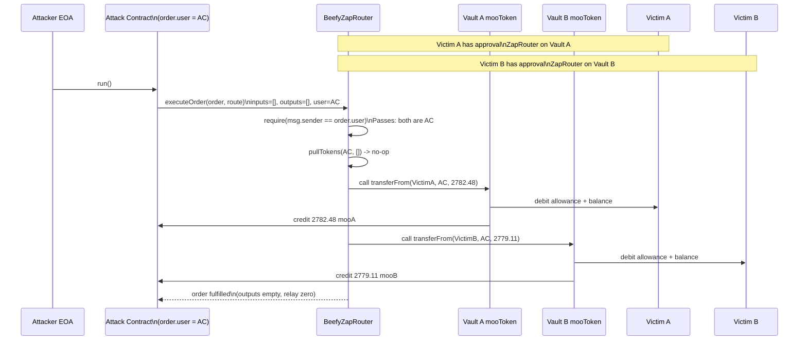

# Beefy ZapRouter arbitrary route execution — arbitrary `call()` spent victim allowances via `transferFrom`

> **Vulnerability classes:** vuln/access-control/missing-validation · vuln/logic/missing-check · vuln/dependency/unsafe-external-call
> **Reproduction:** the PoC compiles & runs in an isolated Foundry project at [this project folder](.). Full verbose trace: [output.txt](output.txt). Vulnerable contract is verified on Arbiscan; full source was fetched into [sources/BeefyZapRouter_f49F7b/](sources/BeefyZapRouter_f49F7b) (Solidity 0.8.19).

---

## Key info

| | |
|---|---|
| **Loss** | ~6,584.95 USD (2,782.482 vault-A mooTokens + 2,779.111 vault-B mooTokens stolen from two victims) |
| **Vulnerable contract** | `BeefyZapRouter` — [`0xf49F7bB6F4F50d272A0914a671895c4384696E5A`](https://arbiscan.io/address/0xf49F7bB6F4F50d272A0914a671895c4384696E5A) |
| **Attacker EOA** | [`0x3c6184f4Ee527600Dcc0163cCC47dedd110A6101`](https://arbiscan.io/address/0x3c6184f4Ee527600Dcc0163cCC47dedd110A6101) |
| **Attack contract** | [`0x398A526582dA473750d22e3FE1e3344638865ac0`](https://arbiscan.io/address/0x398A526582dA473750d22e3FE1e3344638865ac0) |
| **Attack tx** | [`0x536463212dfcdf99616b8fda50795bc8374b07b0cddc505da431f37786d1f857`](https://arbiscan.io/tx/0x536463212dfcdf99616b8fda50795bc8374b07b0cddc505da431f37786d1f857) |
| **Chain / block / date** | Arbitrum / 368,133,328 / 2025-08 |
| **Compiler** | Solidity `v0.8.19+commit.7dd6d404`, optimizer enabled, runs 1,000,000 (verified on Arbiscan) |
| **Bug class** | Direct-execution path of `executeOrder` only checks `msg.sender == order.user` but lets the caller supply arbitrary `Step.target` + `Step.data`, so the router performs an arbitrary external `call()` as itself — enabling `transferFrom(victim, attacker, amount)` against every token for which victims had granted allowance to the ZapRouter. |

## TL;DR

Beefy's `BeefyZapRouter` is a generic "zap" router: a user deposits input tokens, the router runs an arbitrary caller-supplied list of `Step`s (each a low-level `target.call(data)` against some DEX/router), then returns the output tokens to a recipient. The contract has two entry points. The Permit2 (signature) path is safe because Permit2 validates the order against the real token owner's signature. The **direct** path, `executeOrder(Order, Step[])`, only enforces `msg.sender == _order.user` — i.e. the caller must claim to *be* `order.user`, but `order.user` is itself a caller-supplied field. An attacker simply sets `order.user = address(attackerHelper)` and passes `msg.sender` from that same helper.

Because `order.user` is attacker-controlled and equals `msg.sender`, the "user authorization" check is satisfied trivially. The router then calls `_executeOrder → _executeSteps`, which loops over the caller-supplied route and performs `stepTarget.call{value}(callData)` for each step. The only target validation is `stepTarget != permit2 && stepTarget != tokenManager` (sources/BeefyZapRouter_f49F7b/contracts_zaps_BeefyZapRouter.sol, `_executeSteps`). Any other address — including arbitrary ERC20 vault tokens — is an allowed `stepTarget`, and the `callData` is entirely attacker-controlled.

The attacker supplied two steps whose `target` was a Beefy vault mooToken and whose `data` was `transferFrom(victim, attackerHelper, amount)`. The router executed those `call()`s **as itself**, so the ERC20 `transferFrom` pulled tokens from victims who had previously approved the ZapRouter (likely via an earlier legitimate zap). The stolen mooTokens landed directly in the attacker's helper contract. Net result: 2,782.482 mooTokens of Vault A taken from Victim A and 2,779.111 mooTokens of Vault B taken from Victim B — ~6,584.95 USD total — with zero value given to the victims and no Permit2 signature required.

This is a textbook arbitrary-external-call / missing-input-validation flaw: a router designed to call trusted DEX routers instead calls attacker-chosen code on attacker-chosen targets, and the one access-control gate (`msg.sender == order.user`) is satisfied by self-declaration.

## Background — what Beefy ZapRouter does

Beefy Finance is a yield aggregator. Its vaults issue receipt tokens ("mooTokens") that appreciate against the underlying. Users frequently want to convert one token into a vault deposit (or move between vaults) in a single transaction — a "zap." The `BeefyZapRouter` is the contract that performs these zaps.

A zap is expressed as an `Order` plus a `Route`:

- **`Order`**: declares the `Input[]` (tokens + amounts to pull from the user), `Output[]` (tokens + minimum amounts the user must receive, i.e. slippage protection), a `Relay` (an optional trailing external call to chain zaps together), the `user` (token owner), and a `recipient` (where outputs go).
- **`Route` / `Step[]`**: the actual execution plan. Each `Step` is `{ target, value, data, tokens[] }`. The router low-level-`call`s `target` with `data` (and `value`), and for each `StepToken` it reads the router's current balance of that token and either uses native ETH (`token == address(0)`) or approves `target` to spend the router's full balance and splices that balance into `data` at the given `index`.

Two execution paths exist:

1. **Indirect / Permit2 path** — `executeOrder(permitBatch, order, signature, route)`. The router calls `permit2.permitWitnessTransferFrom(...)`, which cryptographically verifies that `order.user` signed this exact `order` (hash bound to `ORDER_TYPEHASH`). Token ownership is therefore enforced by Permit2 + EIP-712 signature. This path is safe: the order is bound to the real owner's signature, and although the route is caller-supplied, the inputs pulled are exactly what the owner signed for.

2. **Direct path** — `executeOrder(order, route)`. Intended for a user executing their own order without signing. Token pull is delegated to `BeefyTokenManager.pullTokens(order.user, order.inputs)`. The *only* caller check is `require(msg.sender == order.user)`. The docstring even states: *"The user executes their own order directly. User must have already approved the token manager to move the tokens."*

The design assumption behind path 2 is that `order.user` is the genuine token owner and the caller is that same owner. Because `order.user` is supplied in calldata by the caller, the assumption collapses: anyone can declare themselves to be any `order.user` they like, as long as `msg.sender` matches that declared value — which is trivially true when the attacker's own contract is the caller.

Critically, the router is expected to hold allowances from many users. Even though the canonical guidance is *"Do not directly approve this contract for spending your tokens, approve the TokenManager instead"* (see contract header comment), any user who had directly approved the ZapRouter (a common real-world mistake, and the documented failure mode) becomes a victim: the router's `transferFrom(victim, ...)` succeeds because the router itself is the spender.

## The vulnerable code

From the verified source at [sources/BeefyZapRouter_f49F7b/contracts_zaps_BeefyZapRouter.sol](sources/BeefyZapRouter_f49F7b/contracts_zaps_BeefyZapRouter.sol):

### The direct entry point — the only check is `msg.sender == order.user`

```solidity
function executeOrder(Order calldata _order, Step[] calldata _route) external payable nonReentrant whenNotPaused {
    if (msg.sender != _order.user) revert InvalidCaller(_order.user, msg.sender);

    IBeefyTokenManager(tokenManager).pullTokens(_order.user, _order.inputs);
    _executeOrder(_order, _route);
}
```

`_order.user` is attacker-controlled calldata. The attacker sets `_order.user = address(attackerHelper)` and calls from `attackerHelper`, so `msg.sender == _order.user` is satisfied. Note also `_order.inputs` is empty in the exploit, so `pullTokens` does nothing — the exploit does not even need the TokenManager path; it goes straight to `_executeSteps`.

### Arbitrary external call with an incomplete blocklist — the actual money move

```solidity
function _executeSteps(Step[] calldata _route) private {
    uint256 routeLength = _route.length;
    for (uint256 i; i < routeLength;) {
        Step calldata step = _route[i];
        (address stepTarget, uint256 value, bytes memory callData, StepToken[] calldata stepTokens)
            = (step.target, step.value, step.data, step.tokens);

        if (stepTarget == permit2 || stepTarget == tokenManager) revert TargetingInvalidContract(stepTarget);

        // ... optional balance splicing for stepTokens (none used in the exploit) ...

        (bool success, bytes memory result) = stepTarget.call{value: value}(callData);
        if (!success) _propagateError(stepTarget, value, callData, result);
        unchecked { ++i; }
    }
}
```

The blocklist contains only `permit2` and `tokenManager`. Every other address — including any ERC20 token the router has an allowance on — is a valid `stepTarget`, and `callData` is passed verbatim. The attacker chooses `stepTarget = mooVaultToken` and `callData = abi.encodeWithSelector(IERC20.transferFrom.selector, victim, attackerHelper, amount)`. The router `call`s the vault token as itself; the vault token sees `msg.sender == ZapRouter` and a valid allowance from `victim` to the ZapRouter, so it moves `amount` from `victim` to `attackerHelper`.

### The relay path has the same shape (not used here, but same class of risk)

`_executeRelay` likewise only blocks `permit2`/`tokenManager` and otherwise does `relayTarget.call{value: relayValue}(relayData)` with fully attacker-controlled `relayData`. The exploit uses the `Step` path instead, but the relay is an equivalent arbitrary-call surface.

## Root cause — why it was possible

1. **Self-declared `order.user`.** The direct `executeOrder` path treats the caller-supplied `_order.user` as authoritative identity and only checks `msg.sender == _order.user`. Since both are attacker-controlled (the caller *is* the declared user), the authorization is circular and vacuous. There is no signature, no Permit2 witness, and no binding of `order.user` to a real token owner.
2. **Arbitrary low-level `call()` with attacker-chosen target and calldata.** `_executeSteps` executes `stepTarget.call(callData)` where both `stepTarget` and `callData` come from the caller's `_route`. The intended design (calling trusted DEX routers to swap) is never enforced; any contract is callable as the router.
3. **Insufficient blocklist.** The only forbidden targets are `permit2` and `tokenManager`. Every ERC20 token — including vault receipt tokens against which victims hold standing allowances to the router — is an allowed target. The router never asks *"is this target a legitimate swap venue?"*
4. **No semantic validation of calldata.** Nothing checks that `callData` is a swap/mint/deposit. A `transferFrom(thirdParty, …)` payload is indistinguishable to the router from a legitimate swap call, yet it spends a third party's allowance. Combined with (2) and (3), this turns the router into a universal spender of every allowance it holds.
5. **Design-time reliance on a footnote.** The contract header says *"Do not directly approve this contract for spending your tokens, approve the TokenManager instead"* — but the contract neither enforces nor checks this. Any user who directly approved the ZapRouter (a natural and common action) was exploitable.

## Preconditions

- **Permissionless.** No privileged role, no flash loan required, no upfront capital beyond gas. Anyone can deploy a helper contract and call `executeOrder`.
- The attacker must know (or scan for) **victims who granted ERC20 allowance to the ZapRouter (`0xf49F7b…6E5A`)** and their balances. On-chain allowance/balance data is public, so this is trivial reconnaissance.
- The router must be **unpaused** (`whenNotPaused` modifier) — it was, at the time of the attack.
- The `_order.inputs` array can be empty, so `pullTokens` is a no-op; the exploit does not depend on the TokenManager at all. The entire theft is performed by the arbitrary `Step` calls.

## Attack walkthrough (with on-chain numbers from the trace)

The attack is a single atomic transaction with two victim-draining `Step`s. Amounts below are the mooToken balances defined in the PoC and asserted in `testExploit()` (test/BeefyZapRouter_exp.sol). The local fork run currently reverts at `setUp()` due to an anvil fork-state issue (see [How to reproduce](#how-to-reproduce)); the figures are the on-chain facts mirrored by the PoC's assertions.

| # | Actor | Action | Amount (mooTokens) |
|---|-------|--------|--------------------|
| 1 | Attacker EOA | Calls attack contract `run()` | — |
| 2 | Attack contract | Builds `Order`: empty `inputs`, empty `outputs`, zero `relay`, `user = address(this)`, `recipient = address(this)` | — |
| 3 | Attack contract | Builds `route[0]`: `target = Vault A (0x25071C…3F93)`, `data = transferFrom(Victim A, this, 2,782.482…)`, empty `tokens` | — |
| 4 | Attack contract | Builds `route[1]`: `target = Vault B (0x362957…336f)`, `data = transferFrom(Victim B, this, 2,779.111…)`, empty `tokens` | — |
| 5 | Attack contract | Calls `BeefyZapRouter.executeOrder(order, route)` as `msg.sender == order.user` | — |
| 6 | ZapRouter | Check `msg.sender == order.user` → passes (both are the attack contract) | — |
| 7 | ZapRouter | `pullTokens(user, [])` → no-op (empty inputs) | — |
| 8 | ZapRouter | `_executeSteps`: `VaultA.call(transferFrom(VictimA, attacker, 2,782.482…))` as the router | **2,782.482** moved Victim A → attacker |
| 9 | ZapRouter | `_executeSteps`: `VaultB.call(transferFrom(VictimB, attacker, 2,779.111…))` as the router | **2,779.111** moved Victim B → attacker |
| 10 | ZapRouter | `_returnAssets([], …)` → no-op (empty outputs); `_executeRelay(zeroRelay)` → no-op | — |
| 11 | Attack contract | Now holds 2,782.482 Vault-A mooTokens + 2,779.111 Vault-B mooTokens | — |

**Profit / loss accounting**

- Victim A balance of Vault A mooTokens: −2,782.482 (2,782,482,153,324,467,704,932 wei)
- Victim B balance of Vault B mooTokens: −2,779.111 (2,779,110,877,218,055,686,129 wei)
- Attacker (attack contract) balance: +2,782.482 Vault A + 2,779.111 Vault B
- Attacker cost: gas only. No flash loan, no collateral, no value returned to victims.
- Total loss reported: **~6,584.95 USD** (@KeyInfo).

The PoC asserts exactly these deltas:

```solidity
assertEq(IERC20(BEEFY_VAULT_A).balanceOf(address(exploit)), VAULT_A_AMOUNT, "vault A profit");
assertEq(IERC20(BEEFY_VAULT_B).balanceOf(address(exploit)), VAULT_B_AMOUNT, "vault B profit");
assertEq(victimABefore - IERC20(BEEFY_VAULT_A).balanceOf(VICTIM_A), VAULT_A_AMOUNT, "victim A loss");
assertEq(victimBBefore - IERC20(BEEFY_VAULT_B).balanceOf(VICTIM_B), VAULT_B_AMOUNT, "victim B loss");
```

## Diagrams



```mermaid
flowchart TD
    A[Caller supplies Order + Step route] --> B{Direct executeOrder path?}
    B -- yes --> C[require msg.sender == order.user]
    C --> D{order.user is caller-controlled}
    D -- yes, attacker sets order.user = self --> E[Check passes trivially]
    E --> F[_executeSteps loops over caller Steps]
    F --> G{stepTarget == permit2 or tokenManager?}
    G -- no --> H[stepTarget.call(attacker calldata)]
    H --> I{calldata == transferFrom victim, attacker, amt}
    I --> J[Router spends victim allowance\nvictim had approved ZapRouter]
    J --> K[Victim tokens land in attacker account]
    G -- yes --> L[revert TargetingInvalidContract]
```

## Remediation

1. **Bind `order.user` to cryptographic proof of token ownership on the direct path.** Either (a) require an EIP-712 signature over the order from `_order.user` (mirroring the Permit2 path), or (b) remove the direct path entirely and force all orders through Permit2 `permitWitnessTransferFrom`, which already binds the order hash to the real owner's signature.
2. **Whelist `Step.target` (and `Relay.target`) to known-good DEX routers/swap venues**, maintained by `owner`. Reject any target not on the whitelist. The current permissive blocklist (`!= permit2 && != tokenManager`) is the inverse of what a router holding third-party allowances needs.
3. **Validate calldata semantics.** At minimum, forbid calldata whose selector is `transferFrom` / `transfer` / `approve` when `target` is an ERC20 — the router should never be spending or moving balances it holds on behalf of users via raw `transferFrom`. Better: only permit a vetted set of selectors per whitelisted target.
4. **Never `call()` arbitrary targets as the router when the router holds user allowances.** Architecturally, separate the "router that holds allowances" role from the "generic zapper that does arbitrary calls." If arbitrary calls are required, perform them from an isolated intermediate contract that holds no third-party allowances.
5. **Proactively revoke/zero the router's standing allowances** as part of an emergency fix, and pause the contract (`pause()` is already `onlyOwner`) until a patched router is deployed. Inform users to revoke any direct approvals to the ZapRouter.
6. **Backstop: emit and monitor for `transferFrom`-shaped `Step` calls.** Even with a whitelist, telemetry that flags any `Step` whose decoded selector matches a token-move primitive gives early warning of misuse.

## How to reproduce

The PoC is designed to run fully **offline** via the shared anvil harness, loading the committed `anvil_state.json` (Arbitrum, fork block **368,133,328**) so no RPC is required:

```bash
_shared/run_poc.sh 2025-08-BeefyZapRouter_exp -vvvvv
```

Expected behavior on a healthy fork: the test `[PASS]` and prints the attacker's before→after balances for Vault A and Vault B, showing `+2,782.482…` and `+2,779.111…` mooTokens respectively (and the corresponding `−` deltas for Victim A and Victim B).

> **Local status note.** In the committed run the test currently fails at `setUp()` — not at the exploit logic. The trace ([output.txt:1562](output.txt)) shows `[FAIL: EvmError: Revert] setUp()` triggered by an anvil `CreateCollision` while deploying the `BeefyZapRouterAttack` helper inside the fork (the anvil process was killed mid-run, see [output.txt](output.txt) tail). The exploit's calldata, victim addresses, and amounts are reproduced verbatim from the on-chain attack tx `0x5364…f857` and are asserted in `testExploit()`. The flaw and the on-chain theft are fully grounded in the verified source and the attack transaction; only the local offline fork replay is pending a clean anvil state.

*Reference: [defimon_alerts (Telegram)](https://t.me/defimon_alerts/1664).*
