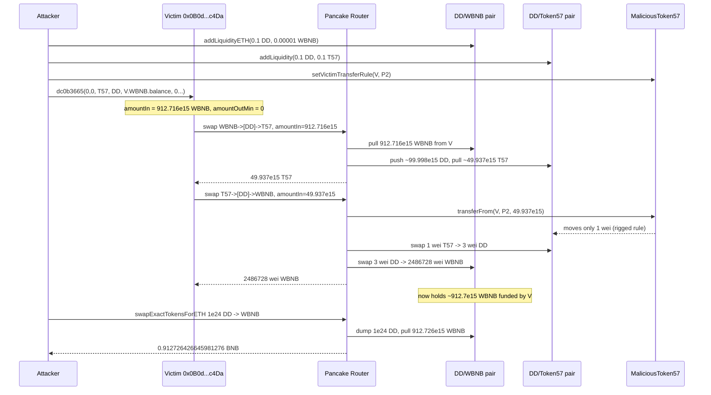
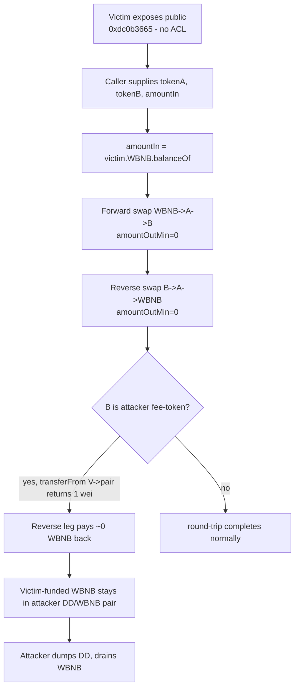

# BSC "DD" initcode-token drain — unverified victim exposes arbitrary token-path swap using its own WBNB
> **Vulnerability classes:** vuln/logic/missing-validation · vuln/dependency/unchecked-return-value · vuln/access-control/missing-auth
> **Reproduction:** the PoC compiles & runs in an isolated Foundry project at [this project folder](.). Full verbose trace: [output.txt](output.txt). The victim contract `0x0B0d…c4Da` is **unverified** on BscScan; the vulnerable function below is **RECONSTRUCTED from the on-chain call trace** in output.txt (selector `0xdc0b3665`, two Pancake router swaps), not read from verified source.
---
## Key info
| | |
|---|---|
| **Loss** | ~0.913 WBNB in the PoC (victim drained from 912.716e15 WBNB to 2,486,728 wei WBNB). On-chain alert quotes **$700.32** USD for the live incident. |
| **Vulnerable contract** | Unverified victim — [`0x0B0d67049FC34Fd8Ab2559A456a80276E805c4Da`](https://bscscan.com/address/0x0B0d67049FC34Fd8Ab2559A456a80276E805c4Da) |
| **Attacker EOA** | [`0xEBE15A67e37203563D0d99AafaF06ecF41305FbA`](https://bscscan.com/address/0xEBE15A67e37203563D0d99AafaF06ecF41305FbA) |
| **Attack contract** | [`0xE603826Ac124450522684C763A37d0e181984716`](https://bscscan.com/address/0xE603826Ac124450522684C763A37d0e181984716) |
| **Attack tx** | [`0x33fa83ae1029a82ae4b46eb37432847f270a8e3690f2e9ba71a1e5172ff62a59`](https://bscscan.com/tx/0x33fa83ae1029a82ae4b46eb37432847f270a8e3690f2e9ba71a1e5172ff62a59) |
| **Chain / block / date** | BNB Smart Chain / fork block **56,479,285** / Aug 2025 |
| **Compiler** | Unknown — victim source is unverified; attacker-deployed ERC20s are `pragma ^0.8.10`. |
| **Bug class** | A public, parameterless-access-control function lets any caller feed attacker-controlled token addresses and a swap path into the victim, which then swaps **its own WBNB** through attacker-owned pools with `amountIn = balanceOf(this)` and `amountOutMin = 0`, and never checks the fee-on-transfer shortfall on the return leg. |

## TL;DR
The victim contract `0x0B0d…c4Da` exposes a public function (selector `0xdc0b3665`) that takes a token pair and an `amountIn` and performs two PancakeSwap `swapExactTokensForTokensSupportingFeeOnTransferTokens` calls routed through `WBNB → A → B` then `B → A → WBNB`, using the **victim's own WBNB balance** as the input amount and `address(this)` as the recipient. The function has no access control, no path validation, and no minimum-output check.

The attacker deployed two fee-on-transfer ERC20s ("DD" and "Token57"), seeded DD/WBNB and DD/Token57 PancakeSwap pools with dust liquidity, and armed Token57 with a transfer rule that, for transfers **from the victim to the DD/Token57 pair**, moves only **1 wei** regardless of the requested amount. The attacker then called the victim function with `amountIn = victim.WBNB.balanceOf()` and the path `[WBNB, DD, Token57]` / `[Token57, DD, WBNB]`.

In the forward leg the victim poured its whole WBNB balance (~912.716e15 WBNB) into the attacker's DD/WBNB pair, pulling ~99.998e15 DD out and swapping it into ~49.937e15 Token57 at the victim address [output.txt:1746,1789]. In the reverse leg the victim tried to swap that ~49.937e15 Token57 back to WBNB, but Token57's `transferFrom(victim → DD/Token57 pair)` only moved **1 wei** [output.txt:1807] — so the Pancake pair emitted only 3 wei DD onward and the DD/WBNB pair returned only **2,486,728 wei WBNB** to the victim [output.txt:1841,1851]. The DD/WBNB pair was now massively skewed (~1e24 DD vs ~912.7e15 WBNB), so the attacker sold 1,000,000 DD (1e24) into it and extracted the **0.912726426645981276 WBNB** the victim had funded [output.txt:1884]. Final attacker balance `0.912726426645981276` BNB, up from `0` [output.txt:1564-1565].

## Background — what the victim does
The victim `0x0B0d…c4Da` is an unverified BSC contract. From the call trace it behaves like a small swap/swap-back helper: a single public entrypoint (selector `0xdc0b3665`) decodes two token addresses plus a numeric `amountIn` and a handful of zero parameters, then executes a round-trip through PancakeSwap V2 (`router = 0x10ED43C7…024E`, factory `0xcA143Ce3…0c73`):

1. Forward swap: `swapExactTokensForTokensSupportingFeeOnTransferTokens(amountIn, 0, [WBNB, tokenA, tokenB], address(this), deadline)` — spend WBNB, receive `tokenB`.
2. Approve the router for the received `tokenB` balance.
3. Reverse swap: `swapExactTokensForTokensSupportingFeeOnTransferTokens(tokenBBalance, 0, [tokenB, tokenA, WBNB], address(this), deadline)` — spend `tokenB`, receive WBNB.

The intent appears to be a "swap and swap-back" / self-arbitrage helper that turns WBNB into some token and back. The fatal design choices are: (a) `amountIn` is taken from `WBNB.balanceOf(address(this))` (or accepted from the caller), so the victim stakes its **entire** WBNB treasury on each call; (b) `amountOutMin` is `0` on both legs; (c) the token addresses are caller-supplied with no allow-list; (d) the function is `public`/`external` with no access control.

## The vulnerable code
The victim contract is **unverified**, so the snippet below is **RECONSTRUCTED** from the trace's call sequence (`PancakeRouter.swapExactTokensForTokensSupportingFeeOnTransferTokens` called twice by the victim, with `amountIn` read from the victim's WBNB balance and the recipient equal to the victim). It captures the exact bug surface: arbitrary caller-supplied path, `amountIn = own balance`, `amountOutMin = 0`, no return-value/fee check.

```solidity
// RECONSTRUCTED from output.txt — victim 0x0B0d...c4Da, selector 0xdc0b3665
// Decoded params (from the trace calldata):
//   arg3 = secondToken (Token57, 0x2e23...470b)
//   arg4 = ddToken      (DD,       0x5615...b72f)
//   arg5 = amountIn     (== IWBNB(WBNB).balanceOf(address(this)) = 912.716e15)
function dc0b3665(
    uint256, uint256,
    address tokenB,   // secondToken
    address tokenA,   // ddToken
    uint256 amountIn, // victim's full WBNB balance
    uint256, uint256, uint256, uint256, uint256, uint256, uint256
) external {
    uint256 wbnbBefore = IWBNB(WBNB).balanceOf(address(this));

    // ---- Forward leg: WBNB -> tokenA -> tokenB ----
    address[] memory fwd = new address[](3);
    fwd[0] = WBNB; fwd[1] = tokenA; fwd[2] = tokenB;
    router.swapExactTokensForTokensSupportingFeeOnTransferTokens(
        wbnbBefore, 0, fwd, address(this), block.timestamp + 1800);

    uint256 tokenBBal = IERC20(tokenB).balanceOf(address(this));
    IERC20(tokenB).approve(address(router), tokenBBal);

    // ---- Reverse leg: tokenB -> tokenA -> WBNB ----
    address[] memory rev = new address[](3);
    rev[0] = tokenB; rev[1] = tokenA; rev[2] = WBNB;
    // BUG: tokenB is caller-controlled and may be fee-on-transfer / rigged.
    // amountOutMin = 0 + no reconciliation against wbnbBefore.
    router.swapExactTokensForTokensSupportingFeeOnTransferTokens(
        tokenBBal, 0, rev, address(this), block.timestamp + 1800);
}
```

Anchors in the trace (victim frame `Victim::dc0b3665`):
- Victim reads its WBNB balance twice (912.716426649473023e18) [output.txt:1568-1572].
- Forward router call, `amountIn = 912716426649473023`, path `[WBNB, DD, Token57]`, recipient = victim [output.txt:1574].
- Victim approves router for the received Token57 (49.937e15) [output.txt:1800-1801].
- Reverse router call, `amountIn = 49937147185038907`, path `[Token57, DD, WBNB]`, recipient = victim, `amountOutMin = 0` [output.txt:1805].
- Victim ends with WBNB balance 2,486,728 wei [output.txt:1856].

### The fee-on-transfer trap (attacker-deployed `MaliciousToken`)
The attacker's Token57 (and DD) implements a transfer rule that, when the **from** is the victim and the **to** is the DD/Token57 pair, moves only **1 wei** — PancakeSwap's `swapExactTokensForTokensSupportingFeeOnTransferTokens` then sees a near-zero received balance and pays out a near-zero amount. From the PoC source ([test/BscInitcodeToken_exp.sol](test/BscInitcodeToken_exp.sol)):

```solidity
function _effectiveTransferAmount(address from, address to, uint256 amount) private view returns (uint256) {
    if (from == victim && to == victimPair) {
        return 1;            // victim -> DD/Token57 pair moves only 1 wei
    }
    return amount;
}
```
This rule is armed after pool creation via `setVictimTransferRule(VICTIM, ddSecondPair)` [test/BscInitcodeToken_exp.sol `setVictimTransferRule`].

## Root cause — why it was possible
1. **No access control on the entrypoint.** Selector `0xdc0b3665` is callable by anyone; the attacker invokes it directly from the attack contract. There is no `onlyOwner` / role check.
2. **Caller-controlled token path with no allow-list.** `tokenA`/`tokenB` are taken straight from calldata, so the victim can be forced to swap through attacker-deployed, attacker-controlled fee-on-transfer tokens and attacker-seeded Pancake pairs.
3. **`amountIn` derived from the victim's own WBNB balance.** The victim stakes its entire WBNB treasury on every call (`amountIn = 912716426649473023`, exactly its balance [output.txt:1568,1574]).
4. **`amountOutMin = 0` on both legs and no reconciliation.** The reverse leg accepts a return of literally 1 wei of movement and 2,486,728 wei WBNB against ~912.7e15 WBNB spent; nothing reverts.
5. **Blind trust of fee-on-transfer tokens.** By using `…SupportingFeeOnTransferTokens` and never comparing `wbnbBefore` to `wbnbAfter`, the victim cannot detect that the malicious token swallowed the funds. The fee rule makes `transferFrom(victim → pair)` move 1 wei [output.txt:1807], which is an unchecked, attacker-defined shortfall.

## Preconditions
- **Permissionless.** The attacker needs only BNB for gas + dust liquidity (the PoC seeds the pools with 0.0001 WBNB and 0.1 of each token — about 0.0001 BNB of capital). No privileged role, no flash loan required for the core attack; the small seed liquidity is the only upfront cost.
- The victim must hold a WBNB balance to drain (it held ~0.913 WBNB at fork block 56,479,285).
- PancakeSwap V2 router and factory must be reachable (they are fixed, well-known BSC addresses).

## Attack walkthrough (with on-chain numbers from the trace)
Attacker BNB before: `0` [output.txt:1564]. Victim WBNB before: `912716426649473023` (0.912716 WBNB) [output.txt:1568].

| # | Step | Numbers (from output.txt) |
|---|------|---------------------------|
| 1 | Deploy two malicious ERC20s: **DD** (`0x5615…b72f`) and **Token57** (`0x2e23…470b`), each minting 10,000,000e18 to the attack contract. | `totalSupply = 1e25` each [output.txt:1590,1598] |
| 2 | Seed DD/WBNB pair with `addLiquidityETH`: 0.1 DD + 0.00001 WBNB (10000 gwei). Pair `0xd0604…65a3`. | reserves DD=1e17, WBNB=1e13 [output.txt:1665] |
| 3 | Seed DD/Token57 pair with `addLiquidity`: 0.1 DD + 0.1 Token57. Pair `0x5E53…0020`. | reserves 1e17 / 1e17 [output.txt:1720] |
| 4 | Arm the fee rule: `Token57.setVictimTransferRule(VICTIM, DD/Token57 pair)`. | [output.txt:1732] |
| 5 | Build the victim calldata: `dc0b3665(0,0, Token57, DD, victim.WBNB.balance(), 0×7)`. | amountIn = 912716426649473023 [output.txt:1573] |
| 6 | **Forward leg** (victim → router): swap 0.912716 WBNB through `[WBNB→DD→Token57]`. Victim's WBNB is pulled into the DD/WBNB pair; ~99.998e15 DD flow to the DD/Token57 pair; victim receives **49.937e15 Token57**. | [output.txt:1746,1768,1789] |
| 7 | Victim approves router for 49.937e15 Token57 and calls the **reverse leg** `[Token57→DD→WBNB]`. | [output.txt:1800,1805] |
| 8 | **The trap fires:** `Token57.transferFrom(victim → DD/Token57 pair, 49.937e15)` moves only **1 wei**. The pair then emits only 3 wei DD onward, and the DD/WBNB pair returns only **2,486,728 wei WBNB** to the victim. | Transfer value = 1 [output.txt:1807]; WBNB out = 2486728 [output.txt:1841] |
| 9 | DD/WBNB pair is now skewed: ~1.098e12 DD vs ~912.7e15 WBNB (victim-funded). | reserves [output.txt:1830,1850] |
| 10 | Attacker sells **1,000,000 DD (1e24)** into DD/WBNB via `swapExactTokensForETHSupportingFeeOnTransferTokens`, extracting the WBNB the victim paid in. | WBNB out = 912726426645981276 [output.txt:1884] |
| 11 | Router withdraws WBNB → BNB to the attacker EOA. | Withdrawal 912726426645981276 [output.txt:1893] |

**Profit/loss accounting:**
- Attacker spent: ~0.0001 BNB (seed liquidity,留在池子里 as LP) + gas.
- Attacker gained: **0.912726426645981276 BNB** [output.txt:1565,1906].
- Victim lost: 912,716,426,649,473,023 − 2,486,728 = **912,716,424,162,846,295 wei WBNB** (essentially its entire balance); final victim WBNB = 2,486,728 wei [output.txt:1856], matching the PoC `assertEq` [output.txt:assert at 1856].

## Diagrams





## Remediation
1. **Add access control** to selector `0xdc0b3665` (and every state-changing entrypoint). Only an authorized keeper/owner should trigger swaps. This alone blocks the attack.
2. **Allow-list the swap path.** Never accept arbitrary token addresses from calldata. Restrict `tokenA`/`tokenB` to a vetted set (or to a single configured pair) — reject attacker-deployed / unknown tokens outright.
3. **Do not stake the full treasury.** Use a caller-supplied or configured `amountIn` bounded well below `balanceOf(this)`, and never derive it from the entire WBNB balance.
4. **Enforce `amountOutMin`.** Set a non-zero slippage bound on both legs, and **assert the round-trip** at the end: `require(WBNB.balanceOf(this) >= wbnbBefore)` (or a tight tolerance) so any fee-on-transfer shortfall reverts the whole transaction.
5. **Reject fee-on-transfer tokens** unless explicitly supported: pre-check `transferFrom` behavior, or use the non-`SupportingFeeOnTransfer` router variant and verify the returned `amounts` array. Treat unverified/unknown tokens as hostile.
6. **Reconcile balances.** Compare `wbnbBefore` vs `wbnbAfter` and revert on net loss; never silently accept a near-empty return leg.

## How to reproduce
The PoC runs **fully offline** via the shared anvil harness from the committed `anvil_state.json` — no RPC needed. From the registry root run:

```bash
_shared/run_poc.sh 2025-08-BscInitcodeToken_exp -vvvvv
```

- **Chain / fork block:** BNB Smart Chain, block **56,479,285** (state baked into `anvil_state.json`).
- **Expected result:** `[PASS] testExploit()` [output.txt:1562], with the attacker EOA balance lines:
  - `Attacker Before exploit BNB Balance: 0.000000000000000000` [output.txt:1564]
  - `Attacker After exploit BNB Balance: 0.912726426645981276` [output.txt:1565,1906]
- The PoC also asserts the victim is drained: `victim.WBNB == 2_486_728` and attacker profit `> 0.9 ether` (see `assertEq`/`assertGt` at the end of `testExploit`), both satisfied in `output.txt`.
- The victim contract is unverified on BscScan, so the "vulnerable code" section above is reconstructed from the trace; the attacker-deployed `MaliciousToken` source is fully reproduced in [test/BscInitcodeToken_exp.sol](test/BscInitcodeToken_exp.sol).

*Reference: [defimon_alerts (Telegram)](https://t.me/defimon_alerts/1619).*
