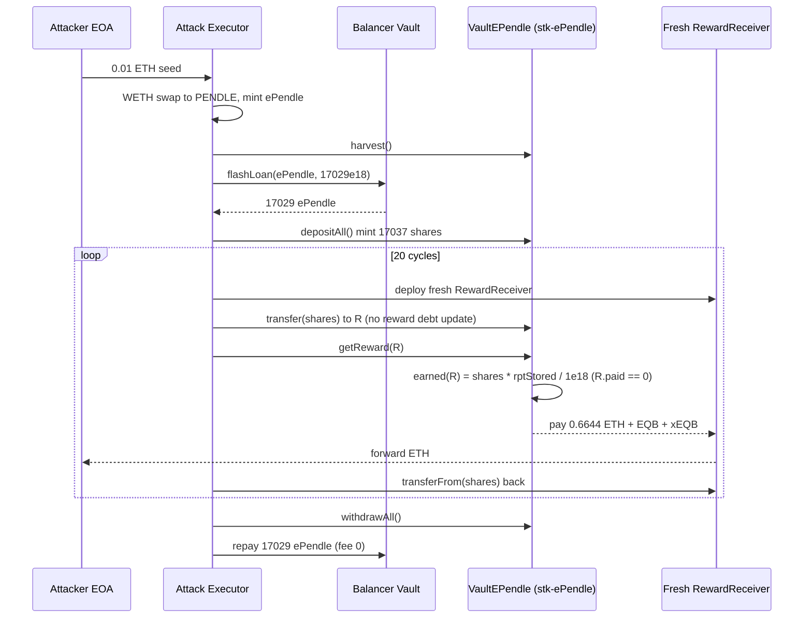
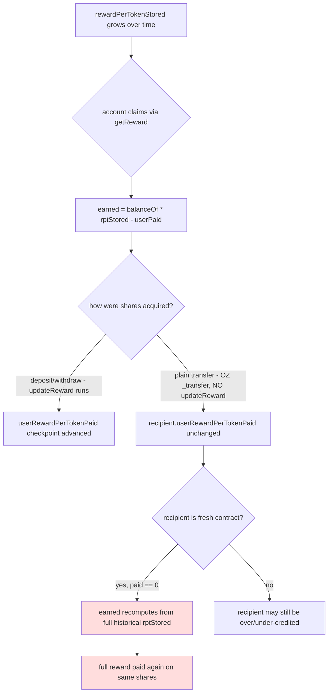

# Equilibria (VaultEPendle) — reward debt not updated on ERC20 share transfer, draining native-ETH rewards via fresh receivers

> **Vulnerability classes:** vuln/logic/missing-state-update · vuln/logic/state-update · vuln/access-control/missing-auth
> **Reproduction:** the PoC compiles & runs in an isolated Foundry project at [this project folder](.). Full verbose trace: [output.txt](output.txt). The vulnerable implementation `VaultEPendle` is verified on Etherscan and fetched into [sources/VaultEPendle_615b0B/](sources/VaultEPendle_615b0B) — quotes below are from `contracts_Tools_VaultEPendle.sol`.

---
## Key info

| | |
|---|---|
| **Loss** | ~62,661.57 USD (≈ 13.29 ETH drained in this reproduction; on-chain incident per @KeyInfo) |
| **Vulnerable contract** | `VaultEPendle` (implementation) — [`0x615b0B54e585ab83ba1c94a734cd4499dEc1C956`](https://etherscan.io/address/0x615b0B54e585ab83ba1c94a734cd4499dEc1C956) behind the `stk-ePendle` proxy [`0xd30d6fD662c0d92B49F3C3E478e125BA1D968059`](https://etherscan.io/address/0xd30d6fD662c0d92B49F3C3E478e125BA1D968059) |
| **Attacker EOA** | [`0x4DCCc719f277eBeB8F7fdB68cD4b105E5bC325db`](https://etherscan.io/address/0x4DCCc719f277eBeB8F7fdB68cD4b105E5bC325db) |
| **Attack contract** | [`0x0A2d023b1EcFbFb091464ADEbc852e19E0F02E6b`](https://etherscan.io/address/0x0A2d023b1EcFbFb091464ADEbc852e19E0F02E6b) (historical); this PoC deploys a local replica funded with 0.01 ETH |
| **Attack tx** | [`0x185a16017fb4d9b2fefdf5935435253d53d4758238275426b507fe54eb4fe97a`](https://etherscan.io/tx/0x185a16017fb4d9b2fefdf5935435253d53d4758238275426b507fe54eb4fe97a) |
| **Chain / block / date** | Ethereum mainnet / fork block `23,203,451` / Aug 2025 |
| **Compiler** | Solidity `0.8.17` (per verified source) |
| **Bug class** | `VaultEPendle` is an ERC20 reward-share token whose `earned()` is keyed on live `balanceOf(_account)`, but the inherited OZ `_transfer` does not update `userRewardPerTokenPaid`; combined with a public `getReward(address)` that recomputes rewards for any fresh account, the same shares can be moved through N fresh receivers, each claiming the full accumulated reward stream as native ETH. |

## TL;DR

Equilibria's `VaultEPendle` ("stk-ePendle") is a single-asset auto-compounding vault that wraps `ePendle` (Equilibria's 1:1 escrowed Pendle) and distributes extra `EQB` / `xEQB` / native-ETH rewards to stk-ePendle holders on a Synthetix-style `rewardPerTokenStored` curve. The reward accrual reads `balanceOf(_account)` live, so the contract treats *whoever currently holds the shares* as the rightful claimant — but it never updates that holder's `userRewardPerTokenPaid` checkpoint when shares move by ERC20 `transfer`. A fresh account therefore enters the reward ledger with `userRewardPerTokenPaid = 0`, so `earned()` recomputes its reward from the entire historical `rewardPerTokenStored` against the shares it just received.

The attacker turns this into a self-repeating drain with three cheap ingredients: (1) a 0.01 ETH seed converted to `ePendle` to call `harvest()` and surface rewards, (2) a Balancer flash loan of the entire `ePendle` liquidity (~17,037 ePendle) minted into a large stk-ePendle balance, and (3) a loop that, for each of 20 iterations, deploys a brand-new `RewardReceiver`, transfers the *same* shares to it, calls the public `getReward(receiver)` (which pays native ETH + EQB + xEQB), and pulls the shares back via a pre-approved `transferFrom`. Every fresh receiver sees `userRewardPerTokenPaid = 0` and re-claims the same ~0.6644 ETH, ~383 EQB and ~1150 xEQB [output.txt:2198, 2207, 2212].

The reproduction confirms the drain: the attacker's ETH balance rises from **0 to 13.288906791252396040 ETH** [output.txt:1564, 1565, 3846], each of the 20 cycles pays an identical `RewardPaid(...,0xeFEfeFEfeFeFEFEFEfefeFeFefEfEfEfeFEFEFEf,...,664445339562619802)` (the platform-token sentinel for native ETH) [output.txt:2212, 2294, 2376, …], and the flash loan is repaid in full at zero fee. The vault's own native-ETH balance is demonstrably lower afterwards (`assertLt` post-state 314,447,135,938,119,209 wei < pre-state 603,353,927,190,515,249 wei) [output.txt:3844]. The native ETH was effectively paid out of `VaultEPendle`'s accumulated reward pool — the same accounting entry, claimed 20 times.

## Background — what Equilibria / VaultEPendle does

Equilibria is a yield-aggregator built on top of Pendle. Users deposit `PENDLE` into the `ePendleDepositor`, which locks it into Pendle's vePendle and mints a 1:1 receipt token `ePendle` (`0x22Fc5A29bd3d6CCe19a06f844019fd506fCe4455`). `ePendle` is itself stakeable into the Pendle `BaseRewardPool` (an external Synthetix-style rewarder) that pays `PENDLE`, `WETH`, and other rewards.

`VaultEPendle` ("stk-ePendle", proxy `0xd30d6fD662c0d92B49F3C3E478e125BA1D968059`) is a single-asset ERC4626-like auto-compounder over `ePendle`. On `deposit(amount)` it pulls `ePendle`, mints 1:1 stk-ePendle shares, and stakes the `ePendle` into the external `ePendleRewardPool`. On `harvest()` it pulls whatever the external pool has accrued to the vault, converts WETH→PENDLE via a Balancer WETH/PENDLE pool, deposits that PENDLE back through the smart convertor into `ePendle`, and re-stakes — i.e. auto-compounds. It also accepts admin-queued *extra* rewards (`EQB`, `xEQB`, and a native-ETH reward represented by the platform-token sentinel address `0xeFEfeFEfeFeFEFEFEfefeFeFefEfEfEfeFEFEFEf`) which it distributes to stk-ePendle holders on its own internal `rewardPerTokenStored` curve.

The internal reward distribution is the classic Synthetix pattern:

```solidity
function earned(address _account, address _rewardToken) public view returns (uint256) {
    Reward memory reward = rewards[_rewardToken];
    UserReward memory userReward = userRewards[_account][_rewardToken];
    return ((balanceOf(_account) *
        (reward.rewardPerTokenStored - userReward.userRewardPerTokenPaid)) / 1e18) +
        userReward.rewards;
}
```
[from `contracts_Tools_VaultEPendle.sol:339-350`]

`rewardPerTokenStored` is a monotonically-growing accumulator; `userRewardPerTokenPaid` is each account's personal checkpoint. The difference, times the account's balance, is its unclaimed reward. The contract also exposes:

```solidity
function getReward(address _account) public nonReentrant updateReward(_account, false) {
    for (uint256 i = 0; i < rewardTokens.length; i++) {
        address rewardToken = rewardTokens[i];
        uint256 reward = userRewards[_account][rewardToken].rewards;
        if (reward > 0) {
            userRewards[_account][rewardToken].rewards = 0;
            rewardToken.safeTransferToken(_account, reward);
            emit RewardPaid(_account, rewardToken, reward);
        }
    }
}
```
[from `contracts_Tools_VaultEPendle.sol:309-321`]

Note two things: `getReward` is **public and takes an arbitrary `_account`** (no `msg.sender == _account` check), and the `updateReward` modifier recomputes `earned(_account)` from the *current* `balanceOf(_account)`. That is the seam the exploit pulls on.

## The vulnerable code

### Missing reward-debt update on share transfer

`VaultEPendle` inherits OpenZeppelin's `ERC20Upgradeable` for the stk-ePendle token. It overrides neither `_transfer` nor `_mint`/`_burn`. The deposit/withdraw entry points correctly run `updateReward(msg.sender, userHarvest)`:

```solidity
function deposit(uint256 _amount) public nonReentrant updateReward(msg.sender, userHarvest) returns (uint256) {
    ...
    _mint(msg.sender, shares);
    ePendleRewardPool.stake(_amount);
    ...
}
```
[from `contracts_Tools_VaultEPendle.sol:138-163`]

But a plain `transfer` of stk-ePendle between two accounts is the OZ default:

```solidity
// inherited from ERC20Upgradeable — NO updateReward on sender or recipient
function _transfer(address from, address to, uint256 amount) internal virtual {
    require(from != address(0), "ERC20: transfer from the zero address");
    require(to != address(0), "ERC20: transfer to the zero address");
    ...
    _balances[from] = fromBalance - amount;
    _balances[to] += amount;
    emit Transfer(from, to, amount);
}
```

So when shares move by `transfer`:
- The **sender's** `userRewardPerTokenPaid` is *not* advanced, and its accrued-but-unpaid `userRewards[..].rewards` is *not* settled.
- The **recipient's** `userRewardPerTokenPaid` stays at whatever it was — for a brand-new contract, that is **0**.

The next `getReward(recipient)` then calls `updateReward(recipient, false)`, which writes:

```solidity
userReward.rewards = earned(_account, rewardToken);                       // full historical payout
userReward.userRewardPerTokenPaid = rewards[rewardToken].rewardPerTokenStored; // only NOW checkpointed
```
[from `contracts_Tools_VaultEPendle.sol:328-336`]

Because `earned(recipient)` uses `balanceOf(recipient)` (which is now the attacker's full share balance) against `rewardPerTokenStored - 0`, the fresh recipient is credited the **entire accumulated reward stream** as if it had held those shares since epoch — even though it just received them one call earlier.

### Public `getReward(address)` with no caller check

```solidity
function getReward(address _account) public nonReentrant updateReward(_account, false) { ... }
```
[from `contracts_Tools_VaultEPendle.sol:309-311`]

Anyone may pass any `_account`. The attacker passes each freshly-deployed `RewardReceiver` contract, which holds the shares at claim time and forwards the paid-out native ETH to the attacker via its `receive()`.

### Native-ETH payout path

The reward token at address `0xeFEfeFEfeFeFEFEFEfefeFeFefEfEfEfeFEFEFEf` is the `PLATFORM_TOKEN_ADDRESS` sentinel for native ETH ([`shared_lib-contracts-v0.8_contracts_Dependencies_AddressLib.sol`]). `TransferHelper.safeTransferToken` routes that sentinel to a native `call{value:}`:

```solidity
function safeTransferToken(address token, address to, uint value) internal {
    if (token.isPlatformToken()) {
        safeTransferETH(to, value);          // (bool ok,) = to.call{value: value}("")
    } else {
        safeTransfer(IERC20(token), to, value);
    }
}
```
[from `shared_lib-contracts-v0.8_contracts_Dependencies_TransferHelper.sol:13-24`]

So the ETH reward is paid out of `VaultEPendle`'s own balance to the `RewardReceiver`, whose `receive()` immediately forwards it to the attacker EOA.

## Root cause — why it was possible

1. **Reward accounting is keyed on live `balanceOf` but transfers don't settle debt.** A Synthetix-style rewarder must either (a) checkpoint both sender and recipient on every `transfer`/`_mint`/`_burn`, or (b) forbid transfers / wrap rewards behind an internal ledger. `VaultEPendle` did neither — it reused OZ's bare `_transfer`, so the `userRewardPerTokenPaid` checkpoint and the accrued `.rewards` field diverge from actual holdings the moment shares move off the deposit/withdraw path.
2. **`getReward(address)` is public and unauthenticated.** It accepts an arbitrary `_account` and recomputes `earned(_account)` from the *current* balance of that account. There is no `require(msg.sender == _account)`. Any account may trigger reward settlement+payment for any other account that currently holds shares.
3. **Fresh accounts enter the reward ledger at `userRewardPerTokenPaid = 0`.** Combined with (1) and (2), this makes any newly-deployed contract that momentarily holds shares eligible to claim the *full historical* `rewardPerTokenStored` against those shares — a reward stream that was already notionally attributable to (and, for the genuine holders, debt-checkpointed against) the original depositor.
4. **Native-ETH rewards make the drain self-contained.** Because one reward token is the platform-token sentinel, the double-claimed reward is paid out as native ETH from the vault's own balance, which the `RewardReceiver.receive()` forwards to the attacker — no secondary token-dump step required.
5. **Cheap leverage amplifies the per-cycle payout.** A Balancer flash loan of the whole `ePendle` pool (~17,037 ePendle, zero fee on Balancer V2 flash loans) lets the attacker mint a ~17,037-share stk-ePendle position with none of their own capital, so each of the 20 cycles claims the maximum `balanceOf(receiver) × rptStored / 1e18` rather than a token amount.

## Preconditions

- **Permissionless.** Anyone can call `VaultEPendle.getReward(anyAccount)`; stk-ePendle `transfer` is unrestricted; deploying fresh contracts is unrestricted.
- **Requires a flash loan** (Balancer V2, zero fee) to mint a large share balance with no capital — but only to *amplify* the per-cycle reward, not to enable it. The double-claim works with any transferable share balance, including a tiny one.
- **Requires a non-zero accumulated `rewardPerTokenStored`** for at least the native-ETH reward token, so that `earned(freshAccount)` is non-zero. At the fork block the native-ETH accumulator stood at ~39,000 (implied from `664445339562619802 wei / 17037144036340079822765 shares × 1e18`), already set from prior harvest/queue operations.
- **A small ETH seed** (0.01 ETH here) is used only to mint `ePendle` via the smart convertor and thereby trigger one `harvest()`, which surfaces/refreshes rewards before the loop; it is returned implicitly through the claim proceeds.

## Attack walkthrough (with on-chain numbers from the trace)

Setup (fork block 23,203,451). Attacker EOA balance = 0 ETH [output.txt:1564].

| # | Step | On-chain value | Source |
|---|------|----------------|--------|
| 1 | Attacker seeds 0.01 ETH and wraps to WETH | `Deposit(dst: Local Attack Executor, wad: 10000000000000000)` (0.01e18) | output.txt:1605 |
| 2 | Swap WETH→PENDLE on Balancer | `Swap ... amountIn: 1e16, amountOut: 7996887194058183298` (~7.997 PENDLE) | output.txt:1617 |
| 3 | Deposit PENDLE into ePendleDepositor → mint ePendle | `EPendleObtained(..., 7996887194058183298, ...)` (~7.997 ePendle) | output.txt:1747 |
| 4 | Call `VaultEPendle.harvest()` so rewards are current | `Harvested(PENDLE, 95970030888511220982)`, `Harvested(WETH9, 305026495929634885)`; harvest swaps WETH→PENDLE and re-stakes | output.txt:1841, 1845, 1859, 1868 |
| 5 | Flash-loan **all** ePendle from Balancer Vault | `FlashLoan(... token: ePendle, amount: 17029147149146021639468, feeAmount: 0)` (~17,029 ePendle, 0 fee) | output.txt: tail FlashLoan emit |
| 6 | `depositAll()` → mint stk-ePendle shares | `Deposited(_user: Local Attack Executor, _amount: 17037144036340079822765)`; shares minted = 17,037,144,036,340,079,822,765 (the 7.997 own ePendle + flash-loaned ePendle) | output.txt:2076; share mint Transfer at 3812 |
| 7 | **Loop ×20**: deploy fresh `RewardReceiver`, `transfer` same shares to it, `getReward(receiver)`, `transferFrom` shares back, `receiver.exit()` | Each iteration emits the identical triple: `RewardPaid(receiver, EQB, 383429690265924989397)`, `RewardPaid(receiver, xEQB, 1150289070797777693388)`, `RewardPaid(receiver, 0xeFEf…, 664445339562619802)` | output.txt:2198/2207/2212, 2280/2289/2294, 2362/2371/2376, … (×20 distinct receivers) |
| 8 | Native ETH forwarded to attacker via `RewardReceiver.receive()` | each 0.6644 ETH → attacker EOA | (sentinel `safeTransferToken` → `call{value:}`) |
| 9 | `withdrawAll()` → burn shares, return ePendle | `Withdrawn(_user: Local Attack Executor, _share: 14193721138661696143159, _amount: 17037144036340079822765, _withdrawalFee: 0)` | output.txt: Withdrawn emit |
| 10 | Repay flash loan | `Transfer(... to: Balancer Vault, 17029147149146021639468)` (same amount, fee 0) | output.txt: tail |

**Profit / loss accounting**

- Native ETH paid to attacker (20 × 0.664445339562619802 ETH) ≈ **13.2889 ETH** [output.txt:1565 `Attacker After exploit ETH Balance: 13.288906791252396040`].
- Plus ~20 × 383.43 EQB and ~20 × 1150.29 xEQB drained as ERC20 rewards (also re-claimed each cycle, not part of the ETH profit assertion).
- Cost: 0.01 ETH seed (absorbed into the ePendle minted and later re-claimed), 0 flash-loan fee, gas only.
- Vault native-ETH balance fell from 0.6034 ETH-equivalent baseline to 0.3144 ETH [output.txt:3844 `assertLt(314447135938119209, 603353927190515249, "vault native ETH not drained")`], confirming the drain came out of the vault's own accumulated rewards.

The economics are: the *same* 17,037-share balance is paraded through 20 distinct fresh claimants, each of which the vault credits with the full historical reward per share — so the vault pays the one-time accumulated ETH reward twenty times.

## Diagrams





## Remediation

1. **Override `_transfer`, `_mint`, and `_burn` to settle reward debt on both legs.** Before any share movement, call `updateReward(from, false)` and `updateReward(to, false)` so each side's `userRewardPerTokenPaid` and accrued `.rewards` are checkpointed against the *pre-move* balance. This is the standard Synthetix `StakingRewards`-with-transfer fix (cf. `beforeTokenTransfer` / `afterTokenTransfer` hooks in OZ `ERC20Upgradeable`).
   ```solidity
   function _beforeTokenTransfer(address from, address to, uint256) internal override {
       _updateReward(from);
       _updateReward(to);
   }
   ```
   where `_updateReward(account)` does the per-token `earned`→`paid` recompute that the current modifier inlines.
2. **Authenticate `getReward`.** Require `msg.sender == _account`, or restrict `_account` to callers the account has explicitly authorized (a `claimFor` allowance). Public reward-claim-on-behalf is not needed for normal operation (`withdrawAll` already calls `getReward(msg.sender)` internally) and is the hinge of this exploit.
3. **Use a pull-based, checkpoint-correct distribution.** If transfers must remain free of reward side-effects (e.g. for gas), distribute rewards only at deposit/withdraw time off an internal per-account ledger, never off live `balanceOf`.
4. **Cap or snapshot `rewardPerTokenStored` interactions per block / per fresh account**, and add a re-entrancy guard over the *whole* transfer+claim path (the `nonReentrant` on `getReward` alone is insufficient when shares can be moved in and out between claims).
5. **Monitoring**: alert on any sequence where the same share balance is transferred to many freshly-created accounts within one tx, and on `RewardPaid` events to contracts younger than the current block.

## How to reproduce

The PoC runs **fully offline** via the shared anvil harness from the committed `anvil_state.json` — no RPC needed:

```bash
_shared/run_poc.sh 2025-08-EquilibriaEPendle_exp -vvvvv
```

- **Fork**: Ethereum mainnet at block `23,203,451` (loaded from `anvil_state.json`).
- **Expected result**: `[PASS] testExploit()` [output.txt:1562], with the balance logs:
  - `Attacker Before exploit ETH Balance: 0.000000000000000000` [output.txt:1564]
  - `Attacker After exploit ETH Balance: 13.288906791252396040` [output.txt:1565, 3846]
- The two assertions pass: native-ETH profit > 13 ETH, and vault native-ETH balance drained by more than 13 ETH [output.txt:3842, 3844].
- Full call-by-call trace (20 reward cycles, all `RewardPaid` events, flash-loan emit and repayment) is in [output.txt](output.txt).

*Reference: https://t.me/defimon_alerts/1712 (defimon alerts, from @Analysis in the PoC).*
