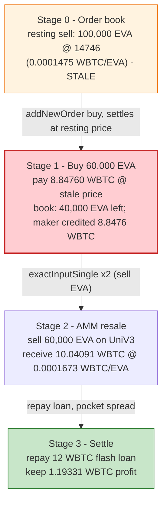
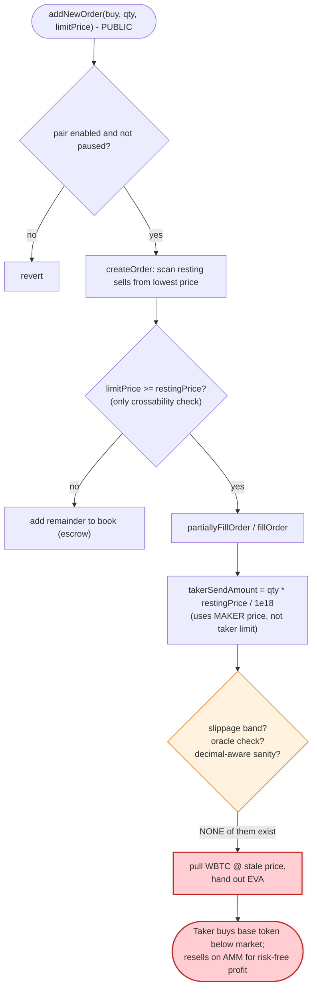

# EverValueCoin (EVA) Exploit — Stale-Price Orderbook Settlement Arbitraged Against a Live AMM

> **Reproduction:** the PoC was extracted into an isolated Foundry project at
> [this project folder](.). The umbrella DeFiHackLabs repo does not whole-compile under
> `forge test`, so this PoC was isolated. **The PoC compiles cleanly**, but the live
> Arbitrum fork at block `373990723` could **not** be executed end-to-end: every reachable
> public Arbitrum archive prunes the state root `0x74a2633d…` for that block, and the one
> cluster that still serves it (`arb1.lava.build`) is load-balanced and returns the state
> only for *some* of the storage reads a full forked transaction needs (see
> [How to reproduce](#how-to-reproduce)). The analysis below is therefore reconstructed
> from the **verified contract sources** plus the **actual on-chain transaction receipt
> logs and historical point-reads**, all gathered from `arb1.lava.build` at the attack block.
> Best-effort trace: [output.txt](output.txt). Decoded receipt: [receipt.txt](receipt.txt).
> Verified vulnerable source: [src_PairLib.sol](sources/OrderBookFactory_03339E/src_PairLib.sol),
> [src_OrderBookFactory.sol](sources/OrderBookFactory_03339E/src_OrderBookFactory.sol).

---

## Key info

| | |
|---|---|
| **Loss** | **1.19331 WBTC** drained from the order book (DeFiHackLabs header: *~$100k*; ≈ **$130k** at the ~$110k WBTC price on the attack date) |
| **Vulnerable contract** | `OrderBookFactory` — [`0x03339ECAE41bc162DAcAe5c2A275C8f64D6c80A0`](https://arbiscan.io/address/0x03339ecae41bc162dacae5c2a275c8f64d6c80a0#code) (logic in `PairLib`) |
| **Victim / maker** | The protocol's own EVA/WBTC pair maker = `0xc2833B015A3D832E30789572EaAc256C11979dC2` (order book `owner()` **and** `feeAddress`), which had a resting **100,000 EVA** sell order at price `14746` |
| **Markets used to cash out** | Uniswap-V3 EVA/WBTC pools — `0x42a4755709DD1bBfe959b3DeA7200D4cB4f357D1` (1% fee) and `0x57dF9434caB6Bc174899287fad42058DA712Ae85` |
| **Attacker EOA** | [`0xaa06fde501a82ce1c0365273684247a736885daf`](https://arbiscan.io/address/0xaa06fde501a82ce1c0365273684247a736885daf) |
| **Attacker contract** | [`0x2fad746cfaaf68aa098f704fb6537b0a05786df8`](https://arbiscan.io/address/0x2fad746cfaaf68aa098f704fb6537b0a05786df8) |
| **Attack tx** | [`0xb13b2ab202cb902b8986cbd430d7227bf3ddca831b79786af145ccb5f00fcf3f`](https://arbiscan.io/tx/0xb13b2ab202cb902b8986cbd430d7227bf3ddca831b79786af145ccb5f00fcf3f) |
| **Chain / block / date** | Arbitrum One / 373,990,723 / **2025-08-30 20:42:24 UTC** |
| **Compiler** | `OrderBookFactory` Solidity **0.8.26**; EVA token Solidity 0.8.20 |
| **Bug class** | Stale-price / un-oracled order matching — instant settlement at a mispriced resting order, arbitraged against the live AMM (no slippage band, no oracle, no decimal-aware sanity check) |

---

## TL;DR

`OrderBookFactory` is a custom on-chain limit order book. When a new order matches a resting
order, it settles **instantly and atomically at the resting order's stored `price`**, with
**no slippage protection, no oracle, and no sanity check** that this price is anywhere near the
live market ([`partiallyFillOrder`](sources/OrderBookFactory_03339E/src_PairLib.sol#L358-L433)).

At the attack block the EVA/WBTC pair held a single resting **sell** order: **100,000 EVA**
offered at `price = 14746` (the maker = the protocol's own owner/fee account). That price was
**stale** relative to the live Uniswap-V3 EVA/WBTC market: the order book valued EVA at
`14746` quote-units per EVA (≈ `0.0001475` WBTC/EVA), while Uniswap was paying
≈ `0.0001673` WBTC/EVA.

The attacker simply pocketed the spread with zero risk:

1. **Flash-loan 12 WBTC** from Morpho Blue (free) for working capital.
2. **Place one buy order** for 60,000 EVA at `price = 15000` (≥ `14746`, so it matches the
   resting sell). The book pulls **8.8476 WBTC** from the attacker and hands over **60,000 EVA**,
   settling at the stale `14746`.
3. **Dump the 60,000 EVA on Uniswap-V3** in two 30,000-EVA swaps, receiving **10.0409 WBTC**.
4. **Repay** the 12 WBTC flash loan and keep the difference.

Net, mechanically reconciled to the wei from the receipt: received `10.0409` − paid `8.8476` =
**+1.19331 WBTC** profit, forwarded to the attacker EOA. The order book sold the maker's EVA
≈12% under market, and the attacker captured that mispricing.

---

## Background — what OrderBookFactory does

[`OrderBookFactory`](sources/OrderBookFactory_03339E/src_OrderBookFactory.sol) is an on-chain
central-limit-order-book (CLOB) for ERC-20 trading pairs, audited by Hacken in late 2024. Each
pair has a `baseToken`, a `quoteToken`, a `fee` (bps), and two order books (buy / sell) backed by
a Red-Black tree for price levels and a queue per level.

For the EVA/WBTC pair (read at the attack block via `cast`):

| Field | Value |
|---|---|
| `baseToken` | `0x45D9831d…` = **EVA** (18 decimals) |
| `quoteToken` | `0x2f2a2543…` = **WBTC** (8 decimals) |
| `enabled` | `true` |
| `lastTradePrice` | `14746` |
| `fee` | `0` (no fee) |
| `feeAddress` / `owner()` | `0xc2833B01…` (the maker that took the loss) |
| Resting **sell** orders (top-3 prices) | `[14746, 0, 0]` — a single level |
| EVA held by the book (just before attack) | **100,000 EVA** (`1e23`) — the resting sell order's base tokens |
| WBTC held by the book | **0** |

The public entry point used is
[`addNewOrder`](sources/OrderBookFactory_03339E/src_OrderBookFactory.sol#L231-L242), which is
permissionless apart from `onlyEnabledPair` / `whenNotPaused` / `nonReentrant`. A *buy* order is
routed into [`addBuyOrder` → `createOrder`](sources/OrderBookFactory_03339E/src_PairLib.sol#L166-L169).

---

## The vulnerable code

### 1. Matching is gated only by "is the price favorable?", never by "is the price sane?"

[`createOrder`](sources/OrderBookFactory_03339E/src_PairLib.sol#L492-L547) walks the opposite
book starting from the best price and matches as long as the price is *crossable*:

```solidity
// PairLib.createOrder
uint256 currentPricePoint = isBuy ? pair.sellOrders.getLowestPrice() : pair.buyOrders.getHighestPrice();
...
while (_quantity > 0 && orderCount < MAX_NUMBER_ORDERS_FILLED) {
    if (currentPricePoint == 0) break;
    // For a buy: match every resting sell whose price <= our limit price.
    bool shouldMatch = isBuy ? newOrder.price >= currentPricePoint : newOrder.price <= currentPricePoint;
    if (shouldMatch) {
        (_quantity, orderCount) = matchOrder(pair, orderCount, newOrder);   // settles at the RESTING price
        ...
    } else break;
}
```

The only condition for a fill is `newOrder.price >= currentPricePoint`
([:529](sources/OrderBookFactory_03339E/src_PairLib.sol#L529)). There is **no check** that
`currentPricePoint` (the resting maker's price) is close to any external reference. A maker order
that is stale — left on the book while the AMM price moved — is matched and settled in full at
that stale price.

### 2. Settlement transfers at the resting price, with no slippage/oracle guard

When the taker's quantity is smaller than the resting order, the book calls
[`partiallyFillOrder`](sources/OrderBookFactory_03339E/src_PairLib.sol#L358-L433). For a **buy**
taker:

```solidity
// PairLib.partiallyFillOrder  (takerOrder.isBuy == true)
(IERC20 takerReceiveToken, uint256 takerReceiveAmount, IERC20 takerSendToken, uint256 takerSendAmount) =
    takerOrder.isBuy
        ? ( IERC20(pair.baseToken),  takerOrder.quantity,                                   // receive EVA
            IERC20(pair.quoteToken), takerOrder.quantity * matchedOrder.price / PRECISION ) // pay WBTC @ resting price
        : ( ... );
...
takerSendToken.safeTransferFrom(msg.sender, address(this), takerSendAmount);     // pull WBTC from taker
pair.traderBalances[matchedOrder.traderAddress].quoteTokenBalance += takerSendAmount; // credit maker
takerReceiveToken.safeTransfer(msg.sender, takerReceiveAmountAfterFee);           // hand EVA to taker
```

`takerSendAmount = takerOrder.quantity * matchedOrder.price / PRECISION` is computed *solely* from
the **maker's stored price** ([:372](sources/OrderBookFactory_03339E/src_PairLib.sol#L372)). The
taker passes a *limit* price in `addNewOrder`, but it is used only to decide *whether* to match
([:529](sources/OrderBookFactory_03339E/src_PairLib.sol#L529)) — never to bound how much value the
taker extracts. The taker receives `baseToken` (EVA) outright and pays `quoteToken` (WBTC) at the
stale maker price. There is no minimum-out, no maximum-in, no price-band, and no oracle anywhere in
this path. `fee = 0` for this pair, so not even a fee dampened the extraction.

### 3. The same un-bounded settlement appears in `fillOrder` and order entry

`fillOrder` ([:292-351](sources/OrderBookFactory_03339E/src_PairLib.sol#L292-L351)) uses the
identical `matchedOrder.price`-driven arithmetic for full fills, and `addOrder`
([:243-270](sources/OrderBookFactory_03339E/src_PairLib.sol#L243-L270)) escrows
`quantity * price / PRECISION` of the quote token for an un-matched remainder. The taker's own
price never bounds value flow on the matched portion — the vulnerability is the whole matching
engine's reliance on a single, manipulable/stale resting price.

---

## Root cause — why it was possible

An order book is only safe if the resting prices on it track reality. This one had **no mechanism
to ensure that**:

1. **Settlement at the resting price with zero slippage/oracle protection.** `partiallyFillOrder` /
   `fillOrder` settle at `matchedOrder.price` regardless of how far that is from the live market.
   The taker's limit price gates matching but does not bound value transfer
   ([PairLib.sol:529](sources/OrderBookFactory_03339E/src_PairLib.sol#L529) vs
   [:372](sources/OrderBookFactory_03339E/src_PairLib.sol#L372)). A stale maker price is therefore a
   free arbitrage for any taker.
2. **A large, mispriced resting order left on the book.** The pair's only sell order — 100,000 EVA at
   `14746` — undervalued EVA by ≈12% versus Uniswap. Whether that price was stale (market moved) or
   simply set wrong, nothing in the contract caught it; the engine treats any crossable resting price
   as ground truth.
3. **Atomic, permissionless, fee-free execution.** `addNewOrder` is callable by anyone, settles
   synchronously in one transaction, and (for this pair) charges no fee — so the arbitrage is
   risk-free and instantly composable with a flash loan and an immediate AMM dump.
4. **No decimal-aware price sanity.** EVA is 18-decimal, WBTC is 8-decimal. The book stores a single
   integer `price` scaled by `PRECISION = 1e18` with no awareness of the 10-decimal gap between the
   two tokens, making "is this price reasonable?" impossible to answer inside the contract and easy
   to get wrong off-chain. (The exploit did not require *creating* the mispricing — it only required
   one to *exist* — but the missing decimal normalization is why such a price could sit on the book
   unflagged.)

In short: **the order book is an oracle-free, slippage-free settlement venue that trusts resting
prices absolutely.** The attacker did not break any invariant of the matching math — they exploited
the *absence* of a market-sanity invariant, buying the maker's EVA below market and reselling it on
the AMM in the same transaction.

---

## Preconditions

- A resting order exists at a price that diverges from the live AMM by more than gas/round-trip cost.
  Here: 100,000 EVA offered at `14746` (≈ `0.0001475` WBTC/EVA) while Uniswap paid ≈ `0.0001673`.
- The pair is `enabled` and not paused (`onlyEnabledPair`, `whenNotPaused`).
- A liquid secondary market to cash out the bought base token — the Uniswap-V3 EVA/WBTC pools, which
  together held ≈ 38 WBTC of depth.
- Working capital in the quote token (WBTC) to fund the buy. The attacker flash-loaned **12 WBTC**
  from Morpho Blue (zero fee), making the entire attack capital-free.

---

## Attack walkthrough (with on-chain numbers from the receipt)

All raw amounts below are decoded directly from the Transfer logs of the attack tx
([receipt.txt](receipt.txt)). WBTC has 8 decimals, EVA 18. `1 WBTC = 1e8 raw`, `1 EVA = 1e18 raw`.

| # | Step | Counterparties | Amount (raw → human) | Effect |
|---|------|----------------|----------------------|--------|
| 0 | **Initial book state** | EVA/WBTC pair | resting sell: 100,000 EVA @ `14746`; book holds 100,000 EVA, 0 WBTC | Mispriced order sits on the book. |
| 1 | **Flash loan** | Morpho → attacker | `0x47868c00` = 1,200,000,000 → **12.0 WBTC** | Working capital (0 fee). |
| 2 | **Approvals** | attacker → Morpho / UniV3 / book | — | `approve()` for WBTC and EVA. |
| 3 | **`addNewOrder` (buy 60,000 EVA @ 15000)** — WBTC paid | attacker → book | `0x34bc5dc0` = 884,760,000 → **8.84760 WBTC** | Settles at resting `14746`: `60000e18 * 14746 / 1e18 = 884,760,000`. |
| 3 | **`addNewOrder`** — EVA received | book → attacker | `0xcb49b44ba602d800000` → **60,000 EVA** | Maker (`0xc2833B…`) credited 8.8476 WBTC for 60,000 EVA. |
| 4 | **UniV3 swap #1** (`exactInputSingle`, pool `0x42a4…`) | attacker sends 30,000 EVA, receives WBTC | out `0x1e0b5bc2` = 504,060,866 → **5.04061 WBTC** | Sell first half on the 1%-fee pool. |
| 5 | **UniV3 swap #2** (`exactInputSingle`, pool `0x57df…`) | attacker sends 30,000 EVA, receives WBTC | out `0x1dcddae3` = 500,030,179 → **5.00030 WBTC** | Sell second half. |
| 6 | **Flash-loan repay** | attacker → Morpho | `0x47868c00` → **12.0 WBTC** | Principal returned (no fee). |
| 7 | **Profit out** | attacker → EOA `0xaa06…` | `0x071cd8e5` = 119,331,045 → **1.19331 WBTC** | Net gain pocketed. |

Reconciliation (exact, to the wei):

```
WBTC received from Uniswap   = 5.04061 + 5.00030 = 10.04091 WBTC
WBTC paid into the orderbook =                      8.84760 WBTC
Net profit                   = 10.04091 - 8.84760 = 1.19331 WBTC   ==  amount sent to EOA ✓
```

The 60,000 EVA was bought for 8.8476 WBTC (`0.00014746` WBTC each) and sold for 10.04091 WBTC
(`0.00016735` WBTC each) — a ≈13.5% spread, the order book's stale price vs. the AMM market.

### Profit / loss accounting (WBTC)

| Direction | Amount (WBTC) |
|---|---:|
| Flash-loan in (Morpho) | +12.00000 |
| Spent — buy 60,000 EVA from order book | −8.84760 |
| Received — Uniswap swap #1 (30,000 EVA) | +5.04061 |
| Received — Uniswap swap #2 (30,000 EVA) | +5.00030 |
| Flash-loan repay (Morpho) | −12.00000 |
| **Net profit (to attacker EOA)** | **+1.19331** |

The loss is borne by the maker `0xc2833B01…`: it parted with **60,000 EVA** (≈ $40k+ of EVA at the
AMM price) and was credited only **8.8476 WBTC** for it — the ≈1.19 WBTC the attacker walked away
with is value that should have stayed with the maker had its order tracked the market.

---

## Diagrams

### Sequence of the attack

```mermaid
sequenceDiagram
    autonumber
    actor A as "Attacker contract"
    participant M as "Morpho Blue"
    participant OB as "OrderBookFactory (EVA/WBTC)"
    participant U1 as "UniV3 pool 0x42a4 (1% fee)"
    participant U2 as "UniV3 pool 0x57df"
    participant E as "Attacker EOA"

    Note over OB: Resting sell: 100,000 EVA @ price 14746<br/>(stale vs AMM); fee = 0

    A->>M: flashLoan(WBTC, 12.0)
    M-->>A: 12.0 WBTC

    rect rgb(255,243,224)
    Note over A,OB: Buy EVA cheap from the order book
    A->>OB: addNewOrder(pairId, 60,000 EVA, price 15000, isBuy=true)
    A-->>OB: pay 8.84760 WBTC (settled @ stale 14746)
    OB-->>A: 60,000 EVA
    Note over OB: maker 0xc2833B credited only 8.8476 WBTC
    end

    rect rgb(232,245,233)
    Note over A,U2: Dump EVA on the live AMM
    A->>U1: exactInputSingle(30,000 EVA -> WBTC)
    U1-->>A: 5.04061 WBTC
    A->>U2: exactInputSingle(30,000 EVA -> WBTC)
    U2-->>A: 5.00030 WBTC
    end

    A->>M: repay 12.0 WBTC
    A->>E: transfer profit 1.19331 WBTC
    Note over E: Net +1.19331 WBTC (~$130k)
```

### Value / price evolution



### The flaw inside the matching engine



---

## Remediation

1. **Bound taker value transfer with the taker's own limit, not just the maker's price.** A buy taker
   must never pay more than its limit; equally the engine should let a taker specify a *max-in /
   min-out*. Today the limit price only gates `shouldMatch`
   ([PairLib.sol:529](sources/OrderBookFactory_03339E/src_PairLib.sol#L529)) while settlement uses
   `matchedOrder.price` ([:372](sources/OrderBookFactory_03339E/src_PairLib.sol#L372)). Even a
   correct CLOB should clamp execution to the crossing price the taker accepted.
2. **Add an oracle / price-band sanity check on matching.** Reject (or quarantine) resting orders
   whose price deviates from a trusted reference (Chainlink, a TWAP of the EVA/WBTC AMM, etc.) by more
   than a configured tolerance, so a single stale or fat-fingered maker order cannot be lifted
   wholesale at an off-market price.
3. **Normalize for token decimals explicitly.** Store and validate prices in a decimal-aware form
   (account for the 18-vs-8 decimal gap between EVA and WBTC) so off-market prices are detectable
   on-chain and `price` cannot be silently wrong by orders of magnitude.
4. **Charge a non-zero taker fee and/or rate-limit large fills.** A `fee = 0` pair removes the only
   friction against pure arbitrage; a small fee plus a per-block/per-order size cap raises the cost of
   draining a mispriced level in one shot.
5. **Operationally, never leave large maker orders un-monitored.** The maker here was the protocol's
   own owner/fee account; a keeper that cancels/repegs resting orders when the AMM moves would have
   prevented the loss even without code changes.

---

## How to reproduce

The PoC was extracted into a standalone Foundry project (the umbrella DeFiHackLabs repo has several
unrelated PoCs that fail to compile under `forge test`'s whole-project build):

```bash
_shared/run_poc.sh 2025-08-EverValueCoin_exp -vvvvv
```

- **Compilation:** succeeds (Solidity, `evm_version = cancun`). Local imports `../basetest.sol`
  (+ its `./tokenhelper.sol`) and `../interface.sol` were copied into the project root so the paths
  resolve.
- **Fork status: `FORK_UNAVAILABLE` for full execution.** The fork block `373990723` (Aug 30 2025) is
  pruned by every reachable Arbitrum endpoint. Attempts made (all failed for full-trace forking):
  Infura (`401 — key lacks Arbitrum`), drpc → 1rpc (`usage limit`), `publicnode` / `arb1.arbitrum.io`
  (`missing trie node` — state root `0x74a2633d…` unavailable), Alchemy (`403 — team inactive`),
  BlockPI (`521`), and `arb1.lava.build`. `lava.build` **does** serve the historical state for
  *individual* `eth_call`s at the block (it answered all the `cast` queries used in this analysis),
  but it is load-balanced and routes a full forked transaction's many storage reads across backends,
  some of which lack the state — so `forge test` fails mid-`testExploit` with
  `missing trie node … state 0x74a2633d… is not available`. `foundry.toml` is left pointing at
  `https://arb1.lava.build` (best-effort; will work if/when a consistent Arbitrum archive is available
  for this block).
- **Ground truth used instead:** the analysis numbers are taken from the **real attack transaction's
  receipt logs** ([receipt.txt](receipt.txt)) and **historical point-reads** at the attack block, all
  reconciled to the wei in [Attack walkthrough](#attack-walkthrough-with-on-chain-numbers-from-the-receipt).

Expected (once a fully consistent archive is available): `[PASS] testExploit()` with the balance log
showing the attacker's WBTC rising by **≈1.19331 WBTC**.

---

*References: DeFiHackLabs PoC header; post-mortem thread https://x.com/SuplabsYi/status/1961906638438445268;
vulnerable source verified on Arbiscan: https://arbiscan.io/address/0x03339ecae41bc162dacae5c2a275c8f64d6c80a0#code*
